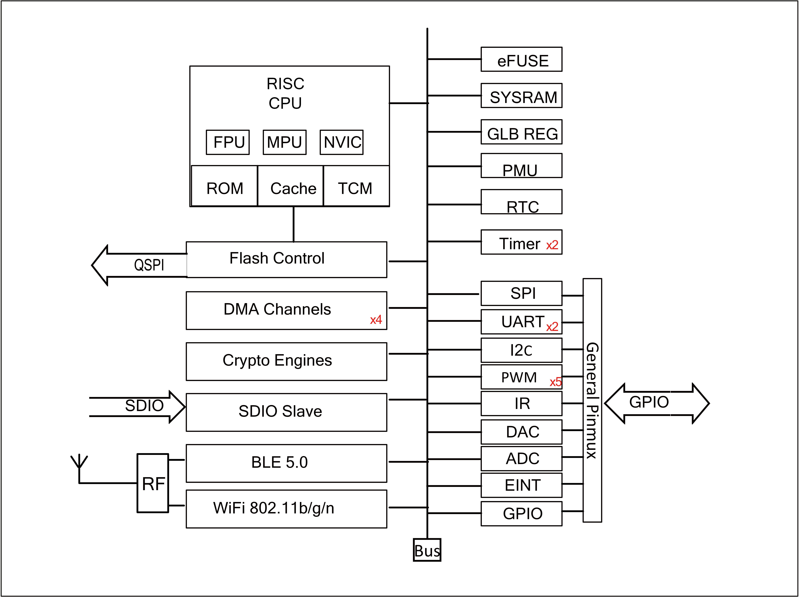
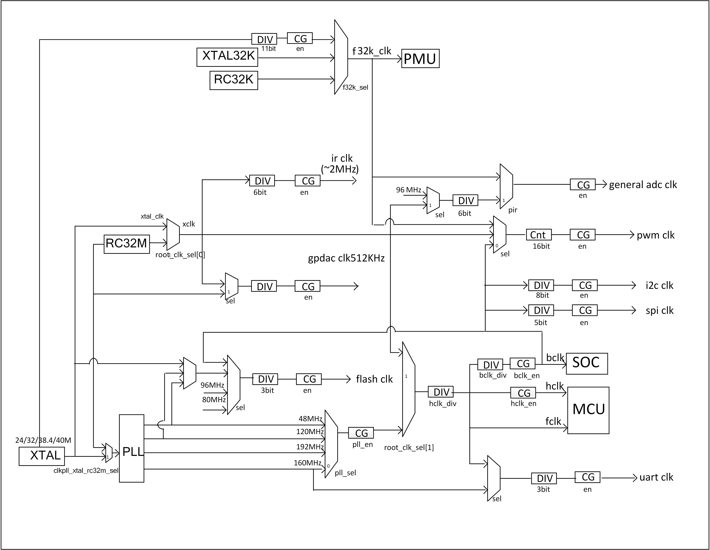

========================
Functional Description
========================
BL602/BL604 main functions described as follows：

   System Architecture

CPU
=====
BL602/BL604 32-bit RISC CPU contains FPU (floating-point unit) for 32-bit 
single-precision arithmetic, three-stage pipelined (IF, EXE, WB), 
compressed 16 and 32-bit instruction set, 
standard JTAG debugger port including 4 hardware-programmable breakpoints, 
interrupt controller including 64 interrupts and 16 interrupt levels/priorities 
for low latency interrupt processing. 
Up to 192MHz clock frequency, 
can be dynamically configured to change clock frequency, 
enter the power saving mode to achieve low power consumption.

Both WiFi/BLE stack and application run on single 32-bit RISC CPU for simple and ultra-low power applications. CPU performance ~1.46 DMIPS/MHz. ~3.1 CoreMark/MHz.

Cache
=============
BL602/BL604 cache improves CPU performance to access external memory. 
Cache memories can be partially or fully configured as TCM (tightly coupled memory).

Memory
=============
BL602/BL604 memories include: on-chip zero-delay SRAM memories, read-only memories, 
write-once memories, 
embedded flash memory (optional).

DMA
==========
BL602/BL604 DMA (direct memory access) controller has four dedicated channels 
that manage data transfer between peripherals and memories to improve cpu/bus 
efficiency. There are three main types of transfers including memory to memory, 
memory to peripheral, and peripheral to memory. DMA also supports LLI 
(link list item) that multiple transfers are pre-defined by a series of 
linked lists, then hardware automatically complete all transfers according 
to each LLI size and address. DMA supports peripheral UART, I2C, SPI, ADC 
and DAC.

Bus
=========
BL602/BL604 bus fabric connection and memory-map summarized as follows:

.. table:: Bus Connection

    +----------------+------------+-------+--------+---------------+---------+
    |  Slave/ Master |  CPU       | SDIO  | DMA    |Crypto Engine  | Debug   |
    +----------------+------------+-------+--------+---------------+---------+
    | SRAM           | V          | V     | V      |      V        | V       |
    +----------------+------------+-------+--------+---------------+---------+
    | Peripheral     | V          | V     | V      |      -        | V       |
    +----------------+------------+-------+--------+---------------+---------+
    |WiFi/BLE        | V          | V     | V      |      -        | V       |
    +----------------+------------+-------+--------+---------------+---------+

.. table:: Memory Map

    +--------+-----------------------+-------+-----------------------------------------------------------------------------------------------------------------------------------------+
    |Module  |Base Address           | Size  |    Description                                                                                                                          |
    +--------+-----------------------+-------+-----------------------------------------------------------------------------------------------------------------------------------------+
    | WRAM   | 0x42030000            | 112KB | Wireless SRAM memory                                                                                                                    |
    +--------+-----------------------+-------+-----------------------------------------------------------------------------------------------------------------------------------------+
    | RETRAM | 0x40010000            | 4KB   | Deep sleep memory (Retention RAM)                                                                                                       |
    +--------+-----------------------+-------+-----------------------------------------------------------------------------------------------------------------------------------------+
    | HBN    | 0x4000F000            | 4KB   | Deep sleep control (Hibernate)                                                                                                          |
    +--------+-----------------------+-------+-----------------------------------------------------------------------------------------------------------------------------------------+
    | PDS    | 0x4000E000            | 4KB   | Sleep control (Power Down Sleep)                                                                                                        |
    +--------+-----------------------+-------+-----------------------------------------------------------------------------------------------------------------------------------------+
    | SDU    | 0x4000D000            | 4KB   | SDIO control                                                                                                                            |
    +--------+-----------------------+-------+-----------------------------------------------------------------------------------------------------------------------------------------+
    | DMA    | 0x4000C000            | 4KB   | DMA control                                                                                                                             |
    +--------+-----------------------+-------+-----------------------------------------------------------------------------------------------------------------------------------------+
    | QSPI   | 0x4000B000            | 4KB   | Flash control                                                                                                                           |
    +--------+-----------------------+-------+-----------------------------------------------------------------------------------------------------------------------------------------+
    | IRR    | 0x4000A600            | 256B  | IR Remote control                                                                                                                       |
    +--------+-----------------------+-------+-----------------------------------------------------------------------------------------------------------------------------------------+
    | TIMER  | 0x4000A500            | 256B  | Timer control                                                                                                                           |
    +--------+-----------------------+-------+-----------------------------------------------------------------------------------------------------------------------------------------+
    | PWM    | 0x4000A400            | 256B  | Pulse Width Modulation *5 control                                                                                                       |
    +--------+-----------------------+-------+-----------------------------------------------------------------------------------------------------------------------------------------+
    | I2C    | 0x4000A300            | 256B  | I2C control                                                                                                                             |
    +--------+-----------------------+-------+-----------------------------------------------------------------------------------------------------------------------------------------+
    | SPI    | 0x4000A200            | 256B  | SPI master/slave control                                                                                                                |
    +--------+-----------------------+-------+-----------------------------------------------------------------------------------------------------------------------------------------+
    | UART1  | 0x4000A100            | 256B  | UART control                                                                                                                            |
    +--------+-----------------------+-------+-----------------------------------------------------------------------------------------------------------------------------------------+
    | UART0  | 0x4000A000            | 256B  | UART control                                                                                                                            |
    +--------+-----------------------+-------+-----------------------------------------------------------------------------------------------------------------------------------------+
    | L1C    | 0x40009000            | 4KB   | Cache control                                                                                                                           |
    +--------+-----------------------+-------+-----------------------------------------------------------------------------------------------------------------------------------------+
    | eFuse  | 0x40007000            | 4KB   | eFuse memory control                                                                                                                    |
    +--------+-----------------------+-------+-----------------------------------------------------------------------------------------------------------------------------------------+
    | TZ2    | 0x40006000            | 4KB   | Trust isolation                                                                                                                         |
    +--------+-----------------------+-------+-----------------------------------------------------------------------------------------------------------------------------------------+
    | TZ1    | 0x40005000            | 4KB   | Trust isolation                                                                                                                         |
    +--------+-----------------------+-------+-----------------------------------------------------------------------------------------------------------------------------------------+
    | SEC    | 0x40004000            | 4KB   | Security engine                                                                                                                         |
    +--------+-----------------------+-------+-----------------------------------------------------------------------------------------------------------------------------------------+
    | GPIP   | 0x40002000            | 4KB   | General purpose DAC/ADC/ACOMP interface control                                                                                         |
    +--------+-----------------------+-------+-----------------------------------------------------------------------------------------------------------------------------------------+
    | MIX    | 0x40001000            | 4KB   | Mixed signal register                                                                                                                   |
    +--------+-----------------------+-------+-----------------------------------------------------------------------------------------------------------------------------------------+
    | GLB    | 0x40000000            | 4KB   | Global control register                                                                                                                 |
    +--------+-----------------------+-------+-----------------------------------------------------------------------------------------------------------------------------------------+
    | RAM    | 0x22020000/0x42020000 | 64KB  | On-chip memory.If used as data memory, use address 0x42020000 for access; if used as program memory, use address 0x22020000 for access  |
    +--------+-----------------------+-------+-----------------------------------------------------------------------------------------------------------------------------------------+
    | XIP    | 0x23000000            | 16MB  | XIP Flash memory                                                                                                                        |
    +--------+-----------------------+-------+-----------------------------------------------------------------------------------------------------------------------------------------+
    | TCM1   | 0x22014000/0x42014000 | 48KB  | Cache memory.If used as data memory, use address 0x42014000 for access; if used as program memory, use address 0x22014000 for access    |
    +--------+-----------------------+-------+-----------------------------------------------------------------------------------------------------------------------------------------+
    | TCM0   | 0x22008000/0x42008000 | 48KB  | Cache memory.If used as data memory, use address 0x42008000 for access; if used as program memory, use address 0x22008000 for access    |
    +--------+-----------------------+-------+-----------------------------------------------------------------------------------------------------------------------------------------+
    | ROM    | 0x21000000            | 128KB | Read-only memory                                                                                                                        |
    +--------+-----------------------+-------+-----------------------------------------------------------------------------------------------------------------------------------------+

Interrupt
===========
BL602/BL604 supports internal RTC wake-up and external interrupts wake-up.

CPU interrupt controller supports stack/nesting, level/pulse, and high/low active.

Boot
=========
BL602/BL604 supports multiple boot options: UART, SDIO, and Flash.

Power
=============
PMU (power management unit) manages the power of the entire chip and is 
divided into active, idle, sleep, and hibernate power modes. 
The software can be configured to enter sleep mode and wake-up 
via RTC timer or EINT to achieve low-power sleep and accurate wake-up 
management.

Power down sleep modes are flexible for applications to configure as the lowest power consumption.

Clock
=========
Clock control unit generates clocks to the core MCU and the peripheral SOC 
devices. The root clock source can be XTAL, PLL or RC oscillator. 
Dynamic power-saved by proper configurations such as sel, div, en, etc. 
PMU runs at 32kHz clock to keep system low-power in sleep mode.

   Clock Architecture

Peripherals
=============
Peripherals include SDIO, SPI, UART, I2C, IR remote, PWM, ADC, DAC, PIR.

Each peripheral can be assigned to different groups of GPIOs through flexible configurations.

Each GPIO can be used as a general-purpose input and output function.
