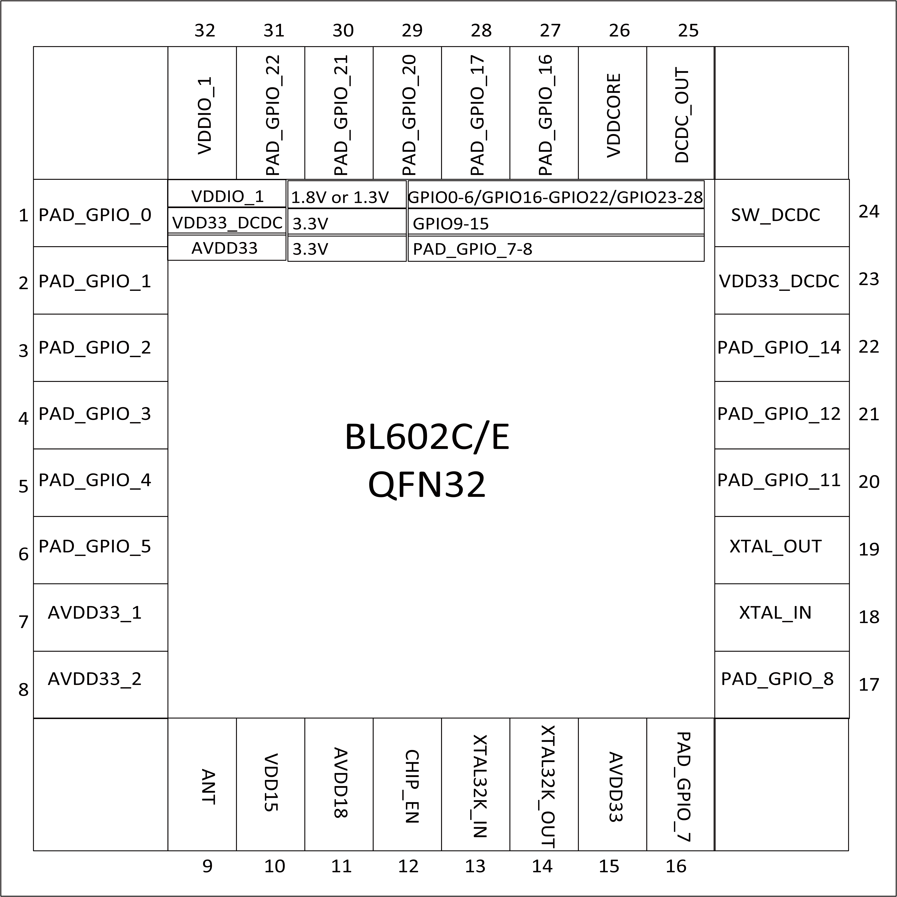

========================
Pin Definition (QFN32)
========================

BL602 32-pin package includes 10 power pins, 6 analog pins, and 16 flexible GPIO pins.

.. figure:: ../../picture/Pinlayout32L.png
   :align: center

   BL602L pin layout

   BL602C/E pin layout

.. table:: Pin Description (QFN32) 

    +------+-------------+---------+-----------------------------------------------------------------+
    | No.  |    Name     | Type    |                Description                                      |
    +------+-------------+---------+-----------------------------------------------------------------+
    | 1    | PAD_GPIO_0  | Digital | SDIO_CLK, SF_D1, SPI_MOSI/SPI_MISO, I2C_SCL, UART, PWM, GPIO    |
    +------+-------------+---------+-----------------------------------------------------------------+
    | 2    | PAD_GPIO_1  | Digital | SDIO_CMD, SF_D2, SPI_MOSI/SPI_MISO, I2C_SDA, UART, PWM, GPIO    |
    +------+-------------+---------+-----------------------------------------------------------------+
    | 3    | PAD_GPIO_2  | Digital | SDIO_DAT0, SF_D3, SPI_SS, I2C_SCL, UART, PWM, GPIO              |
    +------+-------------+---------+-----------------------------------------------------------------+
    | 4    | PAD_GPIO_3  | Digital | SDIO_DAT1, SPI_SCLK, I2C_SDA, UART, PWM, GPIO                   |
    +------+-------------+---------+-----------------------------------------------------------------+
    | 5    | PAD_GPIO_4  | Digital | SDIO_DAT2, SPI_MOSI/SPI_MISO, I2C_SCL, UART, PWM, GPIO          |
    +------+-------------+---------+-----------------------------------------------------------------+
    | 6    | PAD_GPIO_5  | Digital | SDIO_DAT3, SPI_MOSI/SPI_MISO, I2C_SDA, UART, PWM, GPIO          |
    +------+-------------+---------+-----------------------------------------------------------------+
    | 7    | AVDD33_1    | Power   | Externally powered 3.3V                                         |
    +------+-------------+---------+-----------------------------------------------------------------+
    | 8    | AVDD33_2    | Power   | Externally powered 3.3V                                         |
    +------+-------------+---------+-----------------------------------------------------------------+
    | 9    | ANT         | Analog  | RF input and output (single pin)                                |
    +------+-------------+---------+-----------------------------------------------------------------+
    | 10   | VDD15       | Power   | power 1.5V                                                      |
    +------+-------------+---------+-----------------------------------------------------------------+
    | 11   | AVDD18      | Power   | power 1.8V                                                      |
    +------+-------------+---------+-----------------------------------------------------------------+
    | 12   | CHIP_EN     | Digital | Chip enable                                                     |
    +------+-------------+---------+-----------------------------------------------------------------+
    | 13   | NC          | -       | For BL602L                                                      |
    +      +-------------+---------+-----------------------------------------------------------------+
    |      | XTAL32K_IN  | Analog  | Crystal oscillator 32.768kHz input (For BL602C/E)               |
    +------+-------------+---------+-----------------------------------------------------------------+
    | 14   | NC          | -       | For BL602L                                                      |
    +      +-------------+---------+-----------------------------------------------------------------+
    |      | XTAL32K_OUT | Analog  | Crystal oscillator 32.768kHz output (For BL602C/E)              |
    +------+-------------+---------+-----------------------------------------------------------------+
    | 15   | AVDD33      | Power   | Externally powered 3.3V                                         |
    +------+-------------+---------+-----------------------------------------------------------------+
    | 16   | PAD_GPIO_7  | Digital | SPI_SCLK, I2C_SDA, UART, PWM, AUXADC, GPIO                      |
    +------+-------------+---------+-----------------------------------------------------------------+
    | 17   | PAD_GPIO_8  | Digital | SPI_MOSI/SPI_MISO, I2C_SCL, UART, PWM, AUXADC, GPIO             |
    +------+-------------+---------+-----------------------------------------------------------------+
    | 18   | XTAL_IN     | Analog  | External crystal input, support 24/32/38.4/40MHz                |
    +------+-------------+---------+-----------------------------------------------------------------+
    | 19   | XTAL_OUT    | Analog  | External crystal output, support 24/32/38.4/40MHz               |
    +------+-------------+---------+-----------------------------------------------------------------+
    | 20   | PAD_GPIO_11 | Digital | SPI_SCLK, I2C_SDA, UART, PWM, AUXADC, GPIO                      |
    +------+-------------+---------+-----------------------------------------------------------------+
    | 21   | PAD_GPIO_12 | Digital | SPI_MOSI/SPI_MISO, I2C_SCL, UART, PWM, AUXADC, GPIO             |
    +------+-------------+---------+-----------------------------------------------------------------+
    | 22   | PAD_GPIO_14 | Digital | SPI_SS, I2C_SCL, UART, PWM, AUXADC, GPIO                        |
    +------+-------------+---------+-----------------------------------------------------------------+
    | 23   | VDD33       | Power   | External power supply 3.3V (For BL602L)                         |
    +      +-------------+---------+-----------------------------------------------------------------+
    |      | VDD33_DCDC  | Power   | DCDC (For BL602C/E)                                             |
    +------+-------------+---------+-----------------------------------------------------------------+
    | 24   | VDD33       | Power   | External power supply 3.3V (For BL602L)                         |
    +      +-------------+---------+-----------------------------------------------------------------+
    |      | SW_DCDC     | Power   | DCDC (For BL602C/E)                                             |
    +------+-------------+---------+-----------------------------------------------------------------+
    | 25   | VDD33       | Power   | External power supply 3.3V (For BL602L)                         |
    +      +-------------+---------+-----------------------------------------------------------------+
    |      | DCDC_OUT    | Power   | DCDC (For BL602C/E)                                             |
    +------+-------------+---------+-----------------------------------------------------------------+
    | 26   | VDDCORE     | Power   | Core Power                                                      |
    +------+-------------+---------+-----------------------------------------------------------------+
    | 27   | PAD_GPIO_16 | Digital | SPI_MOSI/SPI_MISO, I2C_SCL, UART, PWM, GPIO                     |
    +------+-------------+---------+-----------------------------------------------------------------+
    | 28   | PAD_GPIO_17 | Digital | SF_D3, SPI_MOSI/SPI_MISO, I2C_SDA, UART, PWM, GPIO              |
    +------+-------------+---------+-----------------------------------------------------------------+
    | 29   | PAD_GPIO_20 | Digital | SF_D0, SPI_MOSI/SPI_MISO, I2C_SCL, UART, PWM, GPIO              |
    +------+-------------+---------+-----------------------------------------------------------------+
    | 30   | PAD_GPIO_21 | Digital | SF_CS, SPI_MOSI/SPI_MISO, I2C_SDA, UART, PWM, GPIO              |
    +------+-------------+---------+-----------------------------------------------------------------+
    | 31   | PAD_GPIO_22 | Digital | SF_CLK_OUT, SPI_SS, I2C_SCL, UART, PWM, GPIO                    |
    +------+-------------+---------+-----------------------------------------------------------------+
    | 32   | DVDDIO_1    | Power   | Externally powered 3.3V or 1.8V                                 |
    +------+-------------+---------+-----------------------------------------------------------------+
   