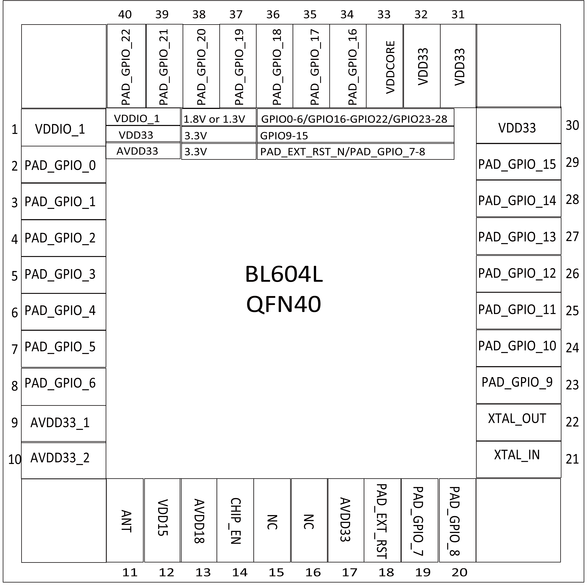

=======================
Pin Definition (QFN40)
=======================

BL604 40-pin package includes 10 power pins, 6 analog pins, 1 reset pin, and 23 flexible GPIO pins.

   BL604L pin layout 

.. figure:: picture/pinlayout_40_CE.png
   :align: center

   BL604C/E pin layout 

.. table:: Pin Description (QFN40) 

    +------+-------------+---------+-------------------------------------------------------------------+
    | No.  |    Name     | Type    |                       Description                                 |
    +------+-------------+---------+-------------------------------------------------------------------+
    | 1    | DVDDIO_1    | Power   | Externally powered 3.3V or 1.8V                                   |
    +------+-------------+---------+-------------------------------------------------------------------+
    | 2    | PAD_GPIO_0  | Digital | SDIO_CLK, SF_D1, SPI_MOSI/SPI_MISO, I2C_SCL, UART, PWM, GPIO      |
    +------+-------------+---------+-------------------------------------------------------------------+
    | 3    | PAD_GPIO_1  | Digital | SDIO_CMD, SF_D2, SPI_MOSI/SPI_MISO, I2C_SDA, UART, PWM, GPIO      |
    +------+-------------+---------+-------------------------------------------------------------------+
    | 4    | PAD_GPIO_2  | Digital | SDIO_DAT0, SF_D3, SPI_SS, I2C_SCL, UART, PWM, GPIO                |
    +------+-------------+---------+-------------------------------------------------------------------+
    | 5    | PAD_GPIO_3  | Digital | SDIO_DAT1, SPI_SCLK, I2C_SDA, UART, PWM, GPIO                     |
    +------+-------------+---------+-------------------------------------------------------------------+
    | 6    | PAD_GPIO_4  | Digital | SDIO_DAT2, SPI_MOSI/SPI_MISO, I2C_SCL, UART, PWM, GPIO            |
    +------+-------------+---------+-------------------------------------------------------------------+
    | 7    | PAD_GPIO_5  | Digital | SDIO_DAT3, SPI_MOSI/SPI_MISO, I2C_SDA, UART, PWM, GPIO            |
    +------+-------------+---------+-------------------------------------------------------------------+
    | 8    | PAD_GPIO_6  | Digital | SPI_SS, I2C_SCL, UART, PWM, GPIO                                  |
    +------+-------------+---------+-------------------------------------------------------------------+
    | 9    | AVDD33_1    | Power   | Externally powered 3.3V                                           |
    +------+-------------+---------+-------------------------------------------------------------------+
    | 10   | AVDD33_2    | Power   | Externally powered 3.3V                                           |
    +------+-------------+---------+-------------------------------------------------------------------+
    | 11   | ANT         | Analog  | RF input and output (single pin)                                  |
    +------+-------------+---------+-------------------------------------------------------------------+
    | 12   | VDD15       | Power   | power 1.5V                                                        |
    +------+-------------+---------+-------------------------------------------------------------------+
    | 13   | AVDD18      | Power   | power 1.8V                                                        |
    +------+-------------+---------+-------------------------------------------------------------------+
    | 14   | CHIP_EN     | Digital | Chip enable                                                       |
    +------+-------------+---------+-------------------------------------------------------------------+
    | 15   | NC          | -       | For BL604L                                                        |
    +      +-------------+---------+-------------------------------------------------------------------+
    |      | XTAL32K_IN  | Analog  | Crystal oscillator 32.768kHz input (For BL604C/E)                 |
    +------+-------------+---------+-------------------------------------------------------------------+
    | 16   | NC          | -       | For BL604L                                                        |
    +      +-------------+---------+-------------------------------------------------------------------+
    |      | XTAL32K_OUT | Analog  | Crystal oscillator 32.768kHz output (For BL604C/E)                |
    +------+-------------+---------+-------------------------------------------------------------------+
    | 17   | AVDD33      | Power   | Externally powered 3.3V                                           |
    +------+-------------+---------+-------------------------------------------------------------------+
    | 18   | PAD_EXT_RST | Digital | External reset                                                    |
    +------+-------------+---------+-------------------------------------------------------------------+
    | 19   | PAD_GPIO_7  | Digital | SPI_SCLK, I2C_SDA, UART, PWM, AUXADC, GPIO                        | 
    +------+-------------+---------+-------------------------------------------------------------------+
    | 20   | PAD_GPIO_8  | Digital | SPI_MOSI/SPI_MISO, I2C_SCL, UART, PWM, AUXADC, GPIO               |
    +------+-------------+---------+-------------------------------------------------------------------+
    | 21   | XTAL_IN     | Analog  | External crystal input, support 24/32/38.4/40MHz                  |
    +------+-------------+---------+-------------------------------------------------------------------+
    | 22   | XTAL_OUT    | Analog  | External crystal output, support 24/32/38.4/40MHz                 |
    +------+-------------+---------+-------------------------------------------------------------------+
    | 23   | PAD_GPIO_9  | Digital | SPI_MOSI/SPI_MISO, I2C_SDA, UART, PWM, AUXADC, GPIO               |
    +------+-------------+---------+-------------------------------------------------------------------+
    | 24   | PAD_GPIO_10 | Digital | SPI_SS, I2C_SCL, UART, PWM, AUXADC, GPIO                          |
    +------+-------------+---------+-------------------------------------------------------------------+
    | 25   | PAD_GPIO_11 | Digital | SPI_SCLK, I2C_SDA, UART, PWM, AUXADC, GPIO                        |
    +------+-------------+---------+-------------------------------------------------------------------+
    | 26   | PAD_GPIO_12 | Digital | SPI_MOSI/SPI_MISO, I2C_SCL, UART, PWM, AUXADC, GPIO               |
    +------+-------------+---------+-------------------------------------------------------------------+
    | 27   | PAD_GPIO_13 | Digital | SPI_MOSI/SPI_MISO, I2C_SDA, UART, PWM, AUXADC, GPIO               |
    +------+-------------+---------+-------------------------------------------------------------------+
    | 28   | PAD_GPIO_14 | Digital | SPI_SS, I2C_SCL, UART, PWM, AUXADC, GPIO                          | 
    +------+-------------+---------+-------------------------------------------------------------------+
    | 29   | PAD_GPIO_15 | Digital | SPI_SCLK, I2C_SDA, UART, PWM, AUXADC, GPIO                        | 
    +------+-------------+---------+-------------------------------------------------------------------+
    | 30   | VDD33       | Power   | External power supply 3.3V (For BL604L)                           |
    +      +-------------+---------+-------------------------------------------------------------------+
    |      | VDD33_DCDC  | Power   | DCDC (For BL604C/E)                                               |
    +------+-------------+---------+-------------------------------------------------------------------+
    | 31   | VDD33       | Power   | External power supply 3.3V (For BL604L)                           |
    +      +-------------+---------+-------------------------------------------------------------------+
    |      | SW_DCDC     | Power   | DCDC (For BL604C/E)                                               |
    +------+-------------+---------+-------------------------------------------------------------------+
    | 32   | VDD33       | Power   | External power supply 3.3V (For BL604L)                           |
    +      +-------------+---------+-------------------------------------------------------------------+
    |      | DCDC_OUT    | Power   | DCDC (For BL604C/E)                                               |
    +------+-------------+---------+-------------------------------------------------------------------+
    | 33   | VDDCORE     | Power   | Core Power                                                        |
    +------+-------------+---------+-------------------------------------------------------------------+
    | 34   | PAD_GPIO_16 | Digital | SPI_MOSI/SPI_MISO, I2C_SCL, UART, PWM, GPIO                       |
    +------+-------------+---------+-------------------------------------------------------------------+
    | 35   | PAD_GPIO_17 | Digital | SF_D3, SPI_MOSI/SPI_MISO, I2C_SDA, UART, PWM, GPIO                |
    +------+-------------+---------+-------------------------------------------------------------------+
    | 36   | PAD_GPIO_18 | Digital | SF_D2, SPI_SS, I2C_SCL, UART, PWM, GPIO                           |
    +------+-------------+---------+-------------------------------------------------------------------+
    | 37   | PAD_GPIO_19 | Digital | SF_D1, SPI_SCLK, I2C_SDA, UART, PWM, GPIO                         |
    +------+-------------+---------+-------------------------------------------------------------------+
    | 38   | PAD_GPIO_20 | Digital | SF_D0, SPI_MOSI/SPI_MISO, I2C_SCL, UART, PWM, GPIO                |
    +------+-------------+---------+-------------------------------------------------------------------+
    | 39   | PAD_GPIO_21 | Digital | SF_CS, SPI_MOSI/SPI_MISO, I2C_SDA, UART, PWM, GPIO                |
    +------+-------------+---------+-------------------------------------------------------------------+
    | 40   | PAD_GPIO_22 | Digital | SF_CLK_OUT, SPI_SS, I2C_SCL, UART, PWM, GPIO                      |
    +------+-------------+---------+-------------------------------------------------------------------+