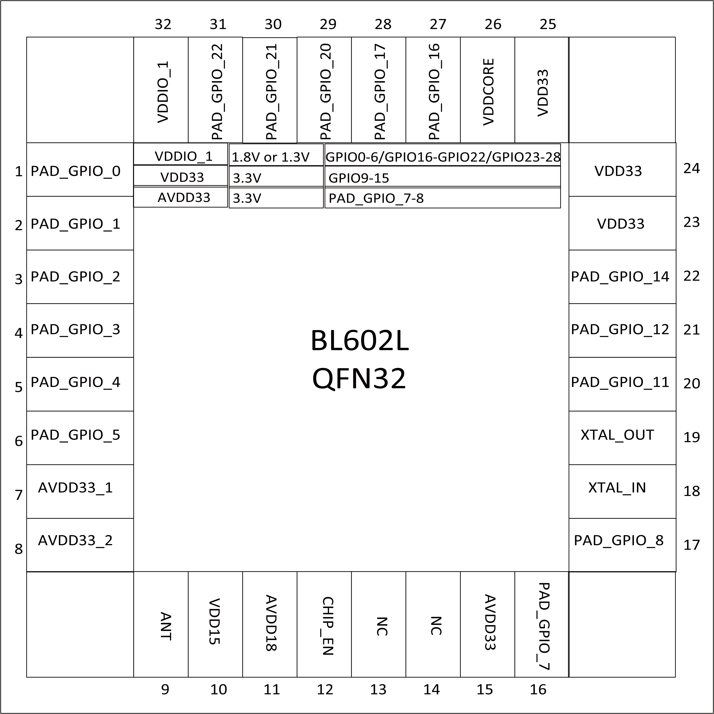
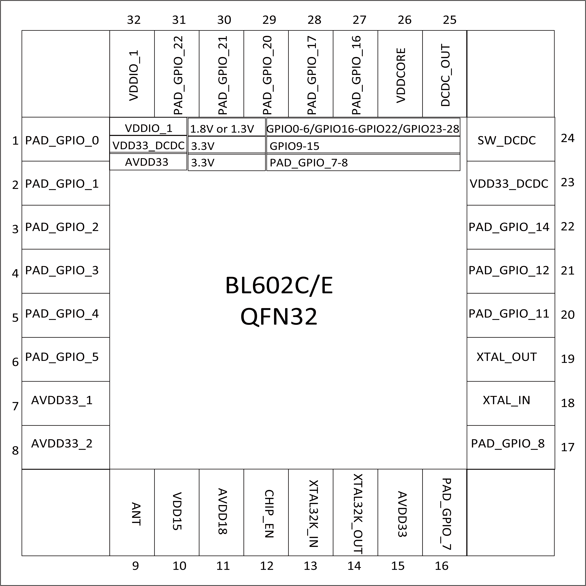

==============
管脚定义QFN32
==============

BL602 32-pin封装包括固定电源接口10个、固定模拟接口6个、以及富含弹性的GPIO接口16个供应用选择。

   BL602L管脚布局

   BL602C/E管脚布局

.. table:: 管脚描述 

    +------+-------------+------+---------------------------------------------------------------+
    | 编号 |    名称     | 类型 |                          描述                                 |
    +------+-------------+------+---------------------------------------------------------------+
    | 1    | PAD_GPIO_0  | 数字 | SDIO_CLK, SF_D1, SPI_MOSI/SPI_MISO, I2C_SCL, UART, PWM, GPIO  |
    +------+-------------+------+---------------------------------------------------------------+
    | 2    | PAD_GPIO_1  | 数字 | SDIO_CMD, SF_D2, SPI_MOSI/SPI_MISO, I2C_SDA, UART, PWM, GPIO  |
    +------+-------------+------+---------------------------------------------------------------+
    | 3    | PAD_GPIO_2  | 数字 | SDIO_DAT0, SF_D3, SPI_SS, I2C_SCL, UART, PWM, GPIO            |
    +------+-------------+------+---------------------------------------------------------------+
    | 4    | PAD_GPIO_3  | 数字 | SDIO_DAT1, SPI_SCLK, I2C_SDA, UART, PWM, GPIO                 |
    +------+-------------+------+---------------------------------------------------------------+
    | 5    | PAD_GPIO_4  | 数字 | SDIO_DAT2, SPI_MOSI/SPI_MISO, I2C_SCL, UART, PWM, GPIO        |
    +------+-------------+------+---------------------------------------------------------------+
    | 6    | PAD_GPIO_5  | 数字 | SDIO_DAT3, SPI_MOSI/SPI_MISO, I2C_SDA, UART, PWM, GPIO        |
    +------+-------------+------+---------------------------------------------------------------+
    | 7    | AVDD33_1    | 电源 | 外部供电3.3V                                                  |
    +------+-------------+------+---------------------------------------------------------------+
    | 8    | AVDD33_2    | 电源 | 外部供电3.3V                                                  |
    +------+-------------+------+---------------------------------------------------------------+
    | 9    | ANT         | 模拟 | 射频输入和输出（单引脚）                                      |
    +------+-------------+------+---------------------------------------------------------------+
    | 10   | VDD15       | 电源 | 供电1.5V                                                      |
    +------+-------------+------+---------------------------------------------------------------+
    | 11   | AVDD18      | 电源 | 供电1.8V                                                      |
    +------+-------------+------+---------------------------------------------------------------+
    | 12   | CHIP_EN     | 数字 | 芯片使能                                                      |
    +------+-------------+------+---------------------------------------------------------------+
    | 13   | NC          | -    | 适用于BL602L                                                  |
    +      +-------------+------+---------------------------------------------------------------+
    |      | XTAL32K_IN  | 模拟 | 晶体振荡器32.768kHz输入 (适用于BL602C/E)                      |
    +------+-------------+------+---------------------------------------------------------------+
    | 14   | NC          | -    | 适用于BL602L                                                  |
    +      +-------------+------+---------------------------------------------------------------+
    |      | XTAL32K_OUT | 模拟 | 晶体振荡器32.768kHz输出 (适用于BL602C/E)                      |
    +------+-------------+------+---------------------------------------------------------------+
    | 15   | AVDD33      | 电源 | 外部供电3.3V                                                  |
    +------+-------------+------+---------------------------------------------------------------+
    | 16   | PAD_GPIO_7  | 数字 | SPI_SCLK, I2C_SDA, UART, PWM, AUXADC, GPIO                    |
    +------+-------------+------+---------------------------------------------------------------+
    | 17   | PAD_GPIO_8  | 数字 | SPI_MOSI/SPI_MISO, I2C_SCL, UART, PWM, AUXADC, GPIO           |
    +------+-------------+------+---------------------------------------------------------------+
    | 18   | XTAL_IN     | 模拟 | 外部晶振输入, 支持24/32/38.4/40MHz                            |
    +------+-------------+------+---------------------------------------------------------------+
    | 19   | XTAL_OUT    | 模拟 | 外部晶振输出, 支持24/32/38.4/40MHz                            |
    +------+-------------+------+---------------------------------------------------------------+
    | 20   | PAD_GPIO_11 | 数字 | SPI_SCLK, I2C_SDA, UART, PWM, AUXADC, GPIO                    |
    +------+-------------+------+---------------------------------------------------------------+
    | 21   | PAD_GPIO_12 | 数字 | SPI_MOSI/SPI_MISO, I2C_SCL, UART, PWM, AUXADC, GPIO           |
    +------+-------------+------+---------------------------------------------------------------+
    | 22   | PAD_GPIO_14 | 数字 | SPI_SS, I2C_SCL, UART, PWM, AUXADC, GPIO                      |
    +------+-------------+------+---------------------------------------------------------------+
    | 23   | VDD33       | 电源 | 外部供电3.3V (适用于BL602L)                                   |
    +      +-------------+------+---------------------------------------------------------------+
    |      | VDD33_DCDC  | 电源 | DCDC (适用于BL602C/E)                                         |
    +------+-------------+------+---------------------------------------------------------------+
    | 24   | VDD33       | 电源 | 外部供电3.3V (适用于BL602L)                                   |
    +      +-------------+------+---------------------------------------------------------------+
    |      | SW_DCDC     | 电源 | DCDC (适用于BL602C/E)                                         |
    +------+-------------+------+---------------------------------------------------------------+
    | 25   | VDD33       | 电源 | 外部供电3.3V (适用于BL602L)                                   |
    +      +-------------+------+---------------------------------------------------------------+
    |      | DCDC_OUT    | 电源 | DCDC (适用于BL602C/E)                                         |
    +------+-------------+------+---------------------------------------------------------------+
    | 26   | VDDCORE     | 电源 | core电压                                                      |
    +------+-------------+------+---------------------------------------------------------------+
    | 27   | PAD_GPIO_16 | 数字 | SPI_MOSI/SPI_MISO, I2C_SCL, UART, PWM, GPIO                   |
    +------+-------------+------+---------------------------------------------------------------+
    | 28   | PAD_GPIO_17 | 数字 | SF_D3, SPI_MOSI/SPI_MISO, I2C_SDA, UART, PWM, GPIO            |
    +------+-------------+------+---------------------------------------------------------------+
    | 29   | PAD_GPIO_20 | 数字 | SF_D0, SPI_MOSI/SPI_MISO, I2C_SCL, UART, PWM, GPIO            |
    +------+-------------+------+---------------------------------------------------------------+
    | 30   | PAD_GPIO_21 | 数字 | SF_CS, SPI_MOSI/SPI_MISO, I2C_SDA, UART, PWM, GPIO            |
    +------+-------------+------+---------------------------------------------------------------+
    | 31   | PAD_GPIO_22 | 数字 | SF_CLK_OUT, SPI_SS, I2C_SCL, UART, PWM, GPIO                  |
    +------+-------------+------+---------------------------------------------------------------+
    | 32   | DVDDIO_1    | 电源 | 外部供电3.3或1.8V                                             |
    +------+-------------+------+---------------------------------------------------------------+
   