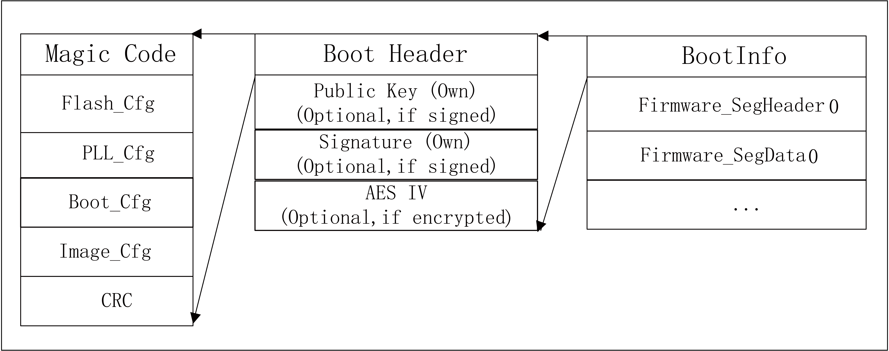
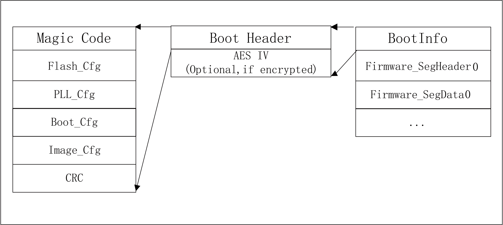
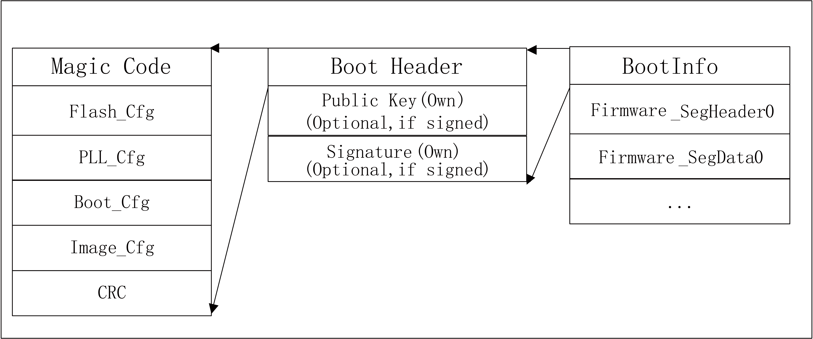
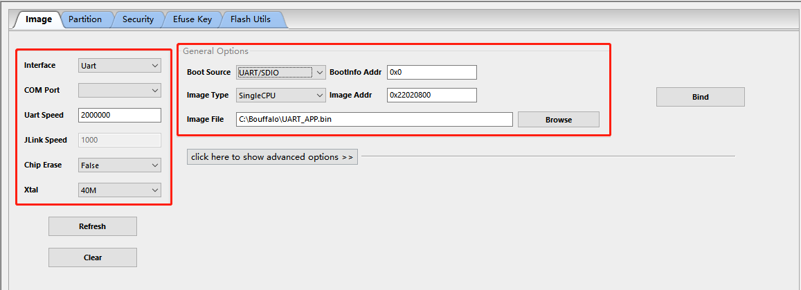
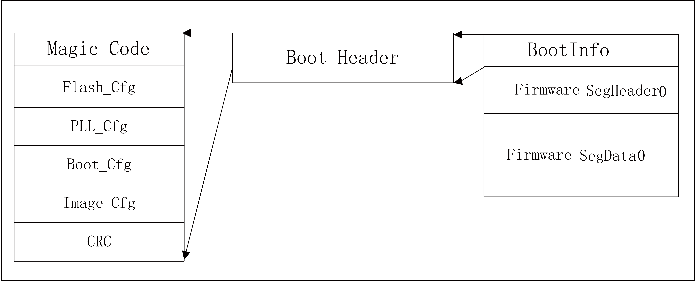
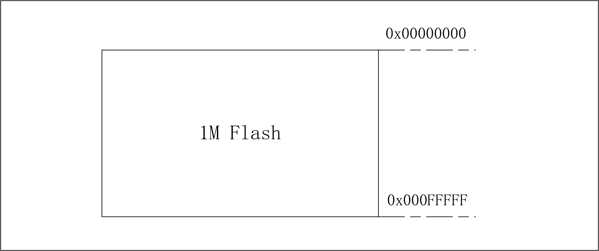

=============================
UART/SDIO boot image format
=============================
The BL602 series chips support UART/SDIO boot. A section of executable program can be downloaded to RAM to run through UART/SDIO interface. The structure of the download program needs to meet the format defined by BL602 Bootrom. For applications that have not activated security settings, that is, applications that do not enable encryption and signatures, the format of the download image is shown in the following figure:

.. figure:: ../../picture/UartSdioBootImageNoSecret.png
   :align: center

   UART/SDIO boot image (no encryption & no signature)

The download image consists of three parts:

- BootInfo
    It mainly includes the Magic Code of BootInfo, flash configuration information (UART download does not require Flash information, it is only compatible with Flash boot images), PLL configuration information, boot parameter information, and mirror configuration information.

- SegmentHeader
    The section header information of the downloaded program or data section is mainly used to specify the data section to be transmitted next, which address in the memory to be placed, and the data length and other information.

- SegmenData
    Download the main body of the program or data segment.

There can be multiple SegmentHeader and SegmenData, and the specific number information is set in the mirror configuration information of BootInfo.

For the downloaded image with encryption and signature settings enabled, the file format is as follows:

   UART/SDIO boot image (encryption & signature)

Compared with ordinary download images, for encrypted and signed images, BootInfo needs to include information such as public keys, signatures, and AES IV.

For downloaded images with encryption enabled but not signed, the file format is as follows:

   UART/SDIO boot image (encryption & no signature)

For a downloaded image with signature enabled but not encrypted, the file format is as follows:

   UART/SDIO boot image (signature & unencrypted)

Start pin
===========
The BL602 series supports one UART and one SDIO start.

.. table:: UART/SDIO start pin assignment 

    +------------+------------------------+--------------------+
    | GPIO pin   | Function               | Comments           | 
    +------------+------------------------+--------------------+
    | GPIO8      | Boot Pin               |                    |
    +------------+------------------------+--------------------+
    | GPIO7      | BL602 UART RXD         | UART Channel1      |
    +------------+------------------------+                    +
    | GPIO16     | BL602 UART TXD         |                    |
    +------------+------------------------+--------------------+
    | GPIO0      | SDIO_CLK               | SDIO Channel       |
    +------------+------------------------+                    +
    | GPIO1      | SDIO_CMD               |                    |
    +------------+------------------------+                    +
    | GPIO2      | SDIO_DATA0             |                    |
    +------------+------------------------+                    +
    | GPIO3      | SDIO_DATA1             |                    |
    +------------+------------------------+                    +
    | GPIO4      | SDIO_DATA2             |                    |
    +------------+------------------------+                    +
    | GPIO5      | SDIO_DATA3             |                    |
    +------------+------------------------+--------------------+

If you want to start from UART/SDIO, you need to pull GPIO8 high and then reset the chip. Bootrom will scan the two interfaces of UART and SDIO in turn, and wait for the handshake signal on this interface. After the handshake timeout (2ms), the next interface will be performed If the handshake is successful on an interface, it will enter the receiving data processing flow. During the data processing, once the transmission error or timeout (2s), the next interface scan will be performed, and so on in turn, until the received legal Start the mirror to complete the startup task.

UART handshake
================
The configuration of UART communication is 1bit start bit, 8bit data bit, 1bit stop bit, no parity bit.

After Bootrom is started from UART/SDIO, it will cyclically detect the level change of GPIO7 pin. When the host sends a 0x55 data string and is captured, Bootrom starts to calculate the current serial port baud rate. Set the value of the UART register according to the detection result. The baud rate reply "OK". The host can communicate normally after receiving "OK". The UART communication timeout time is 2s. If the Bootrom does not receive any data within 2s after replying "OK". Or in the communication process, if no data is received within 2s, it is considered that the communication is timed out, and the handshake process is re-entered after the timeout.

The recommended time for the host to send handshake data is 5ms so that Bootrom has enough time to detect the handshake signal. After the host receives "OK", it is recommended to delay 20ms before communicating to prevent subsequent communication data from being mixed with previous handshake data.

Since Bootrom uses RC32M clock when booting from UART/SDIO, it is recommended that the handshake baud rate should not exceed 500K. The handshake process is as follows:

.. figure:: ../../picture/UartHands.png
   :align: center

    UART handshake process

SDIO handshake
================
Bootrom will wait for the SDIO Host to write the handshake register (SDU_BASE+0x160). When the SDIO query finds that the handshake register is written as 1, the handshake is considered successful. Bootrom will wait for the host to send data and process it according to the received data command. If a timeout occurs (no data is received within 2s), it will re-enter the handshake process.

Generate download image file
================================
Bouffalo provides UART/SDIO download mirror generation tools, users can download \ `Bouffalo Lab Dev Cube For Windows <https://dev.bouffalolab.com/download>`__\,
get the latest Dev Cube, run BLDevCube.exe, select BL602/604 in Chip Type, and enter the programming interface. Select the MCU option in the View menu to enter the MCU program download interface.

    Download interface

If only the UART/SDIO download image is generated, only the burning image parameters on the right can be configured. The specific configuration is as follows:

- Boot Source：Select UART/SDIO, which means to generate UART/SDIO boot image
- BootInfo Addr：The storage address of the program startup parameters, fill in 0x0 here
- Image Type：The default is SingleCPU
- Image Addr：The download address of the application program, the user can fill in according to the actual program running address, such as 0x22020800
- Image File：Select the RAM program being compiled and generated by the user

After completing the option configuration, click the Create&Download button to generate the corresponding image file. The generated file path is: bl602/img_create2/img_if.bin.
img_if.bin is the file that meets the UART/SDIO boot image format.

To enable encryption and signature functions, expand the advanced options option in the tool, and after completing the configuration, click the Create&Download button as well.

UART/SDIO download program communication protocol
=======================================================
After Bootrom completes the UART/SDIO communication handshake, it can enter the normal download program communication process. The communication process is described in detail below.
It should be noted that the maximum length of protocol data that Bootrom can receive is 4096 bytes.

Get boot info
---------------

.. table:: Host->BL602

    +----------------+-------------+----------------+------------------+
    | cmdId(1byte)   | Rsvd(1byte) | Len_lsb(1byte) | Len_msb(1byte)   |
    +----------------+-------------+----------------+------------------+
    | 0x10           | 0x00        | 0x00           | 0x00             |
    +----------------+-------------+----------------+------------------+

.. table:: BL602->Host

    +----------------+-----------------+----------------+--------------------------+-------------------+
    | ‘OK’(2bytes)   | Len_lsb(1byte)  | Len_msb(1byte) | BootRom Version(4bytes)  | OTP info(16bytes) |
    +----------------+-----------------+----------------+--------------------------+-------------------+
    | 0x4F 0x4B      | 0x14            | 0x00           |                          |                   |
    +----------------+-----------------+----------------+--------------------------+-------------------+

This is the first command that the host communicates with BL602, read BL602 related information. The host must judge whether BL602 requires to receive the signed image according to sign_type.
According to encrypted, judge whether BL602 requires to receive encrypted image. If it is known that the chip does not start encryption and signature, then the analysis of the information can be skipped.

+----------------+----------------+----------------+
|                | 2b’00          | Other          |
+----------------+----------------+----------------+
| sign_type      | No signature   | Signature      |
+----------------+----------------+----------------+
| encrypted      | Not encrypted  | Encrypted      |
+----------------+----------------+----------------+

Load boot header
---------------------

.. table:: Host->BL602

    +----------------+-------------+----------------+------------------+----------------------+
    | cmdId(1byte)   | Rsvd(1byte) | Len_lsb(1byte) | Len_msb(1byte)   | BootHeader(176bytes) |
    +----------------+-------------+----------------+------------------+----------------------+
    | 0x11           | 0x00        | 0xb0           | 0x00             |                      |
    +----------------+-------------+----------------+------------------+----------------------+

.. table:: BL602->Host

    +----------------+
    | ‘OK’(2bytes)   |
    +----------------+
    | 0x4F 0x4B      |
    +----------------+

The 176bytes BootHeader structure is as follows:

.. code-block:: c

    __PACKED_STRUCT boot_flash_cfg_t
   {
        uint32_t magiccode;       /*'FCFG'*/
        SPI_Flash_Cfg_Type cfg;
        uint32_t crc32;
   };

    __PACKED_STRUCT sys_clk_cfg_t
   {
        uint8_t xtal_type;
        uint8_t pll_clk;
        uint8_t hclk_div;
        uint8_t bclk_div;

        uint8_t flash_clk_type;
        uint8_t flash_clk_div;
        uint8_t rsvd[2];
   };

    __PACKED_STRUCT boot_clk_cfg_t
   {
        uint32_t magiccode;       /*'PCFG'*/

        struct sys_clk_cfg_t cfg;

        uint32_t crc32;
   };

    __PACKED_STRUCT bootheader_t
   {
        uint32_t magiccode;       			/*'BFXP'*/
        uint32_t rivison; 
        struct boot_flash_cfg_t flashCfg;       
        struct boot_clk_cfg_t   clkCfg;
        __PACKED_UNION {
            __PACKED_STRUCT {
                uint32_t sign               :  2;   /* [1: 0]  for sign*/
                uint32_t encrypt_type       :  2;   /* [3: 2]  for encrypt */
                uint32_t key_sel            :  2;   /* [5: 4]  for key sel in boot interface*/
                uint32_t rsvd6_7            :  2;   /* [7: 6]  for encrypt*/
                uint32_t no_segment         :  1;   /* [8]     no segment info */
                uint32_t cache_enable       :  1;   /* [9]     for cache */
                uint32_t notload_in_bootrom :  1;   /* [10]    not load this img in bootrom */
                uint32_t aes_region_lock    :  1;   /* [11]    aes region lock */
                uint32_t cache_way_disable  :  4;   /* [15: 12]  cache way disable info*/
                uint32_t crc_ignore         :  1;   /* [16]    ignore crc */
                uint32_t hash_ignore        :  1;   /* [17]    hash crc */
                uint32_t halt_ap            :  1;   /* [18]    halt ap */
                uint32_t rsvd19_31          :  13;  /* [31:19]  rsvd */
            } bval;
            uint32_t wval;
        }bootcfg ;

        uint32_t segment_cnt;

        uint32_t bootentry;      /* entry point of the image*/

        uint32_t flashoffset;

        uint8_t hash[BFLB_BOOTROM_HASH_SIZE];    /*hash of the image*/

        uint32_t rsv1;
        uint32_t rsv2;
        uint32_t crc32;
    };

Load public key (Optional)
------------------------------

.. table:: Host->BL602

    +----------------+-------------+----------------+------------------+----------------------+
    | cmdId(1byte)   | Rsvd(1byte) | Len_lsb(1byte) | Len_msb(1byte)   | PKey(68bytes)        |
    +----------------+-------------+----------------+------------------+----------------------+
    | 0x12           | 0x00        | 0x44           | 0x00             |                      |
    +----------------+-------------+----------------+------------------+----------------------+

.. table:: BL602->Host

    +----------------+
    | ‘OK’(2bytes)   |
    +----------------+
    | 0x4F 0x4B      |
    +----------------+

The host sends this command only when the image is signed. If the signature is not started, the sending of this command should be skipped. The 68-byte Public Key structure is as follows:

.. code-block:: c

    __PACKED_STRUCT pkey_cfg_t
    {
        uint8_t eckeyx[32];        //ec key in boot info
        uint8_t eckeyy[32];        //ec key in boot info
        uint32_t crc32;
    };

Load signature (Optional)
------------------------------

.. table:: Host->BL602

    +----------------+-------------+----------------+------------------+----------------------+
    | cmdId(1byte)   | Rsvd(1byte) | Len_lsb(1byte) | Len_msb(1byte)   | Signature(Nbytes)    |
    +----------------+-------------+----------------+------------------+----------------------+
    | 0x14           | 0x00        | N&0xFF         | (N&0xFF00)>>8    |                      |
    +----------------+-------------+----------------+------------------+----------------------+

.. table:: BL602->Host

    +----------------+
    | ‘OK’(2bytes)   |
    +----------------+
    | 0x4F 0x4B      |
    +----------------+

The host sends this command only when the image is signed. If the signature is not started, the sending of this command should be skipped.

The effective length of Signature is not fixed, and its structure is shown as follows:

.. code-block:: c

    __PACKED_STRUCT sign_cfg_t
    {
	    uint32_t sig_len;
	    uint8_t signature[sig_len];
	    uint32_t crc32;
    };

When the host sends the signature, it can read sig_len first to obtain the length of the signature to be sent as sig_len+8.

Load AES IV (Optional)
------------------------------

.. table:: Host->BL602

    +----------------+-------------+----------------+------------------+----------------------+
    | cmdId(1byte)   | Rsvd(1byte) | Len_lsb(1byte) | Len_msb(1byte)   | AES IV(20bytes)      |
    +----------------+-------------+----------------+------------------+----------------------+
    | 0x16           | 0x00        | 0x14           | 0x00             |                      |
    +----------------+-------------+----------------+------------------+----------------------+

.. table:: BL602->Host

    +----------------+
    | ‘OK’(2bytes)   |
    +----------------+
    | 0x4F 0x4B      |
    +----------------+

The host sends this command only when the image is encrypted. If encryption is not started, the sending of this command should be skipped.

The 20bytes AES IV structure is as follows:

.. code-block:: c

   __PACKED_STRUCT aesiv_cfg_t
  {
        uint8_t aesiv[16];
        uint32_t crc32;
  };

Load Segment Header
------------------------------

.. table:: Host->BL602

    +----------------+-------------+----------------+------------------+----------------------+
    | cmdId(1byte)   | Rsvd(1byte) | Len_lsb(1byte) | Len_msb(1byte)   | Seg header(16bytes)  |
    +----------------+-------------+----------------+------------------+----------------------+
    | 0x17           | 0x00        | 0x10           | 0x00             |                      |
    +----------------+-------------+----------------+------------------+----------------------+

.. table:: BL602->Host

    +----------------+
    | ‘OK’(20bytes)  |
    +----------------+
    | 0x4F 0x4B      |
    +----------------+

The UART/SDIO boot image supports multiple segments, and the data and code of each segment can be loaded by the boot program to the address specified by the Segheader. The number of segments in the image is determined by the segment_cnt (refer to 1.5.2) member in BootHeader. The host needs to record this variable during the Load boot header process, and then loop Load Segment Header and Load Segment Data for segment_cnt times.

The 16bytes seg header is described by the following structure:

.. code-block:: c

   __PACKED_STRUCT segment_header_t
   {
	    uint32_t destaddr;
	    uint32_t len;
	    uint32_t rsvd;
	    uint32_t crc32;
   };

Load Segment Data
------------------------------

.. table:: Host->BL602

    +----------------+-------------+----------------+------------------+----------------------+
    | cmdId(1byte)   | Rsvd(1byte) | Len_lsb(1byte) | Len_msb(1byte)   | Seg Data(Nbytes)     |
    +----------------+-------------+----------------+------------------+----------------------+
    | 0x18           | 0x00        | N&0xFF         | (N&0xFF00)>>8    |                      |
    +----------------+-------------+----------------+------------------+----------------------+

.. table:: BL602->Host

    +----------------+
    | ‘OK’(2bytes)   |
    +----------------+
    | 0x4F 0x4B      |
    +----------------+

For a segment data, due to the limitation of 4096 bytes in a protocol frame, it may be necessary to send Load Segment Data multiple times to transmit data.

Here, it is necessary to ensure that the sum of the data length in the data frame transmitted multiple times is equal to the len described in the Segment Header.

Check image
------------------------------

.. table:: Host->BL602

    +----------------+-------------+----------------+------------------+
    | cmdId(1byte)   | Rsvd(1byte) | Len_lsb(1byte) | Len_msb(1byte)   |
    +----------------+-------------+----------------+------------------+
    | 0x19           | 0x00        | 0x00           | 0x00             |
    +----------------+-------------+----------------+------------------+

.. table:: BL602->Host

    +----------------+
    | ‘OK’(2bytes)   |
    +----------------+
    | 0x4F 0x4B      |
    +----------------+

After the image is downloaded to RAM, the integrity and legality of the image must be checked.

Run image
------------------------------

.. table:: Host->BL602

    +----------------+-------------+----------------+------------------+
    | cmdId(1byte)   | Rsvd(1byte) | Len_lsb(1byte) | Len_msb(1byte)   |
    +----------------+-------------+----------------+------------------+
    | 0x1A           | 0x00        | 0x00           | 0x00             |
    +----------------+-------------+----------------+------------------+

.. table:: BL602->Host

    +----------------+
    | ‘OK’(2bytes)   |
    +----------------+
    | 0x4F 0x4B      |
    +----------------+

When the Check image command returns OK, the image downloaded to the RAM can be run through this command. After BL602 executes the command, it jumps from the UART/SDIO startup program to the downloaded image program to run.

Error response frame
------------------------------
The above response frames of BL602Host are all responses under correct conditions. If an error occurs during communication, the format of the Bootrom error return data is as follows, and the user can query the cause of the error according to the error code:

.. table:: Host->BL602

    +----------------+------------------------+----------------------+
    | ‘FL’(2bytes)   | Error_Code_LSB(1byte)  | Error_Code_MSB(1byte)|
    +----------------+------------------------+----------------------+
    | 0x46 0x4C      |                        |                      |
    +----------------+------------------------+----------------------+

Error_Code is listed as follows:

.. code-block:: c

   /*error code definition*/
   typedef  enum tag_bootrom_error_code_t
   { 
        BFLB_BOOTROM_SUCCESS=0x00,

        /*flash*/
        BFLB_BOOTROM_FLASH_INIT_ERROR=0x0001,
        BFLB_BOOTROM_FLASH_ERASE_PARA_ERROR=0x0002,
        BFLB_BOOTROM_FLASH_ERASE_ERROR=0x0003,
        BFLB_BOOTROM_FLASH_WRITE_PARA_ERROR=0x0004,
        BFLB_BOOTROM_FLASH_WRITE_ADDR_ERROR=0x0005,
        BFLB_BOOTROM_FLASH_WRITE_ERROR=0x0006,
        BFLB_BOOTROM_FLASH_BOOT_PARA=0x0007,

        /*cmd*/
        BFLB_BOOTROM_CMD_ID_ERROR =0x0101,
        BFLB_BOOTROM_CMD_LEN_ERROR=0x0102,
        BFLB_BOOTROM_CMD_CRC_ERROR=0x0103,
        BFLB_BOOTROM_CMD_SEQ_ERROR=0x0104,

        /*image*/
        BFLB_BOOTROM_IMG_BOOTHEADER_LEN_ERROR=0x0201,
        BFLB_BOOTROM_IMG_BOOTHEADER_NOT_LOAD_ERROR=0x0202,
        BFLB_BOOTROM_IMG_BOOTHEADER_MAGIC_ERROR=0x0203,
        BFLB_BOOTROM_IMG_BOOTHEADER_CRC_ERROR=0x0204,
        BFLB_BOOTROM_IMG_BOOTHEADER_ENCRYPT_NOTFIT=0x0205,
        BFLB_BOOTROM_IMG_BOOTHEADER_SIGN_NOTFIT=0x0206,
        BFLB_BOOTROM_IMG_SEGMENT_CNT_ERROR=0x0207,
        BFLB_BOOTROM_IMG_AES_IV_LEN_ERROR=0x0208,
        BFLB_BOOTROM_IMG_AES_IV_CRC_ERROR=0x0209,
        BFLB_BOOTROM_IMG_PK_LEN_ERROR=0x020a,
        BFLB_BOOTROM_IMG_PK_CRC_ERROR=0x020b,
        BFLB_BOOTROM_IMG_PK_HASH_ERROR=0x020c,
        BFLB_BOOTROM_IMG_SIGNATURE_LEN_ERROR=0x020d,
        BFLB_BOOTROM_IMG_SIGNATURE_CRC_ERROR=0x020e,
        BFLB_BOOTROM_IMG_SECTIONHEADER_LEN_ERROR=0x020f,
        BFLB_BOOTROM_IMG_SECTIONHEADER_CRC_ERROR=0x0210,
        BFLB_BOOTROM_IMG_SECTIONHEADER_DST_ERROR=0x0211,
        BFLB_BOOTROM_IMG_SECTIONDATA_LEN_ERROR=0x0212,
        BFLB_BOOTROM_IMG_SECTIONDATA_DEC_ERROR=0x0213,
        BFLB_BOOTROM_IMG_SECTIONDATA_TLEN_ERROR=0x0214,
        BFLB_BOOTROM_IMG_SECTIONDATA_CRC_ERROR=0x0215,
        BFLB_BOOTROM_IMG_HALFBAKED_ERROR=0x0216,
        BFLB_BOOTROM_IMG_HASH_ERROR=0x0217,
        BFLB_BOOTROM_IMG_SIGN_PARSE_ERROR=0x0218,
        BFLB_BOOTROM_IMG_SIGN_ERROR=0x0219,
        BFLB_BOOTROM_IMG_DEC_ERROR=0x021a,
        BFLB_BOOTROM_IMG_ALL_INVALID_ERROR=0x021b,

        /*IF*/
        BFLB_BOOTROM_IF_RATE_LEN_ERROR=0x0301,
        BFLB_BOOTROM_IF_RATE_PARA_ERROR=0x0302,
        BFLB_BOOTROM_IF_PASSWORDERROR=0x0303,
        BFLB_BOOTROM_IF_PASSWORDCLOSE=0x0304,

        /*MISC*/
        BFLB_BOOTROM_PLL_ERROR=0xfffc,
        BFLB_BOOTROM_INVASION_ERROR=0xfffd,
        BFLB_BOOTROM_POLLING=0xfffe,
        BFLB_BOOTROM_FAIL=0xffff,

    }bootrom_error_code_t;

Download process schematic
------------------------------

For a program that does not enable encryption and signature, when there is only one segment, the download process is as follows:

.. code-block:: c

    1.Set BL602 to boot from UART/SDIO
    2.Open the serial port, set the communication baud rate, and open the file to be downloaded fp=open("img_if.bin","rb")
    3.Send 5ms handshake signal, UART_Send(0x555555...)
    4.Waiting to receive 602's OK response, delay 20ms
    5.Send the get boot info command
    6.Waiting to receive a 4+20 byte response
    7.Read 176 bytes of data, data=fp.read(176), use the load boot header command to send 176 bytes of BootHeader
    8.Waiting to receive OK response
    9.Read 16 bytes of data, data=fp.read(16), parse the total length of SegmentData segDataLen, and use the load segment header command to send 16 bytes of SegmentHeader
    10.Waiting to receive OK response
    11.sendDataLen=0;
       while sendDataLen<segDataLen:
            readDataLen=segDataLen-sendDataLen
            if readDataLen>4096-4:
                readDataLen=4096-4:
            Read readDataLen byte data, data = fp.read(readDataLen)
            Use the load segment data command to send SegmentData of readDataLen bytes
            sendDataLen+=readDataLen
            Waiting to receive OK response
    12.Send the Check image command to check the image and wait for the OK response to be received
    13.Send the Run image command to run the program and wait for the OK response to be received

In the above process, if Bootrom returns an error, the download process will be terminated.

================
Eflash_loader
================

Eflash_loader is an executable program for Flash programming, reading, and verification. It can be downloaded to RAM and run through UART/SDIO. The Eflash_Loader image is not encrypted and signed, and there is only one segment. Its image structure is shown in the figure below:

   Eflash_Loader starts the mirror
   
Download and run Eflash_loader
===============================

Through the above 1.5.11 steps, you can download Elfash_loader to RAM and run: handshake, Get boot info, Load boot header, Load Segment Header, Load Segment Data, Check image, Run Image.

Eflash_loader communication protocol
=======================================
After the host downloads Eflash_loader to RAM through UART/SDIO and runs, the host continues to communicate with Eflash_loader through UART interface. UART pins are the same as 1.1, and the handshake process is the same as 1.2. Eflash_loader is equipped with a high-precision PLL, which can use a higher baud rate for handshake communication. The recommended baud rate is 115200, 1M, 2M, 2.5M. After the handshake is successful, the host realizes the Flash programming function through the following protocol:

Chip Erase
------------------------------

.. table:: Host->BL602

    +----------------+--------------+----------------+------------------+
    | cmdId(1byte)   | cksum(1byte) | Len_lsb(1byte) | Len_msb(1byte)   |
    +----------------+--------------+----------------+------------------+
    | 0x3C           | Cksum for len| 0x00           | 0x00             |
    +----------------+--------------+----------------+------------------+

.. table:: BL602->Host

    +----------------+
    | ‘OK’(2bytes)   |
    +----------------+
    | 0x4F 0x4B      |
    +----------------+

This command is used to erase the entire flash. The data involved in the checksum calculation here is all the data after cksum bytes (the following instructions are the same). Check is optional. If you don't want to enable check, you can set cksum to 0.

Assuming that data with the length of data_len (including Len_lsb and Len_msb) is required to participate in the calculation, the pseudo code for calculating the checksum is as follows:

.. code-block:: c

   uint32_t sum=0;
   uint8_t cksum;
   while(i<data_len)
   {
      sum+=data[i];
      i++;
    }
   chsum=sum&0xff;

Flash Erase
------------------------------

.. table:: Host->BL602

    +----------------+--------------------+----------------+------------------+-------------------+------------------+
    | cmdId(1byte)   | cksum(1byte)       | Len_lsb(1byte) | Len_msb(1byte)   |Start_addr(4bytes) | End_addr(4bytes) |
    +----------------+--------------------+----------------+------------------+-------------------+------------------+
    | 0x30           | Cksum datas behind | 0x08           | 0x00             |                   |                  |
    +----------------+--------------------+----------------+------------------+-------------------+------------------+

.. table:: BL602->Host

    +----------------+
    | ‘OK’(2bytes)   |
    +----------------+
    | 0x4F 0x4B      |
    +----------------+

This command is used to erase the Flash in the specified address space.

The address of Flash starts from 0. Here, 1M Flash is taken as an example to indicate the Flash address space:

   Flash address space indication

Flash Program
------------------------------

.. table:: Host->BL602

    +----------------+--------------------+----------------+------------------+-------------------+------------------+
    | cmdId(1byte)   | cksum(1byte)       | Len_lsb(1byte) | Len_msb(1byte)   |Start_addr(4bytes) | payload(Nbytes)  |
    +----------------+--------------------+----------------+------------------+-------------------+------------------+
    | 0x31           | Cksum datas behind | (N+4)&0xff     | ((N+4)>>8)&0xff  |                   |                  |
    +----------------+--------------------+----------------+------------------+-------------------+------------------+

.. table:: BL602->Host

    +----------------+
    | ‘OK’(2bytes)   |
    +----------------+
    | 0x4F 0x4B      |
    +----------------+

Write Nbytes of data to the specified address space of Flash. Due to the limitation of the buffer used in Eflash_loader, the maximum payload is 8Kbytes.

Flash Program Check
------------------------------
.. table:: Host->BL602

    +----------------+--------------+----------------+------------------+
    | cmdId(1byte)   | cksum(1byte) | Len_lsb(1byte) | Len_msb(1byte)   |
    +----------------+--------------+----------------+------------------+
    | 0x3A           | Cksum for len| 0x00           | 0x00             |
    +----------------+--------------+----------------+------------------+

.. table:: BL602->Host

    +----------------+
    | ‘OK’(2bytes)   |
    +----------------+
    | 0x4F 0x4B      |
    +----------------+

This command is used to confirm whether there is an error in the flash data programming process after all the flash programming data are sent. If all Flash programming is correct, it returns OK. Otherwise, it returns an FL+ error code, where the error code is BFLB_EFLASH_LOADER_FLASH_WRITE_ERROR, see the error response frame for details.

Flash Read
------------------------------

.. table:: Host->BL602

    +----------------+--------------------+----------------+------------------+-------------------+------------------+
    | cmdId(1byte)   | cksum(1byte)       | Len_lsb(1byte) | Len_msb(1byte)   |Start_addr(4bytes) | Read_len(4bytes) |
    +----------------+--------------------+----------------+------------------+-------------------+------------------+
    | 0x32           | Cksum datas behind | 0x08           | 0x00             |                   |                  |
    +----------------+--------------------+----------------+------------------+-------------------+------------------+

.. table:: BL602->Host

    +----------------+----------------+----------------+-----------------+
    | ‘OK’(2bytes)   | Len_lsb(1byte) | Len_msb(1byte) | payload(Nbytes) |
    +----------------+----------------+----------------+-----------------+
    | 0x4F 0x4B      | N&0xff         | (N>>8)&0xff    |                 |
    +----------------+----------------+----------------+-----------------+

This command reads Nbytes of data from the specified address space of Flash. Due to the limitation of the buffer used in Eflash_loader, the maximum Read_len is 8K.

SHA256 Read
------------------------------

.. table:: Host->BL602

    +----------------+--------------------+----------------+------------------+-------------------+------------------+
    | cmdId(1byte)   | cksum(1byte)       | Len_lsb(1byte) | Len_msb(1byte)   |Start_addr(4bytes) | Len(4bytes)      |
    +----------------+--------------------+----------------+------------------+-------------------+------------------+
    | 0x3D           | Cksum datas behind | 0x08           | 0x00             |                   |                  |
    +----------------+--------------------+----------------+------------------+-------------------+------------------+

.. table:: BL602->Host

    +----------------+----------------+----------------+-----------------+
    | ‘OK’(2bytes)   | Len_lsb(1byte) | Len_msb(1byte) | payload(32bytes)|
    +----------------+----------------+----------------+-----------------+
    | 0x4F 0x4B      | 0x20           | 0x00           |                 |
    +----------------+----------------+----------------+-----------------+

This command is used to quickly verify whether the Flash programming is correct. The host sends the starting address and length of the flash data to be calculated, and BL602 returns the SHA256 value of the data. The host also synchronously calculates the SHA256 of the file just burned, and then compares it with the returned result to quickly verify whether the Flash is programmed correctly.

Error response frame
------------------------------
The above response frames of BL602Host are responses under correct conditions, and the format of Eflash_loader error return frame is as follows:

.. table:: Host->BL602

    +----------------+------------------------+----------------------+
    | ‘FL’(2bytes)   | Error_Code_LSB(1byte)  | Error_Code_MSB(1byte)|
    +----------------+------------------------+----------------------+
    | 0x46 0x4C      |                        |                      |
    +----------------+------------------------+----------------------+

Error_Code is listed as follows:

.. code-block:: c

    typedef  enum tag_eflash_loader_error_code_t
    {
        BFLB_EFLASH_LOADER_SUCCESS=0x00,

        /*flash*/
        BFLB_EFLASH_LOADER_FLASH_INIT_ERROR=0x0001,
        BFLB_EFLASH_LOADER_FLASH_ERASE_PARA_ERROR=0x0002,
        BFLB_EFLASH_LOADER_FLASH_ERASE_ERROR=0x0003,
        BFLB_EFLASH_LOADER_FLASH_WRITE_PARA_ERROR=0x0004,
        BFLB_EFLASH_LOADER_FLASH_WRITE_ADDR_ERROR=0x0005,
        BFLB_EFLASH_LOADER_FLASH_WRITE_ERROR=0x0006,
        BFLB_EFLASH_LOADER_FLASH_BOOT_PARA_ERROR=0x0007,
        BFLB_EFLASH_LOADER_FLASH_SET_PARA_ERROR=0x0008,
        BFLB_EFLASH_LOADER_FLASH_READ_STATUS_REG_ERROR=0x0009,
        BFLB_EFLASH_LOADER_FLASH_WRITE_STATUS_REG_ERROR=0x000A,

        /*cmd*/
        BFLB_EFLASH_LOADER_CMD_ID_ERROR =0x0101,
        BFLB_EFLASH_LOADER_CMD_LEN_ERROR=0x0102,
        BFLB_EFLASH_LOADER_CMD_CRC_ERROR=0x0103,
        BFLB_EFLASH_LOADER_CMD_SEQ_ERROR=0x0104,

        /*image*/
        BFLB_EFLASH_LOADER_IMG_BOOTHEADER_LEN_ERROR=0x0201,
        BFLB_EFLASH_LOADER_IMG_BOOTHEADER_NOT_LOAD_ERROR=0x0202,
        BFLB_EFLASH_LOADER_IMG_BOOTHEADER_MAGIC_ERROR=0x0203,
        BFLB_EFLASH_LOADER_IMG_BOOTHEADER_CRC_ERROR=0x0204,
        BFLB_EFLASH_LOADER_IMG_BOOTHEADER_ENCRYPT_NOTFIT=0x0205,
        BFLB_EFLASH_LOADER_IMG_BOOTHEADER_SIGN_NOTFIT=0x0206,
        BFLB_EFLASH_LOADER_IMG_SEGMENT_CNT_ERROR=0x0207,
        BFLB_EFLASH_LOADER_IMG_AES_IV_LEN_ERROR=0x0208,
        BFLB_EFLASH_LOADER_IMG_AES_IV_CRC_ERROR=0x0209,
        BFLB_EFLASH_LOADER_IMG_PK_LEN_ERROR=0x020a,
        BFLB_EFLASH_LOADER_IMG_PK_CRC_ERROR=0x020b,
        BFLB_EFLASH_LOADER_IMG_PK_HASH_ERROR=0x020c,
        BFLB_EFLASH_LOADER_IMG_SIGNATURE_LEN_ERROR=0x020d,
        BFLB_EFLASH_LOADER_IMG_SIGNATURE_CRC_ERROR=0x020e,
        BFLB_EFLASH_LOADER_IMG_SECTIONHEADER_LEN_ERROR=0x020f,
        BFLB_EFLASH_LOADER_IMG_SECTIONHEADER_CRC_ERROR=0x0210,
        BFLB_EFLASH_LOADER_IMG_SECTIONHEADER_DST_ERROR=0x0211,
        BFLB_EFLASH_LOADER_IMG_SECTIONDATA_LEN_ERROR=0x0212,
        BFLB_EFLASH_LOADER_IMG_SECTIONDATA_DEC_ERROR=0x0213,
        BFLB_EFLASH_LOADER_IMG_SECTIONDATA_TLEN_ERROR=0x0214,
        BFLB_EFLASH_LOADER_IMG_SECTIONDATA_CRC_ERROR=0x0215,
        BFLB_EFLASH_LOADER_IMG_HALFBAKED_ERROR=0x0216,
        BFLB_EFLASH_LOADER_IMG_HASH_ERROR=0x0217,
        BFLB_EFLASH_LOADER_IMG_SIGN_PARSE_ERROR=0x0218,
        BFLB_EFLASH_LOADER_IMG_SIGN_ERROR=0x0219,
        BFLB_EFLASH_LOADER_IMG_DEC_ERROR=0x021a,
        BFLB_EFLASH_LOADER_IMG_ALL_INVALID_ERROR=0x021b,

        /*IF*/
        BFLB_EFLASH_LOADER_IF_RATE_LEN_ERROR=0x0301,
        BFLB_EFLASH_LOADER_IF_RATE_PARA_ERROR=0x0302,
        BFLB_EFLASH_LOADER_IF_PASSWORDERROR=0x0303,
        BFLB_EFLASH_LOADER_IF_PASSWORDCLOSE=0x0304,

        /*MISC*/
        BFLB_EFLASH_LOADER_PLL_ERROR=0xfffc,
        BFLB_EFLASH_LOADER_INVASION_ERROR=0xfffd,
        BFLB_EFLASH_LOADER_POLLING=0xfffe,
        BFLB_EFLASH_LOADER_FAIL=0xffff,

    }eflash_loader_error_code_t;

