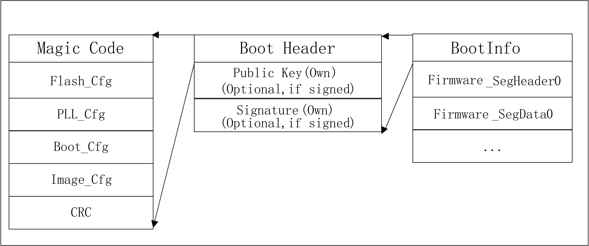

=======================
UART/SDIO启动镜像格式
=======================
BL602系列芯片支持UART/SDIO启动。可以通过UART/SDIO接口将一段可执行程序下载到RAM中运行。下载程序的结构，需要满足 BL602  Bootrom
定义的格式。对于没有启动安全设定的应用程序，即不启用加密和签名的应用程序，其下载镜像的格式如下图所示：

.. figure:: ../../picture/UartSdioBootImageNoSecret.png
   :align: center

   UART/SDIO启动镜像(不加密&不签名)

下载镜像由三部分组成：

- BootInfo
    主要包含BootInfo的Magic Code，Flash的配置信息(UART下载不需要Flash信息，只是和Flash启动的镜像兼容）,PLL 配置信息，
    启动参数信息以及镜像配置信息等。

- SegmentHeader
    下载程序或者数据段的段头信息，主要用于指定接下来传输的数据段，要放在内存的哪个地址以及数据长度等信息。

- SegmenData
    下载程序或者数据段的主体。

SegmentHeader和SegmenData可以有多个，具体的个数信息在BootInfo的镜像配置信息中设定。

对于启用加密和签名设定的下载镜像，其文件格式如下所示：

.. figure:: ../../picture/UartSdioBootImage.png
   :align: center

   UART/SDIO启动镜像(加密&签名)

与普通下载镜像相比，加密和签名的镜像，BootInfo中需要包含公钥，签名以及AES IV等信息。
对于启用加密但是不签名的下载镜像，文件格式如下所示：

.. figure:: ../../picture/UartSdioBootImageSecret.png
   :align: center

   UART/SDIO启动镜像(加密&不签名)

对于启用签名但是不启用加密的下载镜像，文件格式如下所示：

   UART/SDIO启动镜像(签名&不加密)

启动引脚
===========
BL602 系列支持一路UART，一路SDIO启动。

.. table:: UART/SDIO启动引脚分配 

    +------------+------------------------+--------------------+
    | GPIO引脚   | Function               | Comments           | 
    +------------+------------------------+--------------------+
    | GPIO8      | Boot Pin               |                    |
    +------------+------------------------+--------------------+
    | GPIO7      | UART RXD               | UART Channel1      |
    +------------+------------------------+                    +
    | GPIO16     | UART TXD               |                    |
    +------------+------------------------+--------------------+
    | GPIO0      | SDIO_CLK               | SDIO Channel       |
    +------------+------------------------+                    +
    | GPIO1      | SDIO_CMD               |                    |
    +------------+------------------------+                    +
    | GPIO2      | SDIO_DATA0             |                    |
    +------------+------------------------+                    +
    | GPIO3      | SDIO_DATA1             |                    |
    +------------+------------------------+                    +
    | GPIO4      | SDIO_DATA2             |                    |
    +------------+------------------------+                    +
    | GPIO5      | SDIO_DATA3             |                    |
    +------------+------------------------+--------------------+

若想要从UART/SDIO启动，需要将GPIO8拉高，然后复位芯片，Bootrom会依次扫描UART和SDIO这两个接口，并在该接口等待握手信号，
握手超时（2ms）后会进行下一个接口的扫描，如果在某个接口上握手成功，则进入接收数据处理流程，在数据处理期间，
一旦发送错误或者超时（2s）,会进行下一个接口的扫描，如此依次循环进行，直到收到合法的启动镜像，完成启动任务。

UART握手
==========
UART通信的配置为1bit起始位，8bit数据位，1bit停止位，无奇偶校验位。

Bootrom从UART/SDIO启动后，会循环检测GPIO7引脚的电平变化，当主机发送0x55数据串被捕捉后，Bootrom开始计算当前串口波特率，
并根据检测结果设定UART寄存器的值，并以当前波特率回复“OK”。主机收到“OK”后可以进行正常的通信。UART通信超时时间是2s,
Bootrom在回复“OK”以后的2s内如果没有收到任何数据，或者在通信过程中，出现2s以内没有收到任何数据，则认为是通信超时， 
超时以后重新进入握手流程。

主机发送握手数据时间建议是5ms，以便让Bootrom有充足的时间检测到握手信号，主机收到“OK”以后，建议延时20ms再通信，以防止后续的
通信数据与之前的握手数据混在一起。

由于从UART/SDIO启动时，Bootrom使用RC32M时钟，握手波特率建议不超过500K。握手过程如下：

.. figure:: ../../picture/UartHands.png
   :align: center

    UART握手流程

SDIO握手
==========
Bootrom会等待SDIO Host写握手寄存器（SDU_BASE+0x160），当SDIO查询到握手寄存器被写1以后，
认为握手成功。Bootrom会等待主机发送数据，并根据接收到数据命令进行处理，如果发生超时(2s内没有接收到数据）会重新进入握手流程。

生成下载镜像文件
==================
博流提供了UART/SDIO下载镜像生成工具，用户可通过下载\ `Bouffalo Lab Dev Cube For Windows <https://dev.bouffalolab.com/download>`__\ ，
获取最新的Dev Cube，运行 BLDevCube.exe, 在 Chip Type 中选择 BL602 ，进入烧写界面。在 View 菜单中选择 MCU 选项，进入MCU程序下载界面。

.. figure:: ../../picture/CreateImage.png
   :align: center

    下载界面

如若只生成UART/SDIO下载镜像，则可只配置右侧的烧录镜像参数，具体配置如下：

- Boot Source：选择UART/SDIO，表示生成UART/SDIO启动镜像
- BootInfo Addr：程序启动参数的存放地址，此处填写 0x0即可
- Image Type：默认为 SingleCPU
- Image Addr：应用程序的下载地址，用户可根据实际程序的运行地址填写即可，例如0x22020800
- Image File：选择用户编译生成中的RAM程序。

完成选项配置后，点击 Create&Download 按钮，会生成对应的镜像文件。生成的文件路径为: bl602/img_create2/img_if.bin。
img_if.bin就是满足UART/SDIO启动镜像格式的文件。

如需启用加密和签名功能，展开工具中的advanced options选项，完成配置后，同样点击Create&Download 按钮即可。

UART/SDIO下载程序通信协议
===============================
Bootrom在完成UART/SDIO通信握手后，即可进入正常的下载程序通信流程，下面详细介绍通信过程。
需要注意的是，Bootrom所能接收的协议数据最大长度为4096bytes。

Get boot info
---------------

.. table:: Host->Chip

    +----------------+-------------+----------------+------------------+
    | cmdId(1byte)   | Rsvd(1byte) | Len_lsb(1byte) | Len_msb(1byte)   |
    +----------------+-------------+----------------+------------------+
    | 0x10           | 0x00        | 0x00           | 0x00             |
    +----------------+-------------+----------------+------------------+

.. table:: Chip->Host

    +----------------+-----------------+----------------+--------------------------+-------------------+
    | ‘OK’(2bytes)   | Len_lsb(1byte)  | Len_msb(1byte) | BootRom Version(4bytes)  | OTP info(16bytes) |
    +----------------+-----------------+----------------+--------------------------+-------------------+
    | 0x4F 0x4B      | 0x14            | 0x00           |                          |                   |
    +----------------+-----------------+----------------+--------------------------+-------------------+

这是主机与 BL602 通信的第一条指令，读取 BL602 相关信息。主机要根据sign_type判断BL602 是否要求接收签名的镜像；
根据encrypted判断 BL602 是否要求接收加密的镜像。如果已知芯片没有启动加密和签名，则可跳过对该信息的解析。

+----------------+-------------+----------------+
|                | 2b’00       | 其它           |
+----------------+-------------+----------------+
| sign_type      | 不签名      | 签名           |
+----------------+-------------+----------------+
| encrypted      | 不加密      | 加密           |
+----------------+-------------+----------------+

Load boot header
---------------------

.. table:: Host->Chip

    +----------------+-------------+----------------+------------------+----------------------+
    | cmdId(1byte)   | Rsvd(1byte) | Len_lsb(1byte) | Len_msb(1byte)   | BootHeader(176bytes) |
    +----------------+-------------+----------------+------------------+----------------------+
    | 0x11           | 0x00        | 0xb0           | 0x00             |                      |
    +----------------+-------------+----------------+------------------+----------------------+

.. table:: Chip->Host

    +----------------+
    | ‘OK’(2bytes)   |
    +----------------+
    | 0x4F 0x4B      |
    +----------------+

176bytes的BootHeader结构体如下：

.. code-block:: c

    __PACKED_STRUCT boot_flash_cfg_t
   {
        uint32_t magiccode;       /*'FCFG'*/
        SPI_Flash_Cfg_Type cfg;
        uint32_t crc32;
   };

    __PACKED_STRUCT sys_clk_cfg_t
   {
        uint8_t xtal_type;
        uint8_t pll_clk;
        uint8_t hclk_div;
        uint8_t bclk_div;

        uint8_t flash_clk_type;
        uint8_t flash_clk_div;
        uint8_t rsvd[2];
   };

    __PACKED_STRUCT boot_clk_cfg_t
   {
        uint32_t magiccode;       /*'PCFG'*/

        struct sys_clk_cfg_t cfg;

        uint32_t crc32;
   };

    __PACKED_STRUCT bootheader_t
   {
        uint32_t magiccode;       			/*'BFXP'*/
        uint32_t rivison; 
        struct boot_flash_cfg_t flashCfg;       
        struct boot_clk_cfg_t   clkCfg;
        __PACKED_UNION {
            __PACKED_STRUCT {
                uint32_t sign               :  2;   /* [1: 0]  for sign*/
                uint32_t encrypt_type       :  2;   /* [3: 2]  for encrypt */
                uint32_t key_sel            :  2;   /* [5: 4]  for key sel in boot interface*/
                uint32_t rsvd6_7            :  2;   /* [7: 6]  for encrypt*/
                uint32_t no_segment         :  1;   /* [8]     no segment info */
                uint32_t cache_enable       :  1;   /* [9]     for cache */
                uint32_t notload_in_bootrom :  1;   /* [10]    not load this img in bootrom */
                uint32_t aes_region_lock    :  1;   /* [11]    aes region lock */
                uint32_t cache_way_disable  :  4;   /* [15: 12]  cache way disable info*/
                uint32_t crc_ignore         :  1;   /* [16]    ignore crc */
                uint32_t hash_ignore        :  1;   /* [17]    hash crc */
                uint32_t halt_ap            :  1;   /* [18]    halt ap */
                uint32_t rsvd19_31          :  13;  /* [31:19]  rsvd */
            } bval;
            uint32_t wval;
        }bootcfg ;

        uint32_t segment_cnt;

        uint32_t bootentry;      /* entry point of the image*/

        uint32_t flashoffset;

        uint8_t hash[BFLB_BOOTROM_HASH_SIZE];    /*hash of the image*/

        uint32_t rsv1;
        uint32_t rsv2;
        uint32_t crc32;
    };

Load public key (Optional)
------------------------------

.. table:: Host->Chip

    +----------------+-------------+----------------+------------------+----------------------+
    | cmdId(1byte)   | Rsvd(1byte) | Len_lsb(1byte) | Len_msb(1byte)   | PKey(68bytes)        |
    +----------------+-------------+----------------+------------------+----------------------+
    | 0x12           | 0x00        | 0x44           | 0x00             |                      |
    +----------------+-------------+----------------+------------------+----------------------+

.. table:: Chip->Host

    +----------------+
    | ‘OK’(2bytes)   |
    +----------------+
    | 0x4F 0x4B      |
    +----------------+

只有当镜像有签名的时候主机才发送这个命令。没有启动签名的情况下，应跳过这个命令的发送。68字节的Public Key结构体如下：

.. code-block:: c

    __PACKED_STRUCT pkey_cfg_t
    {
        uint8_t eckeyx[32];        //ec key in boot info
        uint8_t eckeyy[32];        //ec key in boot info
        uint32_t crc32;
    };

Load signature (Optional)
------------------------------

.. table:: Host->Chip

    +----------------+-------------+----------------+------------------+----------------------+
    | cmdId(1byte)   | Rsvd(1byte) | Len_lsb(1byte) | Len_msb(1byte)   | Signature(Nbytes)    |
    +----------------+-------------+----------------+------------------+----------------------+
    | 0x14           | 0x00        | N&0xFF         | (N&0xFF00)>>8    |                      |
    +----------------+-------------+----------------+------------------+----------------------+

.. table:: Chip->Host

    +----------------+
    | ‘OK’(2bytes)   |
    +----------------+
    | 0x4F 0x4B      |
    +----------------+

只有当镜像有签名的时候主机才发送这个命令。没有启动签名的情况下，应跳过这个命令的发送。
Signature的有效长度不是固定的，其结构体示意如下：

.. code-block:: c

    __PACKED_STRUCT sign_cfg_t
    {
	    uint32_t sig_len;
	    uint8_t signature[sig_len];
	    uint32_t crc32;
    };

主机发送signature时可先读取sig_len获得需要发送的signature长度为sig_len+8。

Load AES IV (Optional)
------------------------------

.. table:: Host->Chip

    +----------------+-------------+----------------+------------------+----------------------+
    | cmdId(1byte)   | Rsvd(1byte) | Len_lsb(1byte) | Len_msb(1byte)   | AES IV(20bytes)      |
    +----------------+-------------+----------------+------------------+----------------------+
    | 0x16           | 0x00        | 0x14           | 0x00             |                      |
    +----------------+-------------+----------------+------------------+----------------------+

.. table:: Chip->Host

    +----------------+
    | ‘OK’(2bytes)   |
    +----------------+
    | 0x4F 0x4B      |
    +----------------+

只有当镜像有加密的时候主机才发送这个命令。没有启动加密的情况下，应跳过这个命令的发送。

20bytes的AES IV结构体如下：

.. code-block:: c

   __PACKED_STRUCT aesiv_cfg_t
  {
        uint8_t aesiv[16];
        uint32_t crc32;
  };

Load Segment Header
------------------------------

.. table:: Host->Chip

    +----------------+-------------+----------------+------------------+----------------------+
    | cmdId(1byte)   | Rsvd(1byte) | Len_lsb(1byte) | Len_msb(1byte)   | Seg header(16bytes)  |
    +----------------+-------------+----------------+------------------+----------------------+
    | 0x17           | 0x00        | 0x10           | 0x00             |                      |
    +----------------+-------------+----------------+------------------+----------------------+

.. table:: Chip->Host

    +----------------+
    | ‘OK’(20bytes)  |
    +----------------+
    | 0x4F 0x4B      |
    +----------------+

UART/SDIO启动镜像支持多个segment，每个segment的数据和代码可以由启动程序
加载到Segheader指定的地址上。而镜像中segment的个数由BootHeader中的
segment_cnt(具体参考1.5.2)成员决定。主机需要在Load boot header过程中记录下
这个变量，然后循环segment_cnt次Load Segment Header与Load Segment Data。

16bytes的seg header用下面的结构体描述：

.. code-block:: c

   __PACKED_STRUCT segment_header_t
   {
	    uint32_t destaddr;
	    uint32_t len;
	    uint32_t rsvd;
	    uint32_t crc32;
   };

Load Segment Data
------------------------------

.. table:: Host->Chip

    +----------------+-------------+----------------+------------------+----------------------+
    | cmdId(1byte)   | Rsvd(1byte) | Len_lsb(1byte) | Len_msb(1byte)   | Seg Data(Nbytes)     |
    +----------------+-------------+----------------+------------------+----------------------+
    | 0x18           | 0x00        | N&0xFF         | (N&0xFF00)>>8    |                      |
    +----------------+-------------+----------------+------------------+----------------------+

.. table:: Chip->Host

    +----------------+
    | ‘OK’(2bytes)   |
    +----------------+
    | 0x4F 0x4B      |
    +----------------+

对于一个Segment Data，由于一个协议帧4096bytes的限制，
可能需要多次发送Load Segment Data来传输数据。
这里要保证多次传递的数据帧中数据长度之和与Segment Header中描述的len相等。

Check image
------------------------------

.. table:: Host->Chip

    +----------------+-------------+----------------+------------------+
    | cmdId(1byte)   | Rsvd(1byte) | Len_lsb(1byte) | Len_msb(1byte)   |
    +----------------+-------------+----------------+------------------+
    | 0x19           | 0x00        | 0x00           | 0x00             |
    +----------------+-------------+----------------+------------------+

.. table:: Chip->Host

    +----------------+
    | ‘OK’(2bytes)   |
    +----------------+
    | 0x4F 0x4B      |
    +----------------+

镜像下载到RAM后，必须检查镜像的完整性与合法性。

Run image
------------------------------

.. table:: Host->Chip

    +----------------+-------------+----------------+------------------+
    | cmdId(1byte)   | Rsvd(1byte) | Len_lsb(1byte) | Len_msb(1byte)   |
    +----------------+-------------+----------------+------------------+
    | 0x1A           | 0x00        | 0x00           | 0x00             |
    +----------------+-------------+----------------+------------------+

.. table:: Chip->Host

    +----------------+
    | ‘OK’(2bytes)   |
    +----------------+
    | 0x4F 0x4B      |
    +----------------+

在Check image命令返回OK的情况下，通过该命令可以运行下载到RAM中的镜像，BL602 执行该命令后就从UART/SDIO
启动程序跳转到下载的镜像程序中去运行。

错误应答帧
------------------------------
以上 BL602 Host的应答帧都是正确情况时的回复，如果在通信过程中出现错误，Bootrom错误返数据格式如下，用户可根据错误代码查询错误原因：

.. table:: Host->Chip

    +----------------+------------------------+----------------------+
    | ‘FL’(2bytes)   | Error_Code_LSB(1byte)  | Error_Code_MSB(1byte)|
    +----------------+------------------------+----------------------+
    | 0x46 0x4C      |                        |                      |
    +----------------+------------------------+----------------------+

Error_Code列举如下：

.. code-block:: c

   /*error code definition*/
   typedef  enum tag_bootrom_error_code_t
   { 
        BFLB_BOOTROM_SUCCESS=0x00,

        /*flash*/
        BFLB_BOOTROM_FLASH_INIT_ERROR=0x0001,
        BFLB_BOOTROM_FLASH_ERASE_PARA_ERROR=0x0002,
        BFLB_BOOTROM_FLASH_ERASE_ERROR=0x0003,
        BFLB_BOOTROM_FLASH_WRITE_PARA_ERROR=0x0004,
        BFLB_BOOTROM_FLASH_WRITE_ADDR_ERROR=0x0005,
        BFLB_BOOTROM_FLASH_WRITE_ERROR=0x0006,
        BFLB_BOOTROM_FLASH_BOOT_PARA=0x0007,

        /*cmd*/
        BFLB_BOOTROM_CMD_ID_ERROR =0x0101,
        BFLB_BOOTROM_CMD_LEN_ERROR=0x0102,
        BFLB_BOOTROM_CMD_CRC_ERROR=0x0103,
        BFLB_BOOTROM_CMD_SEQ_ERROR=0x0104,

        /*image*/
        BFLB_BOOTROM_IMG_BOOTHEADER_LEN_ERROR=0x0201,
        BFLB_BOOTROM_IMG_BOOTHEADER_NOT_LOAD_ERROR=0x0202,
        BFLB_BOOTROM_IMG_BOOTHEADER_MAGIC_ERROR=0x0203,
        BFLB_BOOTROM_IMG_BOOTHEADER_CRC_ERROR=0x0204,
        BFLB_BOOTROM_IMG_BOOTHEADER_ENCRYPT_NOTFIT=0x0205,
        BFLB_BOOTROM_IMG_BOOTHEADER_SIGN_NOTFIT=0x0206,
        BFLB_BOOTROM_IMG_SEGMENT_CNT_ERROR=0x0207,
        BFLB_BOOTROM_IMG_AES_IV_LEN_ERROR=0x0208,
        BFLB_BOOTROM_IMG_AES_IV_CRC_ERROR=0x0209,
        BFLB_BOOTROM_IMG_PK_LEN_ERROR=0x020a,
        BFLB_BOOTROM_IMG_PK_CRC_ERROR=0x020b,
        BFLB_BOOTROM_IMG_PK_HASH_ERROR=0x020c,
        BFLB_BOOTROM_IMG_SIGNATURE_LEN_ERROR=0x020d,
        BFLB_BOOTROM_IMG_SIGNATURE_CRC_ERROR=0x020e,
        BFLB_BOOTROM_IMG_SECTIONHEADER_LEN_ERROR=0x020f,
        BFLB_BOOTROM_IMG_SECTIONHEADER_CRC_ERROR=0x0210,
        BFLB_BOOTROM_IMG_SECTIONHEADER_DST_ERROR=0x0211,
        BFLB_BOOTROM_IMG_SECTIONDATA_LEN_ERROR=0x0212,
        BFLB_BOOTROM_IMG_SECTIONDATA_DEC_ERROR=0x0213,
        BFLB_BOOTROM_IMG_SECTIONDATA_TLEN_ERROR=0x0214,
        BFLB_BOOTROM_IMG_SECTIONDATA_CRC_ERROR=0x0215,
        BFLB_BOOTROM_IMG_HALFBAKED_ERROR=0x0216,
        BFLB_BOOTROM_IMG_HASH_ERROR=0x0217,
        BFLB_BOOTROM_IMG_SIGN_PARSE_ERROR=0x0218,
        BFLB_BOOTROM_IMG_SIGN_ERROR=0x0219,
        BFLB_BOOTROM_IMG_DEC_ERROR=0x021a,
        BFLB_BOOTROM_IMG_ALL_INVALID_ERROR=0x021b,

        /*IF*/
        BFLB_BOOTROM_IF_RATE_LEN_ERROR=0x0301,
        BFLB_BOOTROM_IF_RATE_PARA_ERROR=0x0302,
        BFLB_BOOTROM_IF_PASSWORDERROR=0x0303,
        BFLB_BOOTROM_IF_PASSWORDCLOSE=0x0304,

        /*MISC*/
        BFLB_BOOTROM_PLL_ERROR=0xfffc,
        BFLB_BOOTROM_INVASION_ERROR=0xfffd,
        BFLB_BOOTROM_POLLING=0xfffe,
        BFLB_BOOTROM_FAIL=0xffff,

    }bootrom_error_code_t;

下载流程示意
------------------------------

对于一个没有启用加密和签名的程序，在只有一个segment的时候，其下载流程示意如下：

.. code-block:: c

    1.设置BL602 从UART/SDIO启动
    2.打开串口，设置通信波特率，打开要下载的文件fp=open("img_if.bin","rb")
    3.发送5ms的握手信号，UART_Send(0x555555...)
    4.等待接收602的OK应答，延时20ms
    5.发送get boot info命令
    6.等待接收4+20字节的应答
    7.读取176字节的数据，data=fp.read(176),使用load boot header 命令发送176字节的BootHeader
    8.等待接收OK应答
    9.读取16字节的数据，data=fp.read(16),解析SegmentData的总长度segDataLen，使用load segment header 命令发送16字节的SegmentHeader
    10.等待接收OK应答
    11.sendDataLen=0;
       while sendDataLen<segDataLen:
            readDataLen=segDataLen-sendDataLen
            if readDataLen>4096-4:
                readDataLen=4096-4:
            读取readDataLen字节数据，data=fp.read(readDataLen)
            使用load segment data 命令发送readDataLen字节的SegmentData
            sendDataLen+=readDataLen
            等待接收OK应答
    12.发送Check image命令检查镜像，等待接收OK应答
    13.发送Run image命令运行程序，等待接收OK应答

以上过程中，如Bootrom返回错误，则终止下载流程。

================
Eflash_loader
================

Eflash_loader是由博流提供的用于Flash烧写、读取、校验的可执行程序，
可以通过UART/SDIO下载到RAM中运行。Eflash_Loader镜像没有加密与签名，
并且只有一个segment，其镜像结构如下图所示：

.. figure:: ../../picture/EflashLoader.png
   :align: center

   Eflash_Loader启动镜像
   
下载并运行Eflash_loader
=========================

通过上述1.5.11步骤，可以下载Elfash_loader到RAM并运行：
握手，Get boot info，Load boot header，Load Segment Header，Load Segment Data，Check image，Run Image。

Eflash_loader通信协议
========================
主机通过UART/SDIO把Eflash_loader下载到RAM中并运行后，主机继续通过UART接口与Eflash_loader通信。UART引脚同1.1，握手过程同1.2，
Eflash_loader中配置了高精度的PLL，可以使用较高的波特率进行握手通信，建议使用的波特率为115200、1M、2M、2.5M。握手成功后，
主机通过以下协议实现Flash烧录功能：

Chip Erase
------------------------------

.. table:: Host->Chip

    +----------------+--------------+----------------+------------------+
    | cmdId(1byte)   | cksum(1byte) | Len_lsb(1byte) | Len_msb(1byte)   |
    +----------------+--------------+----------------+------------------+
    | 0x3C           | Cksum for len| 0x00           | 0x00             |
    +----------------+--------------+----------------+------------------+

.. table:: Chip->Host

    +----------------+
    | ‘OK’(2bytes)   |
    +----------------+
    | 0x4F 0x4B      |
    +----------------+

该命令用于擦除整片Flash。这里参与校验和计算的数据为cksum字节后的所有数据(以下指令与此相同)。校验是可选项，如果不想开启校验，可以将cksum设置为0。

假设有data_len长度(包含Len_lsb和Len_msb)的数据要参与计算，计算校验和伪代码如下：

.. code-block:: c

   uint32_t sum=0;
   uint8_t cksum;
   while(i<data_len)
   {
      sum+=data[i];
      i++;
    }
   chsum=sum&0xff;

Flash Erase
------------------------------

.. table:: Host->Chip

    +----------------+--------------------+----------------+------------------+-------------------+------------------+
    | cmdId(1byte)   | cksum(1byte)       | Len_lsb(1byte) | Len_msb(1byte)   |Start_addr(4bytes) | End_addr(4bytes) |
    +----------------+--------------------+----------------+------------------+-------------------+------------------+
    | 0x30           | Cksum datas behind | 0x08           | 0x00             |                   |                  |
    +----------------+--------------------+----------------+------------------+-------------------+------------------+

.. table:: Chip->Host

    +----------------+
    | ‘OK’(2bytes)   |
    +----------------+
    | 0x4F 0x4B      |
    +----------------+

该命令用于擦除指定地址空间的Flash。

Flash的地址从0开始，这里以1M Flash为例示意Flash地址空间：

.. figure:: ../../picture/FlashAddress.png
   :align: center

   Flash地址空间示意

Flash Program
------------------------------

.. table:: Host->Chip

    +----------------+--------------------+----------------+------------------+-------------------+------------------+
    | cmdId(1byte)   | cksum(1byte)       | Len_lsb(1byte) | Len_msb(1byte)   |Start_addr(4bytes) | payload(Nbytes)  |
    +----------------+--------------------+----------------+------------------+-------------------+------------------+
    | 0x31           | Cksum datas behind | (N+4)&0xff     | ((N+4)>>8)&0xff  |                   |                  |
    +----------------+--------------------+----------------+------------------+-------------------+------------------+

.. table:: Chip->Host

    +----------------+
    | ‘OK’(2bytes)   |
    +----------------+
    | 0x4F 0x4B      |
    +----------------+

写入Nbytes数据到Flash指定地址空间。由于Eflash_loader中使用的缓冲区的限制，payload最大为8Kbytes。

Flash Program Check
------------------------------
.. table:: Host->Chip

    +----------------+--------------+----------------+------------------+
    | cmdId(1byte)   | cksum(1byte) | Len_lsb(1byte) | Len_msb(1byte)   |
    +----------------+--------------+----------------+------------------+
    | 0x3A           | Cksum for len| 0x00           | 0x00             |
    +----------------+--------------+----------------+------------------+

.. table:: Chip->Host

    +----------------+
    | ‘OK’(2bytes)   |
    +----------------+
    | 0x4F 0x4B      |
    +----------------+

该命令用于Flash烧写数据全部发送完毕后，用来确认Flash数据烧写过程中是否出现错误。如果Flash烧写全部正确，则返回OK。否则返回FL+错误代码，此处的错误代码是BFLB_EFLASH_LOADER_FLASH_WRITE_ERROR，详见错误应答帧。

Flash Read
------------------------------

.. table:: Host->Chip

    +----------------+--------------------+----------------+------------------+-------------------+------------------+
    | cmdId(1byte)   | cksum(1byte)       | Len_lsb(1byte) | Len_msb(1byte)   |Start_addr(4bytes) | Read_len(4bytes) |
    +----------------+--------------------+----------------+------------------+-------------------+------------------+
    | 0x32           | Cksum datas behind | 0x08           | 0x00             |                   |                  |
    +----------------+--------------------+----------------+------------------+-------------------+------------------+

.. table:: Chip->Host

    +----------------+----------------+----------------+-----------------+
    | ‘OK’(2bytes)   | Len_lsb(1byte) | Len_msb(1byte) | payload(Nbytes) |
    +----------------+----------------+----------------+-----------------+
    | 0x4F 0x4B      | N&0xff         | (N>>8)&0xff    |                 |
    +----------------+----------------+----------------+-----------------+

该命令从Flash指定地址空间读取Nbytes数据。由于Eflash_loader中使用的缓冲区的限制，Read_len最大为8K。

SHA256 Read
------------------------------

.. table:: Host->Chip

    +----------------+--------------------+----------------+------------------+-------------------+------------------+
    | cmdId(1byte)   | cksum(1byte)       | Len_lsb(1byte) | Len_msb(1byte)   |Start_addr(4bytes) | Len(4bytes)      |
    +----------------+--------------------+----------------+------------------+-------------------+------------------+
    | 0x3D           | Cksum datas behind | 0x08           | 0x00             |                   |                  |
    +----------------+--------------------+----------------+------------------+-------------------+------------------+

.. table:: Chip->Host

    +----------------+----------------+----------------+-----------------+
    | ‘OK’(2bytes)   | Len_lsb(1byte) | Len_msb(1byte) | payload(32bytes)|
    +----------------+----------------+----------------+-----------------+
    | 0x4F 0x4B      | 0x20           | 0x00           |                 |
    +----------------+----------------+----------------+-----------------+

该命令用于快速校验Flash烧写是否正确。主机发送要计算的Flash数据的起始地址及长度，
BL602 返回该段数据的SHA256值。主机也同步计算刚刚烧录文件的SHA256，然后与返回结果对比，可快速的校验Flash是否烧写正确。

错误应答帧
------------------------------
以上 BL602 Host的应答帧都是正确情况时的回复，Eflash_loader错误返回帧格式如下：

.. table:: Host->Chip

    +----------------+------------------------+----------------------+
    | ‘FL’(2bytes)   | Error_Code_LSB(1byte)  | Error_Code_MSB(1byte)|
    +----------------+------------------------+----------------------+
    | 0x46 0x4C      |                        |                      |
    +----------------+------------------------+----------------------+

Error_Code列举如下：

.. code-block:: c

    typedef  enum tag_eflash_loader_error_code_t
    {
        BFLB_EFLASH_LOADER_SUCCESS=0x00,

        /*flash*/
        BFLB_EFLASH_LOADER_FLASH_INIT_ERROR=0x0001,
        BFLB_EFLASH_LOADER_FLASH_ERASE_PARA_ERROR=0x0002,
        BFLB_EFLASH_LOADER_FLASH_ERASE_ERROR=0x0003,
        BFLB_EFLASH_LOADER_FLASH_WRITE_PARA_ERROR=0x0004,
        BFLB_EFLASH_LOADER_FLASH_WRITE_ADDR_ERROR=0x0005,
        BFLB_EFLASH_LOADER_FLASH_WRITE_ERROR=0x0006,
        BFLB_EFLASH_LOADER_FLASH_BOOT_PARA_ERROR=0x0007,
        BFLB_EFLASH_LOADER_FLASH_SET_PARA_ERROR=0x0008,
        BFLB_EFLASH_LOADER_FLASH_READ_STATUS_REG_ERROR=0x0009,
        BFLB_EFLASH_LOADER_FLASH_WRITE_STATUS_REG_ERROR=0x000A,

        /*cmd*/
        BFLB_EFLASH_LOADER_CMD_ID_ERROR =0x0101,
        BFLB_EFLASH_LOADER_CMD_LEN_ERROR=0x0102,
        BFLB_EFLASH_LOADER_CMD_CRC_ERROR=0x0103,
        BFLB_EFLASH_LOADER_CMD_SEQ_ERROR=0x0104,

        /*image*/
        BFLB_EFLASH_LOADER_IMG_BOOTHEADER_LEN_ERROR=0x0201,
        BFLB_EFLASH_LOADER_IMG_BOOTHEADER_NOT_LOAD_ERROR=0x0202,
        BFLB_EFLASH_LOADER_IMG_BOOTHEADER_MAGIC_ERROR=0x0203,
        BFLB_EFLASH_LOADER_IMG_BOOTHEADER_CRC_ERROR=0x0204,
        BFLB_EFLASH_LOADER_IMG_BOOTHEADER_ENCRYPT_NOTFIT=0x0205,
        BFLB_EFLASH_LOADER_IMG_BOOTHEADER_SIGN_NOTFIT=0x0206,
        BFLB_EFLASH_LOADER_IMG_SEGMENT_CNT_ERROR=0x0207,
        BFLB_EFLASH_LOADER_IMG_AES_IV_LEN_ERROR=0x0208,
        BFLB_EFLASH_LOADER_IMG_AES_IV_CRC_ERROR=0x0209,
        BFLB_EFLASH_LOADER_IMG_PK_LEN_ERROR=0x020a,
        BFLB_EFLASH_LOADER_IMG_PK_CRC_ERROR=0x020b,
        BFLB_EFLASH_LOADER_IMG_PK_HASH_ERROR=0x020c,
        BFLB_EFLASH_LOADER_IMG_SIGNATURE_LEN_ERROR=0x020d,
        BFLB_EFLASH_LOADER_IMG_SIGNATURE_CRC_ERROR=0x020e,
        BFLB_EFLASH_LOADER_IMG_SECTIONHEADER_LEN_ERROR=0x020f,
        BFLB_EFLASH_LOADER_IMG_SECTIONHEADER_CRC_ERROR=0x0210,
        BFLB_EFLASH_LOADER_IMG_SECTIONHEADER_DST_ERROR=0x0211,
        BFLB_EFLASH_LOADER_IMG_SECTIONDATA_LEN_ERROR=0x0212,
        BFLB_EFLASH_LOADER_IMG_SECTIONDATA_DEC_ERROR=0x0213,
        BFLB_EFLASH_LOADER_IMG_SECTIONDATA_TLEN_ERROR=0x0214,
        BFLB_EFLASH_LOADER_IMG_SECTIONDATA_CRC_ERROR=0x0215,
        BFLB_EFLASH_LOADER_IMG_HALFBAKED_ERROR=0x0216,
        BFLB_EFLASH_LOADER_IMG_HASH_ERROR=0x0217,
        BFLB_EFLASH_LOADER_IMG_SIGN_PARSE_ERROR=0x0218,
        BFLB_EFLASH_LOADER_IMG_SIGN_ERROR=0x0219,
        BFLB_EFLASH_LOADER_IMG_DEC_ERROR=0x021a,
        BFLB_EFLASH_LOADER_IMG_ALL_INVALID_ERROR=0x021b,

        /*IF*/
        BFLB_EFLASH_LOADER_IF_RATE_LEN_ERROR=0x0301,
        BFLB_EFLASH_LOADER_IF_RATE_PARA_ERROR=0x0302,
        BFLB_EFLASH_LOADER_IF_PASSWORDERROR=0x0303,
        BFLB_EFLASH_LOADER_IF_PASSWORDCLOSE=0x0304,

        /*MISC*/
        BFLB_EFLASH_LOADER_PLL_ERROR=0xfffc,
        BFLB_EFLASH_LOADER_INVASION_ERROR=0xfffd,
        BFLB_EFLASH_LOADER_POLLING=0xfffe,
        BFLB_EFLASH_LOADER_FAIL=0xffff,

    }eflash_loader_error_code_t;

