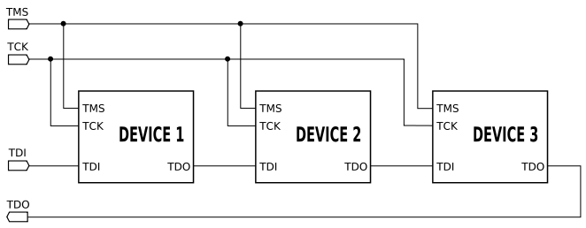
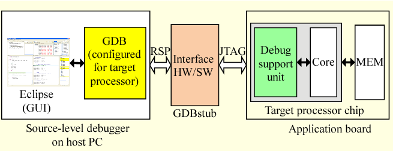
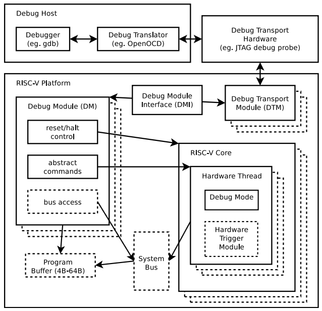

===================
芯片调试
===================
芯片调试的目的是为了快速的分析及解决软硬件出现的问题。

调试的手段有：硬件模拟器(如早期8031)，硬件仿真器，打log等等。微处理器调试的历史参考
\ `A history of uP debug, 1980 – 2016 <https://www.embedded.com/a-history-of-microprocessor-debug-1980-2016/>`__\。
新的处理器增加了片上调试部件(OCD/ICE)，可用于实现在线仿真。

调试部件的硬件接口：

- 单线（debugWIRE）：为了降低成本和调试引脚的开销，仅使用一根信号线（RESET），即可完成调试信息的交互，达到控制程序流向，执行指令以及编程熔丝位的功能

- 双线（SWD）：SWDIO--串行数据线；SWDCLK--串行时钟线

- 四线（JTAG）：TCK--测试时钟输入；TDI--测试数据输入，数据通过TDI输入JTAG口；
  TDO--测试数据输出，数据通过TDO从JTAG口输出；TMS--测试模式选择，TMS用来设置JTAG口处于某种特定的测试模式

JTAG
=========
JTAG(Joint Test Action Group，联合测试工作组)是一种国际标准测试协议（IEEE 1149.1兼容），主要用于芯片内部测试。现在多数的高级器件都支持JTAG协议，如DSP、FPGA器件等。标准的JTAG接口是4线：TMS、TCK、TDI、TDO，分别为模式选择、时钟、数据输入和数据输出线。
还有一个可选引脚TRST，用来测试复位，是输入引脚，低电平时有效。

JTAG接口可以一对一的使用，也可以组成菊花链的一对多拓扑结构，拓扑结构如下图所示：

   JTAG接口连接

调试环境
============

- PC上的调试器(GDB)
- 软件调试的代理(OpenOCD)
- 硬件调试代理/适配器(FT2232)
- 调试目标(RISC-V)

   调试环境示意图

================
RISC-V调试部件
================

   RISC-V调试系统框架

由上图看出，框架一共分为3个部分，分别是Debug Host，例如PC；
Debug Transport Hardware，例如JLink或者CMSIS-DAP等的调试工具；
第三部分是嵌入在芯片内部的调试模块。在调试模块内部，
DTM模块与调试工具直接进行交互，它通过DMI接口与DM模块进行交互。

========================
OpenOCD
========================

简介
==========
OpenOCD是一个开源的软件调试代理，可以支持各种架构处理器的调试和烧写；
支持各种调试硬件代理/适配器：FTDI, J-link等。OpenOCD接收来自GDB的命令(socket)，再通过硬件代理与芯片上的调试部件通信以完成各种调试任务。
OpenOCD还有一个telnet服务器，可以进行一些独立的操作。具体可参考
\ `https://github.com/ntfreak/openocd <https://github.com/ntfreak/openocd>`__\

FT2232
===============
FT2232 是FTDI生产的一系列USB转串口的桥接芯片中的一颗。
其中的第一个数字2，表示芯片有2个转串口组件；尾缀字母代表规格(速度等)。
其特殊之处在于其内部每个串口组件都实现了MPSSE，可以实现USB转JTAG，因此被广泛应用在了JTAG仿真器的硬件上。
默认情况下，芯片被识别为2个(USB转接出来的)串口，
OpenOCD对FTDI系列的支持：通过特定驱动使用MPSSE做为JTAG硬件接口。
在Windows下使用需要调整驱动(Zadig, WinUSB)，
在Linux下使用需要注意权限。

因为FT2xxx内部有两个转串口部件(interface)，因此在OpenOCD的配置中需要选择JTAG口位于哪个interface。

- Sipeed USB 调试器：基于FT2232d，速度低，JTAG口位于interface 0，无EEPROM ，需要使用Zadig进行驱动替换。更换USB口可能会丢失驱动配置。

- Bouffalolab debugger适配板：基于FT2232HL，速度快，JTAG口位于interface 1，且有EEPROM。在使用FT_Prog编程后，直接使用UsbDriverTool切换驱动即可。更换USB口不会丢失配置。

- 除了MPSSE转JTAG的引脚是固定的之外，其它引脚可以被自定义成不同的功能，例如但不限于：SRST，TRST，LED

- 可以支持两线的调试接口，比如SWD及cJTAG(目前602并不支持)

=========
GDB
=========
GDB --- GNU Debugger，是GNU软件系统中的标准调试器。它的功能如下：

- 可移植到不同平台运行，功能可配置

- GDB支持各种体系架构的调试：ARM,RISC-V,MIPS,x86, …

- GDB支持各种编程语言的调试

- GDB默认是命令行工具，但也有图形化的前端，例如eclipse里的debug GUI

- 目前的RISC-V GDB在Linux下使用更方便：tab补全，路径补全，命令历史，…

==================
调试实战
==================
1. 从命令行启动OpenOCD调试代理，其默认在3333端口等待GDB连接

   - openocd.exe -f if_bflb_dbg.cfg -f tgt_602.cfg
   - 启动openocd时需要提供配置脚本
   - 为了分离调试器硬件及目标芯片，这里将其分开成两个脚本
   - 其中if开头的是调试器硬件配置，而tgt开头的是目标定义，例如   tgt_702.cfg就是702的目标配置
   - 如果希望连接时，只是attach而不对target进行任何初始化/改动，需要使用_attach脚本，比如 tgt_602_attach.cfg。这通常在脱机运行出现异常后需要进行连接调试时使用

2. 如果是XIP的代码，需要先烧写再进行debug

   - 目前OpenOCD + GDB不能实现602的SPI/XIP flash的烧写
   - 从命令行启动GDB
   - riscv64-unknown-elf-gdb freertos.elf –x 602.init
   - freertos.elf是需要调试的程序 
   - 其中 –x指定了一些与target相关的初始化命令(target类型，连接方式，mem map)
   - mem map会对断点(BP)的行为有影响，ro区域会使用硬件断点(Hardware Breakpoint)
   - GDB会根据其中的配置连接到OpenOCD
   - 可以支持远程调试，即OpenOCD与GDB不在同一台PC上

3. 在GDB下加载调试的elf文件(代码)内容

   - 对于运行于ram的代码，使用如下命令
      
      * load
          
      * 执行这个命令后，PC会被设置到elf的入口地址。
    
   - 对于运行于XIP的代码，无需也不能使用load，因为XIP的程序需要在调试前使用烧写工具进行烧写，且对XIP区域进行写入可能会造成未知错误。另外，XIP的程序需要依赖ROM code(0x21000000)进行相关的软硬件初始化，所以需要进行如下配置：
      
      * set $pc = 0x21000000
          
      * set $mie = 0
          
      * set $mstatus = 0x1880

4. 运行控制

   - 单步执行(step 与 next): s, si, n, ni
      
      * 带有i的是指令级别，step 与 next的区别在于next不会进入函数调用
       
      * si 4   <- 单步执行4个指令
   - 显示汇编指令上下文： set disassemble-next-line on
   - 从当前函数返回：finish / return
   - 继续程序执行(continue): c

5. 断点

   - 在函数main处打一个断点(breakpoint)：b main
   - 在函数main处打一个临时(temporary)硬件(hardware)断点：thb main
   - 硬件断点是有限资源，602上有4个
   - 条件断点：当argc为3时停在main：b main if argc == 3
   - 指定(源码)类型数据断点(观察点): watch *(uint32_t *)addr
   - 列出所有断点：i[nfo] b
   - 使能/禁止1号断点：enable/disable 1
   - 删除1号断点：d 1

6. 查看信息1

   - 读寄存器，并以16进制显示：p/x $a0
   - 查看寄存器: info register  <- 简写成 i r
      
      * i r $mstatus 

      .. figure:: ../../picture/CheckInfm.png
         :align: center

         查看寄存器

   - 修改寄存器值：set $a0 = 0x5a5a5a5a
   - 修改变量x的值为5：set var x = 5
   - 查看内存，以16进制输出32个word：x/32xw 0x22008000
   - 查看变量，输出16进制：p/x pxCurrentTCB
   - 格式化内存为结构体：p/x *(TCB_t *)pxCurrentTCB
   - 以字符串格式显示：p/s pxCurrentTCB->pcTaskName
   - 输出结构体成员地址： p/x &(pxCurrentTCB->pcTaskName)
   - “美化”结构体输出：set print pretty on

7. 查看信息2

   - 获取当前调试文件信息：info files
   - 获取当前调试文件的全部函数：info functions
   - 获取寄存器值指向的代码位置： info line *($ra)
   - 获取某个地址相关的源码信息： info line *0x2200f7f4
   - 查看当前源码(list)：l
   - 查看函数main的源码：l main
   - 查看文件main.c行号123开始的源码：l main.c:123
   - 显示当前的调用栈(backtrace)：bt
   - 显示当前所处位置：where

8. 反汇编

   - 从当前PC – 10位置开始反汇编10条指令： x/10i $pc – 10
   - 反汇编函数main：disas main
      
      * 以源码混合模式反汇编函数main：disas /m main
       
      * 显示汇编指令的同时也显示机器码：disas /r main
   - 反汇编地址0x22008000：disas 0x22008000

9. dump/restore内存

   - 保存从0x21000000开始的128KB内存到文件rom.bin：
      
      * dump binary memory ./rom.bin 0x21000000 0x21020000
   - 将文件ram.bin恢复到内存0x22008000处：
      
      * restore ram.bin binary 0x22008000

10. 文件路径映射

   - 如果elf内的源码路径与当前调试环境里的源码路径不一致。比如：在WSL下编译而在windows上调试，使用如下命令可以map文件的搜索路径：
      
      * set substitute-path /mnt/c  c:

11. 增加一个符号表

   - 如果在调试XIP代码时，发现系统在ROM区域出现了问题。因为当前加载的是XIP用户程序的elf符号，所以GDB无法提示ROM代码的详细信息，此时，可以使用如下命令添加bootloader的符号表以便于调试：
      
      * add-symbol-file bootloader.elf
   - 如果elf文件的link地址与运行地址有offset，此命令也可以做相应的处理。

12. 脚本

   - 使用用户脚本可以增加一些操作，比如目前有脚本freertos_fault.gdb。其功能是在freertos系统fault之后，尝试恢复当前任务的上下文，以供分析。
   - 脚本是文本文件，可以随时更新
   - 使用方法：
      
      * source freertos_fault.gdb
    
      * freertos_fault

13. Freertos awareness

   - GDB支持thread调试
   - OpenOCD支持一些OS的awareness，包括FreeRTOS。
      
      * 但是目前不支持RISC-V上的FreeRTOS awareness。
   - 目前的代码是hack性质，还有不少问题
   - 代码，编译，使用流程请看： 
     \ `http://10.28.10.249:3000/dytang/bl602_openocd/src/as_patch_set <http://10.28.10.249:3000/dytang/bl602_openocd/src/as_patch_set>`__\
   - 使用效果：
      
      * info threads

      .. figure:: ../../picture/FreertosAwareness.png
         :align: center

         使用效果
   - 查看所有线程的调用栈:
      
      * thread apply all bt

      .. figure:: ../../picture/CallStack.png
         :align: center

         调用栈效果
   - 切换线程2(可能会出问题)：thread 2

      .. figure:: ../../picture/SwitchThread2.png
         :align: center

         切换线程2效果
   
   - 打印线程2的TCB：
       
       * p/x *(TCB_t *)1107426736

       .. figure:: ../../picture/PrintThread2.png
          :align: center

          打印线程2效果

14. 其它

   - 在GDB下可以通过mon(monitor)命令调用调试代理内部的命令
   - 例如：调用OpenOCD的内建命令来调整JTAG频率：
      
      * mon adapter_khz
   
      * mon adapter_khz 8000

15. Risc-v SBA

   - 如果要在RISC-V运行时查看内存数据，那么需要：
      
      * RISC-V core需要支持System Bus Access    <- 602 支持
         
      * OpenOCD中打开SBA： riscv set_prefer_sba on  <- tgt_*中默认配置
         
      * 当GDB处于continue状态而不能接受更多用户命令时
         
      * 启动一个telnet程序，连接到OpenOCD telnet服务器端口(默认4444)
   - 使用mdw命令可以进行mem dump word：

       .. figure:: ../../picture/Mdw.png
          :align: center

          使用mdw效果

   - 其它的telnet命令可以使用help获取

