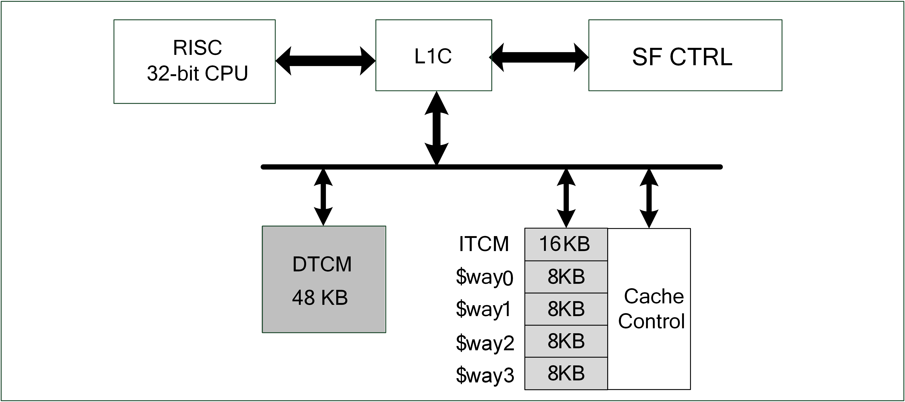

=====
L1C
=====

Introduction
===============
The L1 Cache Controller is a unit module that is located outside the processor and is used to manage code or data buffers on the Flash and increase the speed of the CPU accessing the Flash. The architecture is as follows:

   L1c architecture

L1C is a high-speed unit integrated between the processor and Flash. Because the speed of the processor is very fast, when the processor needs to wait for a long time to access the Flash, the waiting time represents wasteful time. The L1C cache can be used as a lubricating role between the processor and the Flash to improve the efficiency of the processor.

Main features
=================
- 4-way Set-Associative mapping
- Variable cache size
- Connect to TCM address space, can easily configure L1C space as TCM space
- Support cache performance statistics

Function description
========================
Mutual conversion between TCM and Cache RAM resources
-------------------------------------------------------
In order to increase the memory usage efficiency, the 32K RAM of the cache can be fully or partially adjusted to the TCM space, which is convenient for users to adjust the memory usage method and efficiency according to the actual situation.

The default size of the cache is 32K, divided into 4 ways, each way is 8K, the unit of adjustment is 1 way, which is 8K. The default size of ITCM is 16K. Through the setting of WayDisable, you can flexibly adjust the actual space size of Cache and ITCM.

.. table:: WayDisable settings

    +------------+-----------------------+-------+
    | WayDisable |    Cache              | ITCM  |
    +------------+-----------------------+-------+
    |   none     |     32K               | 16K   |
    +------------+-----------------------+-------+
    |   1-way    |     24K               | 24K   |
    +------------+-----------------------+-------+
    |   2-way    |     16K               | 32K   |
    +------------+-----------------------+-------+
    | 3-way      |     8K                | 40K   |
    +------------+-----------------------+-------+
    | 4-way      |     0K                | 48K   |
    +------------+-----------------------+-------+

Cache
-------------
The unit of each line buffer is 32 bytes, and the 4-way associative mapping cache is used. The application architecture is as follows:

.. figure:: ../../picture/L1cWay.png
   :align: center

   Cache architecture

Each set of associative mapping caches contains two parts, the first is a tag, which contains the valid value and the address mapping relationship. The second part is data storage. When the processor accesses the cache, the cache processor compares the relationship between the address and the tag. When the address comparison is successful, the representative can directly get data from the cache. Conversely, the cache processor will capture related data through the AHB Master and put the data into the cache and respond to the processor's data.

When most of the data can be successfully compared in the tag, the waiting time of the processor can be greatly reduced, and the use efficiency can be increased.

Register description
==========================

+----------------+---------------------------+
| Name           | Description               |
+----------------+---------------------------+
| `l1c_config`_  | L1C feature configuration |
+----------------+---------------------------+
| `hit_cnt_lsb`_ | Low 32-bit hit couter     |
+----------------+---------------------------+
| `hit_cnt_msb`_ | High 32-bit hit counter   |
+----------------+---------------------------+
| `miss_cnt`_    | Miss counter              |
+----------------+---------------------------+

l1c_config
------------
 
**Address：**  0x40009000
 

+-----------+-----------+-----------+-----------+-----------+-----------+-----------+-----------+-----------+-----------+-----------+-----------+-----------+-----------+-----------+-----------+ 
| 31        | 30        | 29        | 28        | 27        | 26        | 25        | 24        | 23        | 22        | 21        | 20        | 19        | 18        | 17        | 16        | 
+-----------+-----------+-----------+-----------+-----------+-----------+-----------+-----------+-----------+-----------+-----------+-----------+-----------+-----------+-----------+-----------+ 
| RSVD                                                                                                                                                                                          |
+-----------+-----------+-----------+-----------+-----------+-----------+-----------+-----------+-----------+-----------+-----------+-----------+-----------+-----------+-----------+-----------+ 
| 15        | 14        | 13        | 12        | 11        | 10        | 9         | 8         | 7         | 6         | 5         | 4         | 3         | 2         | 1         | 0         |
+-----------+-----------+-----------+-----------+-----------+-----------+-----------+-----------+-----------+-----------+-----------+-----------+-----------+-----------+-----------+-----------+ 
| RSVD                                          | WAYDIS                                        | RSVD                                                                  | CNTEN     | CACABLE   |
+-----------+-----------+-----------+-----------+-----------+-----------+-----------+-----------+-----------+-----------+-----------+-----------+-----------+-----------+-----------+-----------+ 

+----------+----------+--------+-------------+-------------------------------------------+
| Bit      | Name     |Type    | Reset       | Description                               |
+----------+----------+--------+-------------+-------------------------------------------+
| 31:12    | RSVD     |        |             |                                           |
+----------+----------+--------+-------------+-------------------------------------------+
| 11:8     | WAYDIS   | R/W    | 4'B1111     | Disable part of cache ways & used as ITCM |
+----------+----------+--------+-------------+-------------------------------------------+
| 7:2      | RSVD     |        |             |                                           |
+----------+----------+--------+-------------+-------------------------------------------+
| 1        | CNTEN    | R/W    | 0           | Cache performance counter enable          |
+----------+----------+--------+-------------+-------------------------------------------+
| 0        | CACABLE  | R/W    | 0           | Cachable region enable                    |
+----------+----------+--------+-------------+-------------------------------------------+

hit_cnt_lsb
-------------
 
**Address：**  0x40009004
 

+-----------+-----------+-----------+-----------+-----------+-----------+-----------+-----------+-----------+-----------+-----------+-----------+-----------+-----------+-----------+-----------+ 
| 31        | 30        | 29        | 28        | 27        | 26        | 25        | 24        | 23        | 22        | 21        | 20        | 19        | 18        | 17        | 16        | 
+-----------+-----------+-----------+-----------+-----------+-----------+-----------+-----------+-----------+-----------+-----------+-----------+-----------+-----------+-----------+-----------+ 
| CNTLSB                                                                                                                                                                                        |
+-----------+-----------+-----------+-----------+-----------+-----------+-----------+-----------+-----------+-----------+-----------+-----------+-----------+-----------+-----------+-----------+ 
| 15        | 14        | 13        | 12        | 11        | 10        | 9         | 8         | 7         | 6         | 5         | 4         | 3         | 2         | 1         | 0         |
+-----------+-----------+-----------+-----------+-----------+-----------+-----------+-----------+-----------+-----------+-----------+-----------+-----------+-----------+-----------+-----------+ 
| CNTLSB                                                                                                                                                                                        |
+-----------+-----------+-----------+-----------+-----------+-----------+-----------+-----------+-----------+-----------+-----------+-----------+-----------+-----------+-----------+-----------+ 

+----------+----------+--------+-------------+-------------------------+
| Bit      | Name     |Type    | Reset       | Description             |
+----------+----------+--------+-------------+-------------------------+
| 31:0     | CNTLSB   | R      | 0           | Hit counter low 32-bit  |
+----------+----------+--------+-------------+-------------------------+

hit_cnt_msb
-------------
 
**Address：**  0x40009008
 

+-----------+-----------+-----------+-----------+-----------+-----------+-----------+-----------+-----------+-----------+-----------+-----------+-----------+-----------+-----------+-----------+ 
| 31        | 30        | 29        | 28        | 27        | 26        | 25        | 24        | 23        | 22        | 21        | 20        | 19        | 18        | 17        | 16        | 
+-----------+-----------+-----------+-----------+-----------+-----------+-----------+-----------+-----------+-----------+-----------+-----------+-----------+-----------+-----------+-----------+ 
| CNTMSB                                                                                                                                                                                        |
+-----------+-----------+-----------+-----------+-----------+-----------+-----------+-----------+-----------+-----------+-----------+-----------+-----------+-----------+-----------+-----------+ 
| 15        | 14        | 13        | 12        | 11        | 10        | 9         | 8         | 7         | 6         | 5         | 4         | 3         | 2         | 1         | 0         |
+-----------+-----------+-----------+-----------+-----------+-----------+-----------+-----------+-----------+-----------+-----------+-----------+-----------+-----------+-----------+-----------+ 
| CNTMSB                                                                                                                                                                                        |
+-----------+-----------+-----------+-----------+-----------+-----------+-----------+-----------+-----------+-----------+-----------+-----------+-----------+-----------+-----------+-----------+ 

+----------+----------+--------+-------------+--------------------------------------------------+
| Bit      | Name     |Type    | Reset       | Description                                      |
+----------+----------+--------+-------------+--------------------------------------------------+
| 31:0     | CNTMSB   | R      | 0           | total hit count = hit_cnt_msb*2^32 + hit_cnt_lsb |
+----------+----------+--------+-------------+--------------------------------------------------+

miss_cnt
----------
 
**Address：**  0x4000900c
 

+-----------+-----------+-----------+-----------+-----------+-----------+-----------+-----------+-----------+-----------+-----------+-----------+-----------+-----------+-----------+-----------+ 
| 31        | 30        | 29        | 28        | 27        | 26        | 25        | 24        | 23        | 22        | 21        | 20        | 19        | 18        | 17        | 16        | 
+-----------+-----------+-----------+-----------+-----------+-----------+-----------+-----------+-----------+-----------+-----------+-----------+-----------+-----------+-----------+-----------+ 
| MISSCNT                                                                                                                                                                                       |
+-----------+-----------+-----------+-----------+-----------+-----------+-----------+-----------+-----------+-----------+-----------+-----------+-----------+-----------+-----------+-----------+ 
| 15        | 14        | 13        | 12        | 11        | 10        | 9         | 8         | 7         | 6         | 5         | 4         | 3         | 2         | 1         | 0         |
+-----------+-----------+-----------+-----------+-----------+-----------+-----------+-----------+-----------+-----------+-----------+-----------+-----------+-----------+-----------+-----------+ 
| MISSCNT                                                                                                                                                                                       |
+-----------+-----------+-----------+-----------+-----------+-----------+-----------+-----------+-----------+-----------+-----------+-----------+-----------+-----------+-----------+-----------+ 

+----------+----------+--------+-------------+--------------+
| Bit      | Name     |Type    | Reset       | Description  |
+----------+----------+--------+-------------+--------------+
| 31:0     | MISSCNT  | R      | 0           | Miss counter |
+----------+----------+--------+-------------+--------------+

