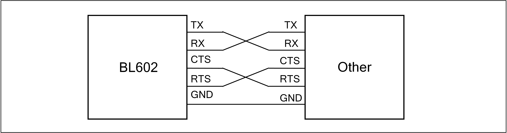

===========
UART
===========

Introduction
===============
Universal Asynchronous Receiver / Transmitter (commonly known as UART) is an asynchronous transceiver that provides a flexible way to exchange full-duplex data with external devices.

BL602/BL604 has two sets of UART ports (UART0 and UART1). By using with DMA, you can achieve efficient data communication.

Main features
====================
- Full-duplex asynchronous communication
- Data bit length can be selected from 5/6/7/8 bits
- Stop bit length can be selected from 0.5/1/1.5/2 bits
- Supports odd/even/no parity bits
- Detects wrong start bit
- Multiple interrupt control
- Support hardware flow control (RTS / CTS)
- Convenient baud rate programming
- Configurable MSB / LSB priority transmission
- Normal / fixed character automatic baud rate detection
- 32-byte transmit / receive FIFO
- Support DMA transfer mode
- Maximum operating frequency is 160MHz

Function description
========================
Data format description
--------------------------
Normal UART communication data is composed of a start bit, a data bit, a parity bit, and a stop bit. The BL602/BL604's UART supports configurable data bits, parity bits, and stop bits, all of which are set in the UTX_CONFIG and URX_CONFIG registers. The waveform of one frame of data is shown below:

.. figure:: ../../picture/UARTData.png
   :align: center

   UART data

The start bit of a data frame occupies 1-bit, and the stop bit can be configured to be 0.5 / 1 / 1.5 / 2 bits wide by configuring <TXBCNTP> and <CR_URX_BIT_CNT_P>. The start bit is low and the stop bit is high.

The data bit width can be configured to 5/6/7/8 bit width by <TXBCNTD> and <RXBCNTD>.

When <TXPREN> and <RXPREN> are set, the data frame adds a parity bit after the data. <TXPRSEL> and <RXPRSEL> are used to select odd or even parity. When the receiver detects a parity error in the input data, a parity error interrupt is generated.

Odd parity calculation method: If the current data bit 1 is an odd number, the odd parity bit is 0; otherwise, it is 1.

Calculation method of even parity: If the number of current data bit 1 is odd, even parity is 1; otherwise it is 0.

Basic architecture diagram
------------------------------

Clock source
-------------
The UART has two clock sources: 160MHz APB_CLK and FCLK. The frequency divider in the clock is used to divide the clock source and then generate a clock signal to drive the UART module. As shown below:

.. figure:: ../../picture/UARTClk.png
   :align: center

   UART clock

Baud rate setting
-------------------
The user can generate the required baud rate by setting the register UART_BIT_PRD. The upper 16 bits and lower 16 bits of this register correspond to RX and TX respectively, that is, the baud rates of RX and TX can be set independently. The 16-bit value needs It is calculated that the formula is as follows:

Baud rate = UART clock / (16-bit coefficient + 1)

That is: 16-bit coefficient = UART clock / baud rate -1

The meaning of the 16-bit coefficient is the count value obtained by counting the current baud rate bit width with the UART clock. Because the maximum 16-bit coefficient is 65535, the minimum baud rate supported by the UART is: UART clock / 65536. The maximum baud rate supported by the UART is 10Mbps.

Before the UART samples the data, it will first filter the data to filter out the glitches in the waveform. Sampling is then performed at the intermediate value of the above 16-bit coefficients, so that different sampling times are adjusted according to different baud rates to keep the median value always being taken, greatly improving flexibility and accuracy. The sampling process is shown in the following figure:

.. figure:: ../../picture/UARTSample.png
   :align: center

   UART sample

Transmitter
-------------
The transmitter contains a 32-byte transmit FIFO to store the data to be transmitted. Software can write the TX FIFO through the APB bus, and can also move data into the TX FIFO through DMA. When the transmit enable bit is set, the data stored in the FIFO will be output from the TX pin. Software can choose to transfer data into TX FIFO through two methods: DMA or APB bus.

Software can check the status of the transmitter by querying the TX FIFO remaining free space count value in bit <TFICNT> of the register UART_FIFO_CONFIG_1. The transmitter's FreeRun mode is as follows:

 - If the FreeRun mode is not turned on, the transmission behavior is terminated and an interrupt is generated when the transmission byte reaches the specified length. If you want to continue the transmission, you need to turn it off and then enable the transmission enable bit.

 - If the FreeRun mode is turned on, the transmitter will transmit when there is data in the TX FIFO, and the transmitted byte will not terminate when it reaches the specified length.

Receiver
-------------
The receiver contains a 32-byte receive FIFO to store the received data. Software can check the status of the receiver by querying the RX FIFO available data count value through the bit <RFICNT> in the register UART_FIFO_CONFIG_1. The lower 8 bits of the URX_RTO_TIMER register are used to set a receive timeout threshold. When the receiver does not receive data beyond this time value, an interrupt will be triggered. Bits <CR_URX_DEG_EN> and <CR_URX_DEG_CNT> of the URX_CONFIG register are used to enable the deburring function and set the threshold value, which controls the filtering part before UART sampling. The UART filters the glitches below the threshold width in the waveform and sends them for sampling.

Automatic baud rate detection
-----------------------------------
The UART module supports automatic baud rate detection. The detection is divided into two types, one is the general mode and the other is the fixed character mode. Each time the bit <ABREN> of the set register URX_CONFIG is turned on, these two detection modes are enabled.

**General mode**

For any character data received, the UART module counts the number of clocks in the bit width. This number is then written to the lower 16 bits of the register STS_URX_ABR_PRD and used to calculate the baud rate. Therefore, when the value of the first received data bit is 1, you can get the correct baud rate, such as '0x01' under LSB-FIRST.

**Fixed character mode**

In this mode, after counting the number of clocks in the starting bit width, the UART module will continue to count the clocks of subsequent data bits and compare them with the start bit. If it fluctuates within the allowable error range, it passes the test, otherwise, the count value is discarded. Therefore, only when the fixed characters '0x55' / '0xD5' are received under LSB-FIRST or '0xAA' / '0xAB' under MSB-FIRST, the UART module will start counting the number of clocks in the bit width. The value is written to the upper 16 bits of the register STS_URX_ABR_PRD. As shown below:

   UART fixed character mode

For an unknown baud rate, the UART uses UART_CLK to count the start bit with a width of 1000 and the second bit with a width of 1001, which does not fluctuate more than 4 UART_CLK from the previous bit width. The UART will continue to count the third bit. The third bit is 1005. If the difference between the UART and the start bit exceeds 4, the test fails and the data is discarded. The UART compares the first 6 bits of the data bit with the start bit in turn.

The formula for calculating the detected baud rate is as follows:

Baud rate = source clock/(16-bit detection value + 1)

Hardware flow control
--------------------------
The UART supports hardware flow control in CTS / RTS mode to prevent data in the FIFO from being lost because it is too late to process. The hardware flow control connection is shown in the following figure:

   UART flow control

When using the hardware flow control function, the output signal RTS is high to request the other party to send data, and RTS is low to notify the other party to stop data transmission until the RTS returns to high. There are two ways for the hardware flow control of the transmitter.

 - The bit <RTSSWM> of the URX_CONFIG register is equal to 0: pull down the RTS level when the amount of data in the RX FIFO is greater than <RFITH>.

 - The bit <RTSSWM> of the URX_CONFIG register is equal to 1: The RTS level can be changed by configuring the bit <RTSSWV> of the URX_CONFIG register.

The TX CTS can be enabled by configuring bit <CTSEN> of UTX_CONFIG. When the device detects that the input signal CTS is pulled low, TX stops sending data until it detects that CTS is pulled high before continuing to transmit.

DMA transfer mode
----------------------
The UART supports DMA transfer mode. To use this mode, you need to set the TX and RX FIFO thresholds through the bits <TFITH> and <RFITH> of the UART_FIFO_CONFIG_1 register. When this mode is enabled, the UART will check the TX / RX FIFO. Above the set threshold, a DMA request will be initiated, and the DMA will move data to the TX FIFO or out of the RX FIFO according to the setting.

UART interrupt
------------------
The UART has multiple interrupt control, including the following interrupt modes:

- TX transmission end interrupt
- RX transmission end interrupt
- TX FIFO request interrupt
- RX FIFO request interrupt
- RX timeout interrupt
- RX parity error interrupt
- TX FIFO overflow interrupt
- RX FIFO overflow interrupt

TX and RX can set a transmission length value through the upper 16 bits of the UTX_CONFIG and URX_CONFIG registers. When the number of bytes transmitted reaches this value, the corresponding TX / RX transmission end interrupt will be triggered. The TX / RX FIFO request interrupt will be triggered when its FIFO available count value is greater than the threshold set in the register UART_FIFO_CONFIG_1. When the condition is not met, the interrupt flag will be automatically cleared. The RX timeout interrupt is triggered when the receiver does not receive data beyond the timeout threshold, and the RX parity error interrupt occurs when a parity error occurs. If the TX / RX FIFO overflows or underflows, the corresponding overflow interrupt will be triggered. When the FIFO clear bit TFICLR / RFICLR is set to 1, the corresponding FIFO will be cleared and the overflow interrupt flag will be automatically cleared.

Query the interrupt status through the register UART_INT_STS, and clear the interrupt by writing 1 to the corresponding bit in the register UART_INT_CLEAR.

Register description
==========================

+-----------------------+--------------------------------------+
| Name                  | Description                          |
+-----------------------+--------------------------------------+
| `utx_config`_         | UART TX configuration register       |
+-----------------------+--------------------------------------+
| `urx_config`_         | UART RX configuration register       |
+-----------------------+--------------------------------------+
| `uart_bit_prd`_       | UART period control register         |
+-----------------------+--------------------------------------+
| `data_config`_        | UART data configuration register     |
+-----------------------+--------------------------------------+
| `utx_ir_position`_    | UART TX ir position control register |
+-----------------------+--------------------------------------+
| `urx_ir_position`_    | UART RX ir position control register |
+-----------------------+--------------------------------------+
| `urx_rto_timer`_      | RTO interrupt control register       |
+-----------------------+--------------------------------------+
| `uart_int_sts`_       | UART interrupt status                |
+-----------------------+--------------------------------------+
| `uart_int_mask`_      | UART interrupt mask                  |
+-----------------------+--------------------------------------+
| `uart_int_clear`_     | UART interrupt clear                 |
+-----------------------+--------------------------------------+
| `uart_int_en`_        | UART interrupt enable                |
+-----------------------+--------------------------------------+
| `uart_status`_        | UART status control register         |
+-----------------------+--------------------------------------+
| `sts_urx_abr_prd`_    | Auto baud detection control register |
+-----------------------+--------------------------------------+
| `uart_fifo_config_0`_ | UART FIFO configuration register0    |
+-----------------------+--------------------------------------+
| `uart_fifo_config_1`_ | UART FIFO configuration register1    |
+-----------------------+--------------------------------------+
| `uart_fifo_wdata`_    | UART FIFO write data                 |
+-----------------------+--------------------------------------+
| `uart_fifo_rdata`_    | UART FIFO read data                  |
+-----------------------+--------------------------------------+

utx_config
------------
 
**Address：**  0x4000a000
 

+-----------+-----------+-----------+-----------+-----------+-----------+-----------+-----------+-----------+-----------+-----------+-----------+-----------+-----------+-----------+-----------+ 
| 31        | 30        | 29        | 28        | 27        | 26        | 25        | 24        | 23        | 22        | 21        | 20        | 19        | 18        | 17        | 16        | 
+-----------+-----------+-----------+-----------+-----------+-----------+-----------+-----------+-----------+-----------+-----------+-----------+-----------+-----------+-----------+-----------+ 
| TXLEN                                                                                                                                                                                         |
+-----------+-----------+-----------+-----------+-----------+-----------+-----------+-----------+-----------+-----------+-----------+-----------+-----------+-----------+-----------+-----------+ 
| 15        | 14        | 13        | 12        | 11        | 10        | 9         | 8         | 7         | 6         | 5         | 4         | 3         | 2         | 1         | 0         |
+-----------+-----------+-----------+-----------+-----------+-----------+-----------+-----------+-----------+-----------+-----------+-----------+-----------+-----------+-----------+-----------+ 
| RSVD                  | TXBCNTP               | RSVD      | TXBCNTD                           | IRTXINV   | IRTXEN    | TXPRSEL   | TXPREN    | RSVD      | FRMEN     | CTSEN     | EN        |
+-----------+-----------+-----------+-----------+-----------+-----------+-----------+-----------+-----------+-----------+-----------+-----------+-----------+-----------+-----------+-----------+ 

+----------+----------+--------+-------------+---------------------------------------------------------------------------------------------------------------------------+
| Bit      | Name     |Type    | Reset       | Description                                                                                                               |
+----------+----------+--------+-------------+---------------------------------------------------------------------------------------------------------------------------+
| 31:16    | TXLEN    | R/W    | 16'D0       | Length of UART TX data transfer (Unit: character/byte) (Don't-care if cr_utx_frm_en is enabled)                           |
+----------+----------+--------+-------------+---------------------------------------------------------------------------------------------------------------------------+
| 15:14    | RSVD     |        |             |                                                                                                                           |
+----------+----------+--------+-------------+---------------------------------------------------------------------------------------------------------------------------+
| 13:12    | TXBCNTP  | R/W    | 2'D1        | UART TX STOP bit count (unit: 0.5 bit)                                                                                    |
+----------+----------+--------+-------------+---------------------------------------------------------------------------------------------------------------------------+
| 11       | RSVD     |        |             |                                                                                                                           |
+----------+----------+--------+-------------+---------------------------------------------------------------------------------------------------------------------------+
| 10:8     | TXBCNTD  | R/W    | 3'D7        | UART TX DATA bit count for each character                                                                                 |
+----------+----------+--------+-------------+---------------------------------------------------------------------------------------------------------------------------+
| 7        | IRTXINV  | R/W    | 1'B0        | Inverse signal of UART TX output in IR mode                                                                               |
+----------+----------+--------+-------------+---------------------------------------------------------------------------------------------------------------------------+
| 6        | IRTXEN   | R/W    | 1'B0        | Enable signal of UART TX IR mode                                                                                          |
+----------+----------+--------+-------------+---------------------------------------------------------------------------------------------------------------------------+
| 5        | TXPRSEL  | R/W    | 1'B0        | Select signal of UART TX parity bit                                                                                       |
+          +          +        +             +                                                                                                                           +
|          |          |        |             | 1: Odd parity                                                                                                             |
+          +          +        +             +                                                                                                                           +
|          |          |        |             | 0: Even parity                                                                                                            |
+----------+----------+--------+-------------+---------------------------------------------------------------------------------------------------------------------------+
| 4        | TXPREN   | R/W    | 1'B0        | Enable signal of UART TX parity bit                                                                                       |
+----------+----------+--------+-------------+---------------------------------------------------------------------------------------------------------------------------+
| 3        | RSVD     |        |             |                                                                                                                           |
+----------+----------+--------+-------------+---------------------------------------------------------------------------------------------------------------------------+
| 2        | FRMEN    | R/W    | 1'B0        | Enable signal of UART TX freerun mode (utx_end_int will be disabled)                                                      |
+----------+----------+--------+-------------+---------------------------------------------------------------------------------------------------------------------------+
| 1        | CTSEN    | R/W    | 1'B0        | Enable signal of UART TX CTS flow control function                                                                        |
+----------+----------+--------+-------------+---------------------------------------------------------------------------------------------------------------------------+
| 0        | EN       | R/W    | 1'B0        | Enable signal of UART TX function                                                                                         |
+          +          +        +             +                                                                                                                           +
|          |          |        |             | Asserting this bit will trigger the transaction, and should be de-asserted after finish                                   |
+----------+----------+--------+-------------+---------------------------------------------------------------------------------------------------------------------------+

urx_config
------------
 
**Address：**  0x4000a004
 

+-----------+-----------+-----------+-----------+-----------+-----------+-----------+-----------+-----------+-----------+-----------+-----------+-----------+-----------+-----------+-----------+ 
| 31        | 30        | 29        | 28        | 27        | 26        | 25        | 24        | 23        | 22        | 21        | 20        | 19        | 18        | 17        | 16        | 
+-----------+-----------+-----------+-----------+-----------+-----------+-----------+-----------+-----------+-----------+-----------+-----------+-----------+-----------+-----------+-----------+ 
| RXLEN                                                                                                                                                                                         |
+-----------+-----------+-----------+-----------+-----------+-----------+-----------+-----------+-----------+-----------+-----------+-----------+-----------+-----------+-----------+-----------+ 
| 15        | 14        | 13        | 12        | 11        | 10        | 9         | 8         | 7         | 6         | 5         | 4         | 3         | 2         | 1         | 0         |
+-----------+-----------+-----------+-----------+-----------+-----------+-----------+-----------+-----------+-----------+-----------+-----------+-----------+-----------+-----------+-----------+ 
| DEGCNT                                        | DEGEN     | RXBCNTD                           | IRRXINV   | IRRXEN    | RXPRSEL   | RXPREN    | ABREN     | RTSSWV    | RTSSWM    | EN        |
+-----------+-----------+-----------+-----------+-----------+-----------+-----------+-----------+-----------+-----------+-----------+-----------+-----------+-----------+-----------+-----------+ 

+----------+----------+--------+-------------+------------------------------------------------------------------------------------------------------------+
| Bit      | Name     |Type    | Reset       | Description                                                                                                |
+----------+----------+--------+-------------+------------------------------------------------------------------------------------------------------------+
| 31:16    | RXLEN    | R/W    | 16'D0       | Length of UART RX data transfer (Unit: character/byte)                                                     |
+          +          +        +             +                                                                                                            +
|          |          |        |             | urx_end_int will assert when this length is reached                                                        |
+----------+----------+--------+-------------+------------------------------------------------------------------------------------------------------------+
| 15:12    | DEGCNT   | R/W    | 4'D0        | De-glitch function cycle count                                                                             |
+----------+----------+--------+-------------+------------------------------------------------------------------------------------------------------------+
| 11       | DEGEN    | R/W    | 1'B0        | Enable signal of RXD input de-glitch function                                                              |
+----------+----------+--------+-------------+------------------------------------------------------------------------------------------------------------+
| 10:8     | RXBCNTD  | R/W    | 3'D7        | UART RX DATA bit count for each character                                                                  |
+----------+----------+--------+-------------+------------------------------------------------------------------------------------------------------------+
| 7        | IRRXINV  | R/W    | 1'B0        | Inverse signal of UART RX input in IR mode                                                                 |
+----------+----------+--------+-------------+------------------------------------------------------------------------------------------------------------+
| 6        | IRRXEN   | R/W    | 1'B0        | Enable signal of UART RX IR mode                                                                           |
+----------+----------+--------+-------------+------------------------------------------------------------------------------------------------------------+
| 5        | RXPRSEL  | R/W    | 1'B0        | Select signal of UART RX parity bit                                                                        |
+          +          +        +             +                                                                                                            +
|          |          |        |             | 1: Odd parity                                                                                              |
+          +          +        +             +                                                                                                            +
|          |          |        |             | 0: Even parity                                                                                             |
+----------+----------+--------+-------------+------------------------------------------------------------------------------------------------------------+
| 4        | RXPREN   | R/W    | 1'B0        | Enable signal of UART RX parity bit                                                                        |
+----------+----------+--------+-------------+------------------------------------------------------------------------------------------------------------+
| 3        | ABREN    | R/W    | 1'B0        | Enable signal of UART RX Auto Baud Rate detection function                                                 |
+----------+----------+--------+-------------+------------------------------------------------------------------------------------------------------------+
| 2        | RTSSWV   | R/W    | 1'B0        | UART RX RTS output SW control value                                                                        |
+----------+----------+--------+-------------+------------------------------------------------------------------------------------------------------------+
| 1        | RTSSWM   | R/W    | 1'B0        | UART RX RTS output SW control mode                                                                         |
+----------+----------+--------+-------------+------------------------------------------------------------------------------------------------------------+
| 0        | EN       | R/W    | 1'B0        | Enable signal of UART RX function                                                                          |
+----------+----------+--------+-------------+------------------------------------------------------------------------------------------------------------+

uart_bit_prd
--------------
 
**Address：**  0x4000a008
 

+-----------+-----------+-----------+-----------+-----------+-----------+-----------+-----------+-----------+-----------+-----------+-----------+-----------+-----------+-----------+-----------+ 
| 31        | 30        | 29        | 28        | 27        | 26        | 25        | 24        | 23        | 22        | 21        | 20        | 19        | 18        | 17        | 16        | 
+-----------+-----------+-----------+-----------+-----------+-----------+-----------+-----------+-----------+-----------+-----------+-----------+-----------+-----------+-----------+-----------+ 
| RBITPRD                                                                                                                                                                                       |
+-----------+-----------+-----------+-----------+-----------+-----------+-----------+-----------+-----------+-----------+-----------+-----------+-----------+-----------+-----------+-----------+ 
| 15        | 14        | 13        | 12        | 11        | 10        | 9         | 8         | 7         | 6         | 5         | 4         | 3         | 2         | 1         | 0         |
+-----------+-----------+-----------+-----------+-----------+-----------+-----------+-----------+-----------+-----------+-----------+-----------+-----------+-----------+-----------+-----------+ 
| TBITPRD                                                                                                                                                                                       |
+-----------+-----------+-----------+-----------+-----------+-----------+-----------+-----------+-----------+-----------+-----------+-----------+-----------+-----------+-----------+-----------+ 

+----------+----------+--------+-------------+--------------------------------------------------+
| Bit      | Name     |Type    | Reset       | Description                                      |
+----------+----------+--------+-------------+--------------------------------------------------+
| 31:16    | RBITPRD  | R/W    | 16'D255     | Period of each UART RX bit, related to baud rate |
+----------+----------+--------+-------------+--------------------------------------------------+
| 15:0     | TBITPRD  | R/W    | 16'D255     | Period of each UART TX bit, related to baud rate |
+----------+----------+--------+-------------+--------------------------------------------------+

data_config
-------------
 
**Address：**  0x4000a00c
 

+-----------+-----------+-----------+-----------+-----------+-----------+-----------+-----------+-----------+-----------+-----------+-----------+-----------+-----------+-----------+-----------+ 
| 31        | 30        | 29        | 28        | 27        | 26        | 25        | 24        | 23        | 22        | 21        | 20        | 19        | 18        | 17        | 16        | 
+-----------+-----------+-----------+-----------+-----------+-----------+-----------+-----------+-----------+-----------+-----------+-----------+-----------+-----------+-----------+-----------+ 
| RSVD                                                                                                                                                                                          |
+-----------+-----------+-----------+-----------+-----------+-----------+-----------+-----------+-----------+-----------+-----------+-----------+-----------+-----------+-----------+-----------+ 
| 15        | 14        | 13        | 12        | 11        | 10        | 9         | 8         | 7         | 6         | 5         | 4         | 3         | 2         | 1         | 0         |
+-----------+-----------+-----------+-----------+-----------+-----------+-----------+-----------+-----------+-----------+-----------+-----------+-----------+-----------+-----------+-----------+ 
| RSVD                                                                                                                                                                              | BITINV    |
+-----------+-----------+-----------+-----------+-----------+-----------+-----------+-----------+-----------+-----------+-----------+-----------+-----------+-----------+-----------+-----------+ 

+----------+----------+--------+-------------+-------------------------------------------------------------------------------------------------------------+
| Bit      | Name     |Type    | Reset       | Description                                                                                                 |
+----------+----------+--------+-------------+-------------------------------------------------------------------------------------------------------------+
| 31:1     | RSVD     |        |             |                                                                                                             |
+----------+----------+--------+-------------+-------------------------------------------------------------------------------------------------------------+
| 0        | BITINV   | R/W    | 1'B0        | Bit-inverse signal for each data byte                                                                       |
+          +          +        +             +                                                                                                             +
|          |          |        |             | 0: Each byte is sent out LSB-first                                                                          |
+          +          +        +             +                                                                                                             +
|          |          |        |             | 1: Each byte is sent out MSB-first                                                                          |
+----------+----------+--------+-------------+-------------------------------------------------------------------------------------------------------------+

utx_ir_position
-----------------
 
**Address：**  0x4000a010
 

+-----------+-----------+-----------+-----------+-----------+-----------+-----------+-----------+-----------+-----------+-----------+-----------+-----------+-----------+-----------+-----------+ 
| 31        | 30        | 29        | 28        | 27        | 26        | 25        | 24        | 23        | 22        | 21        | 20        | 19        | 18        | 17        | 16        | 
+-----------+-----------+-----------+-----------+-----------+-----------+-----------+-----------+-----------+-----------+-----------+-----------+-----------+-----------+-----------+-----------+ 
| TXIRPP                                                                                                                                                                                        |
+-----------+-----------+-----------+-----------+-----------+-----------+-----------+-----------+-----------+-----------+-----------+-----------+-----------+-----------+-----------+-----------+ 
| 15        | 14        | 13        | 12        | 11        | 10        | 9         | 8         | 7         | 6         | 5         | 4         | 3         | 2         | 1         | 0         |
+-----------+-----------+-----------+-----------+-----------+-----------+-----------+-----------+-----------+-----------+-----------+-----------+-----------+-----------+-----------+-----------+ 
| TXIRPS                                                                                                                                                                                        |
+-----------+-----------+-----------+-----------+-----------+-----------+-----------+-----------+-----------+-----------+-----------+-----------+-----------+-----------+-----------+-----------+ 

+----------+----------+--------+-------------+------------------------------------+
| Bit      | Name     |Type    | Reset       | Description                        |
+----------+----------+--------+-------------+------------------------------------+
| 31:16    | TXIRPP   | R/W    | 16'D159     | STOP position of UART TX IR pulse  |
+----------+----------+--------+-------------+------------------------------------+
| 15:0     | TXIRPS   | R/W    | 16'D112     | START position of UART TX IR pulse |
+----------+----------+--------+-------------+------------------------------------+

urx_ir_position
-----------------
 
**Address：**  0x4000a014
 

+-----------+-----------+-----------+-----------+-----------+-----------+-----------+-----------+-----------+-----------+-----------+-----------+-----------+-----------+-----------+-----------+ 
| 31        | 30        | 29        | 28        | 27        | 26        | 25        | 24        | 23        | 22        | 21        | 20        | 19        | 18        | 17        | 16        | 
+-----------+-----------+-----------+-----------+-----------+-----------+-----------+-----------+-----------+-----------+-----------+-----------+-----------+-----------+-----------+-----------+ 
| RSVD                                                                                                                                                                                          |
+-----------+-----------+-----------+-----------+-----------+-----------+-----------+-----------+-----------+-----------+-----------+-----------+-----------+-----------+-----------+-----------+ 
| 15        | 14        | 13        | 12        | 11        | 10        | 9         | 8         | 7         | 6         | 5         | 4         | 3         | 2         | 1         | 0         |
+-----------+-----------+-----------+-----------+-----------+-----------+-----------+-----------+-----------+-----------+-----------+-----------+-----------+-----------+-----------+-----------+ 
| RXIRPS                                                                                                                                                                                        |
+-----------+-----------+-----------+-----------+-----------+-----------+-----------+-----------+-----------+-----------+-----------+-----------+-----------+-----------+-----------+-----------+ 

+----------+----------+--------+-------------+-----------------------------------------------------------+
| Bit      | Name     |Type    | Reset       | Description                                               |
+----------+----------+--------+-------------+-----------------------------------------------------------+
| 31:16    | RSVD     |        |             |                                                           |
+----------+----------+--------+-------------+-----------------------------------------------------------+
| 15:0     | RXIRPS   | R/W    | 16'D111     | START position of UART RXD pulse recovered from IR signal |
+----------+----------+--------+-------------+-----------------------------------------------------------+

urx_rto_timer
---------------
 
**Address：**  0x4000a018
 

+-----------+-----------+-----------+-----------+-----------+-----------+-----------+-----------+-----------+-----------+-----------+-----------+-----------+-----------+-----------+-----------+ 
| 31        | 30        | 29        | 28        | 27        | 26        | 25        | 24        | 23        | 22        | 21        | 20        | 19        | 18        | 17        | 16        | 
+-----------+-----------+-----------+-----------+-----------+-----------+-----------+-----------+-----------+-----------+-----------+-----------+-----------+-----------+-----------+-----------+ 
| RSVD                                                                                                                                                                                          |
+-----------+-----------+-----------+-----------+-----------+-----------+-----------+-----------+-----------+-----------+-----------+-----------+-----------+-----------+-----------+-----------+ 
| 15        | 14        | 13        | 12        | 11        | 10        | 9         | 8         | 7         | 6         | 5         | 4         | 3         | 2         | 1         | 0         |
+-----------+-----------+-----------+-----------+-----------+-----------+-----------+-----------+-----------+-----------+-----------+-----------+-----------+-----------+-----------+-----------+ 
| RSVD                                                                                          | RXRTOVA                                                                                       |
+-----------+-----------+-----------+-----------+-----------+-----------+-----------+-----------+-----------+-----------+-----------+-----------+-----------+-----------+-----------+-----------+ 

+----------+----------+--------+-------------+--------------------------------------------------------------+
| Bit      | Name     |Type    | Reset       | Description                                                  |
+----------+----------+--------+-------------+--------------------------------------------------------------+
| 31:8     | RSVD     |        |             |                                                              |
+----------+----------+--------+-------------+--------------------------------------------------------------+
| 7:0      | RXRTOVA  | R/W    | 8'D15       | Time-out value for triggering RTO interrupt (unit: bit time) |
+----------+----------+--------+-------------+--------------------------------------------------------------+

uart_int_sts
--------------
 
**Address：**  0x4000a020
 

+-----------+-----------+-----------+-----------+-----------+-----------+-----------+-----------+-----------+-----------+-----------+-----------+-----------+-----------+-----------+-----------+ 
| 31        | 30        | 29        | 28        | 27        | 26        | 25        | 24        | 23        | 22        | 21        | 20        | 19        | 18        | 17        | 16        | 
+-----------+-----------+-----------+-----------+-----------+-----------+-----------+-----------+-----------+-----------+-----------+-----------+-----------+-----------+-----------+-----------+ 
| RSVD                                                                                                                                                                                          |
+-----------+-----------+-----------+-----------+-----------+-----------+-----------+-----------+-----------+-----------+-----------+-----------+-----------+-----------+-----------+-----------+ 
| 15        | 14        | 13        | 12        | 11        | 10        | 9         | 8         | 7         | 6         | 5         | 4         | 3         | 2         | 1         | 0         |
+-----------+-----------+-----------+-----------+-----------+-----------+-----------+-----------+-----------+-----------+-----------+-----------+-----------+-----------+-----------+-----------+ 
| RSVD                                                                                          | RFERINT   | TFIN      | RPCEINT   | RRTOINT   | RFIN      | TFIN      | REIN      | TEIN      |
+-----------+-----------+-----------+-----------+-----------+-----------+-----------+-----------+-----------+-----------+-----------+-----------+-----------+-----------+-----------+-----------+ 

+----------+----------+--------+-------------+-----------------------------------------------------------------------------------------------+
| Bit      | Name     |Type    | Reset       | Description                                                                                   |
+----------+----------+--------+-------------+-----------------------------------------------------------------------------------------------+
| 31:8     | RSVD     |        |             |                                                                                               |
+----------+----------+--------+-------------+-----------------------------------------------------------------------------------------------+
| 7        | RFERINT  | R      | 1'B0        | UART RX FIFO error interrupt, auto-cleared when FIFO overflow/underflow error flag is cleared |
+----------+----------+--------+-------------+-----------------------------------------------------------------------------------------------+
| 6        | TFIN     | R      | 1'B0        | UART TX FIFO error interrupt, auto-cleared when FIFO overflow/underflow error flag is cleared |
+----------+----------+--------+-------------+-----------------------------------------------------------------------------------------------+
| 5        | RPCEINT  | R      | 1'B0        | UART RX parity check error interrupt                                                          |
+----------+----------+--------+-------------+-----------------------------------------------------------------------------------------------+
| 4        | RRTOINT  | R      | 1'B0        | UART RX Time-out interrupt                                                                    |
+----------+----------+--------+-------------+-----------------------------------------------------------------------------------------------+
| 3        | RFIN     | R      | 1'B0        | UART RX FIFO ready (rx_fifo_cnt > rx_fifo_th) interrupt, auto-cleared when data is popped     |
+----------+----------+--------+-------------+-----------------------------------------------------------------------------------------------+
| 2        | TFIN     | R      | 1'B0        | UART TX FIFO ready (tx_fifo_cnt > tx_fifo_th) interrupt, auto-cleared when data is pushed     |
+----------+----------+--------+-------------+-----------------------------------------------------------------------------------------------+
| 1        | REIN     | R      | 1'B0        | UART RX transfer end interrupt (set according to cr_urx_len)                                  |
+----------+----------+--------+-------------+-----------------------------------------------------------------------------------------------+
| 0        | TEIN     | R      | 1'B0        | UART TX transfer end interrupt (set according to cr_utx_len)                                  |
+----------+----------+--------+-------------+-----------------------------------------------------------------------------------------------+

uart_int_mask
---------------
 
**Address：**  0x4000a024
 

+-----------+-----------+-----------+-----------+-----------+-----------+-----------+-----------+-----------+-----------+-----------+-----------+-----------+-----------+-----------+-----------+ 
| 31        | 30        | 29        | 28        | 27        | 26        | 25        | 24        | 23        | 22        | 21        | 20        | 19        | 18        | 17        | 16        | 
+-----------+-----------+-----------+-----------+-----------+-----------+-----------+-----------+-----------+-----------+-----------+-----------+-----------+-----------+-----------+-----------+ 
| RSVD                                                                                                                                                                                          |
+-----------+-----------+-----------+-----------+-----------+-----------+-----------+-----------+-----------+-----------+-----------+-----------+-----------+-----------+-----------+-----------+ 
| 15        | 14        | 13        | 12        | 11        | 10        | 9         | 8         | 7         | 6         | 5         | 4         | 3         | 2         | 1         | 0         |
+-----------+-----------+-----------+-----------+-----------+-----------+-----------+-----------+-----------+-----------+-----------+-----------+-----------+-----------+-----------+-----------+ 
| RSVD                                                                                          | RFERMASK  | TFERMASK  | RPCEMASK  | RRTOMASK  | RFMS      | TFMS      | REMS      | TEMS      |
+-----------+-----------+-----------+-----------+-----------+-----------+-----------+-----------+-----------+-----------+-----------+-----------+-----------+-----------+-----------+-----------+ 

+----------+----------+--------+-------------+--------------------------------+
| Bit      | Name     |Type    | Reset       | Description                    |
+----------+----------+--------+-------------+--------------------------------+
| 31:8     | RSVD     |        |             |                                |
+----------+----------+--------+-------------+--------------------------------+
| 7        | RFERMASK | R/W    | 1'B1        | Interrupt mask of urx_fer_int  |
+----------+----------+--------+-------------+--------------------------------+
| 6        | TFERMASK | R/W    | 1'B1        | Interrupt mask of utx_fer_int  |
+----------+----------+--------+-------------+--------------------------------+
| 5        | RPCEMASK | R/W    | 1'B1        | Interrupt mask of urx_pce_int  |
+----------+----------+--------+-------------+--------------------------------+
| 4        | RRTOMASK | R/W    | 1'B1        | Interrupt mask of urx_rto_int  |
+----------+----------+--------+-------------+--------------------------------+
| 3        | RFMS     | R/W    | 1'B1        | Interrupt mask of urx_fifo_int |
+----------+----------+--------+-------------+--------------------------------+
| 2        | TFMS     | R/W    | 1'B1        | Interrupt mask of utx_fifo_int |
+----------+----------+--------+-------------+--------------------------------+
| 1        | REMS     | R/W    | 1'B1        | Interrupt mask of urx_end_int  |
+----------+----------+--------+-------------+--------------------------------+
| 0        | TEMS     | R/W    | 1'B1        | Interrupt mask of utx_end_int  |
+----------+----------+--------+-------------+--------------------------------+

uart_int_clear
----------------
 
**Address：**  0x4000a028
 

+-----------+-----------+-----------+-----------+-----------+-----------+-----------+-----------+-----------+-----------+-----------+-----------+-----------+-----------+-----------+-----------+ 
| 31        | 30        | 29        | 28        | 27        | 26        | 25        | 24        | 23        | 22        | 21        | 20        | 19        | 18        | 17        | 16        | 
+-----------+-----------+-----------+-----------+-----------+-----------+-----------+-----------+-----------+-----------+-----------+-----------+-----------+-----------+-----------+-----------+ 
| RSVD                                                                                                                                                                                          |
+-----------+-----------+-----------+-----------+-----------+-----------+-----------+-----------+-----------+-----------+-----------+-----------+-----------+-----------+-----------+-----------+ 
| 15        | 14        | 13        | 12        | 11        | 10        | 9         | 8         | 7         | 6         | 5         | 4         | 3         | 2         | 1         | 0         |
+-----------+-----------+-----------+-----------+-----------+-----------+-----------+-----------+-----------+-----------+-----------+-----------+-----------+-----------+-----------+-----------+ 
| RSVD                                                                                                                  | RPCECLR   | RRTOCLR   | RSVD                  | RECL      | TECL      |
+-----------+-----------+-----------+-----------+-----------+-----------+-----------+-----------+-----------+-----------+-----------+-----------+-----------+-----------+-----------+-----------+ 

+----------+----------+--------+-------------+--------------------------------+
| Bit      | Name     |Type    | Reset       | Description                    |
+----------+----------+--------+-------------+--------------------------------+
| 31:6     | RSVD     |        |             |                                |
+----------+----------+--------+-------------+--------------------------------+
| 5        | RPCECLR  | W1C    | 1'B0        | Interrupt clear of urx_pce_int |
+----------+----------+--------+-------------+--------------------------------+
| 4        | RRTOCLR  | W1C    | 1'B0        | Interrupt clear of urx_rto_int |
+----------+----------+--------+-------------+--------------------------------+
| 3:2      | RSVD     |        |             |                                |
+----------+----------+--------+-------------+--------------------------------+
| 1        | RECL     | W1C    | 1'B0        | Interrupt clear of urx_end_int |
+----------+----------+--------+-------------+--------------------------------+
| 0        | TECL     | W1C    | 1'B0        | Interrupt clear of utx_end_int |
+----------+----------+--------+-------------+--------------------------------+

uart_int_en
-------------
 
**Address：**  0x4000a02c
 

+-----------+-----------+-----------+-----------+-----------+-----------+-----------+-----------+-----------+-----------+-----------+-----------+-----------+-----------+-----------+-----------+ 
| 31        | 30        | 29        | 28        | 27        | 26        | 25        | 24        | 23        | 22        | 21        | 20        | 19        | 18        | 17        | 16        | 
+-----------+-----------+-----------+-----------+-----------+-----------+-----------+-----------+-----------+-----------+-----------+-----------+-----------+-----------+-----------+-----------+ 
| RSVD                                                                                                                                                                                          |
+-----------+-----------+-----------+-----------+-----------+-----------+-----------+-----------+-----------+-----------+-----------+-----------+-----------+-----------+-----------+-----------+ 
| 15        | 14        | 13        | 12        | 11        | 10        | 9         | 8         | 7         | 6         | 5         | 4         | 3         | 2         | 1         | 0         |
+-----------+-----------+-----------+-----------+-----------+-----------+-----------+-----------+-----------+-----------+-----------+-----------+-----------+-----------+-----------+-----------+ 
| RSVD                                                                                          | RFER      | TFER      | RPCE      | RRTO      | RFIF      | TFIF      | REND      | TEND      |
+-----------+-----------+-----------+-----------+-----------+-----------+-----------+-----------+-----------+-----------+-----------+-----------+-----------+-----------+-----------+-----------+ 

+----------+----------+--------+-------------+----------------------------------+
| Bit      | Name     |Type    | Reset       | Description                      |
+----------+----------+--------+-------------+----------------------------------+
| 31:8     | RSVD     |        |             |                                  |
+----------+----------+--------+-------------+----------------------------------+
| 7        | RFER     | R/W    | 1'B1        | Interrupt enable of urx_fer_int  |
+----------+----------+--------+-------------+----------------------------------+
| 6        | TFER     | R/W    | 1'B1        | Interrupt enable of utx_fer_int  |
+----------+----------+--------+-------------+----------------------------------+
| 5        | RPCE     | R/W    | 1'B1        | Interrupt enable of urx_pce_int  |
+----------+----------+--------+-------------+----------------------------------+
| 4        | RRTO     | R/W    | 1'B1        | Interrupt enable of urx_rto_int  |
+----------+----------+--------+-------------+----------------------------------+
| 3        | RFIF     | R/W    | 1'B1        | Interrupt enable of urx_fifo_int |
+----------+----------+--------+-------------+----------------------------------+
| 2        | TFIF     | R/W    | 1'B1        | Interrupt enable of utx_fifo_int |
+----------+----------+--------+-------------+----------------------------------+
| 1        | REND     | R/W    | 1'B1        | Interrupt enable of urx_end_int  |
+----------+----------+--------+-------------+----------------------------------+
| 0        | TEND     | R/W    | 1'B1        | Interrupt enable of utx_end_int  |
+----------+----------+--------+-------------+----------------------------------+

uart_status
-------------
 
**Address：**  0x4000a030
 

+-----------+-----------+-----------+-----------+-----------+-----------+-----------+-----------+-----------+-----------+-----------+-----------+-----------+-----------+-----------+-----------+ 
| 31        | 30        | 29        | 28        | 27        | 26        | 25        | 24        | 23        | 22        | 21        | 20        | 19        | 18        | 17        | 16        | 
+-----------+-----------+-----------+-----------+-----------+-----------+-----------+-----------+-----------+-----------+-----------+-----------+-----------+-----------+-----------+-----------+ 
| RSVD                                                                                                                                                                                          |
+-----------+-----------+-----------+-----------+-----------+-----------+-----------+-----------+-----------+-----------+-----------+-----------+-----------+-----------+-----------+-----------+ 
| 15        | 14        | 13        | 12        | 11        | 10        | 9         | 8         | 7         | 6         | 5         | 4         | 3         | 2         | 1         | 0         |
+-----------+-----------+-----------+-----------+-----------+-----------+-----------+-----------+-----------+-----------+-----------+-----------+-----------+-----------+-----------+-----------+ 
| RSVD                                                                                                                                                                  | RBB       | TBB       |
+-----------+-----------+-----------+-----------+-----------+-----------+-----------+-----------+-----------+-----------+-----------+-----------+-----------+-----------+-----------+-----------+ 

+----------+----------+--------+-------------+-------------------------------+
| Bit      | Name     |Type    | Reset       | Description                   |
+----------+----------+--------+-------------+-------------------------------+
| 31:2     | RSVD     |        |             |                               |
+----------+----------+--------+-------------+-------------------------------+
| 1        | RBB      | R      | 1'B0        | Indicator of UART RX bus busy |
+----------+----------+--------+-------------+-------------------------------+
| 0        | TBB      | R      | 1'B0        | Indicator of UART TX bus busy |
+----------+----------+--------+-------------+-------------------------------+

sts_urx_abr_prd
-----------------
 
**Address：**  0x4000a034
 

+-----------+-----------+-----------+-----------+-----------+-----------+-----------+-----------+-----------+-----------+-----------+-----------+-----------+-----------+-----------+-----------+ 
| 31        | 30        | 29        | 28        | 27        | 26        | 25        | 24        | 23        | 22        | 21        | 20        | 19        | 18        | 17        | 16        | 
+-----------+-----------+-----------+-----------+-----------+-----------+-----------+-----------+-----------+-----------+-----------+-----------+-----------+-----------+-----------+-----------+ 
| ABRPRD                                                                                                                                                                                        |
+-----------+-----------+-----------+-----------+-----------+-----------+-----------+-----------+-----------+-----------+-----------+-----------+-----------+-----------+-----------+-----------+ 
| 15        | 14        | 13        | 12        | 11        | 10        | 9         | 8         | 7         | 6         | 5         | 4         | 3         | 2         | 1         | 0         |
+-----------+-----------+-----------+-----------+-----------+-----------+-----------+-----------+-----------+-----------+-----------+-----------+-----------+-----------+-----------+-----------+ 
| ABRPRDS                                                                                                                                                                                       |
+-----------+-----------+-----------+-----------+-----------+-----------+-----------+-----------+-----------+-----------+-----------+-----------+-----------+-----------+-----------+-----------+ 

+----------+----------+--------+-------------+------------------------------------------------------------+
| Bit      | Name     |Type    | Reset       | Description                                                |
+----------+----------+--------+-------------+------------------------------------------------------------+
| 31:16    | ABRPRD   | R      | 16'D0       | Bit period of Auto Baud Rate detection using codeword 0x55 |
+----------+----------+--------+-------------+------------------------------------------------------------+
| 15:0     | ABRPRDS  | R      | 16'D0       | Bit period of Auto Baud Rate detection using START bit     |
+----------+----------+--------+-------------+------------------------------------------------------------+

uart_fifo_config_0
--------------------
 
**Address：**  0x4000a080
 

+-----------+-----------+-----------+-----------+-----------+-----------+-----------+-----------+-----------+-----------+-----------+-----------+-----------+-----------+-----------+-----------+ 
| 31        | 30        | 29        | 28        | 27        | 26        | 25        | 24        | 23        | 22        | 21        | 20        | 19        | 18        | 17        | 16        | 
+-----------+-----------+-----------+-----------+-----------+-----------+-----------+-----------+-----------+-----------+-----------+-----------+-----------+-----------+-----------+-----------+ 
| RSVD                                                                                                                                                                                          |
+-----------+-----------+-----------+-----------+-----------+-----------+-----------+-----------+-----------+-----------+-----------+-----------+-----------+-----------+-----------+-----------+ 
| 15        | 14        | 13        | 12        | 11        | 10        | 9         | 8         | 7         | 6         | 5         | 4         | 3         | 2         | 1         | 0         |
+-----------+-----------+-----------+-----------+-----------+-----------+-----------+-----------+-----------+-----------+-----------+-----------+-----------+-----------+-----------+-----------+ 
| RSVD                                                                                          | RFIU      | RFIO      | TFIU      | TFIO      | RFICLR    | TFICLR    | UDREN     | UDTEN     |
+-----------+-----------+-----------+-----------+-----------+-----------+-----------+-----------+-----------+-----------+-----------+-----------+-----------+-----------+-----------+-----------+ 

+----------+----------+--------+-------------+----------------------------------------------------------+
| Bit      | Name     |Type    | Reset       | Description                                              |
+----------+----------+--------+-------------+----------------------------------------------------------+
| 31:8     | RSVD     |        |             |                                                          |
+----------+----------+--------+-------------+----------------------------------------------------------+
| 7        | RFIU     | R      | 1'B0        | Underflow flag of RX FIFO, can be cleared by rx_fifo_clr |
+----------+----------+--------+-------------+----------------------------------------------------------+
| 6        | RFIO     | R      | 1'B0        | Overflow flag of RX FIFO, can be cleared by rx_fifo_clr  |
+----------+----------+--------+-------------+----------------------------------------------------------+
| 5        | TFIU     | R      | 1'B0        | Underflow flag of TX FIFO, can be cleared by tx_fifo_clr |
+----------+----------+--------+-------------+----------------------------------------------------------+
| 4        | TFIO     | R      | 1'B0        | Overflow flag of TX FIFO, can be cleared by tx_fifo_clr  |
+----------+----------+--------+-------------+----------------------------------------------------------+
| 3        | RFICLR   | W1C    | 1'B0        | Clear signal of RX FIFO                                  |
+----------+----------+--------+-------------+----------------------------------------------------------+
| 2        | TFICLR   | W1C    | 1'B0        | Clear signal of TX FIFO                                  |
+----------+----------+--------+-------------+----------------------------------------------------------+
| 1        | UDREN    | R/W    | 1'B0        | Enable signal of dma_rx_req/ack interface                |
+----------+----------+--------+-------------+----------------------------------------------------------+
| 0        | UDTEN    | R/W    | 1'B0        | Enable signal of dma_tx_req/ack interface                |
+----------+----------+--------+-------------+----------------------------------------------------------+

uart_fifo_config_1
--------------------
 
**Address：**  0x4000a084
 

+-----------+-----------+-----------+-----------+-----------+-----------+-----------+-----------+-----------+-----------+-----------+-----------+-----------+-----------+-----------+-----------+ 
| 31        | 30        | 29        | 28        | 27        | 26        | 25        | 24        | 23        | 22        | 21        | 20        | 19        | 18        | 17        | 16        | 
+-----------+-----------+-----------+-----------+-----------+-----------+-----------+-----------+-----------+-----------+-----------+-----------+-----------+-----------+-----------+-----------+ 
| RSVD                              | RFITH                                                     | RSVD                              | TFITH                                                     |
+-----------+-----------+-----------+-----------+-----------+-----------+-----------+-----------+-----------+-----------+-----------+-----------+-----------+-----------+-----------+-----------+ 
| 15        | 14        | 13        | 12        | 11        | 10        | 9         | 8         | 7         | 6         | 5         | 4         | 3         | 2         | 1         | 0         |
+-----------+-----------+-----------+-----------+-----------+-----------+-----------+-----------+-----------+-----------+-----------+-----------+-----------+-----------+-----------+-----------+ 
| RSVD                  | RFICNT                                                                | RSVD                  | TFICNT                                                                |
+-----------+-----------+-----------+-----------+-----------+-----------+-----------+-----------+-----------+-----------+-----------+-----------+-----------+-----------+-----------+-----------+ 

+----------+----------+--------+-------------+-------------------------------------------------------------------------------------------+
| Bit      | Name     |Type    | Reset       | Description                                                                               |
+----------+----------+--------+-------------+-------------------------------------------------------------------------------------------+
| 31:29    | RSVD     |        |             |                                                                                           |
+----------+----------+--------+-------------+-------------------------------------------------------------------------------------------+
| 28:24    | RFITH    | R/W    | 5'D0        | RX FIFO threshold, dma_rx_req will not be asserted if tx_fifo_cnt is less than this value |
+----------+----------+--------+-------------+-------------------------------------------------------------------------------------------+
| 23:21    | RSVD     |        |             |                                                                                           |
+----------+----------+--------+-------------+-------------------------------------------------------------------------------------------+
| 20:16    | TFITH    | R/W    | 5'D0        | TX FIFO threshold, dma_tx_req will not be asserted if tx_fifo_cnt is less than this value |
+----------+----------+--------+-------------+-------------------------------------------------------------------------------------------+
| 15:14    | RSVD     |        |             |                                                                                           |
+----------+----------+--------+-------------+-------------------------------------------------------------------------------------------+
| 13:8     | RFICNT   | R      | 6'D0        | RX FIFO available count                                                                   |
+----------+----------+--------+-------------+-------------------------------------------------------------------------------------------+
| 7:6      | RSVD     |        |             |                                                                                           |
+----------+----------+--------+-------------+-------------------------------------------------------------------------------------------+
| 5:0      | TFICNT   | R      | 6'D32       | TX FIFO available count                                                                   |
+----------+----------+--------+-------------+-------------------------------------------------------------------------------------------+

uart_fifo_wdata
-----------------
 
**Address：**  0x4000a088
 

+-----------+-----------+-----------+-----------+-----------+-----------+-----------+-----------+-----------+-----------+-----------+-----------+-----------+-----------+-----------+-----------+ 
| 31        | 30        | 29        | 28        | 27        | 26        | 25        | 24        | 23        | 22        | 21        | 20        | 19        | 18        | 17        | 16        | 
+-----------+-----------+-----------+-----------+-----------+-----------+-----------+-----------+-----------+-----------+-----------+-----------+-----------+-----------+-----------+-----------+ 
| RSVD                                                                                                                                                                                          |
+-----------+-----------+-----------+-----------+-----------+-----------+-----------+-----------+-----------+-----------+-----------+-----------+-----------+-----------+-----------+-----------+ 
| 15        | 14        | 13        | 12        | 11        | 10        | 9         | 8         | 7         | 6         | 5         | 4         | 3         | 2         | 1         | 0         |
+-----------+-----------+-----------+-----------+-----------+-----------+-----------+-----------+-----------+-----------+-----------+-----------+-----------+-----------+-----------+-----------+ 
| RSVD                                                                                          | UFIWD                                                                                         |
+-----------+-----------+-----------+-----------+-----------+-----------+-----------+-----------+-----------+-----------+-----------+-----------+-----------+-----------+-----------+-----------+ 

+----------+----------+--------+-------------+----------------------+
| Bit      | Name     |Type    | Reset       | Description          |
+----------+----------+--------+-------------+----------------------+
| 31:8     | RSVD     |        |             |                      |
+----------+----------+--------+-------------+----------------------+
| 7:0      | UFIWD    | W      | X           | UART FIFO write data |
+----------+----------+--------+-------------+----------------------+

uart_fifo_rdata
-----------------
 
**Address：**  0x4000a08c
 

+-----------+-----------+-----------+-----------+-----------+-----------+-----------+-----------+-----------+-----------+-----------+-----------+-----------+-----------+-----------+-----------+ 
| 31        | 30        | 29        | 28        | 27        | 26        | 25        | 24        | 23        | 22        | 21        | 20        | 19        | 18        | 17        | 16        | 
+-----------+-----------+-----------+-----------+-----------+-----------+-----------+-----------+-----------+-----------+-----------+-----------+-----------+-----------+-----------+-----------+ 
| RSVD                                                                                                                                                                                          |
+-----------+-----------+-----------+-----------+-----------+-----------+-----------+-----------+-----------+-----------+-----------+-----------+-----------+-----------+-----------+-----------+ 
| 15        | 14        | 13        | 12        | 11        | 10        | 9         | 8         | 7         | 6         | 5         | 4         | 3         | 2         | 1         | 0         |
+-----------+-----------+-----------+-----------+-----------+-----------+-----------+-----------+-----------+-----------+-----------+-----------+-----------+-----------+-----------+-----------+ 
| RSVD                                                                                          | UFIRD                                                                                         |
+-----------+-----------+-----------+-----------+-----------+-----------+-----------+-----------+-----------+-----------+-----------+-----------+-----------+-----------+-----------+-----------+ 

+----------+----------+--------+-------------+---------------------+
| Bit      | Name     |Type    | Reset       | Description         |
+----------+----------+--------+-------------+---------------------+
| 31:8     | RSVD     |        |             |                     |
+----------+----------+--------+-------------+---------------------+
| 7:0      | UFIRD    | R      | 8'H0        | UART FIFO read data |
+----------+----------+--------+-------------+---------------------+

