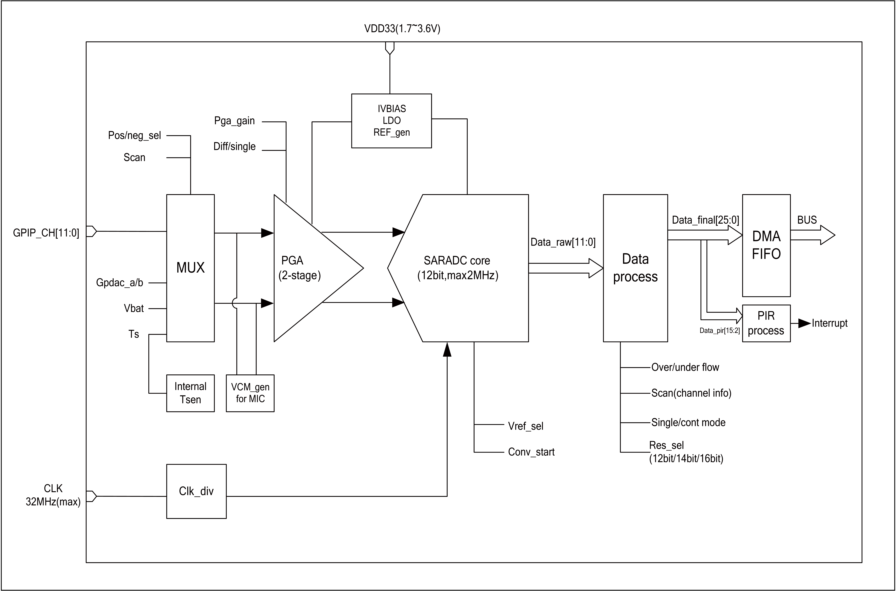
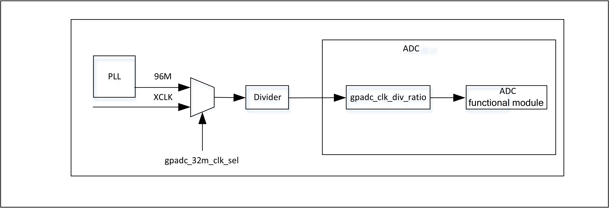

===========
ADC
===========

Introduction
==============
The chip contains a 12-bit successive approximation analog-to-digital 
converter (ADC), which supports 12 external analog inputs and several 
internal analog signal selections.

The ADC works in two modes: single conversion and multi-channel scanning.
The conversion result is 12/14/16Bits left-justified mode.
The ADC has a depth of 32 FIFOs and supports multiple interrupts 
and DMA operations. In addition to ordinary analog signal measurement, 
the ADC can also be used to measure the supply voltage. In addition, 
the ADC can also be used for temperature detection by measuring the 
internal/external diode voltage.

ADC main features
===================

- High performance

    + 12-bit, 14-bit or 16-bit conversion result output
    + ADC conversion time:fastest 0.5us for 12-bit resolution
    + 1.8V, 3.3V optional reference voltage
    + DMA support
    + Two working modes: single-channel conversion and multi-channel scanning
    + Two input modes: single-ended and differential
    + Support jitter compensation
    + User can set conversion result offset value
    + Scanning mode supports up to 1M, non-scanning mode is 2M

- Analog channels

    * 12 external analog channels
    * 2 DAC internal channels
    * 1 VBAT / 2 channel
    * 1 TSEN channel

ADC functional description
=============================

The basic block diagram of the ADC is shown below.

   ADC block diagram

The ADC consists of five parts: front-end input channel selector, 
program-controlled amplifier, ADC sampling module, data processing 
module, and FIFO.

The input channel selector is used to select the channel to be sampled. 
It contains both external analog signals and internal analog signals. 
The program-controlled amplifier is used to further process the input 
signal. It can be set according to the characteristics of the input 
signal, such as DC and AC. In order to get more accurate conversion 
values.

The ADC sampling module is the most important function module. 
It obtains the conversion from analog signals to digital signals 
through successive comparisons. The conversion result is 12Bit. 
The data processing module is responsible for further processing 
the conversion results, including adding channel information. 
The resulting data is pushed into the FIFO.

ADC pins and internal signals
--------------------------------

.. table:: ADC internal signals

    +------------------+-------------+----------------------------------------------+
    | Internal signals | Signal type |        Description                           |
    +------------------+-------------+----------------------------------------------+
    |   VBAT/2         |   Input     | Voltage signal divided from the power pin    |
    +------------------+-------------+----------------------------------------------+
    |   TSEN           |   Input     | Internal temperature sensor output voltage   |
    +------------------+-------------+----------------------------------------------+
    |   VREF           |   Input     | Internal analog module reference voltage     |
    +------------------+-------------+----------------------------------------------+
    | DACOUTA          |   Input     | DAC module output                            |
    +------------------+-------------+----------------------------------------------+
    | DACOUTB          |   Input     | DAC module output                            |
    +------------------+-------------+----------------------------------------------+

.. table:: ADC external pins

    +---------------+-------------+----------------------------------------------------------------+
    | External pins | Signal type |        Description                                             |
    +---------------+-------------+----------------------------------------------------------------+
    |   VDDA        |    Input    | Analog power supply and positive reference voltage for the ADC |
    +---------------+-------------+----------------------------------------------------------------+
    |   VSSA        |     Input   | Ground for analog power supply                                 |
    +---------------+-------------+----------------------------------------------------------------+
    | ADC_CHX       |   Input     |  12 analog input channels                                      |
    +---------------+-------------+----------------------------------------------------------------+

ADC channel
-------------
The channels that can be selected by the ADC include the input signals of external 
analog pins and the optional signals inside the chip:

- ADC CH0
- ADC CH1
- ADC CH2
- ADC CH3
- ADC CH4
- ADC CH5
- ADC CH6
- ADC CH7
- ADC CH8
- ADC CH9
- ADC CH10
- ADC CH11
- DAC OUTA
- DAC OUTB
- VBAT/2
- TSEN
- VREF
- GND

It should be noted that if VBAT/2 or TSEN is selected as the input signal to be 
acquired, gpadc_vbat_en or gpadc_ts_en needs to be set.

The ADC module can support single-ended input or differential input. 
If it is single-ended input mode, the negative input channel needs to select GND.

ADC clock
-------------

The working clock source of the ADC module is shown in the following figure:

   ADC Clock

The ADC clock source can select 96M, XTAL or internal RC32M from the PLL. 
The clock source selection is set in the GLB module. At the same time, 
the GLB module also provides the clock frequency division. By default, 
the ADC clock source is 96M. The frequency is 2, and the clock to the 
ADC module is 32M.

Inside the ADC module, a clock frequency division is provided. The default 
is 16 frequency division, so the internal clock of the ADC module is 2M by 
default. Users can adjust the ADC's clock source and various frequency 
division coefficients according to actual sampling requirements.

The gpadc_32m_clk_div divider register width is 6Bits, 
and the maximum divider is 64. Frequency division formula: 
fout = fsource / (gpadc_32m_clk_div + 1).

The gpadc_clk_div_ratio frequency division register is located inside 
the ADC module and has a width of 3Bits. The frequency division value 
is defined as follows:

- 3'b000: div=1
- 3'b001: div=4
- 3'b010: div=8
- 3'b011: div=12
- 3'b100: div=16
- 3'b101: div=20
- 3'b110: div=24
- 3'b111: div=32

ADC conversion mode
----------------------

The ADC supports two conversion modes: single-channel conversion mode and scan mode.

In single-channel conversion mode, the user needs to select the positive 
input channel through gpadc_pos_sel, select the negative input channel 
through gpadc_neg_sel, and set the gpadc_cont_conv_en control bit to 0, 
which means single-channel conversion, and then set the gpadc_conv_start 
control bit to start the conversion.

In scan conversion mode, the gpadc_cont_conv_en control bit needs to be 
set to 1, and the number of conversion channels set by the ADC according 
to the gpadc_scan_length control bit. According to the channel order set 
by the gpadc_reg_scn_posX (X = 1, 2) and gpadc_reg_scn_negX (X = 1, 2) 
registers, the conversion is performed one by one, and the result of the 
conversion is automatically pushed into the ADC FIFO. The channels set by 
the gpadc_reg_scn_posX (X = 1, 2) and gpadc_reg_scn_negX (X = 1, 2) 
registers can be the same, which means that users can implement multiple 
sampling conversions on a channel.

ADC conversion results are generally placed in the FIFO. 
Users need to set the FIFO receive data threshold interrupt based 
on the actual number of conversion channels. The FIFO threshold 
interrupt is used as the ADC conversion completion interrupt.

ADC consequence
------------------
The gpadc_raw_data register stores the raw result of the ADC. 
In single-ended mode, the data valid bit is 12Bits, unsigned bit. 
In differential mode, the highest bit is the sign bit.
The remaining 11Bits represent the result of the conversion.

The gpadc_data_out register stores the ADC result. 
This result contains the ADC result, sign bit and channel information. 
The data format is as follows:

.. table:: ADC conversion result format

    +---------+----+-----+-----+-----+----+-----+-----+-----+----+----+--+--+--+--+--+--+--+--+--+--+--+--+--+--+--+--+
    | BitS    | 25 | 24  | 23  | 22  | 21 | 20  | 19  | 18  | 17 | 16 |15|14|13|12|11|10|9 | 8| 7| 6| 5| 4| 3| 2| 1| 0|
    +---------+----+-----+-----+-----+----+-----+-----+-----+----+----+--+--+--+--+--+--+--+--+--+--+--+--+--+--+--+--+
    | meaning |  Positive channel number  |  Negative channel number  |           Conversion result                   |
    +---------+----+-----+-----+-----+----+-----+-----+-----+----+----+--+--+--+--+--+--+--+--+--+--+--+--+--+--+--+--+

Bit21-Bit25 of the conversion result is the positive channel number, 
Bit16-Bit20 is the negative channel number, and Bit0-Bit15 is the 
converted value.

The gpadc_res_sel control bit can set the number of bits of the 
conversion result, which are 12 bits, 14 bits, and 16 bits, 
respectively. Among them, 14 bits and 16 bits are the results 
obtained by multiple sampling to improve the accuracy.

The values that can be set are as follows:

- 3'b000    12bit 2MS/s, OSR=1 
- 3'b001    14bit 125kS/s, OSR=16
- 3'b010    14bit 31.25kS/s, OSR=64 
- 3'b011    16bit 15.625KS/s, OSR=128
- 3'b100    16bit 7.8125KS/s, OSR=256

The ADC conversion result is left-justified. 
When 12 bits are selected, Bit15-Bit4 of the conversion result is 
valid. When 14 bits are selected, Bit15-Bit2 of the conversion result 
is valid. When 16 bits are selected, Bit15-Bit0 of the conversion 
result is valid.

Similarly, in the differential mode, the highest is the sign, that is, 
when 14 bits are selected, Bit15 is the sign bit, Bit14-Bit2 is the 
conversion result, and Bit14 is the MSB.

In single-ended mode, there is no sign bit, that is, when 12 bits 
are selected, Bit15-Bit4 is the conversion result and Bit15 is the MSB.

In actual use, the results of the ADC are generally placed in the 
FIFO, which is particularly important in the multi-channel scan mode. 
Therefore, users generally obtain conversion results from the ADC FIFO. The data format of the ADC FIFO is the same in the gpadc_data_out register.

ADC interrupt
----------------
The ADC module can generate interrupts when the positive sampling 
is saturated and the negative sampling is saturated. The respective 
interrupts can be masked by gpadc_pos_satur_mask, gpadc_neg_satur_mask. 

When the interrupt is generated, the interrupt status can be queried 
by the gpadc_pos_satur, and gpadc_neg_satur registers, and the 
interrupt can be cleared by gpadc_pos_satur_clr and gpadc_neg_satur_clr.
This function can be used to determine whether the input voltage 
is abnormal.

ADC FIFO
-------------

The ADC module has a FIFO with a depth of 32 and a data width of 26Bits.
After the ADC completes the conversion, it will automatically push 
the result into the FIFO. The ADC's FIFO has the following status 
and interrupt management functions:

- FIFO full status
- FIFO is not empty
- FIFO Overrun interrupt
- FIFO Underrun interrupt

When an interrupt occurs, the interrupt flag can be cleared by 
the corresponding clear bit.

Using the ADC's FIFO, users can implement three modes of data 
acquisition: query mode, interrupt mode, and DMA mode.

**Query mode**

The CPU polls the gpadc_rdy bit. When this control bit is set, 
it indicates that there is valid data in the FIFO. The CPU can 
obtain the number of FIFO data according to gpadc_fifo_data_count 
and read these data from the FIFO.

**Interrupt mode**

The CPU sets gpadc_rdy_mask to 0, and the ADC will generate an 
interrupt when there is data in the FIFO. The user can use the 
interrupt function to obtain the number of FIFO data according 
to gpadc_fifo_data_count and read these data from the FIFO. Then 
set gpadc_rdy_clr to clear the interrupt.

**DMA mode**

The user sets the gpadc_dma_en control bit, which can cooperate 
with DMA to complete the transfer of data to memory. When using 
the DMA mode, the gpadc_fifo_thl is used to set the threshold 
of the number of data sent by the ADC FIFO by the FIFO. When 
the DMA receives the request, it will automatically transfer 
the specified number of results from the FIFO to the 
corresponding memory according to the parameters set by the user.

ADC configuration process
----------------------------

**Setting the ADC clock**

According to the ADC conversion speed requirements, determine the 
working clock of the ADC, set the ADC clock source and frequency 
division of the GLB module, and combine with gpadc_clk_div_ratio 
to determine the final working module's clock frequency.

**Set GPIO according to the channel used**

According to the analog pin used, determine the channel number 
used, initialize the corresponding GPIO as an analog function. 
It should be noted that when setting the GPIO as an analog input, 
do not set the GPIO pull-up or pull-down, you need to set it to 
float.

**Set the channel to be converted**

Set the corresponding channel register according to the analog 
channel and conversion mode used. 

For single-channel conversion, set the converted channel 
information in the gpadc_pos_sel and gpadc_neg_sel registers.

For multi-channel scanning mode, set gpadc_scan_length, 
gpadc_reg_scn_posX and gpadc_reg_scn_negX according to the 
number of scanning channels and scanning order.

**Set the data reading method**

According to the way of reading data introduced by ADC FIFO, 
select the mode to use and set the corresponding register. 
If you use DMA, you also need to configure a channel of DMA 
to cooperate with the ADC FIFO to complete the data transfer.

**Start conversion**

Finally set gpadc_res_sel to select the precision of the data 
conversion result. Finally set gpadc_global_en = 1 and 
gpadc_conv_start = 1 to start the ADC to start conversion.

When the conversion is complete and needs to be converted again, 
gpadc_conv_start needs to be set to 0 and then set to 1 in order 
to trigger the conversion again.

VBAT measurement
---------------------
The VBAT/2 measurement is the voltage of the chip VDD33, 
not the voltage of an external battery such as a lithium battery. 
If you need to measure the voltage of a power supply head such as 
a lithium battery, you can divide the voltage and then input it 
to the ADC's GPIO analog channel. Measuring the voltage of VDD33 
can reduce the use of GPIO.

The VBAT/2 voltage measured by the ADC module is after a 
partial pressure.The actual input voltage to the ADC module is 
half of VDD33, that is, VBAT/2 = VDD33/2. Because the voltage 
is divided, in order to obtain higher accuracy, it is recommended 
that the reference voltage of the ADC is 1.8V, single-ended mode 
is used, the positive input voltage is VBAT/2, the negative 
input voltage is GND, and Gpadc_vbat_en is set to 1 to start. 

After conversion, multiply the corresponding conversion result 
by 2 to get the VDD33 voltage.

TSEN measurement
-----------------------

The ADC can measure the internal diode or external diode voltage 
value, and the voltage difference between the diode and 
temperature is related, so by measuring the voltage of the 
diode, the ambient temperature can be calculated. We call it 
Temperature Sensor, referred to as TSEN.

The test principle of TSEN is to generate a fitted curve by 
measuring the voltage difference ΔV generated by two different 
currents on a diode with temperature.

Regardless of the measurement of the external or internal diode, the final 
output value is related to temperature, which can be expressed 
as Δ(ADC_out) = 7.753T + X. When we know the voltage value, 
we also know the temperature T. Here X is an offset value that 
can be used as a standard value. Before actual use, we need to 
determine X. The chip manufacturer will measure Δ(ADC_out) at 
a standard temperature, such as 25 degrees at room temperature, 
before the chip leaves the factory to get X.

When the user uses it, as long as the formula 
T = [Δ(ADC_out) -X]/7.753, the temperature T can be obtained.

When using TSEN, it is recommended to set the ADC to 16Bits mode, 
reduce the error by multiple sampling, and select 1.8V as the 
reference voltage to improve accuracy. Set gpadc_ts_en to 1 to 
enable the TSEN function. If the internal diode is selected, 
gpadc_tsext_sel = 0. External diode, gpadc_tsext_sel = 1, 
select the forward input channel according to the actual 
situation. 

If it is an internal diode, select the TSEN channel. 
If it is external, select the corresponding analog GPIO channel. 
Select the negative input terminal as GND. After the above 
settings are completed, set gpadc_tsvbe_low = 0 to start the 
measurement and get the measurement result V0, then set 
gpadc_tsvbe_low = 1 to start the measurement and get the 
measurement result V1, Δ(ADC_out) = V1-V0, according to the 
formula T = [Δ(ADC_out) -X] /7.753 to obtain the temperature T.

Register description
==========================

+-------------------------+-------------------------------+
| Name                    | Description                   |
+-------------------------+-------------------------------+
| `gpadc_config`_         | GPADC configuration           |
+-------------------------+-------------------------------+
| `gpadc_dma_rdata`_      | GPADC DMA read data           |
+-------------------------+-------------------------------+
| `gpadc_reg_cmd`_        | GPADC configuration register  |
+-------------------------+-------------------------------+
| `gpadc_reg_config1`_    | GPADC configuration register1 |
+-------------------------+-------------------------------+
| `gpadc_reg_config2`_    | GPADC configuration register2 |
+-------------------------+-------------------------------+
| `gpadc_reg_scn_pos1`_   | GPADC converation sequence 1  |
+-------------------------+-------------------------------+
| `gpadc_reg_scn_pos2`_   | GPADC converation sequence 2  |
+-------------------------+-------------------------------+
| `gpadc_reg_scn_neg1`_   | GPADC converation sequence 3  |
+-------------------------+-------------------------------+
| `gpadc_reg_scn_neg2`_   | GPADC converation sequence 4  |
+-------------------------+-------------------------------+
| `gpadc_reg_status`_     | GPADC status register         |
+-------------------------+-------------------------------+
| `gpadc_reg_isr`_        | GPADC status flag register    |
+-------------------------+-------------------------------+
| `gpadc_reg_result`_     | GPADC result register         |
+-------------------------+-------------------------------+
| `gpadc_reg_raw_result`_ | GPADC raw result register     |
+-------------------------+-------------------------------+
| `gpadc_reg_define`_     | GPADC define register         |
+-------------------------+-------------------------------+

gpadc_config
--------------
 
**Address：**  0x40002000
 

+-----------+-----------+-----------+-----------+-----------+-----------+-----------+-----------+-----------+-----------+-----------+-----------+-----------+-----------+-----------+-----------+ 
| 31        | 30        | 29        | 28        | 27        | 26        | 25        | 24        | 23        | 22        | 21        | 20        | 19        | 18        | 17        | 16        | 
+-----------+-----------+-----------+-----------+-----------+-----------+-----------+-----------+-----------+-----------+-----------+-----------+-----------+-----------+-----------+-----------+ 
| RSVD                                                                                          | FIFOTHL               | FIFODACN                                                              |
+-----------+-----------+-----------+-----------+-----------+-----------+-----------+-----------+-----------+-----------+-----------+-----------+-----------+-----------+-----------+-----------+ 
| 15        | 14        | 13        | 12        | 11        | 10        | 9         | 8         | 7         | 6         | 5         | 4         | 3         | 2         | 1         | 0         |
+-----------+-----------+-----------+-----------+-----------+-----------+-----------+-----------+-----------+-----------+-----------+-----------+-----------+-----------+-----------+-----------+ 
| FIFORDYM  | FURM      | FORM      | RDYM      | RSVD      | URCL      | ORCL      | RDYCLR    | FIFORDY   | FIFOUR    | FIFOOR    | RDY       | FIFOFULL  | FIFONE    | FIFOCLR   | DMAEN     |
+-----------+-----------+-----------+-----------+-----------+-----------+-----------+-----------+-----------+-----------+-----------+-----------+-----------+-----------+-----------+-----------+ 

+----------+----------+--------+-------------+---------------------------------------------------------------------------+
| Bit      | Name     |Type    | Reset       | Description                                                               |
+----------+----------+--------+-------------+---------------------------------------------------------------------------+
| 31:24    | RSVD     |        |             |                                                                           |
+----------+----------+--------+-------------+---------------------------------------------------------------------------+
| 23:22    | FIFOTHL  | R/W    | 2'D0        | fifo threshold                                                            |
+          +          +        +             +                                                                           +
|          |          |        |             | 2'b00: 1 data                                                             |
+          +          +        +             +                                                                           +
|          |          |        |             | 2'b01: 4 data                                                             |
+          +          +        +             +                                                                           +
|          |          |        |             | 2'b10: 8 data                                                             |
+          +          +        +             +                                                                           +
|          |          |        |             | 2'b11: 16 data                                                            |
+----------+----------+--------+-------------+---------------------------------------------------------------------------+
| 21:16    | FIFODACN | R      | 6'D0        | fifo data number                                                          |
+----------+----------+--------+-------------+---------------------------------------------------------------------------+
| 15       | FIFORDYM | R/W    | 1'B1        | write 1 mask                                                              |
+----------+----------+--------+-------------+---------------------------------------------------------------------------+
| 14       | FURM     | R/W    | 1'B0        | write 1 mask                                                              |
+----------+----------+--------+-------------+---------------------------------------------------------------------------+
| 13       | FORM     | R/W    | 1'B0        | write 1 mask                                                              |
+----------+----------+--------+-------------+---------------------------------------------------------------------------+
| 12       | RDYM     | R/W    | 1'B0        | write 1 mask                                                              |
+----------+----------+--------+-------------+---------------------------------------------------------------------------+
| 11       | RSVD     |        |             |                                                                           |
+----------+----------+--------+-------------+---------------------------------------------------------------------------+
| 10       | URCL     | W1C    | 1'B0        | Write 1 to clear flag                                                     |
+----------+----------+--------+-------------+---------------------------------------------------------------------------+
| 9        | ORCL     | W1C    | 1'B0        | Write 1 to clear flag                                                     |
+----------+----------+--------+-------------+---------------------------------------------------------------------------+
| 8        | RDYCLR   | W1C    | 1'B0        | Write 1 to clear flag                                                     |
+----------+----------+--------+-------------+---------------------------------------------------------------------------+
| 7        | FIFORDY  | R      | 1'B0        | FIFO ready interrupt flag                                                 |
+----------+----------+--------+-------------+---------------------------------------------------------------------------+
| 6        | FIFOUR   | R      | 1'B0        | FIFO underrun interrupt flag                                              |
+----------+----------+--------+-------------+---------------------------------------------------------------------------+
| 5        | FIFOOR   | R      | 1'B0        | FIFO overrun interrupt flag                                               |
+----------+----------+--------+-------------+---------------------------------------------------------------------------+
| 4        | RDY      | R      | 1'B0        | Conversion data ready interrupt flag                                      |
+----------+----------+--------+-------------+---------------------------------------------------------------------------+
| 3        | FIFOFULL | R      | 1'B0        | FIFO full flag                                                            |
+----------+----------+--------+-------------+---------------------------------------------------------------------------+
| 2        | FIFONE   | R      | 1'B0        | FIFO not empty flag                                                       |
+----------+----------+--------+-------------+---------------------------------------------------------------------------+
| 1        | FIFOCLR  | W1C    | 1'B0        | FIFO clear signal                                                         |
+----------+----------+--------+-------------+---------------------------------------------------------------------------+
| 0        | DMAEN    | R/W    | 1'B0        | GPADC DMA enbale                                                          |
+----------+----------+--------+-------------+---------------------------------------------------------------------------+

gpadc_dma_rdata
-----------------
 
**Address：**  0x40002004
 

+-----------+-----------+-----------+-----------+-----------+-----------+-----------+-----------+-----------+-----------+-----------+-----------+-----------+-----------+-----------+-----------+ 
| 31        | 30        | 29        | 28        | 27        | 26        | 25        | 24        | 23        | 22        | 21        | 20        | 19        | 18        | 17        | 16        | 
+-----------+-----------+-----------+-----------+-----------+-----------+-----------+-----------+-----------+-----------+-----------+-----------+-----------+-----------+-----------+-----------+ 
| RSVD                                                                  | DMARDA                                                                                                                |
+-----------+-----------+-----------+-----------+-----------+-----------+-----------+-----------+-----------+-----------+-----------+-----------+-----------+-----------+-----------+-----------+ 
| 15        | 14        | 13        | 12        | 11        | 10        | 9         | 8         | 7         | 6         | 5         | 4         | 3         | 2         | 1         | 0         |
+-----------+-----------+-----------+-----------+-----------+-----------+-----------+-----------+-----------+-----------+-----------+-----------+-----------+-----------+-----------+-----------+ 
| DMARDA                                                                                                                                                                                        |
+-----------+-----------+-----------+-----------+-----------+-----------+-----------+-----------+-----------+-----------+-----------+-----------+-----------+-----------+-----------+-----------+ 

+----------+----------+--------+-------------+---------------------------------------------------+
| Bit      | Name     |Type    | Reset       | Description                                       |
+----------+----------+--------+-------------+---------------------------------------------------+
| 31:26    | RSVD     |        |             |                                                   |
+----------+----------+--------+-------------+---------------------------------------------------+
| 25:0     | DMARDA   | R      | 26'D0       | GPADC finial conversion result stored in the FIFO |
+----------+----------+--------+-------------+---------------------------------------------------+

gpadc_reg_cmd
---------------
 
**Address：**  0x4000f90c
 

+-----------+-----------+-----------+-----------+-----------+-----------+-----------+-----------+-----------+-----------+-----------+-----------+-----------+-----------+-----------+-----------+ 
| 31        | 30        | 29        | 28        | 27        | 26        | 25        | 24        | 23        | 22        | 21        | 20        | 19        | 18        | 17        | 16        | 
+-----------+-----------+-----------+-----------+-----------+-----------+-----------+-----------+-----------+-----------+-----------+-----------+-----------+-----------+-----------+-----------+ 
| RSVD      | SENTEN    | SENSEL                | CSENPU    | RSVD                              | MB32EN    | MP2G                  | M1DF      | M2DF      | DWAEN     | RSVD      | MBBP      |
+-----------+-----------+-----------+-----------+-----------+-----------+-----------+-----------+-----------+-----------+-----------+-----------+-----------+-----------+-----------+-----------+ 
| 15        | 14        | 13        | 12        | 11        | 10        | 9         | 8         | 7         | 6         | 5         | 4         | 3         | 2         | 1         | 0         |
+-----------+-----------+-----------+-----------+-----------+-----------+-----------+-----------+-----------+-----------+-----------+-----------+-----------+-----------+-----------+-----------+ 
| MPEN      | MBEN      | NGGR      | POSSEL                                                    | NEGSEL                                                    | SFRS      | CVST      | GBEN      |
+-----------+-----------+-----------+-----------+-----------+-----------+-----------+-----------+-----------+-----------+-----------+-----------+-----------+-----------+-----------+-----------+ 

+----------+----------+--------+-------------+----------------------------------------------------------------------------------------------------------------------------------------------------------------------------------------------------------------------------------------------------------+
| Bit      | Name     |Type    | Reset       | Description                                                                                                                                                                                                                                              |
+----------+----------+--------+-------------+----------------------------------------------------------------------------------------------------------------------------------------------------------------------------------------------------------------------------------------------------------+
| 31       | RSVD     |        |             |                                                                                                                                                                                                                                                          |
+----------+----------+--------+-------------+----------------------------------------------------------------------------------------------------------------------------------------------------------------------------------------------------------------------------------------------------------+
| 30       | SENTEN   | R/W    | 1'B0        | enable sensor dc test mux                                                                                                                                                                                                                                |
+----------+----------+--------+-------------+----------------------------------------------------------------------------------------------------------------------------------------------------------------------------------------------------------------------------------------------------------+
| 29:28    | SENSEL   | R/W    | 2'H0        | selected output current channel and measurement channel                                                                                                                                                                                                  |
+          +          +        +             +                                                                                                                                                                                                                                                          +
|          |          |        |             | 2'h0: 1st channel                                                                                                                                                                                                                                        |
+          +          +        +             +                                                                                                                                                                                                                                                          +
|          |          |        |             | 2'h1: 2nd channel                                                                                                                                                                                                                                        |
+          +          +        +             +                                                                                                                                                                                                                                                          +
|          |          |        |             | 2'h2: 3rd channel                                                                                                                                                                                                                                        |
+          +          +        +             +                                                                                                                                                                                                                                                          +
|          |          |        |             | 2'h3: 4th channel                                                                                                                                                                                                                                        |
+----------+----------+--------+-------------+----------------------------------------------------------------------------------------------------------------------------------------------------------------------------------------------------------------------------------------------------------+
| 27       | CSENPU   | R/W    | 1'B0        | enable chip sensor test                                                                                                                                                                                                                                  |
+          +          +        +             +                                                                                                                                                                                                                                                          +
|          |          |        |             | 1'b0: disable                                                                                                                                                                                                                                            |
+          +          +        +             +                                                                                                                                                                                                                                                          +
|          |          |        |             | 1'b1: enable                                                                                                                                                                                                                                             |
+----------+----------+--------+-------------+----------------------------------------------------------------------------------------------------------------------------------------------------------------------------------------------------------------------------------------------------------+
| 26:24    | RSVD     |        |             |                                                                                                                                                                                                                                                          |
+----------+----------+--------+-------------+----------------------------------------------------------------------------------------------------------------------------------------------------------------------------------------------------------------------------------------------------------+
| 23       | MB32EN   | R/W    | 1'B0        | micboost 32db enable                                                                                                                                                                                                                                     |
+          +          +        +             +                                                                                                                                                                                                                                                          +
|          |          |        |             | 1'b0: 16dB                                                                                                                                                                                                                                               |
+          +          +        +             +                                                                                                                                                                                                                                                          +
|          |          |        |             | 1'b1: 32dB                                                                                                                                                                                                                                               |
+----------+----------+--------+-------------+----------------------------------------------------------------------------------------------------------------------------------------------------------------------------------------------------------------------------------------------------------+
| 22:21    | MP2G     | R/W    | 2'H0        | mic_pga2_gain                                                                                                                                                                                                                                            |
+          +          +        +             +                                                                                                                                                                                                                                                          +
|          |          |        |             | 2'h0: 0dB                                                                                                                                                                                                                                                |
+          +          +        +             +                                                                                                                                                                                                                                                          +
|          |          |        |             | 2'h1: 6dB                                                                                                                                                                                                                                                |
+          +          +        +             +                                                                                                                                                                                                                                                          +
|          |          |        |             | 2'h2: -6dB                                                                                                                                                                                                                                               |
+          +          +        +             +                                                                                                                                                                                                                                                          +
|          |          |        |             | 2'h3: 12dB                                                                                                                                                                                                                                               |
+----------+----------+--------+-------------+----------------------------------------------------------------------------------------------------------------------------------------------------------------------------------------------------------------------------------------------------------+
| 20       | M1DF     | R/W    | 1'B0        | mic1 diff enable                                                                                                                                                                                                                                         |
+          +          +        +             +                                                                                                                                                                                                                                                          +
|          |          |        |             | 1'b0: single                                                                                                                                                                                                                                             |
+          +          +        +             +                                                                                                                                                                                                                                                          +
|          |          |        |             | 1'b1: diff                                                                                                                                                                                                                                               |
+----------+----------+--------+-------------+----------------------------------------------------------------------------------------------------------------------------------------------------------------------------------------------------------------------------------------------------------+
| 19       | M2DF     | R/W    | 1'B0        | mic2 diff enable                                                                                                                                                                                                                                         |
+          +          +        +             +                                                                                                                                                                                                                                                          +
|          |          |        |             | 1'b0: single                                                                                                                                                                                                                                             |
+          +          +        +             +                                                                                                                                                                                                                                                          +
|          |          |        |             | 1'b1: diff                                                                                                                                                                                                                                               |
+----------+----------+--------+-------------+----------------------------------------------------------------------------------------------------------------------------------------------------------------------------------------------------------------------------------------------------------+
| 18       | DWAEN    | R/W    | 1'B0        | dwa enable                                                                                                                                                                                                                                               |
+          +          +        +             +                                                                                                                                                                                                                                                          +
|          |          |        |             | 1'b0: dwa disable                                                                                                                                                                                                                                        |
+          +          +        +             +                                                                                                                                                                                                                                                          +
|          |          |        |             | 1'b1: dwa enable                                                                                                                                                                                                                                         |
+----------+----------+--------+-------------+----------------------------------------------------------------------------------------------------------------------------------------------------------------------------------------------------------------------------------------------------------+
| 17       | RSVD     |        |             |                                                                                                                                                                                                                                                          |
+----------+----------+--------+-------------+----------------------------------------------------------------------------------------------------------------------------------------------------------------------------------------------------------------------------------------------------------+
| 16       | MBBP     | R/W    | 1'B0        | micboost amp bypass                                                                                                                                                                                                                                      |
+          +          +        +             +                                                                                                                                                                                                                                                          +
|          |          |        |             | 1'b0: not bypass                                                                                                                                                                                                                                         |
+          +          +        +             +                                                                                                                                                                                                                                                          +
|          |          |        |             | 1'b1: bypass                                                                                                                                                                                                                                             |
+----------+----------+--------+-------------+----------------------------------------------------------------------------------------------------------------------------------------------------------------------------------------------------------------------------------------------------------+
| 15       | MPEN     | R/W    | 1'B0        | micpga enable                                                                                                                                                                                                                                            |
+          +          +        +             +                                                                                                                                                                                                                                                          +
|          |          |        |             | 1'b0: micpga disable                                                                                                                                                                                                                                     |
+          +          +        +             +                                                                                                                                                                                                                                                          +
|          |          |        |             | 1'b1: miapga enable                                                                                                                                                                                                                                      |
+----------+----------+--------+-------------+----------------------------------------------------------------------------------------------------------------------------------------------------------------------------------------------------------------------------------------------------------+
| 14       | MBEN     | R/W    | 1'B0        | enable micbias                                                                                                                                                                                                                                           |
+          +          +        +             +                                                                                                                                                                                                                                                          +
|          |          |        |             | 1'b0: micbias power down                                                                                                                                                                                                                                 |
+          +          +        +             +                                                                                                                                                                                                                                                          +
|          |          |        |             | 1'b1: miabias power on                                                                                                                                                                                                                                   |
+----------+----------+--------+-------------+----------------------------------------------------------------------------------------------------------------------------------------------------------------------------------------------------------------------------------------------------------+
| 13       | NGGR     | R/W    | 1'B0        | set negative input of adc to ground                                                                                                                                                                                                                      |
+          +          +        +             +                                                                                                                                                                                                                                                          +
|          |          |        |             | 1'b0: disable                                                                                                                                                                                                                                            |
+          +          +        +             +                                                                                                                                                                                                                                                          +
|          |          |        |             | 1'b1: enable                                                                                                                                                                                                                                             |
+----------+----------+--------+-------------+----------------------------------------------------------------------------------------------------------------------------------------------------------------------------------------------------------------------------------------------------------+
| 12:8     | POSSEL   | R/W    | 5'HF        | select adc positive input in none-scan mode                                                                                                                                                                                                              |
+          +          +        +             +                                                                                                                                                                                                                                                          +
|          |          |        |             | 4'b0000 gpio0                                                                                                                                                                                                                                            |
+          +          +        +             +                                                                                                                                                                                                                                                          +
|          |          |        |             | 4'b0001 gpio1                                                                                                                                                                                                                                            |
+          +          +        +             +                                                                                                                                                                                                                                                          +
|          |          |        |             | 4'b0010 gpio2                                                                                                                                                                                                                                            |
+          +          +        +             +                                                                                                                                                                                                                                                          +
|          |          |        |             | 4'b0011 gpio3                                                                                                                                                                                                                                            |
+          +          +        +             +                                                                                                                                                                                                                                                          +
|          |          |        |             | 4'b0100 gpio4                                                                                                                                                                                                                                            |
+          +          +        +             +                                                                                                                                                                                                                                                          +
|          |          |        |             | 4'b0101 gpio5                                                                                                                                                                                                                                            |
+          +          +        +             +                                                                                                                                                                                                                                                          +
|          |          |        |             | 4'b0110 gpio6                                                                                                                                                                                                                                            |
+          +          +        +             +                                                                                                                                                                                                                                                          +
|          |          |        |             | 4'b0111 gpio7                                                                                                                                                                                                                                            |
+          +          +        +             +                                                                                                                                                                                                                                                          +
|          |          |        |             | 4'b1000 daca                                                                                                                                                                                                                                             |
+          +          +        +             +                                                                                                                                                                                                                                                          +
|          |          |        |             | 4'b1001 dacb                                                                                                                                                                                                                                             |
+          +          +        +             +                                                                                                                                                                                                                                                          +
|          |          |        |             | 4'b1010 vbat                                                                                                                                                                                                                                             |
+          +          +        +             +                                                                                                                                                                                                                                                          +
|          |          |        |             | 4'b1011 tsen                                                                                                                                                                                                                                             |
+          +          +        +             +                                                                                                                                                                                                                                                          +
|          |          |        |             | 4'b1100 vref                                                                                                                                                                                                                                             |
+          +          +        +             +                                                                                                                                                                                                                                                          +
|          |          |        |             | 4'b1101 gnd                                                                                                                                                                                                                                              |
+          +          +        +             +                                                                                                                                                                                                                                                          +
|          |          |        |             | 4'b1111 disable                                                                                                                                                                                                                                          |
+----------+----------+--------+-------------+----------------------------------------------------------------------------------------------------------------------------------------------------------------------------------------------------------------------------------------------------------+
| 7:3      | NEGSEL   | R/W    | 5'HF        | select adc negative input in none-scan mode                                                                                                                                                                                                              |
+          +          +        +             +                                                                                                                                                                                                                                                          +
|          |          |        |             | 4'b0000 gpio0                                                                                                                                                                                                                                            |
+          +          +        +             +                                                                                                                                                                                                                                                          +
|          |          |        |             | 4'b0001 gpio1                                                                                                                                                                                                                                            |
+          +          +        +             +                                                                                                                                                                                                                                                          +
|          |          |        |             | 4'b0010 gpio2                                                                                                                                                                                                                                            |
+          +          +        +             +                                                                                                                                                                                                                                                          +
|          |          |        |             | 4'b0011 gpio3                                                                                                                                                                                                                                            |
+          +          +        +             +                                                                                                                                                                                                                                                          +
|          |          |        |             | 4'b0100 gpio4                                                                                                                                                                                                                                            |
+          +          +        +             +                                                                                                                                                                                                                                                          +
|          |          |        |             | 4'b0101 gpio5                                                                                                                                                                                                                                            |
+          +          +        +             +                                                                                                                                                                                                                                                          +
|          |          |        |             | 4'b0110 gpio6                                                                                                                                                                                                                                            |
+          +          +        +             +                                                                                                                                                                                                                                                          +
|          |          |        |             | 4'b0111 gpio7                                                                                                                                                                                                                                            |
+          +          +        +             +                                                                                                                                                                                                                                                          +
|          |          |        |             | 4'b1000 daca                                                                                                                                                                                                                                             |
+          +          +        +             +                                                                                                                                                                                                                                                          +
|          |          |        |             | 4'b1001 dacb                                                                                                                                                                                                                                             |
+          +          +        +             +                                                                                                                                                                                                                                                          +
|          |          |        |             | 4'b1010 vbat                                                                                                                                                                                                                                             |
+          +          +        +             +                                                                                                                                                                                                                                                          +
|          |          |        |             | 4'b1011 tsen                                                                                                                                                                                                                                             |
+          +          +        +             +                                                                                                                                                                                                                                                          +
|          |          |        |             | 4'b1100 vref                                                                                                                                                                                                                                             |
+          +          +        +             +                                                                                                                                                                                                                                                          +
|          |          |        |             | 4'b1101 gnd                                                                                                                                                                                                                                              |
+          +          +        +             +                                                                                                                                                                                                                                                          +
|          |          |        |             | 4'b1111 disable                                                                                                                                                                                                                                          |
+----------+----------+--------+-------------+----------------------------------------------------------------------------------------------------------------------------------------------------------------------------------------------------------------------------------------------------------+
| 2        | SFRS     | R/W    | 1'B0        | user reset the whole block 1'h0: not reset  1'h1: reset                                                                                                                                                                                                  |
+----------+----------+--------+-------------+----------------------------------------------------------------------------------------------------------------------------------------------------------------------------------------------------------------------------------------------------------+
| 1        | CVST     | R/W    | 1'B0        | 1'h0: stop converation  1'h1: start converation                                                                                                                                                                                                          |
+----------+----------+--------+-------------+----------------------------------------------------------------------------------------------------------------------------------------------------------------------------------------------------------------------------------------------------------+
| 0        | GBEN     | R/W    | 1'B0        | 1'h0: disable ADC  1'h1: enable ADC                                                                                                                                                                                                                      |
+----------+----------+--------+-------------+----------------------------------------------------------------------------------------------------------------------------------------------------------------------------------------------------------------------------------------------------------+

gpadc_reg_config1
-------------------
 
**Address：**  0x4000f910
 

+-----------+-----------+-----------+-----------+-----------+-----------+-----------+-----------+-----------+-----------+-----------+-----------+-----------+-----------+-----------+-----------+ 
| 31        | 30        | 29        | 28        | 27        | 26        | 25        | 24        | 23        | 22        | 21        | 20        | 19        | 18        | 17        | 16        | 
+-----------+-----------+-----------+-----------+-----------+-----------+-----------+-----------+-----------+-----------+-----------+-----------+-----------+-----------+-----------+-----------+ 
| RSVD      | V18SEL                | V11SEL                | DTEN      | SCEN      | SCLEN                                         | CLKDVRT                           | ALCLKINV  | RSVD      |
+-----------+-----------+-----------+-----------+-----------+-----------+-----------+-----------+-----------+-----------+-----------+-----------+-----------+-----------+-----------+-----------+ 
| 15        | 14        | 13        | 12        | 11        | 10        | 9         | 8         | 7         | 6         | 5         | 4         | 3         | 2         | 1         | 0         |
+-----------+-----------+-----------+-----------+-----------+-----------+-----------+-----------+-----------+-----------+-----------+-----------+-----------+-----------+-----------+-----------+ 
| RSVD                                                      | LDEN      | HYSTSEL   | SELEN     | RSVD                              | RESSEL                            | CTCVEN    | CALOSEN   |
+-----------+-----------+-----------+-----------+-----------+-----------+-----------+-----------+-----------+-----------+-----------+-----------+-----------+-----------+-----------+-----------+ 

+----------+----------+--------+-------------+-----------------------------------------------------------------------------------------------------------------------------------------------------------------------------------------------------------------------------------------------------------------------------------------------------------------------------------------------------------------------------------------------------------------------------------------------------------------------------------------------------------------------------------------------------------------------------------------------------------------------------------------------------------------------------------------------------------------+
| Bit      | Name     |Type    | Reset       | Description                                                                                                                                                                                                                                                                                                                                                                                                                                                                                                                                                                                                                                                                                                     |
+----------+----------+--------+-------------+-----------------------------------------------------------------------------------------------------------------------------------------------------------------------------------------------------------------------------------------------------------------------------------------------------------------------------------------------------------------------------------------------------------------------------------------------------------------------------------------------------------------------------------------------------------------------------------------------------------------------------------------------------------------------------------------------------------------+
| 31       | RSVD     |        |             |                                                                                                                                                                                                                                                                                                                                                                                                                                                                                                                                                                                                                                                                                                                 |
+----------+----------+--------+-------------+-----------------------------------------------------------------------------------------------------------------------------------------------------------------------------------------------------------------------------------------------------------------------------------------------------------------------------------------------------------------------------------------------------------------------------------------------------------------------------------------------------------------------------------------------------------------------------------------------------------------------------------------------------------------------------------------------------------------+
| 30:29    | V18SEL   | R/W    | 2'H0        | internal vdd18 select                                                                                                                                                                                                                                                                                                                                                                                                                                                                                                                                                                                                                                                                                           |
+----------+----------+--------+-------------+-----------------------------------------------------------------------------------------------------------------------------------------------------------------------------------------------------------------------------------------------------------------------------------------------------------------------------------------------------------------------------------------------------------------------------------------------------------------------------------------------------------------------------------------------------------------------------------------------------------------------------------------------------------------------------------------------------------------+
| 28:27    | V11SEL   | R/W    | 2'H0        | internal vdd11 select                                                                                                                                                                                                                                                                                                                                                                                                                                                                                                                                                                                                                                                                                           |
+----------+----------+--------+-------------+-----------------------------------------------------------------------------------------------------------------------------------------------------------------------------------------------------------------------------------------------------------------------------------------------------------------------------------------------------------------------------------------------------------------------------------------------------------------------------------------------------------------------------------------------------------------------------------------------------------------------------------------------------------------------------------------------------------------+
| 26       | DTEN     | R/W    | 1'H0        | Dither compensation enable                                                                                                                                                                                                                                                                                                                                                                                                                                                                                                                                                                                                                                                                                      |
+----------+----------+--------+-------------+-----------------------------------------------------------------------------------------------------------------------------------------------------------------------------------------------------------------------------------------------------------------------------------------------------------------------------------------------------------------------------------------------------------------------------------------------------------------------------------------------------------------------------------------------------------------------------------------------------------------------------------------------------------------------------------------------------------------+
| 25       | SCEN     | R/W    | 1'H0        | select scan mode enable: 0: select  gpadc_pos/neg_sel;1: select  : select gpadc_scan_pos_x and gpadc_scan_neg_x                                                                                                                                                                                                                                                                                                                                                                                                                                                                                                                                                                                                 |
+----------+----------+--------+-------------+-----------------------------------------------------------------------------------------------------------------------------------------------------------------------------------------------------------------------------------------------------------------------------------------------------------------------------------------------------------------------------------------------------------------------------------------------------------------------------------------------------------------------------------------------------------------------------------------------------------------------------------------------------------------------------------------------------------------+
| 24:21    | SCLEN    | R/W    | 4'H0        | select scan mode length                                                                                                                                                                                                                                                                                                                                                                                                                                                                                                                                                                                                                                                                                         |
+          +          +        +             +                                                                                                                                                                                                                                                                                                                                                                                                                                                                                                                                                                                                                                                                                                                 +
|          |          |        |             | 4'b0000 : select gpadc_scan_pos_0 and gpadc_scan_neg_0                                                                                                                                                                                                                                                                                                                                                                                                                                                                                                                                                                                                                                                          |
+          +          +        +             +                                                                                                                                                                                                                                                                                                                                                                                                                                                                                                                                                                                                                                                                                                                 +
|          |          |        |             | 4'b0001 : select gpadc_scan_pos_1 and gpadc_scan_neg_1                                                                                                                                                                                                                                                                                                                                                                                                                                                                                                                                                                                                                                                          |
+          +          +        +             +                                                                                                                                                                                                                                                                                                                                                                                                                                                                                                                                                                                                                                                                                                                 +
|          |          |        |             | 4'b0010 : select gpadc_scan_pos_2 and gpadc_scan_neg_2                                                                                                                                                                                                                                                                                                                                                                                                                                                                                                                                                                                                                                                          |
+          +          +        +             +                                                                                                                                                                                                                                                                                                                                                                                                                                                                                                                                                                                                                                                                                                                 +
|          |          |        |             | 4'b0011 : select gpadc_scan_pos_3 and gpadc_scan_neg_3                                                                                                                                                                                                                                                                                                                                                                                                                                                                                                                                                                                                                                                          |
+          +          +        +             +                                                                                                                                                                                                                                                                                                                                                                                                                                                                                                                                                                                                                                                                                                                 +
|          |          |        |             | 4'b0100 : select gpadc_scan_pos_4 and gpadc_scan_neg_4                                                                                                                                                                                                                                                                                                                                                                                                                                                                                                                                                                                                                                                          |
+          +          +        +             +                                                                                                                                                                                                                                                                                                                                                                                                                                                                                                                                                                                                                                                                                                                 +
|          |          |        |             | 4'b0101 : select gpadc_scan_pos_5 and gpadc_scan_neg_5                                                                                                                                                                                                                                                                                                                                                                                                                                                                                                                                                                                                                                                          |
+          +          +        +             +                                                                                                                                                                                                                                                                                                                                                                                                                                                                                                                                                                                                                                                                                                                 +
|          |          |        |             | 4'b0110 : select gpadc_scan_pos_6 and gpadc_scan_neg_6                                                                                                                                                                                                                                                                                                                                                                                                                                                                                                                                                                                                                                                          |
+          +          +        +             +                                                                                                                                                                                                                                                                                                                                                                                                                                                                                                                                                                                                                                                                                                                 +
|          |          |        |             | 4'b0111 : select gpadc_scan_pos_7 and gpadc_scan_neg_7                                                                                                                                                                                                                                                                                                                                                                                                                                                                                                                                                                                                                                                          |
+          +          +        +             +                                                                                                                                                                                                                                                                                                                                                                                                                                                                                                                                                                                                                                                                                                                 +
|          |          |        |             | 4'b1000 : select gpadc_scan_pos_8 and gpadc_scan_neg_8                                                                                                                                                                                                                                                                                                                                                                                                                                                                                                                                                                                                                                                          |
+          +          +        +             +                                                                                                                                                                                                                                                                                                                                                                                                                                                                                                                                                                                                                                                                                                                 +
|          |          |        |             | 4'b1001 : select gpadc_scan_pos_9 and gpadc_scan_neg_9                                                                                                                                                                                                                                                                                                                                                                                                                                                                                                                                                                                                                                                          |
+          +          +        +             +                                                                                                                                                                                                                                                                                                                                                                                                                                                                                                                                                                                                                                                                                                                 +
|          |          |        |             | 4'b1010 : select gpadc_scan_pos_10 and gpadc_scan_neg_10                                                                                                                                                                                                                                                                                                                                                                                                                                                                                                                                                                                                                                                        |
+          +          +        +             +                                                                                                                                                                                                                                                                                                                                                                                                                                                                                                                                                                                                                                                                                                                 +
|          |          |        |             | 4'b1011 : select gpadc_scan_pos_11 and gpadc_scan_neg_11                                                                                                                                                                                                                                                                                                                                                                                                                                                                                                                                                                                                                                                        |
+----------+----------+--------+-------------+-----------------------------------------------------------------------------------------------------------------------------------------------------------------------------------------------------------------------------------------------------------------------------------------------------------------------------------------------------------------------------------------------------------------------------------------------------------------------------------------------------------------------------------------------------------------------------------------------------------------------------------------------------------------------------------------------------------------+
| 20:18    | CLKDVRT  | R/W    | 3'H3        | analog 32M clock division ratio                                                                                                                                                                                                                                                                                                                                                                                                                                                                                                                                                                                                                                                                                 |
+          +          +        +             +                                                                                                                                                                                                                                                                                                                                                                                                                                                                                                                                                                                                                                                                                                                 +
|          |          |        |             | 3'b000: div=1                                                                                                                                                                                                                                                                                                                                                                                                                                                                                                                                                                                                                                                                                                   |
+          +          +        +             +                                                                                                                                                                                                                                                                                                                                                                                                                                                                                                                                                                                                                                                                                                                 +
|          |          |        |             | 3'b001: div=4                                                                                                                                                                                                                                                                                                                                                                                                                                                                                                                                                                                                                                                                                                   |
+          +          +        +             +                                                                                                                                                                                                                                                                                                                                                                                                                                                                                                                                                                                                                                                                                                                 +
|          |          |        |             | 3'b010: div=8                                                                                                                                                                                                                                                                                                                                                                                                                                                                                                                                                                                                                                                                                                   |
+          +          +        +             +                                                                                                                                                                                                                                                                                                                                                                                                                                                                                                                                                                                                                                                                                                                 +
|          |          |        |             | 3'b011: div=12                                                                                                                                                                                                                                                                                                                                                                                                                                                                                                                                                                                                                                                                                                  |
+          +          +        +             +                                                                                                                                                                                                                                                                                                                                                                                                                                                                                                                                                                                                                                                                                                                 +
|          |          |        |             | 3'b100: div=16                                                                                                                                                                                                                                                                                                                                                                                                                                                                                                                                                                                                                                                                                                  |
+          +          +        +             +                                                                                                                                                                                                                                                                                                                                                                                                                                                                                                                                                                                                                                                                                                                 +
|          |          |        |             | 3'b101: div=20                                                                                                                                                                                                                                                                                                                                                                                                                                                                                                                                                                                                                                                                                                  |
+          +          +        +             +                                                                                                                                                                                                                                                                                                                                                                                                                                                                                                                                                                                                                                                                                                                 +
|          |          |        |             | 3'b110: div=24                                                                                                                                                                                                                                                                                                                                                                                                                                                                                                                                                                                                                                                                                                  |
+          +          +        +             +                                                                                                                                                                                                                                                                                                                                                                                                                                                                                                                                                                                                                                                                                                                 +
|          |          |        |             | 3'b111: div=32                                                                                                                                                                                                                                                                                                                                                                                                                                                                                                                                                                                                                                                                                                  |
+----------+----------+--------+-------------+-----------------------------------------------------------------------------------------------------------------------------------------------------------------------------------------------------------------------------------------------------------------------------------------------------------------------------------------------------------------------------------------------------------------------------------------------------------------------------------------------------------------------------------------------------------------------------------------------------------------------------------------------------------------------------------------------------------------+
| 17       | ALCLKINV | R/W    | 1'B0        | analog clock 2M inverted                                                                                                                                                                                                                                                                                                                                                                                                                                                                                                                                                                                                                                                                                        |
+----------+----------+--------+-------------+-----------------------------------------------------------------------------------------------------------------------------------------------------------------------------------------------------------------------------------------------------------------------------------------------------------------------------------------------------------------------------------------------------------------------------------------------------------------------------------------------------------------------------------------------------------------------------------------------------------------------------------------------------------------------------------------------------------------+
| 16:11    | RSVD     |        |             |                                                                                                                                                                                                                                                                                                                                                                                                                                                                                                                                                                                                                                                                                                                 |
+----------+----------+--------+-------------+-----------------------------------------------------------------------------------------------------------------------------------------------------------------------------------------------------------------------------------------------------------------------------------------------------------------------------------------------------------------------------------------------------------------------------------------------------------------------------------------------------------------------------------------------------------------------------------------------------------------------------------------------------------------------------------------------------------------+
| 10       | LDEN     | R/W    | 1'B0        |                                                                                                                                                                                                                                                                                                                                                                                                                                                                                                                                                                                                                                                                                                                 |
+----------+----------+--------+-------------+-----------------------------------------------------------------------------------------------------------------------------------------------------------------------------------------------------------------------------------------------------------------------------------------------------------------------------------------------------------------------------------------------------------------------------------------------------------------------------------------------------------------------------------------------------------------------------------------------------------------------------------------------------------------------------------------------------------------+
| 9        | HYSTSEL  | R/W    | 1'B0        |                                                                                                                                                                                                                                                                                                                                                                                                                                                                                                                                                                                                                                                                                                                 |
+----------+----------+--------+-------------+-----------------------------------------------------------------------------------------------------------------------------------------------------------------------------------------------------------------------------------------------------------------------------------------------------------------------------------------------------------------------------------------------------------------------------------------------------------------------------------------------------------------------------------------------------------------------------------------------------------------------------------------------------------------------------------------------------------------+
| 8        | SELEN    | R/W    | 1'B0        |                                                                                                                                                                                                                                                                                                                                                                                                                                                                                                                                                                                                                                                                                                                 |
+----------+----------+--------+-------------+-----------------------------------------------------------------------------------------------------------------------------------------------------------------------------------------------------------------------------------------------------------------------------------------------------------------------------------------------------------------------------------------------------------------------------------------------------------------------------------------------------------------------------------------------------------------------------------------------------------------------------------------------------------------------------------------------------------------+
| 7:5      | RSVD     |        |             |                                                                                                                                                                                                                                                                                                                                                                                                                                                                                                                                                                                                                                                                                                                 |
+----------+----------+--------+-------------+-----------------------------------------------------------------------------------------------------------------------------------------------------------------------------------------------------------------------------------------------------------------------------------------------------------------------------------------------------------------------------------------------------------------------------------------------------------------------------------------------------------------------------------------------------------------------------------------------------------------------------------------------------------------------------------------------------------------+
| 4:2      | RESSEL   | R/W    | 3'H0        | adc resolution/over-sample rate select                                                                                                                                                                                                                                                                                                                                                                                                                                                                                                                                                                                                                                                                          |
+          +          +        +             +                                                                                                                                                                                                                                                                                                                                                                                                                                                                                                                                                                                                                                                                                                                 +
|          |          |        |             | 3'b000    12bit 2MS/s, OSR=1                                                                                                                                                                                                                                                                                                                                                                                                                                                                                                                                                                                                                                                                                    |
+          +          +        +             +                                                                                                                                                                                                                                                                                                                                                                                                                                                                                                                                                                                                                                                                                                                 +
|          |          |        |             | 3'b001    14bit 125kS/s, OSR=16                                                                                                                                                                                                                                                                                                                                                                                                                                                                                                                                                                                                                                                                                 |
+          +          +        +             +                                                                                                                                                                                                                                                                                                                                                                                                                                                                                                                                                                                                                                                                                                                 +
|          |          |        |             | 3'b010    14bit 31.25kS/s, OSR=64                                                                                                                                                                                                                                                                                                                                                                                                                                                                                                                                                                                                                                                                               |
+          +          +        +             +                                                                                                                                                                                                                                                                                                                                                                                                                                                                                                                                                                                                                                                                                                                 +
|          |          |        |             | 3'b011    16bit 15.625KS/s, OSR=128 (voice mode16KS/s)                                                                                                                                                                                                                                                                                                                                                                                                                                                                                                                                                                                                                                                          |
+          +          +        +             +                                                                                                                                                                                                                                                                                                                                                                                                                                                                                                                                                                                                                                                                                                                 +
|          |          |        |             | 3'b100    16bit 7.8125KS/s, OSR=256 (voice mode 8KS/s)                                                                                                                                                                                                                                                                                                                                                                                                                                                                                                                                                                                                                                                          |
+----------+----------+--------+-------------+-----------------------------------------------------------------------------------------------------------------------------------------------------------------------------------------------------------------------------------------------------------------------------------------------------------------------------------------------------------------------------------------------------------------------------------------------------------------------------------------------------------------------------------------------------------------------------------------------------------------------------------------------------------------------------------------------------------------+
| 1        | CTCVEN   | R/W    | 1'B1        | To enable continuous conversion                                                                                                                                                                                                                                                                                                                                                                                                                                                                                                                                                                                                                                                                                 |
+          +          +        +             +                                                                                                                                                                                                                                                                                                                                                                                                                                                                                                                                                                                                                                                                                                                 +
|          |          |        |             | 1'h0: one shot conversion  1'h1: continuous conversion                                                                                                                                                                                                                                                                                                                                                                                                                                                                                                                                                                                                                                                          |
+----------+----------+--------+-------------+-----------------------------------------------------------------------------------------------------------------------------------------------------------------------------------------------------------------------------------------------------------------------------------------------------------------------------------------------------------------------------------------------------------------------------------------------------------------------------------------------------------------------------------------------------------------------------------------------------------------------------------------------------------------------------------------------------------------+
| 0        | CALOSEN  | R/W    | 1'B0        | offset calibration enable                                                                                                                                                                                                                                                                                                                                                                                                                                                                                                                                                                                                                                                                                       |
+----------+----------+--------+-------------+-----------------------------------------------------------------------------------------------------------------------------------------------------------------------------------------------------------------------------------------------------------------------------------------------------------------------------------------------------------------------------------------------------------------------------------------------------------------------------------------------------------------------------------------------------------------------------------------------------------------------------------------------------------------------------------------------------------------+

gpadc_reg_config2
-------------------
 
**Address：**  0x4000f914
 

+-----------+-----------+-----------+-----------+-----------+-----------+-----------+-----------+-----------+-----------+-----------+-----------+-----------+-----------+-----------+-----------+ 
| 31        | 30        | 29        | 28        | 27        | 26        | 25        | 24        | 23        | 22        | 21        | 20        | 19        | 18        | 17        | 16        | 
+-----------+-----------+-----------+-----------+-----------+-----------+-----------+-----------+-----------+-----------+-----------+-----------+-----------+-----------+-----------+-----------+ 
| TSDC      | CVSP                              | PGA1GAIN                          | PGA2GAIN                          | TESTSEL                           | TESTEN    | BSEL      | CHOPM     |
+-----------+-----------+-----------+-----------+-----------+-----------+-----------+-----------+-----------+-----------+-----------+-----------+-----------+-----------+-----------+-----------+ 
| 15        | 14        | 13        | 12        | 11        | 10        | 9         | 8         | 7         | 6         | 5         | 4         | 3         | 2         | 1         | 0         |
+-----------+-----------+-----------+-----------+-----------+-----------+-----------+-----------+-----------+-----------+-----------+-----------+-----------+-----------+-----------+-----------+ 
| CHOPM     | PVBEN     | PGAEN     | POSCAL                                        | PGAVCM                | TSEN      | TSXTEN    | VBATEN    | VREFSEL   | DFMD      | RSVD                  |
+-----------+-----------+-----------+-----------+-----------+-----------+-----------+-----------+-----------+-----------+-----------+-----------+-----------+-----------+-----------+-----------+ 

+----------+----------+--------+-------------+-------------------------------------------------------------------------------------------------------------+
| Bit      | Name     |Type    | Reset       | Description                                                                                                 |
+----------+----------+--------+-------------+-------------------------------------------------------------------------------------------------------------+
| 31       | TSDC     | R/W    | 1'B0        | tsen diode current                                                                                          |
+----------+----------+--------+-------------+-------------------------------------------------------------------------------------------------------------+
| 30:28    | CVSP     | R/W    | 3'H0        | adc conversion speed                                                                                        |
+----------+----------+--------+-------------+-------------------------------------------------------------------------------------------------------------+
| 27:25    | PGA1GAIN | R/W    | 3'H0        | 3'h0: disable                                                                                               |
+          +          +        +             +                                                                                                             +
|          |          |        |             | 3'h1: gain=1                                                                                                |
+          +          +        +             +                                                                                                             +
|          |          |        |             | 3'h2: gain=2                                                                                                |
+          +          +        +             +                                                                                                             +
|          |          |        |             | 3'h3: gain=4                                                                                                |
+          +          +        +             +                                                                                                             +
|          |          |        |             | 3'h4: gain=8                                                                                                |
+          +          +        +             +                                                                                                             +
|          |          |        |             | 3'h5: gain=16                                                                                               |
+          +          +        +             +                                                                                                             +
|          |          |        |             | 3'h6: gain=32                                                                                               |
+          +          +        +             +                                                                                                             +
|          |          |        |             | 3'h7: gain=32                                                                                               |
+----------+----------+--------+-------------+-------------------------------------------------------------------------------------------------------------+
| 24:22    | PGA2GAIN | R/W    | 3'H0        | 3'h0: disable                                                                                               |
+          +          +        +             +                                                                                                             +
|          |          |        |             | 3'h1: gain=1                                                                                                |
+          +          +        +             +                                                                                                             +
|          |          |        |             | 3'h2: gain=2                                                                                                |
+          +          +        +             +                                                                                                             +
|          |          |        |             | 3'h3: gain=4                                                                                                |
+          +          +        +             +                                                                                                             +
|          |          |        |             | 3'h4: gain=8                                                                                                |
+          +          +        +             +                                                                                                             +
|          |          |        |             | 3'h5: gain=16                                                                                               |
+          +          +        +             +                                                                                                             +
|          |          |        |             | 3'h6: gain=32                                                                                               |
+          +          +        +             +                                                                                                             +
|          |          |        |             | 3'h7: gain=32                                                                                               |
+----------+----------+--------+-------------+-------------------------------------------------------------------------------------------------------------+
| 21:19    | TESTSEL  | R/W    | 3'H0        | select test point 0~7                                                                                       |
+----------+----------+--------+-------------+-------------------------------------------------------------------------------------------------------------+
| 18       | TESTEN   | R/W    | 1'B0        | Analog test enable.                                                                                         |
+----------+----------+--------+-------------+-------------------------------------------------------------------------------------------------------------+
| 17       | BSEL     | R/W    | 1'B0        | adc analog portion low power mode select                                                                    |
+          +          +        +             +                                                                                                             +
|          |          |        |             | 1'h0: Full biasing current                                                                                  |
+          +          +        +             +                                                                                                             +
|          |          |        |             | 1'h1: Half biasing current                                                                                  |
+----------+----------+--------+-------------+-------------------------------------------------------------------------------------------------------------+
| 16:15    | CHOPM    | R/W    | 2'H3        | 2'b11    all  off                                                                                           |
+          +          +        +             +                                                                                                             +
|          |          |        |             | 2'b11    Vref AZ on                                                                                         |
+          +          +        +             +                                                                                                             +
|          |          |        |             | 2'b11    Vref AZ and PGA chop on                                                                            |
+          +          +        +             +                                                                                                             +
|          |          |        |             | 2'b11    Vref AZ and PGA chop+RPC on                                                                        |
+----------+----------+--------+-------------+-------------------------------------------------------------------------------------------------------------+
| 14       | PVBEN    | R/W    | 1'B0        | enable pga input vcm bias                                                                                   |
+----------+----------+--------+-------------+-------------------------------------------------------------------------------------------------------------+
| 13       | PGAEN    | R/W    | 1'B0        | 1'h0: disable PGA 1'h1 enable PGA                                                                           |
+----------+----------+--------+-------------+-------------------------------------------------------------------------------------------------------------+
| 12:9     | POSCAL   | R/W    | 4'H8        | pga offset calibration                                                                                      |
+----------+----------+--------+-------------+-------------------------------------------------------------------------------------------------------------+
| 8:7      | PGAVCM   | R/W    | 2'H2        | Audio PGA output common mode control                                                                        |
+          +          +        +             +                                                                                                             +
|          |          |        |             | 2'b00: cm=1V                                                                                                |
+          +          +        +             +                                                                                                             +
|          |          |        |             | 2'b11: cm=1.2V                                                                                              |
+          +          +        +             +                                                                                                             +
|          |          |        |             | 2'b11: cm=1.4V                                                                                              |
+          +          +        +             +                                                                                                             +
|          |          |        |             | 2'b11: cm=1.6V                                                                                              |
+----------+----------+--------+-------------+-------------------------------------------------------------------------------------------------------------+
| 6        | TSEN     | R/W    | 1'B0        | 1'h0: disable temperature sensor 1'h1: enable temperature sensor                                            |
+----------+----------+--------+-------------+-------------------------------------------------------------------------------------------------------------+
| 5        | TSXTEN   | R/W    | 1'B0        | 1'h0: internal diode mode  1'h1: external diode mode                                                        |
+----------+----------+--------+-------------+-------------------------------------------------------------------------------------------------------------+
| 4        | VBATEN   | R/W    | 1'B0        | 1'h0: disable VBAT sensor 1'h1 enable VBAT sensor                                                           |
+----------+----------+--------+-------------+-------------------------------------------------------------------------------------------------------------+
| 3        | VREFSEL  | R/W    | 1'B0        | ADC reference select                                                                                        |
+          +          +        +             +                                                                                                             +
|          |          |        |             | 1'h0 3.3V                                                                                                   |
+          +          +        +             +                                                                                                             +
|          |          |        |             | 1'h1 1.8V                                                                                                   |
+----------+----------+--------+-------------+-------------------------------------------------------------------------------------------------------------+
| 2        | DFMD     | R/W    | 1'B0        | 1'h0 single-ended 1'h1 differential                                                                         |
+----------+----------+--------+-------------+-------------------------------------------------------------------------------------------------------------+
| 1:0      | RSVD     |        |             |                                                                                                             |
+----------+----------+--------+-------------+-------------------------------------------------------------------------------------------------------------+

gpadc_reg_scn_pos1
--------------------
 
**Address：**  0x4000f918
 

+-----------+-----------+-----------+-----------+-----------+-----------+-----------+-----------+-----------+-----------+-----------+-----------+-----------+-----------+-----------+-----------+ 
| 31        | 30        | 29        | 28        | 27        | 26        | 25        | 24        | 23        | 22        | 21        | 20        | 19        | 18        | 17        | 16        | 
+-----------+-----------+-----------+-----------+-----------+-----------+-----------+-----------+-----------+-----------+-----------+-----------+-----------+-----------+-----------+-----------+ 
| RSVD                  | SCP5                                                      | SCP4                                                      | SCP3                                          |
+-----------+-----------+-----------+-----------+-----------+-----------+-----------+-----------+-----------+-----------+-----------+-----------+-----------+-----------+-----------+-----------+ 
| 15        | 14        | 13        | 12        | 11        | 10        | 9         | 8         | 7         | 6         | 5         | 4         | 3         | 2         | 1         | 0         |
+-----------+-----------+-----------+-----------+-----------+-----------+-----------+-----------+-----------+-----------+-----------+-----------+-----------+-----------+-----------+-----------+ 
| SCP3      | SCP2                                                      | SCP1                                                      | SCP0                                                      |
+-----------+-----------+-----------+-----------+-----------+-----------+-----------+-----------+-----------+-----------+-----------+-----------+-----------+-----------+-----------+-----------+ 

+----------+----------+--------+-------------+---------------------------------------------------+
| Bit      | Name     |Type    | Reset       | Description                                       |
+----------+----------+--------+-------------+---------------------------------------------------+
| 31:30    | RSVD     |        |             |                                                   |
+----------+----------+--------+-------------+---------------------------------------------------+
| 29:25    | SCP5     | R/W    | 5'HF        | definition is the same as adc_reg_cmd.adc_pos_sel |
+----------+----------+--------+-------------+---------------------------------------------------+
| 24:20    | SCP4     | R/W    | 5'HF        | definition is the same as adc_reg_cmd.adc_pos_sel |
+----------+----------+--------+-------------+---------------------------------------------------+
| 19:15    | SCP3     | R/W    | 5'HF        | definition is the same as adc_reg_cmd.adc_pos_sel |
+----------+----------+--------+-------------+---------------------------------------------------+
| 14:10    | SCP2     | R/W    | 5'HF        | definition is the same as adc_reg_cmd.adc_pos_sel |
+----------+----------+--------+-------------+---------------------------------------------------+
| 9:5      | SCP1     | R/W    | 5'HF        | definition is the same as adc_reg_cmd.adc_pos_sel |
+----------+----------+--------+-------------+---------------------------------------------------+
| 4:0      | SCP0     | R/W    | 5'HF        | definition is the same as adc_reg_cmd.adc_pos_sel |
+----------+----------+--------+-------------+---------------------------------------------------+

gpadc_reg_scn_pos2
--------------------
 
**Address：**  0x4000f91c
 

+-----------+-----------+-----------+-----------+-----------+-----------+-----------+-----------+-----------+-----------+-----------+-----------+-----------+-----------+-----------+-----------+ 
| 31        | 30        | 29        | 28        | 27        | 26        | 25        | 24        | 23        | 22        | 21        | 20        | 19        | 18        | 17        | 16        | 
+-----------+-----------+-----------+-----------+-----------+-----------+-----------+-----------+-----------+-----------+-----------+-----------+-----------+-----------+-----------+-----------+ 
| RSVD                  | SCP11                                                     | SCP10                                                     | SCP9                                          |
+-----------+-----------+-----------+-----------+-----------+-----------+-----------+-----------+-----------+-----------+-----------+-----------+-----------+-----------+-----------+-----------+ 
| 15        | 14        | 13        | 12        | 11        | 10        | 9         | 8         | 7         | 6         | 5         | 4         | 3         | 2         | 1         | 0         |
+-----------+-----------+-----------+-----------+-----------+-----------+-----------+-----------+-----------+-----------+-----------+-----------+-----------+-----------+-----------+-----------+ 
| SCP9      | SCP8                                                      | SCP7                                                      | SCP6                                                      |
+-----------+-----------+-----------+-----------+-----------+-----------+-----------+-----------+-----------+-----------+-----------+-----------+-----------+-----------+-----------+-----------+ 

+----------+----------+--------+-------------+---------------------------------------------------+
| Bit      | Name     |Type    | Reset       | Description                                       |
+----------+----------+--------+-------------+---------------------------------------------------+
| 31:30    | RSVD     |        |             |                                                   |
+----------+----------+--------+-------------+---------------------------------------------------+
| 29:25    | SCP11    | R/W    | 5'HF        | definition is the same as adc_reg_cmd.adc_pos_sel |
+----------+----------+--------+-------------+---------------------------------------------------+
| 24:20    | SCP10    | R/W    | 5'HF        | definition is the same as adc_reg_cmd.adc_pos_sel |
+----------+----------+--------+-------------+---------------------------------------------------+
| 19:15    | SCP9     | R/W    | 5'HF        | definition is the same as adc_reg_cmd.adc_pos_sel |
+----------+----------+--------+-------------+---------------------------------------------------+
| 14:10    | SCP8     | R/W    | 5'HF        | definition is the same as adc_reg_cmd.adc_pos_sel |
+----------+----------+--------+-------------+---------------------------------------------------+
| 9:5      | SCP7     | R/W    | 5'HF        | definition is the same as adc_reg_cmd.adc_pos_sel |
+----------+----------+--------+-------------+---------------------------------------------------+
| 4:0      | SCP6     | R/W    | 5'HF        | definition is the same as adc_reg_cmd.adc_pos_sel |
+----------+----------+--------+-------------+---------------------------------------------------+

gpadc_reg_scn_neg1
--------------------
 
**Address：**  0x4000f920
 

+-----------+-----------+-----------+-----------+-----------+-----------+-----------+-----------+-----------+-----------+-----------+-----------+-----------+-----------+-----------+-----------+ 
| 31        | 30        | 29        | 28        | 27        | 26        | 25        | 24        | 23        | 22        | 21        | 20        | 19        | 18        | 17        | 16        | 
+-----------+-----------+-----------+-----------+-----------+-----------+-----------+-----------+-----------+-----------+-----------+-----------+-----------+-----------+-----------+-----------+ 
| RSVD                  | SCN5                                                      | SCN4                                                      | SCN3                                          |
+-----------+-----------+-----------+-----------+-----------+-----------+-----------+-----------+-----------+-----------+-----------+-----------+-----------+-----------+-----------+-----------+ 
| 15        | 14        | 13        | 12        | 11        | 10        | 9         | 8         | 7         | 6         | 5         | 4         | 3         | 2         | 1         | 0         |
+-----------+-----------+-----------+-----------+-----------+-----------+-----------+-----------+-----------+-----------+-----------+-----------+-----------+-----------+-----------+-----------+ 
| SCN3      | SCN2                                                      | SCN1                                                      | SCN0                                                      |
+-----------+-----------+-----------+-----------+-----------+-----------+-----------+-----------+-----------+-----------+-----------+-----------+-----------+-----------+-----------+-----------+ 

+----------+----------+--------+-------------+---------------------------------------------------+
| Bit      | Name     |Type    | Reset       | Description                                       |
+----------+----------+--------+-------------+---------------------------------------------------+
| 31:30    | RSVD     |        |             |                                                   |
+----------+----------+--------+-------------+---------------------------------------------------+
| 29:25    | SCN5     | R/W    | 5'HF        | definition is the same as adc_reg_cmd.adc_neg_sel |
+----------+----------+--------+-------------+---------------------------------------------------+
| 24:20    | SCN4     | R/W    | 5'HF        | definition is the same as adc_reg_cmd.adc_neg_sel |
+----------+----------+--------+-------------+---------------------------------------------------+
| 19:15    | SCN3     | R/W    | 5'HF        | definition is the same as adc_reg_cmd.adc_neg_sel |
+----------+----------+--------+-------------+---------------------------------------------------+
| 14:10    | SCN2     | R/W    | 5'HF        | definition is the same as adc_reg_cmd.adc_neg_sel |
+----------+----------+--------+-------------+---------------------------------------------------+
| 9:5      | SCN1     | R/W    | 5'HF        | definition is the same as adc_reg_cmd.adc_neg_sel |
+----------+----------+--------+-------------+---------------------------------------------------+
| 4:0      | SCN0     | R/W    | 5'HF        | definition is the same as adc_reg_cmd.adc_neg_sel |
+----------+----------+--------+-------------+---------------------------------------------------+

gpadc_reg_scn_neg2
--------------------
 
**Address：**  0x4000f924
 

+-----------+-----------+-----------+-----------+-----------+-----------+-----------+-----------+-----------+-----------+-----------+-----------+-----------+-----------+-----------+-----------+ 
| 31        | 30        | 29        | 28        | 27        | 26        | 25        | 24        | 23        | 22        | 21        | 20        | 19        | 18        | 17        | 16        | 
+-----------+-----------+-----------+-----------+-----------+-----------+-----------+-----------+-----------+-----------+-----------+-----------+-----------+-----------+-----------+-----------+ 
| RSVD                  | SCN11                                                     | SCN10                                                     | SCN9                                          |
+-----------+-----------+-----------+-----------+-----------+-----------+-----------+-----------+-----------+-----------+-----------+-----------+-----------+-----------+-----------+-----------+ 
| 15        | 14        | 13        | 12        | 11        | 10        | 9         | 8         | 7         | 6         | 5         | 4         | 3         | 2         | 1         | 0         |
+-----------+-----------+-----------+-----------+-----------+-----------+-----------+-----------+-----------+-----------+-----------+-----------+-----------+-----------+-----------+-----------+ 
| SCN9      | SCN8                                                      | SCN7                                                      | SCN6                                                      |
+-----------+-----------+-----------+-----------+-----------+-----------+-----------+-----------+-----------+-----------+-----------+-----------+-----------+-----------+-----------+-----------+ 

+----------+----------+--------+-------------+---------------------------------------------------+
| Bit      | Name     |Type    | Reset       | Description                                       |
+----------+----------+--------+-------------+---------------------------------------------------+
| 31:30    | RSVD     |        |             |                                                   |
+----------+----------+--------+-------------+---------------------------------------------------+
| 29:25    | SCN11    | R/W    | 5'HF        | definition is the same as adc_reg_cmd.adc_neg_sel |
+----------+----------+--------+-------------+---------------------------------------------------+
| 24:20    | SCN10    | R/W    | 5'HF        | definition is the same as adc_reg_cmd.adc_neg_sel |
+----------+----------+--------+-------------+---------------------------------------------------+
| 19:15    | SCN9     | R/W    | 5'HF        | definition is the same as adc_reg_cmd.adc_neg_sel |
+----------+----------+--------+-------------+---------------------------------------------------+
| 14:10    | SCN8     | R/W    | 5'HF        | definition is the same as adc_reg_cmd.adc_neg_sel |
+----------+----------+--------+-------------+---------------------------------------------------+
| 9:5      | SCN7     | R/W    | 5'HF        | definition is the same as adc_reg_cmd.adc_neg_sel |
+----------+----------+--------+-------------+---------------------------------------------------+
| 4:0      | SCN6     | R/W    | 5'HF        | definition is the same as adc_reg_cmd.adc_neg_sel |
+----------+----------+--------+-------------+---------------------------------------------------+

gpadc_reg_status
------------------
 
**Address：**  0x4000f928
 

+-----------+-----------+-----------+-----------+-----------+-----------+-----------+-----------+-----------+-----------+-----------+-----------+-----------+-----------+-----------+-----------+ 
| 31        | 30        | 29        | 28        | 27        | 26        | 25        | 24        | 23        | 22        | 21        | 20        | 19        | 18        | 17        | 16        | 
+-----------+-----------+-----------+-----------+-----------+-----------+-----------+-----------+-----------+-----------+-----------+-----------+-----------+-----------+-----------+-----------+ 
| RSVD                                                                                                                                                                                          |
+-----------+-----------+-----------+-----------+-----------+-----------+-----------+-----------+-----------+-----------+-----------+-----------+-----------+-----------+-----------+-----------+ 
| 15        | 14        | 13        | 12        | 11        | 10        | 9         | 8         | 7         | 6         | 5         | 4         | 3         | 2         | 1         | 0         |
+-----------+-----------+-----------+-----------+-----------+-----------+-----------+-----------+-----------+-----------+-----------+-----------+-----------+-----------+-----------+-----------+ 
| RSVD                                                                                                                                                                              | DARD      |
+-----------+-----------+-----------+-----------+-----------+-----------+-----------+-----------+-----------+-----------+-----------+-----------+-----------+-----------+-----------+-----------+ 

+----------+----------+--------+-------------+---------------------------------+
| Bit      | Name     |Type    | Reset       | Description                     |
+----------+----------+--------+-------------+---------------------------------+
| 31:1     | RSVD     |        |             |                                 |
+----------+----------+--------+-------------+---------------------------------+
| 0        | DARD     | R      | 1'B0        | ADC final conversion data ready |
+----------+----------+--------+-------------+---------------------------------+

gpadc_reg_isr
---------------
 
**Address：**  0x4000f92c
 

+-----------+-----------+-----------+-----------+-----------+-----------+-----------+-----------+-----------+-----------+-----------+-----------+-----------+-----------+-----------+-----------+ 
| 31        | 30        | 29        | 28        | 27        | 26        | 25        | 24        | 23        | 22        | 21        | 20        | 19        | 18        | 17        | 16        | 
+-----------+-----------+-----------+-----------+-----------+-----------+-----------+-----------+-----------+-----------+-----------+-----------+-----------+-----------+-----------+-----------+ 
| RSVD                                                                                                                                                                                          |
+-----------+-----------+-----------+-----------+-----------+-----------+-----------+-----------+-----------+-----------+-----------+-----------+-----------+-----------+-----------+-----------+ 
| 15        | 14        | 13        | 12        | 11        | 10        | 9         | 8         | 7         | 6         | 5         | 4         | 3         | 2         | 1         | 0         |
+-----------+-----------+-----------+-----------+-----------+-----------+-----------+-----------+-----------+-----------+-----------+-----------+-----------+-----------+-----------+-----------+ 
| RSVD                                                                  | PSM       | NSM       | RSVD                  | PSC       | NSC       | RSVD                  | PS        | NS        |
+-----------+-----------+-----------+-----------+-----------+-----------+-----------+-----------+-----------+-----------+-----------+-----------+-----------+-----------+-----------+-----------+ 

+----------+----------+--------+-------------+--------------------------------------------------+
| Bit      | Name     |Type    | Reset       | Description                                      |
+----------+----------+--------+-------------+--------------------------------------------------+
| 31:10    | RSVD     |        |             |                                                  |
+----------+----------+--------+-------------+--------------------------------------------------+
| 9        | PSM      | R/W    | 1'H0        | write 1 mask                                     |
+----------+----------+--------+-------------+--------------------------------------------------+
| 8        | NSM      | R/W    | 1'H0        | write 1 mask                                     |
+----------+----------+--------+-------------+--------------------------------------------------+
| 7:6      | RSVD     |        |             |                                                  |
+----------+----------+--------+-------------+--------------------------------------------------+
| 5        | PSC      | R/W    | 1'B0        | Write 1 to clear flag                            |
+----------+----------+--------+-------------+--------------------------------------------------+
| 4        | NSC      | R/W    | 1'B0        | Write 1 to clear flag                            |
+----------+----------+--------+-------------+--------------------------------------------------+
| 3:2      | RSVD     |        |             |                                                  |
+----------+----------+--------+-------------+--------------------------------------------------+
| 1        | PS       | R      | 1'B0        | ADC data positive side saturation interrupt flag |
+----------+----------+--------+-------------+--------------------------------------------------+
| 0        | NS       | R      | 1'B0        | ADC data negative side saturation interrupt flag |
+----------+----------+--------+-------------+--------------------------------------------------+

gpadc_reg_result
------------------
 
**Address：**  0x4000f930
 

+-----------+-----------+-----------+-----------+-----------+-----------+-----------+-----------+-----------+-----------+-----------+-----------+-----------+-----------+-----------+-----------+ 
| 31        | 30        | 29        | 28        | 27        | 26        | 25        | 24        | 23        | 22        | 21        | 20        | 19        | 18        | 17        | 16        | 
+-----------+-----------+-----------+-----------+-----------+-----------+-----------+-----------+-----------+-----------+-----------+-----------+-----------+-----------+-----------+-----------+ 
| RSVD                                                                  | DAOUT                                                                                                                 |
+-----------+-----------+-----------+-----------+-----------+-----------+-----------+-----------+-----------+-----------+-----------+-----------+-----------+-----------+-----------+-----------+ 
| 15        | 14        | 13        | 12        | 11        | 10        | 9         | 8         | 7         | 6         | 5         | 4         | 3         | 2         | 1         | 0         |
+-----------+-----------+-----------+-----------+-----------+-----------+-----------+-----------+-----------+-----------+-----------+-----------+-----------+-----------+-----------+-----------+ 
| DAOUT                                                                                                                                                                                         |
+-----------+-----------+-----------+-----------+-----------+-----------+-----------+-----------+-----------+-----------+-----------+-----------+-----------+-----------+-----------+-----------+ 

+----------+----------+--------+-------------+----------------------------------------------------------------------------------+
| Bit      | Name     |Type    | Reset       | Description                                                                      |
+----------+----------+--------+-------------+----------------------------------------------------------------------------------+
| 31:26    | RSVD     |        |             |                                                                                  |
+----------+----------+--------+-------------+----------------------------------------------------------------------------------+
| 25:0     | DAOUT    | R      | 26'H1EF0000 | ADC finial conversion result data, after calibration and signed/unsigned process |
+----------+----------+--------+-------------+----------------------------------------------------------------------------------+

gpadc_reg_raw_result
----------------------
 
**Address：**  0x4000f934
 

+-----------+-----------+-----------+-----------+-----------+-----------+-----------+-----------+-----------+-----------+-----------+-----------+-----------+-----------+-----------+-----------+ 
| 31        | 30        | 29        | 28        | 27        | 26        | 25        | 24        | 23        | 22        | 21        | 20        | 19        | 18        | 17        | 16        | 
+-----------+-----------+-----------+-----------+-----------+-----------+-----------+-----------+-----------+-----------+-----------+-----------+-----------+-----------+-----------+-----------+ 
| RSVD                                                                                                                                                                                          |
+-----------+-----------+-----------+-----------+-----------+-----------+-----------+-----------+-----------+-----------+-----------+-----------+-----------+-----------+-----------+-----------+ 
| 15        | 14        | 13        | 12        | 11        | 10        | 9         | 8         | 7         | 6         | 5         | 4         | 3         | 2         | 1         | 0         |
+-----------+-----------+-----------+-----------+-----------+-----------+-----------+-----------+-----------+-----------+-----------+-----------+-----------+-----------+-----------+-----------+ 
| RSVD                                          | RAWDA                                                                                                                                         |
+-----------+-----------+-----------+-----------+-----------+-----------+-----------+-----------+-----------+-----------+-----------+-----------+-----------+-----------+-----------+-----------+ 

+----------+----------+--------+-------------+--------------+
| Bit      | Name     |Type    | Reset       | Description  |
+----------+----------+--------+-------------+--------------+
| 31:12    | RSVD     |        |             |              |
+----------+----------+--------+-------------+--------------+
| 11:0     | RAWDA    | R      | 12'H0       | ADC Raw data |
+----------+----------+--------+-------------+--------------+

gpadc_reg_define
------------------
 
**Address：**  0x4000f938
 

+-----------+-----------+-----------+-----------+-----------+-----------+-----------+-----------+-----------+-----------+-----------+-----------+-----------+-----------+-----------+-----------+ 
| 31        | 30        | 29        | 28        | 27        | 26        | 25        | 24        | 23        | 22        | 21        | 20        | 19        | 18        | 17        | 16        | 
+-----------+-----------+-----------+-----------+-----------+-----------+-----------+-----------+-----------+-----------+-----------+-----------+-----------+-----------+-----------+-----------+ 
| RSVD                                                                                                                                                                                          |
+-----------+-----------+-----------+-----------+-----------+-----------+-----------+-----------+-----------+-----------+-----------+-----------+-----------+-----------+-----------+-----------+ 
| 15        | 14        | 13        | 12        | 11        | 10        | 9         | 8         | 7         | 6         | 5         | 4         | 3         | 2         | 1         | 0         |
+-----------+-----------+-----------+-----------+-----------+-----------+-----------+-----------+-----------+-----------+-----------+-----------+-----------+-----------+-----------+-----------+ 
| OSCALDA                                                                                                                                                                                       |
+-----------+-----------+-----------+-----------+-----------+-----------+-----------+-----------+-----------+-----------+-----------+-----------+-----------+-----------+-----------+-----------+ 

+----------+----------+--------+-------------+------------------------------------------------------------+
| Bit      | Name     |Type    | Reset       | Description                                                |
+----------+----------+--------+-------------+------------------------------------------------------------+
| 31:16    | RSVD     |        |             |                                                            |
+----------+----------+--------+-------------+------------------------------------------------------------+
| 15:0     | OSCALDA  | R/W    | 16'H0       | User defined or self calculated offset data 16-bit signed  |
+----------+----------+--------+-------------+------------------------------------------------------------+
