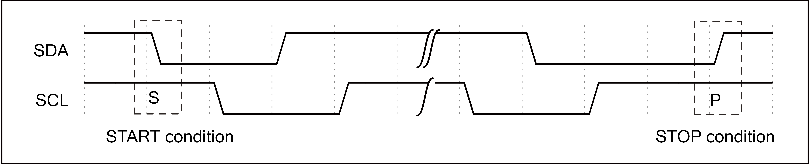

==========
I2C
==========

Introduction
===================
I2C (Inter-Intergrated Circuit) is a serial communication bus that uses a multi-master-slave architecture to connect low-speed peripheral devices.

Each device has a unique address identification and can be used as a transmitter or receiver. Each device connected to the bus can set the address by software with a unique address and the always-receiving master-slave relationship. The host can be used as a host transmitter or a host receiver.

If two or more hosts are initialized at the same time, data transmission can prevent data from being destroyed through collision detection and arbitration.

BL602 includes an I2C controller host, which can be flexibly configured with slaveAddr, subAddr, and data transmission to facilitate communication with slave devices. It provides 2 word depth fifo and provides interrupt functions. It can be used with DMA to improve efficiency and flexibly adjust clock frequency.

Main features
==================
- Support host mode
- Support multi-master mode and arbitration function
- Flexible clock frequency adjustment

Function description
=============================

.. table:: Pin lists

    +----------+--------------+---------------------------+
    |   Name   |   Type       |    Description            |
    +----------+--------------+---------------------------+
    | I2Cx_SCL | input/output | I2C serial clock signal   |
    +----------+--------------+---------------------------+
    | I2Cx_SDA | input/output | I2C serial data signal    |
    +----------+--------------+---------------------------+

Start and stop conditions
---------------------------
All transfers begin with a START condition and end with a STOP condition.

The start and stop conditions are generally generated by the master. The bus is considered to be in a busy state after the start condition, and is considered to be in an idle state for a period of time after the stop condition.

Start condition: SDA generates a high-to-low level transition when SCL is high;

Stop condition: SDA generates a low-to-high level transition when SCL is high.

The waveform diagram is as follows:

   I2C stop/start condition

Data transmission format
---------------------------------
The first 8 bits transmitted are the address byte, including the 7-bit slave address and the 1-bit direction bit. Data sent or received by the host is controlled by the eighth bit of the first byte sent by the host.

If it is 0, it means that the data is sent by the master; if it is 1, it means that the data is received by the master, and then the slave sends an acknowledge bit (ACK). After the data transmission is completed, the master sends a stop signal. The waveform is as follows:

.. figure:: picture/master_tx_rx.png
   :align: center

   Master transmission

**Timing of master transmission and slave reception**

.. figure:: picture/master_tx_slave_rx.png
   :align: center

   Master tx and slave rx

**Timing of master receive and slave send**

.. figure:: picture/master_rx_slave_tx.png
   :align: center

   Master rx and slave tx

Arbitration
-------------------
When there are multiple masters on the I2C bus, multiple masters may start transmitting at the same time. At this time, it is necessary to rely on the arbitration mechanism to determine which master has the right to complete the next data transfer. The remaining masters must give up control of the bus. The transmission cannot be started again until the bus is free.

During the transmission process, all hosts need to check whether SDA is consistent with the data they want to send when SCL is high. When the SDA level is different from expected, it means that other hosts are also transmitting at the same time. Hosts with different SDA levels will lose the arbitration and other hosts will complete the data transmission.

The waveform diagram of two hosts transmitting data and starting the arbitration mechanism at the same time is as follows:

.. figure:: picture/tx_rx_together.png
   :align: center

   Tx and Rx together

I2C clock setting
=====================

The I2C clock is derived from bclk (bus clock), which can be divided based on the bclk clock.

Register I2C_PRD_DATA can divide the clock of the data segment. The i2c module divides the data transmission into 4 phases. Each phase is controlled by a single byte in the register. The number of samples in each phase can be set. The 4 samples together determine the frequency division coefficient of the i2c clock. 

For example, bclk is 32M and the value of register I2C_PRD_DATA is 0x15151515 by default without configuration. Then the clock frequency of I2C is 32M / ((15 + 1) * 4) = 500K.

Similarly, the registers I2C_PRD_START and I2C_PRD_STOP also divide the clock of the start bit and stop bit respectively.

I2C configuration process
===============================

Configuration item
----------------------

 - Read and write flags
 - Slave address
 - Slave device address
 - Slave device address length
 - Data (when sending, configure the data to be sent; when receiving, store the received data)
 - Data length
 - Enable signal

Read and write flags
--------------------------

I2C supports two working states: sending and receiving. Register PKTDIR indicates the sending or receiving status. When it is set to 0, it indicates the sending state, and when it is set to 1, it indicates the receiving state.

Slave address
---------------

Each slave device connected to I2C will have a unique address. Usually the address length is 7 bits. The slave device address will be written into the register SLVADDR. I2C will automatically shift left by 1 bit before sending it from the device address. Transmit/receive direction bit on the low-order complement.

Slave device address
----------------------

Slave device register address indicates the register address that I2C needs to read and write to a certain register of the slave device. The slave device address will be written to the register I2C_SUB_ADDR, and the register I2C_CR_I2C_SUB_ADDR_EN needs to be set.

If the register SAEN is set to 0, the I2C master will skip the slave register address segment when transmitting.

Slave device address length
--------------------------------

The slave device address length is decremented by one and written to the register SABC.

Data
--------

The data part represents the data that needs to be sent to the slave device, or the data that needs to be received from the slave device.

When I2C sends data, the data needs to be written into the I2C FIFO in word units in turn, and the data is written to the register address I2C_FIFO_WDATA of the FIFO.

When the I2C receives data, it needs to read the data from the I2C FIFO in units of words in order, and the received data reads the register address I2C_FIFO_RDATA of the FIFO.

Data length
---------------

Decrement the data length by one and write to the register PKTLEN.

Enable signal
-----------------

After the above configurations are completed, write the enable signal register MEN to 1 to automatically start the I2C transmission process.

When the read-write flag is set to 0, I2C sends data, and the host sends the process:

1. Start bit

2. (1 bit left from device address + 0) + ACK

3. Slave device address + ACK

4. 1 byte data + ACK

5. 1 byte data + ACK

6. Stop bit

When the read / write flag is set to 1, I2C receives data and the host sends the process:

1. Start bit

2. (1 bit left from device address + 0) + ACK

3. Slave device address + ACK

4. Start bit

5. (1 bit left from device address + 1) + ACK

6. 1 byte data + ACK

7. 1 byte data + ACK

8. Stop bit

FIFO management
===================

The I2C FIFO depth is 2 words. I2C transmission and reception can be divided into RX FIFO and TX FIFO.

The register RFICNT indicates how much data (unit word) needs to be read in the RX FIFO.

The register TFICNT indicates how much space (in Word) is available for writing in the TX FIFO.

I2C FIFO status:

 - RX FIFO underflow: When the data in the RX FIFO has been read or is empty, continue to read data from the RX FIFO, the register RFIU will be set;

 - RX FIFO overflow: When I2C receives data until the 2 words of RX FIFO are filled. Without reading the RX FIFO, I2C receives the data again and the register RFIO will be set;

 - TX FIFO underflow: When the size of the data filled in the TX FIFO does not meet the configured I2C data length PKTLEN, and there is no new data to be filled into the TX FIFO, the register TFIU will be set;

 - TX FIFO overflow: After the two words of the TX FIFO are filled, before the data in the TX FIFO is sent out, fill the TX FIFO with data again. The register TFIO will be set.

Using DMA
============

I2C can use DMA to send and receive data. Set DTEN to 1 to enable the DMA transmission mode. After a channel is allocated for I2C, the DMA will transfer data from the memory area to the I2C_FIFO_WDATA register.

Set DREN to 1 to enable the DMA receive mode. After a channel is allocated for I2C, the DMA will transfer the data in the I2C_FIFO_RDATA register to the memory area.

When the I2C module is used with DMA, the data part will be automatically carried by the DMA. There is no need for the CPU to write data to the I2C TX FIFO or read data from the I2C RX FIFO.

DMA transmission process
----------------------------

1. Configure the read and write flags to 0

2. Configure the slave device address

3. Configure Slave Device Address

4. Configure slave device address length

5. Data length

6. Set the enable signal register

7. Configure DMA transfer size

8. Configure DMA source address transfer width

9. Configure the DMA destination address transfer width (Note that when I2C is used with DMA, the destination address transfer width needs to be set to 32bits and used in word alignment)

10. Configure the DMA source address as the memory address to store the transmitted data

11. Configure the DMA destination address as I2C TX FIFO address, I2C_FIFO_WDATA

12. Enable DMA

DMA receiving process
--------------------------

1. Configure the read and write flags to 1

2. Configure the slave device address

3. Configure Slave Device Address

4. Configure slave device address length

5. Data length

6. Set the enable signal register

7. Configure DMA transfer size

8. Configure the DMA source address transfer width (Note that when I2C is used with DMA, the source address transfer width needs to be set to 32bits and used in word alignment)

9. Configure DMA destination address transfer width

10. Configure the DMA source address as I2C RX FIFO address, I2C_FIFO_RDATA

11. Configure the DMA destination address as the memory address to store the received data

12. Enable DMA

Interrupt
============

I2C includes the following interrupts:

 - I2C_TRANS_END_INT: I2C transfer end interrupt
 - I2C_TX_FIFO_READY_INT: Interrupt is triggered when I2C TX FIFO has free space available for filling
 - I2C_RX_FIFO_READY_INT: When I2C RX FIFO receives data, trigger interrupt
 - I2C_NACK_RECV_INT: When the I2C module detects a NACK state, an interrupt is triggered
 - I2C_ARB_LOST_INT: I2C arbitration lost interrupt
 - I2C_FIFO_ERR_INT: I2C FIFO ERROR interrupt

Register description
==========================

+----------------------+----------------------------------+
| Name                 | Description                      |
+----------------------+----------------------------------+
| `i2c_config`_        | I2C configuration register       |
+----------------------+----------------------------------+
| `i2c_int_sts`_       | I2C interrupt status             |
+----------------------+----------------------------------+
| `i2c_sub_addr`_      | I2C sub-address configuration    |
+----------------------+----------------------------------+
| `i2c_bus_busy`_      | I2C bus busy control register    |
+----------------------+----------------------------------+
| `i2c_prd_start`_     | I2C length of start phase        |
+----------------------+----------------------------------+
| `i2c_prd_stop`_      | I2C length of stop phase         |
+----------------------+----------------------------------+
| `i2c_prd_data`_      | I2C length of data phase         |
+----------------------+----------------------------------+
| `i2c_fifo_config_0`_ | I2C FIFO configuration register0 |
+----------------------+----------------------------------+
| `i2c_fifo_config_1`_ | I2C FIFO configuration register1 |
+----------------------+----------------------------------+
| `i2c_fifo_wdata`_    | I2C FIFO write data              |
+----------------------+----------------------------------+
| `i2c_fifo_rdata`_    | I2C FIFO read data               |
+----------------------+----------------------------------+

i2c_config
------------
 
**Address：**  0x4000a300
 

+-----------+-----------+-----------+-----------+-----------+-----------+-----------+-----------+-----------+-----------+-----------+-----------+-----------+-----------+-----------+-----------+ 
| 31        | 30        | 29        | 28        | 27        | 26        | 25        | 24        | 23        | 22        | 21        | 20        | 19        | 18        | 17        | 16        | 
+-----------+-----------+-----------+-----------+-----------+-----------+-----------+-----------+-----------+-----------+-----------+-----------+-----------+-----------+-----------+-----------+ 
| DEGCNT                                        | RSVD                                          | PKTLEN                                                                                        |
+-----------+-----------+-----------+-----------+-----------+-----------+-----------+-----------+-----------+-----------+-----------+-----------+-----------+-----------+-----------+-----------+ 
| 15        | 14        | 13        | 12        | 11        | 10        | 9         | 8         | 7         | 6         | 5         | 4         | 3         | 2         | 1         | 0         |
+-----------+-----------+-----------+-----------+-----------+-----------+-----------+-----------+-----------+-----------+-----------+-----------+-----------+-----------+-----------+-----------+ 
| RSVD      | SLVADDR                                                                           | RSVD      | SABC                  | SAEN      | SCLSEN    | DEGEN     | PKTDIR    | MEN       |
+-----------+-----------+-----------+-----------+-----------+-----------+-----------+-----------+-----------+-----------+-----------+-----------+-----------+-----------+-----------+-----------+ 

+----------+----------+--------+-------------+----------------------------------------------------------------------------------------------------------------------------------------------+
| Bit      | Name     |Type    | Reset       | Description                                                                                                                                  |
+----------+----------+--------+-------------+----------------------------------------------------------------------------------------------------------------------------------------------+
| 31:28    | DEGCNT   | R/W    | 4'D0        | De-glitch function cycle count                                                                                                               |
+----------+----------+--------+-------------+----------------------------------------------------------------------------------------------------------------------------------------------+
| 27:24    | RSVD     |        |             |                                                                                                                                              |
+----------+----------+--------+-------------+----------------------------------------------------------------------------------------------------------------------------------------------+
| 23:16    | PKTLEN   | R/W    | 8'D0        | Packet length (unit: byte)                                                                                                                   |
+----------+----------+--------+-------------+----------------------------------------------------------------------------------------------------------------------------------------------+
| 15       | RSVD     |        |             |                                                                                                                                              |
+----------+----------+--------+-------------+----------------------------------------------------------------------------------------------------------------------------------------------+
| 14:8     | SLVADDR  | R/W    | 7'D0        | Slave address for I2C transaction (target address)                                                                                           |
+----------+----------+--------+-------------+----------------------------------------------------------------------------------------------------------------------------------------------+
| 7        | RSVD     |        |             |                                                                                                                                              |
+----------+----------+--------+-------------+----------------------------------------------------------------------------------------------------------------------------------------------+
| 6:5      | SABC     | R/W    | 2'D0        | Sub-address field byte count                                                                                                                 |
+          +          +        +             +                                                                                                                                              +
|          |          |        |             | 2'd0: 1-byte, 2'd1: 2-byte, 2'd2: 3-byte, 2'd3: 4-byte                                                                                       |
+----------+----------+--------+-------------+----------------------------------------------------------------------------------------------------------------------------------------------+
| 4        | SAEN     | R/W    | 1'B0        | Enable signal of I2C sub-address field                                                                                                       |
+----------+----------+--------+-------------+----------------------------------------------------------------------------------------------------------------------------------------------+
| 3        | SCLSEN   | R/W    | 1'B1        | Enable signal of I2C SCL synchronization, should be enabled to support Multi-Master and Clock-Stretching                                     |
+          +          +        +             +                                                                                                                                              +
|          |          |        |             | (Normally should not be turned-off)                                                                                                          |
+----------+----------+--------+-------------+----------------------------------------------------------------------------------------------------------------------------------------------+
| 2        | DEGEN    | R/W    | 1'B0        | Enable signal of I2C input de-glitch function (for all input pins)                                                                           |
+----------+----------+--------+-------------+----------------------------------------------------------------------------------------------------------------------------------------------+
| 1        | PKTDIR   | R/W    | 1'B1        | Transfer direction of the packet                                                                                                             |
+          +          +        +             +                                                                                                                                              +
|          |          |        |             | 1'b0: Write; 1'b1: Read                                                                                                                      |
+----------+----------+--------+-------------+----------------------------------------------------------------------------------------------------------------------------------------------+
| 0        | MEN      | R/W    | 1'B0        | Enable signal of I2C Master function                                                                                                         |
+          +          +        +             +                                                                                                                                              +
|          |          |        |             | Asserting this bit will trigger the transaction, and should be de-asserted after finish                                                      |
+----------+----------+--------+-------------+----------------------------------------------------------------------------------------------------------------------------------------------+

i2c_int_sts
-------------
 
**Address：**  0x4000a304
 

+-----------+-----------+-----------+-----------+-----------+-----------+-----------+-----------+-----------+-----------+-----------+-----------+-----------+-----------+-----------+-----------+ 
| 31        | 30        | 29        | 28        | 27        | 26        | 25        | 24        | 23        | 22        | 21        | 20        | 19        | 18        | 17        | 16        | 
+-----------+-----------+-----------+-----------+-----------+-----------+-----------+-----------+-----------+-----------+-----------+-----------+-----------+-----------+-----------+-----------+ 
| RSVD                  | FEREN     | ARBEN     | NAKEN     | RXFEN     | TXFEN     | ENDEN     | RSVD                              | ARBCLR    | NAKCLR    | RSVD                  | ENDCLR    |
+-----------+-----------+-----------+-----------+-----------+-----------+-----------+-----------+-----------+-----------+-----------+-----------+-----------+-----------+-----------+-----------+ 
| 15        | 14        | 13        | 12        | 11        | 10        | 9         | 8         | 7         | 6         | 5         | 4         | 3         | 2         | 1         | 0         |
+-----------+-----------+-----------+-----------+-----------+-----------+-----------+-----------+-----------+-----------+-----------+-----------+-----------+-----------+-----------+-----------+ 
| RSVD                  | FERMASK   | ARBMASK   | NAKMASK   | RXFMASK   | TXFMASK   | ENDMASK   | RSVD                  | FERINT    | ARBINT    | NAKINT    | RXFINT    | TXFINT    | ENDINT    |
+-----------+-----------+-----------+-----------+-----------+-----------+-----------+-----------+-----------+-----------+-----------+-----------+-----------+-----------+-----------+-----------+ 

+----------+----------+--------+-------------+-------------------------------------------------------------------------------------------------+
| Bit      | Name     |Type    | Reset       | Description                                                                                     |
+----------+----------+--------+-------------+-------------------------------------------------------------------------------------------------+
| 31:30    | RSVD     |        |             |                                                                                                 |
+----------+----------+--------+-------------+-------------------------------------------------------------------------------------------------+
| 29       | FEREN    | R/W    | 1'B1        | Interrupt enable of i2c_fer_int                                                                 |
+----------+----------+--------+-------------+-------------------------------------------------------------------------------------------------+
| 28       | ARBEN    | R/W    | 1'B1        | Interrupt enable of i2c_arb_int                                                                 |
+----------+----------+--------+-------------+-------------------------------------------------------------------------------------------------+
| 27       | NAKEN    | R/W    | 1'B1        | Interrupt enable of i2c_nak_int                                                                 |
+----------+----------+--------+-------------+-------------------------------------------------------------------------------------------------+
| 26       | RXFEN    | R/W    | 1'B1        | Interrupt enable of i2c_rxf_int                                                                 |
+----------+----------+--------+-------------+-------------------------------------------------------------------------------------------------+
| 25       | TXFEN    | R/W    | 1'B1        | Interrupt enable of i2c_txf_int                                                                 |
+----------+----------+--------+-------------+-------------------------------------------------------------------------------------------------+
| 24       | ENDEN    | R/W    | 1'B1        | Interrupt enable of i2c_end_int                                                                 |
+----------+----------+--------+-------------+-------------------------------------------------------------------------------------------------+
| 23:21    | RSVD     |        |             |                                                                                                 |
+----------+----------+--------+-------------+-------------------------------------------------------------------------------------------------+
| 20       | ARBCLR   | W1C    | 1'B0        | Interrupt clear of i2c_arb_int                                                                  |
+----------+----------+--------+-------------+-------------------------------------------------------------------------------------------------+
| 19       | NAKCLR   | W1C    | 1'B0        | Interrupt clear of i2c_nak_int                                                                  |
+----------+----------+--------+-------------+-------------------------------------------------------------------------------------------------+
| 18:17    | RSVD     |        |             |                                                                                                 |
+----------+----------+--------+-------------+-------------------------------------------------------------------------------------------------+
| 16       | ENDCLR   | W1C    | 1'B0        | Interrupt clear of i2c_end_int                                                                  |
+----------+----------+--------+-------------+-------------------------------------------------------------------------------------------------+
| 15:14    | RSVD     |        |             |                                                                                                 |
+----------+----------+--------+-------------+-------------------------------------------------------------------------------------------------+
| 13       | FERMASK  | R/W    | 1'B1        | Interrupt mask of i2c_fer_int                                                                   |
+----------+----------+--------+-------------+-------------------------------------------------------------------------------------------------+
| 12       | ARBMASK  | R/W    | 1'B1        | Interrupt mask of i2c_arb_int                                                                   |
+----------+----------+--------+-------------+-------------------------------------------------------------------------------------------------+
| 11       | NAKMASK  | R/W    | 1'B1        | Interrupt mask of i2c_nak_int                                                                   |
+----------+----------+--------+-------------+-------------------------------------------------------------------------------------------------+
| 10       | RXFMASK  | R/W    | 1'B1        | Interrupt mask of i2c_rxf_int                                                                   |
+----------+----------+--------+-------------+-------------------------------------------------------------------------------------------------+
| 9        | TXFMASK  | R/W    | 1'B1        | Interrupt mask of i2c_txf_int                                                                   |
+----------+----------+--------+-------------+-------------------------------------------------------------------------------------------------+
| 8        | ENDMASK  | R/W    | 1'B1        | Interrupt mask of i2c_end_int                                                                   |
+----------+----------+--------+-------------+-------------------------------------------------------------------------------------------------+
| 7:6      | RSVD     |        |             |                                                                                                 |
+----------+----------+--------+-------------+-------------------------------------------------------------------------------------------------+
| 5        | FERINT   | R      | 1'B0        | I2C TX/RX FIFO error interrupt, auto-cleared when FIFO overflow/underflow error flag is cleared |
+----------+----------+--------+-------------+-------------------------------------------------------------------------------------------------+
| 4        | ARBINT   | R      | 1'B0        | I2C arbitration lost interrupt                                                                  |
+----------+----------+--------+-------------+-------------------------------------------------------------------------------------------------+
| 3        | NAKINT   | R      | 1'B0        | I2C NACK-received interrupt                                                                     |
+----------+----------+--------+-------------+-------------------------------------------------------------------------------------------------+
| 2        | RXFINT   | R      | 1'B0        | I2C RX FIFO ready (rx_fifo_cnt > rx_fifo_th) interrupt, auto-cleared when data is popped        |
+----------+----------+--------+-------------+-------------------------------------------------------------------------------------------------+
| 1        | TXFINT   | R      | 1'B0        | I2C TX FIFO ready (tx_fifo_cnt > tx_fifo_th) interrupt, auto-cleared when data is pushed        |
+----------+----------+--------+-------------+-------------------------------------------------------------------------------------------------+
| 0        | ENDINT   | R      | 1'B0        | I2C transfer end interrupt                                                                      |
+----------+----------+--------+-------------+-------------------------------------------------------------------------------------------------+

i2c_sub_addr
--------------
 
**Address：**  0x4000a308
 

+-----------+-----------+-----------+-----------+-----------+-----------+-----------+-----------+-----------+-----------+-----------+-----------+-----------+-----------+-----------+-----------+ 
| 31        | 30        | 29        | 28        | 27        | 26        | 25        | 24        | 23        | 22        | 21        | 20        | 19        | 18        | 17        | 16        | 
+-----------+-----------+-----------+-----------+-----------+-----------+-----------+-----------+-----------+-----------+-----------+-----------+-----------+-----------+-----------+-----------+ 
| SUBAB3                                                                                        | SUBAB2                                                                                        |
+-----------+-----------+-----------+-----------+-----------+-----------+-----------+-----------+-----------+-----------+-----------+-----------+-----------+-----------+-----------+-----------+ 
| 15        | 14        | 13        | 12        | 11        | 10        | 9         | 8         | 7         | 6         | 5         | 4         | 3         | 2         | 1         | 0         |
+-----------+-----------+-----------+-----------+-----------+-----------+-----------+-----------+-----------+-----------+-----------+-----------+-----------+-----------+-----------+-----------+ 
| SUBAB1                                                                                        | SUBAB0                                                                                        |
+-----------+-----------+-----------+-----------+-----------+-----------+-----------+-----------+-----------+-----------+-----------+-----------+-----------+-----------+-----------+-----------+ 

+----------+----------+--------+-------------+---------------------------------------------------------------------+
| Bit      | Name     |Type    | Reset       | Description                                                         |
+----------+----------+--------+-------------+---------------------------------------------------------------------+
| 31:24    | SUBAB3   | R/W    | 8'D0        | I2C sub-address field - byte[3]                                     |
+----------+----------+--------+-------------+---------------------------------------------------------------------+
| 23:16    | SUBAB2   | R/W    | 8'D0        | I2C sub-address field - byte[2]                                     |
+----------+----------+--------+-------------+---------------------------------------------------------------------+
| 15:8     | SUBAB1   | R/W    | 8'D0        | I2C sub-address field - byte[1]                                     |
+----------+----------+--------+-------------+---------------------------------------------------------------------+
| 7:0      | SUBAB0   | R/W    | 8'D0        | I2C sub-address field - byte[0] (sub-address starts from this byte) |
+----------+----------+--------+-------------+---------------------------------------------------------------------+

i2c_bus_busy
--------------
 
**Address：**  0x4000a30c
 

+-----------+-----------+-----------+-----------+-----------+-----------+-----------+-----------+-----------+-----------+-----------+-----------+-----------+-----------+-----------+-----------+ 
| 31        | 30        | 29        | 28        | 27        | 26        | 25        | 24        | 23        | 22        | 21        | 20        | 19        | 18        | 17        | 16        | 
+-----------+-----------+-----------+-----------+-----------+-----------+-----------+-----------+-----------+-----------+-----------+-----------+-----------+-----------+-----------+-----------+ 
| RSVD                                                                                                                                                                                          |
+-----------+-----------+-----------+-----------+-----------+-----------+-----------+-----------+-----------+-----------+-----------+-----------+-----------+-----------+-----------+-----------+ 
| 15        | 14        | 13        | 12        | 11        | 10        | 9         | 8         | 7         | 6         | 5         | 4         | 3         | 2         | 1         | 0         |
+-----------+-----------+-----------+-----------+-----------+-----------+-----------+-----------+-----------+-----------+-----------+-----------+-----------+-----------+-----------+-----------+ 
| RSVD                                                                                                                                                                  | BUSYCLR   | BUSY      |
+-----------+-----------+-----------+-----------+-----------+-----------+-----------+-----------+-----------+-----------+-----------+-----------+-----------+-----------+-----------+-----------+ 

+----------+----------+--------+-------------+-------------------------------------------------------------------------------+
| Bit      | Name     |Type    | Reset       | Description                                                                   |
+----------+----------+--------+-------------+-------------------------------------------------------------------------------+
| 31:2     | RSVD     |        |             |                                                                               |
+----------+----------+--------+-------------+-------------------------------------------------------------------------------+
| 1        | BUSYCLR  | W1C    | 1'B0        | Clear signal of bus_busy status, not for normal usage (in case I2C bus hangs) |
+----------+----------+--------+-------------+-------------------------------------------------------------------------------+
| 0        | BUSY     | R      | 1'B0        | Indicator of I2C bus busy                                                     |
+----------+----------+--------+-------------+-------------------------------------------------------------------------------+

i2c_prd_start
---------------
 
**Address：**  0x4000a310
 

+-----------+-----------+-----------+-----------+-----------+-----------+-----------+-----------+-----------+-----------+-----------+-----------+-----------+-----------+-----------+-----------+ 
| 31        | 30        | 29        | 28        | 27        | 26        | 25        | 24        | 23        | 22        | 21        | 20        | 19        | 18        | 17        | 16        | 
+-----------+-----------+-----------+-----------+-----------+-----------+-----------+-----------+-----------+-----------+-----------+-----------+-----------+-----------+-----------+-----------+ 
| PRDSPH3                                                                                       | PRDSPH2                                                                                       |
+-----------+-----------+-----------+-----------+-----------+-----------+-----------+-----------+-----------+-----------+-----------+-----------+-----------+-----------+-----------+-----------+ 
| 15        | 14        | 13        | 12        | 11        | 10        | 9         | 8         | 7         | 6         | 5         | 4         | 3         | 2         | 1         | 0         |
+-----------+-----------+-----------+-----------+-----------+-----------+-----------+-----------+-----------+-----------+-----------+-----------+-----------+-----------+-----------+-----------+ 
| PRDSPH1                                                                                       | PRDSPH0                                                                                       |
+-----------+-----------+-----------+-----------+-----------+-----------+-----------+-----------+-----------+-----------+-----------+-----------+-----------+-----------+-----------+-----------+ 

+----------+----------+--------+-------------+-----------------------------------+
| Bit      | Name     |Type    | Reset       | Description                       |
+----------+----------+--------+-------------+-----------------------------------+
| 31:24    | PRDSPH3  | R/W    | 8'D15       | Length of START condition phase 3 |
+----------+----------+--------+-------------+-----------------------------------+
| 23:16    | PRDSPH2  | R/W    | 8'D15       | Length of START condition phase 2 |
+----------+----------+--------+-------------+-----------------------------------+
| 15:8     | PRDSPH1  | R/W    | 8'D15       | Length of START condition phase 1 |
+----------+----------+--------+-------------+-----------------------------------+
| 7:0      | PRDSPH0  | R/W    | 8'D15       | Length of START condition phase 0 |
+----------+----------+--------+-------------+-----------------------------------+

i2c_prd_stop
--------------
 
**Address：**  0x4000a314
 

+-----------+-----------+-----------+-----------+-----------+-----------+-----------+-----------+-----------+-----------+-----------+-----------+-----------+-----------+-----------+-----------+ 
| 31        | 30        | 29        | 28        | 27        | 26        | 25        | 24        | 23        | 22        | 21        | 20        | 19        | 18        | 17        | 16        | 
+-----------+-----------+-----------+-----------+-----------+-----------+-----------+-----------+-----------+-----------+-----------+-----------+-----------+-----------+-----------+-----------+ 
| PRDPPH3                                                                                       | PRDPPH2                                                                                       |
+-----------+-----------+-----------+-----------+-----------+-----------+-----------+-----------+-----------+-----------+-----------+-----------+-----------+-----------+-----------+-----------+ 
| 15        | 14        | 13        | 12        | 11        | 10        | 9         | 8         | 7         | 6         | 5         | 4         | 3         | 2         | 1         | 0         |
+-----------+-----------+-----------+-----------+-----------+-----------+-----------+-----------+-----------+-----------+-----------+-----------+-----------+-----------+-----------+-----------+ 
| PRDPPH1                                                                                       | PRDPPH0                                                                                       |
+-----------+-----------+-----------+-----------+-----------+-----------+-----------+-----------+-----------+-----------+-----------+-----------+-----------+-----------+-----------+-----------+ 

+----------+----------+--------+-------------+----------------------------------+
| Bit      | Name     |Type    | Reset       | Description                      |
+----------+----------+--------+-------------+----------------------------------+
| 31:24    | PRDPPH3  | R/W    | 8'D15       | Length of STOP condition phase 3 |
+----------+----------+--------+-------------+----------------------------------+
| 23:16    | PRDPPH2  | R/W    | 8'D15       | Length of STOP condition phase 2 |
+----------+----------+--------+-------------+----------------------------------+
| 15:8     | PRDPPH1  | R/W    | 8'D15       | Length of STOP condition phase 1 |
+----------+----------+--------+-------------+----------------------------------+
| 7:0      | PRDPPH0  | R/W    | 8'D15       | Length of STOP condition phase 0 |
+----------+----------+--------+-------------+----------------------------------+

i2c_prd_data
--------------
 
**Address：**  0x4000a318
 

+-----------+-----------+-----------+-----------+-----------+-----------+-----------+-----------+-----------+-----------+-----------+-----------+-----------+-----------+-----------+-----------+ 
| 31        | 30        | 29        | 28        | 27        | 26        | 25        | 24        | 23        | 22        | 21        | 20        | 19        | 18        | 17        | 16        | 
+-----------+-----------+-----------+-----------+-----------+-----------+-----------+-----------+-----------+-----------+-----------+-----------+-----------+-----------+-----------+-----------+ 
| PRDDPH3                                                                                       | PRDDPH2                                                                                       |
+-----------+-----------+-----------+-----------+-----------+-----------+-----------+-----------+-----------+-----------+-----------+-----------+-----------+-----------+-----------+-----------+ 
| 15        | 14        | 13        | 12        | 11        | 10        | 9         | 8         | 7         | 6         | 5         | 4         | 3         | 2         | 1         | 0         |
+-----------+-----------+-----------+-----------+-----------+-----------+-----------+-----------+-----------+-----------+-----------+-----------+-----------+-----------+-----------+-----------+ 
| PRDDPH1                                                                                       | PRDDPH0                                                                                       |
+-----------+-----------+-----------+-----------+-----------+-----------+-----------+-----------+-----------+-----------+-----------+-----------+-----------+-----------+-----------+-----------+ 

+----------+----------+--------+-------------+------------------------------------------------------------------------------------------------------------------------------------------+
| Bit      | Name     |Type    | Reset       | Description                                                                                                                              |
+----------+----------+--------+-------------+------------------------------------------------------------------------------------------------------------------------------------------+
| 31:24    | PRDDPH3  | R/W    | 8'D15       | Length of DATA phase 3                                                                                                                   |
+----------+----------+--------+-------------+------------------------------------------------------------------------------------------------------------------------------------------+
| 23:16    | PRDDPH2  | R/W    | 8'D15       | Length of DATA phase 2                                                                                                                   |
+----------+----------+--------+-------------+------------------------------------------------------------------------------------------------------------------------------------------+
| 15:8     | PRDDPH1  | R/W    | 8'D15       | Length of DATA phase 1                                                                                                                   |
+          +          +        +             +                                                                                                                                          +
|          |          |        |             | Note: This value should not be set to 8'd0, adjust source clock rate instead if higher I2C clock rate is required                        |
+----------+----------+--------+-------------+------------------------------------------------------------------------------------------------------------------------------------------+
| 7:0      | PRDDPH0  | R/W    | 8'D15       | Length of DATA phase 0                                                                                                                   |
+----------+----------+--------+-------------+------------------------------------------------------------------------------------------------------------------------------------------+

i2c_fifo_config_0
-------------------
 
**Address：**  0x4000a380
 

+-----------+-----------+-----------+-----------+-----------+-----------+-----------+-----------+-----------+-----------+-----------+-----------+-----------+-----------+-----------+-----------+ 
| 31        | 30        | 29        | 28        | 27        | 26        | 25        | 24        | 23        | 22        | 21        | 20        | 19        | 18        | 17        | 16        | 
+-----------+-----------+-----------+-----------+-----------+-----------+-----------+-----------+-----------+-----------+-----------+-----------+-----------+-----------+-----------+-----------+ 
| RSVD                                                                                                                                                                                          |
+-----------+-----------+-----------+-----------+-----------+-----------+-----------+-----------+-----------+-----------+-----------+-----------+-----------+-----------+-----------+-----------+ 
| 15        | 14        | 13        | 12        | 11        | 10        | 9         | 8         | 7         | 6         | 5         | 4         | 3         | 2         | 1         | 0         |
+-----------+-----------+-----------+-----------+-----------+-----------+-----------+-----------+-----------+-----------+-----------+-----------+-----------+-----------+-----------+-----------+ 
| RSVD                                                                                          | RFIU      | RFIO      | TFIU      | TFIO      | RFICLR    | TFICLR    | DREN      | DTEN      |
+-----------+-----------+-----------+-----------+-----------+-----------+-----------+-----------+-----------+-----------+-----------+-----------+-----------+-----------+-----------+-----------+ 

+----------+----------+--------+-------------+----------------------------------------------------------+
| Bit      | Name     |Type    | Reset       | Description                                              |
+----------+----------+--------+-------------+----------------------------------------------------------+
| 31:8     | RSVD     |        |             |                                                          |
+----------+----------+--------+-------------+----------------------------------------------------------+
| 7        | RFIU     | R      | 1'B0        | Underflow flag of RX FIFO, can be cleared by rx_fifo_clr |
+----------+----------+--------+-------------+----------------------------------------------------------+
| 6        | RFIO     | R      | 1'B0        | Overflow flag of RX FIFO, can be cleared by rx_fifo_clr  |
+----------+----------+--------+-------------+----------------------------------------------------------+
| 5        | TFIU     | R      | 1'B0        | Underflow flag of TX FIFO, can be cleared by tx_fifo_clr |
+----------+----------+--------+-------------+----------------------------------------------------------+
| 4        | TFIO     | R      | 1'B0        | Overflow flag of TX FIFO, can be cleared by tx_fifo_clr  |
+----------+----------+--------+-------------+----------------------------------------------------------+
| 3        | RFICLR   | W1C    | 1'B0        | Clear signal of RX FIFO                                  |
+----------+----------+--------+-------------+----------------------------------------------------------+
| 2        | TFICLR   | W1C    | 1'B0        | Clear signal of TX FIFO                                  |
+----------+----------+--------+-------------+----------------------------------------------------------+
| 1        | DREN     | R/W    | 1'B0        | Enable signal of dma_rx_req/ack interface                |
+----------+----------+--------+-------------+----------------------------------------------------------+
| 0        | DTEN     | R/W    | 1'B0        | Enable signal of dma_tx_req/ack interface                |
+----------+----------+--------+-------------+----------------------------------------------------------+

i2c_fifo_config_1
-------------------
 
**Address：**  0x4000a384
 

+-----------+-----------+-----------+-----------+-----------+-----------+-----------+-----------+-----------+-----------+-----------+-----------+-----------+-----------+-----------+-----------+ 
| 31        | 30        | 29        | 28        | 27        | 26        | 25        | 24        | 23        | 22        | 21        | 20        | 19        | 18        | 17        | 16        | 
+-----------+-----------+-----------+-----------+-----------+-----------+-----------+-----------+-----------+-----------+-----------+-----------+-----------+-----------+-----------+-----------+ 
| RSVD                                                                              | RFITH     | RSVD                                                                              | TFITH     |
+-----------+-----------+-----------+-----------+-----------+-----------+-----------+-----------+-----------+-----------+-----------+-----------+-----------+-----------+-----------+-----------+ 
| 15        | 14        | 13        | 12        | 11        | 10        | 9         | 8         | 7         | 6         | 5         | 4         | 3         | 2         | 1         | 0         |
+-----------+-----------+-----------+-----------+-----------+-----------+-----------+-----------+-----------+-----------+-----------+-----------+-----------+-----------+-----------+-----------+ 
| RSVD                                                                  | RFICNT                | RSVD                                                                  | TFICNT                |
+-----------+-----------+-----------+-----------+-----------+-----------+-----------+-----------+-----------+-----------+-----------+-----------+-----------+-----------+-----------+-----------+ 

+----------+----------+--------+-------------+-------------------------------------------------------------------------------------------+
| Bit      | Name     |Type    | Reset       | Description                                                                               |
+----------+----------+--------+-------------+-------------------------------------------------------------------------------------------+
| 31:25    | RSVD     |        |             |                                                                                           |
+----------+----------+--------+-------------+-------------------------------------------------------------------------------------------+
| 24       | RFITH    | R/W    | 1'D0        | RX FIFO threshold, dma_rx_req will not be asserted if tx_fifo_cnt is less than this value |
+----------+----------+--------+-------------+-------------------------------------------------------------------------------------------+
| 23:17    | RSVD     |        |             |                                                                                           |
+----------+----------+--------+-------------+-------------------------------------------------------------------------------------------+
| 16       | TFITH    | R/W    | 1'D0        | TX FIFO threshold, dma_tx_req will not be asserted if tx_fifo_cnt is less than this value |
+----------+----------+--------+-------------+-------------------------------------------------------------------------------------------+
| 15:10    | RSVD     |        |             |                                                                                           |
+----------+----------+--------+-------------+-------------------------------------------------------------------------------------------+
| 9:8      | RFICNT   | R      | 2'D0        | RX FIFO available count                                                                   |
+----------+----------+--------+-------------+-------------------------------------------------------------------------------------------+
| 7:2      | RSVD     |        |             |                                                                                           |
+----------+----------+--------+-------------+-------------------------------------------------------------------------------------------+
| 1:0      | TFICNT   | R      | 2'D2        | TX FIFO available count                                                                   |
+----------+----------+--------+-------------+-------------------------------------------------------------------------------------------+

i2c_fifo_wdata
----------------
 
**Address：**  0x4000a388
 

+-----------+-----------+-----------+-----------+-----------+-----------+-----------+-----------+-----------+-----------+-----------+-----------+-----------+-----------+-----------+-----------+ 
| 31        | 30        | 29        | 28        | 27        | 26        | 25        | 24        | 23        | 22        | 21        | 20        | 19        | 18        | 17        | 16        | 
+-----------+-----------+-----------+-----------+-----------+-----------+-----------+-----------+-----------+-----------+-----------+-----------+-----------+-----------+-----------+-----------+ 
| FIWD                                                                                                                                                                                          |
+-----------+-----------+-----------+-----------+-----------+-----------+-----------+-----------+-----------+-----------+-----------+-----------+-----------+-----------+-----------+-----------+ 
| 15        | 14        | 13        | 12        | 11        | 10        | 9         | 8         | 7         | 6         | 5         | 4         | 3         | 2         | 1         | 0         |
+-----------+-----------+-----------+-----------+-----------+-----------+-----------+-----------+-----------+-----------+-----------+-----------+-----------+-----------+-----------+-----------+ 
| FIWD                                                                                                                                                                                          |
+-----------+-----------+-----------+-----------+-----------+-----------+-----------+-----------+-----------+-----------+-----------+-----------+-----------+-----------+-----------+-----------+ 

+----------+----------+--------+-------------+---------------------+
| Bit      | Name     |Type    | Reset       | Description         |
+----------+----------+--------+-------------+---------------------+
| 31:0     | FIWD     | W      | X           | I2C FIFO write data |
+----------+----------+--------+-------------+---------------------+

i2c_fifo_rdata
----------------
 
**Address：**  0x4000a38c
 

+-----------+-----------+-----------+-----------+-----------+-----------+-----------+-----------+-----------+-----------+-----------+-----------+-----------+-----------+-----------+-----------+ 
| 31        | 30        | 29        | 28        | 27        | 26        | 25        | 24        | 23        | 22        | 21        | 20        | 19        | 18        | 17        | 16        | 
+-----------+-----------+-----------+-----------+-----------+-----------+-----------+-----------+-----------+-----------+-----------+-----------+-----------+-----------+-----------+-----------+ 
| FIRD                                                                                                                                                                                          |
+-----------+-----------+-----------+-----------+-----------+-----------+-----------+-----------+-----------+-----------+-----------+-----------+-----------+-----------+-----------+-----------+ 
| 15        | 14        | 13        | 12        | 11        | 10        | 9         | 8         | 7         | 6         | 5         | 4         | 3         | 2         | 1         | 0         |
+-----------+-----------+-----------+-----------+-----------+-----------+-----------+-----------+-----------+-----------+-----------+-----------+-----------+-----------+-----------+-----------+ 
| FIRD                                                                                                                                                                                          |
+-----------+-----------+-----------+-----------+-----------+-----------+-----------+-----------+-----------+-----------+-----------+-----------+-----------+-----------+-----------+-----------+ 

+----------+----------+--------+-------------+--------------------+
| Bit      | Name     |Type    | Reset       | Description        |
+----------+----------+--------+-------------+--------------------+
| 31:0     | FIRD     | R      | 32'H0       | I2C FIFO read data |
+----------+----------+--------+-------------+--------------------+

