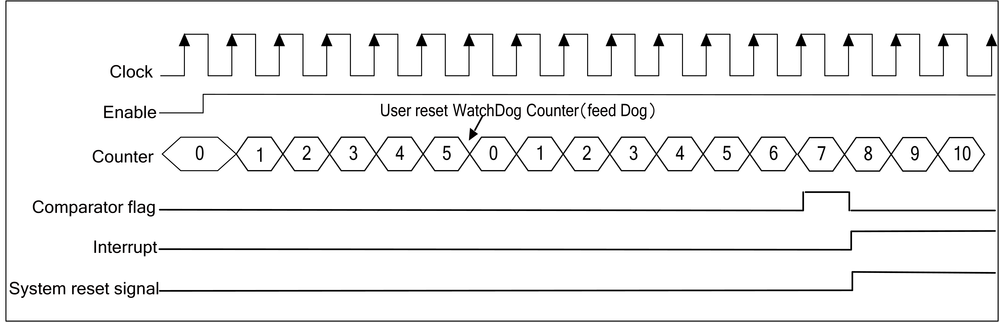
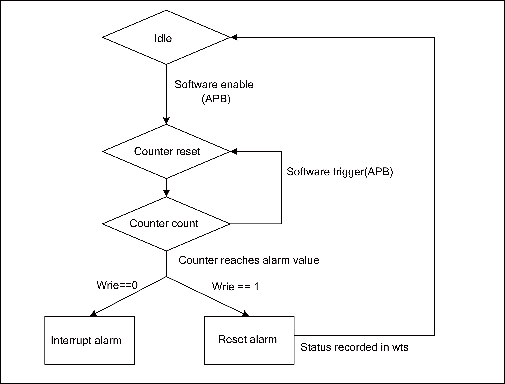

==========
TIMER
==========

Introduction
================
The chip has two 32-bit counters, each of which can independently control and configure its parameters and clock frequency.

There is a watchdog counter in the chip. Unpredictable software or hardware behavior may cause the application to malfunction. A watchdog timer can help the system recover from it. If the current time exceeds the predetermined time, but the dog is not fed or closed Timer, which can trigger interrupt or system reset according to the setting.

.. figure:: picture/timer_block.png
   :align: center

   Timer block diagram

.. figure:: picture/watchdog_block.png
   :align: center

   Watchdog timer block diagram

Main features
=====================
- Multiple clock source options
- 8-bit clock divider with a division factor of 1-256.
- Two 32-bit timers
- Each timer contains three alarm value settings, which can be set independently to alarm when each alarm value overflows
- Support Free Run mode and Pre_load mode
- 16-bit watchdog timer
- Supports write password protection to prevent system abnormalities caused by incorrect settings
- Support two watchdog overflow methods: interrupt or reset

Function description
========================

8-bit divider
----------------
There are three types of Watchdog timer clocks:

- Fclk--System master clock

- 32K--32K clock

- Xtal--External crystal

There are four timer clock sources:

- Fclk--System master clock

- 32K--32K clock

- 1K--1K clock (32K frequency division)

- Xtal--External crystal

Each counter has its own 8-bit frequency divider. The selected clock can be divided by 1-256 through APB. Specifically, when it is set to 0, it means no frequency division, and when it is set to 1, it divides it by 2. , The maximum frequency division coefficient is 256, the counter will use the divided clock as the unit of the counting cycle, each time a counting cycle is increased by one.

General timer operating mode
---------------------------------
Each general-purpose timer includes three comparators, a counter and a preload register. When the clock source is set and the timer is started, the counter starts to count up. When the counter value is equal to the comparator, the comparison is performed. When the flag is set, a compare interrupt is generated.

The initial value of the counter depends on the timing mode. In FreeRun mode, the initial value of the counter is 0, and then counts up. When it reaches the maximum value, it starts counting from 0 again.

In PreLoad mode, the initial value of the counter is the value of the PreLoad register and then counts up. When the PreLoad condition is met, the value of the counter is set to the value of the PreLoad register, and then the counter starts to count up again. During the counting process, once the value of the counter matches one of the three comparators, the comparator's comparison flag will be set and a corresponding comparison interrupt can be generated.

If the value of the preload register is 10, the value of Comparator 0 is 13, the value of Comparator 1 is 16, and the value of Comparator 2 is 19, the working sequence of the timer in PreLoad mode is as follows:

.. figure:: picture/Timer_Preload.png
   :align: center

   Timer Preload

In FreeRun mode, the timer working sequence is basically the same as PreLoad, the difference is that the counter will start to accumulate from 0 to the maximum value. The mechanism of the generated compare flags and compare interrupts is the same as in FreeRun mode.

Watchdog timer operating mode
---------------------------------
The watchdog timer includes a counter and a comparator. The counter counts up from 0. If the counter is reset (feed the dog), it starts counting up from 0 again. When the counter value is equal to the comparator, a comparison interrupt signal or a system reset signal will be generated, and the user can choose to use one of them as required.

The watchdog counter is incremented by one in each counting cycle unit. Software can reset the watchdog counter to zero at any point in time through the APB.

If the value of the comparator is 6, the working sequence of Watchdog is shown in the figure below:

   Watchdog timing

Alarm setting
----------------
Each counter has three comparison values, and can set whether each comparison value triggers an alarm interrupt. When the counter matches the comparison value and the setting will alarm, the counter will notify the processor through the interrupt.

The software can read through the APB whether an alarm has occurred and which comparison value triggered the alarm interrupt. When the alarm interrupt is cleared, the alarm status is also cleared simultaneously.

Watchdog alarm
-----------------
A comparison value can be set for each counter. When the software fails to reset the watchdog counter to zero due to a system error, which causes the watchdog counter to exceed the comparison value, a watchdog alarm is triggered. There are two types of alarms. The first is to perform necessary actions through interrupt notification software. The second is to enter the system watchdog reset. When the watchdog reset is triggered, it will notify the system reset controller and prepare for system reset. When everything is ready, enter the system watchdog reset. It is worth noting that software can read the WSR register through APB to know if a watchdog system reset has occurred.

   Watchdog alarm mechanism

Register description
==========================

+------------+----------------------------------------------+
| Name       | Description                                  |
+------------+----------------------------------------------+
| `TCCR`_    | Timer clock source configuration register    |
+------------+----------------------------------------------+
| `TMR2_0`_  | Timer2 match register 0                      |
+------------+----------------------------------------------+
| `TMR2_1`_  | Timer2 match register 1                      |
+------------+----------------------------------------------+
| `TMR2_2`_  | Timer2 match register 2                      |
+------------+----------------------------------------------+
| `TMR3_0`_  | Timer3 match register 0                      |
+------------+----------------------------------------------+
| `TMR3_1`_  | Timer3 match register 1                      |
+------------+----------------------------------------------+
| `TMR3_2`_  | Timer3 match register 2                      |
+------------+----------------------------------------------+
| `TCR2`_    | Timer2 counter register                      |
+------------+----------------------------------------------+
| `TCR3`_    | Timer3 counter register                      |
+------------+----------------------------------------------+
| `TMSR2`_   | Timer2 match register status                 |
+------------+----------------------------------------------+
| `TMSR3`_   | Timer3 match register status                 |
+------------+----------------------------------------------+
| `TIER2`_   | Timer2 match interrupt enable register       |
+------------+----------------------------------------------+
| `TIER3`_   | Timer3 match interrupt enable register       |
+------------+----------------------------------------------+
| `TPLVR2`_  | Timer2 pre-load value register               |
+------------+----------------------------------------------+
| `TPLVR3`_  | Timer3 pre-load value register               |
+------------+----------------------------------------------+
| `TPLCR2`_  | Timer2 pre-load control register             |
+------------+----------------------------------------------+
| `TPLCR3`_  | Timer3 pre-load control register             |
+------------+----------------------------------------------+
| `WMER`_    | WDT reset/interrupt mode register            |
+------------+----------------------------------------------+
| `WMR`_     | WDT counter match value register             |
+------------+----------------------------------------------+
| `WVR`_     | WDT counter value register                   |
+------------+----------------------------------------------+
| `WSR`_     | WDT timer reset indication register          |
+------------+----------------------------------------------+
| `TICR2`_   | Timer2 Interrupt clear control register      |
+------------+----------------------------------------------+
| `TICR3`_   | Timer3 Interrupt clear control register      |
+------------+----------------------------------------------+
| `WICR`_    | WDT Interrupt clear register                 |
+------------+----------------------------------------------+
| `TCER`_    | Timer count enable register                  |
+------------+----------------------------------------------+
| `TCMR`_    | Timer count mode register                    |
+------------+----------------------------------------------+
| `TILR2`_   | Timer2 match interrupt mode register         |
+------------+----------------------------------------------+
| `TILR3`_   | Timer3 match interrupt mode register         |
+------------+----------------------------------------------+
| `WCR`_     | WDT timer count reset register               |
+------------+----------------------------------------------+
| `WFAR`_    | WDT access key1 register                     |
+------------+----------------------------------------------+
| `WSAR`_    | WDT access key2 register                     |
+------------+----------------------------------------------+
| `TCVWR2`_  | Timer2 capture value of counter register     |
+------------+----------------------------------------------+
| `TCVWR3`_  | Timer3 capture value of counter register     |
+------------+----------------------------------------------+
| `TCVSYN2`_ | Timer2 synchronous value of counter register |
+------------+----------------------------------------------+
| `TCVSYN3`_ | Timer3 synchronous value of counter register |
+------------+----------------------------------------------+
| `TCDR`_    | WDT/Timer clock division register            |
+------------+----------------------------------------------+

TCCR
------
 
**Address：**  0x4000a500
 

+-----------+-----------+-----------+-----------+-----------+-----------+-----------+-----------+-----------+-----------+-----------+-----------+-----------+-----------+-----------+-----------+ 
| 31        | 30        | 29        | 28        | 27        | 26        | 25        | 24        | 23        | 22        | 21        | 20        | 19        | 18        | 17        | 16        | 
+-----------+-----------+-----------+-----------+-----------+-----------+-----------+-----------+-----------+-----------+-----------+-----------+-----------+-----------+-----------+-----------+ 
| RSVD                                                                                                                                                                                          |
+-----------+-----------+-----------+-----------+-----------+-----------+-----------+-----------+-----------+-----------+-----------+-----------+-----------+-----------+-----------+-----------+ 
| 15        | 14        | 13        | 12        | 11        | 10        | 9         | 8         | 7         | 6         | 5         | 4         | 3         | 2         | 1         | 0         |
+-----------+-----------+-----------+-----------+-----------+-----------+-----------+-----------+-----------+-----------+-----------+-----------+-----------+-----------+-----------+-----------+ 
| RSVD                                                                  | CSWDT                 | RSVD      | CS2                   | RSVD      | CS1                   | RSVD                  |
+-----------+-----------+-----------+-----------+-----------+-----------+-----------+-----------+-----------+-----------+-----------+-----------+-----------+-----------+-----------+-----------+ 

+----------+----------+--------+-------------+-----------------------------------------------------------------------------------------------+
| Bit      | Name     |Type    | Reset       | Description                                                                                   |
+----------+----------+--------+-------------+-----------------------------------------------------------------------------------------------+
| 31:10    | RSVD     |        |             |                                                                                               |
+----------+----------+--------+-------------+-----------------------------------------------------------------------------------------------+
| 9:8      | CSWDT    | R/W    | 2'D0        | Clock Source for Timer #1/#2/#3/WDT                                                           |
+          +          +        +             +                                                                                               +
|          |          |        |             | 2'd0 - fclk                                                                                   |
+          +          +        +             +                                                                                               +
|          |          |        |             | 2'd1 - f32k_clk                                                                               |
+          +          +        +             +                                                                                               +
|          |          |        |             | 2'd2 - 1 kHz                                                                                  |
+          +          +        +             +                                                                                               +
|          |          |        |             | 2'd3 - PLL 32MHz                                                                              |
+----------+----------+--------+-------------+-----------------------------------------------------------------------------------------------+
| 7        | RSVD     |        |             |                                                                                               |
+----------+----------+--------+-------------+-----------------------------------------------------------------------------------------------+
| 6:5      | CS2      | R/W    | 2'D0        | Clock Source for Timer #1/#2/#3/WDT                                                           |
+          +          +        +             +                                                                                               +
|          |          |        |             | 2'd0 - fclk                                                                                   |
+          +          +        +             +                                                                                               +
|          |          |        |             | 2'd1 - f32k_clk                                                                               |
+          +          +        +             +                                                                                               +
|          |          |        |             | 2'd2 - 1 kHz                                                                                  |
+          +          +        +             +                                                                                               +
|          |          |        |             | 2'd3 - PLL 32MHz                                                                              |
+----------+----------+--------+-------------+-----------------------------------------------------------------------------------------------+
| 4        | RSVD     |        |             |                                                                                               |
+----------+----------+--------+-------------+-----------------------------------------------------------------------------------------------+
| 3:2      | CS1      | R/W    | 2'D0        | Clock Source for Timer #1/#2/#3/WDT                                                           |
+          +          +        +             +                                                                                               +
|          |          |        |             | 2'd0 - fclk                                                                                   |
+          +          +        +             +                                                                                               +
|          |          |        |             | 2'd1 - f32k_clk                                                                               |
+          +          +        +             +                                                                                               +
|          |          |        |             | 2'd2 - 1 kHz                                                                                  |
+          +          +        +             +                                                                                               +
|          |          |        |             | 2'd3 - PLL 32MHz                                                                              |
+----------+----------+--------+-------------+-----------------------------------------------------------------------------------------------+
| 1:0      | RSVD     |        |             |                                                                                               |
+----------+----------+--------+-------------+-----------------------------------------------------------------------------------------------+

TMR2_0
--------
 
**Address：**  0x4000a510
 

+-----------+-----------+-----------+-----------+-----------+-----------+-----------+-----------+-----------+-----------+-----------+-----------+-----------+-----------+-----------+-----------+ 
| 31        | 30        | 29        | 28        | 27        | 26        | 25        | 24        | 23        | 22        | 21        | 20        | 19        | 18        | 17        | 16        | 
+-----------+-----------+-----------+-----------+-----------+-----------+-----------+-----------+-----------+-----------+-----------+-----------+-----------+-----------+-----------+-----------+ 
| TMR20                                                                                                                                                                                         |
+-----------+-----------+-----------+-----------+-----------+-----------+-----------+-----------+-----------+-----------+-----------+-----------+-----------+-----------+-----------+-----------+ 
| 15        | 14        | 13        | 12        | 11        | 10        | 9         | 8         | 7         | 6         | 5         | 4         | 3         | 2         | 1         | 0         |
+-----------+-----------+-----------+-----------+-----------+-----------+-----------+-----------+-----------+-----------+-----------+-----------+-----------+-----------+-----------+-----------+ 
| TMR20                                                                                                                                                                                         |
+-----------+-----------+-----------+-----------+-----------+-----------+-----------+-----------+-----------+-----------+-----------+-----------+-----------+-----------+-----------+-----------+ 

+----------+----------+--------+-------------+-------------------------+
| Bit      | Name     |Type    | Reset       | Description             |
+----------+----------+--------+-------------+-------------------------+
| 31:0     | TMR20    | R/W    | 32'HFFFFFFFF| Timer2 match register 0 |
+----------+----------+--------+-------------+-------------------------+

TMR2_1
--------
 
**Address：**  0x4000a514
 

+-----------+-----------+-----------+-----------+-----------+-----------+-----------+-----------+-----------+-----------+-----------+-----------+-----------+-----------+-----------+-----------+ 
| 31        | 30        | 29        | 28        | 27        | 26        | 25        | 24        | 23        | 22        | 21        | 20        | 19        | 18        | 17        | 16        | 
+-----------+-----------+-----------+-----------+-----------+-----------+-----------+-----------+-----------+-----------+-----------+-----------+-----------+-----------+-----------+-----------+ 
| TMR21                                                                                                                                                                                         |
+-----------+-----------+-----------+-----------+-----------+-----------+-----------+-----------+-----------+-----------+-----------+-----------+-----------+-----------+-----------+-----------+ 
| 15        | 14        | 13        | 12        | 11        | 10        | 9         | 8         | 7         | 6         | 5         | 4         | 3         | 2         | 1         | 0         |
+-----------+-----------+-----------+-----------+-----------+-----------+-----------+-----------+-----------+-----------+-----------+-----------+-----------+-----------+-----------+-----------+ 
| TMR21                                                                                                                                                                                         |
+-----------+-----------+-----------+-----------+-----------+-----------+-----------+-----------+-----------+-----------+-----------+-----------+-----------+-----------+-----------+-----------+ 

+----------+----------+--------+-------------+-------------------------+
| Bit      | Name     |Type    | Reset       | Description             |
+----------+----------+--------+-------------+-------------------------+
| 31:0     | TMR21    | R/W    | 32'HFFFFFFFF| Timer2 match register 1 |
+----------+----------+--------+-------------+-------------------------+

TMR2_2
--------
 
**Address：**  0x4000a518
 

+-----------+-----------+-----------+-----------+-----------+-----------+-----------+-----------+-----------+-----------+-----------+-----------+-----------+-----------+-----------+-----------+ 
| 31        | 30        | 29        | 28        | 27        | 26        | 25        | 24        | 23        | 22        | 21        | 20        | 19        | 18        | 17        | 16        | 
+-----------+-----------+-----------+-----------+-----------+-----------+-----------+-----------+-----------+-----------+-----------+-----------+-----------+-----------+-----------+-----------+ 
| TMR22                                                                                                                                                                                         |
+-----------+-----------+-----------+-----------+-----------+-----------+-----------+-----------+-----------+-----------+-----------+-----------+-----------+-----------+-----------+-----------+ 
| 15        | 14        | 13        | 12        | 11        | 10        | 9         | 8         | 7         | 6         | 5         | 4         | 3         | 2         | 1         | 0         |
+-----------+-----------+-----------+-----------+-----------+-----------+-----------+-----------+-----------+-----------+-----------+-----------+-----------+-----------+-----------+-----------+ 
| TMR22                                                                                                                                                                                         |
+-----------+-----------+-----------+-----------+-----------+-----------+-----------+-----------+-----------+-----------+-----------+-----------+-----------+-----------+-----------+-----------+ 

+----------+----------+--------+-------------+-------------------------+
| Bit      | Name     |Type    | Reset       | Description             |
+----------+----------+--------+-------------+-------------------------+
| 31:0     | TMR22    | R/W    | 32'HFFFFFFFF| Timer2 match register 2 |
+----------+----------+--------+-------------+-------------------------+

TMR3_0
--------
 
**Address：**  0x4000a51c
 

+-----------+-----------+-----------+-----------+-----------+-----------+-----------+-----------+-----------+-----------+-----------+-----------+-----------+-----------+-----------+-----------+ 
| 31        | 30        | 29        | 28        | 27        | 26        | 25        | 24        | 23        | 22        | 21        | 20        | 19        | 18        | 17        | 16        | 
+-----------+-----------+-----------+-----------+-----------+-----------+-----------+-----------+-----------+-----------+-----------+-----------+-----------+-----------+-----------+-----------+ 
| TMR30                                                                                                                                                                                         |
+-----------+-----------+-----------+-----------+-----------+-----------+-----------+-----------+-----------+-----------+-----------+-----------+-----------+-----------+-----------+-----------+ 
| 15        | 14        | 13        | 12        | 11        | 10        | 9         | 8         | 7         | 6         | 5         | 4         | 3         | 2         | 1         | 0         |
+-----------+-----------+-----------+-----------+-----------+-----------+-----------+-----------+-----------+-----------+-----------+-----------+-----------+-----------+-----------+-----------+ 
| TMR30                                                                                                                                                                                         |
+-----------+-----------+-----------+-----------+-----------+-----------+-----------+-----------+-----------+-----------+-----------+-----------+-----------+-----------+-----------+-----------+ 

+----------+----------+--------+-------------+-------------------------+
| Bit      | Name     |Type    | Reset       | Description             |
+----------+----------+--------+-------------+-------------------------+
| 31:0     | TMR30    | R/W    | 32'HFFFFFFFF| Timer3 match register 0 |
+----------+----------+--------+-------------+-------------------------+

TMR3_1
--------
 
**Address：**  0x4000a520
 

+-----------+-----------+-----------+-----------+-----------+-----------+-----------+-----------+-----------+-----------+-----------+-----------+-----------+-----------+-----------+-----------+ 
| 31        | 30        | 29        | 28        | 27        | 26        | 25        | 24        | 23        | 22        | 21        | 20        | 19        | 18        | 17        | 16        | 
+-----------+-----------+-----------+-----------+-----------+-----------+-----------+-----------+-----------+-----------+-----------+-----------+-----------+-----------+-----------+-----------+ 
| TMR31                                                                                                                                                                                         |
+-----------+-----------+-----------+-----------+-----------+-----------+-----------+-----------+-----------+-----------+-----------+-----------+-----------+-----------+-----------+-----------+ 
| 15        | 14        | 13        | 12        | 11        | 10        | 9         | 8         | 7         | 6         | 5         | 4         | 3         | 2         | 1         | 0         |
+-----------+-----------+-----------+-----------+-----------+-----------+-----------+-----------+-----------+-----------+-----------+-----------+-----------+-----------+-----------+-----------+ 
| TMR31                                                                                                                                                                                         |
+-----------+-----------+-----------+-----------+-----------+-----------+-----------+-----------+-----------+-----------+-----------+-----------+-----------+-----------+-----------+-----------+ 

+----------+----------+--------+-------------+-------------------------+
| Bit      | Name     |Type    | Reset       | Description             |
+----------+----------+--------+-------------+-------------------------+
| 31:0     | TMR31    | R/W    | 32'HFFFFFFFF| Timer3 match register 1 |
+----------+----------+--------+-------------+-------------------------+

TMR3_2
--------
 
**Address：**  0x4000a524
 

+-----------+-----------+-----------+-----------+-----------+-----------+-----------+-----------+-----------+-----------+-----------+-----------+-----------+-----------+-----------+-----------+ 
| 31        | 30        | 29        | 28        | 27        | 26        | 25        | 24        | 23        | 22        | 21        | 20        | 19        | 18        | 17        | 16        | 
+-----------+-----------+-----------+-----------+-----------+-----------+-----------+-----------+-----------+-----------+-----------+-----------+-----------+-----------+-----------+-----------+ 
| TMR32                                                                                                                                                                                         |
+-----------+-----------+-----------+-----------+-----------+-----------+-----------+-----------+-----------+-----------+-----------+-----------+-----------+-----------+-----------+-----------+ 
| 15        | 14        | 13        | 12        | 11        | 10        | 9         | 8         | 7         | 6         | 5         | 4         | 3         | 2         | 1         | 0         |
+-----------+-----------+-----------+-----------+-----------+-----------+-----------+-----------+-----------+-----------+-----------+-----------+-----------+-----------+-----------+-----------+ 
| TMR32                                                                                                                                                                                         |
+-----------+-----------+-----------+-----------+-----------+-----------+-----------+-----------+-----------+-----------+-----------+-----------+-----------+-----------+-----------+-----------+ 

+----------+----------+--------+-------------+-------------------------+
| Bit      | Name     |Type    | Reset       | Description             |
+----------+----------+--------+-------------+-------------------------+
| 31:0     | TMR32    | R/W    | 32'HFFFFFFFF| Timer3 match register 2 |
+----------+----------+--------+-------------+-------------------------+

TCR2
------
 
**Address：**  0x4000a52c
 

+-----------+-----------+-----------+-----------+-----------+-----------+-----------+-----------+-----------+-----------+-----------+-----------+-----------+-----------+-----------+-----------+ 
| 31        | 30        | 29        | 28        | 27        | 26        | 25        | 24        | 23        | 22        | 21        | 20        | 19        | 18        | 17        | 16        | 
+-----------+-----------+-----------+-----------+-----------+-----------+-----------+-----------+-----------+-----------+-----------+-----------+-----------+-----------+-----------+-----------+ 
| TCR2COUT                                                                                                                                                                                      |
+-----------+-----------+-----------+-----------+-----------+-----------+-----------+-----------+-----------+-----------+-----------+-----------+-----------+-----------+-----------+-----------+ 
| 15        | 14        | 13        | 12        | 11        | 10        | 9         | 8         | 7         | 6         | 5         | 4         | 3         | 2         | 1         | 0         |
+-----------+-----------+-----------+-----------+-----------+-----------+-----------+-----------+-----------+-----------+-----------+-----------+-----------+-----------+-----------+-----------+ 
| TCR2COUT                                                                                                                                                                                      |
+-----------+-----------+-----------+-----------+-----------+-----------+-----------+-----------+-----------+-----------+-----------+-----------+-----------+-----------+-----------+-----------+ 

+----------+----------+--------+-------------+-------------------------+
| Bit      | Name     |Type    | Reset       | Description             |
+----------+----------+--------+-------------+-------------------------+
| 31:0     | TCR2COUT | R      | 32'H0       | Timer2 counter register |
+----------+----------+--------+-------------+-------------------------+

TCR3
------
 
**Address：**  0x4000a530
 

+-----------+-----------+-----------+-----------+-----------+-----------+-----------+-----------+-----------+-----------+-----------+-----------+-----------+-----------+-----------+-----------+ 
| 31        | 30        | 29        | 28        | 27        | 26        | 25        | 24        | 23        | 22        | 21        | 20        | 19        | 18        | 17        | 16        | 
+-----------+-----------+-----------+-----------+-----------+-----------+-----------+-----------+-----------+-----------+-----------+-----------+-----------+-----------+-----------+-----------+ 
| TCR3COUT                                                                                                                                                                                      |
+-----------+-----------+-----------+-----------+-----------+-----------+-----------+-----------+-----------+-----------+-----------+-----------+-----------+-----------+-----------+-----------+ 
| 15        | 14        | 13        | 12        | 11        | 10        | 9         | 8         | 7         | 6         | 5         | 4         | 3         | 2         | 1         | 0         |
+-----------+-----------+-----------+-----------+-----------+-----------+-----------+-----------+-----------+-----------+-----------+-----------+-----------+-----------+-----------+-----------+ 
| TCR3COUT                                                                                                                                                                                      |
+-----------+-----------+-----------+-----------+-----------+-----------+-----------+-----------+-----------+-----------+-----------+-----------+-----------+-----------+-----------+-----------+ 

+----------+----------+--------+-------------+-------------------------+
| Bit      | Name     |Type    | Reset       | Description             |
+----------+----------+--------+-------------+-------------------------+
| 31:0     | TCR3COUT | R      | 32'H0       | Timer3 counter register |
+----------+----------+--------+-------------+-------------------------+

TMSR2
-------
 
**Address：**  0x4000a538
 

+-----------+-----------+-----------+-----------+-----------+-----------+-----------+-----------+-----------+-----------+-----------+-----------+-----------+-----------+-----------+-----------+ 
| 31        | 30        | 29        | 28        | 27        | 26        | 25        | 24        | 23        | 22        | 21        | 20        | 19        | 18        | 17        | 16        | 
+-----------+-----------+-----------+-----------+-----------+-----------+-----------+-----------+-----------+-----------+-----------+-----------+-----------+-----------+-----------+-----------+ 
| RSVD                                                                                                                                                                                          |
+-----------+-----------+-----------+-----------+-----------+-----------+-----------+-----------+-----------+-----------+-----------+-----------+-----------+-----------+-----------+-----------+ 
| 15        | 14        | 13        | 12        | 11        | 10        | 9         | 8         | 7         | 6         | 5         | 4         | 3         | 2         | 1         | 0         |
+-----------+-----------+-----------+-----------+-----------+-----------+-----------+-----------+-----------+-----------+-----------+-----------+-----------+-----------+-----------+-----------+ 
| RSVD                                                                                                                                                      | T2MR2S    | T2MR1S    | T2MR0S    |
+-----------+-----------+-----------+-----------+-----------+-----------+-----------+-----------+-----------+-----------+-----------+-----------+-----------+-----------+-----------+-----------+ 

+----------+----------+--------+-------------+--------------------------------------------------------------------------+
| Bit      | Name     |Type    | Reset       | Description                                                              |
+----------+----------+--------+-------------+--------------------------------------------------------------------------+
| 31:3     | RSVD     |        |             |                                                                          |
+----------+----------+--------+-------------+--------------------------------------------------------------------------+
| 2        | T2MR2S   | R      | 1'B0        | Timer2 match register 2 status/Clear interrupt would also clear this bit |
+----------+----------+--------+-------------+--------------------------------------------------------------------------+
| 1        | T2MR1S   | R      | 1'B0        | Timer2 match register 1 status/Clear interrupt would also clear this bit |
+----------+----------+--------+-------------+--------------------------------------------------------------------------+
| 0        | T2MR0S   | R      | 1'B0        | Timer2 match register 0 status/Clear interrupt would also clear this bit |
+----------+----------+--------+-------------+--------------------------------------------------------------------------+

TMSR3
-------
 
**Address：**  0x4000a53c
 

+-----------+-----------+-----------+-----------+-----------+-----------+-----------+-----------+-----------+-----------+-----------+-----------+-----------+-----------+-----------+-----------+ 
| 31        | 30        | 29        | 28        | 27        | 26        | 25        | 24        | 23        | 22        | 21        | 20        | 19        | 18        | 17        | 16        | 
+-----------+-----------+-----------+-----------+-----------+-----------+-----------+-----------+-----------+-----------+-----------+-----------+-----------+-----------+-----------+-----------+ 
| RSVD                                                                                                                                                                                          |
+-----------+-----------+-----------+-----------+-----------+-----------+-----------+-----------+-----------+-----------+-----------+-----------+-----------+-----------+-----------+-----------+ 
| 15        | 14        | 13        | 12        | 11        | 10        | 9         | 8         | 7         | 6         | 5         | 4         | 3         | 2         | 1         | 0         |
+-----------+-----------+-----------+-----------+-----------+-----------+-----------+-----------+-----------+-----------+-----------+-----------+-----------+-----------+-----------+-----------+ 
| RSVD                                                                                                                                                      | T3MR2S    | T3MR1S    | T3MR0S    |
+-----------+-----------+-----------+-----------+-----------+-----------+-----------+-----------+-----------+-----------+-----------+-----------+-----------+-----------+-----------+-----------+ 

+----------+----------+--------+-------------+--------------------------------------------------------------------------+
| Bit      | Name     |Type    | Reset       | Description                                                              |
+----------+----------+--------+-------------+--------------------------------------------------------------------------+
| 31:3     | RSVD     |        |             |                                                                          |
+----------+----------+--------+-------------+--------------------------------------------------------------------------+
| 2        | T3MR2S   | R      | 1'B0        | Timer3 match register 2 status/Clear interrupt would also clear this bit |
+----------+----------+--------+-------------+--------------------------------------------------------------------------+
| 1        | T3MR1S   | R      | 1'B0        | Timer3 match register 1 status/Clear interrupt would also clear this bit |
+----------+----------+--------+-------------+--------------------------------------------------------------------------+
| 0        | T3MR0S   | R      | 1'B0        | Timer3 match register 0 status/Clear interrupt would also clear this bit |
+----------+----------+--------+-------------+--------------------------------------------------------------------------+

TIER2
-------
 
**Address：**  0x4000a544
 

+-----------+-----------+-----------+-----------+-----------+-----------+-----------+-----------+-----------+-----------+-----------+-----------+-----------+-----------+-----------+-----------+ 
| 31        | 30        | 29        | 28        | 27        | 26        | 25        | 24        | 23        | 22        | 21        | 20        | 19        | 18        | 17        | 16        | 
+-----------+-----------+-----------+-----------+-----------+-----------+-----------+-----------+-----------+-----------+-----------+-----------+-----------+-----------+-----------+-----------+ 
| RSVD                                                                                                                                                                                          |
+-----------+-----------+-----------+-----------+-----------+-----------+-----------+-----------+-----------+-----------+-----------+-----------+-----------+-----------+-----------+-----------+ 
| 15        | 14        | 13        | 12        | 11        | 10        | 9         | 8         | 7         | 6         | 5         | 4         | 3         | 2         | 1         | 0         |
+-----------+-----------+-----------+-----------+-----------+-----------+-----------+-----------+-----------+-----------+-----------+-----------+-----------+-----------+-----------+-----------+ 
| RSVD                                                                                                                                                      | TIER22    | TIER21    | TIER20    |
+-----------+-----------+-----------+-----------+-----------+-----------+-----------+-----------+-----------+-----------+-----------+-----------+-----------+-----------+-----------+-----------+ 

+----------+----------+--------+-------------+---------------------------------------------------+
| Bit      | Name     |Type    | Reset       | Description                                       |
+----------+----------+--------+-------------+---------------------------------------------------+
| 31:3     | RSVD     |        |             |                                                   |
+----------+----------+--------+-------------+---------------------------------------------------+
| 2        | TIER22   | R/W    | 1'B0        | Timer2 match register 2 interrupt enable register |
+----------+----------+--------+-------------+---------------------------------------------------+
| 1        | TIER21   | R/W    | 1'B0        | Timer2 match register 1 interrupt enable register |
+----------+----------+--------+-------------+---------------------------------------------------+
| 0        | TIER20   | R/W    | 1'B0        | Timer2 match register 0 interrupt enable register |
+----------+----------+--------+-------------+---------------------------------------------------+

TIER3
-------
 
**Address：**  0x4000a548
 

+-----------+-----------+-----------+-----------+-----------+-----------+-----------+-----------+-----------+-----------+-----------+-----------+-----------+-----------+-----------+-----------+ 
| 31        | 30        | 29        | 28        | 27        | 26        | 25        | 24        | 23        | 22        | 21        | 20        | 19        | 18        | 17        | 16        | 
+-----------+-----------+-----------+-----------+-----------+-----------+-----------+-----------+-----------+-----------+-----------+-----------+-----------+-----------+-----------+-----------+ 
| RSVD                                                                                                                                                                                          |
+-----------+-----------+-----------+-----------+-----------+-----------+-----------+-----------+-----------+-----------+-----------+-----------+-----------+-----------+-----------+-----------+ 
| 15        | 14        | 13        | 12        | 11        | 10        | 9         | 8         | 7         | 6         | 5         | 4         | 3         | 2         | 1         | 0         |
+-----------+-----------+-----------+-----------+-----------+-----------+-----------+-----------+-----------+-----------+-----------+-----------+-----------+-----------+-----------+-----------+ 
| RSVD                                                                                                                                                      | TIER32    | TIER31    | TIER30    |
+-----------+-----------+-----------+-----------+-----------+-----------+-----------+-----------+-----------+-----------+-----------+-----------+-----------+-----------+-----------+-----------+ 

+----------+----------+--------+-------------+---------------------------------------------------+
| Bit      | Name     |Type    | Reset       | Description                                       |
+----------+----------+--------+-------------+---------------------------------------------------+
| 31:3     | RSVD     |        |             |                                                   |
+----------+----------+--------+-------------+---------------------------------------------------+
| 2        | TIER32   | R/W    | 1'B0        | Timer3 match register 2 interrupt enable register |
+----------+----------+--------+-------------+---------------------------------------------------+
| 1        | TIER31   | R/W    | 1'B0        | Timer3 match register 1 interrupt enable register |
+----------+----------+--------+-------------+---------------------------------------------------+
| 0        | TIER30   | R/W    | 1'B0        | Timer3 match register 0 interrupt enable register |
+----------+----------+--------+-------------+---------------------------------------------------+

TPLVR2
--------
 
**Address：**  0x4000a550
 

+-----------+-----------+-----------+-----------+-----------+-----------+-----------+-----------+-----------+-----------+-----------+-----------+-----------+-----------+-----------+-----------+ 
| 31        | 30        | 29        | 28        | 27        | 26        | 25        | 24        | 23        | 22        | 21        | 20        | 19        | 18        | 17        | 16        | 
+-----------+-----------+-----------+-----------+-----------+-----------+-----------+-----------+-----------+-----------+-----------+-----------+-----------+-----------+-----------+-----------+ 
| TPLVR2                                                                                                                                                                                        |
+-----------+-----------+-----------+-----------+-----------+-----------+-----------+-----------+-----------+-----------+-----------+-----------+-----------+-----------+-----------+-----------+ 
| 15        | 14        | 13        | 12        | 11        | 10        | 9         | 8         | 7         | 6         | 5         | 4         | 3         | 2         | 1         | 0         |
+-----------+-----------+-----------+-----------+-----------+-----------+-----------+-----------+-----------+-----------+-----------+-----------+-----------+-----------+-----------+-----------+ 
| TPLVR2                                                                                                                                                                                        |
+-----------+-----------+-----------+-----------+-----------+-----------+-----------+-----------+-----------+-----------+-----------+-----------+-----------+-----------+-----------+-----------+ 

+----------+----------+--------+-------------+--------------------------------+
| Bit      | Name     |Type    | Reset       | Description                    |
+----------+----------+--------+-------------+--------------------------------+
| 31:0     | TPLVR2   | R/W    | 32'H0       | Timer2 pre-load value register |
+----------+----------+--------+-------------+--------------------------------+

TPLVR3
--------
 
**Address：**  0x4000a554
 

+-----------+-----------+-----------+-----------+-----------+-----------+-----------+-----------+-----------+-----------+-----------+-----------+-----------+-----------+-----------+-----------+ 
| 31        | 30        | 29        | 28        | 27        | 26        | 25        | 24        | 23        | 22        | 21        | 20        | 19        | 18        | 17        | 16        | 
+-----------+-----------+-----------+-----------+-----------+-----------+-----------+-----------+-----------+-----------+-----------+-----------+-----------+-----------+-----------+-----------+ 
| TPLVR3                                                                                                                                                                                        |
+-----------+-----------+-----------+-----------+-----------+-----------+-----------+-----------+-----------+-----------+-----------+-----------+-----------+-----------+-----------+-----------+ 
| 15        | 14        | 13        | 12        | 11        | 10        | 9         | 8         | 7         | 6         | 5         | 4         | 3         | 2         | 1         | 0         |
+-----------+-----------+-----------+-----------+-----------+-----------+-----------+-----------+-----------+-----------+-----------+-----------+-----------+-----------+-----------+-----------+ 
| TPLVR3                                                                                                                                                                                        |
+-----------+-----------+-----------+-----------+-----------+-----------+-----------+-----------+-----------+-----------+-----------+-----------+-----------+-----------+-----------+-----------+ 

+----------+----------+--------+-------------+--------------------------------+
| Bit      | Name     |Type    | Reset       | Description                    |
+----------+----------+--------+-------------+--------------------------------+
| 31:0     | TPLVR3   | R/W    | 32'H0       | Timer3 pre-load value register |
+----------+----------+--------+-------------+--------------------------------+

TPLCR2
--------
 
**Address：**  0x4000a55c
 

+-----------+-----------+-----------+-----------+-----------+-----------+-----------+-----------+-----------+-----------+-----------+-----------+-----------+-----------+-----------+-----------+ 
| 31        | 30        | 29        | 28        | 27        | 26        | 25        | 24        | 23        | 22        | 21        | 20        | 19        | 18        | 17        | 16        | 
+-----------+-----------+-----------+-----------+-----------+-----------+-----------+-----------+-----------+-----------+-----------+-----------+-----------+-----------+-----------+-----------+ 
| RSVD                                                                                                                                                                                          |
+-----------+-----------+-----------+-----------+-----------+-----------+-----------+-----------+-----------+-----------+-----------+-----------+-----------+-----------+-----------+-----------+ 
| 15        | 14        | 13        | 12        | 11        | 10        | 9         | 8         | 7         | 6         | 5         | 4         | 3         | 2         | 1         | 0         |
+-----------+-----------+-----------+-----------+-----------+-----------+-----------+-----------+-----------+-----------+-----------+-----------+-----------+-----------+-----------+-----------+ 
| RSVD                                                                                                                                                                  | TPLCR2                |
+-----------+-----------+-----------+-----------+-----------+-----------+-----------+-----------+-----------+-----------+-----------+-----------+-----------+-----------+-----------+-----------+ 

+----------+----------+--------+-------------+-----------------------------------------------------------------------------------------------------------------------------------------------------------------------------+
| Bit      | Name     |Type    | Reset       | Description                                                                                                                                                                 |
+----------+----------+--------+-------------+-----------------------------------------------------------------------------------------------------------------------------------------------------------------------------+
| 31:2     | RSVD     |        |             |                                                                                                                                                                             |
+----------+----------+--------+-------------+-----------------------------------------------------------------------------------------------------------------------------------------------------------------------------+
| 1:0      | TPLCR2   | R/W    | 2'H0        | Timer2 pre-load control register                                                                                                                                            |
+          +          +        +             +                                                                                                                                                                             +
|          |          |        |             | 2'd0 - No pre-load                                                                                                                                                          |
+          +          +        +             +                                                                                                                                                                             +
|          |          |        |             | 2'd1 - Pre-load with match comparator 0                                                                                                                                     |
+          +          +        +             +                                                                                                                                                                             +
|          |          |        |             | 2'd2 - Pre-load with match comparator 1                                                                                                                                     |
+          +          +        +             +                                                                                                                                                                             +
|          |          |        |             | 2'd3 - Pre-load with match comparator 2                                                                                                                                     |
+----------+----------+--------+-------------+-----------------------------------------------------------------------------------------------------------------------------------------------------------------------------+

TPLCR3
--------
 
**Address：**  0x4000a560
 

+-----------+-----------+-----------+-----------+-----------+-----------+-----------+-----------+-----------+-----------+-----------+-----------+-----------+-----------+-----------+-----------+ 
| 31        | 30        | 29        | 28        | 27        | 26        | 25        | 24        | 23        | 22        | 21        | 20        | 19        | 18        | 17        | 16        | 
+-----------+-----------+-----------+-----------+-----------+-----------+-----------+-----------+-----------+-----------+-----------+-----------+-----------+-----------+-----------+-----------+ 
| RSVD                                                                                                                                                                                          |
+-----------+-----------+-----------+-----------+-----------+-----------+-----------+-----------+-----------+-----------+-----------+-----------+-----------+-----------+-----------+-----------+ 
| 15        | 14        | 13        | 12        | 11        | 10        | 9         | 8         | 7         | 6         | 5         | 4         | 3         | 2         | 1         | 0         |
+-----------+-----------+-----------+-----------+-----------+-----------+-----------+-----------+-----------+-----------+-----------+-----------+-----------+-----------+-----------+-----------+ 
| RSVD                                                                                                                                                                  | TPLCR3                |
+-----------+-----------+-----------+-----------+-----------+-----------+-----------+-----------+-----------+-----------+-----------+-----------+-----------+-----------+-----------+-----------+ 

+----------+----------+--------+-------------+-----------------------------------------------------------------------------------------------------------------------------------------------------------------------------+
| Bit      | Name     |Type    | Reset       | Description                                                                                                                                                                 |
+----------+----------+--------+-------------+-----------------------------------------------------------------------------------------------------------------------------------------------------------------------------+
| 31:2     | RSVD     |        |             |                                                                                                                                                                             |
+----------+----------+--------+-------------+-----------------------------------------------------------------------------------------------------------------------------------------------------------------------------+
| 1:0      | TPLCR3   | R/W    | 2'H0        | Timer3 pre-load control register                                                                                                                                            |
+          +          +        +             +                                                                                                                                                                             +
|          |          |        |             | 2'd0 - No pre-load                                                                                                                                                          |
+          +          +        +             +                                                                                                                                                                             +
|          |          |        |             | 2'd1 - Pre-load with match comparator 0                                                                                                                                     |
+          +          +        +             +                                                                                                                                                                             +
|          |          |        |             | 2'd2 - Pre-load with match comparator 1                                                                                                                                     |
+          +          +        +             +                                                                                                                                                                             +
|          |          |        |             | 2'd3 - Pre-load with match comparator 2                                                                                                                                     |
+----------+----------+--------+-------------+-----------------------------------------------------------------------------------------------------------------------------------------------------------------------------+

WMER
------
 
**Address：**  0x4000a564
 

+-----------+-----------+-----------+-----------+-----------+-----------+-----------+-----------+-----------+-----------+-----------+-----------+-----------+-----------+-----------+-----------+ 
| 31        | 30        | 29        | 28        | 27        | 26        | 25        | 24        | 23        | 22        | 21        | 20        | 19        | 18        | 17        | 16        | 
+-----------+-----------+-----------+-----------+-----------+-----------+-----------+-----------+-----------+-----------+-----------+-----------+-----------+-----------+-----------+-----------+ 
| RSVD                                                                                                                                                                                          |
+-----------+-----------+-----------+-----------+-----------+-----------+-----------+-----------+-----------+-----------+-----------+-----------+-----------+-----------+-----------+-----------+ 
| 15        | 14        | 13        | 12        | 11        | 10        | 9         | 8         | 7         | 6         | 5         | 4         | 3         | 2         | 1         | 0         |
+-----------+-----------+-----------+-----------+-----------+-----------+-----------+-----------+-----------+-----------+-----------+-----------+-----------+-----------+-----------+-----------+ 
| RSVD                                                                                                                                                                  | WRIE      | WE        |
+-----------+-----------+-----------+-----------+-----------+-----------+-----------+-----------+-----------+-----------+-----------+-----------+-----------+-----------+-----------+-----------+ 

+----------+----------+--------+-------------+------------------------------------------------------------------------------------------------------------------------------+
| Bit      | Name     |Type    | Reset       | Description                                                                                                                  |
+----------+----------+--------+-------------+------------------------------------------------------------------------------------------------------------------------------+
| 31:2     | RSVD     |        |             |                                                                                                                              |
+----------+----------+--------+-------------+------------------------------------------------------------------------------------------------------------------------------+
| 1        | WRIE     | R/W    | 1'B0        | WDT reset/interrupt mode register                                                                                            |
+          +          +        +             +                                                                                                                              +
|          |          |        |             | 1'b0 - WDT expiration to generate interrupt                                                                                  |
+          +          +        +             +                                                                                                                              +
|          |          |        |             | 1'b1 - WDT expiration to generate reset source                                                                               |
+----------+----------+--------+-------------+------------------------------------------------------------------------------------------------------------------------------+
| 0        | WE       | R/W    | 1'B0        | WDT enable register                                                                                                          |
+----------+----------+--------+-------------+------------------------------------------------------------------------------------------------------------------------------+

WMR
-----
 
**Address：**  0x4000a568
 

+-----------+-----------+-----------+-----------+-----------+-----------+-----------+-----------+-----------+-----------+-----------+-----------+-----------+-----------+-----------+-----------+ 
| 31        | 30        | 29        | 28        | 27        | 26        | 25        | 24        | 23        | 22        | 21        | 20        | 19        | 18        | 17        | 16        | 
+-----------+-----------+-----------+-----------+-----------+-----------+-----------+-----------+-----------+-----------+-----------+-----------+-----------+-----------+-----------+-----------+ 
| RSVD                                                                                                                                                                                          |
+-----------+-----------+-----------+-----------+-----------+-----------+-----------+-----------+-----------+-----------+-----------+-----------+-----------+-----------+-----------+-----------+ 
| 15        | 14        | 13        | 12        | 11        | 10        | 9         | 8         | 7         | 6         | 5         | 4         | 3         | 2         | 1         | 0         |
+-----------+-----------+-----------+-----------+-----------+-----------+-----------+-----------+-----------+-----------+-----------+-----------+-----------+-----------+-----------+-----------+ 
| WMR                                                                                                                                                                                           |
+-----------+-----------+-----------+-----------+-----------+-----------+-----------+-----------+-----------+-----------+-----------+-----------+-----------+-----------+-----------+-----------+ 

+----------+----------+--------+-------------+----------------------------------+
| Bit      | Name     |Type    | Reset       | Description                      |
+----------+----------+--------+-------------+----------------------------------+
| 31:16    | RSVD     |        |             |                                  |
+----------+----------+--------+-------------+----------------------------------+
| 15:0     | WMR      | R/W    | 16'HFFFF    | WDT counter match value register |
+----------+----------+--------+-------------+----------------------------------+

WVR
-----
 
**Address：**  0x4000a56c
 

+-----------+-----------+-----------+-----------+-----------+-----------+-----------+-----------+-----------+-----------+-----------+-----------+-----------+-----------+-----------+-----------+ 
| 31        | 30        | 29        | 28        | 27        | 26        | 25        | 24        | 23        | 22        | 21        | 20        | 19        | 18        | 17        | 16        | 
+-----------+-----------+-----------+-----------+-----------+-----------+-----------+-----------+-----------+-----------+-----------+-----------+-----------+-----------+-----------+-----------+ 
| RSVD                                                                                                                                                                                          |
+-----------+-----------+-----------+-----------+-----------+-----------+-----------+-----------+-----------+-----------+-----------+-----------+-----------+-----------+-----------+-----------+ 
| 15        | 14        | 13        | 12        | 11        | 10        | 9         | 8         | 7         | 6         | 5         | 4         | 3         | 2         | 1         | 0         |
+-----------+-----------+-----------+-----------+-----------+-----------+-----------+-----------+-----------+-----------+-----------+-----------+-----------+-----------+-----------+-----------+ 
| WVR                                                                                                                                                                                           |
+-----------+-----------+-----------+-----------+-----------+-----------+-----------+-----------+-----------+-----------+-----------+-----------+-----------+-----------+-----------+-----------+ 

+----------+----------+--------+-------------+----------------------------+
| Bit      | Name     |Type    | Reset       | Description                |
+----------+----------+--------+-------------+----------------------------+
| 31:16    | RSVD     |        |             |                            |
+----------+----------+--------+-------------+----------------------------+
| 15:0     | WVR      | R      | 16'H0       | WDT counter value register |
+----------+----------+--------+-------------+----------------------------+

WSR
-----
 
**Address：**  0x4000a570
 

+-----------+-----------+-----------+-----------+-----------+-----------+-----------+-----------+-----------+-----------+-----------+-----------+-----------+-----------+-----------+-----------+ 
| 31        | 30        | 29        | 28        | 27        | 26        | 25        | 24        | 23        | 22        | 21        | 20        | 19        | 18        | 17        | 16        | 
+-----------+-----------+-----------+-----------+-----------+-----------+-----------+-----------+-----------+-----------+-----------+-----------+-----------+-----------+-----------+-----------+ 
| RSVD                                                                                                                                                                                          |
+-----------+-----------+-----------+-----------+-----------+-----------+-----------+-----------+-----------+-----------+-----------+-----------+-----------+-----------+-----------+-----------+ 
| 15        | 14        | 13        | 12        | 11        | 10        | 9         | 8         | 7         | 6         | 5         | 4         | 3         | 2         | 1         | 0         |
+-----------+-----------+-----------+-----------+-----------+-----------+-----------+-----------+-----------+-----------+-----------+-----------+-----------+-----------+-----------+-----------+ 
| RSVD                                                                                                                                                                              | WTS       |
+-----------+-----------+-----------+-----------+-----------+-----------+-----------+-----------+-----------+-----------+-----------+-----------+-----------+-----------+-----------+-----------+ 

+----------+----------+--------+-------------+---------------------------------------------------------------------------------------------------------------------------------------------------------------------------------------------------------------------------------------------------------------+
| Bit      | Name     |Type    | Reset       | Description                                                                                                                                                                                                                                                   |
+----------+----------+--------+-------------+---------------------------------------------------------------------------------------------------------------------------------------------------------------------------------------------------------------------------------------------------------------+
| 31:1     | RSVD     |        |             |                                                                                                                                                                                                                                                               |
+----------+----------+--------+-------------+---------------------------------------------------------------------------------------------------------------------------------------------------------------------------------------------------------------------------------------------------------------+
| 0        | WTS      | R/W    | 1'B0        | WDT timer reset indication, Indicates that reset was caused by the WDT.                                                                                                                                                                                       |
+          +          +        +             +                                                                                                                                                                                                                                                               +
|          |          |        |             | (Write)1'b0 - clear the WDT reset status                                                                                                                                                                                                                      |
+          +          +        +             +                                                                                                                                                                                                                                                               +
|          |          |        |             | (Write)1'b1 - no affect                                                                                                                                                                                                                                       |
+          +          +        +             +                                                                                                                                                                                                                                                               +
|          |          |        |             | (Read)1'b0 - Watchdog timer did not cause reset because this bit was cleare                                                                                                                                                                                   |
+          +          +        +             +                                                                                                                                                                                                                                                               +
|          |          |        |             | (Read)1'b1 - Watchdog timer caused reset                                                                                                                                                                                                                      |
+----------+----------+--------+-------------+---------------------------------------------------------------------------------------------------------------------------------------------------------------------------------------------------------------------------------------------------------------+

TICR2
-------
 
**Address：**  0x4000a578
 

+-----------+-----------+-----------+-----------+-----------+-----------+-----------+-----------+-----------+-----------+-----------+-----------+-----------+-----------+-----------+-----------+ 
| 31        | 30        | 29        | 28        | 27        | 26        | 25        | 24        | 23        | 22        | 21        | 20        | 19        | 18        | 17        | 16        | 
+-----------+-----------+-----------+-----------+-----------+-----------+-----------+-----------+-----------+-----------+-----------+-----------+-----------+-----------+-----------+-----------+ 
| RSVD                                                                                                                                                                                          |
+-----------+-----------+-----------+-----------+-----------+-----------+-----------+-----------+-----------+-----------+-----------+-----------+-----------+-----------+-----------+-----------+ 
| 15        | 14        | 13        | 12        | 11        | 10        | 9         | 8         | 7         | 6         | 5         | 4         | 3         | 2         | 1         | 0         |
+-----------+-----------+-----------+-----------+-----------+-----------+-----------+-----------+-----------+-----------+-----------+-----------+-----------+-----------+-----------+-----------+ 
| RSVD                                                                                                                                                      | TCLR22    | TCLR21    | TCLR20    |
+-----------+-----------+-----------+-----------+-----------+-----------+-----------+-----------+-----------+-----------+-----------+-----------+-----------+-----------+-----------+-----------+ 

+----------+----------+--------+-------------+-----------------------------------------------+
| Bit      | Name     |Type    | Reset       | Description                                   |
+----------+----------+--------+-------------+-----------------------------------------------+
| 31:3     | RSVD     |        |             |                                               |
+----------+----------+--------+-------------+-----------------------------------------------+
| 2        | TCLR22   | W      | 1'B0        | Timer2 Interrupt clear for match comparator 2 |
+----------+----------+--------+-------------+-----------------------------------------------+
| 1        | TCLR21   | W      | 1'B0        | Timer2 Interrupt clear for match comparator 1 |
+----------+----------+--------+-------------+-----------------------------------------------+
| 0        | TCLR20   | W      | 1'B0        | Timer2 Interrupt clear for match comparator 0 |
+----------+----------+--------+-------------+-----------------------------------------------+

TICR3
-------
 
**Address：**  0x4000a57c
 

+-----------+-----------+-----------+-----------+-----------+-----------+-----------+-----------+-----------+-----------+-----------+-----------+-----------+-----------+-----------+-----------+ 
| 31        | 30        | 29        | 28        | 27        | 26        | 25        | 24        | 23        | 22        | 21        | 20        | 19        | 18        | 17        | 16        | 
+-----------+-----------+-----------+-----------+-----------+-----------+-----------+-----------+-----------+-----------+-----------+-----------+-----------+-----------+-----------+-----------+ 
| RSVD                                                                                                                                                                                          |
+-----------+-----------+-----------+-----------+-----------+-----------+-----------+-----------+-----------+-----------+-----------+-----------+-----------+-----------+-----------+-----------+ 
| 15        | 14        | 13        | 12        | 11        | 10        | 9         | 8         | 7         | 6         | 5         | 4         | 3         | 2         | 1         | 0         |
+-----------+-----------+-----------+-----------+-----------+-----------+-----------+-----------+-----------+-----------+-----------+-----------+-----------+-----------+-----------+-----------+ 
| RSVD                                                                                                                                                      | TCLR32    | TCLR31    | TCLR30    |
+-----------+-----------+-----------+-----------+-----------+-----------+-----------+-----------+-----------+-----------+-----------+-----------+-----------+-----------+-----------+-----------+ 

+----------+----------+--------+-------------+-----------------------------------------------+
| Bit      | Name     |Type    | Reset       | Description                                   |
+----------+----------+--------+-------------+-----------------------------------------------+
| 31:3     | RSVD     |        |             |                                               |
+----------+----------+--------+-------------+-----------------------------------------------+
| 2        | TCLR32   | W      | 1'B0        | Timer3 Interrupt clear for match comparator 2 |
+----------+----------+--------+-------------+-----------------------------------------------+
| 1        | TCLR31   | W      | 1'B0        | Timer3 Interrupt clear for match comparator 1 |
+----------+----------+--------+-------------+-----------------------------------------------+
| 0        | TCLR30   | W      | 1'B0        | Timer3 Interrupt clear for match comparator 0 |
+----------+----------+--------+-------------+-----------------------------------------------+

WICR
------
 
**Address：**  0x4000a580
 

+-----------+-----------+-----------+-----------+-----------+-----------+-----------+-----------+-----------+-----------+-----------+-----------+-----------+-----------+-----------+-----------+ 
| 31        | 30        | 29        | 28        | 27        | 26        | 25        | 24        | 23        | 22        | 21        | 20        | 19        | 18        | 17        | 16        | 
+-----------+-----------+-----------+-----------+-----------+-----------+-----------+-----------+-----------+-----------+-----------+-----------+-----------+-----------+-----------+-----------+ 
| RSVD                                                                                                                                                                                          |
+-----------+-----------+-----------+-----------+-----------+-----------+-----------+-----------+-----------+-----------+-----------+-----------+-----------+-----------+-----------+-----------+ 
| 15        | 14        | 13        | 12        | 11        | 10        | 9         | 8         | 7         | 6         | 5         | 4         | 3         | 2         | 1         | 0         |
+-----------+-----------+-----------+-----------+-----------+-----------+-----------+-----------+-----------+-----------+-----------+-----------+-----------+-----------+-----------+-----------+ 
| RSVD                                                                                                                                                                              | WICLR     |
+-----------+-----------+-----------+-----------+-----------+-----------+-----------+-----------+-----------+-----------+-----------+-----------+-----------+-----------+-----------+-----------+ 

+----------+----------+--------+-------------+------------------------------+
| Bit      | Name     |Type    | Reset       | Description                  |
+----------+----------+--------+-------------+------------------------------+
| 31:1     | RSVD     |        |             |                              |
+----------+----------+--------+-------------+------------------------------+
| 0        | WICLR    | W      | 1'B0        | WDT Interrupt clear register |
+----------+----------+--------+-------------+------------------------------+

TCER
------
 
**Address：**  0x4000a584
 

+-----------+-----------+-----------+-----------+-----------+-----------+-----------+-----------+-----------+-----------+-----------+-----------+-----------+-----------+-----------+-----------+ 
| 31        | 30        | 29        | 28        | 27        | 26        | 25        | 24        | 23        | 22        | 21        | 20        | 19        | 18        | 17        | 16        | 
+-----------+-----------+-----------+-----------+-----------+-----------+-----------+-----------+-----------+-----------+-----------+-----------+-----------+-----------+-----------+-----------+ 
| RSVD                                                                                                                                                                                          |
+-----------+-----------+-----------+-----------+-----------+-----------+-----------+-----------+-----------+-----------+-----------+-----------+-----------+-----------+-----------+-----------+ 
| 15        | 14        | 13        | 12        | 11        | 10        | 9         | 8         | 7         | 6         | 5         | 4         | 3         | 2         | 1         | 0         |
+-----------+-----------+-----------+-----------+-----------+-----------+-----------+-----------+-----------+-----------+-----------+-----------+-----------+-----------+-----------+-----------+ 
| RSVD                                                                                                                                                      | TIM3EN    | TIM2EN    | RSVD      |
+-----------+-----------+-----------+-----------+-----------+-----------+-----------+-----------+-----------+-----------+-----------+-----------+-----------+-----------+-----------+-----------+ 

+----------+----------+--------+-------------+---------------------+
| Bit      | Name     |Type    | Reset       | Description         |
+----------+----------+--------+-------------+---------------------+
| 31:3     | RSVD     |        |             |                     |
+----------+----------+--------+-------------+---------------------+
| 2        | TIM3EN   | R/W    | 1'B0        | Timer3 count enable |
+----------+----------+--------+-------------+---------------------+
| 1        | TIM2EN   | R/W    | 1'B0        | Timer2 count enable |
+----------+----------+--------+-------------+---------------------+
| 0        | RSVD     |        |             |                     |
+----------+----------+--------+-------------+---------------------+

TCMR
------
 
**Address：**  0x4000a588
 

+-----------+-----------+-----------+-----------+-----------+-----------+-----------+-----------+-----------+-----------+-----------+-----------+-----------+-----------+-----------+-----------+ 
| 31        | 30        | 29        | 28        | 27        | 26        | 25        | 24        | 23        | 22        | 21        | 20        | 19        | 18        | 17        | 16        | 
+-----------+-----------+-----------+-----------+-----------+-----------+-----------+-----------+-----------+-----------+-----------+-----------+-----------+-----------+-----------+-----------+ 
| RSVD                                                                                                                                                                                          |
+-----------+-----------+-----------+-----------+-----------+-----------+-----------+-----------+-----------+-----------+-----------+-----------+-----------+-----------+-----------+-----------+ 
| 15        | 14        | 13        | 12        | 11        | 10        | 9         | 8         | 7         | 6         | 5         | 4         | 3         | 2         | 1         | 0         |
+-----------+-----------+-----------+-----------+-----------+-----------+-----------+-----------+-----------+-----------+-----------+-----------+-----------+-----------+-----------+-----------+ 
| RSVD                                                                                                                                                      | TIM3MODE  | TIM2MODE  | RSVD      |
+-----------+-----------+-----------+-----------+-----------+-----------+-----------+-----------+-----------+-----------+-----------+-----------+-----------+-----------+-----------+-----------+ 

+----------+----------+--------+-------------+--------------------------------------------------------------------------+
| Bit      | Name     |Type    | Reset       | Description                                                              |
+----------+----------+--------+-------------+--------------------------------------------------------------------------+
| 31:3     | RSVD     |        |             |                                                                          |
+----------+----------+--------+-------------+--------------------------------------------------------------------------+
| 2        | TIM3MODE | R/W    | 1'B0        | Timer1/2/3 count mode register                                           |
+          +          +        +             +                                                                          +
|          |          |        |             | 1'b0 - pre-load mode                                                     |
+          +          +        +             +                                                                          +
|          |          |        |             | 1'b1 - free run mode                                                     |
+----------+----------+--------+-------------+--------------------------------------------------------------------------+
| 1        | TIM2MODE | R/W    | 1'B0        | Timer1/2/3 count mode register                                           |
+          +          +        +             +                                                                          +
|          |          |        |             | 1'b0 - pre-load mode                                                     |
+          +          +        +             +                                                                          +
|          |          |        |             | 1'b1 - free run mode                                                     |
+----------+----------+--------+-------------+--------------------------------------------------------------------------+
| 0        | RSVD     |        |             |                                                                          |
+----------+----------+--------+-------------+--------------------------------------------------------------------------+

TILR2
-------
 
**Address：**  0x4000a590
 

+-----------+-----------+-----------+-----------+-----------+-----------+-----------+-----------+-----------+-----------+-----------+-----------+-----------+-----------+-----------+-----------+ 
| 31        | 30        | 29        | 28        | 27        | 26        | 25        | 24        | 23        | 22        | 21        | 20        | 19        | 18        | 17        | 16        | 
+-----------+-----------+-----------+-----------+-----------+-----------+-----------+-----------+-----------+-----------+-----------+-----------+-----------+-----------+-----------+-----------+ 
| RSVD                                                                                                                                                                                          |
+-----------+-----------+-----------+-----------+-----------+-----------+-----------+-----------+-----------+-----------+-----------+-----------+-----------+-----------+-----------+-----------+ 
| 15        | 14        | 13        | 12        | 11        | 10        | 9         | 8         | 7         | 6         | 5         | 4         | 3         | 2         | 1         | 0         |
+-----------+-----------+-----------+-----------+-----------+-----------+-----------+-----------+-----------+-----------+-----------+-----------+-----------+-----------+-----------+-----------+ 
| RSVD                                                                                                                                                      | TILR22    | TILR21    | TILR20    |
+-----------+-----------+-----------+-----------+-----------+-----------+-----------+-----------+-----------+-----------+-----------+-----------+-----------+-----------+-----------+-----------+ 

+----------+----------+--------+-------------+------------------------------------------------------------------------------------------+
| Bit      | Name     |Type    | Reset       | Description                                                                              |
+----------+----------+--------+-------------+------------------------------------------------------------------------------------------+
| 31:3     | RSVD     |        |             |                                                                                          |
+----------+----------+--------+-------------+------------------------------------------------------------------------------------------+
| 2        | TILR22   | R/W    | 1'B0        | Timer2 match 0/1/2 interrupt mode register                                               |
+          +          +        +             +                                                                                          +
|          |          |        |             | 1'b0 - level interrupt                                                                   |
+          +          +        +             +                                                                                          +
|          |          |        |             | 1'b1 - pulse interrupt                                                                   |
+----------+----------+--------+-------------+------------------------------------------------------------------------------------------+
| 1        | TILR21   | R/W    | 1'B0        | Timer2 match 0/1/2 interrupt mode register                                               |
+          +          +        +             +                                                                                          +
|          |          |        |             | 1'b0 - level interrupt                                                                   |
+          +          +        +             +                                                                                          +
|          |          |        |             | 1'b1 - pulse interrupt                                                                   |
+----------+----------+--------+-------------+------------------------------------------------------------------------------------------+
| 0        | TILR20   | R/W    | 1'B0        | Timer2 match 0/1/2 interrupt mode register                                               |
+          +          +        +             +                                                                                          +
|          |          |        |             | 1'b0 - level interrupt                                                                   |
+          +          +        +             +                                                                                          +
|          |          |        |             | 1'b1 - pulse interrupt                                                                   |
+----------+----------+--------+-------------+------------------------------------------------------------------------------------------+

TILR3
-------
 
**Address：**  0x4000a594
 

+-----------+-----------+-----------+-----------+-----------+-----------+-----------+-----------+-----------+-----------+-----------+-----------+-----------+-----------+-----------+-----------+ 
| 31        | 30        | 29        | 28        | 27        | 26        | 25        | 24        | 23        | 22        | 21        | 20        | 19        | 18        | 17        | 16        | 
+-----------+-----------+-----------+-----------+-----------+-----------+-----------+-----------+-----------+-----------+-----------+-----------+-----------+-----------+-----------+-----------+ 
| RSVD                                                                                                                                                                                          |
+-----------+-----------+-----------+-----------+-----------+-----------+-----------+-----------+-----------+-----------+-----------+-----------+-----------+-----------+-----------+-----------+ 
| 15        | 14        | 13        | 12        | 11        | 10        | 9         | 8         | 7         | 6         | 5         | 4         | 3         | 2         | 1         | 0         |
+-----------+-----------+-----------+-----------+-----------+-----------+-----------+-----------+-----------+-----------+-----------+-----------+-----------+-----------+-----------+-----------+ 
| RSVD                                                                                                                                                      | TILR32    | TILR31    | TILR30    |
+-----------+-----------+-----------+-----------+-----------+-----------+-----------+-----------+-----------+-----------+-----------+-----------+-----------+-----------+-----------+-----------+ 

+----------+----------+--------+-------------+------------------------------------------------------------------------------------------+
| Bit      | Name     |Type    | Reset       | Description                                                                              |
+----------+----------+--------+-------------+------------------------------------------------------------------------------------------+
| 31:3     | RSVD     |        |             |                                                                                          |
+----------+----------+--------+-------------+------------------------------------------------------------------------------------------+
| 2        | TILR32   | R/W    | 1'B0        | Timer3 match 0/1/2 interrupt mode register                                               |
+          +          +        +             +                                                                                          +
|          |          |        |             | 1'b0 - level interrupt                                                                   |
+          +          +        +             +                                                                                          +
|          |          |        |             | 1'b1 - pulse interrupt                                                                   |
+----------+----------+--------+-------------+------------------------------------------------------------------------------------------+
| 1        | TILR31   | R/W    | 1'B0        | Timer3 match 0/1/2 interrupt mode register                                               |
+          +          +        +             +                                                                                          +
|          |          |        |             | 1'b0 - level interrupt                                                                   |
+          +          +        +             +                                                                                          +
|          |          |        |             | 1'b1 - pulse interrupt                                                                   |
+----------+----------+--------+-------------+------------------------------------------------------------------------------------------+
| 0        | TILR30   | R/W    | 1'B0        | Timer3 match 0/1/2 interrupt mode register                                               |
+          +          +        +             +                                                                                          +
|          |          |        |             | 1'b0 - level interrupt                                                                   |
+          +          +        +             +                                                                                          +
|          |          |        |             | 1'b1 - pulse interrupt                                                                   |
+----------+----------+--------+-------------+------------------------------------------------------------------------------------------+

WCR
-----
 
**Address：**  0x4000a598
 

+-----------+-----------+-----------+-----------+-----------+-----------+-----------+-----------+-----------+-----------+-----------+-----------+-----------+-----------+-----------+-----------+ 
| 31        | 30        | 29        | 28        | 27        | 26        | 25        | 24        | 23        | 22        | 21        | 20        | 19        | 18        | 17        | 16        | 
+-----------+-----------+-----------+-----------+-----------+-----------+-----------+-----------+-----------+-----------+-----------+-----------+-----------+-----------+-----------+-----------+ 
| RSVD                                                                                                                                                                                          |
+-----------+-----------+-----------+-----------+-----------+-----------+-----------+-----------+-----------+-----------+-----------+-----------+-----------+-----------+-----------+-----------+ 
| 15        | 14        | 13        | 12        | 11        | 10        | 9         | 8         | 7         | 6         | 5         | 4         | 3         | 2         | 1         | 0         |
+-----------+-----------+-----------+-----------+-----------+-----------+-----------+-----------+-----------+-----------+-----------+-----------+-----------+-----------+-----------+-----------+ 
| RSVD                                                                                                                                                                              | WCR       |
+-----------+-----------+-----------+-----------+-----------+-----------+-----------+-----------+-----------+-----------+-----------+-----------+-----------+-----------+-----------+-----------+ 

+----------+----------+--------+-------------+--------------------------------+
| Bit      | Name     |Type    | Reset       | Description                    |
+----------+----------+--------+-------------+--------------------------------+
| 31:1     | RSVD     |        |             |                                |
+----------+----------+--------+-------------+--------------------------------+
| 0        | WCR      | W      | 1'B0        | WDT timer count reset register |
+----------+----------+--------+-------------+--------------------------------+

WFAR
------
 
**Address：**  0x4000a59c
 

+-----------+-----------+-----------+-----------+-----------+-----------+-----------+-----------+-----------+-----------+-----------+-----------+-----------+-----------+-----------+-----------+ 
| 31        | 30        | 29        | 28        | 27        | 26        | 25        | 24        | 23        | 22        | 21        | 20        | 19        | 18        | 17        | 16        | 
+-----------+-----------+-----------+-----------+-----------+-----------+-----------+-----------+-----------+-----------+-----------+-----------+-----------+-----------+-----------+-----------+ 
| RSVD                                                                                                                                                                                          |
+-----------+-----------+-----------+-----------+-----------+-----------+-----------+-----------+-----------+-----------+-----------+-----------+-----------+-----------+-----------+-----------+ 
| 15        | 14        | 13        | 12        | 11        | 10        | 9         | 8         | 7         | 6         | 5         | 4         | 3         | 2         | 1         | 0         |
+-----------+-----------+-----------+-----------+-----------+-----------+-----------+-----------+-----------+-----------+-----------+-----------+-----------+-----------+-----------+-----------+ 
| WFAR                                                                                                                                                                                          |
+-----------+-----------+-----------+-----------+-----------+-----------+-----------+-----------+-----------+-----------+-----------+-----------+-----------+-----------+-----------+-----------+ 

+----------+----------+--------+-------------+----------------------------+
| Bit      | Name     |Type    | Reset       | Description                |
+----------+----------+--------+-------------+----------------------------+
| 31:16    | RSVD     |        |             |                            |
+----------+----------+--------+-------------+----------------------------+
| 15:0     | WFAR     | W      | 16'B0       | WDT access key1 - 16'hBABA |
+----------+----------+--------+-------------+----------------------------+

WSAR
------
 
**Address：**  0x4000a5a0
 

+-----------+-----------+-----------+-----------+-----------+-----------+-----------+-----------+-----------+-----------+-----------+-----------+-----------+-----------+-----------+-----------+ 
| 31        | 30        | 29        | 28        | 27        | 26        | 25        | 24        | 23        | 22        | 21        | 20        | 19        | 18        | 17        | 16        | 
+-----------+-----------+-----------+-----------+-----------+-----------+-----------+-----------+-----------+-----------+-----------+-----------+-----------+-----------+-----------+-----------+ 
| RSVD                                                                                                                                                                                          |
+-----------+-----------+-----------+-----------+-----------+-----------+-----------+-----------+-----------+-----------+-----------+-----------+-----------+-----------+-----------+-----------+ 
| 15        | 14        | 13        | 12        | 11        | 10        | 9         | 8         | 7         | 6         | 5         | 4         | 3         | 2         | 1         | 0         |
+-----------+-----------+-----------+-----------+-----------+-----------+-----------+-----------+-----------+-----------+-----------+-----------+-----------+-----------+-----------+-----------+ 
| WSAR                                                                                                                                                                                          |
+-----------+-----------+-----------+-----------+-----------+-----------+-----------+-----------+-----------+-----------+-----------+-----------+-----------+-----------+-----------+-----------+ 

+----------+----------+--------+-------------+----------------------------+
| Bit      | Name     |Type    | Reset       | Description                |
+----------+----------+--------+-------------+----------------------------+
| 31:16    | RSVD     |        |             |                            |
+----------+----------+--------+-------------+----------------------------+
| 15:0     | WSAR     | W      | 16'B0       | WDT access key2 - 16'hEB10 |
+----------+----------+--------+-------------+----------------------------+

TCVWR2
--------
 
**Address：**  0x4000a5a8
 

+-----------+-----------+-----------+-----------+-----------+-----------+-----------+-----------+-----------+-----------+-----------+-----------+-----------+-----------+-----------+-----------+ 
| 31        | 30        | 29        | 28        | 27        | 26        | 25        | 24        | 23        | 22        | 21        | 20        | 19        | 18        | 17        | 16        | 
+-----------+-----------+-----------+-----------+-----------+-----------+-----------+-----------+-----------+-----------+-----------+-----------+-----------+-----------+-----------+-----------+ 
| TCVWR2                                                                                                                                                                                        |
+-----------+-----------+-----------+-----------+-----------+-----------+-----------+-----------+-----------+-----------+-----------+-----------+-----------+-----------+-----------+-----------+ 
| 15        | 14        | 13        | 12        | 11        | 10        | 9         | 8         | 7         | 6         | 5         | 4         | 3         | 2         | 1         | 0         |
+-----------+-----------+-----------+-----------+-----------+-----------+-----------+-----------+-----------+-----------+-----------+-----------+-----------+-----------+-----------+-----------+ 
| TCVWR2                                                                                                                                                                                        |
+-----------+-----------+-----------+-----------+-----------+-----------+-----------+-----------+-----------+-----------+-----------+-----------+-----------+-----------+-----------+-----------+ 

+----------+----------+--------+-------------+---------------------------------+
| Bit      | Name     |Type    | Reset       | Description                     |
+----------+----------+--------+-------------+---------------------------------+
| 31:0     | TCVWR2   | R      | 32'H0       | Timer2 capture value of counter |
+----------+----------+--------+-------------+---------------------------------+

TCVWR3
--------
 
**Address：**  0x4000a5ac
 

+-----------+-----------+-----------+-----------+-----------+-----------+-----------+-----------+-----------+-----------+-----------+-----------+-----------+-----------+-----------+-----------+ 
| 31        | 30        | 29        | 28        | 27        | 26        | 25        | 24        | 23        | 22        | 21        | 20        | 19        | 18        | 17        | 16        | 
+-----------+-----------+-----------+-----------+-----------+-----------+-----------+-----------+-----------+-----------+-----------+-----------+-----------+-----------+-----------+-----------+ 
| TCVWR3                                                                                                                                                                                        |
+-----------+-----------+-----------+-----------+-----------+-----------+-----------+-----------+-----------+-----------+-----------+-----------+-----------+-----------+-----------+-----------+ 
| 15        | 14        | 13        | 12        | 11        | 10        | 9         | 8         | 7         | 6         | 5         | 4         | 3         | 2         | 1         | 0         |
+-----------+-----------+-----------+-----------+-----------+-----------+-----------+-----------+-----------+-----------+-----------+-----------+-----------+-----------+-----------+-----------+ 
| TCVWR3                                                                                                                                                                                        |
+-----------+-----------+-----------+-----------+-----------+-----------+-----------+-----------+-----------+-----------+-----------+-----------+-----------+-----------+-----------+-----------+ 

+----------+----------+--------+-------------+---------------------------------+
| Bit      | Name     |Type    | Reset       | Description                     |
+----------+----------+--------+-------------+---------------------------------+
| 31:0     | TCVWR3   | R      | 32'H0       | Timer3 capture value of counter |
+----------+----------+--------+-------------+---------------------------------+

TCVSYN2
---------
 
**Address：**  0x4000a5b4
 

+-----------+-----------+-----------+-----------+-----------+-----------+-----------+-----------+-----------+-----------+-----------+-----------+-----------+-----------+-----------+-----------+ 
| 31        | 30        | 29        | 28        | 27        | 26        | 25        | 24        | 23        | 22        | 21        | 20        | 19        | 18        | 17        | 16        | 
+-----------+-----------+-----------+-----------+-----------+-----------+-----------+-----------+-----------+-----------+-----------+-----------+-----------+-----------+-----------+-----------+ 
| TCVSYN2                                                                                                                                                                                       |
+-----------+-----------+-----------+-----------+-----------+-----------+-----------+-----------+-----------+-----------+-----------+-----------+-----------+-----------+-----------+-----------+ 
| 15        | 14        | 13        | 12        | 11        | 10        | 9         | 8         | 7         | 6         | 5         | 4         | 3         | 2         | 1         | 0         |
+-----------+-----------+-----------+-----------+-----------+-----------+-----------+-----------+-----------+-----------+-----------+-----------+-----------+-----------+-----------+-----------+ 
| TCVSYN2                                                                                                                                                                                       |
+-----------+-----------+-----------+-----------+-----------+-----------+-----------+-----------+-----------+-----------+-----------+-----------+-----------+-----------+-----------+-----------+ 

+----------+----------+--------+-------------+-------------------------------------+
| Bit      | Name     |Type    | Reset       | Description                         |
+----------+----------+--------+-------------+-------------------------------------+
| 31:0     | TCVSYN2  | R      | 32'H0       | Timer2 synchronous value of counter |
+----------+----------+--------+-------------+-------------------------------------+

TCVSYN3
---------
 
**Address：**  0x4000a5b8
 

+-----------+-----------+-----------+-----------+-----------+-----------+-----------+-----------+-----------+-----------+-----------+-----------+-----------+-----------+-----------+-----------+ 
| 31        | 30        | 29        | 28        | 27        | 26        | 25        | 24        | 23        | 22        | 21        | 20        | 19        | 18        | 17        | 16        | 
+-----------+-----------+-----------+-----------+-----------+-----------+-----------+-----------+-----------+-----------+-----------+-----------+-----------+-----------+-----------+-----------+ 
| TCVSYN3                                                                                                                                                                                       |
+-----------+-----------+-----------+-----------+-----------+-----------+-----------+-----------+-----------+-----------+-----------+-----------+-----------+-----------+-----------+-----------+ 
| 15        | 14        | 13        | 12        | 11        | 10        | 9         | 8         | 7         | 6         | 5         | 4         | 3         | 2         | 1         | 0         |
+-----------+-----------+-----------+-----------+-----------+-----------+-----------+-----------+-----------+-----------+-----------+-----------+-----------+-----------+-----------+-----------+ 
| TCVSYN3                                                                                                                                                                                       |
+-----------+-----------+-----------+-----------+-----------+-----------+-----------+-----------+-----------+-----------+-----------+-----------+-----------+-----------+-----------+-----------+ 

+----------+----------+--------+-------------+-------------------------------------+
| Bit      | Name     |Type    | Reset       | Description                         |
+----------+----------+--------+-------------+-------------------------------------+
| 31:0     | TCVSYN3  | R      | 32'H0       | Timer3 synchronous value of counter |
+----------+----------+--------+-------------+-------------------------------------+

TCDR
------
 
**Address：**  0x4000a5bc
 

+-----------+-----------+-----------+-----------+-----------+-----------+-----------+-----------+-----------+-----------+-----------+-----------+-----------+-----------+-----------+-----------+ 
| 31        | 30        | 29        | 28        | 27        | 26        | 25        | 24        | 23        | 22        | 21        | 20        | 19        | 18        | 17        | 16        | 
+-----------+-----------+-----------+-----------+-----------+-----------+-----------+-----------+-----------+-----------+-----------+-----------+-----------+-----------+-----------+-----------+ 
| WCDR                                                                                          | TCDR3                                                                                         |
+-----------+-----------+-----------+-----------+-----------+-----------+-----------+-----------+-----------+-----------+-----------+-----------+-----------+-----------+-----------+-----------+ 
| 15        | 14        | 13        | 12        | 11        | 10        | 9         | 8         | 7         | 6         | 5         | 4         | 3         | 2         | 1         | 0         |
+-----------+-----------+-----------+-----------+-----------+-----------+-----------+-----------+-----------+-----------+-----------+-----------+-----------+-----------+-----------+-----------+ 
| TCDR2                                                                                         | RSVD                                                                                          |
+-----------+-----------+-----------+-----------+-----------+-----------+-----------+-----------+-----------+-----------+-----------+-----------+-----------+-----------+-----------+-----------+ 

+----------+----------+--------+-------------+--------------------------------------+
| Bit      | Name     |Type    | Reset       | Description                          |
+----------+----------+--------+-------------+--------------------------------------+
| 31:24    | WCDR     | R/W    | 8'H0        | WDT clock division value register    |
+----------+----------+--------+-------------+--------------------------------------+
| 23:16    | TCDR3    | R/W    | 8'H0        | Timer3 clock division value register |
+----------+----------+--------+-------------+--------------------------------------+
| 15:8     | TCDR2    | R/W    | 8'H0        | Timer2 clock division value register |
+----------+----------+--------+-------------+--------------------------------------+
| 7:0      | RSVD     |        |             |                                      |
+----------+----------+--------+-------------+--------------------------------------+

