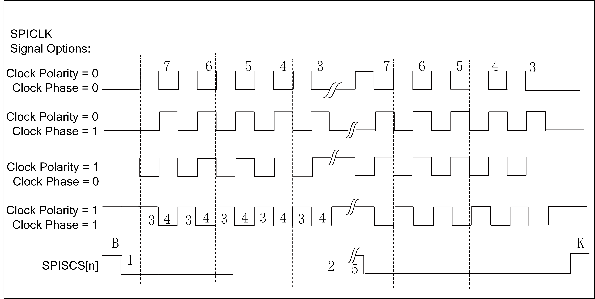
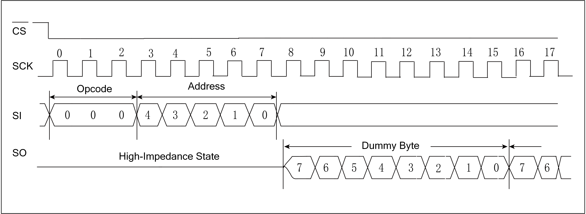

===========
SPI
===========

简介
=====
串行外设接口（Serial Peripheral Interface Bus, SPI）是一种用于短程通信的同步串行通信接口规范，装置之间使用全双工模式通信，是一个主机和一个或多个从机的主从模式。需要至
少4根线，事实上3根也可以（单向传输时）,包括SDI（数据输入）、SDO（数据输出）、SCLK（时钟）、CS（片选）。

主要特征
=========
 - 既可作为SPI主设备，也可作为SPI从设备
 - 发送和接收通道各有深度为4个字的FIFO
 - 主从设备都支持4种时钟格式（CPOL，CPHA）
 - 主从设备都支持1/2/3/4字节传输模式
 - 灵活的时钟配置，最高可支持40M时钟
 - 可配置MSB/LSB优先传输
 - 接收过滤功能
 - 从设备下的超时机制
 - 支持DMA传输模式

功能描述
===========
时钟控制
-------------
依照不同的时钟相位以及极性设定，SPI时钟共有四种模式，可以通过寄存器SPI_CONFIG的bit4（CPOL）和bit5（CPHA）进行设置。CPOL用来决定SCK时钟信号空闲时的电平，CPOL=0则空闲电平为低电平，CPOL=1则空闲电平为高电平。CPHA用来决定采样时刻，CPHA=0则在每个周期的第一个时钟沿采样，CPHA=1则在每个周期的第二个时钟沿采样。
通过设置寄存器SPI_PRD_0和SPI_PRD_1，还可以调整时钟的开始和结束电平持续时间、相位0/1的时间以及每帧数据之间的间隔。四种模式下的具体设置如下图所示：

   SPI时序图

其中各数字含义如下：
1是起始条件的长度，2是停止条件的长度，3是相位0的长度，4是相位1的长度，5是每帧数据之间的间隔。

主设备持续传输模式
-------------------
开启该模式后，在发送完当前数据而FIFO里还存在可用数据时，CS信号不会被释放。

接收过滤功能
-------------
通过设置需要过滤掉的开始位和结束位，SPI会将接收到数据中的对应数据段丢弃。如下图所示：

   SPI Ignore波形图

上图中过滤的开始位设为0，结束位设为7则Dummy Byte会被收到，结束位设为15则Dummy Byte会被丢弃。

接收去差错功能
----------------
通过使能该功能和设置门限值，SPI会将达不到门限值宽度的数据丢弃。

从模式超时机制
-------------
通过设定一个超时门限，当从模式下SPI超过该时间值未收到时钟信号时，会触发中断。

I/O传输模式
-------------
芯片通信处理器可以响应来自FIFO的中断来执行FIFO填充和清空操作。每个FIFO都有一个可编程的FIFO触发阈值来触发中断。当RX FIFO中的数值超过SPI控制器1中的RX FIFO触发阈值时，将产生一个中断，向芯片通信处理器发送信号来清空RX FIFO。当TX FIFO中的数值小于或等于SPI控制寄存器1中的TX FIFO触发阈值加1时，将产生中断，向芯片通信处理器发送信号来重新填充TX FIFO。
可以通过查询SPI状态寄存器来确定FIFO中的采样值以及FIFO的状态。软件负责确保正确的RX FIFO触发阈值和TX FIFO触发阈值，以防止接收FIFO超限和发送FIFO欠载。

DMA传输模式
-------------
SPI支持DMA传输模式。使用该模式需要分别设置TX和RX FIFO的阈值，当该模式启用后，UART会对TX/RX FIFO进行检查，一旦TX/RX的FIFO可用计数值大于其设定的阈值，将会发起DMA请求，DMA会按照设定将数据搬移至TX FIFO中或从RX FIFO中移出。

SPI中断
-------------
SPI有着丰富的中断控制，包括以下几种中断模式：

 - SPI传输结束中断
 - TX FIFO请求中断
 - RX FIFO请求中断
 - 从模式传输超时中断
 - 从模式TX过载中断
 - TX/RX FIFO溢出中断

在主模式下，SPI传输结束中断会在每帧数据传输结束时触发；在从模式下，SPI传输结束中断会在CS信号被释放时触发。TX/RX FIFO请求中断会在其FIFO可用计数值大于其设定的阈值时触发，当条件不满足时该中断标志会自动清除。从模式传输超时中断会在从模式下超过超时门限值未收到时钟信号时触发。如果TX/RX FIFO发生了上溢或者下溢，会触发TX/RX FIFO溢出中断，当FIFO清除位TFC/RFC被置1时，对应的FIFO会被清空，同时溢出中断标志会自动清除。
可以通过寄存器SPI_INT_STS查询各中断状态和对相应的位写1清除中断。

寄存器描述
====================

+----------------------+----------------------------------+
| 名称                 | 描述                             |
+----------------------+----------------------------------+
| `spi_config`_        | SPI configuration register       |
+----------------------+----------------------------------+
| `spi_int_sts`_       | SPI interrupt status             |
+----------------------+----------------------------------+
| `spi_bus_busy`_      | SPI bus busy                     |
+----------------------+----------------------------------+
| `spi_prd_0`_         | SPI length control register      |
+----------------------+----------------------------------+
| `spi_prd_1`_         | SPI length of interval           |
+----------------------+----------------------------------+
| `spi_rxd_ignr`_      | SPI ingnore function             |
+----------------------+----------------------------------+
| `spi_sto_value`_     | SPI time-out value               |
+----------------------+----------------------------------+
| `spi_fifo_config_0`_ | SPI FIFO configuration register0 |
+----------------------+----------------------------------+
| `spi_fifo_config_1`_ | SPI FIFO configuration register1 |
+----------------------+----------------------------------+
| `spi_fifo_wdata`_    | SPI FIFO write data              |
+----------------------+----------------------------------+
| `spi_fifo_rdata`_    | SPI FIFO read data               |
+----------------------+----------------------------------+

spi_config
------------
 
**地址：**  0x4000a200
 

+-----------+-----------+-----------+-----------+-----------+-----------+-----------+-----------+-----------+-----------+-----------+-----------+-----------+-----------+-----------+-----------+ 
| 31        | 30        | 29        | 28        | 27        | 26        | 25        | 24        | 23        | 22        | 21        | 20        | 19        | 18        | 17        | 16        | 
+-----------+-----------+-----------+-----------+-----------+-----------+-----------+-----------+-----------+-----------+-----------+-----------+-----------+-----------+-----------+-----------+ 
| RSVD                                                                                                                                                                                          |
+-----------+-----------+-----------+-----------+-----------+-----------+-----------+-----------+-----------+-----------+-----------+-----------+-----------+-----------+-----------+-----------+ 
| 15        | 14        | 13        | 12        | 11        | 10        | 9         | 8         | 7         | 6         | 5         | 4         | 3         | 2         | 1         | 0         |
+-----------+-----------+-----------+-----------+-----------+-----------+-----------+-----------+-----------+-----------+-----------+-----------+-----------+-----------+-----------+-----------+ 
| DEGCNT                                        | DEGEN     | RSVD      | MCEN      | IGNREN    | BYTEINV   | BITINV    | SCLKPH    | SCLKPOL   | FSIZE                 | SEN       | MEN       |
+-----------+-----------+-----------+-----------+-----------+-----------+-----------+-----------+-----------+-----------+-----------+-----------+-----------+-----------+-----------+-----------+ 

+----------+----------+--------+-------------+------------------------------------------------------------------------------------------------------------------+
| 位       | 名称     |权限    | 复位值      | 描述                                                                                                             |
+----------+----------+--------+-------------+------------------------------------------------------------------------------------------------------------------+
| 31:16    | RSVD     |        |             |                                                                                                                  |
+----------+----------+--------+-------------+------------------------------------------------------------------------------------------------------------------+
| 15:12    | DEGCNT   | R/W    | 4'D0        | De-glitch function cycle count                                                                                   |
+----------+----------+--------+-------------+------------------------------------------------------------------------------------------------------------------+
| 11       | DEGEN    | R/W    | 1'B0        | Enable signal of all input de-glitch function                                                                    |
+----------+----------+--------+-------------+------------------------------------------------------------------------------------------------------------------+
| 10       | RSVD     |        |             |                                                                                                                  |
+----------+----------+--------+-------------+------------------------------------------------------------------------------------------------------------------+
| 9        | MCEN     | R/W    | 1'B0        | Enable signal of master continuous transfer mode                                                                 |
+          +          +        +             +                                                                                                                  +
|          |          |        |             | 1'b0: Disabled, SS_n will de-assert between each data frame                                                      |
+          +          +        +             +                                                                                                                  +
|          |          |        |             | 1'b1: Enabled, SS_n will stay asserted between each consecutive data frame if the next data is valid in the FIFO |
+----------+----------+--------+-------------+------------------------------------------------------------------------------------------------------------------+
| 8        | IGNREN   | R/W    | 1'B0        | Enable signal of RX data ignore function                                                                         |
+----------+----------+--------+-------------+------------------------------------------------------------------------------------------------------------------+
| 7        | BYTEINV  | R/W    | 1'B0        | Byte-inverse signal for each FIFO entry data                                                                     |
+          +          +        +             +                                                                                                                  +
|          |          |        |             | 0: Byte[0] is sent out first                                                                                     |
+          +          +        +             +                                                                                                                  +
|          |          |        |             | 1: Byte[3] is sent out first                                                                                     |
+----------+----------+--------+-------------+------------------------------------------------------------------------------------------------------------------+
| 6        | BITINV   | R/W    | 1'B0        | Bit-inverse signal for each data byte                                                                            |
+          +          +        +             +                                                                                                                  +
|          |          |        |             | 0: Each byte is sent out MSB-first                                                                               |
+          +          +        +             +                                                                                                                  +
|          |          |        |             | 1: Each byte is sent out LSB-first                                                                               |
+----------+----------+--------+-------------+------------------------------------------------------------------------------------------------------------------+
| 5        | SCLKPH   | R/W    | 1'B0        | SCLK clock phase inverse signal                                                                                  |
+----------+----------+--------+-------------+------------------------------------------------------------------------------------------------------------------+
| 4        | SCLKPOL  | R/W    | 1'B0        | SCLK polarity                                                                                                    |
+          +          +        +             +                                                                                                                  +
|          |          |        |             | 0: SCLK output LOW at IDLE state                                                                                 |
+          +          +        +             +                                                                                                                  +
|          |          |        |             | 1: SCLK output HIGH at IDLE state                                                                                |
+----------+----------+--------+-------------+------------------------------------------------------------------------------------------------------------------+
| 3:2      | FSIZE    | R/W    | 2'D0        | SPI frame size (also the valid width for each FIFO entry)                                                        |
+          +          +        +             +                                                                                                                  +
|          |          |        |             | 2'd0: 8-bit                                                                                                      |
+          +          +        +             +                                                                                                                  +
|          |          |        |             | 2'd1: 16-bit                                                                                                     |
+          +          +        +             +                                                                                                                  +
|          |          |        |             | 2'd2: 24-bit                                                                                                     |
+          +          +        +             +                                                                                                                  +
|          |          |        |             | 2'd3: 32-bit                                                                                                     |
+----------+----------+--------+-------------+------------------------------------------------------------------------------------------------------------------+
| 1        | SEN      | R/W    | 1'B0        | Enable signal of SPI Slave function, Master and Slave should not be both enabled at the same time                |
+          +          +        +             +                                                                                                                  +
|          |          |        |             | (This bit becomes don't-care if cr_spi_m_en is enabled)                                                          |
+----------+----------+--------+-------------+------------------------------------------------------------------------------------------------------------------+
| 0        | MEN      | R/W    | 1'B0        | Enable signal of SPI Master function                                                                             |
+          +          +        +             +                                                                                                                  +
|          |          |        |             | Asserting this bit will trigger the transaction, and should be de-asserted after finish                          |
+----------+----------+--------+-------------+------------------------------------------------------------------------------------------------------------------+

spi_int_sts
-------------
 
**地址：**  0x4000a204
 

+-----------+-----------+-----------+-----------+-----------+-----------+-----------+-----------+-----------+-----------+-----------+-----------+-----------+-----------+-----------+-----------+ 
| 31        | 30        | 29        | 28        | 27        | 26        | 25        | 24        | 23        | 22        | 21        | 20        | 19        | 18        | 17        | 16        | 
+-----------+-----------+-----------+-----------+-----------+-----------+-----------+-----------+-----------+-----------+-----------+-----------+-----------+-----------+-----------+-----------+ 
| RSVD                  | FEREN     | TXUEN     | STOEN     | RXFEN     | TXFEN     | ENDEN     | RSVD                              | TXUCLR    | STOCLR    | RSVD                  | ENDCLR    |
+-----------+-----------+-----------+-----------+-----------+-----------+-----------+-----------+-----------+-----------+-----------+-----------+-----------+-----------+-----------+-----------+ 
| 15        | 14        | 13        | 12        | 11        | 10        | 9         | 8         | 7         | 6         | 5         | 4         | 3         | 2         | 1         | 0         |
+-----------+-----------+-----------+-----------+-----------+-----------+-----------+-----------+-----------+-----------+-----------+-----------+-----------+-----------+-----------+-----------+ 
| RSVD                  | FERMASK   | TXUMASK   | STOMASK   | RXFMASK   | TXFMASK   | ENDMASK   | RSVD                  | FERINT    | TXUINT    | STOINT    | RXFINT    | TXFINT    | ENDINT    |
+-----------+-----------+-----------+-----------+-----------+-----------+-----------+-----------+-----------+-----------+-----------+-----------+-----------+-----------+-----------+-----------+ 

+----------+----------+--------+-------------+------------------------------------------------------------------------------------------------------+
| 位       | 名称     |权限    | 复位值      | 描述                                                                                                 |
+----------+----------+--------+-------------+------------------------------------------------------------------------------------------------------+
| 31:30    | RSVD     |        |             |                                                                                                      |
+----------+----------+--------+-------------+------------------------------------------------------------------------------------------------------+
| 29       | FEREN    | R/W    | 1'B1        | Interrupt enable of spi_fer_int                                                                      |
+----------+----------+--------+-------------+------------------------------------------------------------------------------------------------------+
| 28       | TXUEN    | R/W    | 1'B1        | Interrupt enable of spi_txu_int                                                                      |
+----------+----------+--------+-------------+------------------------------------------------------------------------------------------------------+
| 27       | STOEN    | R/W    | 1'B1        | Interrupt enable of spi_sto_int                                                                      |
+----------+----------+--------+-------------+------------------------------------------------------------------------------------------------------+
| 26       | RXFEN    | R/W    | 1'B1        | Interrupt enable of spi_rxv_int                                                                      |
+----------+----------+--------+-------------+------------------------------------------------------------------------------------------------------+
| 25       | TXFEN    | R/W    | 1'B1        | Interrupt enable of spi_txe_int                                                                      |
+----------+----------+--------+-------------+------------------------------------------------------------------------------------------------------+
| 24       | ENDEN    | R/W    | 1'B1        | Interrupt enable of spi_end_int                                                                      |
+----------+----------+--------+-------------+------------------------------------------------------------------------------------------------------+
| 23:21    | RSVD     |        |             |                                                                                                      |
+----------+----------+--------+-------------+------------------------------------------------------------------------------------------------------+
| 20       | TXUCLR   | W1C    | 1'B0        | Interrupt clear of spi_txu_int                                                                       |
+----------+----------+--------+-------------+------------------------------------------------------------------------------------------------------+
| 19       | STOCLR   | W1C    | 1'B0        | Interrupt clear of spi_sto_int                                                                       |
+----------+----------+--------+-------------+------------------------------------------------------------------------------------------------------+
| 18:17    | RSVD     |        |             |                                                                                                      |
+----------+----------+--------+-------------+------------------------------------------------------------------------------------------------------+
| 16       | ENDCLR   | W1C    | 1'B0        | Interrupt clear of spi_end_int                                                                       |
+----------+----------+--------+-------------+------------------------------------------------------------------------------------------------------+
| 15:14    | RSVD     |        |             |                                                                                                      |
+----------+----------+--------+-------------+------------------------------------------------------------------------------------------------------+
| 13       | FERMASK  | R/W    | 1'B1        | Interrupt mask of spi_fer_int                                                                        |
+----------+----------+--------+-------------+------------------------------------------------------------------------------------------------------+
| 12       | TXUMASK  | R/W    | 1'B1        | Interrupt mask of spi_txu_int                                                                        |
+----------+----------+--------+-------------+------------------------------------------------------------------------------------------------------+
| 11       | STOMASK  | R/W    | 1'B1        | Interrupt mask of spi_sto_int                                                                        |
+----------+----------+--------+-------------+------------------------------------------------------------------------------------------------------+
| 10       | RXFMASK  | R/W    | 1'B1        | Interrupt mask of spi_rxv_int                                                                        |
+----------+----------+--------+-------------+------------------------------------------------------------------------------------------------------+
| 9        | TXFMASK  | R/W    | 1'B1        | Interrupt mask of spi_txe_int                                                                        |
+----------+----------+--------+-------------+------------------------------------------------------------------------------------------------------+
| 8        | ENDMASK  | R/W    | 1'B1        | Interrupt mask of spi_end_int                                                                        |
+----------+----------+--------+-------------+------------------------------------------------------------------------------------------------------+
| 7:6      | RSVD     |        |             |                                                                                                      |
+----------+----------+--------+-------------+------------------------------------------------------------------------------------------------------+
| 5        | FERINT   | R      | 1'B0        | SPI TX/RX FIFO error interrupt, auto-cleared when FIFO overflow/underflow error flag is cleared      |
+----------+----------+--------+-------------+------------------------------------------------------------------------------------------------------+
| 4        | TXUINT   | R      | 1'B0        | SPI slave mode TX underrun error flag, triggered when TXD is not ready during transfer in slave mode |
+----------+----------+--------+-------------+------------------------------------------------------------------------------------------------------+
| 3        | STOINT   | R      | 1'B0        | SPI slave mode transfer time-out interrupt, triggered when SPI bus is idle for a given value         |
+----------+----------+--------+-------------+------------------------------------------------------------------------------------------------------+
| 2        | RXFINT   | R      | 1'B0        | SPI RX FIFO ready (rx_fifo_cnt > rx_fifo_th) interrupt, auto-cleared when data is popped             |
+----------+----------+--------+-------------+------------------------------------------------------------------------------------------------------+
| 1        | TXFINT   | R      | 1'B0        | SPI TX FIFO ready (tx_fifo_cnt > tx_fifo_th) interrupt, auto-cleared when data is pushed             |
+----------+----------+--------+-------------+------------------------------------------------------------------------------------------------------+
| 0        | ENDINT   | R      | 1'B0        | SPI transfer end interrupt, shared by both master and slave mode                                     |
+          +          +        +             +                                                                                                      +
|          |          |        |             | Master mode: Triggered when the final frame is transferred                                           |
+          +          +        +             +                                                                                                      +
|          |          |        |             | Slave mode: Triggered when CS_n is de-asserted                                                       |
+----------+----------+--------+-------------+------------------------------------------------------------------------------------------------------+

spi_bus_busy
--------------
 
**地址：**  0x4000a208
 

+-----------+-----------+-----------+-----------+-----------+-----------+-----------+-----------+-----------+-----------+-----------+-----------+-----------+-----------+-----------+-----------+ 
| 31        | 30        | 29        | 28        | 27        | 26        | 25        | 24        | 23        | 22        | 21        | 20        | 19        | 18        | 17        | 16        | 
+-----------+-----------+-----------+-----------+-----------+-----------+-----------+-----------+-----------+-----------+-----------+-----------+-----------+-----------+-----------+-----------+ 
| RSVD                                                                                                                                                                                          |
+-----------+-----------+-----------+-----------+-----------+-----------+-----------+-----------+-----------+-----------+-----------+-----------+-----------+-----------+-----------+-----------+ 
| 15        | 14        | 13        | 12        | 11        | 10        | 9         | 8         | 7         | 6         | 5         | 4         | 3         | 2         | 1         | 0         |
+-----------+-----------+-----------+-----------+-----------+-----------+-----------+-----------+-----------+-----------+-----------+-----------+-----------+-----------+-----------+-----------+ 
| RSVD                                                                                                                                                                              | BUSBUSY   |
+-----------+-----------+-----------+-----------+-----------+-----------+-----------+-----------+-----------+-----------+-----------+-----------+-----------+-----------+-----------+-----------+ 

+----------+----------+--------+-------------+---------------------------+
| 位       | 名称     |权限    | 复位值      | 描述                      |
+----------+----------+--------+-------------+---------------------------+
| 31:1     | RSVD     |        |             |                           |
+----------+----------+--------+-------------+---------------------------+
| 0        | BUSBUSY  | R      | 1'B0        | Indicator of SPI bus busy |
+----------+----------+--------+-------------+---------------------------+

spi_prd_0
-----------
 
**地址：**  0x4000a210
 

+-----------+-----------+-----------+-----------+-----------+-----------+-----------+-----------+-----------+-----------+-----------+-----------+-----------+-----------+-----------+-----------+ 
| 31        | 30        | 29        | 28        | 27        | 26        | 25        | 24        | 23        | 22        | 21        | 20        | 19        | 18        | 17        | 16        | 
+-----------+-----------+-----------+-----------+-----------+-----------+-----------+-----------+-----------+-----------+-----------+-----------+-----------+-----------+-----------+-----------+ 
| PRDPH1                                                                                        | PRDPH0                                                                                        |
+-----------+-----------+-----------+-----------+-----------+-----------+-----------+-----------+-----------+-----------+-----------+-----------+-----------+-----------+-----------+-----------+ 
| 15        | 14        | 13        | 12        | 11        | 10        | 9         | 8         | 7         | 6         | 5         | 4         | 3         | 2         | 1         | 0         |
+-----------+-----------+-----------+-----------+-----------+-----------+-----------+-----------+-----------+-----------+-----------+-----------+-----------+-----------+-----------+-----------+ 
| PRDP                                                                                          | PRDS                                                                                          |
+-----------+-----------+-----------+-----------+-----------+-----------+-----------+-----------+-----------+-----------+-----------+-----------+-----------+-----------+-----------+-----------+ 

+----------+----------+--------+-------------+----------------------------------------------------------+
| 位       | 名称     |权限    | 复位值      | 描述                                                     |
+----------+----------+--------+-------------+----------------------------------------------------------+
| 31:24    | PRDPH1   | R/W    | 8'D15       | Length of DATA phase 1 (please refer to "Timing" tab)    |
+----------+----------+--------+-------------+----------------------------------------------------------+
| 23:16    | PRDPH0   | R/W    | 8'D15       | Length of DATA phase 0 (please refer to "Timing" tab)    |
+----------+----------+--------+-------------+----------------------------------------------------------+
| 15:8     | PRDP     | R/W    | 8'D15       | Length of STOP condition (please refer to "Timing" tab)  |
+----------+----------+--------+-------------+----------------------------------------------------------+
| 7:0      | PRDS     | R/W    | 8'D15       | Length of START condition (please refer to "Timing" tab) |
+----------+----------+--------+-------------+----------------------------------------------------------+

spi_prd_1
-----------
 
**地址：**  0x4000a214
 

+-----------+-----------+-----------+-----------+-----------+-----------+-----------+-----------+-----------+-----------+-----------+-----------+-----------+-----------+-----------+-----------+ 
| 31        | 30        | 29        | 28        | 27        | 26        | 25        | 24        | 23        | 22        | 21        | 20        | 19        | 18        | 17        | 16        | 
+-----------+-----------+-----------+-----------+-----------+-----------+-----------+-----------+-----------+-----------+-----------+-----------+-----------+-----------+-----------+-----------+ 
| RSVD                                                                                                                                                                                          |
+-----------+-----------+-----------+-----------+-----------+-----------+-----------+-----------+-----------+-----------+-----------+-----------+-----------+-----------+-----------+-----------+ 
| 15        | 14        | 13        | 12        | 11        | 10        | 9         | 8         | 7         | 6         | 5         | 4         | 3         | 2         | 1         | 0         |
+-----------+-----------+-----------+-----------+-----------+-----------+-----------+-----------+-----------+-----------+-----------+-----------+-----------+-----------+-----------+-----------+ 
| RSVD                                                                                          | PRDI                                                                                          |
+-----------+-----------+-----------+-----------+-----------+-----------+-----------+-----------+-----------+-----------+-----------+-----------+-----------+-----------+-----------+-----------+ 

+----------+----------+--------+-------------+-----------------------------------------------------------------+
| 位       | 名称     |权限    | 复位值      | 描述                                                            |
+----------+----------+--------+-------------+-----------------------------------------------------------------+
| 31:8     | RSVD     |        |             |                                                                 |
+----------+----------+--------+-------------+-----------------------------------------------------------------+
| 7:0      | PRDI     | R/W    | 8'D15       | Length of INTERVAL between frame (please refer to "Timing" tab) |
+----------+----------+--------+-------------+-----------------------------------------------------------------+

spi_rxd_ignr
--------------
 
**地址：**  0x4000a218
 

+-----------+-----------+-----------+-----------+-----------+-----------+-----------+-----------+-----------+-----------+-----------+-----------+-----------+-----------+-----------+-----------+ 
| 31        | 30        | 29        | 28        | 27        | 26        | 25        | 24        | 23        | 22        | 21        | 20        | 19        | 18        | 17        | 16        | 
+-----------+-----------+-----------+-----------+-----------+-----------+-----------+-----------+-----------+-----------+-----------+-----------+-----------+-----------+-----------+-----------+ 
| RSVD                                                                                                                              | RXDIGS                                                    |
+-----------+-----------+-----------+-----------+-----------+-----------+-----------+-----------+-----------+-----------+-----------+-----------+-----------+-----------+-----------+-----------+ 
| 15        | 14        | 13        | 12        | 11        | 10        | 9         | 8         | 7         | 6         | 5         | 4         | 3         | 2         | 1         | 0         |
+-----------+-----------+-----------+-----------+-----------+-----------+-----------+-----------+-----------+-----------+-----------+-----------+-----------+-----------+-----------+-----------+ 
| RSVD                                                                                                                              | RXDIGP                                                    |
+-----------+-----------+-----------+-----------+-----------+-----------+-----------+-----------+-----------+-----------+-----------+-----------+-----------+-----------+-----------+-----------+ 

+----------+----------+--------+-------------+-------------------------------------------+
| 位       | 名称     |权限    | 复位值      | 描述                                      |
+----------+----------+--------+-------------+-------------------------------------------+
| 31:21    | RSVD     |        |             |                                           |
+----------+----------+--------+-------------+-------------------------------------------+
| 20:16    | RXDIGS   | R/W    | 5'D0        | Starting point of RX data ignore function |
+----------+----------+--------+-------------+-------------------------------------------+
| 15:5     | RSVD     |        |             |                                           |
+----------+----------+--------+-------------+-------------------------------------------+
| 4:0      | RXDIGP   | R/W    | 5'D0        | Stopping point of RX data ignore function |
+----------+----------+--------+-------------+-------------------------------------------+

spi_sto_value
---------------
 
**地址：**  0x4000a21c
 

+-----------+-----------+-----------+-----------+-----------+-----------+-----------+-----------+-----------+-----------+-----------+-----------+-----------+-----------+-----------+-----------+ 
| 31        | 30        | 29        | 28        | 27        | 26        | 25        | 24        | 23        | 22        | 21        | 20        | 19        | 18        | 17        | 16        | 
+-----------+-----------+-----------+-----------+-----------+-----------+-----------+-----------+-----------+-----------+-----------+-----------+-----------+-----------+-----------+-----------+ 
| RSVD                                                                                                                                                                                          |
+-----------+-----------+-----------+-----------+-----------+-----------+-----------+-----------+-----------+-----------+-----------+-----------+-----------+-----------+-----------+-----------+ 
| 15        | 14        | 13        | 12        | 11        | 10        | 9         | 8         | 7         | 6         | 5         | 4         | 3         | 2         | 1         | 0         |
+-----------+-----------+-----------+-----------+-----------+-----------+-----------+-----------+-----------+-----------+-----------+-----------+-----------+-----------+-----------+-----------+ 
| RSVD                                          | STOV                                                                                                                                          |
+-----------+-----------+-----------+-----------+-----------+-----------+-----------+-----------+-----------+-----------+-----------+-----------+-----------+-----------+-----------+-----------+ 

+----------+----------+--------+-------------+-------------------------------------------+
| 位       | 名称     |权限    | 复位值      | 描述                                      |
+----------+----------+--------+-------------+-------------------------------------------+
| 31:12    | RSVD     |        |             |                                           |
+----------+----------+--------+-------------+-------------------------------------------+
| 11:0     | STOV     | R/W    | 12'HFFF     | Time-out value for spi_sto_int triggering |
+----------+----------+--------+-------------+-------------------------------------------+

spi_fifo_config_0
-------------------
 
**地址：**  0x4000a280
 

+-----------+-----------+-----------+-----------+-----------+-----------+-----------+-----------+-----------+-----------+-----------+-----------+-----------+-----------+-----------+-----------+ 
| 31        | 30        | 29        | 28        | 27        | 26        | 25        | 24        | 23        | 22        | 21        | 20        | 19        | 18        | 17        | 16        | 
+-----------+-----------+-----------+-----------+-----------+-----------+-----------+-----------+-----------+-----------+-----------+-----------+-----------+-----------+-----------+-----------+ 
| RSVD                                                                                                                                                                                          |
+-----------+-----------+-----------+-----------+-----------+-----------+-----------+-----------+-----------+-----------+-----------+-----------+-----------+-----------+-----------+-----------+ 
| 15        | 14        | 13        | 12        | 11        | 10        | 9         | 8         | 7         | 6         | 5         | 4         | 3         | 2         | 1         | 0         |
+-----------+-----------+-----------+-----------+-----------+-----------+-----------+-----------+-----------+-----------+-----------+-----------+-----------+-----------+-----------+-----------+ 
| RSVD                                                                                          | RFUF      | RFOF      | TFUF      | TFOF      | RFC       | TFC       | DMAREN    | DMATEN    |
+-----------+-----------+-----------+-----------+-----------+-----------+-----------+-----------+-----------+-----------+-----------+-----------+-----------+-----------+-----------+-----------+ 

+----------+----------+--------+-------------+----------------------------------------------------------+
| 位       | 名称     |权限    | 复位值      | 描述                                                     |
+----------+----------+--------+-------------+----------------------------------------------------------+
| 31:8     | RSVD     |        |             |                                                          |
+----------+----------+--------+-------------+----------------------------------------------------------+
| 7        | RFUF     | R      | 1'B0        | Underflow flag of RX FIFO, can be cleared by rx_fifo_clr |
+----------+----------+--------+-------------+----------------------------------------------------------+
| 6        | RFOF     | R      | 1'B0        | Overflow flag of RX FIFO, can be cleared by rx_fifo_clr  |
+----------+----------+--------+-------------+----------------------------------------------------------+
| 5        | TFUF     | R      | 1'B0        | Underflow flag of TX FIFO, can be cleared by tx_fifo_clr |
+----------+----------+--------+-------------+----------------------------------------------------------+
| 4        | TFOF     | R      | 1'B0        | Overflow flag of TX FIFO, can be cleared by tx_fifo_clr  |
+----------+----------+--------+-------------+----------------------------------------------------------+
| 3        | RFC      | W1C    | 1'B0        | Clear signal of RX FIFO                                  |
+----------+----------+--------+-------------+----------------------------------------------------------+
| 2        | TFC      | W1C    | 1'B0        | Clear signal of TX FIFO                                  |
+----------+----------+--------+-------------+----------------------------------------------------------+
| 1        | DMAREN   | R/W    | 1'B0        | Enable signal of dma_rx_req/ack interface                |
+----------+----------+--------+-------------+----------------------------------------------------------+
| 0        | DMATEN   | R/W    | 1'B0        | Enable signal of dma_tx_req/ack interface                |
+----------+----------+--------+-------------+----------------------------------------------------------+

spi_fifo_config_1
-------------------
 
**地址：**  0x4000a284
 

+-----------+-----------+-----------+-----------+-----------+-----------+-----------+-----------+-----------+-----------+-----------+-----------+-----------+-----------+-----------+-----------+ 
| 31        | 30        | 29        | 28        | 27        | 26        | 25        | 24        | 23        | 22        | 21        | 20        | 19        | 18        | 17        | 16        | 
+-----------+-----------+-----------+-----------+-----------+-----------+-----------+-----------+-----------+-----------+-----------+-----------+-----------+-----------+-----------+-----------+ 
| RSVD                                                                  | RFTH                  | RSVD                                                                  | TFTH                  |
+-----------+-----------+-----------+-----------+-----------+-----------+-----------+-----------+-----------+-----------+-----------+-----------+-----------+-----------+-----------+-----------+ 
| 15        | 14        | 13        | 12        | 11        | 10        | 9         | 8         | 7         | 6         | 5         | 4         | 3         | 2         | 1         | 0         |
+-----------+-----------+-----------+-----------+-----------+-----------+-----------+-----------+-----------+-----------+-----------+-----------+-----------+-----------+-----------+-----------+ 
| RSVD                                                      | RFCNT                             | RSVD                                                      | TFCNT                             |
+-----------+-----------+-----------+-----------+-----------+-----------+-----------+-----------+-----------+-----------+-----------+-----------+-----------+-----------+-----------+-----------+ 

+----------+----------+--------+-------------+-------------------------------------------------------------------------------------------+
| 位       | 名称     |权限    | 复位值      | 描述                                                                                      |
+----------+----------+--------+-------------+-------------------------------------------------------------------------------------------+
| 31:26    | RSVD     |        |             |                                                                                           |
+----------+----------+--------+-------------+-------------------------------------------------------------------------------------------+
| 25:24    | RFTH     | R/W    | 2'D0        | RX FIFO threshold, dma_rx_req will not be asserted if tx_fifo_cnt is less than this value |
+----------+----------+--------+-------------+-------------------------------------------------------------------------------------------+
| 23:18    | RSVD     |        |             |                                                                                           |
+----------+----------+--------+-------------+-------------------------------------------------------------------------------------------+
| 17:16    | TFTH     | R/W    | 2'D0        | TX FIFO threshold, dma_tx_req will not be asserted if tx_fifo_cnt is less than this value |
+----------+----------+--------+-------------+-------------------------------------------------------------------------------------------+
| 15:11    | RSVD     |        |             |                                                                                           |
+----------+----------+--------+-------------+-------------------------------------------------------------------------------------------+
| 10:8     | RFCNT    | R      | 3'D0        | RX FIFO available count                                                                   |
+----------+----------+--------+-------------+-------------------------------------------------------------------------------------------+
| 7:3      | RSVD     |        |             |                                                                                           |
+----------+----------+--------+-------------+-------------------------------------------------------------------------------------------+
| 2:0      | TFCNT    | R      | 3'D4        | TX FIFO available count                                                                   |
+----------+----------+--------+-------------+-------------------------------------------------------------------------------------------+

spi_fifo_wdata
----------------
 
**地址：**  0x4000a288
 

+-----------+-----------+-----------+-----------+-----------+-----------+-----------+-----------+-----------+-----------+-----------+-----------+-----------+-----------+-----------+-----------+ 
| 31        | 30        | 29        | 28        | 27        | 26        | 25        | 24        | 23        | 22        | 21        | 20        | 19        | 18        | 17        | 16        | 
+-----------+-----------+-----------+-----------+-----------+-----------+-----------+-----------+-----------+-----------+-----------+-----------+-----------+-----------+-----------+-----------+ 
| FWDATA                                                                                                                                                                                        |
+-----------+-----------+-----------+-----------+-----------+-----------+-----------+-----------+-----------+-----------+-----------+-----------+-----------+-----------+-----------+-----------+ 
| 15        | 14        | 13        | 12        | 11        | 10        | 9         | 8         | 7         | 6         | 5         | 4         | 3         | 2         | 1         | 0         |
+-----------+-----------+-----------+-----------+-----------+-----------+-----------+-----------+-----------+-----------+-----------+-----------+-----------+-----------+-----------+-----------+ 
| FWDATA                                                                                                                                                                                        |
+-----------+-----------+-----------+-----------+-----------+-----------+-----------+-----------+-----------+-----------+-----------+-----------+-----------+-----------+-----------+-----------+ 

+----------+----------+--------+-------------+---------------------+
| 位       | 名称     |权限    | 复位值      | 描述                |
+----------+----------+--------+-------------+---------------------+
| 31:0     | FWDATA   | W      | X           | SPI FIFO write data |
+----------+----------+--------+-------------+---------------------+

spi_fifo_rdata
----------------
 
**地址：**  0x4000a28c
 

+-----------+-----------+-----------+-----------+-----------+-----------+-----------+-----------+-----------+-----------+-----------+-----------+-----------+-----------+-----------+-----------+ 
| 31        | 30        | 29        | 28        | 27        | 26        | 25        | 24        | 23        | 22        | 21        | 20        | 19        | 18        | 17        | 16        | 
+-----------+-----------+-----------+-----------+-----------+-----------+-----------+-----------+-----------+-----------+-----------+-----------+-----------+-----------+-----------+-----------+ 
| FRDATA                                                                                                                                                                                        |
+-----------+-----------+-----------+-----------+-----------+-----------+-----------+-----------+-----------+-----------+-----------+-----------+-----------+-----------+-----------+-----------+ 
| 15        | 14        | 13        | 12        | 11        | 10        | 9         | 8         | 7         | 6         | 5         | 4         | 3         | 2         | 1         | 0         |
+-----------+-----------+-----------+-----------+-----------+-----------+-----------+-----------+-----------+-----------+-----------+-----------+-----------+-----------+-----------+-----------+ 
| FRDATA                                                                                                                                                                                        |
+-----------+-----------+-----------+-----------+-----------+-----------+-----------+-----------+-----------+-----------+-----------+-----------+-----------+-----------+-----------+-----------+ 

+----------+----------+--------+-------------+--------------------+
| 位       | 名称     |权限    | 复位值      | 描述               |
+----------+----------+--------+-------------+--------------------+
| 31:0     | FRDATA   | R      | 32'H0       | SPI FIFO read data |
+----------+----------+--------+-------------+--------------------+

