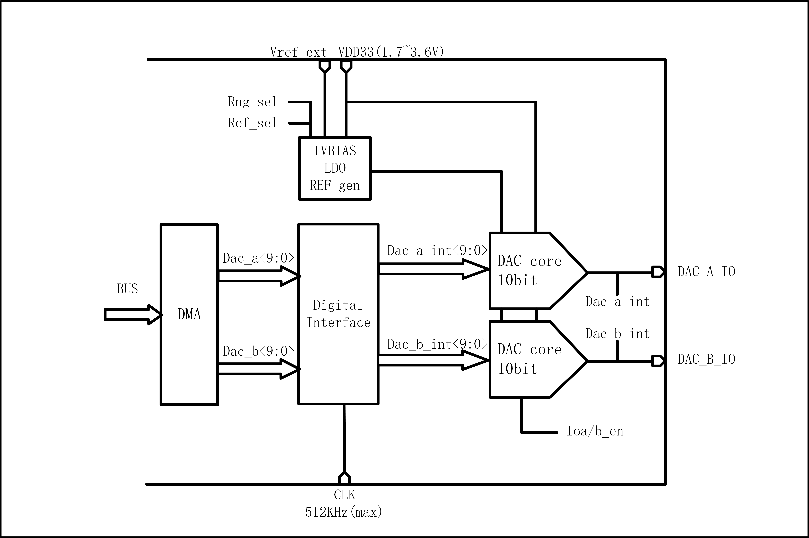

==========
DAC
==========

简介
=====
芯片内置一个10bits的数字模拟转换器(DAC）,FIFO深度为1，支持2路DAC调制输出。
可用于音频播放，变送器电压调制。

主要特点
=========
    + DAC调制精度为10-bits
    + DAC的输入时钟可选为32k、16k、8k或512k
    + 支持DMA将内存搬运至DAC调制寄存器
    + 支持双声道播放DMA搬运模式
    + DAC的输出引脚固定为ChannelA为GPIO13,Channel为GPIO14

功能描述
==========
DAC模块基本框图如图所示。

   DAC基本框图

DAC模块最支持最多两路调制输出

DAC模块支持双声道DMA数据搬运模式

DAC模块支持长度为32-bit的DMA数据接口，其中高16位将会调制在ChannelA的引脚上，低16位调制在ChannelB引脚。

寄存器描述
===========

+---------------------+-------------------------+
| 名称                | 描述                    |
+---------------------+-------------------------+
| `gpdac_config`_     | GPDAC configuration     |
+---------------------+-------------------------+
| `gpdac_dma_config`_ | GPDAC DMA configuration |
+---------------------+-------------------------+
| `gpdac_dma_wdata`_  | GPDAC DMA write data    |
+---------------------+-------------------------+

gpdac_config
--------------
 
**地址：**  0x40002040
 

+-----------+-----------+-----------+-----------+-----------+-----------+-----------+-----------+-----------+-----------+-----------+-----------+-----------+-----------+-----------+-----------+ 
| 31        | 30        | 29        | 28        | 27        | 26        | 25        | 24        | 23        | 22        | 21        | 20        | 19        | 18        | 17        | 16        | 
+-----------+-----------+-----------+-----------+-----------+-----------+-----------+-----------+-----------+-----------+-----------+-----------+-----------+-----------+-----------+-----------+ 
| RSVD                                                                                          | CHBSEL                                        | CHASEL                                        |
+-----------+-----------+-----------+-----------+-----------+-----------+-----------+-----------+-----------+-----------+-----------+-----------+-----------+-----------+-----------+-----------+ 
| 15        | 14        | 13        | 12        | 11        | 10        | 9         | 8         | 7         | 6         | 5         | 4         | 3         | 2         | 1         | 0         |
+-----------+-----------+-----------+-----------+-----------+-----------+-----------+-----------+-----------+-----------+-----------+-----------+-----------+-----------+-----------+-----------+ 
| RSVD                                                      | MODE                              | RSVD                  | DSMMODE               | RSVD                  | EN2       | EN        |
+-----------+-----------+-----------+-----------+-----------+-----------+-----------+-----------+-----------+-----------+-----------+-----------+-----------+-----------+-----------+-----------+ 

+----------+----------+--------+-------------+-------------------------------------------+
| 位       | 名称     |权限    | 复位值      | 描述                                      |
+----------+----------+--------+-------------+-------------------------------------------+
| 31:24    | RSVD     |        |             |                                           |
+----------+----------+--------+-------------+-------------------------------------------+
| 23:20    | CHBSEL   | R/W    | 0           | Channel B Source Select                   |
+          +          +        +             +                                           +
|          |          |        |             | 0: Reg                                    |
+          +          +        +             +                                           +
|          |          |        |             | 1: DMA                                    |
+          +          +        +             +                                           +
|          |          |        |             | 2: DMA + Filter                           |
+          +          +        +             +                                           +
|          |          |        |             | 3: Sin Gen                                |
+          +          +        +             +                                           +
|          |          |        |             | 4: A (The same as channel A)              |
+          +          +        +             +                                           +
|          |          |        |             | 5: ~A (Inverse of channel A)              |
+----------+----------+--------+-------------+-------------------------------------------+
| 19:16    | CHASEL   | R/W    | 0           | Channel A Source Select                   |
+          +          +        +             +                                           +
|          |          |        |             | 0: Reg                                    |
+          +          +        +             +                                           +
|          |          |        |             | 1: DMA                                    |
+          +          +        +             +                                           +
|          |          |        |             | 2: DMA + Filter                           |
+          +          +        +             +                                           +
|          |          |        |             | 3: Sin Gen                                |
+----------+----------+--------+-------------+-------------------------------------------+
| 15:11    | RSVD     |        |             |                                           |
+----------+----------+--------+-------------+-------------------------------------------+
| 10:8     | MODE     | R/W    | 0           | 0:32k, 1:16k, 3:8k,  4:512k(for DMA only) |
+----------+----------+--------+-------------+-------------------------------------------+
| 7:6      | RSVD     |        |             |                                           |
+----------+----------+--------+-------------+-------------------------------------------+
| 5:4      | DSMMODE  | R/W    | 0           | 0:bypass, 1:dsm order=1, 2: dsm order=2   |
+----------+----------+--------+-------------+-------------------------------------------+
| 3:2      | RSVD     |        |             |                                           |
+----------+----------+--------+-------------+-------------------------------------------+
| 1        | EN2      | R/W    | 0           | GPDAC enable 2 (for B channel)            |
+----------+----------+--------+-------------+-------------------------------------------+
| 0        | EN       | R/W    | 0           | GPDAC enable                              |
+----------+----------+--------+-------------+-------------------------------------------+

gpdac_dma_config
------------------
 
**地址：**  0x40002044
 

+-----------+-----------+-----------+-----------+-----------+-----------+-----------+-----------+-----------+-----------+-----------+-----------+-----------+-----------+-----------+-----------+ 
| 31        | 30        | 29        | 28        | 27        | 26        | 25        | 24        | 23        | 22        | 21        | 20        | 19        | 18        | 17        | 16        | 
+-----------+-----------+-----------+-----------+-----------+-----------+-----------+-----------+-----------+-----------+-----------+-----------+-----------+-----------+-----------+-----------+ 
| RSVD                                                                                                                                                                                          |
+-----------+-----------+-----------+-----------+-----------+-----------+-----------+-----------+-----------+-----------+-----------+-----------+-----------+-----------+-----------+-----------+ 
| 15        | 14        | 13        | 12        | 11        | 10        | 9         | 8         | 7         | 6         | 5         | 4         | 3         | 2         | 1         | 0         |
+-----------+-----------+-----------+-----------+-----------+-----------+-----------+-----------+-----------+-----------+-----------+-----------+-----------+-----------+-----------+-----------+ 
| RSVD                                                                                                                  | DMAFM                 | RSVD                              | DMATXEN   |
+-----------+-----------+-----------+-----------+-----------+-----------+-----------+-----------+-----------+-----------+-----------+-----------+-----------+-----------+-----------+-----------+ 

+----------+----------+--------+-------------+------------------------------------------------------+
| 位       | 名称     |权限    | 复位值      | 描述                                                 |
+----------+----------+--------+-------------+------------------------------------------------------+
| 31:6     | RSVD     |        |             |                                                      |
+----------+----------+--------+-------------+------------------------------------------------------+
| 5:4      | DMAFM    | R/W    | 0           | DMA TX format (Data 12-bit)                          |
+          +          +        +             +                                                      +
|          |          |        |             | 0: {A0}, {A1}, {A2}…                                |
+          +          +        +             +                                                      +
|          |          |        |             | 1: {B0,A0}, {B1,A1}, {B2,A2}…                       |
+          +          +        +             +                                                      +
|          |          |        |             | 2: {A1,A0}, {A3,A2}, {A5,A4}…                       |
+          +          +        +             +                                                      +
|          |          |        |             | (Note: {20'h0,[11:0]} or {4'h0,[27:16],4'h0,[11:0]}) |
+----------+----------+--------+-------------+------------------------------------------------------+
| 3:1      | RSVD     |        |             |                                                      |
+----------+----------+--------+-------------+------------------------------------------------------+
| 0        | DMATXEN  | R/W    | 0           | GPDAC DMA TX enable                                  |
+----------+----------+--------+-------------+------------------------------------------------------+

gpdac_dma_wdata
-----------------
 
**地址：**  0x40002048
 

+-----------+-----------+-----------+-----------+-----------+-----------+-----------+-----------+-----------+-----------+-----------+-----------+-----------+-----------+-----------+-----------+ 
| 31        | 30        | 29        | 28        | 27        | 26        | 25        | 24        | 23        | 22        | 21        | 20        | 19        | 18        | 17        | 16        | 
+-----------+-----------+-----------+-----------+-----------+-----------+-----------+-----------+-----------+-----------+-----------+-----------+-----------+-----------+-----------+-----------+ 
| DMAWDA                                                                                                                                                                                        |
+-----------+-----------+-----------+-----------+-----------+-----------+-----------+-----------+-----------+-----------+-----------+-----------+-----------+-----------+-----------+-----------+ 
| 15        | 14        | 13        | 12        | 11        | 10        | 9         | 8         | 7         | 6         | 5         | 4         | 3         | 2         | 1         | 0         |
+-----------+-----------+-----------+-----------+-----------+-----------+-----------+-----------+-----------+-----------+-----------+-----------+-----------+-----------+-----------+-----------+ 
| DMAWDA                                                                                                                                                                                        |
+-----------+-----------+-----------+-----------+-----------+-----------+-----------+-----------+-----------+-----------+-----------+-----------+-----------+-----------+-----------+-----------+ 

+----------+----------+--------+-------------+-------------------+
| 位       | 名称     |权限    | 复位值      | 描述              |
+----------+----------+--------+-------------+-------------------+
| 31:0     | DMAWDA   | W      | X           | GPDAC DMA TX data |
+----------+----------+--------+-------------+-------------------+

