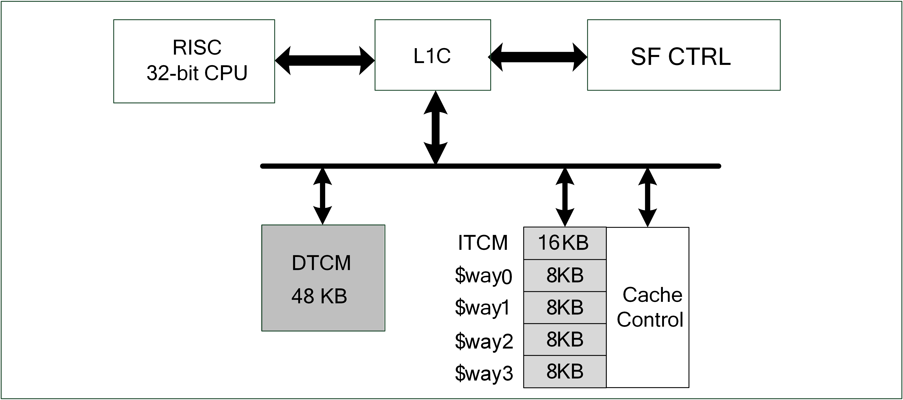

===
L1C
===

简介
=====
L1 Cache Controller是位于处理器外部,用于管理Flash上代码或者数据缓冲，提高CPU访问Flash速度的单元模块。架构如下图:

   LIC架构

L1C是集成在处理器和Flash中间的高速单元，因为处理器的速度非常快，当处理器访问Flash需要等待的时间较长，
等待的时间即代表浪费的时间，浪费的时间越少代表效能的浪费越多，L1C缓存可以在处理器与Flash中间当作润滑的角色，
让处理器效率提升。

主要特征
=========
- 4路相联映射缓存(4-way Set-Associative mapping)
- 可调变的缓存空间大小
- 与TCM地址空间连续，可以方便的配置L1C空间为TCM空间
- 支持缓存效能统计

功能描述
==========
TCM与Cache RAM资源相互变换
-------------------------------------
为了增加内存使用效率，支持将Cache的32K RAM全部或者部分调整为TCM空间，这样方便用户根据实际情况，调整内存使用方式和效率。
Cache的默认大小为32K，分为4条way，每条way是8K，调整的单位是1条way，也就是8K.ITCM的默认大小是16K。通过WayDisable的设定
可以灵活的调整Cache和ITCM的实际空间大小。

.. table:: WayDisable的设定

    +------------+-----------------------+-------+
    | WayDisable |    Cache              | ITCM  |
    +------------+-----------------------+-------+
    |   none     |     32K               | 16K   |
    +------------+-----------------------+-------+
    |   one way  |     24K               | 24K   |
    +------------+-----------------------+-------+
    |   two way  |     16K               | 32K   |
    +------------+-----------------------+-------+
    | three way  |     8K                | 40K   |
    +------------+-----------------------+-------+
    | four way   |     0K                | 48K   |
    +------------+-----------------------+-------+

缓存(Cache)
-------------
缓存每条line buffer单位为32字节，采用4路相联映射缓存，应用架构如下:

.. figure:: picture/L1c_Way.png
   :align: center

   缓存架构

每组相联映射缓存包含两个部分，第一个是tag，包含了有效值和地址映像关系，
第二部分是数据储存。当处理器存取缓存时，缓存处理器会比对地址和tag的关系，
当地址比对成功时代表可以直接从缓存取数据，
反之缓存处理器则会通过AHB Master抓取相关的数据并同时放进缓存和响应处理器的数据。
当大部分的数据都可以在tag中比对成功时，可以大幅度缩短处理器的等待时间，
增加使用效率。

寄存器描述
====================

+----------------+---------------------------+
| 名称           | 描述                      |
+----------------+---------------------------+
| `l1c_config`_  | L1C feature configuration |
+----------------+---------------------------+
| `hit_cnt_lsb`_ | Low 32-bit hit couter     |
+----------------+---------------------------+
| `hit_cnt_msb`_ | High 32-bit hit counter   |
+----------------+---------------------------+
| `miss_cnt`_    | Miss counter              |
+----------------+---------------------------+

l1c_config
------------
 
**地址：**  0x40009000
 

+-----------+-----------+-----------+-----------+-----------+-----------+-----------+-----------+-----------+-----------+-----------+-----------+-----------+-----------+-----------+-----------+ 
| 31        | 30        | 29        | 28        | 27        | 26        | 25        | 24        | 23        | 22        | 21        | 20        | 19        | 18        | 17        | 16        | 
+-----------+-----------+-----------+-----------+-----------+-----------+-----------+-----------+-----------+-----------+-----------+-----------+-----------+-----------+-----------+-----------+ 
| RSVD                                                                                                                                                                                          |
+-----------+-----------+-----------+-----------+-----------+-----------+-----------+-----------+-----------+-----------+-----------+-----------+-----------+-----------+-----------+-----------+ 
| 15        | 14        | 13        | 12        | 11        | 10        | 9         | 8         | 7         | 6         | 5         | 4         | 3         | 2         | 1         | 0         |
+-----------+-----------+-----------+-----------+-----------+-----------+-----------+-----------+-----------+-----------+-----------+-----------+-----------+-----------+-----------+-----------+ 
| RSVD                                          | WAYDIS                                        | RSVD                                                                  | CNTEN     | CACABLE   |
+-----------+-----------+-----------+-----------+-----------+-----------+-----------+-----------+-----------+-----------+-----------+-----------+-----------+-----------+-----------+-----------+ 

+----------+----------+--------+-------------+-------------------------------------------+
| 位       | 名称     |权限    | 复位值      | 描述                                      |
+----------+----------+--------+-------------+-------------------------------------------+
| 31:12    | RSVD     |        |             |                                           |
+----------+----------+--------+-------------+-------------------------------------------+
| 11:8     | WAYDIS   | R/W    | 4'B1111     | Disable part of cache ways & used as ITCM |
+----------+----------+--------+-------------+-------------------------------------------+
| 7:2      | RSVD     |        |             |                                           |
+----------+----------+--------+-------------+-------------------------------------------+
| 1        | CNTEN    | R/W    | 0           | Cache performance counter enable          |
+----------+----------+--------+-------------+-------------------------------------------+
| 0        | CACABLE  | R/W    | 0           | Cachable region enable                    |
+----------+----------+--------+-------------+-------------------------------------------+

hit_cnt_lsb
-------------
 
**地址：**  0x40009004
 

+-----------+-----------+-----------+-----------+-----------+-----------+-----------+-----------+-----------+-----------+-----------+-----------+-----------+-----------+-----------+-----------+ 
| 31        | 30        | 29        | 28        | 27        | 26        | 25        | 24        | 23        | 22        | 21        | 20        | 19        | 18        | 17        | 16        | 
+-----------+-----------+-----------+-----------+-----------+-----------+-----------+-----------+-----------+-----------+-----------+-----------+-----------+-----------+-----------+-----------+ 
| CNTLSB                                                                                                                                                                                        |
+-----------+-----------+-----------+-----------+-----------+-----------+-----------+-----------+-----------+-----------+-----------+-----------+-----------+-----------+-----------+-----------+ 
| 15        | 14        | 13        | 12        | 11        | 10        | 9         | 8         | 7         | 6         | 5         | 4         | 3         | 2         | 1         | 0         |
+-----------+-----------+-----------+-----------+-----------+-----------+-----------+-----------+-----------+-----------+-----------+-----------+-----------+-----------+-----------+-----------+ 
| CNTLSB                                                                                                                                                                                        |
+-----------+-----------+-----------+-----------+-----------+-----------+-----------+-----------+-----------+-----------+-----------+-----------+-----------+-----------+-----------+-----------+ 

+----------+----------+--------+-------------+-------------------------+
| 位       | 名称     |权限    | 复位值      | 描述                    |
+----------+----------+--------+-------------+-------------------------+
| 31:0     | CNTLSB   | R      | 0           | Hit counter low 32-bit  |
+----------+----------+--------+-------------+-------------------------+

hit_cnt_msb
-------------
 
**地址：**  0x40009008
 

+-----------+-----------+-----------+-----------+-----------+-----------+-----------+-----------+-----------+-----------+-----------+-----------+-----------+-----------+-----------+-----------+ 
| 31        | 30        | 29        | 28        | 27        | 26        | 25        | 24        | 23        | 22        | 21        | 20        | 19        | 18        | 17        | 16        | 
+-----------+-----------+-----------+-----------+-----------+-----------+-----------+-----------+-----------+-----------+-----------+-----------+-----------+-----------+-----------+-----------+ 
| CNTMSB                                                                                                                                                                                        |
+-----------+-----------+-----------+-----------+-----------+-----------+-----------+-----------+-----------+-----------+-----------+-----------+-----------+-----------+-----------+-----------+ 
| 15        | 14        | 13        | 12        | 11        | 10        | 9         | 8         | 7         | 6         | 5         | 4         | 3         | 2         | 1         | 0         |
+-----------+-----------+-----------+-----------+-----------+-----------+-----------+-----------+-----------+-----------+-----------+-----------+-----------+-----------+-----------+-----------+ 
| CNTMSB                                                                                                                                                                                        |
+-----------+-----------+-----------+-----------+-----------+-----------+-----------+-----------+-----------+-----------+-----------+-----------+-----------+-----------+-----------+-----------+ 

+----------+----------+--------+-------------+--------------------------------------------------+
| 位       | 名称     |权限    | 复位值      | 描述                                             |
+----------+----------+--------+-------------+--------------------------------------------------+
| 31:0     | CNTMSB   | R      | 0           | total hit count = hit_cnt_msb*2^32 + hit_cnt_lsb |
+----------+----------+--------+-------------+--------------------------------------------------+

miss_cnt
----------
 
**地址：**  0x4000900c
 

+-----------+-----------+-----------+-----------+-----------+-----------+-----------+-----------+-----------+-----------+-----------+-----------+-----------+-----------+-----------+-----------+ 
| 31        | 30        | 29        | 28        | 27        | 26        | 25        | 24        | 23        | 22        | 21        | 20        | 19        | 18        | 17        | 16        | 
+-----------+-----------+-----------+-----------+-----------+-----------+-----------+-----------+-----------+-----------+-----------+-----------+-----------+-----------+-----------+-----------+ 
| MISSCNT                                                                                                                                                                                       |
+-----------+-----------+-----------+-----------+-----------+-----------+-----------+-----------+-----------+-----------+-----------+-----------+-----------+-----------+-----------+-----------+ 
| 15        | 14        | 13        | 12        | 11        | 10        | 9         | 8         | 7         | 6         | 5         | 4         | 3         | 2         | 1         | 0         |
+-----------+-----------+-----------+-----------+-----------+-----------+-----------+-----------+-----------+-----------+-----------+-----------+-----------+-----------+-----------+-----------+ 
| MISSCNT                                                                                                                                                                                       |
+-----------+-----------+-----------+-----------+-----------+-----------+-----------+-----------+-----------+-----------+-----------+-----------+-----------+-----------+-----------+-----------+ 

+----------+----------+--------+-------------+--------------+
| 位       | 名称     |权限    | 复位值      | 描述         |
+----------+----------+--------+-------------+--------------+
| 31:0     | MISSCNT  | R      | 0           | Miss counter |
+----------+----------+--------+-------------+--------------+

