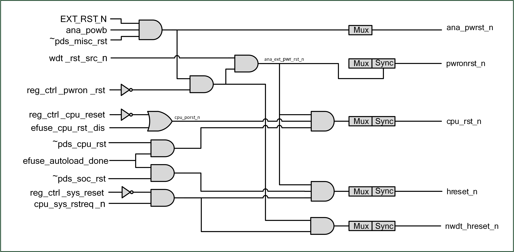

============
复位和时钟
============
简介
========
芯片内部的复位源：硬件重置，看门狗重置，软件复位。
芯片内的时钟源：XTAL，PLL，RC。搭配分频等配置送至各模块。

复位源
===========

复位源包含

- 硬件重置:通过管脚进行重置

  - 管脚全局重置（PAD_EXT_RST = 1-> 0）：所有逻辑都会进行重置，返回初始状态（适用于QFN40）
  - 管脚电源重置（CHIP_EN = 0-> 1）：类似电源管理重置
  - 电源管理重置：芯片从断电中复电，HBN逻辑将芯片系统进行重置

- 看门狗重置

  - 当看门狗报警触发重置信号，重置管理单元将在必要准备后，重置芯片系统，看门狗内部逻辑会记录看门狗重置的状态

- 软件复位:通过软件设置寄存器进行局部或局部复位

  - 软件初始重置（reg_ctrl_pwron_rst）：通过软件触发此寄存器的上升沿，进行芯片系统重置
  - 软件CPU复位（reg_ctrl_cpu_reset）：通过软件触发此寄存器的上升沿，进行CPU部分系统复位
  - 软件系统复位（reg_ctrl_sys_reset）：通过软件触发此寄存器的上升沿，保留必要的逻辑处理如电源管理单元，进行芯片部分系统复位
  - 软件模块复位：根据特定模块的需求，设置软件复位

   复位源

时钟源
===========

时钟源包含：

- XTAL   ：外部晶振时钟，视系统需求频率可选 24、32、38.4、40MHz
- XTAL32K：外部晶振时钟，频率32kHz
- RC32K  ：RC振荡器时钟，频率32kHz，提供校准
- RC32M  ：RC振荡器时钟，频率32MHz，提供校准
- PLL    ：锁相回路时钟，内部系统高速时钟，最高频率支持192MHz

时钟控制单元将来自振荡器的时钟分配给内核和外围设备。
可通过选择系统时钟源，动态分频器，时钟配置，睡眠使用32kHz时钟，以达到低功耗时钟管理。

外围设备时钟包括: Flash、UART、I2C、SPI、PWM、IR-remote、ADC、DAC。

.. figure:: picture/clocktree.png
   :align: center

   时钟架构
