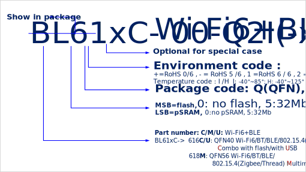

===============================
Ordering Information
===============================

   Part Number

.. table:: Part Order Options 

    +----------------+----------+----------------------+-------+---------------------------------------------------------------------------+
    |  Customer P/N  |  Type    | Package Size(mm)     | MOQ   | Description                                                               |
    +================+==========+======================+=======+===========================================================================+
    | BL616C-50-Q2I  | QFN40    | 5x5x0.85, Pitch 0.4  | 6K    | Wi-Fi 6/BT/BLE/802.15.4(Thread), 32Mb flash                               |
    +----------------+----------+----------------------+-------+---------------------------------------------------------------------------+
    | BL616S-50-Q2I  | QFN40    | 5x5x0.85, Pitch 0.4  | 6K    | Wi-Fi 6/BLE Standard, 32Mb flash                                          |
    +----------------+----------+----------------------+-------+---------------------------------------------------------------------------+
    | BL618M-05-Q2I  | QFN56    | 7x7x0.85, Pitch 0.4  | 3K    | Wi-Fi 6/BT/BLE/802.15.4(Zigbee/Thread), Video, 32Mb pSRAM                 |
    +----------------+----------+----------------------+-------+---------------------------------------------------------------------------+
