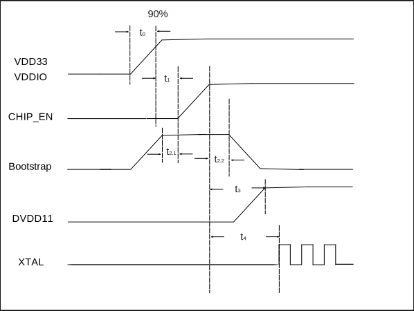

========
电气特性
========

绝对最大额定值
===============

.. table:: 电源的绝对最大额定值 

    +--------------------------------------------+--------+--------+------+
    |  管脚名称                                  | 最小值 | 最大值 | 单位 | 
    +============================================+========+========+======+
    | AVDD33_RF1, AVDD33_RF2, AVDD33_AON,        | -0.3   | 3.63   | V    | 
    +                                            +        +        +      +
    | PVDD33_DCDC, VDDIO_USB, AVDD33_RF3         |        |        |      | 
    +--------------------------------------------+--------+--------+------+
    | VDDIO1, VDDIO2                             | -0.3   | 3.63   | V    | 
    +--------------------------------------------+--------+--------+------+
    | ESD Protection (HBM)                       |        | 2000   | V    | 
    +--------------------------------------------+--------+--------+------+
    | Storage Temperature                        | -45    | 135    | °C   | 
    +--------------------------------------------+--------+--------+------+

运行条件
=============
电源特性
--------------
.. table:: 建议电源值范围

    +-----------------------------------------+---------------------+-----------+--------------+------+
    |  管脚名称                               | 最小值              |  典型值   | 最大值       | 单位 | 
    +=========================================+=====================+===========+==============+======+
    | AVDD33_RF1, AVDD33_RF2, AVDD33_AON,     | 2.97                | 3.3       | 3.63         | V    | 
    +                                         +                     +           +              +      +
    | PVDD33_DCDC, VDDIO_USB, AVDD33_RF3      |                     |           |              |      |
    +-----------------------------------------+---------------------+-----------+--------------+      +
    | VDDIO1, VDDIO2                          | 2.97/1.62           | 3.3/1.8   | 3.63/1.98    |      |
    +-----------------------------------------+---------------------+-----------+--------------+------+

IO直流特性
------------
测试条件：IO供电VDDIO = 3.3V，温度25°C

.. table:: IO直流特性

    +----------------------+------------------------+------------------------------+-------------------------------------------------+-----------+--------------+------------+------------+
    |  符号                | 描述                   | GPIO 号                      | 条件                                            |  最小值   | 典型值       | 最大值     | 单位       |
    +======================+========================+==============================+=================================================+===========+==============+============+============+
    | VOH                  | Output voltage high    | GPIO 21-22,                  | GPIO drive strength 0, source current = 12mA    |           | 0.9*VDDIO    |            | V          | 
    +                      +                        +                              +-------------------------------------------------+-----------+              +------------+            +
    |                      |                        | GPIO28-29                    | GPIO drive strength 1, source current = 36.1mA  |           |              |            |            |
    +                      +                        +                              +-------------------------------------------------+-----------+              +------------+            +
    |                      |                        |                              | GPIO drive strength 2, source current = 72.2mA  |           |              |            |            |
    +                      +                        +                              +-------------------------------------------------+-----------+              +------------+            +
    |                      |                        |                              | GPIO drive strength 3, source current = 96mA    |           |              |            |            |
    +                      +                        +------------------------------+-------------------------------------------------+-----------+              +------------+            +
    |                      |                        | GPIO 0-20,                   | GPIO drive strength 0, source current = 9.7mA   |           |              |            |            | 
    +                      +                        +                              +-------------------------------------------------+-----------+              +------------+            +
    |                      |                        | GPIO 23-27,                  | GPIO drive strength 1, source current = 29.2mA  |           |              |            |            |
    +                      +                        +                              +-------------------------------------------------+-----------+              +------------+            +
    |                      |                        | GPIO 30-34                   | GPIO drive strength 2, source current = 58.5mA  |           |              |            |            |
    +                      +                        +                              +-------------------------------------------------+-----------+              +------------+            +
    |                      |                        |                              | GPIO drive strength 3, source current = 80mA    |           |              |            |            |
    +----------------------+------------------------+------------------------------+-------------------------------------------------+-----------+--------------+------------+------------+
    | VOL                  | Output voltage low     | GPIO 21-22,                  | GPIO drive strength 0, sink current = 11mA      |           |              |            | V          | 
    +                      +                        +                              +-------------------------------------------------+-----------+              +------------+            +
    |                      |                        | GPIO28-29                    | GPIO drive strength 1, sink current = 38.4mA    |           |              |            |            |
    +                      +                        +                              +-------------------------------------------------+-----------+              +------------+            +
    |                      |                        |                              | GPIO drive strength 2, sink current = 71.4mA    |           |              |            |            |
    +                      +                        +                              +-------------------------------------------------+-----------+              +------------+            +
    |                      |                        |                              | GPIO drive strength 3, sink current = 99mA      |           |              |            |            |
    +                      +                        +------------------------------+-------------------------------------------------+-----------+              +------------+            +
    |                      |                        | GPIO 0-20,                   | GPIO drive strength 0, sink current = 11.4mA    |           |              |            |            | 
    +                      +                        +                              +-------------------------------------------------+-----------+              +------------+            +
    |                      |                        | GPIO 23-27,                  | GPIO drive strength 1, sink current = 34mA      |           |              |            |            |
    +                      +                        +                              +-------------------------------------------------+-----------+              +------------+            +
    |                      |                        | GPIO 30-34                   | GPIO drive strength 2, sink current = 68.5mA    |           |              |            |            |
    +                      +                        +                              +-------------------------------------------------+-----------+              +------------+            +
    |                      |                        |                              | GPIO drive strength 3, sink current = 91mA      |           |              |            |            |
    +----------------------+------------------------+------------------------------+-------------------------------------------------+-----------+--------------+------------+------------+
    | VIH                  | Input voltage high     |                                                                                | 0.7*VDDIO |              |            | V          |
    +----------------------+------------------------+------------------------------+-------------------------------------------------+-----------+--------------+------------+------------+
    | VIL                  | Input voltage low      |                                                                                |           |              | 0.3*VDDIO  | V          |
    +----------------------+------------------------+------------------------------+-------------------------------------------------+-----------+--------------+------------+------------+

上电时序
--------------
为确保正常的上电启动，电源、复位、Bootstrap引脚需要满足相应的时序要求。

   上电时序

.. table:: 上电时序参数说明

    +------------------+---------------------------------------------------------+-----------+--------------+------------+
    |  参数            | 说明                                                    |最小值(ms) | 典型值(ms)   | 最大值(ms) |
    +==================+=========================================================+===========+==============+============+
    | t\ :sub:`0`\     | 电源电压到达90%的上升时间                               |           |              | 2          |
    +------------------+---------------------------------------------------------+-----------+--------------+------------+
    | t\ :sub:`1`\     | 电源上升完成到 CHIP_EN 拉高前延时                       | 0.1       |              |            |
    +------------------+---------------------------------------------------------+-----------+--------------+------------+
    | t\ :sub:`2.1`\   | Boostrap引脚 [0201]_ 电平在 CHIP_EN 拉高前的建立时间    | 0         |              |            |
    +------------------+---------------------------------------------------------+-----------+--------------+------------+
    | t\ :sub:`2.2`\   | Boostrap引脚电平在 CHIP_EN 拉高后的保持时间             | 2         |              |            |
    +------------------+---------------------------------------------------------+-----------+--------------+------------+
    | t\ :sub:`3`\     | CHIP_EN 拉高到 DVDD11 输出                              |           | 2            |            |
    +------------------+---------------------------------------------------------+-----------+--------------+------------+
    | t\ :sub:`4`\     | CHIP_EN 拉高到XTAL起振                                  |           | 2            |            |
    +------------------+---------------------------------------------------------+-----------+--------------+------------+

.. [0201] Bootstrap引脚是GPIO2。

温度特性
-----------------

.. table:: 建议温度值范围

    +-------+----------+--------+-----------+--------+
    |  项目            | 最小值 |  最大值   | 单位   |
    +=======+==========+========+===========+========+
    | 温度  |主芯片    | -30    | 105       | °C     |
    +       +----------+--------+-----------+--------+
    |       |合封多芯片| -30    |85         | °C     |
    +-------+----------+--------+-----------+--------+

通用工作条件
----------------

.. table:: 一般操作条件

    +------------+------------------------+-----------+--------------+--------+------+
    |  项目      | 描述                   |  最小值   | 典型值       | 最大值 | 单位 |
    +============+========================+===========+==============+========+======+
    | FCPU       | CPU/TCM/Cache时钟频率  |           | 320          |        | MHz  | 
    +------------+------------------------+-----------+--------------+--------+------+
    | FBUS       | 系统总线时钟频率       |           | 80           |        | MHz  |
    +------------+------------------------+-----------+--------------+--------+------+

