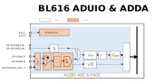

===========
AudioADC
===========

Overview
=====
A 16-bit ADC is built in the chip to sample the digital PDM signals or analog signals of the audio.

Features
===========
- One 16-bit ADC is integrated to support 1 analog mic differential/single-ended input and multiplexed GPIO input.
  * Sampling rate: 8k–96k
  * Signal to noise ratio (AW): 90 dB @ 6 dB gain
  * Harmonic distortion + noise: 80dB @ 6dB gain
  * Analog pre-amplifier gain: 6–42 dB, 3 dB per gear
- Adjustable high-pass filter and independent digital volume control
- Supports digital mic interface, with GPIO input multiplexed
- Supports DC measurement mode with accuracy of 16-bit
- Independent digital volume control
- 32-bit FIFO with a depth of 32
- Supports DMA transfer mode

Clock Tree
====================

The user starts the Audio PLL to select the corresponding frequency value. After one frequency division, the user enters the module and selects the division factor through the adc\_rate in audpdm\_top. The value of this register and the frequency division ratio are shown as follows.

   Block Diagram of Clock

Functional Description
===========

The block diagram of AudioADC is shown as follows.

   Block Diagram of Module

The input signal of AUADC can be either a digital PDM signal or an analog signal (determined by pdm\_dac\_0\[12]). When a PDM digital signal is selected, the input enters PDM demodulator and then passes through a filter, and the volume controller enters RX FIFO. When a digital signal is selected, it passes through a PGA, an ADC converter and the corresponding filter and finally enter RX FIFO.

Selection of PDM Left and Right Channels
----------------------------
When the input signal is in the digital PDM format, you can choose to record the left or right channel of PDM through the adc\_0\_pdm\_sel in PDM\_PDM\_0.

AUADC Interrupt
-------------
AUADC supports the following interrupt control modes:

- RX FIFO request interrupt

- RX FIFO underrun interrupt

- RX FIFO overrun interrupt

A RX FIFO request interrupt is generated when RX\_DRQ\_CNT in RX\_FIFO\_CTRL is greater than RX\_TRG\_LEVEL. When the condition is not met, the interrupt flag is cleared automatically.

When there is no data in RX FIFO, but the user enables RX FIFO modulation through RX\_CH\_EN in RX\_FIFO\_CTRL, the RX FIFO underrun interrupt is generated.

When the user fills in data that exceeds the maximum depth of RX FIFO, it leads to RX FIFO overflow and cause a RX FIFO overrun interrupt.

FIFO Format Control
--------------
The register AUADC\_RX\_FIFO\_CTRL can control the format of the audio data to be stored in FIFO.

The FIFO controller supports the following four data storage formats, which are determined by FIFO\_CTRL\[25:24].

 - Mode 0:

    DATA[31:0] = {FIFO[15:0],16'h0}

 - Mode 1:

    DATA[31:0] = {8{FIFO[15]},FIFO[15:0],8'h0}

 - Mode 2:

    DATA[31:0] = {12{FIFO[15]},FIFO[15:0],4'h0}

 - Mode 3:

    DATA[31:0] = {16{FIFO[15]},FIFO[15:0]}

Distribution of MSB

- Mode 0:
  
  The MSB of data is 31 bits

- Mode 1:
  
  The MSB of data is 23 bits

- Mode 2:
  
  The MSB of data is 19 bits

- Mode 3:
  
  The MSB of data is 15 bits

If there is no special requirement for the storage format, generally, Mode3 is appropriate. As the maximum resolution of ADC is 16-bit, using 16-bit RAM to store audio can achieve the greatest efficiency. For other formats, the valid 16-bit data is placed in different positions in the 32-bit width, with low bits filled with 0 and high bits filled with sign bits.

Startup of FIFO and DMA Transfer
------------------------
The data in FIFO of the PDM module can be transferred by DMA.

The user can obtain the current amount of valid data in FIFO in real time through the register PDM\_RX\_FIFO\_STATUS.

The FIFO count threshold (8/16/32) for initiating DMA request is selected by configuring FIFO\_CTRL\[15:14], or can be determined by FIFO\_CTRL\[22:16].

When the count value is greater than the set threshold, and the FIFO of the channel corresponding to PDM\_RX\_FIFO\_CTRL\[12:8] is enabled, a DMA transfer is initiated.

When TX FIFO is started, if there is no valid data in TX FIFO, the tx underrun error will be triggered. Therefore, the software configuration sequence must be followed.

Configuration Process
================================
1. For the sampling rate of the recorded audio, select the corresponding sampling rate through audpdm\_top\[31:28].

2. Configure the adc\_0\_src register of pdm\_dac\_0 depending on whether the recorded data source is PDM digital signal or analog signal.

3. In case of pdm format, select the channel of pdm through the adc\_0\_pdm\_sel in pdm\_pdm\_0

4. Configure the DMA to transfer the RX FIFO data of Audio to the designated area in real time

5. Turn on the state machine through the rx\_ch\_en in audadc\_rx\_fifo\_ctrl to start recording

6. Adjust the volume during recording (optional)

.. only:: html

   .. include:: ausolo_register.rst

.. raw:: latex

   \input{../../en/content/ausolo}