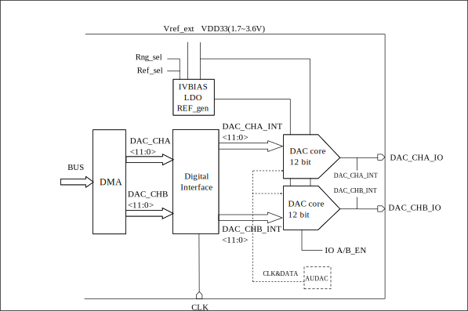

==========
DAC
==========

Overview
=====
The DAC module is a 12-bit voltage output digital-to-analog converter that works with a DMA controller. The built-in DAC module of the chip has two output channels, and each channel has an independent converter, which can perform digital-to-analog conversion independently of each other. In addition, the converter of this DAC can also be used as the analog output channel of AudioDAC. Can be used for audio playback, transmitter voltage modulation and other applications.

Features
=========
- DAC modulation accuracy is 12-bits
- The digital-to-analog converter of the DAC can be used as the analog output channel of the Audio DAC module
- DAC input clock can be selected as 32MHz, xclk or from AudioDAC module
- Each channel has DMA function and supports 10 data transfer formats
- Support DAC dual-channel simultaneous conversion
- The output pin of DAC is fixed as ChannelA is GPIO3, ChannelB is GPIO2
- Supports internal and external input reference voltages

Functional Description
=============================
The block diagram of DAC is shown as follows.

   Block Diagram of DAC

The DAC module contains two DAC analog-to-digital conversion circuits and the power circuit related to the modulated analog signal. The user can select whether the reference voltage of the DAC is external or internal through Ref_Sel, and select the output voltage range through Rng_Sel. The clock and data of the DAC digital-to-analog converter can come from its own digital control circuit (independent mode), or from the output of the AudioDAC in analog mode (combined mode).

When the DAC works in independent mode, the DAC modulation registers (gpdac_a_data, gpdac_b_data in the register dac_cfg3) can be directly written by the CPU, or transferred to the gpdac_dma_wdata register by the DMA.

When the DAC is in joint mode, its own FIFO, data format, clock configuration and other digital circuit configurations will be bypassed and no longer take effect, and the clock and data of the digital-to-analog converter will be taken over by the AudioDAC module.

DAC channel enable
---------------
Taking channel A as an example in independent mode, the configuration process is as follows:

1. Set the corresponding gpdac_en bit in register gpdac_config to 1 to enable the DAC
2. Write 0 to the corresponding gpdac_ana_clk_sel and gpdac_dat_cha_sel bits in register dac_cfg0 to work in standalone mode
3. Set the corresponding gpdac_a_en bit in register dac_cfg1 to 1 to enable DAC A channel conversion
4. Set the corresponding gpdac_ioa_en bit in the register dac_cfg1 to 1, and enable channel A conversion result to GPIO port

DAC data format
------------------
When using DMA to convert data, there are a total of 10 data transmission formats, which can be configured by setting the corresponding gpdac_dma_format bit value in the register gpdac_dma_config.
The data transmission format stored in the gpdac_dma_wdata register (with a width of 32-bit), the corresponding relationship is as follows:

.. table:: Data transfer format

    +--------------------------------+-------------------------------------------------------------------------------------------------------+
    | Value of gpdac_dma_format      | gpdac_dma_wdata(Corresponding to the data transmission format of A and B channels)                    |
    +================================+=======================================================================================================+
    | 0                              | [11:0]: {A0}, {A1}, {A2}···                                                                           |
    +--------------------------------+-------------------------------------------------------------------------------------------------------+
    | 1                              | [27:16][11:0]: {B0,A0}, {B1,A1}, {B2,A2}···                                                           |
    +--------------------------------+-------------------------------------------------------------------------------------------------------+
    | 2                              | [27:16][11:0]: {A1,A0}, {A3,A2}, {A5,A4}···                                                           |
    +--------------------------------+-------------------------------------------------------------------------------------------------------+
    | 4                              | [15:4]: {A0}, {A1}, {A2}···                                                                           |
    +--------------------------------+-------------------------------------------------------------------------------------------------------+
    | 5                              | [31:20][15:4]: {B0,A0}, {B1,A1}, {B2,A2}···                                                           |
    +--------------------------------+-------------------------------------------------------------------------------------------------------+
    | 6                              | [31:20][15:4]: {A1,A0}, {A3,A2}, {A5,A4}···                                                           |
    +--------------------------------+-------------------------------------------------------------------------------------------------------+
    | 8                              | [31:24][23:16][15:8][7:0]: {A3,A2,A1,A0}, {A7,A6,A5,A4}···                                            |
    +--------------------------------+-------------------------------------------------------------------------------------------------------+
    | 9                              | [31:24][23:16][15:8][7:0]: {B1,B0,A1,A0}, {B3,B2,A3,A2}···                                            |
    +--------------------------------+-------------------------------------------------------------------------------------------------------+
    | 10                             | [31:24][23:16][15:8][7:0]: {B1,A1,B0,A0}, {B3,A3,B2,A2}···                                            |
    +--------------------------------+-------------------------------------------------------------------------------------------------------+
    | 11                             | [15:8][7:0]: {B0,A0}, {B1,A1}, {B2,A2}···                                                             |
    +--------------------------------+-------------------------------------------------------------------------------------------------------+

DAC output voltage
--------------------
The user can choose to use the external reference voltage or the internal reference voltage by setting the corresponding gpdac_ref_sel bit value in the dac_cfg0 register.

If the internal reference voltage is selected, the configuration and output voltage are shown in the table below. If external reference voltage is selected, connect the external voltage to fixed GPIO28.

.. table:: Internal reference voltage output voltage

    +-------------+---------------+------------------+
    | gpdac_a_rng | gpdac_ref_sel | Output range (V) |
    +=============+===============+==================+
    | 00          | 0             | 0.2-1            |
    +-------------+---------------+------------------+
    | 01/10       | 0             | 0.225-1.425      |
    +-------------+---------------+------------------+
    | 11          | 0             | 0.2-1.8          |
    +-------------+---------------+------------------+

DAC conversion
--------------

CPU mode in independent mode
***********
In the independent mode, the CPU is used to carry the data for conversion. Taking the simultaneous conversion of channel A and channel B as an example, the configuration process is as follows:

1. Set the DAC clock: write 1 to the corresponding bit value of dig_clk_src_sel in the register dig_clk_cfg0, that is, select xclk as the DAC clock source
2. Write 0 to the corresponding gpdac_ana_clk_sel, gpdac_dat_chb_sel and gpdac_dat_cha_sel bits in register dac_cfg0, the data and clock come from itself, and work in independent mode.
3. Set the clock frequency division factor: the user sets the value of the dig_512k_div bit corresponding to the register dig_clk_cfg0 and the gpdac_mode bit corresponding to the register gpdac_config according to the needs
4. Initialize the GPIO pins of A and B channels
5. Initialize and enable DAC A channel and B channel
6. Write the data to be converted into the corresponding gpdac_a_data and gpdac_b_data bits in the register dac_cfg3 to complete the data conversion

DMA mode in independent mode
***********
Each DAC channel has DMA capability. Taking channel A as an example for data conversion using DMA, the configuration process is as follows:

1. Set the DAC clock: write 1 to the corresponding bit value of dig_clk_src_sel in the register dig_clk_cfg0, that is, select xclk as the DAC clock source
2. Write 0 to the corresponding gpdac_ana_clk_sel and gpdac_dat_cha_sel bits in the register dac_cfg0, the data and clock come from itself, and work in independent mode.
3. Set the clock frequency division factor: the user sets the value of the dig_512k_div bit corresponding to the register dig_clk_cfg0 and the gpdac_mode bit corresponding to the register gpdac_config according to the needs
4. Initialize the GPIO pin of channel A as analog multiplexing
5. Initialize and enable DAC A channel
6. Initialize and enable the DMA channel: set the DMA transfer data width, source address, destination address and data transfer length, etc.
7. Enable DAC DMA mode: write 1 to the corresponding gpdac_dma_tx_en bit value in register gpdac_dma_config
8. Write the data to be converted into the register gpdac_dma_wdata, and act on the A or B channel according to different data formats to complete the data conversion

Combined mode as analog output of AudioDAC
***********
When the DAC digital-to-analog converter is used as the analog signal output of AudioDAC, it can directly output audio analog signal to play music. Taking dual-channel differential mode as an example, the configuration process is as follows:

1. Write 1 to the corresponding gpdac_ana_clk_sel, gpdac_dat_chb_sel and gpdac_dat_cha_sel bits in the register dac_cfg0, the data and clock come from AudioDAC, and work in the combined mode.
2. Initialize and enable the A and B channels, and configure the corresponding pins as analog alternate functions.
3. Initialize the AudioDAC module and set it to GPDAC output mode, see AudioDAC chapter for details.
4. Start AudioDAC, start playing audio data, and DAC will start converting synchronously.

.. only:: html

   .. include:: dac_register.rst

.. raw:: latex

   \input{../../en/content/dac}