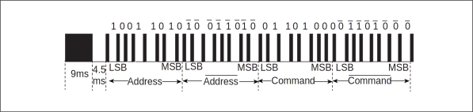
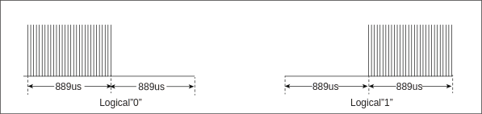

===========
IR
===========

Overview
=====
Infrared Remote Control (IR) is a wireless and non-contact control technique that features strong anti-interference, reliable information transmission, low power consumption, and low cost. The IR radiating circuit uses the IR LED to emit the modulated infrared waves. The receiving circuit consists of infrared receiving diodes, triodes or silicon photocells, which convert the infrared light emitted by the infrared transmitter into corresponding electrical signals, and then send them to the post amplifier.

Features
=========
- Receives data through the fixed NEC and RC5 protocols
- Receives data in any format by pulse width counting
- 64*2 bytes receive FIFO
- End of receiving interrupts

Functional Description
===========
Fixed Protocol Based Receiving
-------------
IR receiving supports the fixed NEC and RC5 protocols.

- NEC Protocol

Logical '1' and logical '0' waveforms of the NEC protocol are shown as follows:

.. figure:: ../../picture/IRNecLogical.svg
   :align: center

   NEC Logic Waveform

Logical '1' is 2.25 ms and the pulse time is 560 us. Logical '0' is 1.12 ms and the pulse time is 560 us.
The format of the NEC protocol is shown as follows:

   NEC Protocol Waveform

The head pulse is a 9 ms high-level pulse and a 4.5 ms low-level pulse, followed by an 8-bit address code and its radix-minus-one complement (diminished radix complement), then an 8-bit command code and its radix complement, and the tail pulse is a 560 us high-level pulse and a 560 us low-level pulse.

- RC5 Protocol

Logical '1' and logical '0' waveforms of the RC5 protocol are shown as follows:

   RC5 Logic Waveform

The logical '1' is 1.778 ms, first the 889 us low level and then the 889 us high level. Logical '0' is opposite to the logical 1 waveform.
The format of the RC5 protocol is shown as follows:

.. figure:: ../../picture/IRRc5.svg
   :align: center

   RC5 Protocol Waveform

The first two bits are the Start bits, both logical '1'. The third bit is the toggle bit, which toggles each time a key is released and pressed again. The next 5 bits are address bits and the next 6 bits are command bits.

It is worth noting that to improve the receiving sensitivity, the common infrared integrated receiver outputs a low level after receiving a high level, so you need to enable the receiving toggle function when using the IR receiving function.

Pulse width receiving
-------------
For data in any format other than the NEC and RC5 protocols, IR will count the duration of each high or low level in turn by its clock, and then store the data into the RX FIFO with a depth of 64 and a width of 2 bytes.

IR Interrupt
-------------
IR has a separate receiving end interrupt. During the receiving process, it will use the internal working clock to count the time that each level is maintained. Once the count reaches the set end threshold, a receiving end interrupt will be generated.
The receive interrupt status and clear interrupt can be queried through the register IRRX_INT_STS.

.. only:: html

   .. include:: ir_register.rst

.. raw:: latex

   \input{../../en/content/ir}