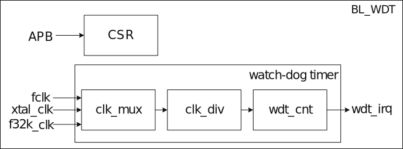

==========
TIMER
==========

Overview
=====
Two 32-bit counters are built in the chip, and each can independently control and configure its parameters and clock frequency.

There is one watchdog counter in the chip. Unpredictable software or hardware behavior may cause the application to malfunction, and the watchdog timer can help recover the system. If the current stage exceeds the preset time, but the watchdog is not reset or turned off, the interrupt or system reset can be triggered as configured.

   Block diagram of timer

   Block diagram of watchdog timer

Features
=========
- Multiple clock sources, up to 80M clock supported
- Bit clock divider with a division factor of 1-256
- Two 32-bit timers:channel 0 and channel 1
- Each timer has three alarm value settings, and the alarm when each set of alarm values overflows can be independently set.
- Supports Free Run mode and Pre_load mode
- With 16-bit watchdog timer
- Supports write password protection to prevent system error caused by wrong settings
- Supports two watchdog overflow modes: interrupt or reset
- Supports measuring the pulse width of external GPIO

Functional Description
==========================

There are 5 types of watchdog timer clocks:

- BCLK--bus clock
- 32K–32K clock
- 1K–1K clock
- XTAL–external crystal oscillator
- GPIO–external GPIO

It is configured by cs_wdt in the register TCCR.

There are 5 types of timer clock sources:

- BCLK--bus clock
- 32K–32K clock
- 1K–1K clock(32K frequency division)
- XTAL–external crystal oscillator
- GPIO–external GPIO

It is configured by cs_2 and cs_3 in the register TCCR.

Each counter has its own 8-bit frequency divider, which can divide the clock by 1-256. Specifically, when it is set to 0, it means no frequency division. When it is set to 1, it will divide the clock by 2, and so on. The maximum division factor is 256, and the counter will take the divided clock as the counting cycle unit.

It is configured by tcdr2, tcdr3, and wcdr in the register TCDR.

Working Principle of General Purpose Timer
--------------------
Each general purpose timer contains three comparators, one counter, and one PreLoad register. When the clock source is set and the timer is started, the counter starts to count up cumulatively. When the value of counter is equal to that of the comparator, the comparison flag is set and a comparison interrupt can be generated.

You can configure the value of channel 0 comparator 0 by setting tclr2_0, that of channel 0 comparator 1 by setting tclr2_1, and that of channel 0 comparator 2 by setting tclr2_2 in the register TICR2. The tplvr2 in the register TPLVR2 sets the channel 0 preload value.

You can configure the value of channel 1 comparator 0 by setting tclr3_0, that of channel 1 comparator 1 by setting tclr3_1, and that of channel 1 comparator 2 by setting tclr3_2 in the register TICR3. The tplvr3 in the register TPLVR3 sets the channel 1 preload value.

The counter's initial value depends on the timing mode. In the FreeRun mode, this initial value is 0, and then the counter counts up cumulatively. After reaching the maximum value, it starts counting again from 0.

In the PreLoad mode, this initial value is the value of the PreLoad register, and then counts up cumulatively. When the PreLoad condition is met, the counter's value is set to the value of the PreLoad register, and then the counter starts counting up cumulatively again. In the counting process of the timer's counter, once the counter's value is consistent with one comparison value of three comparators, the comparison flag of the comparator will be set, and the corresponding comparison interrupt can be generated.

You can configure the counting mode of channel 0 by setting timer2_mode and that of channel 1 by setting timer3_mode in the register TCMR.

If the value of the PreLoad register is 10, and the values of comparators 0, 1, and 2 are 13, 16, and 19 respectively, the working sequence of the timer in the PreLoad mode is as follows:

.. figure:: ../../picture/TimerPreload.svg
   :align: center

   Working sequence of timer in preLoad mode

In FreeRun mode, the working timing of the timer is basically the same as that of PreLoad, except that the counter will accumulate from 0 to the maximum value, and the mechanism of comparison flag and comparison interrupt generated during this period is the same as that of FreeRun mode.

channel 0 can use the internal clock source to calculate the pulse width of the external gpio.
This function is enabled by setting timer2_gpio_en in the register GPIO. By setting the timer2_gpio_inv bit, it is judged whether the high level or low level of the external gpio is obtained. If the bit is 0, it means high level; if the bit is 1, it means Low level; in addition, the external gpio function needs to be set to the gpio_tmr_clk function. By configuring the gpio_tmr_clk_sel[13:12] bits in the register dig_clk_cfg2 in the GLB module; at the same time, you need to configure a bit in the register dig_clk_cfg2[11:8] to 0, which needs to be used in conjunction with gpio_tmr_clk_sel. details as follows:

- If gpio_tmr_clk_sel[13:12] is configured as 0, then chip_clk_out_0_en in register dig_clk_cfg2 is set to 0
- If gpio_tmr_clk_sel[13:12] is configured as 1, then chip_clk_out_1_en in register dig_clk_cfg2 is set to 0
- If gpio_tmr_clk_sel[13:12] is configured as 2, then chip_clk_out_2_en in register dig_clk_cfg2 is set to 0
- If gpio_tmr_clk_sel[13:12] is configured as 3, then chip_clk_out_3_en in register dig_clk_cfg2 is set to 0

After the configuration is complete, enable the timer. When the gpio_lat_ok in the register GPIO is set to 1, the values ​​of the register GPIO_LAT2 and the register GPIO_LAT1 are obtained.
The calculation method of the pulse width of the external gpio: (GPIO_LAT2-GPIO_LAT1)\* the width of 1 cycle of the internal clock source of the timer.

For example: the internal clock source of the timer is 80M, the frequency of the external gpio is 2M, and the duty ratio is 1:1. Write 1 to the timer2_gpio_inv bit to calculate the width of the low level of the external gpio.
After the above configuration is completed, the difference between the register GPIO_LAT2 and the register GPIO_LAT1 is 20, then the low level width of the external gpio is: 20 \*(1 / 80000000) = 1 / 4000000;
Write 0 to the timer2_gpio_inv bit, which means to calculate the width of the high level of the external gpio.
After the above configuration is completed, the difference between the register GPIO_LAT2 and the register GPIO_LAT1 is 20, then the high level width of the external gpio is: 20 \*(1 / 80000000) = 1 / 4000000;

Working Principle of Watchdog Timer
----------------------
The watchdog timer integrates a counter and a comparator. The counter counts up from 0 cumulatively. If the counter is reset, it counts up again from 0. When the value of counter is equal to that of the comparator, it can generate a comparison interrupt signal or a system reset signal. Users may use one of them as required.
The watchdog counter will add 1 to each counting cycle unit, and the software can reset this counter to zero through APB at any time.

The wmr in the register WMR sets the comparison value.

If the comparator value is 6, the working sequence of Watchdog is shown as follows:

.. figure:: ../../picture/WatchDog.svg
   :align: center

   Working sequence of watchdog

Alarm Setting
-----------
Each set of counter has three comparison values to provide software settings, and it can set whether each comparison value triggers an alarm interrupt. When the counter's value matches the comparison value and an alarm will be given, the counter will notify the processor through interrupts.

Through APB, the software can read whether there is an alarm at present and which comparison value triggers the alarm interrupt. When the alarm interrupt is cleared, the alarm state will also be cleared synchronously.

Watchdog Alarm
-----------
Each counter can be configured with one comparison value. When the watchdog counter is too late to be reset to zero due to a system error, which causes the watchdog counter to exceed the comparison value, it will trigger the watchdog alarm. There are two alarm modes. One is to notify the software to process it by generating an interrupt. The other one is to perform watchdog reset. When the watchdog reset is triggered, it will notify the system's reset controller and prepare for system reset. When everything is ready, the watchdog reset will be performed. It is worth noting that the software can read WSR register through APB to know whether watchdog reset has occurred.

.. figure:: ../../picture/WatchDogAlarm.svg
   :align: center

   Watchdog alarm mechanism

.. only:: html

   .. include:: ltmr_register.rst

.. raw:: latex

   \input{../../en/content/ltmr}