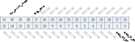
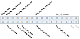
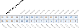
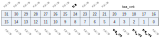

Register description
==========================

+----------------------+------------------------------+
| Name                 | Description                  |
+----------------------+------------------------------+
| `audac_0`_           | Clock control register       |
+----------------------+------------------------------+
| `audac_status`_      | Status register              |
+----------------------+------------------------------+
| `audac_s0`_          | Volume control register 1    |
+----------------------+------------------------------+
| `audac_s0_misc`_     | Volume control register 2    |
+----------------------+------------------------------+
| `audac_zd_0`_        | zero detect control register |
+----------------------+------------------------------+
| `audac_1`_           |                              |
+----------------------+------------------------------+
| `audac_fifo_ctrl`_   | fifo control register        |
+----------------------+------------------------------+
| `audac_fifo_status`_ | fifo status register         |
+----------------------+------------------------------+
| `audac_fifo_data`_   | fifo data register           |
+----------------------+------------------------------+

audac_0
---------
 
**Address：**  0x20055000
 

.. table::
    :widths: 10, 15,10,10,55
    :width: 100%
    :align: center
     
    +----------+------------------------------+--------+-------------+----------------------------------------------------------------------------------------------------------------------------------------------------------------------------------------------+
    | Bit      | Name                         |Type    | Reset       | Description                                                                                                                                                                                  |
    +==========+==============================+========+=============+==============================================================================================================================================================================================+
    | 31:28    | au_pwm_mode                  | r/w    | 4'd0        | pwm output mode,rang 0 ~ 6:                                                                                                                                                                  |
    +          +                              +        +             +                                                                                                                                                                                              +
    |          |                              |        |             | 0:8KHz, 1:16KHz, 2:32KHz, 3:24KHz, 4:48KHz, 5:22.05KHz, 6:44.1KHz                                                                                                                            |
    +          +                              +        +             +                                                                                                                                                                                              +
    |          |                              |        |             | gpdac output mode,rang 9 ~ 14:                                                                                                                                                               |
    +          +                              +        +             +                                                                                                                                                                                              +
    |          |                              |        |             | 9:16KHz, 10:32KHz, 11:24KHz, 12:48KHz, 13:22.05KHz, 14:44.1KHz,                                                                                                                              |
    +----------+------------------------------+--------+-------------+----------------------------------------------------------------------------------------------------------------------------------------------------------------------------------------------+
    | 27       | ckg_ena                      | r/w    | 1           | enabl eclock gen                                                                                                                                                                             |
    +----------+------------------------------+--------+-------------+----------------------------------------------------------------------------------------------------------------------------------------------------------------------------------------------+
    | 26:2     | RSVD                         |        |             |                                                                                                                                                                                              |
    +----------+------------------------------+--------+-------------+----------------------------------------------------------------------------------------------------------------------------------------------------------------------------------------------+
    | 1        | dac_itf_en                   | r/w    | 0           | enable dac to audio dma interface                                                                                                                                                            |
    +----------+------------------------------+--------+-------------+----------------------------------------------------------------------------------------------------------------------------------------------------------------------------------------------+
    | 0        | dac_0_en                     | r/w    | 0           | enable dac ch0                                                                                                                                                                               |
    +----------+------------------------------+--------+-------------+----------------------------------------------------------------------------------------------------------------------------------------------------------------------------------------------+

audac_status
--------------
 
**Address：**  0x20055004
 
.. figure:: ../../picture/audac_audac_status.svg
   :align: center

.. table::
    :widths: 10, 15,10,10,55
    :width: 100%
    :align: center
     
    +----------+------------------------------+--------+-------------+------------------------------+
    | Bit      | Name                         |Type    | Reset       | Description                  |
    +==========+==============================+========+=============+==============================+
    | 31:25    | RSVD                         |        |             |                              |
    +----------+------------------------------+--------+-------------+------------------------------+
    | 24       | audio_int_all                | r      | 0           | mute signal to analog        |
    +----------+------------------------------+--------+-------------+------------------------------+
    | 23       | zd_amute                     | r      | 0           | zero detect signal to analog |
    +----------+------------------------------+--------+-------------+------------------------------+
    | 22:18    | RSVD                         |        |             |                              |
    +----------+------------------------------+--------+-------------+------------------------------+
    | 17       | dac_s0_int_clr               | r/w    | 0           | clear and close interrupt    |
    +----------+------------------------------+--------+-------------+------------------------------+
    | 16       | dac_s0_int                   | r      | 0           | mute done interrupt status   |
    +----------+------------------------------+--------+-------------+------------------------------+
    | 15:14    | RSVD                         |        |             |                              |
    +----------+------------------------------+--------+-------------+------------------------------+
    | 13       | dac_h0_mute_done             | r      | 1           | dvga mute done               |
    +----------+------------------------------+--------+-------------+------------------------------+
    | 12       | dac_h0_busy                  | r      | 0           | dvga busy                    |
    +----------+------------------------------+--------+-------------+------------------------------+
    | 11:0     | RSVD                         |        |             |                              |
    +----------+------------------------------+--------+-------------+------------------------------+

audac_s0
----------
 
**Address：**  0x20055008
 

.. table::
    :widths: 10, 15,10,10,55
    :width: 100%
    :align: center
     
    +----------+------------------------------+--------+-------------+-------------------------------------------------------------------------------------------------------------------------------------------------------------------------------------------------+
    | Bit      | Name                         |Type    | Reset       | Description                                                                                                                                                                                     |
    +==========+==============================+========+=============+=================================================================================================================================================================================================+
    | 31       | dac_s0_mute                  | r/w    | 0           | dac dpga ch0 sw volume control                                                                                                                                                                  |
    +          +                              +        +             +                                                                                                                                                                                                 +
    |          |                              |        |             | 1:mute                                                                                                                                                                                          |
    +----------+------------------------------+--------+-------------+-------------------------------------------------------------------------------------------------------------------------------------------------------------------------------------------------+
    | 30       | dac_s0_mute_softmode         | r/w    | 1           | 0:mute directly, 1:mute with ramp down                                                                                                                                                          |
    +----------+------------------------------+--------+-------------+-------------------------------------------------------------------------------------------------------------------------------------------------------------------------------------------------+
    | 29:26    | dac_s0_mute_rmpdn_rate       | r/w    | 4'd6        | mute ramp down rate:                                                                                                                                                                            |
    +          +                              +        +             +                                                                                                                                                                                                 +
    |          |                              |        |             | 0:2 fs sample                                                                                                                                                                                   |
    +          +                              +        +             +                                                                                                                                                                                                 +
    |          |                              |        |             | 1:4 fs sample                                                                                                                                                                                   |
    +          +                              +        +             +                                                                                                                                                                                                 +
    |          |                              |        |             | 2:8 fs sample                                                                                                                                                                                   |
    +          +                              +        +             +                                                                                                                                                                                                 +
    |          |                              |        |             | 3:16 fs sample                                                                                                                                                                                  |
    +          +                              +        +             +                                                                                                                                                                                                 +
    |          |                              |        |             | 4:32 fs sample                                                                                                                                                                                  |
    +          +                              +        +             +                                                                                                                                                                                                 +
    |          |                              |        |             | 5:64 fs sample                                                                                                                                                                                  |
    +          +                              +        +             +                                                                                                                                                                                                 +
    |          |                              |        |             | 6:128 fs sample                                                                                                                                                                                 |
    +          +                              +        +             +                                                                                                                                                                                                 +
    |          |                              |        |             | 7:256 fs sample                                                                                                                                                                                 |
    +          +                              +        +             +                                                                                                                                                                                                 +
    |          |                              |        |             | 8:512 fs sample                                                                                                                                                                                 |
    +          +                              +        +             +                                                                                                                                                                                                 +
    |          |                              |        |             | 9:1024 fs sample                                                                                                                                                                                |
    +          +                              +        +             +                                                                                                                                                                                                 +
    |          |                              |        |             | 8:2048 fs sample                                                                                                                                                                                |
    +          +                              +        +             +                                                                                                                                                                                                 +
    |          |                              |        |             |                                                                                                                                                                                                 |
    +----------+------------------------------+--------+-------------+-------------------------------------------------------------------------------------------------------------------------------------------------------------------------------------------------+
    | 25:22    | dac_s0_mute_rmpup_rate       | r/w    | 4'd0        | mute ramp up rate                                                                                                                                                                               |
    +          +                              +        +             +                                                                                                                                                                                                 +
    |          |                              |        |             | 0:2 fs sample                                                                                                                                                                                   |
    +          +                              +        +             +                                                                                                                                                                                                 +
    |          |                              |        |             | 1:4 fs sample                                                                                                                                                                                   |
    +          +                              +        +             +                                                                                                                                                                                                 +
    |          |                              |        |             | 2:8 fs sample                                                                                                                                                                                   |
    +          +                              +        +             +                                                                                                                                                                                                 +
    |          |                              |        |             | 3:16 fs sample                                                                                                                                                                                  |
    +          +                              +        +             +                                                                                                                                                                                                 +
    |          |                              |        |             | 4:32 fs sample                                                                                                                                                                                  |
    +          +                              +        +             +                                                                                                                                                                                                 +
    |          |                              |        |             | 5:64 fs sample                                                                                                                                                                                  |
    +          +                              +        +             +                                                                                                                                                                                                 +
    |          |                              |        |             | 6:128 fs sample                                                                                                                                                                                 |
    +          +                              +        +             +                                                                                                                                                                                                 +
    |          |                              |        |             | 7:256 fs sample                                                                                                                                                                                 |
    +          +                              +        +             +                                                                                                                                                                                                 +
    |          |                              |        |             | 8:512 fs sample                                                                                                                                                                                 |
    +          +                              +        +             +                                                                                                                                                                                                 +
    |          |                              |        |             | 9:1024 fs sample                                                                                                                                                                                |
    +          +                              +        +             +                                                                                                                                                                                                 +
    |          |                              |        |             | 8:2048 fs sample                                                                                                                                                                                |
    +----------+------------------------------+--------+-------------+-------------------------------------------------------------------------------------------------------------------------------------------------------------------------------------------------+
    | 21:13    | dac_s0_volume                | r/w    | 9'd0        | volume s9.1, -95.5dB ~ +18dB in 0.5dB step                                                                                                                                                      |
    +----------+------------------------------+--------+-------------+-------------------------------------------------------------------------------------------------------------------------------------------------------------------------------------------------+
    | 12       | dac_s0_volume_update         | r/w    | 0           | enable volume update                                                                                                                                                                            |
    +----------+------------------------------+--------+-------------+-------------------------------------------------------------------------------------------------------------------------------------------------------------------------------------------------+
    | 11:10    | dac_s0_ctrl_mode             | r/w    | 2'd2        | 0:direct force volume, 1:update volume at zero crossing, 2:update volume with ramp                                                                                                              |
    +----------+------------------------------+--------+-------------+-------------------------------------------------------------------------------------------------------------------------------------------------------------------------------------------------+
    | 9:6      | dac_s0_ctrl_zcd_rate         | r/w    | 4'd2        | zero crossing rate                                                                                                                                                                              |
    +          +                              +        +             +                                                                                                                                                                                                 +
    |          |                              |        |             | 0:2 fs sample                                                                                                                                                                                   |
    +          +                              +        +             +                                                                                                                                                                                                 +
    |          |                              |        |             | 1:4 fs sample                                                                                                                                                                                   |
    +          +                              +        +             +                                                                                                                                                                                                 +
    |          |                              |        |             | 2:8 fs sample                                                                                                                                                                                   |
    +          +                              +        +             +                                                                                                                                                                                                 +
    |          |                              |        |             | 3:16 fs sample                                                                                                                                                                                  |
    +          +                              +        +             +                                                                                                                                                                                                 +
    |          |                              |        |             | 4:32 fs sample                                                                                                                                                                                  |
    +          +                              +        +             +                                                                                                                                                                                                 +
    |          |                              |        |             | 5:64 fs sample                                                                                                                                                                                  |
    +          +                              +        +             +                                                                                                                                                                                                 +
    |          |                              |        |             | 6:128 fs sample                                                                                                                                                                                 |
    +          +                              +        +             +                                                                                                                                                                                                 +
    |          |                              |        |             | 7:256 fs sample                                                                                                                                                                                 |
    +          +                              +        +             +                                                                                                                                                                                                 +
    |          |                              |        |             | 8:512 fs sample                                                                                                                                                                                 |
    +          +                              +        +             +                                                                                                                                                                                                 +
    |          |                              |        |             | 9:1024 fs sample                                                                                                                                                                                |
    +          +                              +        +             +                                                                                                                                                                                                 +
    |          |                              |        |             | 8:2048 fs sample                                                                                                                                                                                |
    +----------+------------------------------+--------+-------------+-------------------------------------------------------------------------------------------------------------------------------------------------------------------------------------------------+
    | 5:2      | dac_s0_ctrl_rmp_rate         | r/w    | 4'd6        | ramp rate                                                                                                                                                                                       |
    +          +                              +        +             +                                                                                                                                                                                                 +
    |          |                              |        |             | 0:2 fs sample                                                                                                                                                                                   |
    +          +                              +        +             +                                                                                                                                                                                                 +
    |          |                              |        |             | 1:4 fs sample                                                                                                                                                                                   |
    +          +                              +        +             +                                                                                                                                                                                                 +
    |          |                              |        |             | 2:8 fs sample                                                                                                                                                                                   |
    +          +                              +        +             +                                                                                                                                                                                                 +
    |          |                              |        |             | 3:16 fs sample                                                                                                                                                                                  |
    +          +                              +        +             +                                                                                                                                                                                                 +
    |          |                              |        |             | 4:32 fs sample                                                                                                                                                                                  |
    +          +                              +        +             +                                                                                                                                                                                                 +
    |          |                              |        |             | 5:64 fs sample                                                                                                                                                                                  |
    +          +                              +        +             +                                                                                                                                                                                                 +
    |          |                              |        |             | 6:128 fs sample                                                                                                                                                                                 |
    +          +                              +        +             +                                                                                                                                                                                                 +
    |          |                              |        |             | 7:256 fs sample                                                                                                                                                                                 |
    +          +                              +        +             +                                                                                                                                                                                                 +
    |          |                              |        |             | 8:512 fs sample                                                                                                                                                                                 |
    +          +                              +        +             +                                                                                                                                                                                                 +
    |          |                              |        |             | 9:1024 fs sample                                                                                                                                                                                |
    +          +                              +        +             +                                                                                                                                                                                                 +
    |          |                              |        |             | 8:2048 fs sample                                                                                                                                                                                |
    +----------+------------------------------+--------+-------------+-------------------------------------------------------------------------------------------------------------------------------------------------------------------------------------------------+
    | 1:0      | RSVD                         |        |             |                                                                                                                                                                                                 |
    +----------+------------------------------+--------+-------------+-------------------------------------------------------------------------------------------------------------------------------------------------------------------------------------------------+

audac_s0_misc
---------------
 
**Address：**  0x2005500c
 

.. table::
    :widths: 10, 15,10,10,55
    :width: 100%
    :align: center
     
    +----------+------------------------------+--------+-------------+---------------------------------------------------------------------------------------------------------------------------------------------------------------------------------------------------------+
    | Bit      | Name                         |Type    | Reset       | Description                                                                                                                                                                                             |
    +==========+==============================+========+=============+=========================================================================================================================================================================================================+
    | 31:28    | dac_s0_ctrl_zcd_timeout      | r/w    | 4'd4        | zero crossing time out period                                                                                                                                                                           |
    +          +                              +        +             +                                                                                                                                                                                                         +
    |          |                              |        |             | 0:2 fs sample                                                                                                                                                                                           |
    +          +                              +        +             +                                                                                                                                                                                                         +
    |          |                              |        |             | 1:4 fs sample                                                                                                                                                                                           |
    +          +                              +        +             +                                                                                                                                                                                                         +
    |          |                              |        |             | 2:8 fs sample                                                                                                                                                                                           |
    +          +                              +        +             +                                                                                                                                                                                                         +
    |          |                              |        |             | 3:16 fs sample                                                                                                                                                                                          |
    +          +                              +        +             +                                                                                                                                                                                                         +
    |          |                              |        |             | 4:32 fs sample                                                                                                                                                                                          |
    +          +                              +        +             +                                                                                                                                                                                                         +
    |          |                              |        |             | 5:64 fs sample                                                                                                                                                                                          |
    +          +                              +        +             +                                                                                                                                                                                                         +
    |          |                              |        |             | 6:128 fs sample                                                                                                                                                                                         |
    +          +                              +        +             +                                                                                                                                                                                                         +
    |          |                              |        |             | 7:256 fs sample                                                                                                                                                                                         |
    +          +                              +        +             +                                                                                                                                                                                                         +
    |          |                              |        |             | 8:512 fs sample                                                                                                                                                                                         |
    +          +                              +        +             +                                                                                                                                                                                                         +
    |          |                              |        |             | 9:1024 fs sample                                                                                                                                                                                        |
    +          +                              +        +             +                                                                                                                                                                                                         +
    |          |                              |        |             | 8:2048 fs sample                                                                                                                                                                                        |
    +----------+------------------------------+--------+-------------+---------------------------------------------------------------------------------------------------------------------------------------------------------------------------------------------------------+
    | 27:0     | RSVD                         |        |             |                                                                                                                                                                                                         |
    +----------+------------------------------+--------+-------------+---------------------------------------------------------------------------------------------------------------------------------------------------------------------------------------------------------+

audac_zd_0
------------
 
**Address：**  0x20055010
 
.. figure:: ../../picture/audac_audac_zd_0.svg
   :align: center

.. table::
    :widths: 10, 15,10,10,55
    :width: 100%
    :align: center
     
    +----------+------------------------------+--------+-------------+--------------------+
    | Bit      | Name                         |Type    | Reset       | Description        |
    +==========+==============================+========+=============+====================+
    | 31:17    | RSVD                         |        |             |                    |
    +----------+------------------------------+--------+-------------+--------------------+
    | 16       | zd_en                        | r/w    | 0           | enable zero detect |
    +----------+------------------------------+--------+-------------+--------------------+
    | 15       | RSVD                         |        |             |                    |
    +----------+------------------------------+--------+-------------+--------------------+
    | 14:0     | zd_time                      | r/w    | 15'd512     | number of zeros    |
    +----------+------------------------------+--------+-------------+--------------------+

audac_1
---------
 
**Address：**  0x20055014
 
.. figure:: ../../picture/audac_audac_1.svg
   :align: center

.. table::
    :widths: 10, 15,10,10,55
    :width: 100%
    :align: center
     
    +----------+------------------------------+--------+-------------+-----------------------------------------------------------------+
    | Bit      | Name                         |Type    | Reset       | Description                                                     |
    +==========+==============================+========+=============+=================================================================+
    | 31:17    | RSVD                         |        |             |                                                                 |
    +----------+------------------------------+--------+-------------+-----------------------------------------------------------------+
    | 16:15    | dac_dsm_dither_prbs_mode     | r/w    | 0           | dac dsm dither lfsr mode:0:LFSR32, 1:LFSR24, 2:LFSR16, 3:LFSR12 |
    +----------+------------------------------+--------+-------------+-----------------------------------------------------------------+
    | 14       | dac_dsm_dither_en            | r/w    | 1           | enable dac dsm dither                                           |
    +----------+------------------------------+--------+-------------+-----------------------------------------------------------------+
    | 13:11    | dac_dsm_dither_amp           | r/w    | 0           | dac dsm dither amplitue                                         |
    +----------+------------------------------+--------+-------------+-----------------------------------------------------------------+
    | 10       | dac_dsm_scaling_en           | r/w    | 1           | enable dac dsm scaling                                          |
    +----------+------------------------------+--------+-------------+-----------------------------------------------------------------+
    | 9        | RSVD                         |        |             |                                                                 |
    +----------+------------------------------+--------+-------------+-----------------------------------------------------------------+
    | 8:7      | dac_dsm_scaling_mode         | r/w    | 0           | dac dsm scaling value;  u4.4                                    |
    +----------+------------------------------+--------+-------------+-----------------------------------------------------------------+
    | 6:5      | dac_dsm_order                | r/w    | 0           | 0: 2-order, 1: 3-order                                          |
    +----------+------------------------------+--------+-------------+-----------------------------------------------------------------+
    | 4        | dac_dsm_out_fmt              | r/w    | 0           | offset binary 1:2's complement                                  |
    +----------+------------------------------+--------+-------------+-----------------------------------------------------------------+
    | 3:2      | RSVD                         |        |             |                                                                 |
    +----------+------------------------------+--------+-------------+-----------------------------------------------------------------+
    | 1:0      | dac_mix_sel                  | r/w    | 0           | L channel, 1:R channel, 2: L+R, 3: (L+R)/2                      |
    +----------+------------------------------+--------+-------------+-----------------------------------------------------------------+

audac_fifo_ctrl
-----------------
 
**Address：**  0x2005508c
 
.. figure:: ../../picture/audac_audac_fifo_ctrl.svg
   :align: center

.. table::
    :widths: 10, 15,10,10,55
    :width: 100%
    :align: center
     
    +----------+------------------------------+--------+-------------+----------------------------------------------------------------------------------------------------------------------------------------------------------------------------------------------------------------------------------------------------------------------------------------------------------------------------------------------------------------------------------------------------------------------------------------------------------------------------------------------+
    | Bit      | Name                         |Type    | Reset       | Description                                                                                                                                                                                                                                                                                                                                                                                                                                                                                  |
    +==========+==============================+========+=============+==============================================================================================================================================================================================================================================================================================================================================================================================================================================================================================+
    | 31:26    | RSVD                         |        |             |                                                                                                                                                                                                                                                                                                                                                                                                                                                                                              |
    +----------+------------------------------+--------+-------------+----------------------------------------------------------------------------------------------------------------------------------------------------------------------------------------------------------------------------------------------------------------------------------------------------------------------------------------------------------------------------------------------------------------------------------------------------------------------------------------------+
    | 25:24    | tx_data_mode                 | r/w    | 2'b0        | TX_FIFO_DATIN_MODE.                                                                                                                                                                                                                                                                                                                                                                                                                                                                          |
    +          +                              +        +             +                                                                                                                                                                                                                                                                                                                                                                                                                                                                                              +
    |          |                              |        |             | TX FIFO DATA Input Mode (Mode 0, 1, 2, 3)                                                                                                                                                                                                                                                                                                                                                                                                                                                    |
    +          +                              +        +             +                                                                                                                                                                                                                                                                                                                                                                                                                                                                                              +
    |          |                              |        |             | Mode 0: Valid data's MSB is at [31] of TX_FIFO register                                                                                                                                                                                                                                                                                                                                                                                                                                      |
    +          +                              +        +             +                                                                                                                                                                                                                                                                                                                                                                                                                                                                                              +
    |          |                              |        |             | Mode 1: Valid data's MSB is at [23] of TX_FIFO register                                                                                                                                                                                                                                                                                                                                                                                                                                      |
    +          +                              +        +             +                                                                                                                                                                                                                                                                                                                                                                                                                                                                                              +
    |          |                              |        |             | Mode 2: Valid data's MSB is at [19] of TX_FIFO register                                                                                                                                                                                                                                                                                                                                                                                                                                      |
    +          +                              +        +             +                                                                                                                                                                                                                                                                                                                                                                                                                                                                                              +
    |          |                              |        |             | Mode 3: Valid data's MSB is at [15] of TX_FIFO register                                                                                                                                                                                                                                                                                                                                                                                                                                      |
    +          +                              +        +             +                                                                                                                                                                                                                                                                                                                                                                                                                                                                                              +
    |          |                              |        |             | For 16-bits transmitted audio sample:                                                                                                                                                                                                                                                                                                                                                                                                                                                        |
    +          +                              +        +             +                                                                                                                                                                                                                                                                                                                                                                                                                                                                                              +
    |          |                              |        |             | Mode 0: FIFO_I[15:0] = {TXDATA[31:16]}                                                                                                                                                                                                                                                                                                                                                                                                                                                       |
    +          +                              +        +             +                                                                                                                                                                                                                                                                                                                                                                                                                                                                                              +
    |          |                              |        |             | Mode 1: FIFO_I[15:0] = {TXDATA[23:8]}                                                                                                                                                                                                                                                                                                                                                                                                                                                        |
    +          +                              +        +             +                                                                                                                                                                                                                                                                                                                                                                                                                                                                                              +
    |          |                              |        |             | Mode 2: FIFO_I[15:0] = {TXDATA[19:4]}                                                                                                                                                                                                                                                                                                                                                                                                                                                        |
    +          +                              +        +             +                                                                                                                                                                                                                                                                                                                                                                                                                                                                                              +
    |          |                              |        |             | Mode 3: FIFO_I[15:0] = {TXDATA[15:0]}                                                                                                                                                                                                                                                                                                                                                                                                                                                        |
    +----------+------------------------------+--------+-------------+----------------------------------------------------------------------------------------------------------------------------------------------------------------------------------------------------------------------------------------------------------------------------------------------------------------------------------------------------------------------------------------------------------------------------------------------------------------------------------------------+
    | 23:21    | RSVD                         |        |             |                                                                                                                                                                                                                                                                                                                                                                                                                                                                                              |
    +----------+------------------------------+--------+-------------+----------------------------------------------------------------------------------------------------------------------------------------------------------------------------------------------------------------------------------------------------------------------------------------------------------------------------------------------------------------------------------------------------------------------------------------------------------------------------------------------+
    | 20:16    | tx_trg_level                 | r/w    | 5'd7        | TX_FIFO_TRG_LEVEL.                                                                                                                                                                                                                                                                                                                                                                                                                                                                           |
    +          +                              +        +             +                                                                                                                                                                                                                                                                                                                                                                                                                                                                                              +
    |          |                              |        |             | TX FIFO Trigger Level (TXTL[4:0])                                                                                                                                                                                                                                                                                                                                                                                                                                                            |
    +          +                              +        +             +                                                                                                                                                                                                                                                                                                                                                                                                                                                                                              +
    |          |                              |        |             | Interrupt and DMA request trigger level for TX FIFO room available condition                                                                                                                                                                                                                                                                                                                                                                                                                 |
    +          +                              +        +             +                                                                                                                                                                                                                                                                                                                                                                                                                                                                                              +
    |          |                              |        |             | IRQ/DRQ Generated when WLEVEL > TXTL[4:0]                                                                                                                                                                                                                                                                                                                                                                                                                                                    |
    +          +                              +        +             +                                                                                                                                                                                                                                                                                                                                                                                                                                                                                              +
    |          |                              |        |             | Notes:                                                                                                                                                                                                                                                                                                                                                                                                                                                                                       |
    +          +                              +        +             +                                                                                                                                                                                                                                                                                                                                                                                                                                                                                              +
    |          |                              |        |             | WLEVEL represents the number of room available in the TX FIFO                                                                                                                                                                                                                                                                                                                                                                                                                                |
    +----------+------------------------------+--------+-------------+----------------------------------------------------------------------------------------------------------------------------------------------------------------------------------------------------------------------------------------------------------------------------------------------------------------------------------------------------------------------------------------------------------------------------------------------------------------------------------------------+
    | 15:14    | tx_drq_cnt                   | r/w    | 2'b0        | DAC_DRQ_CLR_CNT.                                                                                                                                                                                                                                                                                                                                                                                                                                                                             |
    +          +                              +        +             +                                                                                                                                                                                                                                                                                                                                                                                                                                                                                              +
    |          |                              |        |             | When TX FIFO available room less than or equal N, DRQ Request will be de-asserted. N is defined here:                                                                                                                                                                                                                                                                                                                                                                                        |
    +          +                              +        +             +                                                                                                                                                                                                                                                                                                                                                                                                                                                                                              +
    |          |                              |        |             | 00: IRQ/DRQ de-asserted when WLEVEL <= TXTL[4:0]                                                                                                                                                                                                                                                                                                                                                                                                                                             |
    +          +                              +        +             +                                                                                                                                                                                                                                                                                                                                                                                                                                                                                              +
    |          |                              |        |             | 01: IRQ/DRQ de-asserted when WLEVEL < 2                                                                                                                                                                                                                                                                                                                                                                                                                                                      |
    +          +                              +        +             +                                                                                                                                                                                                                                                                                                                                                                                                                                                                                              +
    |          |                              |        |             | 10: IRQ/DRQ de-asserted when WLEVEL < 4                                                                                                                                                                                                                                                                                                                                                                                                                                                      |
    +          +                              +        +             +                                                                                                                                                                                                                                                                                                                                                                                                                                                                                              +
    |          |                              |        |             | 11: IRQ/DRQ de-asserted when WLEVEL < 8                                                                                                                                                                                                                                                                                                                                                                                                                                                      |
    +          +                              +        +             +                                                                                                                                                                                                                                                                                                                                                                                                                                                                                              +
    |          |                              |        |             | WLEVEL represents the number of room available in the TX FIFO                                                                                                                                                                                                                                                                                                                                                                                                                                |
    +----------+------------------------------+--------+-------------+----------------------------------------------------------------------------------------------------------------------------------------------------------------------------------------------------------------------------------------------------------------------------------------------------------------------------------------------------------------------------------------------------------------------------------------------------------------------------------------------+
    | 13:10    | RSVD                         |        |             |                                                                                                                                                                                                                                                                                                                                                                                                                                                                                              |
    +----------+------------------------------+--------+-------------+----------------------------------------------------------------------------------------------------------------------------------------------------------------------------------------------------------------------------------------------------------------------------------------------------------------------------------------------------------------------------------------------------------------------------------------------------------------------------------------------+
    | 9:8      | tx_ch_en                     | r/w    | 2'b0        | TX_FIFO_DATOUT_DST.                                                                                                                                                                                                                                                                                                                                                                                                                                                                          |
    +          +                              +        +             +                                                                                                                                                                                                                                                                                                                                                                                                                                                                                              +
    |          |                              |        |             | TX FIFO Data Output Destination Select.                                                                                                                                                                                                                                                                                                                                                                                                                                                      |
    +          +                              +        +             +                                                                                                                                                                                                                                                                                                                                                                                                                                                                                              +
    |          |                              |        |             | 0: Disable 1: Enable                                                                                                                                                                                                                                                                                                                                                                                                                                                                         |
    +          +                              +        +             +                                                                                                                                                                                                                                                                                                                                                                                                                                                                                              +
    |          |                              |        |             | Bit9: DAC2 data                                                                                                                                                                                                                                                                                                                                                                                                                                                                              |
    +          +                              +        +             +                                                                                                                                                                                                                                                                                                                                                                                                                                                                                              +
    |          |                              |        |             | Bit8: DAC1 data                                                                                                                                                                                                                                                                                                                                                                                                                                                                              |
    +          +                              +        +             +                                                                                                                                                                                                                                                                                                                                                                                                                                                                                              +
    |          |                              |        |             | When some of the above bits set to ’1’, these data are always arranged in order from low-bit to high-bit.(bit8->bit9)                                                                                                                                                                                                                                                                                                                                                                        |
    +----------+------------------------------+--------+-------------+----------------------------------------------------------------------------------------------------------------------------------------------------------------------------------------------------------------------------------------------------------------------------------------------------------------------------------------------------------------------------------------------------------------------------------------------------------------------------------------------+
    | 7:5      | RSVD                         |        |             |                                                                                                                                                                                                                                                                                                                                                                                                                                                                                              |
    +----------+------------------------------+--------+-------------+----------------------------------------------------------------------------------------------------------------------------------------------------------------------------------------------------------------------------------------------------------------------------------------------------------------------------------------------------------------------------------------------------------------------------------------------------------------------------------------------+
    | 4        | tx_drq_en                    | r/w    | 1'b0        | DAC_DRQ_EN.                                                                                                                                                                                                                                                                                                                                                                                                                                                                                  |
    +          +                              +        +             +                                                                                                                                                                                                                                                                                                                                                                                                                                                                                              +
    |          |                              |        |             | DAC FIFO Room Available DRQ Enable.                                                                                                                                                                                                                                                                                                                                                                                                                                                          |
    +          +                              +        +             +                                                                                                                                                                                                                                                                                                                                                                                                                                                                                              +
    |          |                              |        |             | 0: Disable                                                                                                                                                                                                                                                                                                                                                                                                                                                                                   |
    +          +                              +        +             +                                                                                                                                                                                                                                                                                                                                                                                                                                                                                              +
    |          |                              |        |             | 1: Enable                                                                                                                                                                                                                                                                                                                                                                                                                                                                                    |
    +----------+------------------------------+--------+-------------+----------------------------------------------------------------------------------------------------------------------------------------------------------------------------------------------------------------------------------------------------------------------------------------------------------------------------------------------------------------------------------------------------------------------------------------------------------------------------------------------+
    | 3        | txa_int_en                   | r/w    | 1'b0        | DAC_IRQ_EN.                                                                                                                                                                                                                                                                                                                                                                                                                                                                                  |
    +          +                              +        +             +                                                                                                                                                                                                                                                                                                                                                                                                                                                                                              +
    |          |                              |        |             | DAC FIFO Room Available IRQ Enable.                                                                                                                                                                                                                                                                                                                                                                                                                                                          |
    +          +                              +        +             +                                                                                                                                                                                                                                                                                                                                                                                                                                                                                              +
    |          |                              |        |             | 0: Disable                                                                                                                                                                                                                                                                                                                                                                                                                                                                                   |
    +          +                              +        +             +                                                                                                                                                                                                                                                                                                                                                                                                                                                                                              +
    |          |                              |        |             | 1: Enable                                                                                                                                                                                                                                                                                                                                                                                                                                                                                    |
    +----------+------------------------------+--------+-------------+----------------------------------------------------------------------------------------------------------------------------------------------------------------------------------------------------------------------------------------------------------------------------------------------------------------------------------------------------------------------------------------------------------------------------------------------------------------------------------------------+
    | 2        | txu_int_en                   | r/w    | 1'b0        | DAC_UNDERRUN_IRQ_EN.                                                                                                                                                                                                                                                                                                                                                                                                                                                                         |
    +          +                              +        +             +                                                                                                                                                                                                                                                                                                                                                                                                                                                                                              +
    |          |                              |        |             | DAC FIFO Under Run IRQ Enable                                                                                                                                                                                                                                                                                                                                                                                                                                                                |
    +          +                              +        +             +                                                                                                                                                                                                                                                                                                                                                                                                                                                                                              +
    |          |                              |        |             | 0: Disable                                                                                                                                                                                                                                                                                                                                                                                                                                                                                   |
    +          +                              +        +             +                                                                                                                                                                                                                                                                                                                                                                                                                                                                                              +
    |          |                              |        |             | 1: Enable                                                                                                                                                                                                                                                                                                                                                                                                                                                                                    |
    +----------+------------------------------+--------+-------------+----------------------------------------------------------------------------------------------------------------------------------------------------------------------------------------------------------------------------------------------------------------------------------------------------------------------------------------------------------------------------------------------------------------------------------------------------------------------------------------------+
    | 1        | txo_int_en                   | r/w    | 1'b0        | DAC_OVERRUN_IRQ_EN.                                                                                                                                                                                                                                                                                                                                                                                                                                                                          |
    +          +                              +        +             +                                                                                                                                                                                                                                                                                                                                                                                                                                                                                              +
    |          |                              |        |             | DAC FIFO Over Run IRQ Enable                                                                                                                                                                                                                                                                                                                                                                                                                                                                 |
    +          +                              +        +             +                                                                                                                                                                                                                                                                                                                                                                                                                                                                                              +
    |          |                              |        |             | 0: Disable                                                                                                                                                                                                                                                                                                                                                                                                                                                                                   |
    +          +                              +        +             +                                                                                                                                                                                                                                                                                                                                                                                                                                                                                              +
    |          |                              |        |             | 1: Enable                                                                                                                                                                                                                                                                                                                                                                                                                                                                                    |
    +----------+------------------------------+--------+-------------+----------------------------------------------------------------------------------------------------------------------------------------------------------------------------------------------------------------------------------------------------------------------------------------------------------------------------------------------------------------------------------------------------------------------------------------------------------------------------------------------+
    | 0        | tx_fifo_flush                | w1c    | 1'b0        | DAC_FIFO_FLUSH.                                                                                                                                                                                                                                                                                                                                                                                                                                                                              |
    +          +                              +        +             +                                                                                                                                                                                                                                                                                                                                                                                                                                                                                              +
    |          |                              |        |             | DAC FIFO Flush.                                                                                                                                                                                                                                                                                                                                                                                                                                                                              |
    +          +                              +        +             +                                                                                                                                                                                                                                                                                                                                                                                                                                                                                              +
    |          |                              |        |             | Write ‘1’ to flush TX FIFO, self clear to ‘0’.                                                                                                                                                                                                                                                                                                                                                                                                                                               |
    +----------+------------------------------+--------+-------------+----------------------------------------------------------------------------------------------------------------------------------------------------------------------------------------------------------------------------------------------------------------------------------------------------------------------------------------------------------------------------------------------------------------------------------------------------------------------------------------------+

audac_fifo_status
-------------------
 
**Address：**  0x20055090
 

.. table::
    :widths: 10, 15,10,10,55
    :width: 100%
    :align: center
     
    +----------+------------------------------+--------+-------------+-------------------------------------------------------------------------------------------------------------------------------------------------+
    | Bit      | Name                         |Type    | Reset       | Description                                                                                                                                     |
    +==========+==============================+========+=============+=================================================================================================================================================+
    | 31:25    | RSVD                         |        |             |                                                                                                                                                 |
    +----------+------------------------------+--------+-------------+-------------------------------------------------------------------------------------------------------------------------------------------------+
    | 24       | txa                          | r      | 1'b1        | TXA.                                                                                                                                            |
    +          +                              +        +             +                                                                                                                                                 +
    |          |                              |        |             | TX FIFO Room Available                                                                                                                          |
    +          +                              +        +             +                                                                                                                                                 +
    |          |                              |        |             | 0: No room for new sample in TX FIFO                                                                                                            |
    +          +                              +        +             +                                                                                                                                                 +
    |          |                              |        |             | 1: More than one room for new sample in TX FIFO (>= 1 word)                                                                                     |
    +----------+------------------------------+--------+-------------+-------------------------------------------------------------------------------------------------------------------------------------------------+
    | 23:21    | RSVD                         |        |             |                                                                                                                                                 |
    +----------+------------------------------+--------+-------------+-------------------------------------------------------------------------------------------------------------------------------------------------+
    | 20:16    | txa_cnt                      | r      | 5'd16       | TXA_CNT.                                                                                                                                        |
    +          +                              +        +             +                                                                                                                                                 +
    |          |                              |        |             | TX FIFO Available Room Word Counter                                                                                                             |
    +----------+------------------------------+--------+-------------+-------------------------------------------------------------------------------------------------------------------------------------------------+
    | 15:5     | RSVD                         |        |             |                                                                                                                                                 |
    +----------+------------------------------+--------+-------------+-------------------------------------------------------------------------------------------------------------------------------------------------+
    | 4        | txa_int                      | r      | 1'b0        | TXA_INT.                                                                                                                                        |
    +          +                              +        +             +                                                                                                                                                 +
    |          |                              |        |             | TX FIFO Room Available Pending Interrupt                                                                                                        |
    +          +                              +        +             +                                                                                                                                                 +
    |          |                              |        |             | 0: No Pending IRQ                                                                                                                               |
    +          +                              +        +             +                                                                                                                                                 +
    |          |                              |        |             | 1: Room Available Pending IRQ                                                                                                                   |
    +          +                              +        +             +                                                                                                                                                 +
    |          |                              |        |             | Automatic clear if interrupt condition fails.                                                                                                   |
    +----------+------------------------------+--------+-------------+-------------------------------------------------------------------------------------------------------------------------------------------------+
    | 3        | RSVD                         |        |             |                                                                                                                                                 |
    +----------+------------------------------+--------+-------------+-------------------------------------------------------------------------------------------------------------------------------------------------+
    | 2        | txu_int                      | r      | 1'b0        | TXU_INT.                                                                                                                                        |
    +          +                              +        +             +                                                                                                                                                 +
    |          |                              |        |             | TX FIFO Underrun Pending Interrupt                                                                                                              |
    +          +                              +        +             +                                                                                                                                                 +
    |          |                              |        |             | 0: No Pending IRQ                                                                                                                               |
    +          +                              +        +             +                                                                                                                                                 +
    |          |                              |        |             | 1: FIFO Underrun Pending IRQ                                                                                                                    |
    +          +                              +        +             +                                                                                                                                                 +
    |          |                              |        |             | Write ‘1’ to clear this interrupt                                                                                                               |
    +----------+------------------------------+--------+-------------+-------------------------------------------------------------------------------------------------------------------------------------------------+
    | 1        | txo_int                      | r      | 1'b0        | TXO_INT.                                                                                                                                        |
    +          +                              +        +             +                                                                                                                                                 +
    |          |                              |        |             | TX FIFO Overrun Pending Interrupt                                                                                                               |
    +          +                              +        +             +                                                                                                                                                 +
    |          |                              |        |             | 0: No Pending IRQ                                                                                                                               |
    +          +                              +        +             +                                                                                                                                                 +
    |          |                              |        |             | 1: FIFO Overrun Pending IRQ                                                                                                                     |
    +          +                              +        +             +                                                                                                                                                 +
    |          |                              |        |             | Write ‘1’ to clear this interrupt                                                                                                               |
    +----------+------------------------------+--------+-------------+-------------------------------------------------------------------------------------------------------------------------------------------------+
    | 0        | RSVD                         |        |             |                                                                                                                                                 |
    +----------+------------------------------+--------+-------------+-------------------------------------------------------------------------------------------------------------------------------------------------+

audac_fifo_data
-----------------
 
**Address：**  0x20055094
 
.. figure:: ../../picture/audac_audac_fifo_data.svg
   :align: center

.. table::
    :widths: 10, 15,10,10,55
    :width: 100%
    :align: center
     
    +----------+------------------------------+--------+-------------+----------------------------------------------------------------------------------------------------------------------------------------------------------------------------+
    | Bit      | Name                         |Type    | Reset       | Description                                                                                                                                                                |
    +==========+==============================+========+=============+============================================================================================================================================================================+
    | 31:0     | tx_data                      | w      | 32'h0       | TX_DATA.                                                                                                                                                                   |
    +          +                              +        +             +                                                                                                                                                                            +
    |          |                              |        |             | Transmitting left, right channel sample data should be written this register one by one. The left channel sample data is first and then the right channel sample.          |
    +----------+------------------------------+--------+-------------+----------------------------------------------------------------------------------------------------------------------------------------------------------------------------+

