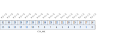

Register description
==========================

+---------------+-------------+
| Name          | Description |
+---------------+-------------+
| `cks_config`_ |             |
+---------------+-------------+
| `data_in`_    |             |
+---------------+-------------+
| `cks_out`_    |             |
+---------------+-------------+

cks_config
------------
 
**Address：**  0x2000a700
 
.. figure:: ../../picture/cks_cks_config.svg
   :align: center

.. table::
    :widths: 10, 15,10,10,55
    :width: 100%
    :align: center
     
    +----------+------------------------------+--------+-------------+-------------------------------------------------------------------------------------------------------------------------------------------------+
    | Bit      | Name                         |Type    | Reset       | Description                                                                                                                                     |
    +==========+==============================+========+=============+=================================================================================================================================================+
    | 31:2     | RSVD                         |        |             |                                                                                                                                                 |
    +----------+------------------------------+--------+-------------+-------------------------------------------------------------------------------------------------------------------------------------------------+
    | 1        | cr_cks_byte_swap             | r/w    | 1'b0        | Byte swap signal for each 16-bit data                                                                                                           |
    +          +                              +        +             +                                                                                                                                                 +
    |          |                              |        |             | 1'b0: The first data pushed should be the upper byte                                                                                            |
    +          +                              +        +             +                                                                                                                                                 +
    |          |                              |        |             | 1'b1: The first data pushed should be the lower byte                                                                                            |
    +----------+------------------------------+--------+-------------+-------------------------------------------------------------------------------------------------------------------------------------------------+
    | 0        | cr_cks_clr                   | w1c    | 1'b0        | Checksum clear (reset) signal                                                                                                                   |
    +----------+------------------------------+--------+-------------+-------------------------------------------------------------------------------------------------------------------------------------------------+

data_in
---------
 
**Address：**  0x2000a704
 
.. figure:: ../../picture/cks_data_in.svg
   :align: center

.. table::
    :widths: 10, 15,10,10,55
    :width: 100%
    :align: center
     
    +----------+------------------------------+--------+-------------+------------+
    | Bit      | Name                         |Type    | Reset       | Description|
    +==========+==============================+========+=============+============+
    | 31:8     | RSVD                         |        |             |            |
    +----------+------------------------------+--------+-------------+------------+
    | 7:0      | data_in                      | w      | x           | Data input |
    +----------+------------------------------+--------+-------------+------------+

cks_out
---------
 
**Address：**  0x2000a708
 

.. table::
    :widths: 10, 15,10,10,55
    :width: 100%
    :align: center
     
    +----------+------------------------------+--------+-------------+-----------------+
    | Bit      | Name                         |Type    | Reset       | Description     |
    +==========+==============================+========+=============+=================+
    | 31:16    | RSVD                         |        |             |                 |
    +----------+------------------------------+--------+-------------+-----------------+
    | 15:0     | cks_out                      | r      | 16'hFFFF    | Checksum output |
    +----------+------------------------------+--------+-------------+-----------------+

