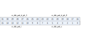

Register description
==========================

+-------------------------+-------------+
| Name                    | Description |
+-------------------------+-------------+
| `dbi_config`_           |             |
+-------------------------+-------------+
| `qspi_config`_          |             |
+-------------------------+-------------+
| `dbi_pix_cnt`_          |             |
+-------------------------+-------------+
| `dbi_prd`_              |             |
+-------------------------+-------------+
| `dbi_cmd`_              |             |
+-------------------------+-------------+
| `dbi_qspi_adr`_         |             |
+-------------------------+-------------+
| `dbi_rdata_0`_          |             |
+-------------------------+-------------+
| `dbi_rdata_1`_          |             |
+-------------------------+-------------+
| `dbi_int_sts`_          |             |
+-------------------------+-------------+
| `dbi_yuv_rgb_config_0`_ |             |
+-------------------------+-------------+
| `dbi_yuv_rgb_config_1`_ |             |
+-------------------------+-------------+
| `dbi_yuv_rgb_config_2`_ |             |
+-------------------------+-------------+
| `dbi_yuv_rgb_config_3`_ |             |
+-------------------------+-------------+
| `dbi_yuv_rgb_config_4`_ |             |
+-------------------------+-------------+
| `dbi_yuv_rgb_config_5`_ |             |
+-------------------------+-------------+
| `dbi_fifo_config_0`_    |             |
+-------------------------+-------------+
| `dbi_fifo_config_1`_    |             |
+-------------------------+-------------+
| `dbi_fifo_wdata`_       |             |
+-------------------------+-------------+
| `dbi_dummy`_            |             |
+-------------------------+-------------+

dbi_config
------------
 
**Address：**  0x3001b000
 

.. table::
    :widths: 10, 15,10,10,55
    :width: 100%
    :align: center
     
    +----------+------------------------------+--------+-------------+---------------------------------------------------------------------------------------------------------------------------------------------------------------------------------------------------------------------------------------------------------------------------------------------------------+
    | Bit      | Name                         |Type    | Reset       | Description                                                                                                                                                                                                                                                                                             |
    +==========+==============================+========+=============+=========================================================================================================================================================================================================================================================================================================+
    | 31       | sts_dbi_bus_busy             | r      | 1'b0        | Indicator of dbi bus busy                                                                                                                                                                                                                                                                               |
    +----------+------------------------------+--------+-------------+---------------------------------------------------------------------------------------------------------------------------------------------------------------------------------------------------------------------------------------------------------------------------------------------------------+
    | 30:25    | RSVD                         |        |             |                                                                                                                                                                                                                                                                                                         |
    +----------+------------------------------+--------+-------------+---------------------------------------------------------------------------------------------------------------------------------------------------------------------------------------------------------------------------------------------------------------------------------------------------------+
    | 24       | cr_dbi_cs_stretch            | r/w    | 1'b0        | Enable signal of CS-low stretch mode                                                                                                                                                                                                                                                                    |
    +          +                              +        +             +                                                                                                                                                                                                                                                                                                         +
    |          |                              |        |             | 1'b0: Disabled, if FIFO is empty during a pixel data transfer, CS will de-assert before FIFO is filled again and new transfer starts                                                                                                                                                                    |
    +          +                              +        +             +                                                                                                                                                                                                                                                                                                         +
    |          |                              |        |             | 1'b1: Enabled, if FIFO is empty during a pixel data transfer, CS will stay asserted while waiting for FIFO to be filled again                                                                                                                                                                           |
    +----------+------------------------------+--------+-------------+---------------------------------------------------------------------------------------------------------------------------------------------------------------------------------------------------------------------------------------------------------------------------------------------------------+
    | 23:20    | cr_dbi_dmy_cnt               | r/w    | 4'd0        | Dummy cycle count, unit: period defined by dbi_prd_d                                                                                                                                                                                                                                                    |
    +          +                              +        +             +                                                                                                                                                                                                                                                                                                         +
    |          |                              |        |             | Effective only in Type C (Fixed to 1 dbi_prd_d  period in Type B)                                                                                                                                                                                                                                       |
    +----------+------------------------------+--------+-------------+---------------------------------------------------------------------------------------------------------------------------------------------------------------------------------------------------------------------------------------------------------------------------------------------------------+
    | 19       | cr_dbi_dmy_en                | r/w    | 1'b0        | Enable signal of dummy cycle(s)                                                                                                                                                                                                                                                                         |
    +          +                              +        +             +                                                                                                                                                                                                                                                                                                         +
    |          |                              |        |             | 1'b0: Disabled, no dummy cycle(s) between command phase and data phase                                                                                                                                                                                                                                  |
    +          +                              +        +             +                                                                                                                                                                                                                                                                                                         +
    |          |                              |        |             | 1'b1: Enabled, dummy cycle(s) will be inserted between command phase and data phase                                                                                                                                                                                                                     |
    +          +                              +        +             +                                                                                                                                                                                                                                                                                                         +
    |          |                              |        |             | Note: Don't-care if QSPI mode is selected (no dummy cycle)                                                                                                                                                                                                                                              |
    +----------+------------------------------+--------+-------------+---------------------------------------------------------------------------------------------------------------------------------------------------------------------------------------------------------------------------------------------------------------------------------------------------------+
    | 18       | cr_dbi_cont_en               | r/w    | 1'b1        | Enable signal of pixel data continuous transfer mode                                                                                                                                                                                                                                                    |
    +          +                              +        +             +                                                                                                                                                                                                                                                                                                         +
    |          |                              |        |             | 1'b0: Disabled, CS_n will de-assert between each pixel                                                                                                                                                                                                                                                  |
    +          +                              +        +             +                                                                                                                                                                                                                                                                                                         +
    |          |                              |        |             | 1'b1: Enabled, CS_n will stay asserted between each consecutive pixel                                                                                                                                                                                                                                   |
    +          +                              +        +             +                                                                                                                                                                                                                                                                                                         +
    |          |                              |        |             | Note: Don't-care if QSPI mode is selected (always in continuous mode)                                                                                                                                                                                                                                   |
    +----------+------------------------------+--------+-------------+---------------------------------------------------------------------------------------------------------------------------------------------------------------------------------------------------------------------------------------------------------------------------------------------------------+
    | 17       | cr_dbi_scl_ph                | r/w    | 1'b0        | SCL clock phase inverse signal                                                                                                                                                                                                                                                                          |
    +----------+------------------------------+--------+-------------+---------------------------------------------------------------------------------------------------------------------------------------------------------------------------------------------------------------------------------------------------------------------------------------------------------+
    | 16       | cr_dbi_scl_pol               | r/w    | 1'b1        | SCL clock polarity                                                                                                                                                                                                                                                                                      |
    +          +                              +        +             +                                                                                                                                                                                                                                                                                                         +
    |          |                              |        |             | 0: SCL output LOW at IDLE state                                                                                                                                                                                                                                                                         |
    +          +                              +        +             +                                                                                                                                                                                                                                                                                                         +
    |          |                              |        |             | 1: SCL output HIGH at IDLE state                                                                                                                                                                                                                                                                        |
    +----------+------------------------------+--------+-------------+---------------------------------------------------------------------------------------------------------------------------------------------------------------------------------------------------------------------------------------------------------------------------------------------------------+
    | 15:8     | cr_dbi_dat_bc                | r/w    | 8'd0        | Data byte count of normal data (pixel data count is determined by cr_dbi_pix_cnt)                                                                                                                                                                                                                       |
    +          +                              +        +             +                                                                                                                                                                                                                                                                                                         +
    |          |                              |        |             | Note: Normal read data can only be up to 8-byte (8'd7). No limit for normal write data (can be up to 256-byte using FIFO)                                                                                                                                                                               |
    +----------+------------------------------+--------+-------------+---------------------------------------------------------------------------------------------------------------------------------------------------------------------------------------------------------------------------------------------------------------------------------------------------------+
    | 7        | cr_dbi_dat_tp                | r/w    | 1'b0        | Data type select                                                                                                                                                                                                                                                                                        |
    +          +                              +        +             +                                                                                                                                                                                                                                                                                                         +
    |          |                              |        |             | 1'b0: Normal data (parameter)                                                                                                                                                                                                                                                                           |
    +          +                              +        +             +                                                                                                                                                                                                                                                                                                         +
    |          |                              |        |             | 1'b1: Pixel data                                                                                                                                                                                                                                                                                        |
    +          +                              +        +             +                                                                                                                                                                                                                                                                                                         +
    |          |                              |        |             | Note: Read command supports normal data only                                                                                                                                                                                                                                                            |
    +----------+------------------------------+--------+-------------+---------------------------------------------------------------------------------------------------------------------------------------------------------------------------------------------------------------------------------------------------------------------------------------------------------+
    | 6        | cr_dbi_dat_wr                | r/w    | 1'b1        | Data phase Read/Write select                                                                                                                                                                                                                                                                            |
    +          +                              +        +             +                                                                                                                                                                                                                                                                                                         +
    |          |                              |        |             | 1'b0: Read data                                                                                                                                                                                                                                                                                         |
    +          +                              +        +             +                                                                                                                                                                                                                                                                                                         +
    |          |                              |        |             | 1'b1: Write data                                                                                                                                                                                                                                                                                        |
    +----------+------------------------------+--------+-------------+---------------------------------------------------------------------------------------------------------------------------------------------------------------------------------------------------------------------------------------------------------------------------------------------------------+
    | 5        | cr_dbi_dat_en                | r/w    | 1'b1        | Data enable signal                                                                                                                                                                                                                                                                                      |
    +          +                              +        +             +                                                                                                                                                                                                                                                                                                         +
    |          |                              |        |             | 1'b0: Data phase disabled                                                                                                                                                                                                                                                                               |
    +          +                              +        +             +                                                                                                                                                                                                                                                                                                         +
    |          |                              |        |             | 1'b1: Data phase enabled                                                                                                                                                                                                                                                                                |
    +----------+------------------------------+--------+-------------+---------------------------------------------------------------------------------------------------------------------------------------------------------------------------------------------------------------------------------------------------------------------------------------------------------+
    | 4        | cr_dbi_cmd_en                | r/w    | 1'b1        | Command enable signal                                                                                                                                                                                                                                                                                   |
    +          +                              +        +             +                                                                                                                                                                                                                                                                                                         +
    |          |                              |        |             | 1'b0: No command phase                                                                                                                                                                                                                                                                                  |
    +          +                              +        +             +                                                                                                                                                                                                                                                                                                         +
    |          |                              |        |             | 1'b1: Command will be sent                                                                                                                                                                                                                                                                              |
    +          +                              +        +             +                                                                                                                                                                                                                                                                                                         +
    |          |                              |        |             | Note: Don't-care if QSPI mode is selected (Command always enabled)                                                                                                                                                                                                                                      |
    +----------+------------------------------+--------+-------------+---------------------------------------------------------------------------------------------------------------------------------------------------------------------------------------------------------------------------------------------------------------------------------------------------------+
    | 3        | RSVD                         |        |             |                                                                                                                                                                                                                                                                                                         |
    +----------+------------------------------+--------+-------------+---------------------------------------------------------------------------------------------------------------------------------------------------------------------------------------------------------------------------------------------------------------------------------------------------------+
    | 2:1      | cr_dbi_sel                   | r/w    | 2'd0        | DBI mode select                                                                                                                                                                                                                                                                                         |
    +          +                              +        +             +                                                                                                                                                                                                                                                                                                         +
    |          |                              |        |             | 2'd0: DBI Type B                                                                                                                                                                                                                                                                                        |
    +          +                              +        +             +                                                                                                                                                                                                                                                                                                         +
    |          |                              |        |             | 2'd1: DBI Type C, 4-wire mode                                                                                                                                                                                                                                                                           |
    +          +                              +        +             +                                                                                                                                                                                                                                                                                                         +
    |          |                              |        |             | 2'd2: DBI Type C, 3-wire mode                                                                                                                                                                                                                                                                           |
    +          +                              +        +             +                                                                                                                                                                                                                                                                                                         +
    |          |                              |        |             | 2'd3: QSPI mode                                                                                                                                                                                                                                                                                         |
    +----------+------------------------------+--------+-------------+---------------------------------------------------------------------------------------------------------------------------------------------------------------------------------------------------------------------------------------------------------------------------------------------------------+
    | 0        | cr_dbi_en                    | r/w    | 1'b0        | Enable signal of DBI function                                                                                                                                                                                                                                                                           |
    +          +                              +        +             +                                                                                                                                                                                                                                                                                                         +
    |          |                              |        |             | Asserting this bit will trigger the transaction, and should be de-asserted after finish                                                                                                                                                                                                                 |
    +----------+------------------------------+--------+-------------+---------------------------------------------------------------------------------------------------------------------------------------------------------------------------------------------------------------------------------------------------------------------------------------------------------+

qspi_config
-------------
 
**Address：**  0x3001b004
 

.. table::
    :widths: 10, 15,10,10,55
    :width: 100%
    :align: center
     
    +----------+------------------------------+--------+-------------+--------------------------------------------------------------------------------------------------------------------+
    | Bit      | Name                         |Type    | Reset       | Description                                                                                                        |
    +==========+==============================+========+=============+====================================================================================================================+
    | 31:6     | RSVD                         |        |             |                                                                                                                    |
    +----------+------------------------------+--------+-------------+--------------------------------------------------------------------------------------------------------------------+
    | 5:4      | cr_qspi_adr_bc               | r/w    | 2'd2        | QSPI Address byte count                                                                                            |
    +----------+------------------------------+--------+-------------+--------------------------------------------------------------------------------------------------------------------+
    | 3        | RSVD                         |        |             |                                                                                                                    |
    +----------+------------------------------+--------+-------------+--------------------------------------------------------------------------------------------------------------------+
    | 2        | cr_qspi_dat_4b               | r/w    | 1'b1        | QSPI Data 4-bit (quad) mode                                                                                        |
    +          +                              +        +             +                                                                                                                    +
    |          |                              |        |             | 1'b0: Data sent/received in 1-bit mode                                                                             |
    +          +                              +        +             +                                                                                                                    +
    |          |                              |        |             | 1'b1: Data sent/received in 4-bit mode                                                                             |
    +----------+------------------------------+--------+-------------+--------------------------------------------------------------------------------------------------------------------+
    | 1        | cr_qspi_adr_4b               | r/w    | 1'b1        | QSPI Address (display command) 4-bit (quad) mode                                                                   |
    +          +                              +        +             +                                                                                                                    +
    |          |                              |        |             | 1'b0: Address sent in 1-bit mode                                                                                   |
    +          +                              +        +             +                                                                                                                    +
    |          |                              |        |             | 1'b1: Address sent in 4-bit mode                                                                                   |
    +----------+------------------------------+--------+-------------+--------------------------------------------------------------------------------------------------------------------+
    | 0        | cr_qspi_cmd_4b               | r/w    | 1'b0        | QSPI Command 4-bit (quad) mode                                                                                     |
    +          +                              +        +             +                                                                                                                    +
    |          |                              |        |             | 1'b0: Command sent in 1-bit mode                                                                                   |
    +          +                              +        +             +                                                                                                                    +
    |          |                              |        |             | 1'b1: Command sent in 4-bit mode                                                                                   |
    +----------+------------------------------+--------+-------------+--------------------------------------------------------------------------------------------------------------------+

dbi_pix_cnt
-------------
 
**Address：**  0x3001b008
 

.. table::
    :widths: 10, 15,10,10,55
    :width: 100%
    :align: center
     
    +----------+------------------------------+--------+-------------+-------------------------------------------------------------------------------------------------------------------------+
    | Bit      | Name                         |Type    | Reset       | Description                                                                                                             |
    +==========+==============================+========+=============+=========================================================================================================================+
    | 31       | cr_dbi_pix_format            | r/w    | 1'b0        | Pixel format                                                                                                            |
    +          +                              +        +             +                                                                                                                         +
    |          |                              |        |             | 1'b0: RGB565                                                                                                            |
    +          +                              +        +             +                                                                                                                         +
    |          |                              |        |             | 1'b1: RGB888/RGB666                                                                                                     |
    +----------+------------------------------+--------+-------------+-------------------------------------------------------------------------------------------------------------------------+
    | 30:24    | RSVD                         |        |             |                                                                                                                         |
    +----------+------------------------------+--------+-------------+-------------------------------------------------------------------------------------------------------------------------+
    | 23:0     | cr_dbi_pix_cnt               | r/w    | 24'h0       | Pixel count                                                                                                             |
    +          +                              +        +             +                                                                                                                         +
    |          |                              |        |             | Note: Should be a multiple of 2 if RGB565 is selected and a multiple of 4 if RGB888/RGB666 mode is selected             |
    +----------+------------------------------+--------+-------------+-------------------------------------------------------------------------------------------------------------------------+

dbi_prd
---------
 
**Address：**  0x3001b00c
 

.. table::
    :widths: 10, 15,10,10,55
    :width: 100%
    :align: center
     
    +----------+------------------------------+--------+-------------+----------------------------------------------------------------------+
    | Bit      | Name                         |Type    | Reset       | Description                                                          |
    +==========+==============================+========+=============+======================================================================+
    | 31:24    | cr_dbi_prd_d_ph_1            | r/w    | 8'd15       | Length of DATA phase 1 (please refer to "Timing" tab)                |
    +----------+------------------------------+--------+-------------+----------------------------------------------------------------------+
    | 23:16    | cr_dbi_prd_d_ph_0            | r/w    | 8'd15       | Length of DATA phase 0 (please refer to "Timing" tab)                |
    +----------+------------------------------+--------+-------------+----------------------------------------------------------------------+
    | 15:8     | cr_dbi_prd_i                 | r/w    | 8'd15       | Length of INTERVAL between pixel data (please refer to "Timing" tab) |
    +----------+------------------------------+--------+-------------+----------------------------------------------------------------------+
    | 7:0      | cr_dbi_prd_s                 | r/w    | 8'd15       | Length of START/STOP condition (please refer to "Timing" tab)        |
    +----------+------------------------------+--------+-------------+----------------------------------------------------------------------+

dbi_cmd
---------
 
**Address：**  0x3001b010
 

.. table::
    :widths: 10, 15,10,10,55
    :width: 100%
    :align: center
     
    +----------+------------------------------+--------+-------------+-------------+
    | Bit      | Name                         |Type    | Reset       | Description |
    +==========+==============================+========+=============+=============+
    | 31:8     | RSVD                         |        |             |             |
    +----------+------------------------------+--------+-------------+-------------+
    | 7:0      | cr_dbi_cmd                   | r/w    | 8'h2C       | DBI Command |
    +----------+------------------------------+--------+-------------+-------------+

dbi_qspi_adr
--------------
 
**Address：**  0x3001b014
 

.. table::
    :widths: 10, 15,10,10,55
    :width: 100%
    :align: center
     
    +----------+------------------------------+--------+-------------+--------------------------------------------------------+
    | Bit      | Name                         |Type    | Reset       | Description                                            |
    +==========+==============================+========+=============+========================================================+
    | 31:0     | cr_qspi_adr                  | r/w    | 32'h00002C00| QSPI Address (display command)                         |
    +          +                              +        +             +                                                        +
    |          |                              |        |             | Note: LSB is sent first                                |
    +----------+------------------------------+--------+-------------+--------------------------------------------------------+

dbi_rdata_0
-------------
 
**Address：**  0x3001b018
 

.. table::
    :widths: 10, 15,10,10,55
    :width: 100%
    :align: center
     
    +----------+------------------------------+--------+-------------+----------------------------------------------+
    | Bit      | Name                         |Type    | Reset       | Description                                  |
    +==========+==============================+========+=============+==============================================+
    | 31:0     | sts_dbi_rdata_0              | r      | 32'h0       | Data read from display IC using read command |
    +----------+------------------------------+--------+-------------+----------------------------------------------+

dbi_rdata_1
-------------
 
**Address：**  0x3001b01c
 

.. table::
    :widths: 10, 15,10,10,55
    :width: 100%
    :align: center
     
    +----------+------------------------------+--------+-------------+----------------------------------------------+
    | Bit      | Name                         |Type    | Reset       | Description                                  |
    +==========+==============================+========+=============+==============================================+
    | 31:0     | sts_dbi_rdata_1              | r      | 32'h0       | Data read from display IC using read command |
    +----------+------------------------------+--------+-------------+----------------------------------------------+

dbi_int_sts
-------------
 
**Address：**  0x3001b030
 

.. table::
    :widths: 10, 15,10,10,55
    :width: 100%
    :align: center
     
    +----------+------------------------------+--------+-------------+---------------------------------------------------------------------------------------------+
    | Bit      | Name                         |Type    | Reset       | Description                                                                                 |
    +==========+==============================+========+=============+=============================================================================================+
    | 31:27    | RSVD                         |        |             |                                                                                             |
    +----------+------------------------------+--------+-------------+---------------------------------------------------------------------------------------------+
    | 26       | cr_dbi_fer_en                | r/w    | 1'b1        | Interrupt enable of dbi_fer_int                                                             |
    +----------+------------------------------+--------+-------------+---------------------------------------------------------------------------------------------+
    | 25       | cr_dbi_txf_en                | r/w    | 1'b1        | Interrupt enable of dbi_txe_int                                                             |
    +----------+------------------------------+--------+-------------+---------------------------------------------------------------------------------------------+
    | 24       | cr_dbi_end_en                | r/w    | 1'b1        | Interrupt enable of dbi_end_int                                                             |
    +----------+------------------------------+--------+-------------+---------------------------------------------------------------------------------------------+
    | 23:19    | RSVD                         |        |             |                                                                                             |
    +----------+------------------------------+--------+-------------+---------------------------------------------------------------------------------------------+
    | 18       | rsvd                         | rsvd   | 1'b0        |                                                                                             |
    +----------+------------------------------+--------+-------------+---------------------------------------------------------------------------------------------+
    | 17       | rsvd                         | rsvd   | 1'b0        |                                                                                             |
    +----------+------------------------------+--------+-------------+---------------------------------------------------------------------------------------------+
    | 16       | cr_dbi_end_clr               | w1c    | 1'b0        | Interrupt clear of dbi_end_int                                                              |
    +----------+------------------------------+--------+-------------+---------------------------------------------------------------------------------------------+
    | 15:11    | RSVD                         |        |             |                                                                                             |
    +----------+------------------------------+--------+-------------+---------------------------------------------------------------------------------------------+
    | 10       | cr_dbi_fer_mask              | r/w    | 1'b1        | Interrupt mask of dbi_fer_int                                                               |
    +----------+------------------------------+--------+-------------+---------------------------------------------------------------------------------------------+
    | 9        | cr_dbi_txf_mask              | r/w    | 1'b1        | Interrupt mask of dbi_txe_int                                                               |
    +----------+------------------------------+--------+-------------+---------------------------------------------------------------------------------------------+
    | 8        | cr_dbi_end_mask              | r/w    | 1'b1        | Interrupt mask of dbi_end_int                                                               |
    +----------+------------------------------+--------+-------------+---------------------------------------------------------------------------------------------+
    | 7:3      | RSVD                         |        |             |                                                                                             |
    +----------+------------------------------+--------+-------------+---------------------------------------------------------------------------------------------+
    | 2        | dbi_fer_int                  | r      | 1'b0        | TX/RX FIFO error interrupt, auto-cleared when FIFO overflow/underflow error flag is cleared |
    +----------+------------------------------+--------+-------------+---------------------------------------------------------------------------------------------+
    | 1        | dbi_txf_int                  | r      | 1'b1        | TX FIFO ready (tx_fifo_cnt > tx_fifo_th) interrupt, auto-cleared when data is pushed        |
    +----------+------------------------------+--------+-------------+---------------------------------------------------------------------------------------------+
    | 0        | dbi_end_int                  | r      | 1'b0        | Transfer end interrupt, shared by both Type B and C mode                                    |
    +----------+------------------------------+--------+-------------+---------------------------------------------------------------------------------------------+

dbi_yuv_rgb_config_0
----------------------
 
**Address：**  0x3001b060
 

.. table::
    :widths: 10, 15,10,10,55
    :width: 100%
    :align: center
     
    +----------+------------------------------+--------+-------------+-------------------------------------------------+
    | Bit      | Name                         |Type    | Reset       | Description                                     |
    +==========+==============================+========+=============+=================================================+
    | 31       | cr_y2r_en                    | r/w    | 1'b1        | Display module YUV2RGB enable signal            |
    +----------+------------------------------+--------+-------------+-------------------------------------------------+
    | 30:29    | RSVD                         |        |             |                                                 |
    +----------+------------------------------+--------+-------------+-------------------------------------------------+
    | 28:20    | cr_y2r_pre_2                 | r/w    | 9'd0        | Display module YUV2RGB "pre_offset_2" parameter |
    +----------+------------------------------+--------+-------------+-------------------------------------------------+
    | 19       | RSVD                         |        |             |                                                 |
    +----------+------------------------------+--------+-------------+-------------------------------------------------+
    | 18:10    | cr_y2r_pre_1                 | r/w    | 9'd0        | Display module YUV2RGB "pre_offset_1" parameter |
    +----------+------------------------------+--------+-------------+-------------------------------------------------+
    | 9        | RSVD                         |        |             |                                                 |
    +----------+------------------------------+--------+-------------+-------------------------------------------------+
    | 8:0      | cr_y2r_pre_0                 | r/w    | 9'd0        | Display module YUV2RGB "pre_offset_0" parameter |
    +----------+------------------------------+--------+-------------+-------------------------------------------------+

dbi_yuv_rgb_config_1
----------------------
 
**Address：**  0x3001b064
 

.. table::
    :widths: 10, 15,10,10,55
    :width: 100%
    :align: center
     
    +----------+------------------------------+--------+-------------+--------------------------------------------------+
    | Bit      | Name                         |Type    | Reset       | Description                                      |
    +==========+==============================+========+=============+==================================================+
    | 31:29    | RSVD                         |        |             |                                                  |
    +----------+------------------------------+--------+-------------+--------------------------------------------------+
    | 28:20    | cr_y2r_pos_2                 | r/w    | 9'd0        | Display module YUV2RGB "post_offset_2" parameter |
    +----------+------------------------------+--------+-------------+--------------------------------------------------+
    | 19       | RSVD                         |        |             |                                                  |
    +----------+------------------------------+--------+-------------+--------------------------------------------------+
    | 18:10    | cr_y2r_pos_1                 | r/w    | 9'd0        | Display module YUV2RGB "post_offset_1" parameter |
    +----------+------------------------------+--------+-------------+--------------------------------------------------+
    | 9        | RSVD                         |        |             |                                                  |
    +----------+------------------------------+--------+-------------+--------------------------------------------------+
    | 8:0      | cr_y2r_pos_0                 | r/w    | 9'd0        | Display module YUV2RGB "post_offset_0" parameter |
    +----------+------------------------------+--------+-------------+--------------------------------------------------+

dbi_yuv_rgb_config_2
----------------------
 
**Address：**  0x3001b068
 

.. table::
    :widths: 10, 15,10,10,55
    :width: 100%
    :align: center
     
    +----------+------------------------------+--------+-------------+---------------------------------------------------------+
    | Bit      | Name                         |Type    | Reset       | Description                                             |
    +==========+==============================+========+=============+=========================================================+
    | 31:24    | cr_y2r_mtx_02_l              | r/w    | 8'h0        | Display module YUV2RGB "matrix_02" parameter lower bits |
    +----------+------------------------------+--------+-------------+---------------------------------------------------------+
    | 23:12    | cr_y2r_mtx_01                | r/w    | 12'h0       | Display module YUV2RGB "matrix_01" parameter            |
    +----------+------------------------------+--------+-------------+---------------------------------------------------------+
    | 11:0     | cr_y2r_mtx_00                | r/w    | 12'h0       | Display module YUV2RGB "matrix_00" parameter            |
    +----------+------------------------------+--------+-------------+---------------------------------------------------------+

dbi_yuv_rgb_config_3
----------------------
 
**Address：**  0x3001b06c
 

.. table::
    :widths: 10, 15,10,10,55
    :width: 100%
    :align: center
     
    +----------+------------------------------+--------+-------------+---------------------------------------------------------+
    | Bit      | Name                         |Type    | Reset       | Description                                             |
    +==========+==============================+========+=============+=========================================================+
    | 31:28    | cr_y2r_mtx_12_l              | r/w    | 4'h0        | Display module YUV2RGB "matrix_12" parameter lower bits |
    +----------+------------------------------+--------+-------------+---------------------------------------------------------+
    | 27:16    | cr_y2r_mtx_11                | r/w    | 12'h0       | Display module YUV2RGB "matrix_11" parameter            |
    +----------+------------------------------+--------+-------------+---------------------------------------------------------+
    | 15:4     | cr_y2r_mtx_10                | r/w    | 12'h0       | Display module YUV2RGB "matrix_10" parameter            |
    +----------+------------------------------+--------+-------------+---------------------------------------------------------+
    | 3:0      | cr_y2r_mtx_02_u              | r/w    | 4'h0        | Display module YUV2RGB "matrix_02" parameter upper bits |
    +----------+------------------------------+--------+-------------+---------------------------------------------------------+

dbi_yuv_rgb_config_4
----------------------
 
**Address：**  0x3001b070
 

.. table::
    :widths: 10, 15,10,10,55
    :width: 100%
    :align: center
     
    +----------+------------------------------+--------+-------------+---------------------------------------------------------+
    | Bit      | Name                         |Type    | Reset       | Description                                             |
    +==========+==============================+========+=============+=========================================================+
    | 31:20    | cr_y2r_mtx_21                | r/w    | 12'h0       | Display module YUV2RGB "matrix_21" parameter            |
    +----------+------------------------------+--------+-------------+---------------------------------------------------------+
    | 19:8     | cr_y2r_mtx_20                | r/w    | 12'h0       | Display module YUV2RGB "matrix_20" parameter            |
    +----------+------------------------------+--------+-------------+---------------------------------------------------------+
    | 7:0      | cr_y2r_mtx_12_u              | r/w    | 8'h0        | Display module YUV2RGB "matrix_12" parameter upper bits |
    +----------+------------------------------+--------+-------------+---------------------------------------------------------+

dbi_yuv_rgb_config_5
----------------------
 
**Address：**  0x3001b074
 

.. table::
    :widths: 10, 15,10,10,55
    :width: 100%
    :align: center
     
    +----------+------------------------------+--------+-------------+----------------------------------------------+
    | Bit      | Name                         |Type    | Reset       | Description                                  |
    +==========+==============================+========+=============+==============================================+
    | 31:12    | RSVD                         |        |             |                                              |
    +----------+------------------------------+--------+-------------+----------------------------------------------+
    | 11:0     | cr_y2r_mtx_22                | r/w    | 12'h0       | Display module YUV2RGB "matrix_22" parameter |
    +----------+------------------------------+--------+-------------+----------------------------------------------+

dbi_fifo_config_0
-------------------
 
**Address：**  0x3001b080
 

.. table::
    :widths: 10, 15,10,10,55
    :width: 100%
    :align: center
     
    +----------+------------------------------+--------+-------------+------------------------------------------------------------------------------------------------------------------------------------------------------------------------------------------------------------------------------------------------------------------------------------------------------------------------------------------------------------------------------------------------------------------------------------------------------------------------------------------------------------+
    | Bit      | Name                         |Type    | Reset       | Description                                                                                                                                                                                                                                                                                                                                                                                                                                                                                                |
    +==========+==============================+========+=============+============================================================================================================================================================================================================================================================================================================================================================================================================================================================================================================+
    | 31:29    | fifo_format                  | r/w    | 3'd0        | FIFO pixel data format (see Tab 'FIFO Format' for details)                                                                                                                                                                                                                                                                                                                                                                                                                                                 |
    +          +                              +        +             +                                                                                                                                                                                                                                                                                                                                                                                                                                                                                                            +
    |          |                              |        |             | 3'd0: {8'h0, B[7:0], G[7:0], R[7:0]}                                                                                                                                                                                                                                                                                                                                                                                                                                                                       |
    +          +                              +        +             +                                                                                                                                                                                                                                                                                                                                                                                                                                                                                                            +
    |          |                              |        |             | 3'd1: {8'h0, R[7:0], G[7:0], B[7:0]}                                                                                                                                                                                                                                                                                                                                                                                                                                                                       |
    +          +                              +        +             +                                                                                                                                                                                                                                                                                                                                                                                                                                                                                                            +
    |          |                              |        |             | 3'd2: {B[7:0], G[7:0], R[7:0], 8'h0}                                                                                                                                                                                                                                                                                                                                                                                                                                                                       |
    +          +                              +        +             +                                                                                                                                                                                                                                                                                                                                                                                                                                                                                                            +
    |          |                              |        |             | 3'd3: {R[7:0], G[7:0], B[7:0], 8'h0}                                                                                                                                                                                                                                                                                                                                                                                                                                                                       |
    +          +                              +        +             +                                                                                                                                                                                                                                                                                                                                                                                                                                                                                                            +
    |          |                              |        |             | 3'd4: {R_n[7:0], B[7:0], G[7:0], R[7:0]}                                                                                                                                                                                                                                                                                                                                                                                                                                                                   |
    +          +                              +        +             +                                                                                                                                                                                                                                                                                                                                                                                                                                                                                                            +
    |          |                              |        |             | 3'd5: {B_n[7:0], R[7:0], G[7:0], B[7:0]}                                                                                                                                                                                                                                                                                                                                                                                                                                                                   |
    +          +                              +        +             +                                                                                                                                                                                                                                                                                                                                                                                                                                                                                                            +
    |          |                              |        |             | 3'd6: {2{B[7:3], G[7:2], R[7:3]}}                                                                                                                                                                                                                                                                                                                                                                                                                                                                          |
    +          +                              +        +             +                                                                                                                                                                                                                                                                                                                                                                                                                                                                                                            +
    |          |                              |        |             | 3'd7: {2{R[7:3], G[7:2], B[7:3]}}                                                                                                                                                                                                                                                                                                                                                                                                                                                                          |
    +          +                              +        +             +                                                                                                                                                                                                                                                                                                                                                                                                                                                                                                            +
    |          |                              |        |             | Note: FIFO data format does not affect normal data, which is fixed to LSB sent first {Byte3[7:0], Byte2[7:0], Byte1[7:0], Byte0[7:0]}                                                                                                                                                                                                                                                                                                                                                                      |
    +----------+------------------------------+--------+-------------+------------------------------------------------------------------------------------------------------------------------------------------------------------------------------------------------------------------------------------------------------------------------------------------------------------------------------------------------------------------------------------------------------------------------------------------------------------------------------------------------------------+
    | 28       | fifo_yuv_mode                | r/w    | 1'b0        | FIFO data YUV mode                                                                                                                                                                                                                                                                                                                                                                                                                                                                                         |
    +          +                              +        +             +                                                                                                                                                                                                                                                                                                                                                                                                                                                                                                            +
    |          |                              |        |             | R <-> Y                                                                                                                                                                                                                                                                                                                                                                                                                                                                                                    |
    +          +                              +        +             +                                                                                                                                                                                                                                                                                                                                                                                                                                                                                                            +
    |          |                              |        |             | G <-> U/Cb                                                                                                                                                                                                                                                                                                                                                                                                                                                                                                 |
    +          +                              +        +             +                                                                                                                                                                                                                                                                                                                                                                                                                                                                                                            +
    |          |                              |        |             | B <-> V/Cr                                                                                                                                                                                                                                                                                                                                                                                                                                                                                                 |
    +----------+------------------------------+--------+-------------+------------------------------------------------------------------------------------------------------------------------------------------------------------------------------------------------------------------------------------------------------------------------------------------------------------------------------------------------------------------------------------------------------------------------------------------------------------------------------------------------------------+
    | 27:6     | RSVD                         |        |             |                                                                                                                                                                                                                                                                                                                                                                                                                                                                                                            |
    +----------+------------------------------+--------+-------------+------------------------------------------------------------------------------------------------------------------------------------------------------------------------------------------------------------------------------------------------------------------------------------------------------------------------------------------------------------------------------------------------------------------------------------------------------------------------------------------------------------+
    | 5        | tx_fifo_underflow            | r      | 1'b0        | Underflow flag of TX FIFO, can be cleared by tx_fifo_clr                                                                                                                                                                                                                                                                                                                                                                                                                                                   |
    +----------+------------------------------+--------+-------------+------------------------------------------------------------------------------------------------------------------------------------------------------------------------------------------------------------------------------------------------------------------------------------------------------------------------------------------------------------------------------------------------------------------------------------------------------------------------------------------------------------+
    | 4        | tx_fifo_overflow             | r      | 1'b0        | Overflow flag of TX FIFO, can be cleared by tx_fifo_clr                                                                                                                                                                                                                                                                                                                                                                                                                                                    |
    +----------+------------------------------+--------+-------------+------------------------------------------------------------------------------------------------------------------------------------------------------------------------------------------------------------------------------------------------------------------------------------------------------------------------------------------------------------------------------------------------------------------------------------------------------------------------------------------------------------+
    | 3        | RSVD                         |        |             |                                                                                                                                                                                                                                                                                                                                                                                                                                                                                                            |
    +----------+------------------------------+--------+-------------+------------------------------------------------------------------------------------------------------------------------------------------------------------------------------------------------------------------------------------------------------------------------------------------------------------------------------------------------------------------------------------------------------------------------------------------------------------------------------------------------------------+
    | 2        | tx_fifo_clr                  | w1c    | 1'b0        | Clear signal of TX FIFO                                                                                                                                                                                                                                                                                                                                                                                                                                                                                    |
    +----------+------------------------------+--------+-------------+------------------------------------------------------------------------------------------------------------------------------------------------------------------------------------------------------------------------------------------------------------------------------------------------------------------------------------------------------------------------------------------------------------------------------------------------------------------------------------------------------------+
    | 1        | RSVD                         |        |             |                                                                                                                                                                                                                                                                                                                                                                                                                                                                                                            |
    +----------+------------------------------+--------+-------------+------------------------------------------------------------------------------------------------------------------------------------------------------------------------------------------------------------------------------------------------------------------------------------------------------------------------------------------------------------------------------------------------------------------------------------------------------------------------------------------------------------+
    | 0        | dbi_dma_tx_en                | r/w    | 1'b0        | Enable signal of dma_tx_req/ack interface                                                                                                                                                                                                                                                                                                                                                                                                                                                                  |
    +----------+------------------------------+--------+-------------+------------------------------------------------------------------------------------------------------------------------------------------------------------------------------------------------------------------------------------------------------------------------------------------------------------------------------------------------------------------------------------------------------------------------------------------------------------------------------------------------------------+

dbi_fifo_config_1
-------------------
 
**Address：**  0x3001b084
 

.. table::
    :widths: 10, 15,10,10,55
    :width: 100%
    :align: center
     
    +----------+------------------------------+--------+-------------+-------------------------------------------------------------------------------------------+
    | Bit      | Name                         |Type    | Reset       | Description                                                                               |
    +==========+==============================+========+=============+===========================================================================================+
    | 31:19    | RSVD                         |        |             |                                                                                           |
    +----------+------------------------------+--------+-------------+-------------------------------------------------------------------------------------------+
    | 18:16    | tx_fifo_th                   | r/w    | 3'd0        | TX FIFO threshold, dma_tx_req will not be asserted if tx_fifo_cnt is less than this value |
    +----------+------------------------------+--------+-------------+-------------------------------------------------------------------------------------------+
    | 15:4     | RSVD                         |        |             |                                                                                           |
    +----------+------------------------------+--------+-------------+-------------------------------------------------------------------------------------------+
    | 3:0      | tx_fifo_cnt                  | r      | 4'd8        | TX FIFO available count                                                                   |
    +----------+------------------------------+--------+-------------+-------------------------------------------------------------------------------------------+

dbi_fifo_wdata
----------------
 
**Address：**  0x3001b088
 

.. table::
    :widths: 10, 15,10,10,55
    :width: 100%
    :align: center
     
    +----------+------------------------------+--------+-------------+---------------------------------------------------------------+
    | Bit      | Name                         |Type    | Reset       | Description                                                   |
    +==========+==============================+========+=============+===============================================================+
    | 31:0     | dbi_fifo_wdata               | w      | x           | Pixel data with 8 types of format (determined by fifo_format) |
    +----------+------------------------------+--------+-------------+---------------------------------------------------------------+

dbi_dummy
-----------
 
**Address：**  0x3001b0fc
 

.. table::
    :widths: 10, 15,10,10,55
    :width: 100%
    :align: center
     
    +----------+------------------------------+--------+-------------+------------------------------------------+
    | Bit      | Name                         |Type    | Reset       | Description                              |
    +==========+==============================+========+=============+==========================================+
    | 31:8     | RSVD                         |        |             |                                          |
    +----------+------------------------------+--------+-------------+------------------------------------------+
    | 7:0      | dbi_dummy                    | r/w    | 8'h0        | Dummy register for FPGA mode pad control |
    +----------+------------------------------+--------+-------------+------------------------------------------+

