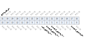

Register description
==========================

+--------------+--------------------------------+
| Name         | Description                    |
+--------------+--------------------------------+
| `TCCR`_      | Timer Clock Source             |
+--------------+--------------------------------+
| `TMR2_0`_    | Timer2 Match Value 0           |
+--------------+--------------------------------+
| `TMR2_1`_    | Timer2 Match Value 1           |
+--------------+--------------------------------+
| `TMR2_2`_    | Timer2 Match Value 2           |
+--------------+--------------------------------+
| `TMR3_0`_    | Timer3 Match Value 0           |
+--------------+--------------------------------+
| `TMR3_1`_    | Timer3 Match Value 1           |
+--------------+--------------------------------+
| `TMR3_2`_    | Timer3 Match Value 2           |
+--------------+--------------------------------+
| `TCR2`_      | Timer2 Counter Value           |
+--------------+--------------------------------+
| `TCR3`_      | Timer3 Counter Value           |
+--------------+--------------------------------+
| `TSR2`_      | Timer2 Match Status            |
+--------------+--------------------------------+
| `TSR3`_      | Timer3 Match Status            |
+--------------+--------------------------------+
| `TIER2`_     | Timer2 Match Interrupt Enable  |
+--------------+--------------------------------+
| `TIER3`_     | Timer3 Match Interrupt Enable  |
+--------------+--------------------------------+
| `TPLVR2`_    | Timer2 Pre-Load Value          |
+--------------+--------------------------------+
| `TPLVR3`_    | Timer3 Pre-Load Value          |
+--------------+--------------------------------+
| `TPLCR2`_    | Timer2 Pre-Load Control        |
+--------------+--------------------------------+
| `TPLCR3`_    | Timer3 Pre-Load Control        |
+--------------+--------------------------------+
| `WMER`_      | Watch-dog reset/interrupt Mode |
+--------------+--------------------------------+
| `WMR`_       | Watch-dog Match Value          |
+--------------+--------------------------------+
| `WVR`_       | Watch-dog Counter Value        |
+--------------+--------------------------------+
| `WSR`_       | Watch-dog Reset Status         |
+--------------+--------------------------------+
| `TICR2`_     | Timer2 Interrupt Clear         |
+--------------+--------------------------------+
| `TICR3`_     | Timer3 Interrupt Clear         |
+--------------+--------------------------------+
| `WICR`_      | WDT Interrupt Clear            |
+--------------+--------------------------------+
| `TCER`_      | Timer Counter Enable/Clear     |
+--------------+--------------------------------+
| `TCMR`_      | Timer Counter Mode             |
+--------------+--------------------------------+
| `TILR2`_     | Timer2 Match Interrupt Mode    |
+--------------+--------------------------------+
| `TILR3`_     | Timer3 Match Interrupt Mode    |
+--------------+--------------------------------+
| `WCR`_       | WDT Counter Reset              |
+--------------+--------------------------------+
| `WFAR`_      | WDT Access Key1                |
+--------------+--------------------------------+
| `WSAR`_      | WDT Access Key2                |
+--------------+--------------------------------+
| `TCVWR2`_    | Timer2 Counter Latch Value     |
+--------------+--------------------------------+
| `TCVWR3`_    | Timer3 Counter Latch Value     |
+--------------+--------------------------------+
| `TCVSYN2`_   | Timer2 Counter Sync Value      |
+--------------+--------------------------------+
| `TCVSYN3`_   | Timer3 Counter Sync Value      |
+--------------+--------------------------------+
| `TCDR`_      | Timer Division                 |
+--------------+--------------------------------+
| `GPIO`_      | GPIO Mode                      |
+--------------+--------------------------------+
| `GPIO_LAT1`_ | GPIO Latch Value1              |
+--------------+--------------------------------+
| `GPIO_LAT2`_ | GPIO Latch Value2              |
+--------------+--------------------------------+

TCCR
------
 
**Address：**  0x4000a500
 

.. table::
    :widths: 10, 15,10,10,55
    :width: 100%
    :align: center
     
    +----------+------------------------------+--------+-------------+-------------------------------------------------------------------------+
    | Bit      | Name                         |Type    | Reset       | Description                                                             |
    +==========+==============================+========+=============+=========================================================================+
    | 31:24    | ID                           | r      | 8'ha5       |                                                                         |
    +----------+------------------------------+--------+-------------+-------------------------------------------------------------------------+
    | 23:16    | tmr_rsv                      | rsvd   | 0           |                                                                         |
    +----------+------------------------------+--------+-------------+-------------------------------------------------------------------------+
    | 15:12    | RSVD                         |        |             |                                                                         |
    +----------+------------------------------+--------+-------------+-------------------------------------------------------------------------+
    | 11:8     | cs_wdt                       | r/w    | 4'd1        | WDT  0:fclk  /  1:f32k  /  2:1k  /  3:32M  /  4:GPIO  /  5:No clock     |
    +----------+------------------------------+--------+-------------+-------------------------------------------------------------------------+
    | 7:4      | cs_3                         | r/w    | 4'd5        | Timer3  0:fclk  /  1:f32k  /  2:1k  /  3:32M  /  4:GPIO  /   5:No clock |
    +----------+------------------------------+--------+-------------+-------------------------------------------------------------------------+
    | 3:0      | cs_2                         | r/w    | 4'd5        | Timer2  0:fclk  /  1:f32k  /  2:1k  /  3:32M  /  4:GPIO  /   5:No clock |
    +----------+------------------------------+--------+-------------+-------------------------------------------------------------------------+

TMR2_0
--------
 
**Address：**  0x4000a510
 

.. table::
    :widths: 10, 15,10,10,55
    :width: 100%
    :align: center
     
    +----------+------------------------------+--------+-------------+----------------------+
    | Bit      | Name                         |Type    | Reset       | Description          |
    +==========+==============================+========+=============+======================+
    | 31:0     | tmr2_0                       | r/w    | 32'hffffffff| Timer2 Match Value 0 |
    +----------+------------------------------+--------+-------------+----------------------+

TMR2_1
--------
 
**Address：**  0x4000a514
 
.. figure:: ../../picture/ltmr_TMR2_1.svg
   :align: center

.. table::
    :widths: 10, 15,10,10,55
    :width: 100%
    :align: center
     
    +----------+------------------------------+--------+-------------+----------------------+
    | Bit      | Name                         |Type    | Reset       | Description          |
    +==========+==============================+========+=============+======================+
    | 31:0     | tmr2_1                       | r/w    | 32'hffffffff| Timer2 Match Value 1 |
    +----------+------------------------------+--------+-------------+----------------------+

TMR2_2
--------
 
**Address：**  0x4000a518
 

.. table::
    :widths: 10, 15,10,10,55
    :width: 100%
    :align: center
     
    +----------+------------------------------+--------+-------------+----------------------+
    | Bit      | Name                         |Type    | Reset       | Description          |
    +==========+==============================+========+=============+======================+
    | 31:0     | tmr2_2                       | r/w    | 32'hffffffff| Timer2 Match Value 2 |
    +----------+------------------------------+--------+-------------+----------------------+

TMR3_0
--------
 
**Address：**  0x4000a51c
 
.. figure:: ../../picture/ltmr_TMR3_0.svg
   :align: center

.. table::
    :widths: 10, 15,10,10,55
    :width: 100%
    :align: center
     
    +----------+------------------------------+--------+-------------+----------------------+
    | Bit      | Name                         |Type    | Reset       | Description          |
    +==========+==============================+========+=============+======================+
    | 31:0     | tmr3_0                       | r/w    | 32'hffffffff| Timer3 Match Value 0 |
    +----------+------------------------------+--------+-------------+----------------------+

TMR3_1
--------
 
**Address：**  0x4000a520
 
.. figure:: ../../picture/ltmr_TMR3_1.svg
   :align: center

.. table::
    :widths: 10, 15,10,10,55
    :width: 100%
    :align: center
     
    +----------+------------------------------+--------+-------------+----------------------+
    | Bit      | Name                         |Type    | Reset       | Description          |
    +==========+==============================+========+=============+======================+
    | 31:0     | tmr3_1                       | r/w    | 32'hffffffff| Timer3 Match Value 1 |
    +----------+------------------------------+--------+-------------+----------------------+

TMR3_2
--------
 
**Address：**  0x4000a524
 
.. figure:: ../../picture/ltmr_TMR3_2.svg
   :align: center

.. table::
    :widths: 10, 15,10,10,55
    :width: 100%
    :align: center
     
    +----------+------------------------------+--------+-------------+----------------------+
    | Bit      | Name                         |Type    | Reset       | Description          |
    +==========+==============================+========+=============+======================+
    | 31:0     | tmr3_2                       | r/w    | 32'hffffffff| Timer3 Match Value 2 |
    +----------+------------------------------+--------+-------------+----------------------+

TCR2
------
 
**Address：**  0x4000a52c
 

.. table::
    :widths: 10, 15,10,10,55
    :width: 100%
    :align: center
     
    +----------+------------------------------+--------+-------------+----------------------+
    | Bit      | Name                         |Type    | Reset       | Description          |
    +==========+==============================+========+=============+======================+
    | 31:0     | tcr2_cnt                     | r      | 0           | Timer2 Counter Value |
    +----------+------------------------------+--------+-------------+----------------------+

TCR3
------
 
**Address：**  0x4000a530
 

.. table::
    :widths: 10, 15,10,10,55
    :width: 100%
    :align: center
     
    +----------+------------------------------+--------+-------------+----------------------+
    | Bit      | Name                         |Type    | Reset       | Description          |
    +==========+==============================+========+=============+======================+
    | 31:0     | tcr3_cnt                     | r      | 0           | Timer3 Counter Value |
    +----------+------------------------------+--------+-------------+----------------------+

TSR2
------
 
**Address：**  0x4000a538
 
.. figure:: ../../picture/ltmr_TSR2.svg
   :align: center

.. table::
    :widths: 10, 15,10,10,55
    :width: 100%
    :align: center
     
    +----------+------------------------------+--------+-------------+-----------------------------------------------------------------------+
    | Bit      | Name                         |Type    | Reset       | Description                                                           |
    +==========+==============================+========+=============+=======================================================================+
    | 31:3     | RSVD                         |        |             |                                                                       |
    +----------+------------------------------+--------+-------------+-----------------------------------------------------------------------+
    | 2        | tsr2_2                       | r      | 0           | Timer2 match value 2 status/Clear interrupt would also clear this bit |
    +----------+------------------------------+--------+-------------+-----------------------------------------------------------------------+
    | 1        | tsr2_1                       | r      | 0           | Timer2 match value 1 status/Clear interrupt would also clear this bit |
    +----------+------------------------------+--------+-------------+-----------------------------------------------------------------------+
    | 0        | tsr2_0                       | r      | 0           | Timer2 match value 0 status/Clear interrupt would also clear this bit |
    +----------+------------------------------+--------+-------------+-----------------------------------------------------------------------+

TSR3
------
 
**Address：**  0x4000a53c
 
.. figure:: ../../picture/ltmr_TSR3.svg
   :align: center

.. table::
    :widths: 10, 15,10,10,55
    :width: 100%
    :align: center
     
    +----------+------------------------------+--------+-------------+-----------------------------------------------------------------------+
    | Bit      | Name                         |Type    | Reset       | Description                                                           |
    +==========+==============================+========+=============+=======================================================================+
    | 31:3     | RSVD                         |        |             |                                                                       |
    +----------+------------------------------+--------+-------------+-----------------------------------------------------------------------+
    | 2        | tsr3_2                       | r      | 0           | Timer3 match value 2 status/Clear interrupt would also clear this bit |
    +----------+------------------------------+--------+-------------+-----------------------------------------------------------------------+
    | 1        | tsr3_1                       | r      | 0           | Timer3 match value 1 status/Clear interrupt would also clear this bit |
    +----------+------------------------------+--------+-------------+-----------------------------------------------------------------------+
    | 0        | tsr3_0                       | r      | 0           | Timer3 match value 0 status/Clear interrupt would also clear this bit |
    +----------+------------------------------+--------+-------------+-----------------------------------------------------------------------+

TIER2
-------
 
**Address：**  0x4000a544
 
.. figure:: ../../picture/ltmr_TIER2.svg
   :align: center

.. table::
    :widths: 10, 15,10,10,55
    :width: 100%
    :align: center
     
    +----------+------------------------------+--------+-------------+---------------------------------------+
    | Bit      | Name                         |Type    | Reset       | Description                           |
    +==========+==============================+========+=============+=======================================+
    | 31:3     | RSVD                         |        |             |                                       |
    +----------+------------------------------+--------+-------------+---------------------------------------+
    | 2        | tier2_2                      | r/w    | 0           | Timer2 match value 2 interrupt enable |
    +----------+------------------------------+--------+-------------+---------------------------------------+
    | 1        | tier2_1                      | r/w    | 0           | Timer2 match value 1 interrupt enable |
    +----------+------------------------------+--------+-------------+---------------------------------------+
    | 0        | tier2_0                      | r/w    | 0           | Timer2 match value 0 interrupt enable |
    +----------+------------------------------+--------+-------------+---------------------------------------+

TIER3
-------
 
**Address：**  0x4000a548
 
.. figure:: ../../picture/ltmr_TIER3.svg
   :align: center

.. table::
    :widths: 10, 15,10,10,55
    :width: 100%
    :align: center
     
    +----------+------------------------------+--------+-------------+---------------------------------------+
    | Bit      | Name                         |Type    | Reset       | Description                           |
    +==========+==============================+========+=============+=======================================+
    | 31:3     | RSVD                         |        |             |                                       |
    +----------+------------------------------+--------+-------------+---------------------------------------+
    | 2        | tier3_2                      | r/w    | 0           | Timer3 match value 2 interrupt enable |
    +----------+------------------------------+--------+-------------+---------------------------------------+
    | 1        | tier3_1                      | r/w    | 0           | Timer3 match value 1 interrupt enable |
    +----------+------------------------------+--------+-------------+---------------------------------------+
    | 0        | tier3_0                      | r/w    | 0           | Timer3 match value 0 interrupt enable |
    +----------+------------------------------+--------+-------------+---------------------------------------+

TPLVR2
--------
 
**Address：**  0x4000a550
 

.. table::
    :widths: 10, 15,10,10,55
    :width: 100%
    :align: center
     
    +----------+------------------------------+--------+-------------+-----------------------+
    | Bit      | Name                         |Type    | Reset       | Description           |
    +==========+==============================+========+=============+=======================+
    | 31:0     | tplvr2                       | r/w    | 0           | Timer2 Pre-Load Value |
    +----------+------------------------------+--------+-------------+-----------------------+

TPLVR3
--------
 
**Address：**  0x4000a554
 
.. figure:: ../../picture/ltmr_TPLVR3.svg
   :align: center

.. table::
    :widths: 10, 15,10,10,55
    :width: 100%
    :align: center
     
    +----------+------------------------------+--------+-------------+-----------------------+
    | Bit      | Name                         |Type    | Reset       | Description           |
    +==========+==============================+========+=============+=======================+
    | 31:0     | tplvr3                       | r/w    | 0           | Timer3 Pre-Load Value |
    +----------+------------------------------+--------+-------------+-----------------------+

TPLCR2
--------
 
**Address：**  0x4000a55c
 
.. figure:: ../../picture/ltmr_TPLCR2.svg
   :align: center

.. table::
    :widths: 10, 15,10,10,55
    :width: 100%
    :align: center
     
    +----------+------------------------------+--------+-------------+--------------------------------------------------------------------------------------------------------------------------------------------------------------------+
    | Bit      | Name                         |Type    | Reset       | Description                                                                                                                                                        |
    +==========+==============================+========+=============+====================================================================================================================================================================+
    | 31:2     | RSVD                         |        |             |                                                                                                                                                                    |
    +----------+------------------------------+--------+-------------+--------------------------------------------------------------------------------------------------------------------------------------------------------------------+
    | 1:0      | tplcr2                       | r/w    | 0           | Timer2 pre-load control                                                                                                                                            |
    +          +                              +        +             +                                                                                                                                                                    +
    |          |                              |        |             | 2'd0 - No pre-load                                                                                                                                                 |
    +          +                              +        +             +                                                                                                                                                                    +
    |          |                              |        |             | 2'd1 - Pre-load with match comparator 0                                                                                                                            |
    +          +                              +        +             +                                                                                                                                                                    +
    |          |                              |        |             | 2'd2 - Pre-load with match comparator 1                                                                                                                            |
    +          +                              +        +             +                                                                                                                                                                    +
    |          |                              |        |             | 2'd3 - Pre-load with match comparator 2                                                                                                                            |
    +----------+------------------------------+--------+-------------+--------------------------------------------------------------------------------------------------------------------------------------------------------------------+

TPLCR3
--------
 
**Address：**  0x4000a560
 
.. figure:: ../../picture/ltmr_TPLCR3.svg
   :align: center

.. table::
    :widths: 10, 15,10,10,55
    :width: 100%
    :align: center
     
    +----------+------------------------------+--------+-------------+--------------------------------------------------------------------------------------------------------------------------------------------------------------------+
    | Bit      | Name                         |Type    | Reset       | Description                                                                                                                                                        |
    +==========+==============================+========+=============+====================================================================================================================================================================+
    | 31:2     | RSVD                         |        |             |                                                                                                                                                                    |
    +----------+------------------------------+--------+-------------+--------------------------------------------------------------------------------------------------------------------------------------------------------------------+
    | 1:0      | tplcr3                       | r/w    | 0           | Timer3 pre-load control                                                                                                                                            |
    +          +                              +        +             +                                                                                                                                                                    +
    |          |                              |        |             | 2'd0 - No pre-load                                                                                                                                                 |
    +          +                              +        +             +                                                                                                                                                                    +
    |          |                              |        |             | 2'd1 - Pre-load with match comparator 0                                                                                                                            |
    +          +                              +        +             +                                                                                                                                                                    +
    |          |                              |        |             | 2'd2 - Pre-load with match comparator 1                                                                                                                            |
    +          +                              +        +             +                                                                                                                                                                    +
    |          |                              |        |             | 2'd3 - Pre-load with match comparator 2                                                                                                                            |
    +----------+------------------------------+--------+-------------+--------------------------------------------------------------------------------------------------------------------------------------------------------------------+

WMER
------
 
**Address：**  0x4000a564
 

.. table::
    :widths: 10, 15,10,10,55
    :width: 100%
    :align: center
     
    +----------+------------------------------+--------+-------------+---------------------------------------------------------------------------------------------------------------------+
    | Bit      | Name                         |Type    | Reset       | Description                                                                                                         |
    +==========+==============================+========+=============+=====================================================================================================================+
    | 31:2     | RSVD                         |        |             |                                                                                                                     |
    +----------+------------------------------+--------+-------------+---------------------------------------------------------------------------------------------------------------------+
    | 1        | wrie                         | r/w    | 0           | WDT reset/interrupt mode                                                                                            |
    +          +                              +        +             +                                                                                                                     +
    |          |                              |        |             | 1'b0 - WDT expiration to generate interrupt                                                                         |
    +          +                              +        +             +                                                                                                                     +
    |          |                              |        |             | 1'b1 - WDT expiration to generate reset source                                                                      |
    +----------+------------------------------+--------+-------------+---------------------------------------------------------------------------------------------------------------------+
    | 0        | we                           | r/w    | 0           | WDT enable register                                                                                                 |
    +----------+------------------------------+--------+-------------+---------------------------------------------------------------------------------------------------------------------+

WMR
-----
 
**Address：**  0x4000a568
 
.. figure:: ../../picture/ltmr_WMR.svg
   :align: center

.. table::
    :widths: 10, 15,10,10,55
    :width: 100%
    :align: center
     
    +----------+------------------------------+--------+-------------+------------------------------------------+
    | Bit      | Name                         |Type    | Reset       | Description                              |
    +==========+==============================+========+=============+==========================================+
    | 31:17    | RSVD                         |        |             |                                          |
    +----------+------------------------------+--------+-------------+------------------------------------------+
    | 16       | wdt_align                    | r/w    | 0           | WDT compare value update align interrupt |
    +----------+------------------------------+--------+-------------+------------------------------------------+
    | 15:0     | wmr                          | r/w    | 16'hffff    | WDT counter match value                  |
    +----------+------------------------------+--------+-------------+------------------------------------------+

WVR
-----
 
**Address：**  0x4000a56c
 
.. figure:: ../../picture/ltmr_WVR.svg
   :align: center

.. table::
    :widths: 10, 15,10,10,55
    :width: 100%
    :align: center
     
    +----------+------------------------------+--------+-------------+-------------------+
    | Bit      | Name                         |Type    | Reset       | Description       |
    +==========+==============================+========+=============+===================+
    | 31:16    | RSVD                         |        |             |                   |
    +----------+------------------------------+--------+-------------+-------------------+
    | 15:0     | wdt_cnt                      | r      | 0           | WDT counter value |
    +----------+------------------------------+--------+-------------+-------------------+

WSR
-----
 
**Address：**  0x4000a570
 
.. figure:: ../../picture/ltmr_WSR.svg
   :align: center

.. table::
    :widths: 10, 15,10,10,55
    :width: 100%
    :align: center
     
    +----------+------------------------------+--------+-------------+-----------------------------------------------------------------------------------------------------+
    | Bit      | Name                         |Type    | Reset       | Description                                                                                         |
    +==========+==============================+========+=============+=====================================================================================================+
    | 31:1     | RSVD                         |        |             |                                                                                                     |
    +----------+------------------------------+--------+-------------+-----------------------------------------------------------------------------------------------------+
    | 0        | wts                          | w      | 0           | WDT reset status                                                                                    |
    +          +                              +        +             +                                                                                                     +
    |          |                              |        |             | Write 0 to clear the WDT reset status                                                               |
    +          +                              +        +             +                                                                                                     +
    |          |                              |        |             | Read 1 indicates reset was caused by the WDT                                                        |
    +----------+------------------------------+--------+-------------+-----------------------------------------------------------------------------------------------------+

TICR2
-------
 
**Address：**  0x4000a578
 
.. figure:: ../../picture/ltmr_TICR2.svg
   :align: center

.. table::
    :widths: 10, 15,10,10,55
    :width: 100%
    :align: center
     
    +----------+------------------------------+--------+-------------+-----------------------------------------------+
    | Bit      | Name                         |Type    | Reset       | Description                                   |
    +==========+==============================+========+=============+===============================================+
    | 31:3     | RSVD                         |        |             |                                               |
    +----------+------------------------------+--------+-------------+-----------------------------------------------+
    | 2        | tclr2_2                      | w      | 0           | Timer2 Interrupt clear for match comparator 2 |
    +----------+------------------------------+--------+-------------+-----------------------------------------------+
    | 1        | tclr2_1                      | w      | 0           | Timer2 Interrupt clear for match comparator 1 |
    +----------+------------------------------+--------+-------------+-----------------------------------------------+
    | 0        | tclr2_0                      | w      | 0           | Timer2 Interrupt clear for match comparator 0 |
    +----------+------------------------------+--------+-------------+-----------------------------------------------+

TICR3
-------
 
**Address：**  0x4000a57c
 
.. figure:: ../../picture/ltmr_TICR3.svg
   :align: center

.. table::
    :widths: 10, 15,10,10,55
    :width: 100%
    :align: center
     
    +----------+------------------------------+--------+-------------+-----------------------------------------------+
    | Bit      | Name                         |Type    | Reset       | Description                                   |
    +==========+==============================+========+=============+===============================================+
    | 31:3     | RSVD                         |        |             |                                               |
    +----------+------------------------------+--------+-------------+-----------------------------------------------+
    | 2        | tclr3_2                      | w      | 0           | Timer3 Interrupt clear for match comparator 2 |
    +----------+------------------------------+--------+-------------+-----------------------------------------------+
    | 1        | tclr3_1                      | w      | 0           | Timer3 Interrupt clear for match comparator 1 |
    +----------+------------------------------+--------+-------------+-----------------------------------------------+
    | 0        | tclr3_0                      | w      | 0           | Timer3 Interrupt clear for match comparator 0 |
    +----------+------------------------------+--------+-------------+-----------------------------------------------+

WICR
------
 
**Address：**  0x4000a580
 
.. figure:: ../../picture/ltmr_WICR.svg
   :align: center

.. table::
    :widths: 10, 15,10,10,55
    :width: 100%
    :align: center
     
    +----------+------------------------------+--------+-------------+---------------------+
    | Bit      | Name                         |Type    | Reset       | Description         |
    +==========+==============================+========+=============+=====================+
    | 31:1     | RSVD                         |        |             |                     |
    +----------+------------------------------+--------+-------------+---------------------+
    | 0        | wiclr                        | w      | 0           | WDT Interrupt Clear |
    +----------+------------------------------+--------+-------------+---------------------+

TCER
------
 
**Address：**  0x4000a584
 
.. figure:: ../../picture/ltmr_TCER.svg
   :align: center

.. table::
    :widths: 10, 15,10,10,55
    :width: 100%
    :align: center
     
    +----------+------------------------------+--------+-------------+---------------------+
    | Bit      | Name                         |Type    | Reset       | Description         |
    +==========+==============================+========+=============+=====================+
    | 31:7     | RSVD                         |        |             |                     |
    +----------+------------------------------+--------+-------------+---------------------+
    | 6        | tcr3_cnt_clr                 | r/w    | 0           | Timer3 count clear  |
    +----------+------------------------------+--------+-------------+---------------------+
    | 5        | tcr2_cnt_clr                 | r/w    | 0           | Timer2 count clear  |
    +----------+------------------------------+--------+-------------+---------------------+
    | 4:3      | RSVD                         |        |             |                     |
    +----------+------------------------------+--------+-------------+---------------------+
    | 2        | timer3_en                    | r/w    | 0           | Timer3 count enable |
    +----------+------------------------------+--------+-------------+---------------------+
    | 1        | timer2_en                    | r/w    | 0           | Timer2 count enable |
    +----------+------------------------------+--------+-------------+---------------------+
    | 0        | RSVD                         |        |             |                     |
    +----------+------------------------------+--------+-------------+---------------------+

TCMR
------
 
**Address：**  0x4000a588
 
.. figure:: ../../picture/ltmr_TCMR.svg
   :align: center

.. table::
    :widths: 10, 15,10,10,55
    :width: 100%
    :align: center
     
    +----------+------------------------------+--------+-------------+---------------------------------------------+
    | Bit      | Name                         |Type    | Reset       | Description                                 |
    +==========+==============================+========+=============+=============================================+
    | 31:7     | RSVD                         |        |             |                                             |
    +----------+------------------------------+--------+-------------+---------------------------------------------+
    | 6        | timer3_align                 | r/w    | 0           | Timer3 compare value update align interrupt |
    +----------+------------------------------+--------+-------------+---------------------------------------------+
    | 5        | timer2_align                 | r/w    | 0           | Timer2 compare value update align interrupt |
    +----------+------------------------------+--------+-------------+---------------------------------------------+
    | 4:3      | RSVD                         |        |             |                                             |
    +----------+------------------------------+--------+-------------+---------------------------------------------+
    | 2        | timer3_mode                  | r/w    | 0           | 0:pre-load mode  1:free run mode            |
    +----------+------------------------------+--------+-------------+---------------------------------------------+
    | 1        | timer2_mode                  | r/w    | 0           | 0:pre-load mode  1:free run mode            |
    +----------+------------------------------+--------+-------------+---------------------------------------------+
    | 0        | RSVD                         |        |             |                                             |
    +----------+------------------------------+--------+-------------+---------------------------------------------+

TILR2
-------
 
**Address：**  0x4000a590
 
.. figure:: ../../picture/ltmr_TILR2.svg
   :align: center

.. table::
    :widths: 10, 15,10,10,55
    :width: 100%
    :align: center
     
    +----------+------------------------------+--------+-------------+------------------+
    | Bit      | Name                         |Type    | Reset       | Description      |
    +==========+==============================+========+=============+==================+
    | 31:3     | RSVD                         |        |             |                  |
    +----------+------------------------------+--------+-------------+------------------+
    | 2        | tilr2_2                      | r/w    | 0           | 0:level   1:edge |
    +----------+------------------------------+--------+-------------+------------------+
    | 1        | tilr2_1                      | r/w    | 0           | 0:level   1:edge |
    +----------+------------------------------+--------+-------------+------------------+
    | 0        | tilr2_0                      | r/w    | 0           | 0:level   1:edge |
    +----------+------------------------------+--------+-------------+------------------+

TILR3
-------
 
**Address：**  0x4000a594
 
.. figure:: ../../picture/ltmr_TILR3.svg
   :align: center

.. table::
    :widths: 10, 15,10,10,55
    :width: 100%
    :align: center
     
    +----------+------------------------------+--------+-------------+------------------+
    | Bit      | Name                         |Type    | Reset       | Description      |
    +==========+==============================+========+=============+==================+
    | 31:3     | RSVD                         |        |             |                  |
    +----------+------------------------------+--------+-------------+------------------+
    | 2        | tilr3_2                      | r/w    | 0           | 0:level   1:edge |
    +----------+------------------------------+--------+-------------+------------------+
    | 1        | tilr3_1                      | r/w    | 0           | 0:level   1:edge |
    +----------+------------------------------+--------+-------------+------------------+
    | 0        | tilr3_0                      | r/w    | 0           | 0:level   1:edge |
    +----------+------------------------------+--------+-------------+------------------+

WCR
-----
 
**Address：**  0x4000a598
 

.. table::
    :widths: 10, 15,10,10,55
    :width: 100%
    :align: center
     
    +----------+------------------------------+--------+-------------+-------------------+
    | Bit      | Name                         |Type    | Reset       | Description       |
    +==========+==============================+========+=============+===================+
    | 31:1     | RSVD                         |        |             |                   |
    +----------+------------------------------+--------+-------------+-------------------+
    | 0        | wcr                          | w      | 0           | WDT Counter Reset |
    +----------+------------------------------+--------+-------------+-------------------+

WFAR
------
 
**Address：**  0x4000a59c
 

.. table::
    :widths: 10, 15,10,10,55
    :width: 100%
    :align: center
     
    +----------+------------------------------+--------+-------------+----------------------------+
    | Bit      | Name                         |Type    | Reset       | Description                |
    +==========+==============================+========+=============+============================+
    | 31:16    | RSVD                         |        |             |                            |
    +----------+------------------------------+--------+-------------+----------------------------+
    | 15:0     | wfar                         | w      | 0           | WDT access key1 - 16'hBABA |
    +----------+------------------------------+--------+-------------+----------------------------+

WSAR
------
 
**Address：**  0x4000a5a0
 

.. table::
    :widths: 10, 15,10,10,55
    :width: 100%
    :align: center
     
    +----------+------------------------------+--------+-------------+----------------------------+
    | Bit      | Name                         |Type    | Reset       | Description                |
    +==========+==============================+========+=============+============================+
    | 31:16    | RSVD                         |        |             |                            |
    +----------+------------------------------+--------+-------------+----------------------------+
    | 15:0     | wsar                         | w      | 0           | WDT access key2 - 16'hEB10 |
    +----------+------------------------------+--------+-------------+----------------------------+

TCVWR2
--------
 
**Address：**  0x4000a5a8
 

.. table::
    :widths: 10, 15,10,10,55
    :width: 100%
    :align: center
     
    +----------+------------------------------+--------+-------------+----------------------------+
    | Bit      | Name                         |Type    | Reset       | Description                |
    +==========+==============================+========+=============+============================+
    | 31:0     | tcr2_cnt_lat                 | r      | 0           | Timer2 Counter Latch Value |
    +----------+------------------------------+--------+-------------+----------------------------+

TCVWR3
--------
 
**Address：**  0x4000a5ac
 

.. table::
    :widths: 10, 15,10,10,55
    :width: 100%
    :align: center
     
    +----------+------------------------------+--------+-------------+----------------------------+
    | Bit      | Name                         |Type    | Reset       | Description                |
    +==========+==============================+========+=============+============================+
    | 31:0     | tcr3_cnt_lat                 | r      | 0           | Timer3 Counter Latch Value |
    +----------+------------------------------+--------+-------------+----------------------------+

TCVSYN2
---------
 
**Address：**  0x4000a5b4
 

.. table::
    :widths: 10, 15,10,10,55
    :width: 100%
    :align: center
     
    +----------+------------------------------+--------+-------------+-----------------------------------------------+
    | Bit      | Name                         |Type    | Reset       | Description                                   |
    +==========+==============================+========+=============+===============================================+
    | 31:0     | tcr2_cnt_sync                | r      | 0           | Timer2 Counter Sync Value (continue readable) |
    +----------+------------------------------+--------+-------------+-----------------------------------------------+

TCVSYN3
---------
 
**Address：**  0x4000a5b8
 
.. figure:: ../../picture/ltmr_TCVSYN3.svg
   :align: center

.. table::
    :widths: 10, 15,10,10,55
    :width: 100%
    :align: center
     
    +----------+------------------------------+--------+-------------+-----------------------------------------------+
    | Bit      | Name                         |Type    | Reset       | Description                                   |
    +==========+==============================+========+=============+===============================================+
    | 31:0     | tcr3_cnt_sync                | r      | 0           | Timer3 Counter Sync Value (continue readable) |
    +----------+------------------------------+--------+-------------+-----------------------------------------------+

TCDR
------
 
**Address：**  0x4000a5bc
 
.. figure:: ../../picture/ltmr_TCDR.svg
   :align: center

.. table::
    :widths: 10, 15,10,10,55
    :width: 100%
    :align: center
     
    +----------+------------------------------+--------+-------------+--------------------------------------+
    | Bit      | Name                         |Type    | Reset       | Description                          |
    +==========+==============================+========+=============+======================================+
    | 31:24    | wcdr                         | r/w    | 0           | WDT clock division value register    |
    +----------+------------------------------+--------+-------------+--------------------------------------+
    | 23:16    | tcdr3                        | r/w    | 0           | Timer3 clock division value register |
    +----------+------------------------------+--------+-------------+--------------------------------------+
    | 15:8     | tcdr2                        | r/w    | 0           | Timer2 clock division value register |
    +----------+------------------------------+--------+-------------+--------------------------------------+
    | 7:0      | RSVD                         |        |             |                                      |
    +----------+------------------------------+--------+-------------+--------------------------------------+

GPIO
------
 
**Address：**  0x4000a5c0
 

.. table::
    :widths: 10, 15,10,10,55
    :width: 100%
    :align: center
     
    +----------+------------------------------+--------+-------------+--------------------------------------------------------------------+
    | Bit      | Name                         |Type    | Reset       | Description                                                        |
    +==========+==============================+========+=============+====================================================================+
    | 31       | gpio_lat_ok                  | r      | 0           | Latch Done. Pulse width = (GPIO_LAT2 - GPIO_LAT1) * (Timer2 Cycle) |
    +----------+------------------------------+--------+-------------+--------------------------------------------------------------------+
    | 30:8     | RSVD                         |        |             |                                                                    |
    +----------+------------------------------+--------+-------------+--------------------------------------------------------------------+
    | 7        | wdt_gpio_inv                 | r/w    | 0           | WDT gpio polarity  0:pos  1:neg                                    |
    +----------+------------------------------+--------+-------------+--------------------------------------------------------------------+
    | 6        | timer3_gpio_inv              | r/w    | 0           | Timer3 gpio polarity  0:pos  1:neg                                 |
    +----------+------------------------------+--------+-------------+--------------------------------------------------------------------+
    | 5        | timer2_gpio_inv              | r/w    | 0           | Timer2 gpio polarity  0:pos  1:neg                                 |
    +----------+------------------------------+--------+-------------+--------------------------------------------------------------------+
    | 4:2      | RSVD                         |        |             |                                                                    |
    +----------+------------------------------+--------+-------------+--------------------------------------------------------------------+
    | 1        | timer2_gpio_en               | r/w    | 0           | Timer2 gpio measure enable                                         |
    +----------+------------------------------+--------+-------------+--------------------------------------------------------------------+
    | 0        | RSVD                         |        |             |                                                                    |
    +----------+------------------------------+--------+-------------+--------------------------------------------------------------------+

GPIO_LAT1
-----------
 
**Address：**  0x4000a5c4
 
.. figure:: ../../picture/ltmr_GPIO_LAT1.svg
   :align: center

.. table::
    :widths: 10, 15,10,10,55
    :width: 100%
    :align: center
     
    +----------+------------------------------+--------+-------------+-----------------------+
    | Bit      | Name                         |Type    | Reset       | Description           |
    +==========+==============================+========+=============+=======================+
    | 31:0     | gpio_lat1                    | r      | 0           | Pos-Edge Latch Timer2 |
    +----------+------------------------------+--------+-------------+-----------------------+

GPIO_LAT2
-----------
 
**Address：**  0x4000a5c8
 
.. figure:: ../../picture/ltmr_GPIO_LAT2.svg
   :align: center

.. table::
    :widths: 10, 15,10,10,55
    :width: 100%
    :align: center
     
    +----------+------------------------------+--------+-------------+-----------------------+
    | Bit      | Name                         |Type    | Reset       | Description           |
    +==========+==============================+========+=============+=======================+
    | 31:0     | gpio_lat2                    | r      | 0           | Neg-Edge Latch Timer2 |
    +----------+------------------------------+--------+-------------+-----------------------+

