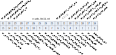
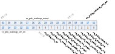
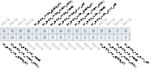
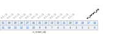

Register description
==========================

+--------------------+-------------+
| Name               | Description |
+--------------------+-------------+
| `PDS_CTL`_         |             |
+--------------------+-------------+
| `PDS_TIME1`_       |             |
+--------------------+-------------+
| `PDS_INT`_         |             |
+--------------------+-------------+
| `PDS_CTL2`_        |             |
+--------------------+-------------+
| `PDS_CTL3`_        |             |
+--------------------+-------------+
| `PDS_CTL4`_        |             |
+--------------------+-------------+
| `pds_stat`_        |             |
+--------------------+-------------+
| `pds_ram1`_        |             |
+--------------------+-------------+
| `PDS_CTL5`_        |             |
+--------------------+-------------+
| `PDS_RAM2`_        |             |
+--------------------+-------------+
| `pds_gpio_i_set`_  |             |
+--------------------+-------------+
| `pds_gpio_pd_set`_ |             |
+--------------------+-------------+
| `pds_gpio_int`_    |             |
+--------------------+-------------+
| `pds_gpio_stat`_   |             |
+--------------------+-------------+
| `PDS_RAM3`_        |             |
+--------------------+-------------+
| `PDS_RAM4`_        |             |
+--------------------+-------------+

PDS_CTL
---------
 
**Address：**  0x2000e000
 

.. table::
    :widths: 10, 15,10,10,55
    :width: 100%
    :align: center
     
    +----------+------------------------------+--------+-------------+------------------------------------------------------------------------------------------------------------------------------------------------------------------------------------------+
    | Bit      | Name                         |Type    | Reset       | Description                                                                                                                                                                              |
    +==========+==============================+========+=============+==========================================================================================================================================================================================+
    | 31       | cr_pds_gpio_iso_mode         | r/w    | 0           | 1: HW Keep GPIO  @ PDS7                                                                                                                                                                  |
    +          +                              +        +             +                                                                                                                                                                                          +
    |          |                              |        |             | 0 : Clear this bit after PDS7 to release GPIO                                                                                                                                            |
    +----------+------------------------------+--------+-------------+------------------------------------------------------------------------------------------------------------------------------------------------------------------------------------------+
    | 30       | RSVD                         |        |             |                                                                                                                                                                                          |
    +----------+------------------------------+--------+-------------+------------------------------------------------------------------------------------------------------------------------------------------------------------------------------------------+
    | 29:28    | cr_pds_ctrl_rf               | r/w    | 2'b01       | 00 : PDS don’t control RF on/off                                                                                                                                                         |
    +          +                              +        +             +                                                                                                                                                                                          +
    |          |                              |        |             | 01 : PDS control RF on/off depend on misc_pwr_off                                                                                                                                        |
    +          +                              +        +             +                                                                                                                                                                                          +
    |          |                              |        |             | 10 : PDS control RF on/off depend on  any power off                                                                                                                                      |
    +          +                              +        +             +                                                                                                                                                                                          +
    |          |                              |        |             | 11 : PDS control RF on/off whe  pds at idle state                                                                                                                                        |
    +----------+------------------------------+--------+-------------+------------------------------------------------------------------------------------------------------------------------------------------------------------------------------------------+
    | 27:23    | cr_pds_ldo11_vol             | r/w    | 5'h8        | LDO11 voltage value in PDS mode                                                                                                                                                          |
    +          +                              +        +             +                                                                                                                                                                                          +
    |          |                              |        |             | output voltage sel: 0: 0.9V, 4: 1.0V, 8: 1.1V, 12: 1.2V, 25mV/step                                                                                                                       |
    +----------+------------------------------+--------+-------------+------------------------------------------------------------------------------------------------------------------------------------------------------------------------------------------+
    | 22       | cr_pds_ctrl_wifipll_pd       | r/w    | 0           | PDS Control WIFI PLL off When pds_pwr_off                                                                                                                                                |
    +----------+------------------------------+--------+-------------+------------------------------------------------------------------------------------------------------------------------------------------------------------------------------------------+
    | 21       | RSVD                         |        |             |                                                                                                                                                                                          |
    +----------+------------------------------+--------+-------------+------------------------------------------------------------------------------------------------------------------------------------------------------------------------------------------+
    | 20       | cr_pds_ctrl_aupll_pd         | r/w    | 0           | PDS Control Audio PLL off When pds_pwr_off                                                                                                                                               |
    +----------+------------------------------+--------+-------------+------------------------------------------------------------------------------------------------------------------------------------------------------------------------------------------+
    | 19       | cr_pds_ctrl_usbpll_pd        | r/w    | 0           | PDS Control USB PLL off When pds_pwr_off                                                                                                                                                 |
    +----------+------------------------------+--------+-------------+------------------------------------------------------------------------------------------------------------------------------------------------------------------------------------------+
    | 18       | cr_pds_ldo11_vsel_en         | r/w    | 0           | PDS "SLEEP" control LDO11 voltage enable                                                                                                                                                 |
    +----------+------------------------------+--------+-------------+------------------------------------------------------------------------------------------------------------------------------------------------------------------------------------------+
    | 17       | cr_pds_rc32m_off_dis         | r/w    | 0           | 1 : RC32M always on  @any state                                                                                                                                                          |
    +          +                              +        +             +                                                                                                                                                                                          +
    |          |                              |        |             | 0 : RC32M on/off controlled by PDS state                                                                                                                                                 |
    +----------+------------------------------+--------+-------------+------------------------------------------------------------------------------------------------------------------------------------------------------------------------------------------+
    | 16       | cr_pds_rst_soc               | r/w    | 0           | 0 : no pds_reset                                                                                                                                                                         |
    +          +                              +        +             +                                                                                                                                                                                          +
    |          |                              |        |             | 1: pds_rst controlled by PDS                                                                                                                                                             |
    +----------+------------------------------+--------+-------------+------------------------------------------------------------------------------------------------------------------------------------------------------------------------------------------+
    | 15       | cr_pds_ctrl_soc_enb          | r/w    | 0           | 1 :pds_soc_enb controlled by PDS                                                                                                                                                         |
    +          +                              +        +             +                                                                                                                                                                                          +
    |          |                              |        |             | 0 :pds_soc_enb always active                                                                                                                                                             |
    +----------+------------------------------+--------+-------------+------------------------------------------------------------------------------------------------------------------------------------------------------------------------------------------+
    | 14       | cr_pds_pd_xtal               | r/w    | 1           | 0 : don’t_touch xtal  during PDS                                                                                                                                                         |
    +          +                              +        +             +                                                                                                                                                                                          +
    |          |                              |        |             | 1 : xtal power down during PDS                                                                                                                                                           |
    +----------+------------------------------+--------+-------------+------------------------------------------------------------------------------------------------------------------------------------------------------------------------------------------+
    | 13       | cr_pds_pwr_off               | r/w    | 1           | 0 : don’t_touch Power during PDS                                                                                                                                                         |
    +          +                              +        +             +                                                                                                                                                                                          +
    |          |                              |        |             | 1 : Power off during PDS      (each power domain can has its own control)                                                                                                                |
    +----------+------------------------------+--------+-------------+------------------------------------------------------------------------------------------------------------------------------------------------------------------------------------------+
    | 12       | cr_pds_wait_xtal_rdy         | r/w    | 0           | 0 : Skip wait XTAL Ready before  PDS Interrupt                                                                                                                                           |
    +          +                              +        +             +                                                                                                                                                                                          +
    |          |                              |        |             | 1 : wait XTAL Ready during before PDS Interrupt                                                                                                                                          |
    +----------+------------------------------+--------+-------------+------------------------------------------------------------------------------------------------------------------------------------------------------------------------------------------+
    | 11       | cr_pds_iso_en                | r/w    | 1           | 0 : don’t_touch Isolation during PDS (all power domain)                                                                                                                                  |
    +          +                              +        +             +                                                                                                                                                                                          +
    |          |                              |        |             | 1 : Isolation during PDS      (each power domain can has its own control)                                                                                                                |
    +----------+------------------------------+--------+-------------+------------------------------------------------------------------------------------------------------------------------------------------------------------------------------------------+
    | 10       | cr_pds_glb_reg_reset_protect | r/w    | 0           | 1: avoid glb_reg reset by any reset                                                                                                                                                      |
    +----------+------------------------------+--------+-------------+------------------------------------------------------------------------------------------------------------------------------------------------------------------------------------------+
    | 9        | cr_pds_mem_stby              | r/w    | 1           | 0 : don’t_touch mem_stby during PDS                                                                                                                                                      |
    +          +                              +        +             +                                                                                                                                                                                          +
    |          |                              |        |             | 1 : mem_stby during PDS     (each power domain can has its own control)                                                                                                                  |
    +----------+------------------------------+--------+-------------+------------------------------------------------------------------------------------------------------------------------------------------------------------------------------------------+
    | 8        | cr_pds_gate_clk              | r/w    | 1           | 0 : don’t_touch clock gating during PDS (all power domain)                                                                                                                               |
    +          +                              +        +             +                                                                                                                                                                                          +
    |          |                              |        |             | 1 : gate clock during PDS  (each pwr domain has its own control)                                                                                                                         |
    +----------+------------------------------+--------+-------------+------------------------------------------------------------------------------------------------------------------------------------------------------------------------------------------+
    | 7        | cr_pds_pd_dcdc18             | r/w    | 0           | 0 : don’t_touch dcdc18 during PDS                                                                                                                                                        |
    +          +                              +        +             +                                                                                                                                                                                          +
    |          |                              |        |             | 1 : power down dcdc18 during PDS                                                                                                                                                         |
    +----------+------------------------------+--------+-------------+------------------------------------------------------------------------------------------------------------------------------------------------------------------------------------------+
    | 6        | cr_pds_ctrl_gpio_ie_pu_pd    | r/w    | 0           | 1: allow PDS Control the GPIO IE/PU/PD at Sleep Mode                                                                                                                                     |
    +----------+------------------------------+--------+-------------+------------------------------------------------------------------------------------------------------------------------------------------------------------------------------------------+
    | 5        | cr_pds_pd_bg_sys             | r/w    | 0           | 0 : don’t_touch bg_sys during PDS                                                                                                                                                        |
    +          +                              +        +             +                                                                                                                                                                                          +
    |          |                              |        |             | 1 : power down bg_sys during PDS                                                                                                                                                         |
    +----------+------------------------------+--------+-------------+------------------------------------------------------------------------------------------------------------------------------------------------------------------------------------------+
    | 4        | cr_pds_pd_ldo11              | r/w    | 0           | 0 : don’t_touch ldo11 during PDS                                                                                                                                                         |
    +          +                              +        +             +                                                                                                                                                                                          +
    |          |                              |        |             | 1 : power down ldo11 during PDS                                                                                                                                                          |
    +----------+------------------------------+--------+-------------+------------------------------------------------------------------------------------------------------------------------------------------------------------------------------------------+
    | 3        | cr_pds_wifi_save_state       | r/w    | 0           | Save WIFI State Before Enter PDS                                                                                                                                                         |
    +----------+------------------------------+--------+-------------+------------------------------------------------------------------------------------------------------------------------------------------------------------------------------------------+
    | 2        | cr_xtal_force_off            | r/w    | 0           |                                                                                                                                                                                          |
    +----------+------------------------------+--------+-------------+------------------------------------------------------------------------------------------------------------------------------------------------------------------------------------------+
    | 1        | cr_sleep_forever             | r/w    | 0           |                                                                                                                                                                                          |
    +----------+------------------------------+--------+-------------+------------------------------------------------------------------------------------------------------------------------------------------------------------------------------------------+
    | 0        | pds_start_ps                 | w1p    | 0           | Enter PDS                                                                                                                                                                                |
    +----------+------------------------------+--------+-------------+------------------------------------------------------------------------------------------------------------------------------------------------------------------------------------------+

PDS_TIME1
-----------
 
**Address：**  0x2000e004
 

.. table::
    :widths: 10, 15,10,10,55
    :width: 100%
    :align: center
     
    +----------+------------------------------+--------+-------------+-----------------------------------------------+
    | Bit      | Name                         |Type    | Reset       | Description                                   |
    +==========+==============================+========+=============+===============================================+
    | 31:0     | cr_sleep_duration            | r/w    | 32'd3240    | PDS Sleep Time (in units of 32K clock cycles) |
    +----------+------------------------------+--------+-------------+-----------------------------------------------+

PDS_INT
---------
 
**Address：**  0x2000e00c
 

.. table::
    :widths: 10, 15,10,10,55
    :width: 100%
    :align: center
     
    +----------+------------------------------+--------+-------------+----------------------------+
    | Bit      | Name                         |Type    | Reset       | Description                |
    +==========+==============================+========+=============+============================+
    | 31:9     | RSVD                         |        |             |                            |
    +----------+------------------------------+--------+-------------+----------------------------+
    | 8        | cr_pds_int_clr               | r/w    | 0           | pds interrupt clear        |
    +----------+------------------------------+--------+-------------+----------------------------+
    | 7:6      | RSVD                         |        |             |                            |
    +----------+------------------------------+--------+-------------+----------------------------+
    | 5        | cr_pds_rf_done_int_mask      | r/w    | 0           | Mask pds rf done interrupt |
    +----------+------------------------------+--------+-------------+----------------------------+
    | 4        | cr_pds_wake_int_mask         | r/w    | 0           | Mask pds wakeup interrupt  |
    +----------+------------------------------+--------+-------------+----------------------------+
    | 3:2      | RSVD                         |        |             |                            |
    +----------+------------------------------+--------+-------------+----------------------------+
    | 1        | ro_pds_rf_done_int           | r      | 0           | pu_rf_done interrupt       |
    +----------+------------------------------+--------+-------------+----------------------------+
    | 0        | ro_pds_wake_int              | r      | 0           | PDS Wakeup Interrupt       |
    +----------+------------------------------+--------+-------------+----------------------------+

PDS_CTL2
----------
 
**Address：**  0x2000e010
 
.. figure:: ../../picture/pds_PDS_CTL2.svg
   :align: center

.. table::
    :widths: 10, 15,10,10,55
    :width: 100%
    :align: center
     
    +----------+------------------------------+--------+-------------+---------------------------------+
    | Bit      | Name                         |Type    | Reset       | Description                     |
    +==========+==============================+========+=============+=================================+
    | 31:20    | RSVD                         |        |             |                                 |
    +----------+------------------------------+--------+-------------+---------------------------------+
    | 19       | cr_pds_force_usb_gate_clk    | r/w    | 0           | manual force usbio clock gated  |
    +----------+------------------------------+--------+-------------+---------------------------------+
    | 18       | cr_pds_force_wb_gate_clk     | r/w    | 0           | manual force WB clock gated     |
    +----------+------------------------------+--------+-------------+---------------------------------+
    | 17       | RSVD                         |        |             |                                 |
    +----------+------------------------------+--------+-------------+---------------------------------+
    | 16       | cr_pds_force_np_gate_clk     | r/w    | 0           | manual force NP clock gated     |
    +----------+------------------------------+--------+-------------+---------------------------------+
    | 15       | cr_pds_force_usb_mem_stby    | r/w    | 0           | manual force usbio memory sleep |
    +----------+------------------------------+--------+-------------+---------------------------------+
    | 14       | cr_pds_force_wb_mem_stby     | r/w    | 0           | manual force WB memory sleep    |
    +----------+------------------------------+--------+-------------+---------------------------------+
    | 13       | RSVD                         |        |             |                                 |
    +----------+------------------------------+--------+-------------+---------------------------------+
    | 12       | cr_pds_force_np_mem_stby     | r/w    | 0           | manual force NP memory sleep    |
    +----------+------------------------------+--------+-------------+---------------------------------+
    | 11       | cr_pds_force_usb_pds_rst     | r/w    | 0           | manual force usbio pds reset    |
    +----------+------------------------------+--------+-------------+---------------------------------+
    | 10       | cr_pds_force_wb_pds_rst      | r/w    | 0           | manual force WB pds reset       |
    +----------+------------------------------+--------+-------------+---------------------------------+
    | 9        | RSVD                         |        |             |                                 |
    +----------+------------------------------+--------+-------------+---------------------------------+
    | 8        | cr_pds_force_np_pds_rst      | r/w    | 0           | manual force NP pds reset       |
    +----------+------------------------------+--------+-------------+---------------------------------+
    | 7        | cr_pds_force_usb_iso_en      | r/w    | 0           | manual force usbio isolation    |
    +----------+------------------------------+--------+-------------+---------------------------------+
    | 6        | cr_pds_force_wb_iso_en       | r/w    | 0           | manual force WB isolation       |
    +----------+------------------------------+--------+-------------+---------------------------------+
    | 5        | RSVD                         |        |             |                                 |
    +----------+------------------------------+--------+-------------+---------------------------------+
    | 4        | cr_pds_force_np_iso_en       | r/w    | 0           | manual force NP isolation       |
    +----------+------------------------------+--------+-------------+---------------------------------+
    | 3        | cr_pds_force_usb_pwr_off     | r/w    | 0           | manual force usbio power off    |
    +----------+------------------------------+--------+-------------+---------------------------------+
    | 2        | cr_pds_force_wb_pwr_off      | r/w    | 0           | manual force WB power off       |
    +----------+------------------------------+--------+-------------+---------------------------------+
    | 1        | RSVD                         |        |             |                                 |
    +----------+------------------------------+--------+-------------+---------------------------------+
    | 0        | cr_pds_force_np_pwr_off      | r/w    | 0           | manual force NP power off       |
    +----------+------------------------------+--------+-------------+---------------------------------+

PDS_CTL3
----------
 
**Address：**  0x2000e014
 

.. table::
    :widths: 10, 15,10,10,55
    :width: 100%
    :align: center
     
    +----------+------------------------------+--------+-------------+-------------------------------------------------------------------------------------+
    | Bit      | Name                         |Type    | Reset       | Description                                                                         |
    +==========+==============================+========+=============+=====================================================================================+
    | 31       | RSVD                         |        |             |                                                                                     |
    +----------+------------------------------+--------+-------------+-------------------------------------------------------------------------------------+
    | 30       | cr_pds_misc_iso_en           | r/w    | 1           | 1 : make misc isolated at PDS Sleep state                                           |
    +          +                              +        +             +                                                                                     +
    |          |                              |        |             | 0 : make misc isolated at PDS Sleep state                                           |
    +----------+------------------------------+--------+-------------+-------------------------------------------------------------------------------------+
    | 29       | cr_pds_usb_iso_en            | r/w    | 1           | 1 : make usb isolated at PDS Sleep state                                            |
    +          +                              +        +             +                                                                                     +
    |          |                              |        |             | 0 : make usb isolated at PDS Sleep state                                            |
    +----------+------------------------------+--------+-------------+-------------------------------------------------------------------------------------+
    | 28       | RSVD                         |        |             |                                                                                     |
    +----------+------------------------------+--------+-------------+-------------------------------------------------------------------------------------+
    | 27       | cr_pds_wb_iso_en             | r/w    | 1           | 1 : make WB isolated at PDS Sleep state                                             |
    +          +                              +        +             +                                                                                     +
    |          |                              |        |             | 0 : make WB isolated at PDS Sleep state                                             |
    +----------+------------------------------+--------+-------------+-------------------------------------------------------------------------------------+
    | 26:25    | RSVD                         |        |             |                                                                                     |
    +----------+------------------------------+--------+-------------+-------------------------------------------------------------------------------------+
    | 24       | cr_pds_np_iso_en             | r/w    | 1           | 1 : make NP isolated at PDS Sleep state                                             |
    +          +                              +        +             +                                                                                     +
    |          |                              |        |             | 0 : make NP isolated at PDS Sleep state                                             |
    +----------+------------------------------+--------+-------------+-------------------------------------------------------------------------------------+
    | 23:14    | RSVD                         |        |             |                                                                                     |
    +----------+------------------------------+--------+-------------+-------------------------------------------------------------------------------------+
    | 13       | cr_pds_force_misc_gate_clk   | r/w    | 0           | manual force MISC gate_clk                                                          |
    +----------+------------------------------+--------+-------------+-------------------------------------------------------------------------------------+
    | 12:11    | RSVD                         |        |             |                                                                                     |
    +----------+------------------------------+--------+-------------+-------------------------------------------------------------------------------------+
    | 10       | cr_pds_force_misc_mem_stby   | r/w    | 0           | manual force MISC mem_stby                                                          |
    +----------+------------------------------+--------+-------------+-------------------------------------------------------------------------------------+
    | 9:8      | RSVD                         |        |             |                                                                                     |
    +----------+------------------------------+--------+-------------+-------------------------------------------------------------------------------------+
    | 7        | cr_pds_force_misc_pds_rst    | r/w    | 0           | manual force MISC pds_rst                                                           |
    +----------+------------------------------+--------+-------------+-------------------------------------------------------------------------------------+
    | 6:5      | RSVD                         |        |             |                                                                                     |
    +----------+------------------------------+--------+-------------+-------------------------------------------------------------------------------------+
    | 4        | cr_pds_force_misc_iso_en     | r/w    | 0           | manual force MISC iso_en                                                            |
    +----------+------------------------------+--------+-------------+-------------------------------------------------------------------------------------+
    | 3:2      | RSVD                         |        |             |                                                                                     |
    +----------+------------------------------+--------+-------------+-------------------------------------------------------------------------------------+
    | 1        | cr_pds_force_misc_pwr_off    | r/w    | 0           | manual force MISC pwr_off                                                           |
    +----------+------------------------------+--------+-------------+-------------------------------------------------------------------------------------+
    | 0        | RSVD                         |        |             |                                                                                     |
    +----------+------------------------------+--------+-------------+-------------------------------------------------------------------------------------+

PDS_CTL4
----------
 
**Address：**  0x2000e018
 

.. table::
    :widths: 10, 15,10,10,55
    :width: 100%
    :align: center
     
    +----------+------------------------------+--------+-------------+---------------------------------------------------------------------------------------------------------+
    | Bit      | Name                         |Type    | Reset       | Description                                                                                             |
    +==========+==============================+========+=============+=========================================================================================================+
    | 31:28    | RSVD                         |        |             |                                                                                                         |
    +----------+------------------------------+--------+-------------+---------------------------------------------------------------------------------------------------------+
    | 27       | cr_pds_misc_gate_clk         | r/w    | 1           | 1 : make core_misc clock gated at PDS Sleep state                                                       |
    +          +                              +        +             +                                                                                                         +
    |          |                              |        |             | 0 : make core_misc clocking at PDS Sleep state                                                          |
    +----------+------------------------------+--------+-------------+---------------------------------------------------------------------------------------------------------+
    | 26       | cr_pds_misc_mem_stby         | r/w    | 1           | 1 : make core_misc RAM @Retention at PDS Sleep state                                                    |
    +          +                              +        +             +                                                                                                         +
    |          |                              |        |             | 0 : make core_misc RAM @ Normal at PDS Sleep state                                                      |
    +----------+------------------------------+--------+-------------+---------------------------------------------------------------------------------------------------------+
    | 25       | cr_pds_misc_reset            | r/w    | 1           | 1 : make core_misc reset at PDS Sleep state                                                             |
    +          +                              +        +             +                                                                                                         +
    |          |                              |        |             | 0 : make core_misc not reset at PDS Sleep state                                                         |
    +----------+------------------------------+--------+-------------+---------------------------------------------------------------------------------------------------------+
    | 24       | cr_pds_misc_pwr_off          | r/w    | 1           | 1 : make core_misc Power off at PDS Sleep state                                                         |
    +          +                              +        +             +                                                                                                         +
    |          |                              |        |             | 0 : make core_misc power on at PDS Sleep state                                                          |
    +----------+------------------------------+--------+-------------+---------------------------------------------------------------------------------------------------------+
    | 23       | cr_pds_usb_gate_clk          | r/w    | 1           | 1 : make usb clock gated at PDS Sleep state                                                             |
    +          +                              +        +             +                                                                                                         +
    |          |                              |        |             | 0 : make usb clocking at PDS Sleep state                                                                |
    +----------+------------------------------+--------+-------------+---------------------------------------------------------------------------------------------------------+
    | 22       | cr_pds_usb_mem_stby          | r/w    | 1           | 1 : make usb RAM @Retention at PDS Sleep state                                                          |
    +          +                              +        +             +                                                                                                         +
    |          |                              |        |             | 0 : make usb RAM @ Normal at PDS Sleep state                                                            |
    +----------+------------------------------+--------+-------------+---------------------------------------------------------------------------------------------------------+
    | 21       | cr_pds_usb_reset             | r/w    | 1           | 1 : make usb reset at PDS Sleep state                                                                   |
    +          +                              +        +             +                                                                                                         +
    |          |                              |        |             | 0 : make usb not reset at PDS Sleep state                                                               |
    +----------+------------------------------+--------+-------------+---------------------------------------------------------------------------------------------------------+
    | 20       | cr_pds_usb_pwr_off           | r/w    | 1           | 1 : make usb Power off at PDS Sleep state                                                               |
    +          +                              +        +             +                                                                                                         +
    |          |                              |        |             | 0 : make usb power on at PDS Sleep state                                                                |
    +----------+------------------------------+--------+-------------+---------------------------------------------------------------------------------------------------------+
    | 19:16    | RSVD                         |        |             |                                                                                                         |
    +----------+------------------------------+--------+-------------+---------------------------------------------------------------------------------------------------------+
    | 15       | cr_pds_wb_gate_clk           | r/w    | 1           | 1 : make WB clock gated at PDS Sleep state                                                              |
    +          +                              +        +             +                                                                                                         +
    |          |                              |        |             | 0 : make WB clocking at PDS Sleep state                                                                 |
    +----------+------------------------------+--------+-------------+---------------------------------------------------------------------------------------------------------+
    | 14       | cr_pds_wb_mem_stby           | r/w    | 1           | 1 : make WB RAM @Retention at PDS Sleep state                                                           |
    +          +                              +        +             +                                                                                                         +
    |          |                              |        |             | 0 : make WB RAM @ Normal at PDS Sleep state                                                             |
    +----------+------------------------------+--------+-------------+---------------------------------------------------------------------------------------------------------+
    | 13       | cr_pds_wb_reset              | r/w    | 1           | 1 : make WB reset at PDS Sleep state                                                                    |
    +          +                              +        +             +                                                                                                         +
    |          |                              |        |             | 0 : make WB not reset at PDS Sleep state                                                                |
    +----------+------------------------------+--------+-------------+---------------------------------------------------------------------------------------------------------+
    | 12       | cr_pds_wb_pwr_off            | r/w    | 1           | 1 : make WB Power off at PDS Sleep state                                                                |
    +          +                              +        +             +                                                                                                         +
    |          |                              |        |             | 0 : make WB power on at PDS Sleep state                                                                 |
    +----------+------------------------------+--------+-------------+---------------------------------------------------------------------------------------------------------+
    | 11:4     | RSVD                         |        |             |                                                                                                         |
    +----------+------------------------------+--------+-------------+---------------------------------------------------------------------------------------------------------+
    | 3        | cr_pds_np_gate_clk           | r/w    | 1           | 1 : make NP clock gated at PDS Sleep state                                                              |
    +          +                              +        +             +                                                                                                         +
    |          |                              |        |             | 0 : make NP clocking at PDS Sleep state                                                                 |
    +----------+------------------------------+--------+-------------+---------------------------------------------------------------------------------------------------------+
    | 2        | cr_pds_np_mem_stby           | r/w    | 1           | 1 : make NP RAM @Retention at PDS Sleep state                                                           |
    +          +                              +        +             +                                                                                                         +
    |          |                              |        |             | 0 : make NP RAM @ Normal at PDS Sleep state                                                             |
    +----------+------------------------------+--------+-------------+---------------------------------------------------------------------------------------------------------+
    | 1        | cr_pds_np_reset              | r/w    | 1           | 1 : make NP reset at PDS Sleep state                                                                    |
    +          +                              +        +             +                                                                                                         +
    |          |                              |        |             | 0 : make NP not reset at PDS Sleep state                                                                |
    +----------+------------------------------+--------+-------------+---------------------------------------------------------------------------------------------------------+
    | 0        | cr_pds_np_pwr_off            | r/w    | 1           | 1 : make NP Power off at PDS Sleep state                                                                |
    +          +                              +        +             +                                                                                                         +
    |          |                              |        |             | 0 : make NP power on at PDS Sleep state                                                                 |
    +----------+------------------------------+--------+-------------+---------------------------------------------------------------------------------------------------------+

pds_stat
----------
 
**Address：**  0x2000e01c
 

.. table::
    :widths: 10, 15,10,10,55
    :width: 100%
    :align: center
     
    +----------+------------------------------+--------+-------------+-----------------------------------------------------------------------------------------------------------------------------------------------------------------------------------------------------------------------------------------------------------------------------------------------------------------------------------------------------------------------------------------------------------------------------------------------------------------------------------------------------------------------------------------------+
    | Bit      | Name                         |Type    | Reset       | Description                                                                                                                                                                                                                                                                                                                                                                                                                                                                                                                                   |
    +==========+==============================+========+=============+===============================================================================================================================================================================================================================================================================================================================================================================================================================================================================================================================================+
    | 31       | pds_clr_reset_event          | w1c    | 0           | clear pds reset event                                                                                                                                                                                                                                                                                                                                                                                                                                                                                                                         |
    +----------+------------------------------+--------+-------------+-----------------------------------------------------------------------------------------------------------------------------------------------------------------------------------------------------------------------------------------------------------------------------------------------------------------------------------------------------------------------------------------------------------------------------------------------------------------------------------------------------------------------------------------------+
    | 30:27    | RSVD                         |        |             |                                                                                                                                                                                                                                                                                                                                                                                                                                                                                                                                               |
    +----------+------------------------------+--------+-------------+-----------------------------------------------------------------------------------------------------------------------------------------------------------------------------------------------------------------------------------------------------------------------------------------------------------------------------------------------------------------------------------------------------------------------------------------------------------------------------------------------------------------------------------------------+
    | 26:24    | pds_reset_event              | r      | 0           | [2] : pds_rst_n (pds reset)                                                                                                                                                                                                                                                                                                                                                                                                                                                                                                                   |
    +          +                              +        +             +                                                                                                                                                                                                                                                                                                                                                                                                                                                                                                                                               +
    |          |                              |        |             | [1]: pwr_rst_n (hbn power on reset)                                                                                                                                                                                                                                                                                                                                                                                                                                                                                                           |
    +          +                              +        +             +                                                                                                                                                                                                                                                                                                                                                                                                                                                                                                                                               +
    |          |                              |        |             | [0]: hreset_n (Bus Reset)                                                                                                                                                                                                                                                                                                                                                                                                                                                                                                                     |
    +----------+------------------------------+--------+-------------+-----------------------------------------------------------------------------------------------------------------------------------------------------------------------------------------------------------------------------------------------------------------------------------------------------------------------------------------------------------------------------------------------------------------------------------------------------------------------------------------------------------------------------------------------+
    | 23:13    | RSVD                         |        |             |                                                                                                                                                                                                                                                                                                                                                                                                                                                                                                                                               |
    +----------+------------------------------+--------+-------------+-----------------------------------------------------------------------------------------------------------------------------------------------------------------------------------------------------------------------------------------------------------------------------------------------------------------------------------------------------------------------------------------------------------------------------------------------------------------------------------------------------------------------------------------------+
    | 12:8     | ro_pds_rf_state              | r      | 5'b0        | ST_PDS_RF_OFF         = 5'b0000 ;                                                                                                                                                                                                                                                                                                                                                                                                                                                                                                             |
    +          +                              +        +             +                                                                                                                                                                                                                                                                                                                                                                                                                                                                                                                                               +
    |          |                              |        |             | ST_PDS_PU_MBG         = 5'b0001 ;                                                                                                                                                                                                                                                                                                                                                                                                                                                                                                             |
    +          +                              +        +             +                                                                                                                                                                                                                                                                                                                                                                                                                                                                                                                                               +
    |          |                              |        |             | ST_PDS_PU_LDO15RF = 5'b0011 ;                                                                                                                                                                                                                                                                                                                                                                                                                                                                                                                 |
    +          +                              +        +             +                                                                                                                                                                                                                                                                                                                                                                                                                                                                                                                                               +
    |          |                              |        |             | ST_PDS_PU_SFREG     = 5'b0111 ;                                                                                                                                                                                                                                                                                                                                                                                                                                                                                                               |
    +          +                              +        +             +                                                                                                                                                                                                                                                                                                                                                                                                                                                                                                                                               +
    |          |                              |        |             | ST_PDS_PUD_XTAL18 = 5'b01111;                                                                                                                                                                                                                                                                                                                                                                                                                                                                                                                 |
    +          +                              +        +             +                                                                                                                                                                                                                                                                                                                                                                                                                                                                                                                                               +
    |          |                              |        |             | ST_PDS_WB_EN_AON  = 5'b11111 ;                                                                                                                                                                                                                                                                                                                                                                                                                                                                                                                |
    +----------+------------------------------+--------+-------------+-----------------------------------------------------------------------------------------------------------------------------------------------------------------------------------------------------------------------------------------------------------------------------------------------------------------------------------------------------------------------------------------------------------------------------------------------------------------------------------------------------------------------------------------------+
    | 7:5      | RSVD                         |        |             |                                                                                                                                                                                                                                                                                                                                                                                                                                                                                                                                               |
    +----------+------------------------------+--------+-------------+-----------------------------------------------------------------------------------------------------------------------------------------------------------------------------------------------------------------------------------------------------------------------------------------------------------------------------------------------------------------------------------------------------------------------------------------------------------------------------------------------------------------------------------------------+
    | 4:0      | ro_pds_state                 | r      | 5'b0        | ST_IDLE           = 5'b00000;                                                                                                                                                                                                                                                                                                                                                                                                                                                                                                                 |
    +          +                              +        +             +                                                                                                                                                                                                                                                                                                                                                                                                                                                                                                                                               +
    |          |                              |        |             | ST_MEM_STBY = 5'b10000;                                                                                                                                                                                                                                                                                                                                                                                                                                                                                                                       |
    +          +                              +        +             +                                                                                                                                                                                                                                                                                                                                                                                                                                                                                                                                               +
    |          |                              |        |             | ST_ECG            = 5'b01000;                                                                                                                                                                                                                                                                                                                                                                                                                                                                                                                 |
    +          +                              +        +             +                                                                                                                                                                                                                                                                                                                                                                                                                                                                                                                                               +
    |          |                              |        |             | ST_ERST          = 5'b01100;                                                                                                                                                                                                                                                                                                                                                                                                                                                                                                                  |
    +          +                              +        +             +                                                                                                                                                                                                                                                                                                                                                                                                                                                                                                                                               +
    |          |                              |        |             | ST_EISO           = 5'b01111;                                                                                                                                                                                                                                                                                                                                                                                                                                                                                                                 |
    +          +                              +        +             +                                                                                                                                                                                                                                                                                                                                                                                                                                                                                                                                               +
    |          |                              |        |             | ST_POFF           = 5'b00111;                                                                                                                                                                                                                                                                                                                                                                                                                                                                                                                 |
    +          +                              +        +             +                                                                                                                                                                                                                                                                                                                                                                                                                                                                                                                                               +
    |          |                              |        |             | ST_PRE_BGON  = 5'b00011;                                                                                                                                                                                                                                                                                                                                                                                                                                                                                                                      |
    +          +                              +        +             +                                                                                                                                                                                                                                                                                                                                                                                                                                                                                                                                               +
    |          |                              |        |             | ST_PRE_BGON1 = 5'b00001;                                                                                                                                                                                                                                                                                                                                                                                                                                                                                                                      |
    +          +                              +        +             +                                                                                                                                                                                                                                                                                                                                                                                                                                                                                                                                               +
    |          |                              |        |             | ST_BGON           = 5'b00101;                                                                                                                                                                                                                                                                                                                                                                                                                                                                                                                 |
    +          +                              +        +             +                                                                                                                                                                                                                                                                                                                                                                                                                                                                                                                                               +
    |          |                              |        |             | ST_CLK_SW_32M= 5'b00100;                                                                                                                                                                                                                                                                                                                                                                                                                                                                                                                      |
    +          +                              +        +             +                                                                                                                                                                                                                                                                                                                                                                                                                                                                                                                                               +
    |          |                              |        |             | ST_PON_DCDC    = 5'b00110;                                                                                                                                                                                                                                                                                                                                                                                                                                                                                                                    |
    +          +                              +        +             +                                                                                                                                                                                                                                                                                                                                                                                                                                                                                                                                               +
    |          |                              |        |             | ST_PON_LDO11_MISC = 5'b01110;                                                                                                                                                                                                                                                                                                                                                                                                                                                                                                                 |
    +          +                              +        +             +                                                                                                                                                                                                                                                                                                                                                                                                                                                                                                                                               +
    |          |                              |        |             | ST_PON             = 5'b01010;                                                                                                                                                                                                                                                                                                                                                                                                                                                                                                                |
    +          +                              +        +             +                                                                                                                                                                                                                                                                                                                                                                                                                                                                                                                                               +
    |          |                              |        |             | ST_DISO           = 5'b00010;                                                                                                                                                                                                                                                                                                                                                                                                                                                                                                                 |
    +          +                              +        +             +                                                                                                                                                                                                                                                                                                                                                                                                                                                                                                                                               +
    |          |                              |        |             | ST_DCG            = 5'b01101;                                                                                                                                                                                                                                                                                                                                                                                                                                                                                                                 |
    +          +                              +        +             +                                                                                                                                                                                                                                                                                                                                                                                                                                                                                                                                               +
    |          |                              |        |             | ST_MEM_IDLE   = 5'b11000;                                                                                                                                                                                                                                                                                                                                                                                                                                                                                                                     |
    +          +                              +        +             +                                                                                                                                                                                                                                                                                                                                                                                                                                                                                                                                               +
    |          |                              |        |             | ST_DRST           = 5'b01011;                                                                                                                                                                                                                                                                                                                                                                                                                                                                                                                 |
    +          +                              +        +             +                                                                                                                                                                                                                                                                                                                                                                                                                                                                                                                                               +
    |          |                              |        |             | ST_WAIT_EFUSE= 5'b01001;                                                                                                                                                                                                                                                                                                                                                                                                                                                                                                                      |
    +          +                              +        +             +                                                                                                                                                                                                                                                                                                                                                                                                                                                                                                                                               +
    |          |                              |        |             |                                                                                                                                                                                                                                                                                                                                                                                                                                                                                                                                               |
    +----------+------------------------------+--------+-------------+-----------------------------------------------------------------------------------------------------------------------------------------------------------------------------------------------------------------------------------------------------------------------------------------------------------------------------------------------------------------------------------------------------------------------------------------------------------------------------------------------------------------------------------------------+

pds_ram1
----------
 
**Address：**  0x2000e020
 
.. figure:: ../../picture/pds_pds_ram1.svg
   :align: center

.. table::
    :widths: 10, 15,10,10,55
    :width: 100%
    :align: center
     
    +----------+------------------------------+--------+-------------+---------------------------------------------------------------------------------------------------------------------------------------------------------+
    | Bit      | Name                         |Type    | Reset       | Description                                                                                                                                             |
    +==========+==============================+========+=============+=========================================================================================================================================================+
    | 31       | cr_pds_ctrl_ram_clk          | r/w    | 1'b0        | 1 : Enable PDS Control PD_CORE SRAM Clock @ PDS Sequence                                                                                                |
    +          +                              +        +             +                                                                                                                                                         +
    |          |                              |        |             |                                                                                                                                                         |
    +----------+------------------------------+--------+-------------+---------------------------------------------------------------------------------------------------------------------------------------------------------+
    | 30       | cr_pds_ctrl_ram_clk2         | r/w    | 1'b0        | HW Option                                                                                                                                               |
    +          +                              +        +             +                                                                                                                                                         +
    |          |                              |        |             | To assert extra clock during PDS on sequence                                                                                                            |
    +----------+------------------------------+--------+-------------+---------------------------------------------------------------------------------------------------------------------------------------------------------+
    | 29       | RSVD                         |        |             |                                                                                                                                                         |
    +----------+------------------------------+--------+-------------+---------------------------------------------------------------------------------------------------------------------------------------------------------+
    | 28       | cr_pds_ctrl_misc_ram_clk     | r/w    | 1'b0        | This bit is Enable by bit [31] : cr_pds_ctrl_ram_clk                                                                                                    |
    +          +                              +        +             +                                                                                                                                                         +
    |          |                              |        |             | 1 : PDS Control PD_CORE_MISC SRAM Clock @ PDS Sequence                                                                                                  |
    +          +                              +        +             +                                                                                                                                                         +
    |          |                              |        |             | 0 : PDS do nothing on SRAM Clock                                                                                                                        |
    +----------+------------------------------+--------+-------------+---------------------------------------------------------------------------------------------------------------------------------------------------------+
    | 27       | cr_pds_ctrl_usb_ram_clk      | r/w    | 1'b0        | This bit is Enable by bit [31] : cr_pds_ctrl_ram_clk                                                                                                    |
    +          +                              +        +             +                                                                                                                                                         +
    |          |                              |        |             | 1 : PDS Control PD_usb SRAM Clock @ PDS Sequence                                                                                                        |
    +          +                              +        +             +                                                                                                                                                         +
    |          |                              |        |             | 0 : PDS do nothing on PD_usb SRAM Clock                                                                                                                 |
    +----------+------------------------------+--------+-------------+---------------------------------------------------------------------------------------------------------------------------------------------------------+
    | 26       | cr_pds_ctrl_wb_ram_clk       | r/w    | 1'b0        | This bit is Enable by bit [31] : cr_pds_ctrl_ram_clk                                                                                                    |
    +          +                              +        +             +                                                                                                                                                         +
    |          |                              |        |             | 1 : PDS Control PD_WB SRAM Clock @ PDS Sequence                                                                                                         |
    +          +                              +        +             +                                                                                                                                                         +
    |          |                              |        |             | 0 : PDS do nothing on PD_WB SRAM Clock                                                                                                                  |
    +----------+------------------------------+--------+-------------+---------------------------------------------------------------------------------------------------------------------------------------------------------+
    | 25       | RSVD                         |        |             |                                                                                                                                                         |
    +----------+------------------------------+--------+-------------+---------------------------------------------------------------------------------------------------------------------------------------------------------+
    | 24       | cr_pds_ctrl_np_ram_clk       | r/w    | 1'b0        | This bit is Enable by bit [31] : cr_pds_ctrl_ram_clk                                                                                                    |
    +          +                              +        +             +                                                                                                                                                         +
    |          |                              |        |             | 1 : PDS Control PD_CORE_CPU SRAM Clock @ PDS Sequence                                                                                                   |
    +          +                              +        +             +                                                                                                                                                         +
    |          |                              |        |             | 0 : PDS do nothing on PD_CORE_CPU SRAM Clock                                                                                                            |
    +----------+------------------------------+--------+-------------+---------------------------------------------------------------------------------------------------------------------------------------------------------+
    | 23:22    | RSVD                         |        |             |                                                                                                                                                         |
    +----------+------------------------------+--------+-------------+---------------------------------------------------------------------------------------------------------------------------------------------------------+
    | 21:16    | cr_pds_ram_clk2_cnt          | r/w    | 6'd24       | HW Option : Assert Extra Clock Counter in MEM_IDLE                                                                                                      |
    +----------+------------------------------+--------+-------------+---------------------------------------------------------------------------------------------------------------------------------------------------------+
    | 15:14    | RSVD                         |        |             |                                                                                                                                                         |
    +----------+------------------------------+--------+-------------+---------------------------------------------------------------------------------------------------------------------------------------------------------+
    | 13:8     | cr_pds_ram_clk_cnt           | r/w    | 6'd8        | HW Option : Assert Extra Clock Counter in  MEM_STBY                                                                                                     |
    +----------+------------------------------+--------+-------------+---------------------------------------------------------------------------------------------------------------------------------------------------------+
    | 7:0      | RSVD                         |        |             |                                                                                                                                                         |
    +----------+------------------------------+--------+-------------+---------------------------------------------------------------------------------------------------------------------------------------------------------+

PDS_CTL5
----------
 
**Address：**  0x2000e024
 

.. table::
    :widths: 10, 15,10,10,55
    :width: 100%
    :align: center
     
    +----------+------------------------------+--------+-------------+--------------------------------------------------------------------------------------------------------------------------------------------------------+
    | Bit      | Name                         |Type    | Reset       | Description                                                                                                                                            |
    +==========+==============================+========+=============+========================================================================================================================================================+
    | 31:19    | RSVD                         |        |             |                                                                                                                                                        |
    +----------+------------------------------+--------+-------------+--------------------------------------------------------------------------------------------------------------------------------------------------------+
    | 18:16    | cr_pds_gpio_keep_en          | r/w    | 3'b111      | if cr_pds_gpio_iso_mode=1, can use bit to enable or disable keep function                                                                              |
    +          +                              +        +             +                                                                                                                                                        +
    |          |                              |        |             | [0] : GPIO0~15                                                                                                                                         |
    +          +                              +        +             +                                                                                                                                                        +
    |          |                              |        |             | [1] : GPIO20~36 (not include GPIO21/22/28/29)                                                                                                          |
    +          +                              +        +             +                                                                                                                                                        +
    |          |                              |        |             | [2] : GPIO16~19                                                                                                                                        |
    +----------+------------------------------+--------+-------------+--------------------------------------------------------------------------------------------------------------------------------------------------------+
    | 15:10    | RSVD                         |        |             |                                                                                                                                                        |
    +----------+------------------------------+--------+-------------+--------------------------------------------------------------------------------------------------------------------------------------------------------+
    | 9        | cr_pds_pd_ldo18io            | r/w    | 0           | 0 : don’t_touch ldo18io during PDS                                                                                                                     |
    +          +                              +        +             +                                                                                                                                                        +
    |          |                              |        |             | 1 : power down ldo18io during PDS                                                                                                                      |
    +----------+------------------------------+--------+-------------+--------------------------------------------------------------------------------------------------------------------------------------------------------+
    | 8        | cr_pds_ctrl_usb33            | r/w    | 0           | Set this bit to enable HW control turn on/off USB 3.3V @USB1.1V Power On/OFF                                                                           |
    +          +                              +        +             +                                                                                                                                                        +
    |          |                              |        |             | (Replace the function of reg_pu_usb20_psw)                                                                                                             |
    +----------+------------------------------+--------+-------------+--------------------------------------------------------------------------------------------------------------------------------------------------------+
    | 7:2      | RSVD                         |        |             |                                                                                                                                                        |
    +----------+------------------------------+--------+-------------+--------------------------------------------------------------------------------------------------------------------------------------------------------+
    | 1        | cr_pds_pad_od_en             | r/w    | 0           | GPIO21/22/28/29 5V Tolerant PAD Open Drain Enable                                                                                                      |
    +----------+------------------------------+--------+-------------+--------------------------------------------------------------------------------------------------------------------------------------------------------+
    | 0        | cr_np_wfi_mask               | r/w    | 0           | pds start condition mask np_wfi                                                                                                                        |
    +----------+------------------------------+--------+-------------+--------------------------------------------------------------------------------------------------------------------------------------------------------+

PDS_RAM2
----------
 
**Address：**  0x2000e028
 

.. table::
    :widths: 10, 15,10,10,55
    :width: 100%
    :align: center
     
    +----------+------------------------------+--------+-------------+---------------------------------------------------------------------------------------------------------------------------------------------------------------------------------------------------------------------------------------------------------------------------------------------------------------------------------------------+
    | Bit      | Name                         |Type    | Reset       | Description                                                                                                                                                                                                                                                                                                                                 |
    +==========+==============================+========+=============+=============================================================================================================================================================================================================================================================================================================================================+
    | 31:20    | RSVD                         |        |             |                                                                                                                                                                                                                                                                                                                                             |
    +----------+------------------------------+--------+-------------+---------------------------------------------------------------------------------------------------------------------------------------------------------------------------------------------------------------------------------------------------------------------------------------------------------------------------------------------+
    | 19:10    | cr_wram_ret                  | r/w    | 10'h0       | [9]    : 144~160KB WRAM Retention                                                                                                                                                                                                                                                                                                           |
    +          +                              +        +             +                                                                                                                                                                                                                                                                                                                                             +
    |          |                              |        |             | [8]    : 128~144KB   WRAM Retention                                                                                                                                                                                                                                                                                                         |
    +          +                              +        +             +                                                                                                                                                                                                                                                                                                                                             +
    |          |                              |        |             | [7]    : 112~128KB WRAM Retention                                                                                                                                                                                                                                                                                                           |
    +          +                              +        +             +                                                                                                                                                                                                                                                                                                                                             +
    |          |                              |        |             | [6]    : 96~112KB WRAM Retention                                                                                                                                                                                                                                                                                                            |
    +          +                              +        +             +                                                                                                                                                                                                                                                                                                                                             +
    |          |                              |        |             | [5]    : 80~96KB WRAM Retention                                                                                                                                                                                                                                                                                                             |
    +          +                              +        +             +                                                                                                                                                                                                                                                                                                                                             +
    |          |                              |        |             | [4]    : 64~80KB   WRAM Retention                                                                                                                                                                                                                                                                                                           |
    +          +                              +        +             +                                                                                                                                                                                                                                                                                                                                             +
    |          |                              |        |             | [3]    : 48~64KB WRAM Retention                                                                                                                                                                                                                                                                                                             |
    +          +                              +        +             +                                                                                                                                                                                                                                                                                                                                             +
    |          |                              |        |             | [2]    : 32~48KB WRAM Retention                                                                                                                                                                                                                                                                                                             |
    +          +                              +        +             +                                                                                                                                                                                                                                                                                                                                             +
    |          |                              |        |             | [1]    : 16~32KB WRAM Retention                                                                                                                                                                                                                                                                                                             |
    +          +                              +        +             +                                                                                                                                                                                                                                                                                                                                             +
    |          |                              |        |             | [0]    : 0~16KB   WRAM Retention                                                                                                                                                                                                                                                                                                            |
    +----------+------------------------------+--------+-------------+---------------------------------------------------------------------------------------------------------------------------------------------------------------------------------------------------------------------------------------------------------------------------------------------------------------------------------------------+
    | 9:0      | cr_wram_slp                  | r/w    | 10'h0       | [9]    : 144~160KB WRAM SLEEP                                                                                                                                                                                                                                                                                                               |
    +          +                              +        +             +                                                                                                                                                                                                                                                                                                                                             +
    |          |                              |        |             | [8]    : 128~144KB   WRAM SLEEP                                                                                                                                                                                                                                                                                                             |
    +          +                              +        +             +                                                                                                                                                                                                                                                                                                                                             +
    |          |                              |        |             | [7]    : 112~128KB WRAM SLEEP                                                                                                                                                                                                                                                                                                               |
    +          +                              +        +             +                                                                                                                                                                                                                                                                                                                                             +
    |          |                              |        |             | [6]    : 96~112KB WRAM SLEEP                                                                                                                                                                                                                                                                                                                |
    +          +                              +        +             +                                                                                                                                                                                                                                                                                                                                             +
    |          |                              |        |             | [5]    : 80~96KB WRAM SLEEP                                                                                                                                                                                                                                                                                                                 |
    +          +                              +        +             +                                                                                                                                                                                                                                                                                                                                             +
    |          |                              |        |             | [4]    : 64~80KB   WRAM SLEEP                                                                                                                                                                                                                                                                                                               |
    +          +                              +        +             +                                                                                                                                                                                                                                                                                                                                             +
    |          |                              |        |             | [3]    : 48~64KB WRAM SLEEP                                                                                                                                                                                                                                                                                                                 |
    +          +                              +        +             +                                                                                                                                                                                                                                                                                                                                             +
    |          |                              |        |             | [2]    : 32~48KB WRAM SLEEP                                                                                                                                                                                                                                                                                                                 |
    +          +                              +        +             +                                                                                                                                                                                                                                                                                                                                             +
    |          |                              |        |             | [1]    : 16~32KB WRAM SLEEP                                                                                                                                                                                                                                                                                                                 |
    +          +                              +        +             +                                                                                                                                                                                                                                                                                                                                             +
    |          |                              |        |             | [0]    : 0~16KB   WRAM SLEEP                                                                                                                                                                                                                                                                                                                |
    +----------+------------------------------+--------+-------------+---------------------------------------------------------------------------------------------------------------------------------------------------------------------------------------------------------------------------------------------------------------------------------------------------------------------------------------------+

pds_gpio_i_set
----------------
 
**Address：**  0x2000e030
 
.. figure:: ../../picture/pds_pds_gpio_i_set.svg
   :align: center

.. table::
    :widths: 10, 15,10,10,55
    :width: 100%
    :align: center
     
    +----------+------------------------------+--------+-------------+-----------------------------------------------------+
    | Bit      | Name                         |Type    | Reset       | Description                                         |
    +==========+==============================+========+=============+=====================================================+
    | 31:8     | RSVD                         |        |             |                                                     |
    +----------+------------------------------+--------+-------------+-----------------------------------------------------+
    | 7:6      | cr_pds_gpio_pu_set           | r/w    | 2'b0        | Enable GPIO PU @ PDS                                |
    +          +                              +        +             +                                                     +
    |          |                              |        |             | [0] : GPIO0~15                                      |
    +          +                              +        +             +                                                     +
    |          |                              |        |             | [1] : GPIO20~36                                     |
    +----------+------------------------------+--------+-------------+-----------------------------------------------------+
    | 5        | RSVD                         |        |             |                                                     |
    +----------+------------------------------+--------+-------------+-----------------------------------------------------+
    | 4:3      | cr_pds_gpio_pd_set           | r/w    | 2'b0        | Enable GPIO PD @ PDS                                |
    +          +                              +        +             +                                                     +
    |          |                              |        |             | [0] : GPIO0~15                                      |
    +          +                              +        +             +                                                     +
    |          |                              |        |             | [1] : GPIO20~36                                     |
    +----------+------------------------------+--------+-------------+-----------------------------------------------------+
    | 2        | RSVD                         |        |             |                                                     |
    +----------+------------------------------+--------+-------------+-----------------------------------------------------+
    | 1:0      | cr_pds_gpio_ie_set           | r/w    | 2'b0        | Enable GPIO IE @ PDS                                |
    +          +                              +        +             +                                                     +
    |          |                              |        |             | [0] : GPIO0~15                                      |
    +          +                              +        +             +                                                     +
    |          |                              |        |             | [1] : GPIO20~36                                     |
    +----------+------------------------------+--------+-------------+-----------------------------------------------------+

pds_gpio_pd_set
-----------------
 
**Address：**  0x2000e034
 
.. figure:: ../../picture/pds_pds_gpio_pd_set.svg
   :align: center

.. table::
    :widths: 10, 15,10,10,55
    :width: 100%
    :align: center
     
    +----------+------------------------------+--------+-------------+-------------------------------------------------------------------------------------------------------------------------------------------------------------------------------------------------------------------------------------------------------------------------------------------------------------------------------------------------------------------------------------------------------------------+
    | Bit      | Name                         |Type    | Reset       | Description                                                                                                                                                                                                                                                                                                                                                                                                       |
    +==========+==============================+========+=============+===================================================================================================================================================================================================================================================================================================================================================================================================================+
    | 31       | RSVD                         |        |             |                                                                                                                                                                                                                                                                                                                                                                                                                   |
    +----------+------------------------------+--------+-------------+-------------------------------------------------------------------------------------------------------------------------------------------------------------------------------------------------------------------------------------------------------------------------------------------------------------------------------------------------------------------------------------------------------------------+
    | 30:0     | cr_pds_gpio_set_int_mask     | r/w    | 31'h7FFFFFFF| PDS Interrupt Mask for GPIO                                                                                                                                                                                                                                                                                                                                                                                       |
    +          +                              +        +             +                                                                                                                                                                                                                                                                                                                                                                                                                   +
    |          |                              |        |             | [0] GPIO0                                                                                                                                                                                                                                                                                                                                                                                                         |
    +          +                              +        +             +                                                                                                                                                                                                                                                                                                                                                                                                                   +
    |          |                              |        |             | [1] GPIO1                                                                                                                                                                                                                                                                                                                                                                                                         |
    +          +                              +        +             +                                                                                                                                                                                                                                                                                                                                                                                                                   +
    |          |                              |        |             | [2] GPIO2                                                                                                                                                                                                                                                                                                                                                                                                         |
    +          +                              +        +             +                                                                                                                                                                                                                                                                                                                                                                                                                   +
    |          |                              |        |             | [3] GPIO3                                                                                                                                                                                                                                                                                                                                                                                                         |
    +          +                              +        +             +                                                                                                                                                                                                                                                                                                                                                                                                                   +
    |          |                              |        |             | [4] GPIO4                                                                                                                                                                                                                                                                                                                                                                                                         |
    +          +                              +        +             +                                                                                                                                                                                                                                                                                                                                                                                                                   +
    |          |                              |        |             | [5] GPIO5                                                                                                                                                                                                                                                                                                                                                                                                         |
    +          +                              +        +             +                                                                                                                                                                                                                                                                                                                                                                                                                   +
    |          |                              |        |             | [6] GPIO6                                                                                                                                                                                                                                                                                                                                                                                                         |
    +          +                              +        +             +                                                                                                                                                                                                                                                                                                                                                                                                                   +
    |          |                              |        |             | [7] GPIO7                                                                                                                                                                                                                                                                                                                                                                                                         |
    +          +                              +        +             +                                                                                                                                                                                                                                                                                                                                                                                                                   +
    |          |                              |        |             | [8] GPIO8                                                                                                                                                                                                                                                                                                                                                                                                         |
    +          +                              +        +             +                                                                                                                                                                                                                                                                                                                                                                                                                   +
    |          |                              |        |             | [9] GPIO9                                                                                                                                                                                                                                                                                                                                                                                                         |
    +          +                              +        +             +                                                                                                                                                                                                                                                                                                                                                                                                                   +
    |          |                              |        |             | [10] GPIO10                                                                                                                                                                                                                                                                                                                                                                                                       |
    +          +                              +        +             +                                                                                                                                                                                                                                                                                                                                                                                                                   +
    |          |                              |        |             | [11] GPIO11                                                                                                                                                                                                                                                                                                                                                                                                       |
    +          +                              +        +             +                                                                                                                                                                                                                                                                                                                                                                                                                   +
    |          |                              |        |             | [12] GPIO12                                                                                                                                                                                                                                                                                                                                                                                                       |
    +          +                              +        +             +                                                                                                                                                                                                                                                                                                                                                                                                                   +
    |          |                              |        |             | [13] GPIO13                                                                                                                                                                                                                                                                                                                                                                                                       |
    +          +                              +        +             +                                                                                                                                                                                                                                                                                                                                                                                                                   +
    |          |                              |        |             | [14] GPIO14                                                                                                                                                                                                                                                                                                                                                                                                       |
    +          +                              +        +             +                                                                                                                                                                                                                                                                                                                                                                                                                   +
    |          |                              |        |             | [15] GPIO15                                                                                                                                                                                                                                                                                                                                                                                                       |
    +          +                              +        +             +                                                                                                                                                                                                                                                                                                                                                                                                                   +
    |          |                              |        |             | [16] GPIO20                                                                                                                                                                                                                                                                                                                                                                                                       |
    +          +                              +        +             +                                                                                                                                                                                                                                                                                                                                                                                                                   +
    |          |                              |        |             | [17] GPIO21                                                                                                                                                                                                                                                                                                                                                                                                       |
    +          +                              +        +             +                                                                                                                                                                                                                                                                                                                                                                                                                   +
    |          |                              |        |             | [18] GPIO22                                                                                                                                                                                                                                                                                                                                                                                                       |
    +          +                              +        +             +                                                                                                                                                                                                                                                                                                                                                                                                                   +
    |          |                              |        |             | [19] GPIO23                                                                                                                                                                                                                                                                                                                                                                                                       |
    +          +                              +        +             +                                                                                                                                                                                                                                                                                                                                                                                                                   +
    |          |                              |        |             | [20] GPIO24                                                                                                                                                                                                                                                                                                                                                                                                       |
    +          +                              +        +             +                                                                                                                                                                                                                                                                                                                                                                                                                   +
    |          |                              |        |             | [21] GPIO25                                                                                                                                                                                                                                                                                                                                                                                                       |
    +          +                              +        +             +                                                                                                                                                                                                                                                                                                                                                                                                                   +
    |          |                              |        |             | [22] GPIO26                                                                                                                                                                                                                                                                                                                                                                                                       |
    +          +                              +        +             +                                                                                                                                                                                                                                                                                                                                                                                                                   +
    |          |                              |        |             | [23] GPIO27                                                                                                                                                                                                                                                                                                                                                                                                       |
    +          +                              +        +             +                                                                                                                                                                                                                                                                                                                                                                                                                   +
    |          |                              |        |             | [24] GPIO28                                                                                                                                                                                                                                                                                                                                                                                                       |
    +          +                              +        +             +                                                                                                                                                                                                                                                                                                                                                                                                                   +
    |          |                              |        |             | [25] GPIO29                                                                                                                                                                                                                                                                                                                                                                                                       |
    +          +                              +        +             +                                                                                                                                                                                                                                                                                                                                                                                                                   +
    |          |                              |        |             | [26] GPIO30                                                                                                                                                                                                                                                                                                                                                                                                       |
    +          +                              +        +             +                                                                                                                                                                                                                                                                                                                                                                                                                   +
    |          |                              |        |             | [27] GPIO31                                                                                                                                                                                                                                                                                                                                                                                                       |
    +          +                              +        +             +                                                                                                                                                                                                                                                                                                                                                                                                                   +
    |          |                              |        |             | [28] GPIO32                                                                                                                                                                                                                                                                                                                                                                                                       |
    +          +                              +        +             +                                                                                                                                                                                                                                                                                                                                                                                                                   +
    |          |                              |        |             | [29] GPIO33                                                                                                                                                                                                                                                                                                                                                                                                       |
    +          +                              +        +             +                                                                                                                                                                                                                                                                                                                                                                                                                   +
    |          |                              |        |             | [30] GPIO34                                                                                                                                                                                                                                                                                                                                                                                                       |
    +----------+------------------------------+--------+-------------+-------------------------------------------------------------------------------------------------------------------------------------------------------------------------------------------------------------------------------------------------------------------------------------------------------------------------------------------------------------------------------------------------------------------+

pds_gpio_int
--------------
 
**Address：**  0x2000e040
 

.. table::
    :widths: 10, 15,10,10,55
    :width: 100%
    :align: center
     
    +----------+------------------------------+--------+-------------+----------------------------------------------------------------------------------------------------------------------------------------------------------------------------------------------------------------------------------------------------------------------------------------------------------------------------------------+
    | Bit      | Name                         |Type    | Reset       | Description                                                                                                                                                                                                                                                                                                                            |
    +==========+==============================+========+=============+========================================================================================================================================================================================================================================================================================================================================+
    | 31:28    | pds_gpio_set4_int_mode       | r/w    | 4'b0        | GPIO28~34 PDS Interrupt Mode                                                                                                                                                                                                                                                                                                           |
    +          +                              +        +             +                                                                                                                                                                                                                                                                                                                                        +
    |          |                              |        |             | 0000 : sync falling edge trigger                                                                                                                                                                                                                                                                                                       |
    +          +                              +        +             +                                                                                                                                                                                                                                                                                                                                        +
    |          |                              |        |             | 0001 : sync rising edge trigger                                                                                                                                                                                                                                                                                                        |
    +          +                              +        +             +                                                                                                                                                                                                                                                                                                                                        +
    |          |                              |        |             | 0010 : sync low level trigger                                                                                                                                                                                                                                                                                                          |
    +          +                              +        +             +                                                                                                                                                                                                                                                                                                                                        +
    |          |                              |        |             | 0011 : sync high level trigger                                                                                                                                                                                                                                                                                                         |
    +          +                              +        +             +                                                                                                                                                                                                                                                                                                                                        +
    |          |                              |        |             | 01xx : sync rising & falling edge trigger                                                                                                                                                                                                                                                                                              |
    +          +                              +        +             +                                                                                                                                                                                                                                                                                                                                        +
    |          |                              |        |             | 1000 : async falling edge trigger                                                                                                                                                                                                                                                                                                      |
    +          +                              +        +             +                                                                                                                                                                                                                                                                                                                                        +
    |          |                              |        |             | 1001 : async rising edge trigger                                                                                                                                                                                                                                                                                                       |
    +          +                              +        +             +                                                                                                                                                                                                                                                                                                                                        +
    |          |                              |        |             | 1010 : async low level trigger                                                                                                                                                                                                                                                                                                         |
    +          +                              +        +             +                                                                                                                                                                                                                                                                                                                                        +
    |          |                              |        |             | 1011 : async high level trigger                                                                                                                                                                                                                                                                                                        |
    +----------+------------------------------+--------+-------------+----------------------------------------------------------------------------------------------------------------------------------------------------------------------------------------------------------------------------------------------------------------------------------------------------------------------------------------+
    | 27       | RSVD                         |        |             |                                                                                                                                                                                                                                                                                                                                        |
    +----------+------------------------------+--------+-------------+----------------------------------------------------------------------------------------------------------------------------------------------------------------------------------------------------------------------------------------------------------------------------------------------------------------------------------------+
    | 26       | pds_gpio_set4_int_clr        | r/w    | 1'b0        | Clear GPIO28~34 PDS IO Interrupt                                                                                                                                                                                                                                                                                                       |
    +----------+------------------------------+--------+-------------+----------------------------------------------------------------------------------------------------------------------------------------------------------------------------------------------------------------------------------------------------------------------------------------------------------------------------------------+
    | 25:24    | RSVD                         |        |             |                                                                                                                                                                                                                                                                                                                                        |
    +----------+------------------------------+--------+-------------+----------------------------------------------------------------------------------------------------------------------------------------------------------------------------------------------------------------------------------------------------------------------------------------------------------------------------------------+
    | 23:20    | pds_gpio_set3_int_mode       | r/w    | 4'b0        | GPIO20~27 PDS Interrupt Mode                                                                                                                                                                                                                                                                                                           |
    +          +                              +        +             +                                                                                                                                                                                                                                                                                                                                        +
    |          |                              |        |             | 0000 : sync falling edge trigger                                                                                                                                                                                                                                                                                                       |
    +          +                              +        +             +                                                                                                                                                                                                                                                                                                                                        +
    |          |                              |        |             | 0001 : sync rising edge trigger                                                                                                                                                                                                                                                                                                        |
    +          +                              +        +             +                                                                                                                                                                                                                                                                                                                                        +
    |          |                              |        |             | 0010 : sync low level trigger                                                                                                                                                                                                                                                                                                          |
    +          +                              +        +             +                                                                                                                                                                                                                                                                                                                                        +
    |          |                              |        |             | 0011 : sync high level trigger                                                                                                                                                                                                                                                                                                         |
    +          +                              +        +             +                                                                                                                                                                                                                                                                                                                                        +
    |          |                              |        |             | 01xx : sync rising & falling edge trigger                                                                                                                                                                                                                                                                                              |
    +          +                              +        +             +                                                                                                                                                                                                                                                                                                                                        +
    |          |                              |        |             | 1000 : async falling edge trigger                                                                                                                                                                                                                                                                                                      |
    +          +                              +        +             +                                                                                                                                                                                                                                                                                                                                        +
    |          |                              |        |             | 1001 : async rising edge trigger                                                                                                                                                                                                                                                                                                       |
    +          +                              +        +             +                                                                                                                                                                                                                                                                                                                                        +
    |          |                              |        |             | 1010 : async low level trigger                                                                                                                                                                                                                                                                                                         |
    +          +                              +        +             +                                                                                                                                                                                                                                                                                                                                        +
    |          |                              |        |             | 1011 : async high level trigger                                                                                                                                                                                                                                                                                                        |
    +----------+------------------------------+--------+-------------+----------------------------------------------------------------------------------------------------------------------------------------------------------------------------------------------------------------------------------------------------------------------------------------------------------------------------------------+
    | 19       | RSVD                         |        |             |                                                                                                                                                                                                                                                                                                                                        |
    +----------+------------------------------+--------+-------------+----------------------------------------------------------------------------------------------------------------------------------------------------------------------------------------------------------------------------------------------------------------------------------------------------------------------------------------+
    | 18       | pds_gpio_set3_int_clr        | r/w    | 1'b0        | Clear GPIO20~27 PDS IO Interrupt                                                                                                                                                                                                                                                                                                       |
    +----------+------------------------------+--------+-------------+----------------------------------------------------------------------------------------------------------------------------------------------------------------------------------------------------------------------------------------------------------------------------------------------------------------------------------------+
    | 17:16    | RSVD                         |        |             |                                                                                                                                                                                                                                                                                                                                        |
    +----------+------------------------------+--------+-------------+----------------------------------------------------------------------------------------------------------------------------------------------------------------------------------------------------------------------------------------------------------------------------------------------------------------------------------------+
    | 15:12    | pds_gpio_set2_int_mode       | r/w    | 4'b0        | GPIO8~15  PDS Interrupt Mode                                                                                                                                                                                                                                                                                                           |
    +          +                              +        +             +                                                                                                                                                                                                                                                                                                                                        +
    |          |                              |        |             | 0000 : sync falling edge trigger                                                                                                                                                                                                                                                                                                       |
    +          +                              +        +             +                                                                                                                                                                                                                                                                                                                                        +
    |          |                              |        |             | 0001 : sync rising edge trigger                                                                                                                                                                                                                                                                                                        |
    +          +                              +        +             +                                                                                                                                                                                                                                                                                                                                        +
    |          |                              |        |             | 0010 : sync low level trigger                                                                                                                                                                                                                                                                                                          |
    +          +                              +        +             +                                                                                                                                                                                                                                                                                                                                        +
    |          |                              |        |             | 0011 : sync high level trigger                                                                                                                                                                                                                                                                                                         |
    +          +                              +        +             +                                                                                                                                                                                                                                                                                                                                        +
    |          |                              |        |             | 01xx : sync rising & falling edge trigger                                                                                                                                                                                                                                                                                              |
    +          +                              +        +             +                                                                                                                                                                                                                                                                                                                                        +
    |          |                              |        |             | 1000 : async falling edge trigger                                                                                                                                                                                                                                                                                                      |
    +          +                              +        +             +                                                                                                                                                                                                                                                                                                                                        +
    |          |                              |        |             | 1001 : async rising edge trigger                                                                                                                                                                                                                                                                                                       |
    +          +                              +        +             +                                                                                                                                                                                                                                                                                                                                        +
    |          |                              |        |             | 1010 : async low level trigger                                                                                                                                                                                                                                                                                                         |
    +          +                              +        +             +                                                                                                                                                                                                                                                                                                                                        +
    |          |                              |        |             | 1011 : async high level trigger                                                                                                                                                                                                                                                                                                        |
    +----------+------------------------------+--------+-------------+----------------------------------------------------------------------------------------------------------------------------------------------------------------------------------------------------------------------------------------------------------------------------------------------------------------------------------------+
    | 11       | RSVD                         |        |             |                                                                                                                                                                                                                                                                                                                                        |
    +----------+------------------------------+--------+-------------+----------------------------------------------------------------------------------------------------------------------------------------------------------------------------------------------------------------------------------------------------------------------------------------------------------------------------------------+
    | 10       | pds_gpio_set2_int_clr        | r/w    | 1'b0        | Clear GPIO8~15  PDS IO Interrupt                                                                                                                                                                                                                                                                                                       |
    +----------+------------------------------+--------+-------------+----------------------------------------------------------------------------------------------------------------------------------------------------------------------------------------------------------------------------------------------------------------------------------------------------------------------------------------+
    | 9:8      | RSVD                         |        |             |                                                                                                                                                                                                                                                                                                                                        |
    +----------+------------------------------+--------+-------------+----------------------------------------------------------------------------------------------------------------------------------------------------------------------------------------------------------------------------------------------------------------------------------------------------------------------------------------+
    | 7:4      | pds_gpio_set1_int_mode       | r/w    | 4'b0        | GPIO0~7 PDS Interrupt Mode                                                                                                                                                                                                                                                                                                             |
    +          +                              +        +             +                                                                                                                                                                                                                                                                                                                                        +
    |          |                              |        |             | 0000 : sync falling edge trigger                                                                                                                                                                                                                                                                                                       |
    +          +                              +        +             +                                                                                                                                                                                                                                                                                                                                        +
    |          |                              |        |             | 0001 : sync rising edge trigger                                                                                                                                                                                                                                                                                                        |
    +          +                              +        +             +                                                                                                                                                                                                                                                                                                                                        +
    |          |                              |        |             | 0010 : sync low level trigger                                                                                                                                                                                                                                                                                                          |
    +          +                              +        +             +                                                                                                                                                                                                                                                                                                                                        +
    |          |                              |        |             | 0011 : sync high level trigger                                                                                                                                                                                                                                                                                                         |
    +          +                              +        +             +                                                                                                                                                                                                                                                                                                                                        +
    |          |                              |        |             | 01xx : sync rising & falling edge trigger                                                                                                                                                                                                                                                                                              |
    +          +                              +        +             +                                                                                                                                                                                                                                                                                                                                        +
    |          |                              |        |             | 1000 : async falling edge trigger                                                                                                                                                                                                                                                                                                      |
    +          +                              +        +             +                                                                                                                                                                                                                                                                                                                                        +
    |          |                              |        |             | 1001 : async rising edge trigger                                                                                                                                                                                                                                                                                                       |
    +          +                              +        +             +                                                                                                                                                                                                                                                                                                                                        +
    |          |                              |        |             | 1010 : async low level trigger                                                                                                                                                                                                                                                                                                         |
    +          +                              +        +             +                                                                                                                                                                                                                                                                                                                                        +
    |          |                              |        |             | 1011 : async high level trigger                                                                                                                                                                                                                                                                                                        |
    +----------+------------------------------+--------+-------------+----------------------------------------------------------------------------------------------------------------------------------------------------------------------------------------------------------------------------------------------------------------------------------------------------------------------------------------+
    | 3        | RSVD                         |        |             |                                                                                                                                                                                                                                                                                                                                        |
    +----------+------------------------------+--------+-------------+----------------------------------------------------------------------------------------------------------------------------------------------------------------------------------------------------------------------------------------------------------------------------------------------------------------------------------------+
    | 2        | pds_gpio_set1_int_clr        | r/w    | 1'b0        | Clear GPIO0~7 PDS IO Interrupt                                                                                                                                                                                                                                                                                                         |
    +----------+------------------------------+--------+-------------+----------------------------------------------------------------------------------------------------------------------------------------------------------------------------------------------------------------------------------------------------------------------------------------------------------------------------------------+
    | 1:0      | RSVD                         |        |             |                                                                                                                                                                                                                                                                                                                                        |
    +----------+------------------------------+--------+-------------+----------------------------------------------------------------------------------------------------------------------------------------------------------------------------------------------------------------------------------------------------------------------------------------------------------------------------------------+

pds_gpio_stat
---------------
 
**Address：**  0x2000e044
 
.. figure:: ../../picture/pds_pds_gpio_stat.svg
   :align: center

.. table::
    :widths: 10, 15,10,10,55
    :width: 100%
    :align: center
     
    +----------+------------------------------+--------+-------------+---+
    | Bit      | Name                         |Type    | Reset       | Description|
    +==========+==============================+========+=============+===+
    | 31       | RSVD                         |        |             |   |
    +----------+------------------------------+--------+-------------+---+
    | 30:0     | pds_gpio_int_stat            | r      | 31'b0       |   |
    +----------+------------------------------+--------+-------------+---+

PDS_RAM3
----------
 
**Address：**  0x2000e048
 

.. table::
    :widths: 10, 15,10,10,55
    :width: 100%
    :align: center
     
    +----------+------------------------------+--------+-------------+-------------------------------------------------------------------------------------------------------------------------------------------------------------------------------------------------------------------------------------------------------------------------------------------------------------------------------------------------------------------------------------------------------------------------------------------------------------------------------------------------------------------------------------------------------------------------------------------------------------+
    | Bit      | Name                         |Type    | Reset       | Description                                                                                                                                                                                                                                                                                                                                                                                                                                                                                                                                                                                                 |
    +==========+==============================+========+=============+=============================================================================================================================================================================================================================================================================================================================================================================================================================================================================================================================================================================================================+
    | 31:20    | RSVD                         |        |             |                                                                                                                                                                                                                                                                                                                                                                                                                                                                                                                                                                                                             |
    +----------+------------------------------+--------+-------------+-------------------------------------------------------------------------------------------------------------------------------------------------------------------------------------------------------------------------------------------------------------------------------------------------------------------------------------------------------------------------------------------------------------------------------------------------------------------------------------------------------------------------------------------------------------------------------------------------------------+
    | 19:0     | cr_ocram_ret                 | r/w    | 20'h0       | [19]    : 304~320KB OCRAM RET                                                                                                                                                                                                                                                                                                                                                                                                                                                                                                                                                                               |
    +          +                              +        +             +                                                                                                                                                                                                                                                                                                                                                                                                                                                                                                                                                                                                             +
    |          |                              |        |             | [18]    : 288~304KB   OCRAM RET                                                                                                                                                                                                                                                                                                                                                                                                                                                                                                                                                                             |
    +          +                              +        +             +                                                                                                                                                                                                                                                                                                                                                                                                                                                                                                                                                                                                             +
    |          |                              |        |             | [17]    : 272~288KB OCRAM RET                                                                                                                                                                                                                                                                                                                                                                                                                                                                                                                                                                               |
    +          +                              +        +             +                                                                                                                                                                                                                                                                                                                                                                                                                                                                                                                                                                                                             +
    |          |                              |        |             | [16]    : 256~272KB OCRAM RET                                                                                                                                                                                                                                                                                                                                                                                                                                                                                                                                                                               |
    +          +                              +        +             +                                                                                                                                                                                                                                                                                                                                                                                                                                                                                                                                                                                                             +
    |          |                              |        |             | [15]    : 240~256KB OCRAM RET                                                                                                                                                                                                                                                                                                                                                                                                                                                                                                                                                                               |
    +          +                              +        +             +                                                                                                                                                                                                                                                                                                                                                                                                                                                                                                                                                                                                             +
    |          |                              |        |             | [14]    : 224~240KB   OCRAM RET                                                                                                                                                                                                                                                                                                                                                                                                                                                                                                                                                                             |
    +          +                              +        +             +                                                                                                                                                                                                                                                                                                                                                                                                                                                                                                                                                                                                             +
    |          |                              |        |             | [13]    : 208~224KB OCRAM RET                                                                                                                                                                                                                                                                                                                                                                                                                                                                                                                                                                               |
    +          +                              +        +             +                                                                                                                                                                                                                                                                                                                                                                                                                                                                                                                                                                                                             +
    |          |                              |        |             | [12]    : 192~208KB OCRAM RET                                                                                                                                                                                                                                                                                                                                                                                                                                                                                                                                                                               |
    +          +                              +        +             +                                                                                                                                                                                                                                                                                                                                                                                                                                                                                                                                                                                                             +
    |          |                              |        |             | [11]    : 176~192KB OCRAM RET                                                                                                                                                                                                                                                                                                                                                                                                                                                                                                                                                                               |
    +          +                              +        +             +                                                                                                                                                                                                                                                                                                                                                                                                                                                                                                                                                                                                             +
    |          |                              |        |             | [10]    : 160~176KB   OCRAM RET                                                                                                                                                                                                                                                                                                                                                                                                                                                                                                                                                                             |
    +          +                              +        +             +                                                                                                                                                                                                                                                                                                                                                                                                                                                                                                                                                                                                             +
    |          |                              |        |             | [9]    : 144~160KB OCRAM RET                                                                                                                                                                                                                                                                                                                                                                                                                                                                                                                                                                                |
    +          +                              +        +             +                                                                                                                                                                                                                                                                                                                                                                                                                                                                                                                                                                                                             +
    |          |                              |        |             | [8]    : 128~144KB   OCRAM RET                                                                                                                                                                                                                                                                                                                                                                                                                                                                                                                                                                              |
    +          +                              +        +             +                                                                                                                                                                                                                                                                                                                                                                                                                                                                                                                                                                                                             +
    |          |                              |        |             | [7]    : 112~128KB OCRAM RET                                                                                                                                                                                                                                                                                                                                                                                                                                                                                                                                                                                |
    +          +                              +        +             +                                                                                                                                                                                                                                                                                                                                                                                                                                                                                                                                                                                                             +
    |          |                              |        |             | [6]    : 96~112KB OCRAM RET                                                                                                                                                                                                                                                                                                                                                                                                                                                                                                                                                                                 |
    +          +                              +        +             +                                                                                                                                                                                                                                                                                                                                                                                                                                                                                                                                                                                                             +
    |          |                              |        |             | [5]    : 80~96KB OCRAM RET                                                                                                                                                                                                                                                                                                                                                                                                                                                                                                                                                                                  |
    +          +                              +        +             +                                                                                                                                                                                                                                                                                                                                                                                                                                                                                                                                                                                                             +
    |          |                              |        |             | [4]    : 64~80KB   OCRAM RET                                                                                                                                                                                                                                                                                                                                                                                                                                                                                                                                                                                |
    +          +                              +        +             +                                                                                                                                                                                                                                                                                                                                                                                                                                                                                                                                                                                                             +
    |          |                              |        |             | [3]    : 48~64KB OCRAM RET                                                                                                                                                                                                                                                                                                                                                                                                                                                                                                                                                                                  |
    +          +                              +        +             +                                                                                                                                                                                                                                                                                                                                                                                                                                                                                                                                                                                                             +
    |          |                              |        |             | [2]    : 32~48KB OCRAM RET                                                                                                                                                                                                                                                                                                                                                                                                                                                                                                                                                                                  |
    +          +                              +        +             +                                                                                                                                                                                                                                                                                                                                                                                                                                                                                                                                                                                                             +
    |          |                              |        |             | [1]    : 16~32KB OCRAM RET                                                                                                                                                                                                                                                                                                                                                                                                                                                                                                                                                                                  |
    +          +                              +        +             +                                                                                                                                                                                                                                                                                                                                                                                                                                                                                                                                                                                                             +
    |          |                              |        |             | [0]    : 0~16KB   OCRAM RET                                                                                                                                                                                                                                                                                                                                                                                                                                                                                                                                                                                 |
    +----------+------------------------------+--------+-------------+-------------------------------------------------------------------------------------------------------------------------------------------------------------------------------------------------------------------------------------------------------------------------------------------------------------------------------------------------------------------------------------------------------------------------------------------------------------------------------------------------------------------------------------------------------------------------------------------------------------+

PDS_RAM4
----------
 
**Address：**  0x2000e04c
 

.. table::
    :widths: 10, 15,10,10,55
    :width: 100%
    :align: center
     
    +----------+------------------------------+--------+-------------+-----------------------------------------------------------------------------------------------------------------------------------------------------------------------------------------------------------------------------------------------------------------------------------------------------------------------------------------------------------------------------------------------------------------------------------------------------------------------------------------------------------------------------------------------------------------------------------------------------------------------------------------------------+
    | Bit      | Name                         |Type    | Reset       | Description                                                                                                                                                                                                                                                                                                                                                                                                                                                                                                                                                                                                                                         |
    +==========+==============================+========+=============+=====================================================================================================================================================================================================================================================================================================================================================================================================================================================================================================================================================================================================================================================+
    | 31:20    | RSVD                         |        |             |                                                                                                                                                                                                                                                                                                                                                                                                                                                                                                                                                                                                                                                     |
    +----------+------------------------------+--------+-------------+-----------------------------------------------------------------------------------------------------------------------------------------------------------------------------------------------------------------------------------------------------------------------------------------------------------------------------------------------------------------------------------------------------------------------------------------------------------------------------------------------------------------------------------------------------------------------------------------------------------------------------------------------------+
    | 19:0     | cr_ocram_slp                 | r/w    | 20'h0       | [19]    : 304~320KB OCRAM SLEEP                                                                                                                                                                                                                                                                                                                                                                                                                                                                                                                                                                                                                     |
    +          +                              +        +             +                                                                                                                                                                                                                                                                                                                                                                                                                                                                                                                                                                                                                                                     +
    |          |                              |        |             | [18]    : 288~304KB   OCRAM SLEEP                                                                                                                                                                                                                                                                                                                                                                                                                                                                                                                                                                                                                   |
    +          +                              +        +             +                                                                                                                                                                                                                                                                                                                                                                                                                                                                                                                                                                                                                                                     +
    |          |                              |        |             | [17]    : 272~288KB OCRAM SLEEP                                                                                                                                                                                                                                                                                                                                                                                                                                                                                                                                                                                                                     |
    +          +                              +        +             +                                                                                                                                                                                                                                                                                                                                                                                                                                                                                                                                                                                                                                                     +
    |          |                              |        |             | [16]    : 256~272KB OCRAM SLEEP                                                                                                                                                                                                                                                                                                                                                                                                                                                                                                                                                                                                                     |
    +          +                              +        +             +                                                                                                                                                                                                                                                                                                                                                                                                                                                                                                                                                                                                                                                     +
    |          |                              |        |             | [15]    : 240~256KB OCRAM SLEEP                                                                                                                                                                                                                                                                                                                                                                                                                                                                                                                                                                                                                     |
    +          +                              +        +             +                                                                                                                                                                                                                                                                                                                                                                                                                                                                                                                                                                                                                                                     +
    |          |                              |        |             | [14]    : 224~240KB   OCRAM SLEEP                                                                                                                                                                                                                                                                                                                                                                                                                                                                                                                                                                                                                   |
    +          +                              +        +             +                                                                                                                                                                                                                                                                                                                                                                                                                                                                                                                                                                                                                                                     +
    |          |                              |        |             | [13]    : 208~224KB OCRAM SLEEP                                                                                                                                                                                                                                                                                                                                                                                                                                                                                                                                                                                                                     |
    +          +                              +        +             +                                                                                                                                                                                                                                                                                                                                                                                                                                                                                                                                                                                                                                                     +
    |          |                              |        |             | [12]    : 192~208KB OCRAM SLEEP                                                                                                                                                                                                                                                                                                                                                                                                                                                                                                                                                                                                                     |
    +          +                              +        +             +                                                                                                                                                                                                                                                                                                                                                                                                                                                                                                                                                                                                                                                     +
    |          |                              |        |             | [11]    : 176~192KB OCRAM SLEEP                                                                                                                                                                                                                                                                                                                                                                                                                                                                                                                                                                                                                     |
    +          +                              +        +             +                                                                                                                                                                                                                                                                                                                                                                                                                                                                                                                                                                                                                                                     +
    |          |                              |        |             | [10]    : 160~176KB   OCRAM SLEEP                                                                                                                                                                                                                                                                                                                                                                                                                                                                                                                                                                                                                   |
    +          +                              +        +             +                                                                                                                                                                                                                                                                                                                                                                                                                                                                                                                                                                                                                                                     +
    |          |                              |        |             | [9]    : 144~160KB OCRAM SLEEP                                                                                                                                                                                                                                                                                                                                                                                                                                                                                                                                                                                                                      |
    +          +                              +        +             +                                                                                                                                                                                                                                                                                                                                                                                                                                                                                                                                                                                                                                                     +
    |          |                              |        |             | [8]    : 128~144KB   OCRAM SLEEP                                                                                                                                                                                                                                                                                                                                                                                                                                                                                                                                                                                                                    |
    +          +                              +        +             +                                                                                                                                                                                                                                                                                                                                                                                                                                                                                                                                                                                                                                                     +
    |          |                              |        |             | [7]    : 112~128KB OCRAM SLEEP                                                                                                                                                                                                                                                                                                                                                                                                                                                                                                                                                                                                                      |
    +          +                              +        +             +                                                                                                                                                                                                                                                                                                                                                                                                                                                                                                                                                                                                                                                     +
    |          |                              |        |             | [6]    : 96~112KB OCRAM SLEEP                                                                                                                                                                                                                                                                                                                                                                                                                                                                                                                                                                                                                       |
    +          +                              +        +             +                                                                                                                                                                                                                                                                                                                                                                                                                                                                                                                                                                                                                                                     +
    |          |                              |        |             | [5]    : 80~96KB OCRAM SLEEP                                                                                                                                                                                                                                                                                                                                                                                                                                                                                                                                                                                                                        |
    +          +                              +        +             +                                                                                                                                                                                                                                                                                                                                                                                                                                                                                                                                                                                                                                                     +
    |          |                              |        |             | [4]    : 64~80KB   OCRAM SLEEP                                                                                                                                                                                                                                                                                                                                                                                                                                                                                                                                                                                                                      |
    +          +                              +        +             +                                                                                                                                                                                                                                                                                                                                                                                                                                                                                                                                                                                                                                                     +
    |          |                              |        |             | [3]    : 48~64KB OCRAM SLEEP                                                                                                                                                                                                                                                                                                                                                                                                                                                                                                                                                                                                                        |
    +          +                              +        +             +                                                                                                                                                                                                                                                                                                                                                                                                                                                                                                                                                                                                                                                     +
    |          |                              |        |             | [2]    : 32~48KB OCRAM SLEEP                                                                                                                                                                                                                                                                                                                                                                                                                                                                                                                                                                                                                        |
    +          +                              +        +             +                                                                                                                                                                                                                                                                                                                                                                                                                                                                                                                                                                                                                                                     +
    |          |                              |        |             | [1]    : 16~32KB OCRAM SLEEP                                                                                                                                                                                                                                                                                                                                                                                                                                                                                                                                                                                                                        |
    +          +                              +        +             +                                                                                                                                                                                                                                                                                                                                                                                                                                                                                                                                                                                                                                                     +
    |          |                              |        |             | [0]    : 0~16KB   OCRAM SLEEP                                                                                                                                                                                                                                                                                                                                                                                                                                                                                                                                                                                                                       |
    +----------+------------------------------+--------+-------------+-----------------------------------------------------------------------------------------------------------------------------------------------------------------------------------------------------------------------------------------------------------------------------------------------------------------------------------------------------------------------------------------------------------------------------------------------------------------------------------------------------------------------------------------------------------------------------------------------------------------------------------------------------+

