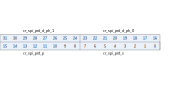
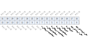

Register description
==========================

+----------------------+------------------------------------+
| Name                 | Description                        |
+----------------------+------------------------------------+
| `spi_config`_        | Master and slave configure         |
+----------------------+------------------------------------+
| `spi_int_sts`_       | Interrupt configure and status     |
+----------------------+------------------------------------+
| `spi_bus_busy`_      | Bus busy status                    |
+----------------------+------------------------------------+
| `spi_prd_0`_         | Period configure 0                 |
+----------------------+------------------------------------+
| `spi_prd_1`_         | Period configure 1                 |
+----------------------+------------------------------------+
| `spi_rxd_ignr`_      | RX ignore function                 |
+----------------------+------------------------------------+
| `spi_sto_value`_     | Timer-out value setting            |
+----------------------+------------------------------------+
| `spi_fifo_config_0`_ | FIFO status and DMA mode           |
+----------------------+------------------------------------+
| `spi_fifo_config_1`_ | FIFO threshold and available count |
+----------------------+------------------------------------+
| `spi_fifo_wdata`_    | TX FIFO                            |
+----------------------+------------------------------------+
| `spi_fifo_rdata`_    | RX FIFO                            |
+----------------------+------------------------------------+
| `backup_io_en`_      | IO backup                          |
+----------------------+------------------------------------+

spi_config
------------
 
**Address：**  0x40019000
 
.. figure:: ../../picture/spi_spi_config.svg
   :align: center

.. table::
    :widths: 10, 15,10,10,55
    :width: 100%
    :align: center
     
    +----------+------------------------------+--------+-------------+------------------------------------------------------------------------------------------------------------------------------------------------------------------------------------------------------------------------------------+
    | Bit      | Name                         |Type    | Reset       | Description                                                                                                                                                                                                                        |
    +==========+==============================+========+=============+====================================================================================================================================================================================================================================+
    | 31:16    | RSVD                         |        |             |                                                                                                                                                                                                                                    |
    +----------+------------------------------+--------+-------------+------------------------------------------------------------------------------------------------------------------------------------------------------------------------------------------------------------------------------------+
    | 15:12    | cr_spi_deg_cnt               | r/w    | 4'd0        | De-glitch function cycle count                                                                                                                                                                                                     |
    +----------+------------------------------+--------+-------------+------------------------------------------------------------------------------------------------------------------------------------------------------------------------------------------------------------------------------------+
    | 11       | cr_spi_deg_en                | r/w    | 1'b0        | Enable signal of all input de-glitch function                                                                                                                                                                                      |
    +----------+------------------------------+--------+-------------+------------------------------------------------------------------------------------------------------------------------------------------------------------------------------------------------------------------------------------+
    | 10       | cr_spi_s_3pin_mode           | r/w    | 1'b0        | SPI slave 3-pin mode                                                                                                                                                                                                               |
    +          +                              +        +             +                                                                                                                                                                                                                                    +
    |          |                              |        |             | 1'b0: 4-pin mode (SS_n is enabled)                                                                                                                                                                                                 |
    +          +                              +        +             +                                                                                                                                                                                                                                    +
    |          |                              |        |             | 1'b1: 3-pin mode (SS_n is disabled / don't care)                                                                                                                                                                                   |
    +----------+------------------------------+--------+-------------+------------------------------------------------------------------------------------------------------------------------------------------------------------------------------------------------------------------------------------+
    | 9        | cr_spi_m_cont_en             | r/w    | 1'b0        | Enable signal of master continuous transfer mode                                                                                                                                                                                   |
    +          +                              +        +             +                                                                                                                                                                                                                                    +
    |          |                              |        |             | 1'b0: Disabled, SS_n will de-assert between each data frame                                                                                                                                                                        |
    +          +                              +        +             +                                                                                                                                                                                                                                    +
    |          |                              |        |             | 1'b1: Enabled, SS_n will stay asserted between each consecutive data frame if the next data is valid in the FIFO                                                                                                                   |
    +----------+------------------------------+--------+-------------+------------------------------------------------------------------------------------------------------------------------------------------------------------------------------------------------------------------------------------+
    | 8        | cr_spi_rxd_ignr_en           | r/w    | 1'b0        | Enable signal of RX data ignore function                                                                                                                                                                                           |
    +----------+------------------------------+--------+-------------+------------------------------------------------------------------------------------------------------------------------------------------------------------------------------------------------------------------------------------+
    | 7        | cr_spi_byte_inv              | r/w    | 1'b0        | Byte-inverse signal for each FIFO entry data                                                                                                                                                                                       |
    +          +                              +        +             +                                                                                                                                                                                                                                    +
    |          |                              |        |             | 0: Byte[0] is sent out first                                                                                                                                                                                                       |
    +          +                              +        +             +                                                                                                                                                                                                                                    +
    |          |                              |        |             | 1: Byte[3] is sent out first(32-bit frame size) / byte[2] is send out first(24-bit frame size) / byte[1] is send out first(16-bit frame size)                                                                                      |
    +----------+------------------------------+--------+-------------+------------------------------------------------------------------------------------------------------------------------------------------------------------------------------------------------------------------------------------+
    | 6        | cr_spi_bit_inv               | r/w    | 1'b0        | Bit-inverse signal for each data byte                                                                                                                                                                                              |
    +          +                              +        +             +                                                                                                                                                                                                                                    +
    |          |                              |        |             | 0: Each byte is sent out MSB-first                                                                                                                                                                                                 |
    +          +                              +        +             +                                                                                                                                                                                                                                    +
    |          |                              |        |             | 1: Each byte is sent out LSB-first                                                                                                                                                                                                 |
    +----------+------------------------------+--------+-------------+------------------------------------------------------------------------------------------------------------------------------------------------------------------------------------------------------------------------------------+
    | 5        | cr_spi_sclk_ph               | r/w    | 1'b0        | SCLK clock phase inverse signal                                                                                                                                                                                                    |
    +          +                              +        +             +                                                                                                                                                                                                                                    +
    |          |                              |        |             | 0: Data is sampled on the second edge of SCLK                                                                                                                                                                                      |
    +          +                              +        +             +                                                                                                                                                                                                                                    +
    |          |                              |        |             | 1: Data is sampled on the first edge of SCLK                                                                                                                                                                                       |
    +----------+------------------------------+--------+-------------+------------------------------------------------------------------------------------------------------------------------------------------------------------------------------------------------------------------------------------+
    | 4        | cr_spi_sclk_pol              | r/w    | 1'b0        | SCLK polarity                                                                                                                                                                                                                      |
    +          +                              +        +             +                                                                                                                                                                                                                                    +
    |          |                              |        |             | 0: SCLK output LOW at IDLE state                                                                                                                                                                                                   |
    +          +                              +        +             +                                                                                                                                                                                                                                    +
    |          |                              |        |             | 1: SCLK output HIGH at IDLE state                                                                                                                                                                                                  |
    +----------+------------------------------+--------+-------------+------------------------------------------------------------------------------------------------------------------------------------------------------------------------------------------------------------------------------------+
    | 3:2      | cr_spi_frame_size            | r/w    | 2'd0        | SPI frame size (also the valid width for each FIFO entry)                                                                                                                                                                          |
    +          +                              +        +             +                                                                                                                                                                                                                                    +
    |          |                              |        |             | 2'd0: 8-bit, FIFO space is 1*32 = 32 byte                                                                                                                                                                                          |
    +          +                              +        +             +                                                                                                                                                                                                                                    +
    |          |                              |        |             | 2'd1: 16-bit, FIFO space is 2*16 = 32 byte                                                                                                                                                                                         |
    +          +                              +        +             +                                                                                                                                                                                                                                    +
    |          |                              |        |             | 2'd2: 24-bit, FIFO space is 3*8 = 24 byte                                                                                                                                                                                          |
    +          +                              +        +             +                                                                                                                                                                                                                                    +
    |          |                              |        |             | 2'd3: 32-bit, FIFO space is 4*8 = 32 byte                                                                                                                                                                                          |
    +----------+------------------------------+--------+-------------+------------------------------------------------------------------------------------------------------------------------------------------------------------------------------------------------------------------------------------+
    | 1        | cr_spi_s_en                  | r/w    | 1'b0        | Enable signal of SPI Slave function, Master and Slave should not be both enabled at the same time                                                                                                                                  |
    +          +                              +        +             +                                                                                                                                                                                                                                    +
    |          |                              |        |             | (This bit becomes don't-care if cr_spi_m_en is enabled)                                                                                                                                                                            |
    +----------+------------------------------+--------+-------------+------------------------------------------------------------------------------------------------------------------------------------------------------------------------------------------------------------------------------------+
    | 0        | cr_spi_m_en                  | r/w    | 1'b0        | Enable signal of SPI Master function                                                                                                                                                                                               |
    +          +                              +        +             +                                                                                                                                                                                                                                    +
    |          |                              |        |             | Asserting this bit will trigger the transaction, and should be de-asserted after finish                                                                                                                                            |
    +----------+------------------------------+--------+-------------+------------------------------------------------------------------------------------------------------------------------------------------------------------------------------------------------------------------------------------+

spi_int_sts
-------------
 
**Address：**  0x40019004
 

.. table::
    :widths: 10, 15,10,10,55
    :width: 100%
    :align: center
     
    +----------+------------------------------+--------+-------------+----------------------------------------------------------------------------------------------------------------------------------------------------------------------------+
    | Bit      | Name                         |Type    | Reset       | Description                                                                                                                                                                |
    +==========+==============================+========+=============+============================================================================================================================================================================+
    | 31:30    | RSVD                         |        |             |                                                                                                                                                                            |
    +----------+------------------------------+--------+-------------+----------------------------------------------------------------------------------------------------------------------------------------------------------------------------+
    | 29       | cr_spi_fer_en                | r/w    | 1'b1        | Interrupt enable of spi_fer_int                                                                                                                                            |
    +----------+------------------------------+--------+-------------+----------------------------------------------------------------------------------------------------------------------------------------------------------------------------+
    | 28       | cr_spi_txu_en                | r/w    | 1'b1        | Interrupt enable of spi_txu_int                                                                                                                                            |
    +----------+------------------------------+--------+-------------+----------------------------------------------------------------------------------------------------------------------------------------------------------------------------+
    | 27       | cr_spi_sto_en                | r/w    | 1'b1        | Interrupt enable of spi_sto_int                                                                                                                                            |
    +----------+------------------------------+--------+-------------+----------------------------------------------------------------------------------------------------------------------------------------------------------------------------+
    | 26       | cr_spi_rxf_en                | r/w    | 1'b1        | Interrupt enable of spi_rxv_int                                                                                                                                            |
    +----------+------------------------------+--------+-------------+----------------------------------------------------------------------------------------------------------------------------------------------------------------------------+
    | 25       | cr_spi_txf_en                | r/w    | 1'b1        | Interrupt enable of spi_txe_int                                                                                                                                            |
    +----------+------------------------------+--------+-------------+----------------------------------------------------------------------------------------------------------------------------------------------------------------------------+
    | 24       | cr_spi_end_en                | r/w    | 1'b1        | Interrupt enable of spi_end_int                                                                                                                                            |
    +----------+------------------------------+--------+-------------+----------------------------------------------------------------------------------------------------------------------------------------------------------------------------+
    | 23:22    | RSVD                         |        |             |                                                                                                                                                                            |
    +----------+------------------------------+--------+-------------+----------------------------------------------------------------------------------------------------------------------------------------------------------------------------+
    | 21       | rsvd                         | rsvd   | 1'b0        |                                                                                                                                                                            |
    +----------+------------------------------+--------+-------------+----------------------------------------------------------------------------------------------------------------------------------------------------------------------------+
    | 20       | cr_spi_txu_clr               | w1c    | 1'b0        | Interrupt clear of spi_txu_int                                                                                                                                             |
    +----------+------------------------------+--------+-------------+----------------------------------------------------------------------------------------------------------------------------------------------------------------------------+
    | 19       | cr_spi_sto_clr               | w1c    | 1'b0        | Interrupt clear of spi_sto_int                                                                                                                                             |
    +----------+------------------------------+--------+-------------+----------------------------------------------------------------------------------------------------------------------------------------------------------------------------+
    | 18       | rsvd                         | rsvd   | 1'b0        |                                                                                                                                                                            |
    +----------+------------------------------+--------+-------------+----------------------------------------------------------------------------------------------------------------------------------------------------------------------------+
    | 17       | rsvd                         | rsvd   | 1'b0        |                                                                                                                                                                            |
    +----------+------------------------------+--------+-------------+----------------------------------------------------------------------------------------------------------------------------------------------------------------------------+
    | 16       | cr_spi_end_clr               | w1c    | 1'b0        | Interrupt clear of spi_end_int                                                                                                                                             |
    +----------+------------------------------+--------+-------------+----------------------------------------------------------------------------------------------------------------------------------------------------------------------------+
    | 15:14    | RSVD                         |        |             |                                                                                                                                                                            |
    +----------+------------------------------+--------+-------------+----------------------------------------------------------------------------------------------------------------------------------------------------------------------------+
    | 13       | cr_spi_fer_mask              | r/w    | 1'b1        | Interrupt mask of spi_fer_int                                                                                                                                              |
    +----------+------------------------------+--------+-------------+----------------------------------------------------------------------------------------------------------------------------------------------------------------------------+
    | 12       | cr_spi_txu_mask              | r/w    | 1'b1        | Interrupt mask of spi_txu_int                                                                                                                                              |
    +----------+------------------------------+--------+-------------+----------------------------------------------------------------------------------------------------------------------------------------------------------------------------+
    | 11       | cr_spi_sto_mask              | r/w    | 1'b1        | Interrupt mask of spi_sto_int                                                                                                                                              |
    +----------+------------------------------+--------+-------------+----------------------------------------------------------------------------------------------------------------------------------------------------------------------------+
    | 10       | cr_spi_rxf_mask              | r/w    | 1'b1        | Interrupt mask of spi_rxv_int                                                                                                                                              |
    +----------+------------------------------+--------+-------------+----------------------------------------------------------------------------------------------------------------------------------------------------------------------------+
    | 9        | cr_spi_txf_mask              | r/w    | 1'b1        | Interrupt mask of spi_txe_int                                                                                                                                              |
    +----------+------------------------------+--------+-------------+----------------------------------------------------------------------------------------------------------------------------------------------------------------------------+
    | 8        | cr_spi_end_mask              | r/w    | 1'b1        | Interrupt mask of spi_end_int                                                                                                                                              |
    +----------+------------------------------+--------+-------------+----------------------------------------------------------------------------------------------------------------------------------------------------------------------------+
    | 7:6      | RSVD                         |        |             |                                                                                                                                                                            |
    +----------+------------------------------+--------+-------------+----------------------------------------------------------------------------------------------------------------------------------------------------------------------------+
    | 5        | spi_fer_int                  | r      | 1'b0        | SPI TX/RX FIFO error interrupt, auto-cleared when FIFO overflow/underflow error flag is cleared                                                                            |
    +----------+------------------------------+--------+-------------+----------------------------------------------------------------------------------------------------------------------------------------------------------------------------+
    | 4        | spi_txu_int                  | r      | 1'b0        | SPI slave mode TX underrun error flag, triggered when TXD is not ready during transfer in slave mode                                                                       |
    +----------+------------------------------+--------+-------------+----------------------------------------------------------------------------------------------------------------------------------------------------------------------------+
    | 3        | spi_sto_int                  | r      | 1'b0        | SPI slave mode transfer time-out interrupt, triggered when SPI bus is idle for a given value                                                                               |
    +----------+------------------------------+--------+-------------+----------------------------------------------------------------------------------------------------------------------------------------------------------------------------+
    | 2        | spi_rxf_int                  | r      | 1'b0        | SPI RX FIFO ready (rx_fifo_cnt > rx_fifo_th) interrupt, auto-cleared when data is popped                                                                                   |
    +----------+------------------------------+--------+-------------+----------------------------------------------------------------------------------------------------------------------------------------------------------------------------+
    | 1        | spi_txf_int                  | r      | 1'b1        | SPI TX FIFO ready (tx_fifo_cnt > tx_fifo_th) interrupt, auto-cleared when data is pushed                                                                                   |
    +----------+------------------------------+--------+-------------+----------------------------------------------------------------------------------------------------------------------------------------------------------------------------+
    | 0        | spi_end_int                  | r      | 1'b0        | SPI transfer end interrupt, shared by both master and slave mode                                                                                                           |
    +          +                              +        +             +                                                                                                                                                                            +
    |          |                              |        |             | Master mode: Triggered when the final frame is transferred                                                                                                                 |
    +          +                              +        +             +                                                                                                                                                                            +
    |          |                              |        |             | Slave mode: Triggered when CS_n is de-asserted                                                                                                                             |
    +----------+------------------------------+--------+-------------+----------------------------------------------------------------------------------------------------------------------------------------------------------------------------+

spi_bus_busy
--------------
 
**Address：**  0x40019008
 
.. figure:: ../../picture/spi_spi_bus_busy.svg
   :align: center

.. table::
    :widths: 10, 15,10,10,55
    :width: 100%
    :align: center
     
    +----------+------------------------------+--------+-------------+-------------------------------------------+
    | Bit      | Name                         |Type    | Reset       | Description                               |
    +==========+==============================+========+=============+===========================================+
    | 31:1     | RSVD                         |        |             |                                           |
    +----------+------------------------------+--------+-------------+-------------------------------------------+
    | 0        | sts_spi_bus_busy             | r      | 1'b0        | Indicator of SPI bus busy                 |
    +          +                              +        +             +                                           +
    |          |                              |        |             | 0: Idle                                   |
    +          +                              +        +             +                                           +
    |          |                              |        |             | 1: Busy                                   |
    +----------+------------------------------+--------+-------------+-------------------------------------------+

spi_prd_0
-----------
 
**Address：**  0x40019010
 

.. table::
    :widths: 10, 15,10,10,55
    :width: 100%
    :align: center
     
    +----------+------------------------------+--------+-------------+-----------------------------------------------------------+
    | Bit      | Name                         |Type    | Reset       | Description                                               |
    +==========+==============================+========+=============+===========================================================+
    | 31:24    | cr_spi_prd_d_ph_1            | r/w    | 8'd15       | Length of DATA phase 1 (unit: SPI source clock period)    |
    +----------+------------------------------+--------+-------------+-----------------------------------------------------------+
    | 23:16    | cr_spi_prd_d_ph_0            | r/w    | 8'd15       | Length of DATA phase 0 (unit: SPI source clock period)    |
    +----------+------------------------------+--------+-------------+-----------------------------------------------------------+
    | 15:8     | cr_spi_prd_p                 | r/w    | 8'd15       | Length of STOP condition (unit: SPI source clock period)  |
    +----------+------------------------------+--------+-------------+-----------------------------------------------------------+
    | 7:0      | cr_spi_prd_s                 | r/w    | 8'd15       | Length of START condition (unit: SPI source clock period) |
    +----------+------------------------------+--------+-------------+-----------------------------------------------------------+

spi_prd_1
-----------
 
**Address：**  0x40019014
 
.. figure:: ../../picture/spi_spi_prd_1.svg
   :align: center

.. table::
    :widths: 10, 15,10,10,55
    :width: 100%
    :align: center
     
    +----------+------------------------------+--------+-------------+------------------------------------------------------------------+
    | Bit      | Name                         |Type    | Reset       | Description                                                      |
    +==========+==============================+========+=============+==================================================================+
    | 31:8     | RSVD                         |        |             |                                                                  |
    +----------+------------------------------+--------+-------------+------------------------------------------------------------------+
    | 7:0      | cr_spi_prd_i                 | r/w    | 8'd15       | Length of INTERVAL between frame (unit: SPI source clock period) |
    +----------+------------------------------+--------+-------------+------------------------------------------------------------------+

spi_rxd_ignr
--------------
 
**Address：**  0x40019018
 

.. table::
    :widths: 10, 15,10,10,55
    :width: 100%
    :align: center
     
    +----------+------------------------------+--------+-------------+-------------------------------------------------------+
    | Bit      | Name                         |Type    | Reset       | Description                                           |
    +==========+==============================+========+=============+=======================================================+
    | 31:21    | RSVD                         |        |             |                                                       |
    +----------+------------------------------+--------+-------------+-------------------------------------------------------+
    | 20:16    | cr_spi_rxd_ignr_s            | r/w    | 5'd0        | Starting point of RX data ignore function (unit: bit) |
    +----------+------------------------------+--------+-------------+-------------------------------------------------------+
    | 15:5     | RSVD                         |        |             |                                                       |
    +----------+------------------------------+--------+-------------+-------------------------------------------------------+
    | 4:0      | cr_spi_rxd_ignr_p            | r/w    | 5'd0        | Stopping point of RX data ignore function (unit: bit) |
    +----------+------------------------------+--------+-------------+-------------------------------------------------------+

spi_sto_value
---------------
 
**Address：**  0x4001901c
 
.. figure:: ../../picture/spi_spi_sto_value.svg
   :align: center

.. table::
    :widths: 10, 15,10,10,55
    :width: 100%
    :align: center
     
    +----------+------------------------------+--------+-------------+-------------------------------------------+
    | Bit      | Name                         |Type    | Reset       | Description                               |
    +==========+==============================+========+=============+===========================================+
    | 31:12    | RSVD                         |        |             |                                           |
    +----------+------------------------------+--------+-------------+-------------------------------------------+
    | 11:0     | cr_spi_sto_value             | r/w    | 12'hFFF     | Time-out value for spi_sto_int triggering |
    +----------+------------------------------+--------+-------------+-------------------------------------------+

spi_fifo_config_0
-------------------
 
**Address：**  0x40019080
 

.. table::
    :widths: 10, 15,10,10,55
    :width: 100%
    :align: center
     
    +----------+------------------------------+--------+-------------+-------------------------------------------------------------------------+
    | Bit      | Name                         |Type    | Reset       | Description                                                             |
    +==========+==============================+========+=============+=========================================================================+
    | 31:8     | RSVD                         |        |             |                                                                         |
    +----------+------------------------------+--------+-------------+-------------------------------------------------------------------------+
    | 7        | rx_fifo_underflow            | r      | 1'b0        | Underflow flag of RX FIFO, can be cleared by rx_fifo_clr                |
    +----------+------------------------------+--------+-------------+-------------------------------------------------------------------------+
    | 6        | rx_fifo_overflow             | r      | 1'b0        | Overflow flag of RX FIFO, can be cleared by rx_fifo_clr                 |
    +----------+------------------------------+--------+-------------+-------------------------------------------------------------------------+
    | 5        | tx_fifo_underflow            | r      | 1'b0        | Underflow flag of TX FIFO, can be cleared by tx_fifo_clr                |
    +----------+------------------------------+--------+-------------+-------------------------------------------------------------------------+
    | 4        | tx_fifo_overflow             | r      | 1'b0        | Overflow flag of TX FIFO, can be cleared by tx_fifo_clr                 |
    +----------+------------------------------+--------+-------------+-------------------------------------------------------------------------+
    | 3        | rx_fifo_clr                  | w1c    | 1'b0        | Clear signal of RX FIFO, RX FIFO will be empty when write 1 to this bit |
    +----------+------------------------------+--------+-------------+-------------------------------------------------------------------------+
    | 2        | tx_fifo_clr                  | w1c    | 1'b0        | Clear signal of TX FIFO, TX FIFO will be empty when write 1 to this bit |
    +----------+------------------------------+--------+-------------+-------------------------------------------------------------------------+
    | 1        | spi_dma_rx_en                | r/w    | 1'b0        | Enable signal of dma_rx_req/ack interface                               |
    +----------+------------------------------+--------+-------------+-------------------------------------------------------------------------+
    | 0        | spi_dma_tx_en                | r/w    | 1'b0        | Enable signal of dma_tx_req/ack interface                               |
    +----------+------------------------------+--------+-------------+-------------------------------------------------------------------------+

spi_fifo_config_1
-------------------
 
**Address：**  0x40019084
 

.. table::
    :widths: 10, 15,10,10,55
    :width: 100%
    :align: center
     
    +----------+------------------------------+--------+-------------+-------------------------------------------------------------------------------------------+
    | Bit      | Name                         |Type    | Reset       | Description                                                                               |
    +==========+==============================+========+=============+===========================================================================================+
    | 31:29    | RSVD                         |        |             |                                                                                           |
    +----------+------------------------------+--------+-------------+-------------------------------------------------------------------------------------------+
    | 28:24    | rx_fifo_th                   | r/w    | 5'd0        | RX FIFO threshold, dma_rx_req will not be asserted if rx_fifo_cnt is less than this value |
    +----------+------------------------------+--------+-------------+-------------------------------------------------------------------------------------------+
    | 23:21    | RSVD                         |        |             |                                                                                           |
    +----------+------------------------------+--------+-------------+-------------------------------------------------------------------------------------------+
    | 20:16    | tx_fifo_th                   | r/w    | 5'd0        | TX FIFO threshold, dma_tx_req will not be asserted if tx_fifo_cnt is less than this value |
    +----------+------------------------------+--------+-------------+-------------------------------------------------------------------------------------------+
    | 15:14    | RSVD                         |        |             |                                                                                           |
    +----------+------------------------------+--------+-------------+-------------------------------------------------------------------------------------------+
    | 13:8     | rx_fifo_cnt                  | r      | 6'd0        | RX FIFO available count, means byte count of data received in RX FIFO (unit: byte)        |
    +----------+------------------------------+--------+-------------+-------------------------------------------------------------------------------------------+
    | 7:6      | RSVD                         |        |             |                                                                                           |
    +----------+------------------------------+--------+-------------+-------------------------------------------------------------------------------------------+
    | 5:0      | tx_fifo_cnt                  | r      | 6'd32       | TX FIFO available count, means empty space remained in TX FIFO (unit: byte)               |
    +----------+------------------------------+--------+-------------+-------------------------------------------------------------------------------------------+

spi_fifo_wdata
----------------
 
**Address：**  0x40019088
 
.. figure:: ../../picture/spi_spi_fifo_wdata.svg
   :align: center

.. table::
    :widths: 10, 15,10,10,55
    :width: 100%
    :align: center
     
    +----------+------------------------------+--------+-------------+---------------------------------------------------------------------------------------------------------------------------------------------------------------------------------------------------------------------------------------------------------------------------------------------------------------------------------------------------------+
    | Bit      | Name                         |Type    | Reset       | Description                                                                                                                                                                                                                                                                                                                                             |
    +==========+==============================+========+=============+=========================================================================================================================================================================================================================================================================================================================================================+
    | 31:0     | spi_fifo_wdata               | w      | x           | TX FIFO write data port                                                                                                                                                                                                                                                                                                                                 |
    +          +                              +        +             +                                                                                                                                                                                                                                                                                                                                                         +
    |          |                              |        |             | Note: Partial valid if cr_spi_frame_size is set to different value:                                                                                                                                                                                                                                                                                     |
    +          +                              +        +             +                                                                                                                                                                                                                                                                                                                                                         +
    |          |                              |        |             | 2'd0 (8-bit frame): Only [7:0] are valid and [31:8] are don't-care                                                                                                                                                                                                                                                                                      |
    +          +                              +        +             +                                                                                                                                                                                                                                                                                                                                                         +
    |          |                              |        |             | 2'd1 (16-bit frame): Only [15:0] are valid and [31:16] are don't-care                                                                                                                                                                                                                                                                                   |
    +          +                              +        +             +                                                                                                                                                                                                                                                                                                                                                         +
    |          |                              |        |             | 2'd2 (24-bit frame): Only [23:0] are valid and [31:24] are don't-care                                                                                                                                                                                                                                                                                   |
    +          +                              +        +             +                                                                                                                                                                                                                                                                                                                                                         +
    |          |                              |        |             | 2'd3 (32-bit frame): Entire [31:0] are valid                                                                                                                                                                                                                                                                                                            |
    +----------+------------------------------+--------+-------------+---------------------------------------------------------------------------------------------------------------------------------------------------------------------------------------------------------------------------------------------------------------------------------------------------------------------------------------------------------+

spi_fifo_rdata
----------------
 
**Address：**  0x4001908c
 
.. figure:: ../../picture/spi_spi_fifo_rdata.svg
   :align: center

.. table::
    :widths: 10, 15,10,10,55
    :width: 100%
    :align: center
     
    +----------+------------------------------+--------+-------------+-------------------------------------------------------------------------------------------------------------------------------------------------------------------------------------------------------------------------------------------------------------------------------------------------------------------------------------------+
    | Bit      | Name                         |Type    | Reset       | Description                                                                                                                                                                                                                                                                                                                               |
    +==========+==============================+========+=============+===========================================================================================================================================================================================================================================================================================================================================+
    | 31:0     | spi_fifo_rdata               | r      | 32'h0       | RX FIFO read data port                                                                                                                                                                                                                                                                                                                    |
    +          +                              +        +             +                                                                                                                                                                                                                                                                                                                                           +
    |          |                              |        |             | Note: Partial valid if cr_spi_frame_size is set to different value:                                                                                                                                                                                                                                                                       |
    +          +                              +        +             +                                                                                                                                                                                                                                                                                                                                           +
    |          |                              |        |             | 2'd0 (8-bit frame): Only [7:0] are valid and [31:8] are all 0s                                                                                                                                                                                                                                                                            |
    +          +                              +        +             +                                                                                                                                                                                                                                                                                                                                           +
    |          |                              |        |             | 2'd1 (16-bit frame): Only [15:0] are valid and [31:16] are all 0s                                                                                                                                                                                                                                                                         |
    +          +                              +        +             +                                                                                                                                                                                                                                                                                                                                           +
    |          |                              |        |             | 2'd2 (24-bit frame): Only [23:0] are valid and [31:24] are all 0s                                                                                                                                                                                                                                                                         |
    +          +                              +        +             +                                                                                                                                                                                                                                                                                                                                           +
    |          |                              |        |             | 2'd3 (32-bit frame): Entire [31:0] is valid                                                                                                                                                                                                                                                                                               |
    +----------+------------------------------+--------+-------------+-------------------------------------------------------------------------------------------------------------------------------------------------------------------------------------------------------------------------------------------------------------------------------------------------------------------------------------------+

backup_io_en
--------------
 
**Address：**  0x400190fc
 
.. figure:: ../../picture/spi_backup_io_en.svg
   :align: center

.. table::
    :widths: 10, 15,10,10,55
    :width: 100%
    :align: center
     
    +----------+------------------------------+--------+-------------+---------------------------+
    | Bit      | Name                         |Type    | Reset       | Description               |
    +==========+==============================+========+=============+===========================+
    | 31:1     | RSVD                         |        |             |                           |
    +----------+------------------------------+--------+-------------+---------------------------+
    | 0        | backup_io_en                 | r/w    | 1'b0        | Enable IO backup function |
    +----------+------------------------------+--------+-------------+---------------------------+

