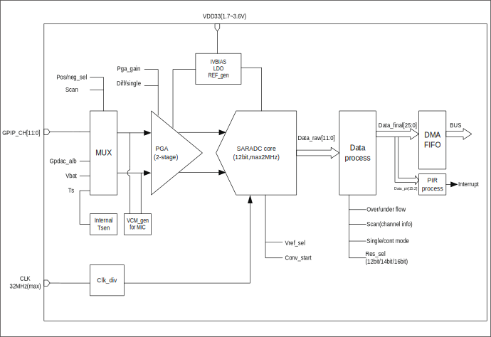
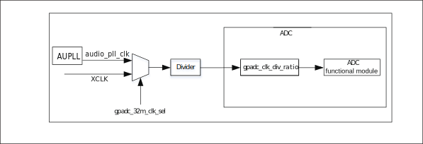

===========
ADC
===========

简介
=====
芯片内置一个12bits的逐次逼近式模拟数字转换器(ADC)，支持12路外部模拟输入和若干内部模拟信号选择。
ADC可以工作在 4 种模式下，转换结果为12/14/16bits左对齐模式。ADC拥有深度
为32字节的FIFO，支持多种中断，支持DMA操作。ADC除了用于普通模拟信号测量外，还可以用于测量供电电压，
此外ADC还可以通过测量内/外部二极管电压用于温度检测。

主要特点
===========

- 高性能

    + 可以选择12-bit, 14-bit, 16-bit转换结果输出
    + 单通道连续转换模式最高采样率可达2M
    + 其它转换模式最高采样率500K
    + 支持2.0V，3.2V可选参考电压
    + 支持DMA将转换结果搬运到内存
    + 支持单通道单次转换、单通道连续转换、多通道单次转换、多通道连续转换
    + 支持单端与差分两种输入模式
    + 支持抖动补偿
    + 支持用户自行设定转换结果偏移值

- 模拟通道数

    * 12路外部模拟通道
    * 2路DAC内部通道
    * 1路VBAT/2通道
    * 1路TSEN通道

功能描述
===========

ADC模块基本框图如图所示。

   ADC基本框图

ADC 模块包含五大部分，分别为前端输入通道选择器，程控放大器，ADC 采样模块，数据处理模块以及 FIFO。
输入通道选择器用于选择需要采样的通道，包含外部模拟信号和内部模拟信号。
程控放大器用于对输入信号做进一步处理，可以根据输入信号的特点（直流或者交流）进行设定，以便得到更准确的转换值。
ADC 采样模块是最主要的功能模块，通过逐次比较的方式，得到模拟信号到数字信号的转换。
转换的结果为 12/14/16 bit，数据处理模块将转换的结果进一步处理，包括添加通道信息等。最后将得到的数据推送到 FIFO 中。

ADC 引脚和内部信号
--------------------------

.. table:: ADC 内部信号 

    +----------+-----------------+-----------------------------------------+
    | 内部信号 |    信号类型     |        信号描述                         |
    +----------+-----------------+-----------------------------------------+
    |   VBAT/2 |     Input       | 从电源引脚分压过来的电压信号            |
    +----------+-----------------+-----------------------------------------+
    |   TSEN   |     Input       | 内部温度传感器输出电压                  |
    +----------+-----------------+-----------------------------------------+
    |   VREF   |     Input       | 内部模拟模块参考电压                    |
    +----------+-----------------+-----------------------------------------+
    | DACOUTA  |     Input       | DAC 模块输出                            |
    +----------+-----------------+-----------------------------------------+
    | DACOUTB  |     Input       | DAC 模块输出                            |
    +----------+-----------------+-----------------------------------------+

.. table:: ADC 外部引脚 

    +----------+-----------------+-----------------------------------------+
    | 外部引脚 |    信号类型     |        信号描述                         |
    +----------+-----------------+-----------------------------------------+
    |   VDDA   |     Input       | 模拟模块供电电压正极                    |
    +----------+-----------------+-----------------------------------------+
    |   VSSA   |     Input       | 模拟模块供电地                          |
    +----------+-----------------+-----------------------------------------+
    | ADC_CHX  |     Input       | 模拟输入引脚，总共 12 路                |
    +----------+-----------------+-----------------------------------------+

ADC 通道
-------------
ADC 采样可以选择的通道包括外部模拟引脚的输入信号和芯片内部可选信号：

- ADC CH0
- ADC CH1
- ADC CH2
- ADC CH3
- ADC CH4
- ADC CH5
- ADC CH6
- ADC CH7
- ADC CH8
- ADC CH9
- ADC CH10
- ADC CH11
- DAC OUTA
- DAC OUTB
- VBAT/2
- TSEN
- VREF
- GND

需要注意的是，如果选择VBAT/2或TSEN作为输入待采信号，需要把gpadc_vbat_en或gpadc_ts_en置为1。
ADC模块可以支持单端输入或者差分输入，如果是单端输入模式，负极输入通道需要选择GND。

ADC时钟
-------------

ADC模块的工作时钟来源如下图所示。

   ADC时钟

ADC 的时钟源可以选择来自 AUPLL 分频的 audio_pll_clk，XTAL或者内部RC32M，时钟源的选择在 GLB 模块中设定，
同时 GLB 模块也提供了时钟分频。例如：ADC 的时钟源选择 XTAL，时钟分频是 0，到达 ADC 模块的时钟是 40M。
在 ADC 模块内部，提供了一个时钟分频，如果选择 20 分频，则 ADC 模块内部的时钟则是 2 M。用户可以根据实际采样需求，
自行调整 ADC 的时钟源和各个分频系数。
gpadc_32m_clk_div 分频寄存器宽度为 6-bit，最大分频为 64，分频公式为 fout=fsource/(gpadc_32m_clk_div+1)。
gpadc_clk_div_ratio 分频寄存器位于 ADC 模块内部，宽度为 3-bit,其分频值定义如下：

- 3'b000: div=1
- 3'b001: div=4
- 3'b010: div=8
- 3'b011: div=12
- 3'b100: div=16
- 3'b101: div=20
- 3'b110: div=24
- 3'b111: div=32

ADC 转换模式
-------------

ADC 支持单通道转换和扫描转换两种模式，在单通道转换模式下，用户需要通过 gpadc_pos_sel 选择正极输入通道，
通过 gpadc_neg_sel 选择负极输入通道，同时把 gpadc_cont_conv_en 控制位设置为0，表示单通道转换，
然后设置 gpadc_conv_start 控制位启动转换即可。

在扫描转换模式下，gpadc_cont_conv_en 控制位需要设置为 1，ADC 根据 gpadc_scan_length 控制位设定的转换通道个数，
依次按照 gpadc_reg_scn_posX(X=1，2）和gpadc_reg_scn_negX(X=1，2）寄存器组所设定的通道顺序，逐个进行转换，
转换的结果会自动推入 ADC 的 FIFO。gpadc_reg_scn_posX(X=1，2）和 gpadc_reg_scn_negX(X=1，2）寄存器组所设定的
通道可以相同，这也就意味着用户可以实现对一个通道进行多次采样转换。

ADC结果
-------------
gpadc_raw_data 寄存器存放了 ADC 的原始结果，在单端模式下，数据有效位是 12-bit，无符号位，在差分模式下，最高位为符号位，
剩下 11-bit 为转换的结果。

gpadc_data_out 寄存器存放了 ADC 的结果，这个结果里包含了 ADC 转换的数值，符号位和通道信息，数据格式如下：

.. table:: ADC 转换结果含义

    +-------+--+--+--+--+--+--+--+--+--+--+--+--+--+--+--+--+--+--+--+--+--+--+--+--+--+--+
    | BitS  |25|24|23|22|21|20|19|18|17|16|15|14|13|12|11|10|9 | 8| 7| 6| 5| 4| 3| 2| 1| 0|
    +=======+==+==+==+==+==+==+==+==+==+==+==+==+==+==+==+==+==+==+==+==+==+==+==+==+==+==+
    | 含义  |  正极通道号  |  负极通道号  |                    转换结果                   |
    +-------+--------------+--------------+-----------------------------------------------+

转换结果的 bit21-bit25 是正极通道号，bit16-bit20 是负极通道号，bit0-bit15 是转换的数值。

gpadc_res_sel 控制位可以设定转换结果的位数为 12 位，14 位，和 16 位，其中 14 位和 16 位是多次采样提高精度得到的结果，
其可以设置的值及采样次数如下(以采样时钟2M为例,非单通道连续转换模式需降低时钟)：

- 3'b000    12bit 2MS/s, OSR=1
- 3'b001    14bit 125kS/s, OSR=16
- 3'b010    14bit 31.25kS/s, OSR=64
- 3'b011    16bit 15.625KS/s, OSR=128
- 3'b100    16bit 7.8125KS/s, OSR=256

ADC 转换结果为左对齐模式，当选择12位时，转换结果的 bit15-bit4 有效，当选择 14 位时，转换结果的 bit15-bit2 有效，
当选择16位时，转换结果的bit15-bit0有效。
同样，在差分模式下，最高位是符号位，即，选择 14 位时，bit15 是符号位，bit14-bit2 是转换结果，bit14 是 MSB,
在单端模式下，没有符号位，当选择 12 位时，bit15-bit4 是转换结果，bit15 是MSB。

在实际使用中，ADC 的结果一般都是放入 FIFO，这在多通道扫描模式下尤为重要，所以用户一般是从 ADC FIFO 获取转换结果，
ADC FIFO 的数据格式与 gpadc_data_out 寄存器中数据格式相同。

ADC 中断
-------------

- ADC 转换完成中断
- ADC 正极采样超量程中断
- ADC 负极采样超量程中断

当 ADC 转换完成并将结果存入 FIFO 时，通过 gpadc_rdy_mask 设置中断开关，选择是否触发 ADC 转换完成中断。
当 ADC 在正极采样超量程和负极采样超量程时，通过gpadc_pos_satur_mask，gpadc_neg_satur_mask 设置中断开关，选择是否触发中断，
当中断产生时，可通过gpadc_pos_satur 和gpadc_neg_satur寄存器查询中断状态，通过设置gpadc_pos_satur_clr和gpadc_neg_satur_clr来清除中断。该功能可以用来判断输入电压是否异常。

ADC FIFO
-------------

ADC模块拥有深度为 32 字节的 FIFO，数据宽度为 26-bit，当 ADC 完成转换后，会自动将结果推入到 FIFO。ADC 的 FIFO 有如下状态和中断管理功能：

- FIFO 满状态
- FIFO 非空状态
- FIFO Overrun 中断
- FIFO Underrun 中断

当中断产生时，可以通过对应的 clear 位将中断标志清除掉。

利用 ADC 的 FIFO 用户可以通过三种模式获取数据：查询模式，中断模式，DMA模式

**查询模式**

CPU 轮询 gpadc_rdy 位，当该控制位置位时，说明 FIFO 中存在有效数据，CPU 可以根据 gpadc_fifo_data_count 获知
FIFO 数据个数并从 FIFO 读出这些数据。

**中断模式**

CPU 设置 gpadc_rdy_mask 为 0，ADC 就会在 FIFO 有数据推入的时候产生中断，用户可在中断函数中，根据 gpadc_fifo_data_count 获知
FIFO 数据个数并从 FIFO 读出这些数据，然后设置 gpadc_rdy_clr 清除中断。

**DMA模式**

用户设定 gpadc_dma_en 控制位，可以配合 DMA 完成转换数据到内存的搬运，在使用 DMA 模式时，通过 gpadc_fifo_thl 设置 ADC FIFO 发送
DMA 请求的数据个数阈值，DMA 在收到请求时，会自动根据用户设定的参数，从FIFO搬运指定个数的结果到对应的内存。

ADC设置流程
-------------

**设置ADC时钟**

根据ADC转换速度需求，确定ADC的工作时钟，设定GLB模块的ADC时钟源和分频，结合gpadc_clk_div_ratio，确定最终ADC模块的工作时钟频率。

**根据使用的通道设置GPIO**

根据使用的模拟引脚，确定使用的通道号，初始化对应的GPIO为模拟功能，需要注意的是，在设定GPIO为模拟输入的时候，不要设置GPIO的上拉
或者下拉，需要设置为浮空输入。

**设定要转换的通道**

根据使用的模拟通道和转换模式，设定对应的通道寄存器，对于单通道转换，在gpadc_pos_sel和gpadc_neg_sel寄存器中设置转换的通道信息。
对于多通道扫描模式，根据要扫描通道数目和扫描顺序，设定gpadc_scan_length,gpadc_reg_scn_posX和gpadc_reg_scn_negX。

**设定数据读取方式**

根据ADC FIFO介绍的读取数据方式，选择使用的模式，设置对应的寄存器。如果使用DMA，同样需要配置DMA的一个通道，配合ADC FIFO完成数据的搬运。

**启动转换**

最后设置gpadc_res_sel选择数据转换结果的精度，设置gpadc_global_en=1，gpadc_conv_start=1就可以启动ADC开始转换。
当转换完成，需要再次转换时，需要将gpadc_conv_start设置为0，再设置为1，以便再次触发转换。

VBAT测量
-------------
这里的VBAT/2测量的是芯片VDD33的电压，而不是外部的比如锂电池的电压，如果需要测量锂电池等供电源头的电压，
可以将电压分压，然后输入ADC的GPIO模拟通道，测量VDD33的电压可以减少GPIO的使用。

ADC模块测量的VBAT/2电压是经过分压的，实际输入到ADC模块的电压是VDD33的一半，即VBAT/2=VDD33/2。由于电压经过分压，
为了得到较高的精确度，建议ADC的参考电压选择2.0V，采用单端模式，正极输入电压选择VBAT/2，负极输入电压选择GND，
同时将gpadc_vbat_en设置为1，启动转换后，将对应的转换结果乘以2就可以得到VDD33电压。

TSEN测量
-------------

ADC可以测量内部二极管或者外部二极管电压值，而二极管的压差和温度有关，所以通过测量二极管的电压，可以计算得到环境温度，
即Temperature Sensor，简称TSEN。

TSEN的测试原理是通过一个二极管上面测量两次不同大小的电流产生的电压差ΔV 随着温度的变化拟合的曲线，无论外部或者内部二极管的测量，
最终输出的值和温度有关，都可以表示成Δ(ADC_out)=7.753T+X，当知道了电压值，也就知道了温度T。这里的X是一个偏移值，可以作为标准值，
在实际使用前，用户需要确定X。芯片厂商会在芯片出厂前，在标准温度下，例如室温25度，测量Δ(ADC_out)，从而得到X。
在用户使用的时候，只要根据公式T=[Δ(ADC_out)-X]/7.753，就可以得到温度T。

在使用TSEN时，建议把ADC设置成16-bit模式，通过多次采样以减少误差，并且参考电压只能选择2.0V，设置gpadc_ts_en为1以便启动TSEN功能。

如果选择内部二极管，gpadc_tsext_sel=0，如果选择外部二极管，gpadc_tsext_sel=1。

根据实际情况选择正向输入通道，如果是内部二极管，选择TSEN通道，如果是外部，选择对应的模拟GPIO通道，负极输入端选择GND。

在上述设定完毕后，设置gpadc_tsvbe_low=0，启动测量，得到测量结果V0,再设置gpadc_tsvbe_low=1，启动测量，得到测量结果V1,Δ(ADC_out)=V1-V0，根据公式T=[Δ(ADC_out)-X]/7.753，得到温度T。

.. only:: html

   .. include:: adc_register.rst

.. raw:: latex

   \input{../../zh_CN/content/adc}