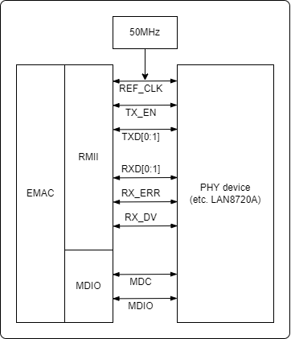
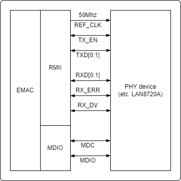

===========
EMAC
===========

简介
=====
EMAC(Ethernet Media Access Controller) 模块是一个支持 10/100Mbps 的以太网 MAC, 兼容 `IEEE 802.3 <https://www.ieee802.org/3/>`_ 以太网技术标准 。
EMAC 模块中包括状态及控制寄存器组，数据收发模块，数据收发缓冲描述符组，主机接口， MDIO(Managenment Data Input/Output) 接口和物理层芯片(PHY)接口。

状态及控制寄存器组包含了 EMAC 的状态位及控制位，该寄存器组是与用户程序的接口，可以控制数据收发，并检查 EMAC 状态。

数据收发模块负责根据收发描述符内的控制字，从指定内存位置取得数据帧并添加前导或 CRC 数据，经扩充后将该短帧发送给 PHY 并通过 PHY 发出；
或者是从 PHY 接收数据，并根据收发缓冲描述符，将数据放入指定内存。收发完成后设置相关的事件标志。如果使能了事件中断，将产生中断信号请求主机进行处理。

MDIO 模块通过 RMII 接口与 PHY 进行通信，包括读写 PHY 的寄存器，以及数据包的收发。

主要特征
=========
- 兼容 IEEE 802.3 定义的 MAC 层功能
- 支持 IEEE 802.3 定义的 RMII 接口的 PHY
- 支持通过 MDIO 接口与 PHY 交互
- 支持 10Mbps 与 100Mbps 以太网
- 支持半双工与全双工模式
- 在全双工模式下，支持自动流控及生成控制帧
- 在半双工模式下，支持碰撞检测及重传
- 支持 CRC 的生成及校验
- 支持数据帧前导生成及移除
- 发送时，支持自动扩展短的数据帧
- 支持检测过长或过短的数据帧(长度限制)
- 支持传输长数据帧(大于标准以太帧长度)
- 支持自动丢弃重发次数超限或帧间隙过小的数据包
- 支持广播包过滤
- 最大支持保存 128 个 BD(Buffer Descriptor)
- 在发送时，支持将一个数据包分拆配置到多个连续的 BD
- 支持发送/接收的各种事件标志，并支持在事件发生时产生对应中断

功能描述
===========
EMAC模块的组成如下图。

.. figure:: ../../picture/EMAC.svg
   :align: center
   :scale: 70%

   EMAC 框图

模块的控制寄存器通过 MDIO 接口，可以读写 PHY 的寄存器，从而实现配置、选择模式(半/全双工)、发起协商等操作。
接收模块过滤并检查收到的数据帧：是否有合法的前导，帧校验序列(FCS)检查，长度检查等，并根据缓冲描述符(BD)，将数据存放到指定内存地址。
发送模块根据数据缓冲描述符，从内存中取得数据，添加前导，帧校验序列(FCS)，和 PAD 以及其他需要填充的信息，然后根据 CSMA/CD 协议，将数据发出。
如果检测到 CRS(Carrier Sense) 载波侦测信号，将会延迟重试。
收发缓冲描述符组从系统 RAM 中分配，此 RAM 空间用于保存发送和接收的以太网数据帧。每个描述符包含相应的控制状态字以及对应的缓冲内存地址。
描述符最大一共有 128 组，可用于发送描述符或者接收描述符，可以灵活分配。

时钟
============
EMAC 模块需要一路时钟用于同步收发(100Mbps 时需要 25MHz(MII) 或 50MHz(RMII)时钟；若为 10Mbps 时需要 2.5MHz 时钟)。
此时钟必须在 EMAC 与 PHY 之间同步。
BL618 支持输出 50MHz 参考时钟源，也可以使用外置的参考时钟源输入。

   使用外置的参考时钟源

   内部输出 50MHz 参考时钟源

收发缓冲描述符(BD, Buffer Descriptor)
==========================================
收发缓冲描述符，用于提供 EAMC 与数据帧缓存地址信息之间的关联，对收发数据帧进行控制，以及提供收发状态提示。
每个描述符由两个连续的 word(32bit) 构成，低地址的 word0 提供了本 buffer 包含的数据帧的长度，控制及状态位；高地址的 word1 是对应的数据帧缓存的 32 位内存地址(指针)。

发送 TXBD 中的 word0 具体描述：

     [31:16]: 发送数据包长度(LEN)。

     [15]: 发送 BD 准备好标志(RD)。软件写 1 通知 EMAC 此 BD 包含需要发送的数据，硬件写 0 说明此 BD 数据已发送完成或有错误发生。

     [14]: 中断使能标志位(IRQ)。置位则此 BD 可以触发 TXE 或 TXB 中断。设置为 0 时，传输完成后不产生中断。

     [13]：回环标记(WR)。置位标志着此 BD 是最后一个发送 BD ，硬件将从起始的第一个 BD 开始重新循环发送。

     [12]: 填充标志(PAD)。若置位，则在 EMAC 中设置了填充使能，那么发送 BD 将会自动填充过短的数据包。

     [11]：校验标志(CRC)。若置位，则 EMAC 会自动计算发送数据包的 CRC 值，并附在数据包中。

     [10]：帧结束标志(EoF)。此位为 0 则表示一帧数据还未传完会继续取下一个 BD, 若此位置位为 1 则此标志着这帧数据传输结束。如果一帧数据占用多个 BD，那么就会在一帧数据传完之后才会置位。

     [8]： underfun 标志(UR)。置位则说明 BD 的发送过程中发生了 FIFO underrun 的错误。

     [7:4]：重发次数计数器(RTRY)。记录了重发次数。

     [3]： 重发次数超限标志(RL)。置位则表明重发次数超过了 COLLCONFIG 寄存器中配置的最大重发次数 MAXRET。

     [2]： Late Collision 标志(LC)。置位则表明在发送此 BD 时发生了 Late Collision，传输被中止了。

     [1]： Defer Indication 标志(DF)。置位则表明此包被延迟发送。

     [0]： 载波检测失效(CS)。如果在发送过程中检测不到载波，则置位。

接收 RXBD 中的 word0 具体描述：

     [31:16]: 发送数据包长度(LEN)。

     [15]: 接收 BD 空标志(RD)。置位说明此 BD 为空(没保存收到的数据)，清零说明此 BD 有接收到的数据，或接收过程中有错误发生。

     [14]: 中断使能标志位(IRQ)。置位则此 BD 可以触发 RXE 或 RXB 中断。若设置为 0 时，接收完成后不产生中断。

     [13]：回环标记(WR)。置位标志着此 BD 是最后一个接收 BD ，硬件将从接收起始的第一个 BD 开始重新循环接收。

     [8]： 控制帧标志(CF)。置位则说明此 BD 接收到了一个 Control Frame。清零表示收到的是正常的数据帧。

     [7]： miss 标志(M)。若在混杂模式收到了数据包，但被内部地址逻辑标记为 miss ，则 EMAC 设置此标志位。否则清零了此标志位，表示是由于地址匹配正确而接收的数据包。

     [6]： overrun 标志(OR)。置位则说明接收过程中发生了 FIFO overrun 错误。

     [5]： 接收错误标志(RE)。置位则说明接收过程中收到了 PHY 发出的 RX ERR 信号。

     [4]： Dribble Nibble 标志(DN)。置位则说明接收到了奇数个 nibbles。

     [3]： 数据包过长标志(TL)。置位则说明接收的数据包太长，超过了 PACKETLEN 寄存器的设置。

     [2]： 数据表过短标志(SF)。置位则表明接收到的数据包长度小于允许的最小值。

     [1]： CRC 错误标志(CRC)。置位则表明接收到的数据包 CRC 校验失败。

     [0]： Late Collision 标志(LC)。置位则表明在接收数据到此 BD 时发生了 Late Collision。

需要注意的是：对于 BD，需要按 word 写入。

EMAC 模块最大支持 128 个 BD，由于发送/接收逻辑共享所有可用的 BD，因此 TXBD 和 RXBD 个数可自由组合，但是总个数不能超过 128 个。需要注意的是发送 TXBD 总是占据前面的连续区域(个数由 MAC_TX_BD_NUM 寄存器中的 TXBDNUM 域来指定)。

EMAC 按照 BD 的顺序，循环处理发送/接收 BD，直到遇到标记为 WR 的 BD 就回绕到发送/接收各自的首个 BD。

PHY 交互
============
PHY 交互寄存器组提供了与 PHY 交互需要的命令及数据通信的方式。EMAC 通过 MDIO 接口控制 PHY 的工作模式，并保证两者的工作模式匹配(速率，全/半双工等)。

数据包通过 MII/RMII 接口在 EMAC 与 PHY 之间交互，可以通过 EMAC 的模式寄存器(EMAC_MODE)中的 RMII_EN 位选择：当此 bit 为 1，则选择 RMII 模式，否则就是 MII 模式，但是由于 BL618 的引脚限制，暂不支持 MII 模式。

MII 及 RMII 模式均支持 IEEE 802.3u 标准中指定的 10Mbps 与 100Mbps 的传输速率。

RMII 的传输信号描述与下表。

.. table:: 传输信号 

    +----------------------+----------------------------------+----------------------------------+
    | 名称                 | RMII                              | RMII                             |
    +----------------------+----------------------------------+----------------------------------+
    | EXTCK_EREFCK         | ETXCK: 发送时钟信号              | EREFCK：参考时钟                 |
    +----------------------+----------------------------------+----------------------------------+
    | ECRS                 | ECRS: 载波探测                   | \-                               |
    +----------------------+----------------------------------+----------------------------------+
    | ECOL                 | ECOL：碰撞检测                   | \-                               |
    +----------------------+----------------------------------+----------------------------------+
    | ERXDV                | ERXDV：数据valid                 | ECRSDV: 载波检测/数据valid       |
    +----------------------+----------------------------------+----------------------------------+
    | ERX0-ERX3            | ERX0-ERX1：2-bit接收数据         | ERX0-ERX1：2-bit接收数据         |
    +----------------------+----------------------------------+----------------------------------+
    | ERXER                | ERXER：接收错误指示              | ERXER：接收错误指示              |
    +----------------------+----------------------------------+----------------------------------+
    | ERXCK                | ERXCK：接收时钟信号              | \-                               |
    +----------------------+----------------------------------+----------------------------------+
    | ETXEN                | ETXEN：发送使能                  | ETXEN：发送使能                  |
    +----------------------+----------------------------------+----------------------------------+
    | ETX0-ETX3            | ETX0-ETX1：2-bit发送数据         | ETX0-ETX1：2-bit发送数据         |
    +----------------------+----------------------------------+----------------------------------+
    | ETXER                | ETXER：发送错误指示              | \-                               |
    +----------------------+----------------------------------+----------------------------------+
    | EMDC                 | MDIO Clock                       | MDIO Clock                       |
    +----------------------+----------------------------------+----------------------------------+
    | EMDIO                | MDIO Data Input Output           | MDIO Data Input Output           |
    +----------------------+----------------------------------+----------------------------------+

RMII 接口引脚较少，使用 2-bit 数据线用于收发，在 100Mbps 速率时，需要提供 50MHz 的参考时钟。

EMAC 工作流程
===============

PHY 初始化
-----------
- 根据 PHY 类型，设置 EMAC_MODE 寄存器中的 RMII_EN 位来选择合适的连接方式
- 设置 EMAC 的 MAC 地址到 EMAC_MAC_ADDR0 与 EMAC_MAC_ADDR1 寄存器中
- 通过设置 EMAC_MIIMODE 寄存器中的域 CLKDIV ，为 MDIO 部分设置合适的时钟
- 设置对应 PHY 的地址到寄存器 EMAC_MIIADDRESS 的域 FIAD 中
- 根据 PHY 的手册，通过 EMAC_MIICOMMAND 与 EMAC_MIITX_DATA 寄存器发送命令控制 PHY 芯片
- 读取 PHY 的数据会保存在 EMAC_MIIRX_DATA 寄存器中
- 通过 EMAC_MIISTATUS 寄存器可以查询与 PHY 命令交互的状态

基础的交互完成后，应当使 PHY 进入自动协商状态。协商完成之后，根据协商结果设置相应的模式到 EMAC_MODE 寄存器中的 FULLD 位。

发送数据帧
------------------
- 配置 EMAC_MODE 寄存器中数据帧格式、间隔等位域
- 通过配置 EMAC_TX_BD_NUM 寄存器中的 TXBDNUM 域来指定发送所使用的 BD 的个数，那么 128-TXBDNUM 的就是 RXBDNUM 的最大可用值，但是由于内存空间的限制一般情况下 RXBDNUM 也需要设定一个符合应用场景的合理值。
- 在内存中准备好需要发送的数据帧
- 将数据帧的地址填写到对应发送 BD 的数据指针域(word1)中
- 清空对应发送 BD 的控制与状态域(wrod0)中的状态标记，并设置控制域(CRC 使能，PAD 使能，中断使能等)
- 写入数据帧长度，并设置好 RD 域，告知 EMAC 此 BD 数据需要发送；如需要，设置上 IRQ 位，以使能中断
- 特别的，如果是最后一个发送的 BD，需要设置上 WR 位，EMAC 会在处理完这个 BD 之后"回绕"到第一个发送 BD 进行处理
- 如果有多个 BD 需要发送，则重复设置 BD 的步骤以填充所有的发送 BD
- 如果一个数据包只包含在一个 BD 中，那么需要设置其 EOF 位为 1
- 如果一个数据包分在多个 BD 里进行发送，那么只需要将其占用的最后一个 BD 标记为数据包结束(设置 EOF 位)
- 如果需要使能发送中断，还需要配置 EMAC_INT_MASK 寄存器中的 TX 相关位
- 配置 EMAC_MODE 寄存器中的 TXEN 位，以使能发送
- 如果使能了中断，在发送的中断中，可用通过 EMAC_TX_BD_NUM 寄存器中的 TXBDNUM 域获取当前的 BD
- 根据当前 BD 的状态位进行相应的处理
- 数据已被发送出去的 BD，其控制域中的 RD 位会被硬件清零，且不会被再次发送；需要填充新数据后，置位 RD，此 BD 即可再次用于发送

接收数据帧
--------------------
- 配置 EMAC_MODE 寄存器中数据帧格式、间隔等位域
- 通过配置 EMAC_TX_BD_NUM 寄存器中的 TXBDNUM 域来指定发送所使用的 BD 的个数，那么 128-TXBDNUM 的就是 RXBDNUM 的最大可用值，但是由于内存空间的限制一般情况下 RXBDNUM 也需要设定一个符合应用场景的合理值。
- 在内存中准备好接收数据的区域
- 将数据帧的地址填写到对应接收 BD 的数据指针域(word1)中
- 清空对应发送 BD 的控制与状态域(wrod0)中的状态标记，并设置控制域(中断使能等)
- 写入可接收的数据帧长度，并设置好 Empty 位域，告知 EMAC 此 BD 空闲，可以用于数据接收；如需要还可设置 IRQ 位，以使能中断
- 特别的，如果是最后一个有效接收 BD，需要设置上 WR 位，EMAC 会在处理完这个 BD 之后"回绕"到第一个接收 BD 进行处理
- 如果有多个 BD 可供接收数据，则重复设置 BD 的步骤以填充所有的 BD
- 如果需要使能接收中断，还需要配置 EMAC_INT_MASK 寄存器中的 RX 相关位
- 配置 EMAC_MODE 寄存器中的 RXEN 位，以使能接收
- 如果使能了中断，在接收的中断中，可用通过 EMAC_TX_BD_NUM 寄存器中的 RXBDNUM 域获取当前的 BD
- 根据当前 BD 的状态字进行相应的处理
- 接收完成的 BD，其控制域中的 Empty 位会被硬件清零，且不会被再次用于接收；需要取走数据，置位 Empty 位，此 BD 即可再次用于接收

.. only:: html

   .. include:: emac_register.rst

.. raw:: latex

   \input{../../zh_CN/content/emac}