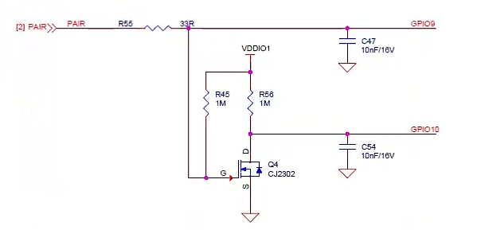

=========
LowPower
=========

概述
=====
低功耗是物联网应用的一项重要指标。芯片的处理器包含3种功耗模式，包含工作模式、
空闲省电模式和休眠模式，可以根据当前应用场景选择合适的功耗模式，降低芯片功耗延长电池寿命。

.. figure:: ../../picture/LPPwrSt.png
   :align: center

   低功耗模式

主要特征
=========

- 时钟控制: GLB 中对各外设的时钟控制，小范围的省电，响应速度较快
- 睡眠控制 (PDS) : 包含 PDS1/2/3/7/15 这 5 个等级，大范围省电，响应速度中等
- 深度睡眠控制 (HBN) : 包含 HBN0/1/2/3 这 4 个等级，全局省电，响应时间长

功能描述
==========

电源域
-----------
BL616/BL618 芯片中有 8 个电源域，每个电源域的主要功能如下所示：

- PD_AON

   * HBN 状态机，可控制 PD_AON_HBNRTC/PD_AON_HBNCORE/PD_CORE 的电源/隔离单元/复位/时钟
   * AON_PIN（GPIO16/17/18/19） 引脚唤醒功能
   * 预留 4 个可读可写的寄存器，可在 PDS/HBN0/HBN1/HBN2 模式下保存数据
   * BOR（Brown Out Reset）设置功能
   * LDO11_AON/RT/SOC 输出电压选择单元
   * Root 、F32K 、Uart 时钟源选择
   * HBN_OUT0_PIR（Acomp0/Acomp1/bor/pir）唤醒屏蔽和使能寄存器、中断状态寄存器

- PD_AON_HBNRTC

   * 选择 RTC Counter 时钟源的控制单元
   * RTC 可以用于唤醒，也可用于 LED 闪烁
   * RC32K 和 Xtal32X 控制功能

- PD_AON_HBNCORE

   * 部分电源控制寄存器
   * 保留 HBN_RAM，可用于保存程序和数据，进入 PDS/HBN0 后数据不会消失
   * 在 HBN 模式下，具有控制 AON_PIN 和保持其他 IO 的功能
   * PIR数字控制，PIR是热释电红外传感器，HBN区域内的一个外设，可以用作HBN唤醒源
   * 保留 LDO11SOC 、LDO15RF 、DCDC0 、DCDC1 、DCDC2 控制寄存器
   * 保留 XTAL 、TSEN 、Acomp0/1 、GPADC 控制寄存器
   * 预留 4 个可读可写的寄存器，可在 PDS/HBN0 模式下保存数据

- PD_CORE

   * PDS 状态机控制 PD_CORE_MISC/PD_USB/PD_CPU/PD_WB 的电源、隔离单元、复位、时钟和 Memory
   * 保留 PDS_RAM,进入 PDS 后数据不会消失
   * WIFI/BLE 计时器控制
   * 160KB WRAM Retention/Sleep
   * 控制 PDS 中断和唤醒功能
   * 保留 GPIO0~15/20~36 的控制
   * 保留 RC32M 的控制
   * PDS_Timer 定时器

- PD_CORE_MISC

   * PD_CORE_MISC 是 PD_CORE_MISC_DIG 和 PD_CORE_MISC_ANA 的统称
   * 外设（包括 I2C/SDIO/UART/FLASH/SPI/ADC/DAC/GPIO/PWM 等）
   * 芯片 GLB 寄存器

- PD_USB

   * USB 控制器

- PD_CPU

   * NP_CPU及缓存单元
   * ROM、TCM

- PD_WB

   * WIFI PHY/MAC
   * BLE PHY/MAC
   * RF Controller

电源模式
-----------
BL616/BL618 共有 10 个电源模式，8 个电源域。
每种电源模式对用的电源域的开关状态如下表所示:

.. table:: 电源模式

    +--------+------------+-----------+-----------------+----------------+------------+---------------+------------+------------+------------+
    |        |            | Power Domain                                                                                                     |
    +        +            +-----------+-----------------+----------------+------------+---------------+------------+------------+------------+
    | NO.    | Scenario   |  PD_AON   |  PD_AON_HBNRTC  | PD_AON_HBNCORE |  PD_CORE   | PD_CORE_MISC  |   PD_USB   |   PD_CPU   |    PD_WB   |
    +========+============+===========+=================+================+============+===============+============+============+============+
    | 1      | Normal     |    ON     |        ON       |       ON       |     ON     |       ON      |     ON     |     ON     |     ON     |
    +--------+------------+-----------+-----------------+----------------+------------+---------------+------------+------------+------------+
    | 2      | PDS1       |    ON     |        ON       |       ON       |     ON     |       ON      |     ON     |     ON     |     OFF    |
    +--------+------------+-----------+-----------------+----------------+------------+---------------+------------+------------+------------+
    | 3      | PDS2       |    ON     |        ON       |       ON       |     ON     |       ON      |     ON     |     OFF    |     ON     |
    +--------+------------+-----------+-----------------+----------------+------------+---------------+------------+------------+------------+
    | 4      | PDS3       |    ON     |        ON       |       ON       |     ON     |       ON      |     ON     |     OFF    |     OFF    |
    +--------+------------+-----------+-----------------+----------------+------------+---------------+------------+------------+------------+
    | 5      | PDS7       |    ON     |        ON       |       ON       |     ON     |       ON      |     OFF    |     OFF    |     OFF    |
    +--------+------------+-----------+-----------------+----------------+------------+---------------+------------+------------+------------+
    | 6      | PDS15      |    ON     |        ON       |       ON       |     ON     |       OFF     |     OFF    |     OFF    |     OFF    |
    +--------+------------+-----------+-----------------+----------------+------------+---------------+------------+------------+------------+
    | 7      | HBN0       |    ON     |        ON       |       ON       |    OFF     |       OFF     |     OFF    |     OFF    |     OFF    |
    +--------+------------+-----------+-----------------+----------------+------------+---------------+------------+------------+------------+
    | 8      | HBN1       |    ON     |        ON       |       OFF      |    OFF     |       OFF     |     OFF    |     OFF    |     OFF    |
    +--------+------------+-----------+-----------------+----------------+------------+---------------+------------+------------+------------+
    | 9      | HBN2       |    ON     |        OFF      |       OFF      |    OFF     |       OFF     |     OFF    |     OFF    |     OFF    |
    +--------+------------+-----------+-----------------+----------------+------------+---------------+------------+------------+------------+
    | 10     | HBN3       |    OFF    |        OFF      |       OFF      |    OFF     |       OFF     |     OFF    |     OFF    |     OFF    |
    +--------+------------+-----------+-----------------+----------------+------------+---------------+------------+------------+------------+

10 种电源模式的功耗分别如下：

.. table:: 电源模式的功耗
    :widths: 5, 10, 13
    :width: 100%
    :align: center

    +--------+------------+--------------+
    | NO.    | Scenario   |  current/uA  |
    +========+============+==============+
    | 1      | Normal     |    30000     |
    +--------+------------+--------------+
    | 2      | PDS1       |    930       |
    +--------+------------+--------------+
    | 3      | PDS2       |    1400      |
    +--------+------------+--------------+
    | 4      | PDS3       |    550       |
    +--------+------------+--------------+
    | 5      | PDS7       |    540       |
    +--------+------------+--------------+
    | 6      | PDS15      |    70        |
    +--------+------------+--------------+
    | 7      | HBN0       |    3.1       |
    +--------+------------+--------------+
    | 8      | HBN1       |    2.7       |
    +--------+------------+--------------+
    | 9      | HBN2       |    2.1       |
    +--------+------------+--------------+
    | 10     | HBN3       |              |
    +--------+------------+--------------+

唤醒源
------------
芯片内部支持多种唤醒源，可从不同电源模式中唤醒。

不同电源模式的唤醒源如下表所示：

.. table:: 唤醒源 

   +--------------+------------------------------------------------------------------------+
   |电源模式      |唤醒源                                                                  |
   +==============+========================================================================+
   |PDS1          |AON_PIN/BOR/RTC/Pir/Acomp0/Acomp1/PDS_Timer/GPIO/IRRX/DM/USB            |
   +--------------+------------------------------------------------------------------------+
   |PDS2          |AON_PIN/BOR/RTC/Pir/Acomp0/Acomp1/PDS_Timer/GPIO/IRRX/DM/USB/WIFI       |
   +--------------+------------------------------------------------------------------------+
   |PDS3          |AON_PIN/BOR/RTC/Pir/Acomp0/Acomp1/PDS_Timer/GPIO/IRRX/DM/USB            |
   +--------------+------------------------------------------------------------------------+
   |PDS7          |AON_PIN/BOR/RTC/Pir/Acomp0/Acomp1/PDS_Timer/GPIO/IRRX/DM                |
   +--------------+------------------------------------------------------------------------+
   |PDS15         |AON_PIN/BOR/RTC/Pir/Acomp0/Acomp1/PDS_Timer/PDS_GPIO                    |
   +--------------+------------------------------------------------------------------------+
   |HBN0          |AON_PIN/BOR/RTC/Pir/Acomp0/Acomp1                                       |
   +--------------+------------------------------------------------------------------------+
   |HBN1          |AON_PIN/RTC                                                             |
   +--------------+------------------------------------------------------------------------+
   |HBN2          |AON_PIN                                                                 |
   +--------------+------------------------------------------------------------------------+
   |HBN3          |重新给 VDDIO2 供电                                                      |
   +--------------+------------------------------------------------------------------------+

功耗模式
------------
**工作模式**

芯片提供处理器与外设独立的时钟控制，在 GLB 和时钟的章节介绍对各模块的时钟控制，软件可以根据当前应用场景，对于不需要使用的处理器或外设进行时钟控制。
时钟控制的响应是实时的，在此工作模式下，不需要担心响应时间。

**掉电睡眠模式(PDS)**

掉电模式相较于工作模式功耗较低。进入PDS模式后，将 RTC(Real Time Clock) 之外的时钟进行管控，会切换为内部低速时钟，并将外部晶振与PLL
关闭达到更加省电的状态，因此进入与离开此低功耗模式会有时间延迟。当进入掉电睡眠模式时，OCRAM 区域的数据可以自动进入 retention 状态而保留
下来，当唤醒后可以自行退出 retention 状态。

1. 进入空闲省电模式

软件可通过 PDS 配置让此模块进入掉电模式，等待处理，进入等待中断模式 (WFI) 后，PDS 模
块会触发时钟控制模块进入gate clock操作，并通知模拟电路关闭PLL以及外部晶振

2. 离开空闲省电模式

离开空闲省电模式的方式有两种，第一是空闲中间有特定的中断或事件打断空闲状态，第二是软件设定PDS_TIMER
的空闲时间达到，两者均会触发 PDS 模块进入或离开掉电模式。注意：因为打开晶振需要
约 1ms 的时间，PDS 提供软件提前打开晶振的方式，这个做法可以加速 PDS 醒来，当 PDS
模块准备醒来时，此模块会通过中断通知处理器离开等待中断模式 (WFI)。

**休眠模式(HBN)**

休眠模式在保留 AON(Always On) 电源的状态下，将大部分的芯片逻辑进行断电 (Vcore)，直到收到外
部事件才会将内部电路唤醒的。
在休眠模式下可以达到极致的省电状态，但相对于前两者需要的响应时间也最长，适合长时间不需要工作
的状态下，可以进入此状态，延长电池寿命。
休眠时期会将大部分的电路断电，对应的寄存器值和内存的数据也会消失。因此 HBN 内部留有 4KB HBN_RAM，这个
内存在休眠状态时不会断电，软件有需要保存的资料或状态可以在进入休眠前拷贝到这个内存。从休眠
恢复时，可以直接从 RAM 中存取数据，通常可以用作状态的纪录或是数据快速恢复。

IO 唤醒
------------

PDS1~15 、HBN0~2 都支持 IO 唤醒，但是具体实现方式不同。

   +--------------+--------------------------------------------------------------------------------------------------------------------------+
   |电源模式      | IO 唤醒实现方法                                                                                                          |
   +==============+==========================================================================================================================+
   |PDS1~7        | 使用 GLB_IO 唤醒                                                                                                         |
   +--------------+--------------------------------------------------------------------------------------------------------------------------+
   |PDS15         | 使用 PDS_IO 唤醒(高电平/下降沿/睡眠之前为低电平的上升沿) 和 AON_IO 唤醒(低电平/高电平/下降沿/上升沿/上升或者下降沿)      |
   +--------------+--------------------------------------------------------------------------------------------------------------------------+
   |HBN0~2        | 使用 AON_IO 唤醒                                                                                                         |
   +--------------+--------------------------------------------------------------------------------------------------------------------------+

**GLB_IO 唤醒 PDS1~7 模式**

所有 IO 都支持唤醒 PDS1~7 模式，PDS1~7 模式启动 IO 唤醒代码如下：

.. code-block:: c
   :caption: glb io wakeup pds1~7
   :linenos:

   BL_Err_Type glbio_wakeup(uint32_t gpio_id, uint32_t trigger_type)
   {
      gpio_set_mode(gpio_id, trigger_type);
      gpio_irq_enable(gpio_id, ENABLE);
      gpio_attach_irq(gpio_id, pm_gpio_callback);

      pm_pds_wakeup_src_en(PDS_WAKEUP_BY_GLB_GPIO_IRQ_EN_POS);
   }

**PDS_IO 唤醒 PDS15 模式**

PDS_IO 是除了 AON_IO (GPIO16~19) 的所有 IO, 都支持唤醒 PDS15 模式。

1. PDS_IO 支持的唤醒模式
 - 同步下降沿
 - 同步高电平
 - 异步下降沿
 - 异步高电平

2. PDS_IO 唤醒模式的分组

PDS_IO 的唤醒模式可分为 GPIO0~7 、GPIO8~15、GPIO20~27、GPIO28~34 四组。每组 GPIO 共享相同的唤醒模式，例如，GPIO0 设置为高电平唤醒，
GPIO7 也只能配置为高电平唤醒，而 GPIO20 可以配置为下降沿唤醒。

.. attention:: 如果在 PDS15 状态下使能 PDS_IO 唤醒，则必须使能该 GPIO 的内部 PU/PD，否则电流将增加到 1000+ua。

3. PDS_IO PU\PD 配置的分组

PDS_IO 的 PU\PD\IE 配置可分为 GPIO0~15 、GPIO20~34 两组。每组 GPIO 共享相同的PU\PD\IE 配置，例如，GPIO0 设置为 PU，
GPIO8 也只能配置为 PU，而 GPIO20 可以配置为 PD。

.. attention:: 由于 GPIO0~15 共享一组 PU\PD\IE 配置，可能会限制 GPIO0~7 、GPIO8~15 的触发方式配置。
 例如，GPIO0~15 设为 PU，那么 GPIO0~7 、GPIO8~15 的唤醒模式都不能选择高电平唤醒。
 同理，由于 GPIO20~34 共享一组 PU\PD\IE 配置，可能会限制 GPIO20~27、GPIO28~34 的触发方式配置。

.. attention:: 使用 GPIO0~15 作为唤醒引脚时，需要注意 GPIO2 是 BOOT 脚，通常接了下拉电阻，
 GPIO0~15 设为 PU 时可能由于 GPIO2 下拉导致漏电；而 GPIO4 是 FLASH_CS 脚，通常接了上拉电阻，
 GPIO0~15 设为 PD 时可能由于 GPIO4 上拉导致漏电。

 GPIO0~15 作为唤醒引脚时，如果 GPIO2 、GPIO4 外部同时分别有下拉电阻和上拉电阻，
 建议将 GPIO0~15  设为 PU,同时把 BOOT 脚的下拉电阻换成 1M 欧姆的，减少漏电流。

.. attention:: 使用 GPIO20~34 作为唤醒引脚时，需要注意 GPIO21、22 可能用作 UART 脚，串口空闲状态为高电平，所以建议设置内部上拉；
 如果 GPIO21、22 没有接串口，那么配置上拉或者下拉都可以。

例如，PDS15 模式启动 IO3 下降沿唤醒代码如下：

.. code-block:: c

   PDS_Set_GPIO_Pad_IntClr(PDS_GPIO_INT_SET_1_GPIO0_GPIO7);
   PDS_Set_GPIO_Pad_Pn_Pu_Pd_Ie(PDS_GPIO_GROUP_SET_GPIO0_GPIO15, 1, 0, 1);
   PDS_Set_GPIO_Pad_IntMode(PDS_GPIO_INT_SET_1_GPIO0_GPIO7,
                             (PDS_GPIO_INT_TRIG_Type)trigger_type);
   PDS_Set_GPIO_Pad_IntMask((GLB_GPIO_Type)GLB_GPIO_PIN_3, UNMASK);

   pm_pds_wakeup_src_en(PDS_WAKEUP_BY_PDS_GPIO_IRQ_EN_POS);

**AON_IO 唤醒 PDS15 模式**

PDS15 模式支持 AON_IO (GPIO16~19) 唤醒，AON_IO 共享相同的触发方式，但是 PU\PD\IE 配置是独立的。例如如果 GPIO16 设置为下降沿触发方式唤醒，
则GPIO17~19 不能配置为其他触发方式。如果 GPIO16 设置为PU，GPIO17~19 可以不配置 PU。

.. code-block:: c

   static BL_Err_Type aonio_wakeup_pds15(uint32_t pin, uint32_t trigger_type)
   {
      uint32_t maskVal = 0xF;
      HBN_AON_PAD_CFG_Type aonPadCfg;

      aonPadCfg.ctrlEn = 1;
      aonPadCfg.ie = 1;
      aonPadCfg.oe = 0;
      aonPadCfg.pullUp = 0;
      aonPadCfg.pullDown = 0;
      HBN_Aon_Pad_Cfg(DISABLE, (pin - 16), &aonPadCfg);
      maskVal = 0xF & ~(1 << (pin - 16));
      HBN_Aon_Pad_WakeUpCfg(DISABLE, trigger_type, maskVal, 0, 7);

      pm_hbn_out0_irq_register();

      pm_pds_wakeup_src_en(PDS_WAKEUP_BY_HBN_IRQ_OUT_EN_POS);

      pm_pds_mode_enter(PM_PDS_LEVEL_15,0);

   }

**AON_IO 唤醒 HBN0~2 模式**

HBN0~2 模式支持 AON_IO (GPIO16~19) 唤醒，且 AON_IO 共享相同的触发方式,但是 PU\PD\IE 配置是独立的。例如,如果 GPIO16 设置为下降沿触发方式唤醒，
则GPIO17~19 不能配置其他触发方式。如果 GPIO16 设置为PU，GPIO17~19 可以不配置 PU。

.. code-block:: c

   static BL_Err_Type aonio_wakeup_hbn(uint32_t pin, uint32_t trigger_type)
   {
      uint32_t maskVal = 0xF;
      HBN_AON_PAD_CFG_Type aonPadCfg;

      aonPadCfg.ctrlEn = 1;
      aonPadCfg.ie = 1;
      aonPadCfg.oe = 0;
      aonPadCfg.pullUp = 0;
      aonPadCfg.pullDown = 0;
      HBN_Aon_Pad_Cfg(DISABLE, (pin - 16), &aonPadCfg);
      maskVal = 0xF & ~(1 << (pin - 16));
      HBN_Aon_Pad_WakeUpCfg(DISABLE, trigger_type, maskVal, 0, 7);

      pm_hbn_mode_enter(PM_HBN_LEVEL_0,0);
   }

ACOMP 唤醒
------------

芯片支持ACOMP唤醒，ACOMP有两个比较模块，每个ACOMP模块均有正极输入通道和负极输入通道两个输入口，每个输入口都可以选择：

- ADC channel0-7
- DAC 的输出A/B
- 系统1.25V的参考电压(低功耗模式该电压不存在)
- VDD33的分压(分压系数可调整)

分压系数可以选择以下中的一个：

- 0.25
- 0.5
- 0.75
- 1

在常规的应用中，一般将正极输入通道设置为ADCchannel0-7中的一个，也就是使用GPIO2、3、10、12、13、14、19、20中一个 ，
负极选择VDD33的分压，分压系数可根据实际应用场景选择，
在正极输入电压由小于负极电压变为大于负极电压时产生一个上升沿中断唤醒源，
在正极输入电压由大于负极电压变为小于负极电压时产生一个下升沿中断唤醒源。当使能一路ACOMP时电流增加约7uA左右，
同时使能两路ACOMP电流增加约10uA左右。

IO 双边沿唤醒
------------

AON_IO 和 ACOMP 支持双边沿唤醒。

PDS_IO 实现双边沿唤醒需要使用两个引脚，都设置成下降沿唤醒，配合以下电路可以实现双边沿唤醒：

但是在双边沿唤醒的场景中，引脚的输入既有可能是高电平，又有可能是低电平，所以不能使能内部上下拉；否则一旦引脚电平和内部上下拉配置相反，
会产生漏电，漏电电流=3.3V/电阻。由于内部不能使能上下拉，则同组的其他引脚也没有内部的上下拉，则 pcd 上需要配合外部的上下拉来保证引脚不
是悬空的，如果用户能保证芯片睡眠期间外部的输入不是悬空的，就可以不用上下拉。

例如，GPIO15 和 GPIO20 接同一输入源，GPIO15 和 GPIO20 设为下降沿唤醒，那么 GPIO0~15 、GPIO20~34 这两组引脚都不能使能内部上下拉，
GPIO0~14、GPIO21~34 引脚外部需要接上下拉电阻。

.. error:: GPIO15 和 GPIO20 接同一输入源，GPIO15 设为下降沿唤醒，GPIO20 设为高电平唤醒；当电平由低到高时，芯片从 PDS 模式唤醒，但是
 PDS_GPIO_STAT 寄存器的值是 0x00014000，表示同时出现了高电平唤醒和下降沿唤醒，可是示波器并没有抓到下降沿。

IO 唤醒触发条件
------------

io 唤醒对电平时序的要求如下：

+-----------+-------------+
|           |  时间 / us  |
+===========+=============+
|  pds io   |    100      |
+-----------+-------------+
|  aon io   |    100      |
+-----------+-------------+
|  acomp    |     50      |
+-----------+-------------+

例如，GPIO0 作为 pds_io 唤醒引脚，触发模式是下降沿，那么电平的时序必须满足下降沿出现后，低电平保持大于等于 100us 的要求。

GPIO18  作为 aon_io 唤醒引脚，触发模式是高电平，那么电平的时序必须保持高电平时间大于等于 100us。

GPIO13 作为 acomp 唤醒，触发模式是上升沿唤醒，那么电平的时序必须满足上升沿出现后，高电平保持大于等于 50us 的要求。

