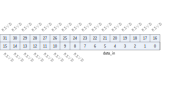

寄存器描述
====================

+---------------+--+
| 名称          | 描述|
+---------------+--+
| `cks_config`_ |  |
+---------------+--+
| `data_in`_    |  |
+---------------+--+
| `cks_out`_    |  |
+---------------+--+

cks_config
------------
 
**地址：**  0x2000a700
 

.. table::
    :widths: 10, 15,10,10,55
    :width: 100%
    :align: center
     
    +----------+------------------------------+--------+-------------+------------------------------------------------------+
    | 位       | 名称                         |权限    | 复位值      | 描述                                                 |
    +==========+==============================+========+=============+======================================================+
    | 31:2     | RSVD                         |        |             |                                                      |
    +----------+------------------------------+--------+-------------+------------------------------------------------------+
    | 1        | cr_cks_byte_swap             | r/w    | 1'b0        | Byte swap signal for each 16-bit data                |
    +          +                              +        +             +                                                      +
    |          |                              |        |             | 1'b0: The first data pushed should be the upper byte |
    +          +                              +        +             +                                                      +
    |          |                              |        |             | 1'b1: The first data pushed should be the lower byte |
    +----------+------------------------------+--------+-------------+------------------------------------------------------+
    | 0        | cr_cks_clr                   | w1c    | 1'b0        | Checksum clear (reset) signal                        |
    +----------+------------------------------+--------+-------------+------------------------------------------------------+

data_in
---------
 
**地址：**  0x2000a704
 

.. table::
    :widths: 10, 15,10,10,55
    :width: 100%
    :align: center
     
    +----------+------------------------------+--------+-------------+------------+
    | 位       | 名称                         |权限    | 复位值      | 描述       |
    +==========+==============================+========+=============+============+
    | 31:8     | RSVD                         |        |             |            |
    +----------+------------------------------+--------+-------------+------------+
    | 7:0      | data_in                      | w      | x           | Data input |
    +----------+------------------------------+--------+-------------+------------+

cks_out
---------
 
**地址：**  0x2000a708
 

.. table::
    :widths: 10, 15,10,10,55
    :width: 100%
    :align: center
     
    +----------+------------------------------+--------+-------------+-----------------+
    | 位       | 名称                         |权限    | 复位值      | 描述            |
    +==========+==============================+========+=============+=================+
    | 31:16    | RSVD                         |        |             |                 |
    +----------+------------------------------+--------+-------------+-----------------+
    | 15:0     | cks_out                      | r      | 16'hFFFF    | Checksum output |
    +----------+------------------------------+--------+-------------+-----------------+

