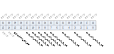
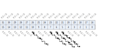
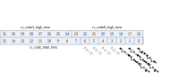
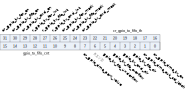

寄存器描述
====================

+-----------------+------+
| 名称            | 描述 |
+-----------------+------+
| `gpio_cfg0`_    |      |
+-----------------+------+
| `gpio_cfg1`_    |      |
+-----------------+------+
| `gpio_cfg2`_    |      |
+-----------------+------+
| `gpio_cfg3`_    |      |
+-----------------+------+
| `gpio_cfg4`_    |      |
+-----------------+------+
| `gpio_cfg5`_    |      |
+-----------------+------+
| `gpio_cfg6`_    |      |
+-----------------+------+
| `gpio_cfg7`_    |      |
+-----------------+------+
| `gpio_cfg8`_    |      |
+-----------------+------+
| `gpio_cfg9`_    |      |
+-----------------+------+
| `gpio_cfg10`_   |      |
+-----------------+------+
| `gpio_cfg11`_   |      |
+-----------------+------+
| `gpio_cfg12`_   |      |
+-----------------+------+
| `gpio_cfg13`_   |      |
+-----------------+------+
| `gpio_cfg14`_   |      |
+-----------------+------+
| `gpio_cfg15`_   |      |
+-----------------+------+
| `gpio_cfg16`_   |      |
+-----------------+------+
| `gpio_cfg17`_   |      |
+-----------------+------+
| `gpio_cfg18`_   |      |
+-----------------+------+
| `gpio_cfg19`_   |      |
+-----------------+------+
| `gpio_cfg20`_   |      |
+-----------------+------+
| `gpio_cfg21`_   |      |
+-----------------+------+
| `gpio_cfg22`_   |      |
+-----------------+------+
| `gpio_cfg23`_   |      |
+-----------------+------+
| `gpio_cfg24`_   |      |
+-----------------+------+
| `gpio_cfg25`_   |      |
+-----------------+------+
| `gpio_cfg26`_   |      |
+-----------------+------+
| `gpio_cfg27`_   |      |
+-----------------+------+
| `gpio_cfg28`_   |      |
+-----------------+------+
| `gpio_cfg29`_   |      |
+-----------------+------+
| `gpio_cfg30`_   |      |
+-----------------+------+
| `gpio_cfg31`_   |      |
+-----------------+------+
| `gpio_cfg32`_   |      |
+-----------------+------+
| `gpio_cfg33`_   |      |
+-----------------+------+
| `gpio_cfg34`_   |      |
+-----------------+------+
| `gpio_cfg128`_  |      |
+-----------------+------+
| `gpio_cfg129`_  |      |
+-----------------+------+
| `gpio_cfg136`_  |      |
+-----------------+------+
| `gpio_cfg137`_  |      |
+-----------------+------+
| `gpio_cfg138`_  |      |
+-----------------+------+
| `gpio_cfg139`_  |      |
+-----------------+------+
| `gpio_cfg141`_  |      |
+-----------------+------+
| `gpio_cfg142`_  |      |
+-----------------+------+
| `gpio_cfg143`_  |      |
+-----------------+------+
| `gpio_cfg144`_  |      |
+-----------------+------+

soc_info0
-----------
 
**地址：**  0x20000000
 

.. table::
    :widths: 10, 15,10,10,55
    :width: 100%
    :align: center
     
    +----------+------------------------------+--------+-------------+---+
    | 位       | 名称                         |权限    | 复位值      | 描述|
    +==========+==============================+========+=============+===+
    | 31:28    | glb_id                       | r      | 4'h6        |   |
    +----------+------------------------------+--------+-------------+---+
    | 27       | chip_rdy                     | r      | 0           |   |
    +----------+------------------------------+--------+-------------+---+
    | 26:0     | RSVD                         |        |             |   |
    +----------+------------------------------+--------+-------------+---+

sys_cfg0
----------
 
**地址：**  0x20000090
 

.. table::
    :widths: 10, 15,10,10,55
    :width: 100%
    :align: center
     
    +----------+------------------------------+--------+-------------+-------------------------------------------------------------------------+
    | 位       | 名称                         |权限    | 复位值      | 描述                                                                    |
    +==========+==============================+========+=============+=========================================================================+
    | 31:24    | RSVD                         |        |             |                                                                         |
    +----------+------------------------------+--------+-------------+-------------------------------------------------------------------------+
    | 23:16    | reg_bclk_div                 | r/w    | 0           | bclk divide from hclk                                                   |
    +----------+------------------------------+--------+-------------+-------------------------------------------------------------------------+
    | 15:8     | reg_hclk_div                 | r/w    | 0           | hclk divide from root clock (clock source selected by hbn_root_clk_sel) |
    +----------+------------------------------+--------+-------------+-------------------------------------------------------------------------+
    | 7:6      | hbn_root_clk_sel             | r      | 0           | root clock selection from HBN (0: RC32M 1: XTAL  2/3: PLL others)       |
    +----------+------------------------------+--------+-------------+-------------------------------------------------------------------------+
    | 5:4      | RSVD                         |        |             |                                                                         |
    +----------+------------------------------+--------+-------------+-------------------------------------------------------------------------+
    | 3        | reg_bclk_en                  | r/w    | 1           | bclk force on                                                           |
    +----------+------------------------------+--------+-------------+-------------------------------------------------------------------------+
    | 2        | reg_hclk_en                  | r/w    | 1           | hclk force on                                                           |
    +----------+------------------------------+--------+-------------+-------------------------------------------------------------------------+
    | 1        | reg_fclk_en                  | r/w    | 1           | fclk force on                                                           |
    +----------+------------------------------+--------+-------------+-------------------------------------------------------------------------+
    | 0        | reg_pll_en                   | r/w    | 1           | pll clock enable for fclk                                               |
    +----------+------------------------------+--------+-------------+-------------------------------------------------------------------------+

sys_cfg1
----------
 
**地址：**  0x20000094
 

.. table::
    :widths: 10, 15,10,10,55
    :width: 100%
    :align: center
     
    +----------+------------------------------+--------+-------------+---------------------------------------+
    | 位       | 名称                         |权限    | 复位值      | 描述                                  |
    +==========+==============================+========+=============+=======================================+
    | 31:27    | RSVD                         |        |             |                                       |
    +----------+------------------------------+--------+-------------+---------------------------------------+
    | 26:24    | fclk_sw_state                | r      | 0           |                                       |
    +----------+------------------------------+--------+-------------+---------------------------------------+
    | 23:8     | RSVD                         |        |             |                                       |
    +----------+------------------------------+--------+-------------+---------------------------------------+
    | 7:4      | reg_bclk_sw_done_cnt         | r/w    | 4'd5        | BCLK division protection done counter |
    +----------+------------------------------+--------+-------------+---------------------------------------+
    | 3        | RSVD                         |        |             |                                       |
    +----------+------------------------------+--------+-------------+---------------------------------------+
    | 2        | sts_bclk_prot_done           | r      | 1           | clk protection done                   |
    +----------+------------------------------+--------+-------------+---------------------------------------+
    | 1        | reg_bclk_div_bypass          | r/w    | 1'b0        | BCLK division protection bypass       |
    +----------+------------------------------+--------+-------------+---------------------------------------+
    | 0        | reg_bclk_div_act_pulse       | w1p    | 1'b0        | BCLK division protection activation   |
    +----------+------------------------------+--------+-------------+---------------------------------------+

bus_cfg0
----------
 
**地址：**  0x200000a0
 

.. table::
    :widths: 10, 15,10,10,55
    :width: 100%
    :align: center
     
    +----------+------------------------------+--------+-------------+---------------------+
    | 位       | 名称                         |权限    | 复位值      | 描述                |
    +==========+==============================+========+=============+=====================+
    | 31:16    | rg_apb_pck_force             | r/w    | 16'hffff    | APB clock force on  |
    +----------+------------------------------+--------+-------------+---------------------+
    | 15:0     | rg_apb2_pck_force            | r/w    | 16'hffff    | APB2 clock force on |
    +----------+------------------------------+--------+-------------+---------------------+

adc_cfg0
----------
 
**地址：**  0x20000110
 
.. figure:: ../../picture/glb_adc_cfg0.svg
   :align: center

.. table::
    :widths: 10, 15,10,10,55
    :width: 100%
    :align: center
     
    +----------+------------------------------+--------+-------------+---------------------------------------------------------------------------+
    | 位       | 名称                         |权限    | 复位值      | 描述                                                                      |
    +==========+==============================+========+=============+===========================================================================+
    | 31:9     | RSVD                         |        |             |                                                                           |
    +----------+------------------------------+--------+-------------+---------------------------------------------------------------------------+
    | 8        | gpadc_32m_div_en             | r/w    | 1           | GPADC 32M Clock Dvider Enable                                             |
    +----------+------------------------------+--------+-------------+---------------------------------------------------------------------------+
    | 7        | gpadc_32m_clk_sel            | r/w    | 0           | GPADC Clock Source Select.  0: audio_pll_clk,  1: xclk                    |
    +----------+------------------------------+--------+-------------+---------------------------------------------------------------------------+
    | 6        | RSVD                         |        |             |                                                                           |
    +----------+------------------------------+--------+-------------+---------------------------------------------------------------------------+
    | 5:0      | gpadc_32m_clk_div            | r/w    | 6'd2        | GPADC 32M Clock Divider (audio_pll_clk)/(N+1) , default : audio_pll_clk/3 |
    +----------+------------------------------+--------+-------------+---------------------------------------------------------------------------+

dac_cfg0
----------
 
**地址：**  0x20000120
 
.. figure:: ../../picture/glb_dac_cfg0.svg
   :align: center

.. table::
    :widths: 10, 15,10,10,55
    :width: 100%
    :align: center
     
    +----------+------------------------------+--------+-------------+------------------------------------------------------------------------------------------------------------+
    | 位       | 名称                         |权限    | 复位值      | 描述                                                                                                       |
    +==========+==============================+========+=============+============================================================================================================+
    | 31:24    | gpdac_reserved               | r/w    | 8'hf        |                                                                                                            |
    +----------+------------------------------+--------+-------------+------------------------------------------------------------------------------------------------------------+
    | 23:15    | RSVD                         |        |             |                                                                                                            |
    +----------+------------------------------+--------+-------------+------------------------------------------------------------------------------------------------------------+
    | 14       | gpdac_dat_chb_sel            | r/w    | 1'h0        | 0:data from gpip, 1:data from audio pwm                                                                    |
    +----------+------------------------------+--------+-------------+------------------------------------------------------------------------------------------------------------+
    | 13       | gpdac_dat_cha_sel            | r/w    | 1'h0        | 0:data from gpip, 1:data from audio pwm                                                                    |
    +----------+------------------------------+--------+-------------+------------------------------------------------------------------------------------------------------------+
    | 12       | gpdac_ana_clk_sel            | r/w    | 1'h0        | 0:clock from gpip, 1:clock from audio pwm                                                                  |
    +----------+------------------------------+--------+-------------+------------------------------------------------------------------------------------------------------------+
    | 11:9     | gpdac_test_sel               | r/w    | 3'h0        | select test point 0~7                                                                                      |
    +----------+------------------------------+--------+-------------+------------------------------------------------------------------------------------------------------------+
    | 8        | gpdac_ref_sel                | r/w    | 1'h0        | Reference select                                                                                           |
    +          +                              +        +             +                                                                                                            +
    |          |                              |        |             | 1'h0 Internal reference                                                                                    |
    +          +                              +        +             +                                                                                                            +
    |          |                              |        |             | 1'h1 External reference                                                                                    |
    +----------+------------------------------+--------+-------------+------------------------------------------------------------------------------------------------------------+
    | 7        | gpdac_test_en                | r/w    | 1'h0        | Test enable 1'h0 analog test disabled (ATEST is set in Hi-Z state) 1'h1 analog test point enabled to ATEST |
    +----------+------------------------------+--------+-------------+------------------------------------------------------------------------------------------------------------+
    | 6:2      | RSVD                         |        |             |                                                                                                            |
    +----------+------------------------------+--------+-------------+------------------------------------------------------------------------------------------------------------+
    | 1        | gpdacb_rstn_ana              | r/w    | 1'h1        | Soft reset for DAC channel B, active low                                                                   |
    +----------+------------------------------+--------+-------------+------------------------------------------------------------------------------------------------------------+
    | 0        | gpdaca_rstn_ana              | r/w    | 1'h1        | Soft reset for DAC channel A, active low                                                                   |
    +----------+------------------------------+--------+-------------+------------------------------------------------------------------------------------------------------------+

dac_cfg1
----------
 
**地址：**  0x20000124
 

.. table::
    :widths: 10, 15,10,10,55
    :width: 100%
    :align: center
     
    +----------+------------------------------+--------+-------------+---------------------------------------------------------------+
    | 位       | 名称                         |权限    | 复位值      | 描述                                                          |
    +==========+==============================+========+=============+===============================================================+
    | 31:23    | RSVD                         |        |             |                                                               |
    +----------+------------------------------+--------+-------------+---------------------------------------------------------------+
    | 22:20    | gpdac_a_outmux               | r/w    | 3'h0        |                                                               |
    +----------+------------------------------+--------+-------------+---------------------------------------------------------------+
    | 19:18    | gpdac_a_rng                  | r/w    | 2'h3        | Output voltage range control with internal/external reference |
    +----------+------------------------------+--------+-------------+---------------------------------------------------------------+
    | 17:2     | RSVD                         |        |             |                                                               |
    +----------+------------------------------+--------+-------------+---------------------------------------------------------------+
    | 1        | gpdac_ioa_en                 | r/w    | 1'h0        | Channel A conversion output to pad enable                     |
    +          +                              +        +             +                                                               +
    |          |                              |        |             | 1'h0 Disable channel A conversion result to GPIO              |
    +          +                              +        +             +                                                               +
    |          |                              |        |             | 1'h1 Enable channel A conversion result to GPIO               |
    +----------+------------------------------+--------+-------------+---------------------------------------------------------------+
    | 0        | gpdac_a_en                   | r/w    | 1'h0        | Channel A enable/disable signal                               |
    +          +                              +        +             +                                                               +
    |          |                              |        |             | 1'h0 Disable channel A conversion.                            |
    +          +                              +        +             +                                                               +
    |          |                              |        |             | 1'h1 Enable channel A conversion                              |
    +----------+------------------------------+--------+-------------+---------------------------------------------------------------+

dac_cfg2
----------
 
**地址：**  0x20000128
 

.. table::
    :widths: 10, 15,10,10,55
    :width: 100%
    :align: center
     
    +----------+------------------------------+--------+-------------+--------------------------------------------------+
    | 位       | 名称                         |权限    | 复位值      | 描述                                             |
    +==========+==============================+========+=============+==================================================+
    | 31:23    | RSVD                         |        |             |                                                  |
    +----------+------------------------------+--------+-------------+--------------------------------------------------+
    | 22:20    | gpdac_b_outmux               | r/w    | 3'h0        |                                                  |
    +----------+------------------------------+--------+-------------+--------------------------------------------------+
    | 19:18    | gpdac_b_rng                  | r/w    | 2'h3        |                                                  |
    +----------+------------------------------+--------+-------------+--------------------------------------------------+
    | 17:2     | RSVD                         |        |             |                                                  |
    +----------+------------------------------+--------+-------------+--------------------------------------------------+
    | 1        | gpdac_iob_en                 | r/w    | 1'h0        | channel B conversion output to pad enable        |
    +          +                              +        +             +                                                  +
    |          |                              |        |             | 1'h0 Disable channel B conversion result to GPIO |
    +          +                              +        +             +                                                  +
    |          |                              |        |             | 1'h1 Enable channel B conversion result to GPIO  |
    +----------+------------------------------+--------+-------------+--------------------------------------------------+
    | 0        | gpdac_b_en                   | r/w    | 1'h0        | channel B enable/disable signal                  |
    +          +                              +        +             +                                                  +
    |          |                              |        |             | 1'h0 Disable channel B conversion.               |
    +          +                              +        +             +                                                  +
    |          |                              |        |             | 1'h1 Enable channel B conversion                 |
    +----------+------------------------------+--------+-------------+--------------------------------------------------+

dac_cfg3
----------
 
**地址：**  0x2000012c
 
.. figure:: ../../picture/glb_dac_cfg3.svg
   :align: center

.. table::
    :widths: 10, 15,10,10,55
    :width: 100%
    :align: center
     
    +----------+------------------------------+--------+-------------+----------------------+
    | 位       | 名称                         |权限    | 复位值      | 描述                 |
    +==========+==============================+========+=============+======================+
    | 31:28    | RSVD                         |        |             |                      |
    +----------+------------------------------+--------+-------------+----------------------+
    | 27:16    | gpdac_a_data                 | r/w    | 12'h0       | Channel A Data input |
    +----------+------------------------------+--------+-------------+----------------------+
    | 15:12    | RSVD                         |        |             |                      |
    +----------+------------------------------+--------+-------------+----------------------+
    | 11:0     | gpdac_b_data                 | r/w    | 12'h0       | Channel B Data input |
    +----------+------------------------------+--------+-------------+----------------------+

dma_cfg0
----------
 
**地址：**  0x20000130
 

.. table::
    :widths: 10, 15,10,10,55
    :width: 100%
    :align: center
     
    +----------+------------------------------+--------+-------------+--------------------------+
    | 位       | 名称                         |权限    | 复位值      | 描述                     |
    +==========+==============================+========+=============+==========================+
    | 31:24    | dma_clk_en                   | r/w    | 8'hff       | DMA Channel Clock Enable |
    +----------+------------------------------+--------+-------------+--------------------------+
    | 23:0     | RSVD                         |        |             |                          |
    +----------+------------------------------+--------+-------------+--------------------------+

dma_cfg1
----------
 
**地址：**  0x20000134
 

.. table::
    :widths: 10, 15,10,10,55
    :width: 100%
    :align: center
     
    +----------+------------------------------+--------+-------------+---------------------------+
    | 位       | 名称                         |权限    | 复位值      | 描述                      |
    +==========+==============================+========+=============+===========================+
    | 31:24    | dma2_clk_en                  | r/w    | 8'hff       | DMA2 Channel Clock Enable |
    +----------+------------------------------+--------+-------------+---------------------------+
    | 23:0     | RSVD                         |        |             |                           |
    +----------+------------------------------+--------+-------------+---------------------------+

dma_cfg2
----------
 
**地址：**  0x20000138
 

.. table::
    :widths: 10, 15,10,10,55
    :width: 100%
    :align: center
     
    +----------+------------------------------+--------+-------------+-------------------------------------------------------------------+
    | 位       | 名称                         |权限    | 复位值      | 描述                                                              |
    +==========+==============================+========+=============+===================================================================+
    | 31:0     | reg_dma_cn_sel               | r/w    | 0           | Peripheral select DMA (0 - DMA1 / 1 - DMA2)                       |
    +          +                              +        +             +                                                                   +
    |          |                              |        |             | [0] - uart_rx / [1] - uart_tx                                     |
    +          +                              +        +             +                                                                   +
    |          |                              |        |             | [2] - uart1_rx / [3] - uart1_tx                                   |
    +          +                              +        +             +                                                                   +
    |          |                              |        |             | [4] - uart2_rx / [5] - uart2_tx                                   |
    +          +                              +        +             +                                                                   +
    |          |                              |        |             | [6] - i2c_0_rx / [7] - i2c_0_tx                                   |
    +          +                              +        +             +                                                                   +
    |          |                              |        |             | [8] - irtx_tx                                                     |
    +          +                              +        +             +                                                                   +
    |          |                              |        |             | [9] - gpio_tx                                                     |
    +          +                              +        +             +                                                                   +
    |          |                              |        |             | [10] - spi_rx / [11] - spi_tx                                     |
    +          +                              +        +             +                                                                   +
    |          |                              |        |             | [12] - audio_rx / [13] - audio_tx                                 |
    +          +                              +        +             +                                                                   +
    |          |                              |        |             | [14] - i2c_1_rx / [15] - i2c_1_tx                                 |
    +          +                              +        +             +                                                                   +
    |          |                              |        |             | [16] - i2s_0_rx / [17] - i2s_0_tx                                 |
    +          +                              +        +             +                                                                   +
    |          |                              |        |             | [18] - pdm_rx                                                     |
    +          +                              +        +             +                                                                   +
    |          |                              |        |             | [19] - padc                                                       |
    +          +                              +        +             +                                                                   +
    |          |                              |        |             | [20] - gauge                                                      |
    +          +                              +        +             +                                                                   +
    |          |                              |        |             | [22] - gpadc / [23] - gpdac_tx                                    |
    +          +                              +        +             +                                                                   +
    |          |                              |        |             | [24] - pio_rx0 / [25] - pio_rx1 / [26] - pio_rx2 / [27] - pio_rx3 |
    +          +                              +        +             +                                                                   +
    |          |                              |        |             | [28] - pio_tx0 / [29] - pio_tx1 / [30] - pio_tx2 / [31] - pio_tx3 |
    +----------+------------------------------+--------+-------------+-------------------------------------------------------------------+

ir_cfg0
---------
 
**地址：**  0x20000140
 
.. figure:: ../../picture/glb_ir_cfg0.svg
   :align: center

.. table::
    :widths: 10, 15,10,10,55
    :width: 100%
    :align: center
     
    +----------+------------------------------+--------+-------------+------------------------------------+
    | 位       | 名称                         |权限    | 复位值      | 描述                               |
    +==========+==============================+========+=============+====================================+
    | 31:24    | RSVD                         |        |             |                                    |
    +----------+------------------------------+--------+-------------+------------------------------------+
    | 23       | ir_clk_en                    | r/w    | 1           | IR remote Clock Enable             |
    +----------+------------------------------+--------+-------------+------------------------------------+
    | 22       | RSVD                         |        |             |                                    |
    +----------+------------------------------+--------+-------------+------------------------------------+
    | 21:16    | ir_clk_div                   | r/w    | 6'd15       | IR remote Clock Divider XCLK/(N+1) |
    +----------+------------------------------+--------+-------------+------------------------------------+
    | 15:0     | RSVD                         |        |             |                                    |
    +----------+------------------------------+--------+-------------+------------------------------------+

ir_cfg1
---------
 
**地址：**  0x20000144
 

.. table::
    :widths: 10, 15,10,10,55
    :width: 100%
    :align: center
     
    +----------+------------------------------+--------+-------------+-------------------------------------------------------------------------------------------+
    | 位       | 名称                         |权限    | 复位值      | 描述                                                                                      |
    +==========+==============================+========+=============+===========================================================================================+
    | 31:12    | RSVD                         |        |             |                                                                                           |
    +----------+------------------------------+--------+-------------+-------------------------------------------------------------------------------------------+
    | 11:8     | ir_rx_gpio_sel               | r/w    | 4'h0        | 0 : disable ir_rx select gpio                                                             |
    +          +                              +        +             +                                                                                           +
    |          |                              |        |             | 1~15 :select gpio 9 ~ 23 as ir_rx (GPIO need to set as SWGPIO mode)                       |
    +----------+------------------------------+--------+-------------+-------------------------------------------------------------------------------------------+
    | 7:23     | RSVD                         |        |             |                                                                                           |
    +----------+------------------------------+--------+-------------+-------------------------------------------------------------------------------------------+
    | 22       | hbn_uart_clk_sel2            | r      | 0           | UART clock selection2 from HBN                                                            |
    +          +                              +        +             +                                                                                           +
    |          |                              |        |             | (0 : result of hbn_uart_clk_sel (bclk or MUX 160MHz),                                     |
    +          +                              +        +             +                                                                                           +
    |          |                              |        |             |  1: XCLK (XTAL or RC32M))                                                                 |
    +----------+------------------------------+--------+-------------+-------------------------------------------------------------------------------------------+
    | 21:8     | RSVD                         |        |             |                                                                                           |
    +----------+------------------------------+--------+-------------+-------------------------------------------------------------------------------------------+
    | 7        | hbn_uart_clk_sel             | r      | 0           | UART clock selection from HBN (0:bclk  1:muxpll_160m_clk)                                 |
    +----------+------------------------------+--------+-------------+-------------------------------------------------------------------------------------------+
    | 6:5      | RSVD                         |        |             |                                                                                           |
    +----------+------------------------------+--------+-------------+-------------------------------------------------------------------------------------------+
    | 4        | uart_clk_en                  | r/w    | 1           | UART Clock Enable                                                                         |
    +----------+------------------------------+--------+-------------+-------------------------------------------------------------------------------------------+
    | 3        | RSVD                         |        |             |                                                                                           |
    +----------+------------------------------+--------+-------------+-------------------------------------------------------------------------------------------+
    | 2:0      | uart_clk_div                 | r/w    | 3'd7        | UART Clock Divider (root clock or 160M)/(N+1) (clock source selected by hbn_uart_clk_sel) |
    +----------+------------------------------+--------+-------------+-------------------------------------------------------------------------------------------+

uart_cfg1
-----------
 
**地址：**  0x20000154
 

.. table::
    :widths: 10, 15,10,10,55
    :width: 100%
    :align: center
     
    +----------+------------------------------+--------+-------------+-------------------------+
    | 位       | 名称                         |权限    | 复位值      | 描述                    |
    +==========+==============================+========+=============+=========================+
    | 31:28    | uart_sig_7_sel               | r/w    | 4'd9        | UART Signal7  Select :  |
    +          +                              +        +             +                         +
    |          |                              |        |             | 0 : UART0_RTS           |
    +          +                              +        +             +                         +
    |          |                              |        |             | 1 : UART0_CTS           |
    +          +                              +        +             +                         +
    |          |                              |        |             | 2 : UART0_TXD           |
    +          +                              +        +             +                         +
    |          |                              |        |             | 3 : UART0_RXD           |
    +          +                              +        +             +                         +
    |          |                              |        |             | 4 : UART1_RTS           |
    +          +                              +        +             +                         +
    |          |                              |        |             | 5 : UART1_CTS           |
    +          +                              +        +             +                         +
    |          |                              |        |             | 6 : UART1_TXD           |
    +          +                              +        +             +                         +
    |          |                              |        |             | 7 : UART1_RXD           |
    +          +                              +        +             +                         +
    |          |                              |        |             | 8 : ~CAN_TXD            |
    +          +                              +        +             +                         +
    |          |                              |        |             | 9 : x                   |
    +          +                              +        +             +                         +
    |          |                              |        |             | 10 : CAN_TXD            |
    +          +                              +        +             +                         +
    |          |                              |        |             | 11 : CAN_RXD            |
    +----------+------------------------------+--------+-------------+-------------------------+
    | 27:24    | uart_sig_6_sel               | r/w    | 4'd8        | UART Signal6  Select :  |
    +          +                              +        +             +                         +
    |          |                              |        |             | 0 : UART0_RTS           |
    +          +                              +        +             +                         +
    |          |                              |        |             | 1 : UART0_CTS           |
    +          +                              +        +             +                         +
    |          |                              |        |             | 2 : UART0_TXD           |
    +          +                              +        +             +                         +
    |          |                              |        |             | 3 : UART0_RXD           |
    +          +                              +        +             +                         +
    |          |                              |        |             | 4 : UART1_RTS           |
    +          +                              +        +             +                         +
    |          |                              |        |             | 5 : UART1_CTS           |
    +          +                              +        +             +                         +
    |          |                              |        |             | 6 : UART1_TXD           |
    +          +                              +        +             +                         +
    |          |                              |        |             | 7 : UART1_RXD           |
    +          +                              +        +             +                         +
    |          |                              |        |             | 8 : ~CAN_TXD            |
    +          +                              +        +             +                         +
    |          |                              |        |             | 9 : x                   |
    +          +                              +        +             +                         +
    |          |                              |        |             | 10 : CAN_TXD            |
    +          +                              +        +             +                         +
    |          |                              |        |             | 11 : CAN_RXD            |
    +----------+------------------------------+--------+-------------+-------------------------+
    | 23:20    | uart_sig_5_sel               | r/w    | 4'd5        | UART Signal5  Select :  |
    +          +                              +        +             +                         +
    |          |                              |        |             | 0 : UART0_RTS           |
    +          +                              +        +             +                         +
    |          |                              |        |             | 1 : UART0_CTS           |
    +          +                              +        +             +                         +
    |          |                              |        |             | 2 : UART0_TXD           |
    +          +                              +        +             +                         +
    |          |                              |        |             | 3 : UART0_RXD           |
    +          +                              +        +             +                         +
    |          |                              |        |             | 4 : UART1_RTS           |
    +          +                              +        +             +                         +
    |          |                              |        |             | 5 : UART1_CTS           |
    +          +                              +        +             +                         +
    |          |                              |        |             | 6 : UART1_TXD           |
    +          +                              +        +             +                         +
    |          |                              |        |             | 7 : UART1_RXD           |
    +          +                              +        +             +                         +
    |          |                              |        |             | 8 : ~CAN_TXD            |
    +          +                              +        +             +                         +
    |          |                              |        |             | 9 : x                   |
    +          +                              +        +             +                         +
    |          |                              |        |             | 10 : CAN_TXD            |
    +          +                              +        +             +                         +
    |          |                              |        |             | 11 : CAN_RXD            |
    +----------+------------------------------+--------+-------------+-------------------------+
    | 19:16    | uart_sig_4_sel               | r/w    | 4'd4        | UART Signal4  Select :  |
    +          +                              +        +             +                         +
    |          |                              |        |             | 0 : UART0_RTS           |
    +          +                              +        +             +                         +
    |          |                              |        |             | 1 : UART0_CTS           |
    +          +                              +        +             +                         +
    |          |                              |        |             | 2 : UART0_TXD           |
    +          +                              +        +             +                         +
    |          |                              |        |             | 3 : UART0_RXD           |
    +          +                              +        +             +                         +
    |          |                              |        |             | 4 : UART1_RTS           |
    +          +                              +        +             +                         +
    |          |                              |        |             | 5 : UART1_CTS           |
    +          +                              +        +             +                         +
    |          |                              |        |             | 6 : UART1_TXD           |
    +          +                              +        +             +                         +
    |          |                              |        |             | 7 : UART1_RXD           |
    +          +                              +        +             +                         +
    |          |                              |        |             | 8 : ~CAN_TXD            |
    +          +                              +        +             +                         +
    |          |                              |        |             | 9 : x                   |
    +          +                              +        +             +                         +
    |          |                              |        |             | 10 : CAN_TXD            |
    +          +                              +        +             +                         +
    |          |                              |        |             | 11 : CAN_RXD            |
    +----------+------------------------------+--------+-------------+-------------------------+
    | 15:12    | uart_sig_3_sel               | r/w    | 4'd3        | UART Signal3  Select :  |
    +          +                              +        +             +                         +
    |          |                              |        |             | 0 : UART0_RTS           |
    +          +                              +        +             +                         +
    |          |                              |        |             | 1 : UART0_CTS           |
    +          +                              +        +             +                         +
    |          |                              |        |             | 2 : UART0_TXD           |
    +          +                              +        +             +                         +
    |          |                              |        |             | 3 : UART0_RXD           |
    +          +                              +        +             +                         +
    |          |                              |        |             | 4 : UART1_RTS           |
    +          +                              +        +             +                         +
    |          |                              |        |             | 5 : UART1_CTS           |
    +          +                              +        +             +                         +
    |          |                              |        |             | 6 : UART1_TXD           |
    +          +                              +        +             +                         +
    |          |                              |        |             | 7 : UART1_RXD           |
    +          +                              +        +             +                         +
    |          |                              |        |             | 8 : ~CAN_TXD            |
    +          +                              +        +             +                         +
    |          |                              |        |             | 9 : x                   |
    +          +                              +        +             +                         +
    |          |                              |        |             | 10 : CAN_TXD            |
    +          +                              +        +             +                         +
    |          |                              |        |             | 11 : CAN_RXD            |
    +----------+------------------------------+--------+-------------+-------------------------+
    | 11:8     | uart_sig_2_sel               | r/w    | 4'd2        | UART Signal2  Select :  |
    +          +                              +        +             +                         +
    |          |                              |        |             | 0 : UART0_RTS           |
    +          +                              +        +             +                         +
    |          |                              |        |             | 1 : UART0_CTS           |
    +          +                              +        +             +                         +
    |          |                              |        |             | 2 : UART0_TXD           |
    +          +                              +        +             +                         +
    |          |                              |        |             | 3 : UART0_RXD           |
    +          +                              +        +             +                         +
    |          |                              |        |             | 4 : UART1_RTS           |
    +          +                              +        +             +                         +
    |          |                              |        |             | 5 : UART1_CTS           |
    +          +                              +        +             +                         +
    |          |                              |        |             | 6 : UART1_TXD           |
    +          +                              +        +             +                         +
    |          |                              |        |             | 7 : UART1_RXD           |
    +          +                              +        +             +                         +
    |          |                              |        |             | 8 : ~CAN_TXD            |
    +          +                              +        +             +                         +
    |          |                              |        |             | 9 : x                   |
    +          +                              +        +             +                         +
    |          |                              |        |             | 10 : CAN_TXD            |
    +          +                              +        +             +                         +
    |          |                              |        |             | 11 : CAN_RXD            |
    +----------+------------------------------+--------+-------------+-------------------------+
    | 7:4      | uart_sig_1_sel               | r/w    | 4'd1        | UART Signal1  Select :  |
    +          +                              +        +             +                         +
    |          |                              |        |             | 0 : UART0_RTS           |
    +          +                              +        +             +                         +
    |          |                              |        |             | 1 : UART0_CTS           |
    +          +                              +        +             +                         +
    |          |                              |        |             | 2 : UART0_TXD           |
    +          +                              +        +             +                         +
    |          |                              |        |             | 3 : UART0_RXD           |
    +          +                              +        +             +                         +
    |          |                              |        |             | 4 : UART1_RTS           |
    +          +                              +        +             +                         +
    |          |                              |        |             | 5 : UART1_CTS           |
    +          +                              +        +             +                         +
    |          |                              |        |             | 6 : UART1_TXD           |
    +          +                              +        +             +                         +
    |          |                              |        |             | 7 : UART1_RXD           |
    +          +                              +        +             +                         +
    |          |                              |        |             | 8 : ~CAN_TXD            |
    +          +                              +        +             +                         +
    |          |                              |        |             | 9 : x                   |
    +          +                              +        +             +                         +
    |          |                              |        |             | 10 : CAN_TXD            |
    +          +                              +        +             +                         +
    |          |                              |        |             | 11 : CAN_RXD            |
    +----------+------------------------------+--------+-------------+-------------------------+
    | 3:0      | uart_sig_0_sel               | r/w    | 0           | UART Signal0  Select :  |
    +          +                              +        +             +                         +
    |          |                              |        |             | 0 : UART0_RTS           |
    +          +                              +        +             +                         +
    |          |                              |        |             | 1 : UART0_CTS           |
    +          +                              +        +             +                         +
    |          |                              |        |             | 2 : UART0_TXD           |
    +          +                              +        +             +                         +
    |          |                              |        |             | 3 : UART0_RXD           |
    +          +                              +        +             +                         +
    |          |                              |        |             | 4 : UART1_RTS           |
    +          +                              +        +             +                         +
    |          |                              |        |             | 5 : UART1_CTS           |
    +          +                              +        +             +                         +
    |          |                              |        |             | 6 : UART1_TXD           |
    +          +                              +        +             +                         +
    |          |                              |        |             | 7 : UART1_RXD           |
    +          +                              +        +             +                         +
    |          |                              |        |             | 8 : ~CAN_TXD            |
    +          +                              +        +             +                         +
    |          |                              |        |             | 9 : x                   |
    +          +                              +        +             +                         +
    |          |                              |        |             | 10 : CAN_TXD            |
    +          +                              +        +             +                         +
    |          |                              |        |             | 11 : CAN_RXD            |
    +----------+------------------------------+--------+-------------+-------------------------+

uart_cfg2
-----------
 
**地址：**  0x20000158
 
.. figure:: ../../picture/glb_uart_cfg2.svg
   :align: center

.. table::
    :widths: 10, 15,10,10,55
    :width: 100%
    :align: center
     
    +----------+------------------------------+--------+-------------+-----------------------+
    | 位       | 名称                         |权限    | 复位值      | 描述                  |
    +==========+==============================+========+=============+=======================+
    | 31:16    | RSVD                         |        |             |                       |
    +----------+------------------------------+--------+-------------+-----------------------+
    | 15:12    | uart_sig_11_sel              | r/w    | 4'd11       | UART Signal11  Select |
    +----------+------------------------------+--------+-------------+-----------------------+
    | 11:8     | uart_sig_10_sel              | r/w    | 4'd10       | UART Signal10  Select |
    +----------+------------------------------+--------+-------------+-----------------------+
    | 7:4      | uart_sig_9_sel               | r/w    | 4'd7        | UART Signal9  Select  |
    +----------+------------------------------+--------+-------------+-----------------------+
    | 3:0      | uart_sig_8_sel               | r/w    | 4'd6        | UART Signal8  Select  |
    +----------+------------------------------+--------+-------------+-----------------------+

i2c_cfg0
----------
 
**地址：**  0x20000180
 

.. table::
    :widths: 10, 15,10,10,55
    :width: 100%
    :align: center
     
    +----------+------------------------------+--------+-------------+---------------------------------------------------+
    | 位       | 名称                         |权限    | 复位值      | 描述                                              |
    +==========+==============================+========+=============+===================================================+
    | 31:26    | RSVD                         |        |             |                                                   |
    +----------+------------------------------+--------+-------------+---------------------------------------------------+
    | 25       | i2c_clk_sel                  | r/w    | 0           | 0 : Bus Clcok to I2C Clock Divider                |
    +          +                              +        +             +                                                   +
    |          |                              |        |             | 1 : XCLK clock to I2C Clock Divider               |
    +----------+------------------------------+--------+-------------+---------------------------------------------------+
    | 24       | i2c_clk_en                   | r/w    | 1           | I2C Master Clock Out Enable                       |
    +----------+------------------------------+--------+-------------+---------------------------------------------------+
    | 23:16    | i2c_clk_div                  | r/w    | 8'd255      | I2C Master Clock Out Divider (Freq_of_BCLK/(N+1)) |
    +----------+------------------------------+--------+-------------+---------------------------------------------------+
    | 15:0     | RSVD                         |        |             |                                                   |
    +----------+------------------------------+--------+-------------+---------------------------------------------------+

i2s_cfg0
----------
 
**地址：**  0x20000190
 

.. table::
    :widths: 10, 15,10,10,55
    :width: 100%
    :align: center
     
    +----------+------------------------------+--------+-------------+------------------------------------------------------------------------------------------+
    | 位       | 名称                         |权限    | 复位值      | 描述                                                                                     |
    +==========+==============================+========+=============+==========================================================================================+
    | 31:9     | RSVD                         |        |             |                                                                                          |
    +----------+------------------------------+--------+-------------+------------------------------------------------------------------------------------------+
    | 8        | reg_i2s_do_ref_clk_sel       | r/w    | 1'b0        | Audio I2S Clock Output Enable 1 (1: Select i2s_ref_clk output, 0 : Select i2s_do output) |
    +----------+------------------------------+--------+-------------+------------------------------------------------------------------------------------------+
    | 7        | reg_i2s_ref_clk_en           | r/w    | 1'b1        | Audio I2S Clock Enable                                                                   |
    +----------+------------------------------+--------+-------------+------------------------------------------------------------------------------------------+
    | 6        | reg_i2s_di_ref_clk_sel       | r/w    | 1'b0        | Audio I2S Clock Output Enable 0 (1: Select i2s_ref_clk output, 0: Select i2s_di input)   |
    +----------+------------------------------+--------+-------------+------------------------------------------------------------------------------------------+
    | 5:0      | reg_i2s_ref_clk_div          | r/w    | 6'd1        | Audio I2S Clock Divider (AUD_CLK/(N+1)), default AUD_CLK/2                               |
    +----------+------------------------------+--------+-------------+------------------------------------------------------------------------------------------+

spi_cfg0
----------
 
**地址：**  0x200001b0
 

.. table::
    :widths: 10, 15,10,10,55
    :width: 100%
    :align: center
     
    +----------+------------------------------+--------+-------------+------------------------------------------------------------------------------+
    | 位       | 名称                         |权限    | 复位值      | 描述                                                                         |
    +==========+==============================+========+=============+==============================================================================+
    | 31:20    | RSVD                         |        |             |                                                                              |
    +----------+------------------------------+--------+-------------+------------------------------------------------------------------------------+
    | 19:16    | spi_swap_set                 | r/w    | 4'b0000     | [0] SWAP UART GPIO SET0 (GPIO0~GPIO11)                                       |
    +          +                              +        +             +                                                                              +
    |          |                              |        |             | (1: spi_sig[0:11] -> spi_sig[6:11], spi_sig[0:5])                            |
    +          +                              +        +             +                                                                              +
    |          |                              |        |             | [1] SWAP UART GPIO SET0 (GPIO12~GPIO23)                                      |
    +          +                              +        +             +                                                                              +
    |          |                              |        |             | (1: spi_sig[0:11] -> spi_sig[6:11], spi_sig[0:5])                            |
    +          +                              +        +             +                                                                              +
    |          |                              |        |             | [2] SWAP UART GPIO SET0 (GPIO24~GPIO35)                                      |
    +          +                              +        +             +                                                                              +
    |          |                              |        |             | (1: spi_sig[0:11] -> spi_sig[6:11], spi_sig[0:5])                            |
    +          +                              +        +             +                                                                              +
    |          |                              |        |             | [3] SWAP UART GPIO SET0 (GPIO36~GPIO45)                                      |
    +          +                              +        +             +                                                                              +
    |          |                              |        |             | (1: spi_sig[0:11] -> spi_sig[6:11], spi_sig[0:5])                            |
    +----------+------------------------------+--------+-------------+------------------------------------------------------------------------------+
    | 15:10    | RSVD                         |        |             |                                                                              |
    +----------+------------------------------+--------+-------------+------------------------------------------------------------------------------+
    | 9        | spi_clk_sel                  | r/w    | 1'b0        | 0 : MUXPLL_160M Hz to SPI Clock Divider (see 0x254h reg_top_muxpll_160m_sel) |
    +          +                              +        +             +                                                                              +
    |          |                              |        |             | 1: XCLK (XTAL or RC32M) to SPI Clock Divider                                 |
    +----------+------------------------------+--------+-------------+------------------------------------------------------------------------------+
    | 8        | spi_clk_en                   | r/w    | 1           | SPI Clock Enable (Default : Enable)                                          |
    +----------+------------------------------+--------+-------------+------------------------------------------------------------------------------+
    | 7:5      | RSVD                         |        |             |                                                                              |
    +----------+------------------------------+--------+-------------+------------------------------------------------------------------------------+
    | 4:0      | spi_clk_div                  | r/w    | 5'd3        | SPI Clock Divider (BUS_CLK/(N+1)),  default BUS_CLK/4                        |
    +----------+------------------------------+--------+-------------+------------------------------------------------------------------------------+

pio_cfg0
----------
 
**地址：**  0x200001c0
 

.. table::
    :widths: 10, 15,10,10,55
    :width: 100%
    :align: center
     
    +----------+------------------------------+--------+-------------+------------------------------------------------------------------------------+
    | 位       | 名称                         |权限    | 复位值      | 描述                                                                         |
    +==========+==============================+========+=============+==============================================================================+
    | 31:10    | RSVD                         |        |             |                                                                              |
    +----------+------------------------------+--------+-------------+------------------------------------------------------------------------------+
    | 9        | pio_clk_sel                  | r/w    | 1'b0        | 0 : MUXPLL_160M Hz to PIO Clock Divider (see 0x254h reg_top_muxpll_160m_sel) |
    +          +                              +        +             +                                                                              +
    |          |                              |        |             | 1: XCLK (XTAL or RC32M) to PIO Clock Divider                                 |
    +----------+------------------------------+--------+-------------+------------------------------------------------------------------------------+
    | 8        | pio_clk_en                   | r/w    | 1           | PIO Clock Enable (Default : Enable)                                          |
    +----------+------------------------------+--------+-------------+------------------------------------------------------------------------------+
    | 7:5      | RSVD                         |        |             |                                                                              |
    +----------+------------------------------+--------+-------------+------------------------------------------------------------------------------+
    | 4:0      | pio_clk_div                  | r/w    | 5'd3        | PIO Clock Divider (BUS_CLK/(N+1)),  default BUS_CLK/4                        |
    +----------+------------------------------+--------+-------------+------------------------------------------------------------------------------+

dbi_cfg0
----------
 
**地址：**  0x200001f0
 

.. table::
    :widths: 10, 15,10,10,55
    :width: 100%
    :align: center
     
    +----------+------------------------------+--------+-------------+------------------------------------------------------------------------------+
    | 位       | 名称                         |权限    | 复位值      | 描述                                                                         |
    +==========+==============================+========+=============+==============================================================================+
    | 31:10    | RSVD                         |        |             |                                                                              |
    +----------+------------------------------+--------+-------------+------------------------------------------------------------------------------+
    | 9        | dbi_clk_sel                  | r/w    | 1'b0        | 0 : MUXPLL_160M Hz to DBI Clock Divider (see 0x254h reg_top_muxpll_160m_sel) |
    +          +                              +        +             +                                                                              +
    |          |                              |        |             | 1: XCLK (XTAL or RC32M) to DBI Clock Divider                                 |
    +----------+------------------------------+--------+-------------+------------------------------------------------------------------------------+
    | 8        | dbi_clk_en                   | r/w    | 1           | DBI Clock Enable (Default : Enable)                                          |
    +----------+------------------------------+--------+-------------+------------------------------------------------------------------------------+
    | 7:5      | RSVD                         |        |             |                                                                              |
    +----------+------------------------------+--------+-------------+------------------------------------------------------------------------------+
    | 4:0      | dbi_clk_div                  | r/w    | 5'd3        | DBI Clock Divider (BUS_CLK/(N+1)),  default BUS_CLK/4                        |
    +----------+------------------------------+--------+-------------+------------------------------------------------------------------------------+

dig_clk_cfg0
--------------
 
**地址：**  0x20000250
 

.. table::
    :widths: 10, 15,10,10,55
    :width: 100%
    :align: center
     
    +----------+------------------------------+--------+-------------+----------------------------------------------------------------------------------------+
    | 位       | 名称                         |权限    | 复位值      | 描述                                                                                   |
    +==========+==============================+========+=============+========================================================================================+
    | 31       | reg_en_platform_wakeup       | r/w    | 0           | If setting to 1, the platform wakeup will becomes one of  pds_wakeup source            |
    +----------+------------------------------+--------+-------------+----------------------------------------------------------------------------------------+
    | 30       | RSVD                         |        |             |                                                                                        |
    +----------+------------------------------+--------+-------------+----------------------------------------------------------------------------------------+
    | 29:28    | dig_clk_src_sel              | r/w    | 0           | 0:WIFIPLL 32MHz  1:xclk  2:Audio PLL                                                   |
    +----------+------------------------------+--------+-------------+----------------------------------------------------------------------------------------+
    | 27:26    | RSVD                         |        |             |                                                                                        |
    +----------+------------------------------+--------+-------------+----------------------------------------------------------------------------------------+
    | 25       | dig_512k_comp                | r/w    | 1           | Compensation => Duty of dig_512k_out = N : N+1                                         |
    +----------+------------------------------+--------+-------------+----------------------------------------------------------------------------------------+
    | 24       | dig_512k_en                  | r/w    | 1           | Enable dig_512k_out                                                                    |
    +----------+------------------------------+--------+-------------+----------------------------------------------------------------------------------------+
    | 23       | RSVD                         |        |             |                                                                                        |
    +----------+------------------------------+--------+-------------+----------------------------------------------------------------------------------------+
    | 22:16    | dig_512k_div                 | r/w    | 7'd62       | (PLL 32MHz or xclk) / dig_512k_div                                                     |
    +          +                              +        +             +                                                                                        +
    |          |                              |        |             | Ex: Set 46 for 24MHz ; Set 62 for 32MHz ; Set 75 for 38.4MHz ; Set 78 for 40MHz        |
    +----------+------------------------------+--------+-------------+----------------------------------------------------------------------------------------+
    | 15:14    | RSVD                         |        |             |                                                                                        |
    +----------+------------------------------+--------+-------------+----------------------------------------------------------------------------------------+
    | 13       | dig_32k_comp                 | r/w    | 0           | Compensation => Duty of dig_32k_out = dig_32k_div : (dig_32k_div+1)                    |
    +----------+------------------------------+--------+-------------+----------------------------------------------------------------------------------------+
    | 12       | dig_32k_en                   | r/w    | 1           | Enable dig_32k_out                                                                     |
    +----------+------------------------------+--------+-------------+----------------------------------------------------------------------------------------+
    | 11       | RSVD                         |        |             |                                                                                        |
    +----------+------------------------------+--------+-------------+----------------------------------------------------------------------------------------+
    | 10:0     | dig_32k_div                  | r/w    | 11'd1000    | (PLL 32MHz or xclk) / dig_32k_div                                                      |
    +          +                              +        +             +                                                                                        +
    |          |                              |        |             | Ex: Set 750 for 24MHz ; Set 1000 for 32MHz ; Set 1200 for 38.4MHz ; Set 1250 for 40MHz |
    +----------+------------------------------+--------+-------------+----------------------------------------------------------------------------------------+

dig_clk_cfg1
--------------
 
**地址：**  0x20000254
 

----------------------------
 
**地址：**  0x20000254
 

.. table::
    :widths: 10, 15,10,10,55
    :width: 100%
    :align: center
     
    +----------+------------------------------+--------+-------------+------------------------------------------------------------------------------------------------+
    | 位       | 名称                         |权限    | 复位值      | 描述                                                                                           |
    +==========+==============================+========+=============+================================================================================================+
    | 31:14    | RSVD                         |        |             |                                                                                                |
    +----------+------------------------------+--------+-------------+------------------------------------------------------------------------------------------------+
    | 13:12    | gpio_tmr_clk_sel             | r/w    | 0           | select GPIO Clock Input From GPIO Function 31:                                                 |
    +          +                              +        +             +                                                                                                +
    |          |                              |        |             | 0: chip_clk_inout[0]                                                                           |
    +          +                              +        +             +                                                                                                +
    |          |                              |        |             | 1: chip_clk_inout[1]                                                                           |
    +          +                              +        +             +                                                                                                +
    |          |                              |        |             | 2: chip_clk_inout[2]                                                                           |
    +          +                              +        +             +                                                                                                +
    |          |                              |        |             | 3: chip_clk_inout[3]                                                                           |
    +----------+------------------------------+--------+-------------+------------------------------------------------------------------------------------------------+
    | 11       | chip_clk_out_3_en            | r/w    | 1           | 1: chip_clk_out_3 output enable, 0 : chip_clk_out_3 output disable (clock input mode)          |
    +----------+------------------------------+--------+-------------+------------------------------------------------------------------------------------------------+
    | 10       | chip_clk_out_2_en            | r/w    | 1           | 1: chip_clk_out_2 output enable, 0 : chip_clk_out_2 output disable (clock input mode)          |
    +----------+------------------------------+--------+-------------+------------------------------------------------------------------------------------------------+
    | 9        | chip_clk_out_1_en            | r/w    | 1           | 1: chip_clk_out_1 output enable, 0 : chip_clk_out_1 output disable (clock input mode)          |
    +----------+------------------------------+--------+-------------+------------------------------------------------------------------------------------------------+
    | 8        | chip_clk_out_0_en            | r/w    | 1           | 1: chip_clk_out_0 output enable, 0 : chip_clk_out_0 output disable (clock input mode)          |
    +----------+------------------------------+--------+-------------+------------------------------------------------------------------------------------------------+
    | 7:6      | chip_clk_out_3_sel           | r/w    | 0           | chip_clk_out_3 selection (0: cam_reg_clk, 1: i2s_ref_clk out, 2: clk_adc, 3: clk_dac)          |
    +----------+------------------------------+--------+-------------+------------------------------------------------------------------------------------------------+
    | 5:4      | chip_clk_out_2_sel           | r/w    | 0           | chip_clk_out_2 selection (0: cam_reg_clk, 1: i2s_ref_clk out, 2: clk_adc, 3: clk_dac)          |
    +----------+------------------------------+--------+-------------+------------------------------------------------------------------------------------------------+
    | 3:2      | chip_clk_out_1_sel           | r/w    | 0           | chip_clk_out_1 selection (0: cam_reg_clk, 1: i2s_ref_clk out, 2: ana_xtal_clk, 3: pll_32m_clk) |
    +----------+------------------------------+--------+-------------+------------------------------------------------------------------------------------------------+
    | 1:0      | chip_clk_out_0_sel           | r/w    | 0           | chip_clk_out_0 selection (0: cam_reg_clk, 1: i2s_ref_clk out, 2: no clock out, 3: pll_48m_clk) |
    +----------+------------------------------+--------+-------------+------------------------------------------------------------------------------------------------+

audio_cfg1
------------
 
**地址：**  0x20000344
 

.. table::
    :widths: 10, 15,10,10,55
    :width: 100%
    :align: center
     
    +----------+------------------------------+--------+-------------+-------------------------------------+
    | 位       | 名称                         |权限    | 复位值      | 描述                                |
    +==========+==============================+========+=============+=====================================+
    | 31:25    | RSVD                         |        |             |                                     |
    +----------+------------------------------+--------+-------------+-------------------------------------+
    | 24       | reg_audio_solo_clk_en        | r/w    | 1'b1        | SOLO Clock Enable                   |
    +----------+------------------------------+--------+-------------+-------------------------------------+
    | 23:16    | reg_audio_solo_clk_div       | r/w    | 8'd3        | SOLO Clock Divider (AUD_CLK/(N+1)), |
    +----------+------------------------------+--------+-------------+-------------------------------------+
    | 15:0     | RSVD                         |        |             |                                     |
    +----------+------------------------------+--------+-------------+-------------------------------------+

eth_cfg0
----------
 
**地址：**  0x20000390
 

.. table::
    :widths: 10, 15,10,10,55
    :width: 100%
    :align: center
     
    +----------+------------------------------+--------+-------------+----------------------------------------------------------------------------------------------------------+
    | 位       | 名称                         |权限    | 复位值      | 描述                                                                                                     |
    +==========+==============================+========+=============+==========================================================================================================+
    | 31:11    | RSVD                         |        |             |                                                                                                          |
    +----------+------------------------------+--------+-------------+----------------------------------------------------------------------------------------------------------+
    | 10       | cfg_inv_eth_rx_clk           | r/w    | 1'b1        | (For RMII MAC1)Invert clock to our RMII MAC1 RX                                                          |
    +----------+------------------------------+--------+-------------+----------------------------------------------------------------------------------------------------------+
    | 9:8      | RSVD                         |        |             |                                                                                                          |
    +----------+------------------------------+--------+-------------+----------------------------------------------------------------------------------------------------------+
    | 7        | cfg_inv_eth_tx_clk           | r/w    | 1'b1        | (For RMII MAC1)Invert clock to our RMII MAC1 TX                                                          |
    +----------+------------------------------+--------+-------------+----------------------------------------------------------------------------------------------------------+
    | 6        | cfg_inv_eth_ref_clk_o        | r/w    | 1'b1        | (For RMII MAC1) if [5] = 1, set this bit to 1 will invert the clock to RMII PHY1                         |
    +----------+------------------------------+--------+-------------+----------------------------------------------------------------------------------------------------------+
    | 5        | cfg_sel_eth_ref_clk_o        | r/w    | 1'b0        | (For RMII MAC1) 0 : select outside 50MHz RMII ref clock, 1: select inside 50MHz RMII ref clock (MIPIPLL) |
    +----------+------------------------------+--------+-------------+----------------------------------------------------------------------------------------------------------+
    | 4:0      | RSVD                         |        |             |                                                                                                          |
    +----------+------------------------------+--------+-------------+----------------------------------------------------------------------------------------------------------+

cam_cfg0
----------
 
**地址：**  0x20000420
 

.. table::
    :widths: 10, 15,10,10,55
    :width: 100%
    :align: center
     
    +----------+------------------------------+--------+-------------+---------------------------------------------------------------------------------------------------+
    | 位       | 名称                         |权限    | 复位值      | 描述                                                                                              |
    +==========+==============================+========+=============+===================================================================================================+
    | 31:30    | reg_cam_ref_clk_div          | r/w    | 2'd0        | CAM Reference Clock Divider ref_clk_src/(N+1)                                                     |
    +----------+------------------------------+--------+-------------+---------------------------------------------------------------------------------------------------+
    | 29:28    | reg_cam_ref_clk_src_sel      | r/w    | 0           | CAM Reference Clock Source Selection  (0:xclk; 1: 96MHz WIFI PLL Clock, 2/3: 100MHz cpupll Clock) |
    +----------+------------------------------+--------+-------------+---------------------------------------------------------------------------------------------------+
    | 27       | reg_cam_ref_clk_en           | r/w    | 0           | CAM Reference Clock Out Enable                                                                    |
    +----------+------------------------------+--------+-------------+---------------------------------------------------------------------------------------------------+
    | 26:0     | RSVD                         |        |             |                                                                                                   |
    +----------+------------------------------+--------+-------------+---------------------------------------------------------------------------------------------------+

sdh_cfg0
----------
 
**地址：**  0x20000430
 

.. table::
    :widths: 10, 15,10,10,55
    :width: 100%
    :align: center
     
    +----------+------------------------------+--------+-------------+-------------------+
    | 位       | 名称                         |权限    | 复位值      | 描述              |
    +==========+==============================+========+=============+===================+
    | 31:14    | RSVD                         |        |             |                   |
    +----------+------------------------------+--------+-------------+-------------------+
    | 13       | reg_sdh_clk_en               | r/w    | 1           | SDH_CLK Enable    |
    +----------+------------------------------+--------+-------------+-------------------+
    | 12       | RSVD                         |        |             |                   |
    +----------+------------------------------+--------+-------------+-------------------+
    | 11:9     | reg_sdh_clk_div              | r/w    | 3'd0        | SDH Clock Divider |
    +----------+------------------------------+--------+-------------+-------------------+
    | 8:0      | RSVD                         |        |             |                   |
    +----------+------------------------------+--------+-------------+-------------------+

sdio_cfg0
-----------
 
**地址：**  0x20000440
 

.. table::
    :widths: 10, 15,10,10,55
    :width: 100%
    :align: center
     
    +----------+------------------------------+--------+-------------+--------------------------------------------------------+
    | 位       | 名称                         |权限    | 复位值      | 描述                                                   |
    +==========+==============================+========+=============+========================================================+
    | 31:16    | sdu_dbg                      | r      | 0           | SDU Debug Signals                                      |
    +----------+------------------------------+--------+-------------+--------------------------------------------------------+
    | 15       | RSVD                         |        |             |                                                        |
    +----------+------------------------------+--------+-------------+--------------------------------------------------------+
    | 14       | sd_pwup                      | r      | 0           |                                                        |
    +----------+------------------------------+--------+-------------+--------------------------------------------------------+
    | 13       | sdu_clk_switch_ok            | r      | 0           |                                                        |
    +----------+------------------------------+--------+-------------+--------------------------------------------------------+
    | 12       | sdu_cmdRcvd                  | r      | 0           |                                                        |
    +----------+------------------------------+--------+-------------+--------------------------------------------------------+
    | 11:4     | RSVD                         |        |             |                                                        |
    +----------+------------------------------+--------+-------------+--------------------------------------------------------+
    | 3        | reg_sys_rst_sd_en            | r/w    | 0           | Enable Host config 0x6[3] abort to reset System        |
    +----------+------------------------------+--------+-------------+--------------------------------------------------------+
    | 2        | reg_sdu_rst_sd_dis           | r/w    | 0           | Disable Host config 0x6[3] abort to reset SDU sdu_rst_ |
    +----------+------------------------------+--------+-------------+--------------------------------------------------------+
    | 1        | reg_sd_rst_sd_dis            | r/w    | 0           | Disable Host config 0x6[3] abort to reset SDU sd_rst_  |
    +----------+------------------------------+--------+-------------+--------------------------------------------------------+
    | 0        | reg_sdio_int_sys_dis         | r/w    | 0           | Disable Host config 0x7[4] to interrupt CPU            |
    +----------+------------------------------+--------+-------------+--------------------------------------------------------+
    | -1:21    | RSVD                         |        |             |                                                        |
    +----------+------------------------------+--------+-------------+--------------------------------------------------------+
    | 20       | wifipll_en_rf_div3_hw        | r      | 1'h1        |                                                        |
    +----------+------------------------------+--------+-------------+--------------------------------------------------------+
    | 19:0     | RSVD                         |        |             |                                                        |
    +----------+------------------------------+--------+-------------+--------------------------------------------------------+

gpio_cfg0
-----------
 
**地址：**  0x200008c4
 

.. table::
    :widths: 10, 15,10,10,55
    :width: 100%
    :align: center
     
    +----------+------------------------------+--------+-------------+--------------------------------------------------------------------------------------------------------+
    | 位       | 名称                         |权限    | 复位值      | 描述                                                                                                   |
    +==========+==============================+========+=============+========================================================================================================+
    | 31:30    | reg_gpio_0_mode              | r/w    | 0           | When GPIO Function Selected to SWGPIO                                                                  |
    +          +                              +        +             +                                                                                                        +
    |          |                              |        |             | 00 (Output Value Mode): GPIO Output by reg_gpio_x_o Value                                              |
    +          +                              +        +             +                                                                                                        +
    |          |                              |        |             | 01 (Set/Celar Mode     ) :GPIO Output set by reg_gpio_x_set and clear by reg_gpio_x_clr                |
    +          +                              +        +             +                                                                                                        +
    |          |                              |        |             | 10 : SWGPIO Source comes from  GPIO DMA (GPIO DMA Mode), GPIO Output value by gpio_dma_o               |
    +          +                              +        +             +                                                                                                        +
    |          |                              |        |             | 11: SWGPIO Source comes from  GPIO DMA (GPIO DMA Mode), GPIO Outout value by gpio_dma_set/gpio_dma_clr |
    +----------+------------------------------+--------+-------------+--------------------------------------------------------------------------------------------------------+
    | 29       | RSVD                         |        |             |                                                                                                        |
    +----------+------------------------------+--------+-------------+--------------------------------------------------------------------------------------------------------+
    | 28       | reg_gpio_0_i                 | r      | 0           |                                                                                                        |
    +----------+------------------------------+--------+-------------+--------------------------------------------------------------------------------------------------------+
    | 27       | RSVD                         |        |             |                                                                                                        |
    +----------+------------------------------+--------+-------------+--------------------------------------------------------------------------------------------------------+
    | 26       | reg_gpio_0_clr               | w1p    | 0           | When SWGPIO @ Set/Clear Mode                                                                           |
    +          +                              +        +             +                                                                                                        +
    |          |                              |        |             | Set this bit will clear GPIO output value to 0,when set/clr at the same time, only set take effect     |
    +----------+------------------------------+--------+-------------+--------------------------------------------------------------------------------------------------------+
    | 25       | reg_gpio_0_set               | w1p    | 0           | When SWGPIO @ Set/Clear Mode                                                                           |
    +          +                              +        +             +                                                                                                        +
    |          |                              |        |             | Set this bit will set GPIO output value to 1,when set/clr at the same time, only set take effect       |
    +----------+------------------------------+--------+-------------+--------------------------------------------------------------------------------------------------------+
    | 24       | reg_gpio_0_o                 | r/w    | 0           | When SWGPIO @ Output Value Mode                                                                        |
    +          +                              +        +             +                                                                                                        +
    |          |                              |        |             | 00 : GPIO Value changes according to this value                                                        |
    +          +                              +        +             +                                                                                                        +
    |          |                              |        |             | 01 : GPIO Value Set by this register and clr by clr_reg                                                |
    +----------+------------------------------+--------+-------------+--------------------------------------------------------------------------------------------------------+
    | 23       | RSVD                         |        |             |                                                                                                        |
    +----------+------------------------------+--------+-------------+--------------------------------------------------------------------------------------------------------+
    | 22       | reg_gpio_0_int_mask          | r/w    | 1           | mask interrupt (1)                                                                                     |
    +----------+------------------------------+--------+-------------+--------------------------------------------------------------------------------------------------------+
    | 21       | gpio_0_int_stat              | r      | 0           | interrupt status                                                                                       |
    +----------+------------------------------+--------+-------------+--------------------------------------------------------------------------------------------------------+
    | 20       | reg_gpio_0_int_clr           | r/w    | 0           | clear interrupt                                                                                        |
    +----------+------------------------------+--------+-------------+--------------------------------------------------------------------------------------------------------+
    | 19:16    | reg_gpio_0_int_mode_set      | r/w    | 0           | 0000 : sync falling edge trigger                                                                       |
    +          +                              +        +             +                                                                                                        +
    |          |                              |        |             | 0001 : sync rising edge trigger                                                                        |
    +          +                              +        +             +                                                                                                        +
    |          |                              |        |             | 0010 : sync low level trigger                                                                          |
    +          +                              +        +             +                                                                                                        +
    |          |                              |        |             | 0011 : sync high level trigger                                                                         |
    +          +                              +        +             +                                                                                                        +
    |          |                              |        |             | 01xx : sync rising & falling edge trigger                                                              |
    +          +                              +        +             +                                                                                                        +
    |          |                              |        |             | 1000 : async falling edge trigger                                                                      |
    +          +                              +        +             +                                                                                                        +
    |          |                              |        |             | 1001 : async rising edge trigger                                                                       |
    +          +                              +        +             +                                                                                                        +
    |          |                              |        |             | 1010 : async low level trigger                                                                         |
    +          +                              +        +             +                                                                                                        +
    |          |                              |        |             | 1011 : async high level trigger                                                                        |
    +----------+------------------------------+--------+-------------+--------------------------------------------------------------------------------------------------------+
    | 15:13    | RSVD                         |        |             |                                                                                                        |
    +----------+------------------------------+--------+-------------+--------------------------------------------------------------------------------------------------------+
    | 12:8     | reg_gpio_0_func_sel          | r/w    | 5'hB        | GPIO Function Select (Default : SWGPIO)                                                                |
    +----------+------------------------------+--------+-------------+--------------------------------------------------------------------------------------------------------+
    | 7        | RSVD                         |        |             |                                                                                                        |
    +----------+------------------------------+--------+-------------+--------------------------------------------------------------------------------------------------------+
    | 6        | reg_gpio_0_oe                | r/w    | 0           | Register Controlled GPIO Output Enable (Used when GPIO Function select to Register Control GPIO)       |
    +----------+------------------------------+--------+-------------+--------------------------------------------------------------------------------------------------------+
    | 5        | reg_gpio_0_pd                | r/w    | 0           | GPIO Pull Down Control                                                                                 |
    +----------+------------------------------+--------+-------------+--------------------------------------------------------------------------------------------------------+
    | 4        | reg_gpio_0_pu                | r/w    | 0           | GPIO Pull Up Control                                                                                   |
    +----------+------------------------------+--------+-------------+--------------------------------------------------------------------------------------------------------+
    | 3:2      | reg_gpio_0_drv               | r/w    | 0           | GPIO Driving Control                                                                                   |
    +----------+------------------------------+--------+-------------+--------------------------------------------------------------------------------------------------------+
    | 1        | reg_gpio_0_smt               | r/w    | 1           | GPIO SMT Control                                                                                       |
    +----------+------------------------------+--------+-------------+--------------------------------------------------------------------------------------------------------+
    | 0        | reg_gpio_0_ie                | r/w    | 0           | GPIO Input Enable                                                                                      |
    +----------+------------------------------+--------+-------------+--------------------------------------------------------------------------------------------------------+

gpio_cfg1
-----------
 
**地址：**  0x200008c8
 

.. table::
    :widths: 10, 15,10,10,55
    :width: 100%
    :align: center
     
    +----------+------------------------------+--------+-------------+--------------------------------------------------------------------------------------------------------+
    | 位       | 名称                         |权限    | 复位值      | 描述                                                                                                   |
    +==========+==============================+========+=============+========================================================================================================+
    | 31:30    | reg_gpio_1_mode              | r/w    | 0           | When GPIO Function Selected to SWGPIO                                                                  |
    +          +                              +        +             +                                                                                                        +
    |          |                              |        |             | 00 (Output Value Mode): GPIO Output by reg_gpio_x_o Value                                              |
    +          +                              +        +             +                                                                                                        +
    |          |                              |        |             | 01 (Set/Celar Mode     ) :GPIO Output set by reg_gpio_x_set and clear by reg_gpio_x_clr                |
    +          +                              +        +             +                                                                                                        +
    |          |                              |        |             | 10 : SWGPIO Source comes from  GPIO DMA (GPIO DMA Mode), GPIO Output value by gpio_dma_o               |
    +          +                              +        +             +                                                                                                        +
    |          |                              |        |             | 11: SWGPIO Source comes from  GPIO DMA (GPIO DMA Mode), GPIO Outout value by gpio_dma_set/gpio_dma_clr |
    +----------+------------------------------+--------+-------------+--------------------------------------------------------------------------------------------------------+
    | 29       | RSVD                         |        |             |                                                                                                        |
    +----------+------------------------------+--------+-------------+--------------------------------------------------------------------------------------------------------+
    | 28       | reg_gpio_1_i                 | r      | 0           |                                                                                                        |
    +----------+------------------------------+--------+-------------+--------------------------------------------------------------------------------------------------------+
    | 27       | RSVD                         |        |             |                                                                                                        |
    +----------+------------------------------+--------+-------------+--------------------------------------------------------------------------------------------------------+
    | 26       | reg_gpio_1_clr               | w1p    | 0           | When SWGPIO @ Set/Clear Mode                                                                           |
    +          +                              +        +             +                                                                                                        +
    |          |                              |        |             | Set this bit will clear GPIO output value to 0,when set/clr at the same time, only set take effect     |
    +----------+------------------------------+--------+-------------+--------------------------------------------------------------------------------------------------------+
    | 25       | reg_gpio_1_set               | w1p    | 0           | When SWGPIO @ Set/Clear Mode                                                                           |
    +          +                              +        +             +                                                                                                        +
    |          |                              |        |             | Set this bit will set GPIO output value to 1,when set/clr at the same time, only set take effect       |
    +----------+------------------------------+--------+-------------+--------------------------------------------------------------------------------------------------------+
    | 24       | reg_gpio_1_o                 | r/w    | 0           | When SWGPIO @ Output Value Mode                                                                        |
    +          +                              +        +             +                                                                                                        +
    |          |                              |        |             | 00 : GPIO Value changes according to this value                                                        |
    +          +                              +        +             +                                                                                                        +
    |          |                              |        |             | 01 : GPIO Value Set by this register and clr by clr_reg                                                |
    +----------+------------------------------+--------+-------------+--------------------------------------------------------------------------------------------------------+
    | 23       | RSVD                         |        |             |                                                                                                        |
    +----------+------------------------------+--------+-------------+--------------------------------------------------------------------------------------------------------+
    | 22       | reg_gpio_1_int_mask          | r/w    | 1           | mask interrupt (1)                                                                                     |
    +----------+------------------------------+--------+-------------+--------------------------------------------------------------------------------------------------------+
    | 21       | gpio_1_int_stat              | r      | 0           | interrupt status                                                                                       |
    +----------+------------------------------+--------+-------------+--------------------------------------------------------------------------------------------------------+
    | 20       | reg_gpio_1_int_clr           | r/w    | 0           | clear interrupt                                                                                        |
    +----------+------------------------------+--------+-------------+--------------------------------------------------------------------------------------------------------+
    | 19:16    | reg_gpio_1_int_mode_set      | r/w    | 0           | 0000 : sync falling edge trigger                                                                       |
    +          +                              +        +             +                                                                                                        +
    |          |                              |        |             | 0001 : sync rising edge trigger                                                                        |
    +          +                              +        +             +                                                                                                        +
    |          |                              |        |             | 0010 : sync low level trigger                                                                          |
    +          +                              +        +             +                                                                                                        +
    |          |                              |        |             | 0011 : sync high level trigger                                                                         |
    +          +                              +        +             +                                                                                                        +
    |          |                              |        |             | 01xx : sync rising & falling edge trigger                                                              |
    +          +                              +        +             +                                                                                                        +
    |          |                              |        |             | 1000 : async falling edge trigger                                                                      |
    +          +                              +        +             +                                                                                                        +
    |          |                              |        |             | 1001 : async rising edge trigger                                                                       |
    +          +                              +        +             +                                                                                                        +
    |          |                              |        |             | 1010 : async low level trigger                                                                         |
    +          +                              +        +             +                                                                                                        +
    |          |                              |        |             | 1011 : async high level trigger                                                                        |
    +----------+------------------------------+--------+-------------+--------------------------------------------------------------------------------------------------------+
    | 15:13    | RSVD                         |        |             |                                                                                                        |
    +----------+------------------------------+--------+-------------+--------------------------------------------------------------------------------------------------------+
    | 12:8     | reg_gpio_1_func_sel          | r/w    | 5'hB        | GPIO Function Select (Default : SWGPIO)                                                                |
    +----------+------------------------------+--------+-------------+--------------------------------------------------------------------------------------------------------+
    | 7        | RSVD                         |        |             |                                                                                                        |
    +----------+------------------------------+--------+-------------+--------------------------------------------------------------------------------------------------------+
    | 6        | reg_gpio_1_oe                | r/w    | 0           | Register Controlled GPIO Output Enable (Used when GPIO Function select to Register Control GPIO)       |
    +----------+------------------------------+--------+-------------+--------------------------------------------------------------------------------------------------------+
    | 5        | reg_gpio_1_pd                | r/w    | 0           | GPIO Pull Down Control                                                                                 |
    +----------+------------------------------+--------+-------------+--------------------------------------------------------------------------------------------------------+
    | 4        | reg_gpio_1_pu                | r/w    | 0           | GPIO Pull Up Control                                                                                   |
    +----------+------------------------------+--------+-------------+--------------------------------------------------------------------------------------------------------+
    | 3:2      | reg_gpio_1_drv               | r/w    | 0           | GPIO Driving Control                                                                                   |
    +----------+------------------------------+--------+-------------+--------------------------------------------------------------------------------------------------------+
    | 1        | reg_gpio_1_smt               | r/w    | 1           | GPIO SMT Control                                                                                       |
    +----------+------------------------------+--------+-------------+--------------------------------------------------------------------------------------------------------+
    | 0        | reg_gpio_1_ie                | r/w    | 0           | GPIO Input Enable                                                                                      |
    +----------+------------------------------+--------+-------------+--------------------------------------------------------------------------------------------------------+

gpio_cfg2
-----------
 
**地址：**  0x200008cc
 

.. table::
    :widths: 10, 15,10,10,55
    :width: 100%
    :align: center
     
    +----------+------------------------------+--------+-------------+--------------------------------------------------------------------------------------------------------+
    | 位       | 名称                         |权限    | 复位值      | 描述                                                                                                   |
    +==========+==============================+========+=============+========================================================================================================+
    | 31:30    | reg_gpio_2_mode              | r/w    | 0           | When GPIO Function Selected to SWGPIO                                                                  |
    +          +                              +        +             +                                                                                                        +
    |          |                              |        |             | 00 (Output Value Mode): GPIO Output by reg_gpio_x_o Value                                              |
    +          +                              +        +             +                                                                                                        +
    |          |                              |        |             | 01 (Set/Celar Mode     ) :GPIO Output set by reg_gpio_x_set and clear by reg_gpio_x_clr                |
    +          +                              +        +             +                                                                                                        +
    |          |                              |        |             | 10 : SWGPIO Source comes from  GPIO DMA (GPIO DMA Mode), GPIO Output value by gpio_dma_o               |
    +          +                              +        +             +                                                                                                        +
    |          |                              |        |             | 11: SWGPIO Source comes from  GPIO DMA (GPIO DMA Mode), GPIO Outout value by gpio_dma_set/gpio_dma_clr |
    +----------+------------------------------+--------+-------------+--------------------------------------------------------------------------------------------------------+
    | 29       | RSVD                         |        |             |                                                                                                        |
    +----------+------------------------------+--------+-------------+--------------------------------------------------------------------------------------------------------+
    | 28       | reg_gpio_2_i                 | r      | 0           |                                                                                                        |
    +----------+------------------------------+--------+-------------+--------------------------------------------------------------------------------------------------------+
    | 27       | RSVD                         |        |             |                                                                                                        |
    +----------+------------------------------+--------+-------------+--------------------------------------------------------------------------------------------------------+
    | 26       | reg_gpio_2_clr               | w1p    | 0           | When SWGPIO @ Set/Clear Mode                                                                           |
    +          +                              +        +             +                                                                                                        +
    |          |                              |        |             | Set this bit will clear GPIO output value to 0,when set/clr at the same time, only set take effect     |
    +----------+------------------------------+--------+-------------+--------------------------------------------------------------------------------------------------------+
    | 25       | reg_gpio_2_set               | w1p    | 0           | When SWGPIO @ Set/Clear Mode                                                                           |
    +          +                              +        +             +                                                                                                        +
    |          |                              |        |             | Set this bit will set GPIO output value to 1,when set/clr at the same time, only set take effect       |
    +----------+------------------------------+--------+-------------+--------------------------------------------------------------------------------------------------------+
    | 24       | reg_gpio_2_o                 | r/w    | 0           | When SWGPIO @ Output Value Mode                                                                        |
    +          +                              +        +             +                                                                                                        +
    |          |                              |        |             | 00 : GPIO Value changes according to this value                                                        |
    +          +                              +        +             +                                                                                                        +
    |          |                              |        |             | 01 : GPIO Value Set by this register and clr by clr_reg                                                |
    +----------+------------------------------+--------+-------------+--------------------------------------------------------------------------------------------------------+
    | 23       | RSVD                         |        |             |                                                                                                        |
    +----------+------------------------------+--------+-------------+--------------------------------------------------------------------------------------------------------+
    | 22       | reg_gpio_2_int_mask          | r/w    | 1           | mask interrupt (1)                                                                                     |
    +----------+------------------------------+--------+-------------+--------------------------------------------------------------------------------------------------------+
    | 21       | gpio_2_int_stat              | r      | 0           | interrupt status                                                                                       |
    +----------+------------------------------+--------+-------------+--------------------------------------------------------------------------------------------------------+
    | 20       | reg_gpio_2_int_clr           | r/w    | 0           | clear interrupt                                                                                        |
    +----------+------------------------------+--------+-------------+--------------------------------------------------------------------------------------------------------+
    | 19:16    | reg_gpio_2_int_mode_set      | r/w    | 0           | 0000 : sync falling edge trigger                                                                       |
    +          +                              +        +             +                                                                                                        +
    |          |                              |        |             | 0001 : sync rising edge trigger                                                                        |
    +          +                              +        +             +                                                                                                        +
    |          |                              |        |             | 0010 : sync low level trigger                                                                          |
    +          +                              +        +             +                                                                                                        +
    |          |                              |        |             | 0011 : sync high level trigger                                                                         |
    +          +                              +        +             +                                                                                                        +
    |          |                              |        |             | 01xx : sync rising & falling edge trigger                                                              |
    +          +                              +        +             +                                                                                                        +
    |          |                              |        |             | 1000 : async falling edge trigger                                                                      |
    +          +                              +        +             +                                                                                                        +
    |          |                              |        |             | 1001 : async rising edge trigger                                                                       |
    +          +                              +        +             +                                                                                                        +
    |          |                              |        |             | 1010 : async low level trigger                                                                         |
    +          +                              +        +             +                                                                                                        +
    |          |                              |        |             | 1011 : async high level trigger                                                                        |
    +----------+------------------------------+--------+-------------+--------------------------------------------------------------------------------------------------------+
    | 15:13    | RSVD                         |        |             |                                                                                                        |
    +----------+------------------------------+--------+-------------+--------------------------------------------------------------------------------------------------------+
    | 12:8     | reg_gpio_2_func_sel          | r/w    | 5'hB        | GPIO Function Select (Default : SWGPIO)                                                                |
    +----------+------------------------------+--------+-------------+--------------------------------------------------------------------------------------------------------+
    | 7        | RSVD                         |        |             |                                                                                                        |
    +----------+------------------------------+--------+-------------+--------------------------------------------------------------------------------------------------------+
    | 6        | reg_gpio_2_oe                | r/w    | 0           | Register Controlled GPIO Output Enable (Used when GPIO Function select to Register Control GPIO)       |
    +----------+------------------------------+--------+-------------+--------------------------------------------------------------------------------------------------------+
    | 5        | reg_gpio_2_pd                | r/w    | 0           | GPIO Pull Down Control                                                                                 |
    +----------+------------------------------+--------+-------------+--------------------------------------------------------------------------------------------------------+
    | 4        | reg_gpio_2_pu                | r/w    | 0           | GPIO Pull Up Control                                                                                   |
    +----------+------------------------------+--------+-------------+--------------------------------------------------------------------------------------------------------+
    | 3:2      | reg_gpio_2_drv               | r/w    | 0           | GPIO Driving Control                                                                                   |
    +----------+------------------------------+--------+-------------+--------------------------------------------------------------------------------------------------------+
    | 1        | reg_gpio_2_smt               | r/w    | 1           | GPIO SMT Control                                                                                       |
    +----------+------------------------------+--------+-------------+--------------------------------------------------------------------------------------------------------+
    | 0        | reg_gpio_2_ie                | r/w    | 0           | GPIO Input Enable                                                                                      |
    +----------+------------------------------+--------+-------------+--------------------------------------------------------------------------------------------------------+

gpio_cfg3
-----------
 
**地址：**  0x200008d0
 

.. table::
    :widths: 10, 15,10,10,55
    :width: 100%
    :align: center
     
    +----------+------------------------------+--------+-------------+--------------------------------------------------------------------------------------------------------+
    | 位       | 名称                         |权限    | 复位值      | 描述                                                                                                   |
    +==========+==============================+========+=============+========================================================================================================+
    | 31:30    | reg_gpio_3_mode              | r/w    | 0           | When GPIO Function Selected to SWGPIO                                                                  |
    +          +                              +        +             +                                                                                                        +
    |          |                              |        |             | 00 (Output Value Mode): GPIO Output by reg_gpio_x_o Value                                              |
    +          +                              +        +             +                                                                                                        +
    |          |                              |        |             | 01 (Set/Celar Mode     ) :GPIO Output set by reg_gpio_x_set and clear by reg_gpio_x_clr                |
    +          +                              +        +             +                                                                                                        +
    |          |                              |        |             | 10 : SWGPIO Source comes from  GPIO DMA (GPIO DMA Mode), GPIO Output value by gpio_dma_o               |
    +          +                              +        +             +                                                                                                        +
    |          |                              |        |             | 11: SWGPIO Source comes from  GPIO DMA (GPIO DMA Mode), GPIO Outout value by gpio_dma_set/gpio_dma_clr |
    +----------+------------------------------+--------+-------------+--------------------------------------------------------------------------------------------------------+
    | 29       | RSVD                         |        |             |                                                                                                        |
    +----------+------------------------------+--------+-------------+--------------------------------------------------------------------------------------------------------+
    | 28       | reg_gpio_3_i                 | r      | 0           |                                                                                                        |
    +----------+------------------------------+--------+-------------+--------------------------------------------------------------------------------------------------------+
    | 27       | RSVD                         |        |             |                                                                                                        |
    +----------+------------------------------+--------+-------------+--------------------------------------------------------------------------------------------------------+
    | 26       | reg_gpio_3_clr               | w1p    | 0           | When SWGPIO @ Set/Clear Mode                                                                           |
    +          +                              +        +             +                                                                                                        +
    |          |                              |        |             | Set this bit will clear GPIO output value to 0,when set/clr at the same time, only set take effect     |
    +----------+------------------------------+--------+-------------+--------------------------------------------------------------------------------------------------------+
    | 25       | reg_gpio_3_set               | w1p    | 0           | When SWGPIO @ Set/Clear Mode                                                                           |
    +          +                              +        +             +                                                                                                        +
    |          |                              |        |             | Set this bit will set GPIO output value to 1,when set/clr at the same time, only set take effect       |
    +----------+------------------------------+--------+-------------+--------------------------------------------------------------------------------------------------------+
    | 24       | reg_gpio_3_o                 | r/w    | 0           | When SWGPIO @ Output Value Mode                                                                        |
    +          +                              +        +             +                                                                                                        +
    |          |                              |        |             | 00 : GPIO Value changes according to this value                                                        |
    +          +                              +        +             +                                                                                                        +
    |          |                              |        |             | 01 : GPIO Value Set by this register and clr by clr_reg                                                |
    +----------+------------------------------+--------+-------------+--------------------------------------------------------------------------------------------------------+
    | 23       | RSVD                         |        |             |                                                                                                        |
    +----------+------------------------------+--------+-------------+--------------------------------------------------------------------------------------------------------+
    | 22       | reg_gpio_3_int_mask          | r/w    | 1           | mask interrupt (1)                                                                                     |
    +----------+------------------------------+--------+-------------+--------------------------------------------------------------------------------------------------------+
    | 21       | gpio_3_int_stat              | r      | 0           | interrupt status                                                                                       |
    +----------+------------------------------+--------+-------------+--------------------------------------------------------------------------------------------------------+
    | 20       | reg_gpio_3_int_clr           | r/w    | 0           | clear interrupt                                                                                        |
    +----------+------------------------------+--------+-------------+--------------------------------------------------------------------------------------------------------+
    | 19:16    | reg_gpio_3_int_mode_set      | r/w    | 0           | 0000 : sync falling edge trigger                                                                       |
    +          +                              +        +             +                                                                                                        +
    |          |                              |        |             | 0001 : sync rising edge trigger                                                                        |
    +          +                              +        +             +                                                                                                        +
    |          |                              |        |             | 0010 : sync low level trigger                                                                          |
    +          +                              +        +             +                                                                                                        +
    |          |                              |        |             | 0011 : sync high level trigger                                                                         |
    +          +                              +        +             +                                                                                                        +
    |          |                              |        |             | 01xx : sync rising & falling edge trigger                                                              |
    +          +                              +        +             +                                                                                                        +
    |          |                              |        |             | 1000 : async falling edge trigger                                                                      |
    +          +                              +        +             +                                                                                                        +
    |          |                              |        |             | 1001 : async rising edge trigger                                                                       |
    +          +                              +        +             +                                                                                                        +
    |          |                              |        |             | 1010 : async low level trigger                                                                         |
    +          +                              +        +             +                                                                                                        +
    |          |                              |        |             | 1011 : async high level trigger                                                                        |
    +----------+------------------------------+--------+-------------+--------------------------------------------------------------------------------------------------------+
    | 15:13    | RSVD                         |        |             |                                                                                                        |
    +----------+------------------------------+--------+-------------+--------------------------------------------------------------------------------------------------------+
    | 12:8     | reg_gpio_3_func_sel          | r/w    | 5'hB        | GPIO Function Select (Default : SWGPIO)                                                                |
    +----------+------------------------------+--------+-------------+--------------------------------------------------------------------------------------------------------+
    | 7        | RSVD                         |        |             |                                                                                                        |
    +----------+------------------------------+--------+-------------+--------------------------------------------------------------------------------------------------------+
    | 6        | reg_gpio_3_oe                | r/w    | 0           | Register Controlled GPIO Output Enable (Used when GPIO Function select to Register Control GPIO)       |
    +----------+------------------------------+--------+-------------+--------------------------------------------------------------------------------------------------------+
    | 5        | reg_gpio_3_pd                | r/w    | 0           | GPIO Pull Down Control                                                                                 |
    +----------+------------------------------+--------+-------------+--------------------------------------------------------------------------------------------------------+
    | 4        | reg_gpio_3_pu                | r/w    | 0           | GPIO Pull Up Control                                                                                   |
    +----------+------------------------------+--------+-------------+--------------------------------------------------------------------------------------------------------+
    | 3:2      | reg_gpio_3_drv               | r/w    | 0           | GPIO Driving Control                                                                                   |
    +----------+------------------------------+--------+-------------+--------------------------------------------------------------------------------------------------------+
    | 1        | reg_gpio_3_smt               | r/w    | 1           | GPIO SMT Control                                                                                       |
    +----------+------------------------------+--------+-------------+--------------------------------------------------------------------------------------------------------+
    | 0        | reg_gpio_3_ie                | r/w    | 0           | GPIO Input Enable                                                                                      |
    +----------+------------------------------+--------+-------------+--------------------------------------------------------------------------------------------------------+

gpio_cfg4
-----------
 
**地址：**  0x200008d4
 

.. table::
    :widths: 10, 15,10,10,55
    :width: 100%
    :align: center
     
    +----------+------------------------------+--------+-------------+--------------------------------------------------------------------------------------------------------+
    | 位       | 名称                         |权限    | 复位值      | 描述                                                                                                   |
    +==========+==============================+========+=============+========================================================================================================+
    | 31:30    | reg_gpio_4_mode              | r/w    | 0           | When GPIO Function Selected to SWGPIO                                                                  |
    +          +                              +        +             +                                                                                                        +
    |          |                              |        |             | 00 (Output Value Mode): GPIO Output by reg_gpio_x_o Value                                              |
    +          +                              +        +             +                                                                                                        +
    |          |                              |        |             | 01 (Set/Celar Mode     ) :GPIO Output set by reg_gpio_x_set and clear by reg_gpio_x_clr                |
    +          +                              +        +             +                                                                                                        +
    |          |                              |        |             | 10 : SWGPIO Source comes from  GPIO DMA (GPIO DMA Mode), GPIO Output value by gpio_dma_o               |
    +          +                              +        +             +                                                                                                        +
    |          |                              |        |             | 11: SWGPIO Source comes from  GPIO DMA (GPIO DMA Mode), GPIO Outout value by gpio_dma_set/gpio_dma_clr |
    +----------+------------------------------+--------+-------------+--------------------------------------------------------------------------------------------------------+
    | 29       | RSVD                         |        |             |                                                                                                        |
    +----------+------------------------------+--------+-------------+--------------------------------------------------------------------------------------------------------+
    | 28       | reg_gpio_4_i                 | r      | 0           |                                                                                                        |
    +----------+------------------------------+--------+-------------+--------------------------------------------------------------------------------------------------------+
    | 27       | RSVD                         |        |             |                                                                                                        |
    +----------+------------------------------+--------+-------------+--------------------------------------------------------------------------------------------------------+
    | 26       | reg_gpio_4_clr               | w1p    | 0           | When SWGPIO @ Set/Clear Mode                                                                           |
    +          +                              +        +             +                                                                                                        +
    |          |                              |        |             | Set this bit will clear GPIO output value to 0,when set/clr at the same time, only set take effect     |
    +----------+------------------------------+--------+-------------+--------------------------------------------------------------------------------------------------------+
    | 25       | reg_gpio_4_set               | w1p    | 0           | When SWGPIO @ Set/Clear Mode                                                                           |
    +          +                              +        +             +                                                                                                        +
    |          |                              |        |             | Set this bit will set GPIO output value to 1,when set/clr at the same time, only set take effect       |
    +----------+------------------------------+--------+-------------+--------------------------------------------------------------------------------------------------------+
    | 24       | reg_gpio_4_o                 | r/w    | 0           | When SWGPIO @ Output Value Mode                                                                        |
    +          +                              +        +             +                                                                                                        +
    |          |                              |        |             | 00 : GPIO Value changes according to this value                                                        |
    +          +                              +        +             +                                                                                                        +
    |          |                              |        |             | 01 : GPIO Value Set by this register and clr by clr_reg                                                |
    +----------+------------------------------+--------+-------------+--------------------------------------------------------------------------------------------------------+
    | 23       | RSVD                         |        |             |                                                                                                        |
    +----------+------------------------------+--------+-------------+--------------------------------------------------------------------------------------------------------+
    | 22       | reg_gpio_4_int_mask          | r/w    | 1           | mask interrupt (1)                                                                                     |
    +----------+------------------------------+--------+-------------+--------------------------------------------------------------------------------------------------------+
    | 21       | gpio_4_int_stat              | r      | 0           | interrupt status                                                                                       |
    +----------+------------------------------+--------+-------------+--------------------------------------------------------------------------------------------------------+
    | 20       | reg_gpio_4_int_clr           | r/w    | 0           | clear interrupt                                                                                        |
    +----------+------------------------------+--------+-------------+--------------------------------------------------------------------------------------------------------+
    | 19:16    | reg_gpio_4_int_mode_set      | r/w    | 0           | 0000 : sync falling edge trigger                                                                       |
    +          +                              +        +             +                                                                                                        +
    |          |                              |        |             | 0001 : sync rising edge trigger                                                                        |
    +          +                              +        +             +                                                                                                        +
    |          |                              |        |             | 0010 : sync low level trigger                                                                          |
    +          +                              +        +             +                                                                                                        +
    |          |                              |        |             | 0011 : sync high level trigger                                                                         |
    +          +                              +        +             +                                                                                                        +
    |          |                              |        |             | 01xx : sync rising & falling edge trigger                                                              |
    +          +                              +        +             +                                                                                                        +
    |          |                              |        |             | 1000 : async falling edge trigger                                                                      |
    +          +                              +        +             +                                                                                                        +
    |          |                              |        |             | 1001 : async rising edge trigger                                                                       |
    +          +                              +        +             +                                                                                                        +
    |          |                              |        |             | 1010 : async low level trigger                                                                         |
    +          +                              +        +             +                                                                                                        +
    |          |                              |        |             | 1011 : async high level trigger                                                                        |
    +----------+------------------------------+--------+-------------+--------------------------------------------------------------------------------------------------------+
    | 15:13    | RSVD                         |        |             |                                                                                                        |
    +----------+------------------------------+--------+-------------+--------------------------------------------------------------------------------------------------------+
    | 12:8     | reg_gpio_4_func_sel          | r/w    | 5'hB        | GPIO Function Select (Default : SWGPIO)                                                                |
    +----------+------------------------------+--------+-------------+--------------------------------------------------------------------------------------------------------+
    | 7        | RSVD                         |        |             |                                                                                                        |
    +----------+------------------------------+--------+-------------+--------------------------------------------------------------------------------------------------------+
    | 6        | reg_gpio_4_oe                | r/w    | 0           | Register Controlled GPIO Output Enable (Used when GPIO Function select to Register Control GPIO)       |
    +----------+------------------------------+--------+-------------+--------------------------------------------------------------------------------------------------------+
    | 5        | reg_gpio_4_pd                | r/w    | 0           | GPIO Pull Down Control                                                                                 |
    +----------+------------------------------+--------+-------------+--------------------------------------------------------------------------------------------------------+
    | 4        | reg_gpio_4_pu                | r/w    | 0           | GPIO Pull Up Control                                                                                   |
    +----------+------------------------------+--------+-------------+--------------------------------------------------------------------------------------------------------+
    | 3:2      | reg_gpio_4_drv               | r/w    | 0           | GPIO Driving Control                                                                                   |
    +----------+------------------------------+--------+-------------+--------------------------------------------------------------------------------------------------------+
    | 1        | reg_gpio_4_smt               | r/w    | 1           | GPIO SMT Control                                                                                       |
    +----------+------------------------------+--------+-------------+--------------------------------------------------------------------------------------------------------+
    | 0        | reg_gpio_4_ie                | r/w    | 0           | GPIO Input Enable                                                                                      |
    +----------+------------------------------+--------+-------------+--------------------------------------------------------------------------------------------------------+

gpio_cfg5
-----------
 
**地址：**  0x200008d8
 

.. table::
    :widths: 10, 15,10,10,55
    :width: 100%
    :align: center
     
    +----------+------------------------------+--------+-------------+--------------------------------------------------------------------------------------------------------+
    | 位       | 名称                         |权限    | 复位值      | 描述                                                                                                   |
    +==========+==============================+========+=============+========================================================================================================+
    | 31:30    | reg_gpio_5_mode              | r/w    | 0           | When GPIO Function Selected to SWGPIO                                                                  |
    +          +                              +        +             +                                                                                                        +
    |          |                              |        |             | 00 (Output Value Mode): GPIO Output by reg_gpio_x_o Value                                              |
    +          +                              +        +             +                                                                                                        +
    |          |                              |        |             | 01 (Set/Celar Mode     ) :GPIO Output set by reg_gpio_x_set and clear by reg_gpio_x_clr                |
    +          +                              +        +             +                                                                                                        +
    |          |                              |        |             | 10 : SWGPIO Source comes from  GPIO DMA (GPIO DMA Mode), GPIO Output value by gpio_dma_o               |
    +          +                              +        +             +                                                                                                        +
    |          |                              |        |             | 11: SWGPIO Source comes from  GPIO DMA (GPIO DMA Mode), GPIO Outout value by gpio_dma_set/gpio_dma_clr |
    +----------+------------------------------+--------+-------------+--------------------------------------------------------------------------------------------------------+
    | 29       | RSVD                         |        |             |                                                                                                        |
    +----------+------------------------------+--------+-------------+--------------------------------------------------------------------------------------------------------+
    | 28       | reg_gpio_5_i                 | r      | 0           |                                                                                                        |
    +----------+------------------------------+--------+-------------+--------------------------------------------------------------------------------------------------------+
    | 27       | RSVD                         |        |             |                                                                                                        |
    +----------+------------------------------+--------+-------------+--------------------------------------------------------------------------------------------------------+
    | 26       | reg_gpio_5_clr               | w1p    | 0           | When SWGPIO @ Set/Clear Mode                                                                           |
    +          +                              +        +             +                                                                                                        +
    |          |                              |        |             | Set this bit will clear GPIO output value to 0,when set/clr at the same time, only set take effect     |
    +----------+------------------------------+--------+-------------+--------------------------------------------------------------------------------------------------------+
    | 25       | reg_gpio_5_set               | w1p    | 0           | When SWGPIO @ Set/Clear Mode                                                                           |
    +          +                              +        +             +                                                                                                        +
    |          |                              |        |             | Set this bit will set GPIO output value to 1,when set/clr at the same time, only set take effect       |
    +----------+------------------------------+--------+-------------+--------------------------------------------------------------------------------------------------------+
    | 24       | reg_gpio_5_o                 | r/w    | 0           | When SWGPIO @ Output Value Mode                                                                        |
    +          +                              +        +             +                                                                                                        +
    |          |                              |        |             | 00 : GPIO Value changes according to this value                                                        |
    +          +                              +        +             +                                                                                                        +
    |          |                              |        |             | 01 : GPIO Value Set by this register and clr by clr_reg                                                |
    +----------+------------------------------+--------+-------------+--------------------------------------------------------------------------------------------------------+
    | 23       | RSVD                         |        |             |                                                                                                        |
    +----------+------------------------------+--------+-------------+--------------------------------------------------------------------------------------------------------+
    | 22       | reg_gpio_5_int_mask          | r/w    | 1           | mask interrupt (1)                                                                                     |
    +----------+------------------------------+--------+-------------+--------------------------------------------------------------------------------------------------------+
    | 21       | gpio_5_int_stat              | r      | 0           | interrupt status                                                                                       |
    +----------+------------------------------+--------+-------------+--------------------------------------------------------------------------------------------------------+
    | 20       | reg_gpio_5_int_clr           | r/w    | 0           | clear interrupt                                                                                        |
    +----------+------------------------------+--------+-------------+--------------------------------------------------------------------------------------------------------+
    | 19:16    | reg_gpio_5_int_mode_set      | r/w    | 0           | 0000 : sync falling edge trigger                                                                       |
    +          +                              +        +             +                                                                                                        +
    |          |                              |        |             | 0001 : sync rising edge trigger                                                                        |
    +          +                              +        +             +                                                                                                        +
    |          |                              |        |             | 0010 : sync low level trigger                                                                          |
    +          +                              +        +             +                                                                                                        +
    |          |                              |        |             | 0011 : sync high level trigger                                                                         |
    +          +                              +        +             +                                                                                                        +
    |          |                              |        |             | 01xx : sync rising & falling edge trigger                                                              |
    +          +                              +        +             +                                                                                                        +
    |          |                              |        |             | 1000 : async falling edge trigger                                                                      |
    +          +                              +        +             +                                                                                                        +
    |          |                              |        |             | 1001 : async rising edge trigger                                                                       |
    +          +                              +        +             +                                                                                                        +
    |          |                              |        |             | 1010 : async low level trigger                                                                         |
    +          +                              +        +             +                                                                                                        +
    |          |                              |        |             | 1011 : async high level trigger                                                                        |
    +----------+------------------------------+--------+-------------+--------------------------------------------------------------------------------------------------------+
    | 15:13    | RSVD                         |        |             |                                                                                                        |
    +----------+------------------------------+--------+-------------+--------------------------------------------------------------------------------------------------------+
    | 12:8     | reg_gpio_5_func_sel          | r/w    | 5'hB        | GPIO Function Select (Default : SWGPIO)                                                                |
    +----------+------------------------------+--------+-------------+--------------------------------------------------------------------------------------------------------+
    | 7        | RSVD                         |        |             |                                                                                                        |
    +----------+------------------------------+--------+-------------+--------------------------------------------------------------------------------------------------------+
    | 6        | reg_gpio_5_oe                | r/w    | 0           | Register Controlled GPIO Output Enable (Used when GPIO Function select to Register Control GPIO)       |
    +----------+------------------------------+--------+-------------+--------------------------------------------------------------------------------------------------------+
    | 5        | reg_gpio_5_pd                | r/w    | 0           | GPIO Pull Down Control                                                                                 |
    +----------+------------------------------+--------+-------------+--------------------------------------------------------------------------------------------------------+
    | 4        | reg_gpio_5_pu                | r/w    | 0           | GPIO Pull Up Control                                                                                   |
    +----------+------------------------------+--------+-------------+--------------------------------------------------------------------------------------------------------+
    | 3:2      | reg_gpio_5_drv               | r/w    | 0           | GPIO Driving Control                                                                                   |
    +----------+------------------------------+--------+-------------+--------------------------------------------------------------------------------------------------------+
    | 1        | reg_gpio_5_smt               | r/w    | 1           | GPIO SMT Control                                                                                       |
    +----------+------------------------------+--------+-------------+--------------------------------------------------------------------------------------------------------+
    | 0        | reg_gpio_5_ie                | r/w    | 0           | GPIO Input Enable                                                                                      |
    +----------+------------------------------+--------+-------------+--------------------------------------------------------------------------------------------------------+

gpio_cfg6
-----------
 
**地址：**  0x200008dc
 

.. table::
    :widths: 10, 15,10,10,55
    :width: 100%
    :align: center
     
    +----------+------------------------------+--------+-------------+--------------------------------------------------------------------------------------------------------+
    | 位       | 名称                         |权限    | 复位值      | 描述                                                                                                   |
    +==========+==============================+========+=============+========================================================================================================+
    | 31:30    | reg_gpio_6_mode              | r/w    | 0           | When GPIO Function Selected to SWGPIO                                                                  |
    +          +                              +        +             +                                                                                                        +
    |          |                              |        |             | 00 (Output Value Mode): GPIO Output by reg_gpio_x_o Value                                              |
    +          +                              +        +             +                                                                                                        +
    |          |                              |        |             | 01 (Set/Celar Mode     ) :GPIO Output set by reg_gpio_x_set and clear by reg_gpio_x_clr                |
    +          +                              +        +             +                                                                                                        +
    |          |                              |        |             | 10 : SWGPIO Source comes from  GPIO DMA (GPIO DMA Mode), GPIO Output value by gpio_dma_o               |
    +          +                              +        +             +                                                                                                        +
    |          |                              |        |             | 11: SWGPIO Source comes from  GPIO DMA (GPIO DMA Mode), GPIO Outout value by gpio_dma_set/gpio_dma_clr |
    +----------+------------------------------+--------+-------------+--------------------------------------------------------------------------------------------------------+
    | 29       | RSVD                         |        |             |                                                                                                        |
    +----------+------------------------------+--------+-------------+--------------------------------------------------------------------------------------------------------+
    | 28       | reg_gpio_6_i                 | r      | 0           |                                                                                                        |
    +----------+------------------------------+--------+-------------+--------------------------------------------------------------------------------------------------------+
    | 27       | RSVD                         |        |             |                                                                                                        |
    +----------+------------------------------+--------+-------------+--------------------------------------------------------------------------------------------------------+
    | 26       | reg_gpio_6_clr               | w1p    | 0           | When SWGPIO @ Set/Clear Mode                                                                           |
    +          +                              +        +             +                                                                                                        +
    |          |                              |        |             | Set this bit will clear GPIO output value to 0,when set/clr at the same time, only set take effect     |
    +----------+------------------------------+--------+-------------+--------------------------------------------------------------------------------------------------------+
    | 25       | reg_gpio_6_set               | w1p    | 0           | When SWGPIO @ Set/Clear Mode                                                                           |
    +          +                              +        +             +                                                                                                        +
    |          |                              |        |             | Set this bit will set GPIO output value to 1,when set/clr at the same time, only set take effect       |
    +----------+------------------------------+--------+-------------+--------------------------------------------------------------------------------------------------------+
    | 24       | reg_gpio_6_o                 | r/w    | 0           | When SWGPIO @ Output Value Mode                                                                        |
    +          +                              +        +             +                                                                                                        +
    |          |                              |        |             | 00 : GPIO Value changes according to this value                                                        |
    +          +                              +        +             +                                                                                                        +
    |          |                              |        |             | 01 : GPIO Value Set by this register and clr by clr_reg                                                |
    +----------+------------------------------+--------+-------------+--------------------------------------------------------------------------------------------------------+
    | 23       | RSVD                         |        |             |                                                                                                        |
    +----------+------------------------------+--------+-------------+--------------------------------------------------------------------------------------------------------+
    | 22       | reg_gpio_6_int_mask          | r/w    | 1           | mask interrupt (1)                                                                                     |
    +----------+------------------------------+--------+-------------+--------------------------------------------------------------------------------------------------------+
    | 21       | gpio_6_int_stat              | r      | 0           | interrupt status                                                                                       |
    +----------+------------------------------+--------+-------------+--------------------------------------------------------------------------------------------------------+
    | 20       | reg_gpio_6_int_clr           | r/w    | 0           | clear interrupt                                                                                        |
    +----------+------------------------------+--------+-------------+--------------------------------------------------------------------------------------------------------+
    | 19:16    | reg_gpio_6_int_mode_set      | r/w    | 0           | 0000 : sync falling edge trigger                                                                       |
    +          +                              +        +             +                                                                                                        +
    |          |                              |        |             | 0001 : sync rising edge trigger                                                                        |
    +          +                              +        +             +                                                                                                        +
    |          |                              |        |             | 0010 : sync low level trigger                                                                          |
    +          +                              +        +             +                                                                                                        +
    |          |                              |        |             | 0011 : sync high level trigger                                                                         |
    +          +                              +        +             +                                                                                                        +
    |          |                              |        |             | 01xx : sync rising & falling edge trigger                                                              |
    +          +                              +        +             +                                                                                                        +
    |          |                              |        |             | 1000 : async falling edge trigger                                                                      |
    +          +                              +        +             +                                                                                                        +
    |          |                              |        |             | 1001 : async rising edge trigger                                                                       |
    +          +                              +        +             +                                                                                                        +
    |          |                              |        |             | 1010 : async low level trigger                                                                         |
    +          +                              +        +             +                                                                                                        +
    |          |                              |        |             | 1011 : async high level trigger                                                                        |
    +----------+------------------------------+--------+-------------+--------------------------------------------------------------------------------------------------------+
    | 15:13    | RSVD                         |        |             |                                                                                                        |
    +----------+------------------------------+--------+-------------+--------------------------------------------------------------------------------------------------------+
    | 12:8     | reg_gpio_6_func_sel          | r/w    | 5'hB        | GPIO Function Select (Default : SW-GPIO)                                                               |
    +----------+------------------------------+--------+-------------+--------------------------------------------------------------------------------------------------------+
    | 7        | RSVD                         |        |             |                                                                                                        |
    +----------+------------------------------+--------+-------------+--------------------------------------------------------------------------------------------------------+
    | 6        | reg_gpio_6_oe                | r/w    | 0           | Register Controlled GPIO Output Enable (Used when GPIO Function select to Register Control GPIO)       |
    +----------+------------------------------+--------+-------------+--------------------------------------------------------------------------------------------------------+
    | 5        | reg_gpio_6_pd                | r/w    | 0           | GPIO Pull Down Control                                                                                 |
    +----------+------------------------------+--------+-------------+--------------------------------------------------------------------------------------------------------+
    | 4        | reg_gpio_6_pu                | r/w    | 0           | GPIO Pull Up Control                                                                                   |
    +----------+------------------------------+--------+-------------+--------------------------------------------------------------------------------------------------------+
    | 3:2      | reg_gpio_6_drv               | r/w    | 0           | GPIO Driving Control                                                                                   |
    +----------+------------------------------+--------+-------------+--------------------------------------------------------------------------------------------------------+
    | 1        | reg_gpio_6_smt               | r/w    | 1           | GPIO SMT Control                                                                                       |
    +----------+------------------------------+--------+-------------+--------------------------------------------------------------------------------------------------------+
    | 0        | reg_gpio_6_ie                | r/w    | 0           | GPIO Input Enable                                                                                      |
    +----------+------------------------------+--------+-------------+--------------------------------------------------------------------------------------------------------+

gpio_cfg7
-----------
 
**地址：**  0x200008e0
 

.. table::
    :widths: 10, 15,10,10,55
    :width: 100%
    :align: center
     
    +----------+------------------------------+--------+-------------+--------------------------------------------------------------------------------------------------------+
    | 位       | 名称                         |权限    | 复位值      | 描述                                                                                                   |
    +==========+==============================+========+=============+========================================================================================================+
    | 31:30    | reg_gpio_7_mode              | r/w    | 0           | When GPIO Function Selected to SWGPIO                                                                  |
    +          +                              +        +             +                                                                                                        +
    |          |                              |        |             | 00 (Output Value Mode): GPIO Output by reg_gpio_x_o Value                                              |
    +          +                              +        +             +                                                                                                        +
    |          |                              |        |             | 01 (Set/Celar Mode     ) :GPIO Output set by reg_gpio_x_set and clear by reg_gpio_x_clr                |
    +          +                              +        +             +                                                                                                        +
    |          |                              |        |             | 10 : SWGPIO Source comes from  GPIO DMA (GPIO DMA Mode), GPIO Output value by gpio_dma_o               |
    +          +                              +        +             +                                                                                                        +
    |          |                              |        |             | 11: SWGPIO Source comes from  GPIO DMA (GPIO DMA Mode), GPIO Outout value by gpio_dma_set/gpio_dma_clr |
    +----------+------------------------------+--------+-------------+--------------------------------------------------------------------------------------------------------+
    | 29       | RSVD                         |        |             |                                                                                                        |
    +----------+------------------------------+--------+-------------+--------------------------------------------------------------------------------------------------------+
    | 28       | reg_gpio_7_i                 | r      | 0           |                                                                                                        |
    +----------+------------------------------+--------+-------------+--------------------------------------------------------------------------------------------------------+
    | 27       | RSVD                         |        |             |                                                                                                        |
    +----------+------------------------------+--------+-------------+--------------------------------------------------------------------------------------------------------+
    | 26       | reg_gpio_7_clr               | w1p    | 0           | When SWGPIO @ Set/Clear Mode                                                                           |
    +          +                              +        +             +                                                                                                        +
    |          |                              |        |             | Set this bit will clear GPIO output value to 0,when set/clr at the same time, only set take effect     |
    +----------+------------------------------+--------+-------------+--------------------------------------------------------------------------------------------------------+
    | 25       | reg_gpio_7_set               | w1p    | 0           | When SWGPIO @ Set/Clear Mode                                                                           |
    +          +                              +        +             +                                                                                                        +
    |          |                              |        |             | Set this bit will set GPIO output value to 1,when set/clr at the same time, only set take effect       |
    +----------+------------------------------+--------+-------------+--------------------------------------------------------------------------------------------------------+
    | 24       | reg_gpio_7_o                 | r/w    | 0           | When SWGPIO @ Output Value Mode                                                                        |
    +          +                              +        +             +                                                                                                        +
    |          |                              |        |             | 00 : GPIO Value changes according to this value                                                        |
    +          +                              +        +             +                                                                                                        +
    |          |                              |        |             | 01 : GPIO Value Set by this register and clr by clr_reg                                                |
    +----------+------------------------------+--------+-------------+--------------------------------------------------------------------------------------------------------+
    | 23       | RSVD                         |        |             |                                                                                                        |
    +----------+------------------------------+--------+-------------+--------------------------------------------------------------------------------------------------------+
    | 22       | reg_gpio_7_int_mask          | r/w    | 1           | mask interrupt (1)                                                                                     |
    +----------+------------------------------+--------+-------------+--------------------------------------------------------------------------------------------------------+
    | 21       | gpio_7_int_stat              | r      | 0           | interrupt status                                                                                       |
    +----------+------------------------------+--------+-------------+--------------------------------------------------------------------------------------------------------+
    | 20       | reg_gpio_7_int_clr           | r/w    | 0           | clear interrupt                                                                                        |
    +----------+------------------------------+--------+-------------+--------------------------------------------------------------------------------------------------------+
    | 19:16    | reg_gpio_7_int_mode_set      | r/w    | 0           | 0000 : sync falling edge trigger                                                                       |
    +          +                              +        +             +                                                                                                        +
    |          |                              |        |             | 0001 : sync rising edge trigger                                                                        |
    +          +                              +        +             +                                                                                                        +
    |          |                              |        |             | 0010 : sync low level trigger                                                                          |
    +          +                              +        +             +                                                                                                        +
    |          |                              |        |             | 0011 : sync high level trigger                                                                         |
    +          +                              +        +             +                                                                                                        +
    |          |                              |        |             | 01xx : sync rising & falling edge trigger                                                              |
    +          +                              +        +             +                                                                                                        +
    |          |                              |        |             | 1000 : async falling edge trigger                                                                      |
    +          +                              +        +             +                                                                                                        +
    |          |                              |        |             | 1001 : async rising edge trigger                                                                       |
    +          +                              +        +             +                                                                                                        +
    |          |                              |        |             | 1010 : async low level trigger                                                                         |
    +          +                              +        +             +                                                                                                        +
    |          |                              |        |             | 1011 : async high level trigger                                                                        |
    +----------+------------------------------+--------+-------------+--------------------------------------------------------------------------------------------------------+
    | 15:13    | RSVD                         |        |             |                                                                                                        |
    +----------+------------------------------+--------+-------------+--------------------------------------------------------------------------------------------------------+
    | 12:8     | reg_gpio_7_func_sel          | r/w    | 5'hB        | GPIO Function Select (Default : SW-GPIO)                                                               |
    +----------+------------------------------+--------+-------------+--------------------------------------------------------------------------------------------------------+
    | 7        | RSVD                         |        |             |                                                                                                        |
    +----------+------------------------------+--------+-------------+--------------------------------------------------------------------------------------------------------+
    | 6        | reg_gpio_7_oe                | r/w    | 0           | Register Controlled GPIO Output Enable (Used when GPIO Function select to Register Control GPIO)       |
    +----------+------------------------------+--------+-------------+--------------------------------------------------------------------------------------------------------+
    | 5        | reg_gpio_7_pd                | r/w    | 0           | GPIO Pull Down Control                                                                                 |
    +----------+------------------------------+--------+-------------+--------------------------------------------------------------------------------------------------------+
    | 4        | reg_gpio_7_pu                | r/w    | 0           | GPIO Pull Up Control                                                                                   |
    +----------+------------------------------+--------+-------------+--------------------------------------------------------------------------------------------------------+
    | 3:2      | reg_gpio_7_drv               | r/w    | 0           | GPIO Driving Control                                                                                   |
    +----------+------------------------------+--------+-------------+--------------------------------------------------------------------------------------------------------+
    | 1        | reg_gpio_7_smt               | r/w    | 1           | GPIO SMT Control                                                                                       |
    +----------+------------------------------+--------+-------------+--------------------------------------------------------------------------------------------------------+
    | 0        | reg_gpio_7_ie                | r/w    | 0           | GPIO Input Enable                                                                                      |
    +----------+------------------------------+--------+-------------+--------------------------------------------------------------------------------------------------------+

gpio_cfg8
-----------
 
**地址：**  0x200008e4
 

.. table::
    :widths: 10, 15,10,10,55
    :width: 100%
    :align: center
     
    +----------+------------------------------+--------+-------------+--------------------------------------------------------------------------------------------------------+
    | 位       | 名称                         |权限    | 复位值      | 描述                                                                                                   |
    +==========+==============================+========+=============+========================================================================================================+
    | 31:30    | reg_gpio_8_mode              | r/w    | 0           | When GPIO Function Selected to SWGPIO                                                                  |
    +          +                              +        +             +                                                                                                        +
    |          |                              |        |             | 00 (Output Value Mode): GPIO Output by reg_gpio_x_o Value                                              |
    +          +                              +        +             +                                                                                                        +
    |          |                              |        |             | 01 (Set/Celar Mode     ) :GPIO Output set by reg_gpio_x_set and clear by reg_gpio_x_clr                |
    +          +                              +        +             +                                                                                                        +
    |          |                              |        |             | 10 : SWGPIO Source comes from  GPIO DMA (GPIO DMA Mode), GPIO Output value by gpio_dma_o               |
    +          +                              +        +             +                                                                                                        +
    |          |                              |        |             | 11: SWGPIO Source comes from  GPIO DMA (GPIO DMA Mode), GPIO Outout value by gpio_dma_set/gpio_dma_clr |
    +----------+------------------------------+--------+-------------+--------------------------------------------------------------------------------------------------------+
    | 29       | RSVD                         |        |             |                                                                                                        |
    +----------+------------------------------+--------+-------------+--------------------------------------------------------------------------------------------------------+
    | 28       | reg_gpio_8_i                 | r      | 0           |                                                                                                        |
    +----------+------------------------------+--------+-------------+--------------------------------------------------------------------------------------------------------+
    | 27       | RSVD                         |        |             |                                                                                                        |
    +----------+------------------------------+--------+-------------+--------------------------------------------------------------------------------------------------------+
    | 26       | reg_gpio_8_clr               | w1p    | 0           | When SWGPIO @ Set/Clear Mode                                                                           |
    +          +                              +        +             +                                                                                                        +
    |          |                              |        |             | Set this bit will clear GPIO output value to 0,when set/clr at the same time, only set take effect     |
    +----------+------------------------------+--------+-------------+--------------------------------------------------------------------------------------------------------+
    | 25       | reg_gpio_8_set               | w1p    | 0           | When SWGPIO @ Set/Clear Mode                                                                           |
    +          +                              +        +             +                                                                                                        +
    |          |                              |        |             | Set this bit will set GPIO output value to 1,when set/clr at the same time, only set take effect       |
    +----------+------------------------------+--------+-------------+--------------------------------------------------------------------------------------------------------+
    | 24       | reg_gpio_8_o                 | r/w    | 0           | When SWGPIO @ Output Value Mode                                                                        |
    +          +                              +        +             +                                                                                                        +
    |          |                              |        |             | 00 : GPIO Value changes according to this value                                                        |
    +          +                              +        +             +                                                                                                        +
    |          |                              |        |             | 01 : GPIO Value Set by this register and clr by clr_reg                                                |
    +----------+------------------------------+--------+-------------+--------------------------------------------------------------------------------------------------------+
    | 23       | RSVD                         |        |             |                                                                                                        |
    +----------+------------------------------+--------+-------------+--------------------------------------------------------------------------------------------------------+
    | 22       | reg_gpio_8_int_mask          | r/w    | 1           | mask interrupt (1)                                                                                     |
    +----------+------------------------------+--------+-------------+--------------------------------------------------------------------------------------------------------+
    | 21       | gpio_8_int_stat              | r      | 0           | interrupt status                                                                                       |
    +----------+------------------------------+--------+-------------+--------------------------------------------------------------------------------------------------------+
    | 20       | reg_gpio_8_int_clr           | r/w    | 0           | clear interrupt                                                                                        |
    +----------+------------------------------+--------+-------------+--------------------------------------------------------------------------------------------------------+
    | 19:16    | reg_gpio_8_int_mode_set      | r/w    | 0           | 0000 : sync falling edge trigger                                                                       |
    +          +                              +        +             +                                                                                                        +
    |          |                              |        |             | 0001 : sync rising edge trigger                                                                        |
    +          +                              +        +             +                                                                                                        +
    |          |                              |        |             | 0010 : sync low level trigger                                                                          |
    +          +                              +        +             +                                                                                                        +
    |          |                              |        |             | 0011 : sync high level trigger                                                                         |
    +          +                              +        +             +                                                                                                        +
    |          |                              |        |             | 01xx : sync rising & falling edge trigger                                                              |
    +          +                              +        +             +                                                                                                        +
    |          |                              |        |             | 1000 : async falling edge trigger                                                                      |
    +          +                              +        +             +                                                                                                        +
    |          |                              |        |             | 1001 : async rising edge trigger                                                                       |
    +          +                              +        +             +                                                                                                        +
    |          |                              |        |             | 1010 : async low level trigger                                                                         |
    +          +                              +        +             +                                                                                                        +
    |          |                              |        |             | 1011 : async high level trigger                                                                        |
    +----------+------------------------------+--------+-------------+--------------------------------------------------------------------------------------------------------+
    | 15:13    | RSVD                         |        |             |                                                                                                        |
    +----------+------------------------------+--------+-------------+--------------------------------------------------------------------------------------------------------+
    | 12:8     | reg_gpio_8_func_sel          | r/w    | 5'hB        | GPIO Function Select (Default : SW-GPIO)                                                               |
    +----------+------------------------------+--------+-------------+--------------------------------------------------------------------------------------------------------+
    | 7        | RSVD                         |        |             |                                                                                                        |
    +----------+------------------------------+--------+-------------+--------------------------------------------------------------------------------------------------------+
    | 6        | reg_gpio_8_oe                | r/w    | 0           | Register Controlled GPIO Output Enable (Used when GPIO Function select to Register Control GPIO)       |
    +----------+------------------------------+--------+-------------+--------------------------------------------------------------------------------------------------------+
    | 5        | reg_gpio_8_pd                | r/w    | 0           | GPIO Pull Down Control                                                                                 |
    +----------+------------------------------+--------+-------------+--------------------------------------------------------------------------------------------------------+
    | 4        | reg_gpio_8_pu                | r/w    | 0           | GPIO Pull Up Control                                                                                   |
    +----------+------------------------------+--------+-------------+--------------------------------------------------------------------------------------------------------+
    | 3:2      | reg_gpio_8_drv               | r/w    | 0           | GPIO Driving Control                                                                                   |
    +----------+------------------------------+--------+-------------+--------------------------------------------------------------------------------------------------------+
    | 1        | reg_gpio_8_smt               | r/w    | 1           | GPIO SMT Control                                                                                       |
    +----------+------------------------------+--------+-------------+--------------------------------------------------------------------------------------------------------+
    | 0        | reg_gpio_8_ie                | r/w    | 0           | GPIO Input Enable                                                                                      |
    +----------+------------------------------+--------+-------------+--------------------------------------------------------------------------------------------------------+

gpio_cfg9
-----------
 
**地址：**  0x200008e8
 

.. table::
    :widths: 10, 15,10,10,55
    :width: 100%
    :align: center
     
    +----------+------------------------------+--------+-------------+--------------------------------------------------------------------------------------------------------+
    | 位       | 名称                         |权限    | 复位值      | 描述                                                                                                   |
    +==========+==============================+========+=============+========================================================================================================+
    | 31:30    | reg_gpio_9_mode              | r/w    | 0           | When GPIO Function Selected to SWGPIO                                                                  |
    +          +                              +        +             +                                                                                                        +
    |          |                              |        |             | 00 (Output Value Mode): GPIO Output by reg_gpio_x_o Value                                              |
    +          +                              +        +             +                                                                                                        +
    |          |                              |        |             | 01 (Set/Celar Mode     ) :GPIO Output set by reg_gpio_x_set and clear by reg_gpio_x_clr                |
    +          +                              +        +             +                                                                                                        +
    |          |                              |        |             | 10 : SWGPIO Source comes from  GPIO DMA (GPIO DMA Mode), GPIO Output value by gpio_dma_o               |
    +          +                              +        +             +                                                                                                        +
    |          |                              |        |             | 11: SWGPIO Source comes from  GPIO DMA (GPIO DMA Mode), GPIO Outout value by gpio_dma_set/gpio_dma_clr |
    +----------+------------------------------+--------+-------------+--------------------------------------------------------------------------------------------------------+
    | 29       | RSVD                         |        |             |                                                                                                        |
    +----------+------------------------------+--------+-------------+--------------------------------------------------------------------------------------------------------+
    | 28       | reg_gpio_9_i                 | r      | 0           |                                                                                                        |
    +----------+------------------------------+--------+-------------+--------------------------------------------------------------------------------------------------------+
    | 27       | RSVD                         |        |             |                                                                                                        |
    +----------+------------------------------+--------+-------------+--------------------------------------------------------------------------------------------------------+
    | 26       | reg_gpio_9_clr               | w1p    | 0           | When SWGPIO @ Set/Clear Mode                                                                           |
    +          +                              +        +             +                                                                                                        +
    |          |                              |        |             | Set this bit will clear GPIO output value to 0,when set/clr at the same time, only set take effect     |
    +----------+------------------------------+--------+-------------+--------------------------------------------------------------------------------------------------------+
    | 25       | reg_gpio_9_set               | w1p    | 0           | When SWGPIO @ Set/Clear Mode                                                                           |
    +          +                              +        +             +                                                                                                        +
    |          |                              |        |             | Set this bit will set GPIO output value to 1,when set/clr at the same time, only set take effect       |
    +----------+------------------------------+--------+-------------+--------------------------------------------------------------------------------------------------------+
    | 24       | reg_gpio_9_o                 | r/w    | 0           | When SWGPIO @ Output Value Mode                                                                        |
    +          +                              +        +             +                                                                                                        +
    |          |                              |        |             | 00 : GPIO Value changes according to this value                                                        |
    +          +                              +        +             +                                                                                                        +
    |          |                              |        |             | 01 : GPIO Value Set by this register and clr by clr_reg                                                |
    +----------+------------------------------+--------+-------------+--------------------------------------------------------------------------------------------------------+
    | 23       | RSVD                         |        |             |                                                                                                        |
    +----------+------------------------------+--------+-------------+--------------------------------------------------------------------------------------------------------+
    | 22       | reg_gpio_9_int_mask          | r/w    | 1           | mask interrupt (1)                                                                                     |
    +----------+------------------------------+--------+-------------+--------------------------------------------------------------------------------------------------------+
    | 21       | gpio_9_int_stat              | r      | 0           | interrupt status                                                                                       |
    +----------+------------------------------+--------+-------------+--------------------------------------------------------------------------------------------------------+
    | 20       | reg_gpio_9_int_clr           | r/w    | 0           | clear interrupt                                                                                        |
    +----------+------------------------------+--------+-------------+--------------------------------------------------------------------------------------------------------+
    | 19:16    | reg_gpio_9_int_mode_set      | r/w    | 0           | 0000 : sync falling edge trigger                                                                       |
    +          +                              +        +             +                                                                                                        +
    |          |                              |        |             | 0001 : sync rising edge trigger                                                                        |
    +          +                              +        +             +                                                                                                        +
    |          |                              |        |             | 0010 : sync low level trigger                                                                          |
    +          +                              +        +             +                                                                                                        +
    |          |                              |        |             | 0011 : sync high level trigger                                                                         |
    +          +                              +        +             +                                                                                                        +
    |          |                              |        |             | 01xx : sync rising & falling edge trigger                                                              |
    +          +                              +        +             +                                                                                                        +
    |          |                              |        |             | 1000 : async falling edge trigger                                                                      |
    +          +                              +        +             +                                                                                                        +
    |          |                              |        |             | 1001 : async rising edge trigger                                                                       |
    +          +                              +        +             +                                                                                                        +
    |          |                              |        |             | 1010 : async low level trigger                                                                         |
    +          +                              +        +             +                                                                                                        +
    |          |                              |        |             | 1011 : async high level trigger                                                                        |
    +----------+------------------------------+--------+-------------+--------------------------------------------------------------------------------------------------------+
    | 15:13    | RSVD                         |        |             |                                                                                                        |
    +----------+------------------------------+--------+-------------+--------------------------------------------------------------------------------------------------------+
    | 12:8     | reg_gpio_9_func_sel          | r/w    | 5'hB        | GPIO Function Select (Default : SW-GPIO)                                                               |
    +----------+------------------------------+--------+-------------+--------------------------------------------------------------------------------------------------------+
    | 7        | RSVD                         |        |             |                                                                                                        |
    +----------+------------------------------+--------+-------------+--------------------------------------------------------------------------------------------------------+
    | 6        | reg_gpio_9_oe                | r/w    | 0           | Register Controlled GPIO Output Enable (Used when GPIO Function select to Register Control GPIO)       |
    +----------+------------------------------+--------+-------------+--------------------------------------------------------------------------------------------------------+
    | 5        | reg_gpio_9_pd                | r/w    | 0           | GPIO Pull Down Control                                                                                 |
    +----------+------------------------------+--------+-------------+--------------------------------------------------------------------------------------------------------+
    | 4        | reg_gpio_9_pu                | r/w    | 0           | GPIO Pull Up Control                                                                                   |
    +----------+------------------------------+--------+-------------+--------------------------------------------------------------------------------------------------------+
    | 3:2      | reg_gpio_9_drv               | r/w    | 0           | GPIO Driving Control                                                                                   |
    +----------+------------------------------+--------+-------------+--------------------------------------------------------------------------------------------------------+
    | 1        | reg_gpio_9_smt               | r/w    | 1           | GPIO SMT Control                                                                                       |
    +----------+------------------------------+--------+-------------+--------------------------------------------------------------------------------------------------------+
    | 0        | reg_gpio_9_ie                | r/w    | 0           | GPIO Input Enable                                                                                      |
    +----------+------------------------------+--------+-------------+--------------------------------------------------------------------------------------------------------+

gpio_cfg10
------------
 
**地址：**  0x200008ec
 

.. table::
    :widths: 10, 15,10,10,55
    :width: 100%
    :align: center
     
    +----------+------------------------------+--------+-------------+--------------------------------------------------------------------------------------------------------+
    | 位       | 名称                         |权限    | 复位值      | 描述                                                                                                   |
    +==========+==============================+========+=============+========================================================================================================+
    | 31:30    | reg_gpio_10_mode             | r/w    | 0           | When GPIO Function Selected to SWGPIO                                                                  |
    +          +                              +        +             +                                                                                                        +
    |          |                              |        |             | 00 (Output Value Mode): GPIO Output by reg_gpio_x_o Value                                              |
    +          +                              +        +             +                                                                                                        +
    |          |                              |        |             | 01 (Set/Celar Mode     ) :GPIO Output set by reg_gpio_x_set and clear by reg_gpio_x_clr                |
    +          +                              +        +             +                                                                                                        +
    |          |                              |        |             | 10 : SWGPIO Source comes from  GPIO DMA (GPIO DMA Mode), GPIO Output value by gpio_dma_o               |
    +          +                              +        +             +                                                                                                        +
    |          |                              |        |             | 11: SWGPIO Source comes from  GPIO DMA (GPIO DMA Mode), GPIO Outout value by gpio_dma_set/gpio_dma_clr |
    +----------+------------------------------+--------+-------------+--------------------------------------------------------------------------------------------------------+
    | 29       | RSVD                         |        |             |                                                                                                        |
    +----------+------------------------------+--------+-------------+--------------------------------------------------------------------------------------------------------+
    | 28       | reg_gpio_10_i                | r      | 0           |                                                                                                        |
    +----------+------------------------------+--------+-------------+--------------------------------------------------------------------------------------------------------+
    | 27       | RSVD                         |        |             |                                                                                                        |
    +----------+------------------------------+--------+-------------+--------------------------------------------------------------------------------------------------------+
    | 26       | reg_gpio_10_clr              | w1p    | 0           | When SWGPIO @ Set/Clear Mode                                                                           |
    +          +                              +        +             +                                                                                                        +
    |          |                              |        |             | Set this bit will clear GPIO output value to 0,when set/clr at the same time, only set take effect     |
    +----------+------------------------------+--------+-------------+--------------------------------------------------------------------------------------------------------+
    | 25       | reg_gpio_10_set              | w1p    | 0           | When SWGPIO @ Set/Clear Mode                                                                           |
    +          +                              +        +             +                                                                                                        +
    |          |                              |        |             | Set this bit will set GPIO output value to 1,when set/clr at the same time, only set take effect       |
    +----------+------------------------------+--------+-------------+--------------------------------------------------------------------------------------------------------+
    | 24       | reg_gpio_10_o                | r/w    | 0           | When SWGPIO @ Output Value Mode                                                                        |
    +          +                              +        +             +                                                                                                        +
    |          |                              |        |             | 00 : GPIO Value changes according to this value                                                        |
    +          +                              +        +             +                                                                                                        +
    |          |                              |        |             | 01 : GPIO Value Set by this register and clr by clr_reg                                                |
    +----------+------------------------------+--------+-------------+--------------------------------------------------------------------------------------------------------+
    | 23       | RSVD                         |        |             |                                                                                                        |
    +----------+------------------------------+--------+-------------+--------------------------------------------------------------------------------------------------------+
    | 22       | reg_gpio_10_int_mask         | r/w    | 1           | mask interrupt (1)                                                                                     |
    +----------+------------------------------+--------+-------------+--------------------------------------------------------------------------------------------------------+
    | 21       | gpio_10_int_stat             | r      | 0           | interrupt status                                                                                       |
    +----------+------------------------------+--------+-------------+--------------------------------------------------------------------------------------------------------+
    | 20       | reg_gpio_10_int_clr          | r/w    | 0           | clear interrupt                                                                                        |
    +----------+------------------------------+--------+-------------+--------------------------------------------------------------------------------------------------------+
    | 19:16    | reg_gpio_10_int_mode_set     | r/w    | 0           | 0000 : sync falling edge trigger                                                                       |
    +          +                              +        +             +                                                                                                        +
    |          |                              |        |             | 0001 : sync rising edge trigger                                                                        |
    +          +                              +        +             +                                                                                                        +
    |          |                              |        |             | 0010 : sync low level trigger                                                                          |
    +          +                              +        +             +                                                                                                        +
    |          |                              |        |             | 0011 : sync high level trigger                                                                         |
    +          +                              +        +             +                                                                                                        +
    |          |                              |        |             | 01xx : sync rising & falling edge trigger                                                              |
    +          +                              +        +             +                                                                                                        +
    |          |                              |        |             | 1000 : async falling edge trigger                                                                      |
    +          +                              +        +             +                                                                                                        +
    |          |                              |        |             | 1001 : async rising edge trigger                                                                       |
    +          +                              +        +             +                                                                                                        +
    |          |                              |        |             | 1010 : async low level trigger                                                                         |
    +          +                              +        +             +                                                                                                        +
    |          |                              |        |             | 1011 : async high level trigger                                                                        |
    +----------+------------------------------+--------+-------------+--------------------------------------------------------------------------------------------------------+
    | 15:13    | RSVD                         |        |             |                                                                                                        |
    +----------+------------------------------+--------+-------------+--------------------------------------------------------------------------------------------------------+
    | 12:8     | reg_gpio_10_func_sel         | r/w    | 5'hF        | GPIO Function Select (Default : CCI)                                                                   |
    +----------+------------------------------+--------+-------------+--------------------------------------------------------------------------------------------------------+
    | 7        | RSVD                         |        |             |                                                                                                        |
    +----------+------------------------------+--------+-------------+--------------------------------------------------------------------------------------------------------+
    | 6        | reg_gpio_10_oe               | r/w    | 0           | Register Controlled GPIO Output Enable (Used when GPIO Function select to Register Control GPIO)       |
    +----------+------------------------------+--------+-------------+--------------------------------------------------------------------------------------------------------+
    | 5        | reg_gpio_10_pd               | r/w    | 0           | GPIO Pull Down Control                                                                                 |
    +----------+------------------------------+--------+-------------+--------------------------------------------------------------------------------------------------------+
    | 4        | reg_gpio_10_pu               | r/w    | 0           | GPIO Pull Up Control                                                                                   |
    +----------+------------------------------+--------+-------------+--------------------------------------------------------------------------------------------------------+
    | 3:2      | reg_gpio_10_drv              | r/w    | 0           | GPIO Driving Control                                                                                   |
    +----------+------------------------------+--------+-------------+--------------------------------------------------------------------------------------------------------+
    | 1        | reg_gpio_10_smt              | r/w    | 1           | GPIO SMT Control                                                                                       |
    +----------+------------------------------+--------+-------------+--------------------------------------------------------------------------------------------------------+
    | 0        | reg_gpio_10_ie               | r/w    | 1           | GPIO Input Enable                                                                                      |
    +----------+------------------------------+--------+-------------+--------------------------------------------------------------------------------------------------------+

gpio_cfg11
------------
 
**地址：**  0x200008f0
 

.. table::
    :widths: 10, 15,10,10,55
    :width: 100%
    :align: center
     
    +----------+------------------------------+--------+-------------+--------------------------------------------------------------------------------------------------------+
    | 位       | 名称                         |权限    | 复位值      | 描述                                                                                                   |
    +==========+==============================+========+=============+========================================================================================================+
    | 31:30    | reg_gpio_11_mode             | r/w    | 0           | When GPIO Function Selected to SWGPIO                                                                  |
    +          +                              +        +             +                                                                                                        +
    |          |                              |        |             | 00 (Output Value Mode): GPIO Output by reg_gpio_x_o Value                                              |
    +          +                              +        +             +                                                                                                        +
    |          |                              |        |             | 01 (Set/Celar Mode     ) :GPIO Output set by reg_gpio_x_set and clear by reg_gpio_x_clr                |
    +          +                              +        +             +                                                                                                        +
    |          |                              |        |             | 10 : SWGPIO Source comes from  GPIO DMA (GPIO DMA Mode), GPIO Output value by gpio_dma_o               |
    +          +                              +        +             +                                                                                                        +
    |          |                              |        |             | 11: SWGPIO Source comes from  GPIO DMA (GPIO DMA Mode), GPIO Outout value by gpio_dma_set/gpio_dma_clr |
    +----------+------------------------------+--------+-------------+--------------------------------------------------------------------------------------------------------+
    | 29       | RSVD                         |        |             |                                                                                                        |
    +----------+------------------------------+--------+-------------+--------------------------------------------------------------------------------------------------------+
    | 28       | reg_gpio_11_i                | r      | 0           |                                                                                                        |
    +----------+------------------------------+--------+-------------+--------------------------------------------------------------------------------------------------------+
    | 27       | RSVD                         |        |             |                                                                                                        |
    +----------+------------------------------+--------+-------------+--------------------------------------------------------------------------------------------------------+
    | 26       | reg_gpio_11_clr              | w1p    | 0           | When SWGPIO @ Set/Clear Mode                                                                           |
    +          +                              +        +             +                                                                                                        +
    |          |                              |        |             | Set this bit will clear GPIO output value to 0,when set/clr at the same time, only set take effect     |
    +----------+------------------------------+--------+-------------+--------------------------------------------------------------------------------------------------------+
    | 25       | reg_gpio_11_set              | w1p    | 0           | When SWGPIO @ Set/Clear Mode                                                                           |
    +          +                              +        +             +                                                                                                        +
    |          |                              |        |             | Set this bit will set GPIO output value to 1,when set/clr at the same time, only set take effect       |
    +----------+------------------------------+--------+-------------+--------------------------------------------------------------------------------------------------------+
    | 24       | reg_gpio_11_o                | r/w    | 0           | When SWGPIO @ Output Value Mode                                                                        |
    +          +                              +        +             +                                                                                                        +
    |          |                              |        |             | 00 : GPIO Value changes according to this value                                                        |
    +          +                              +        +             +                                                                                                        +
    |          |                              |        |             | 01 : GPIO Value Set by this register and clr by clr_reg                                                |
    +----------+------------------------------+--------+-------------+--------------------------------------------------------------------------------------------------------+
    | 23       | RSVD                         |        |             |                                                                                                        |
    +----------+------------------------------+--------+-------------+--------------------------------------------------------------------------------------------------------+
    | 22       | reg_gpio_11_int_mask         | r/w    | 1           | mask interrupt (1)                                                                                     |
    +----------+------------------------------+--------+-------------+--------------------------------------------------------------------------------------------------------+
    | 21       | gpio_11_int_stat             | r      | 0           | interrupt status                                                                                       |
    +----------+------------------------------+--------+-------------+--------------------------------------------------------------------------------------------------------+
    | 20       | reg_gpio_11_int_clr          | r/w    | 0           | clear interrupt                                                                                        |
    +----------+------------------------------+--------+-------------+--------------------------------------------------------------------------------------------------------+
    | 19:16    | reg_gpio_11_int_mode_set     | r/w    | 0           | 0000 : sync falling edge trigger                                                                       |
    +          +                              +        +             +                                                                                                        +
    |          |                              |        |             | 0001 : sync rising edge trigger                                                                        |
    +          +                              +        +             +                                                                                                        +
    |          |                              |        |             | 0010 : sync low level trigger                                                                          |
    +          +                              +        +             +                                                                                                        +
    |          |                              |        |             | 0011 : sync high level trigger                                                                         |
    +          +                              +        +             +                                                                                                        +
    |          |                              |        |             | 01xx : sync rising & falling edge trigger                                                              |
    +          +                              +        +             +                                                                                                        +
    |          |                              |        |             | 1000 : async falling edge trigger                                                                      |
    +          +                              +        +             +                                                                                                        +
    |          |                              |        |             | 1001 : async rising edge trigger                                                                       |
    +          +                              +        +             +                                                                                                        +
    |          |                              |        |             | 1010 : async low level trigger                                                                         |
    +          +                              +        +             +                                                                                                        +
    |          |                              |        |             | 1011 : async high level trigger                                                                        |
    +----------+------------------------------+--------+-------------+--------------------------------------------------------------------------------------------------------+
    | 15:13    | RSVD                         |        |             |                                                                                                        |
    +----------+------------------------------+--------+-------------+--------------------------------------------------------------------------------------------------------+
    | 12:8     | reg_gpio_11_func_sel         | r/w    | 5'hF        | GPIO Function Select (Default : CCI)                                                                   |
    +----------+------------------------------+--------+-------------+--------------------------------------------------------------------------------------------------------+
    | 7        | RSVD                         |        |             |                                                                                                        |
    +----------+------------------------------+--------+-------------+--------------------------------------------------------------------------------------------------------+
    | 6        | reg_gpio_11_oe               | r/w    | 0           | Register Controlled GPIO Output Enable (Used when GPIO Function select to Register Control GPIO)       |
    +----------+------------------------------+--------+-------------+--------------------------------------------------------------------------------------------------------+
    | 5        | reg_gpio_11_pd               | r/w    | 0           | GPIO Pull Down Control                                                                                 |
    +----------+------------------------------+--------+-------------+--------------------------------------------------------------------------------------------------------+
    | 4        | reg_gpio_11_pu               | r/w    | 0           | GPIO Pull Up Control                                                                                   |
    +----------+------------------------------+--------+-------------+--------------------------------------------------------------------------------------------------------+
    | 3:2      | reg_gpio_11_drv              | r/w    | 0           | GPIO Driving Control                                                                                   |
    +----------+------------------------------+--------+-------------+--------------------------------------------------------------------------------------------------------+
    | 1        | reg_gpio_11_smt              | r/w    | 1           | GPIO SMT Control                                                                                       |
    +----------+------------------------------+--------+-------------+--------------------------------------------------------------------------------------------------------+
    | 0        | reg_gpio_11_ie               | r/w    | 1           | GPIO Input Enable                                                                                      |
    +----------+------------------------------+--------+-------------+--------------------------------------------------------------------------------------------------------+

gpio_cfg12
------------
 
**地址：**  0x200008f4
 
.. figure:: ../../picture/glb_gpio_cfg12.svg
   :align: center

.. table::
    :widths: 10, 15,10,10,55
    :width: 100%
    :align: center
     
    +----------+------------------------------+--------+-------------+--------------------------------------------------------------------------------------------------------+
    | 位       | 名称                         |权限    | 复位值      | 描述                                                                                                   |
    +==========+==============================+========+=============+========================================================================================================+
    | 31:30    | reg_gpio_12_mode             | r/w    | 0           | When GPIO Function Selected to SWGPIO                                                                  |
    +          +                              +        +             +                                                                                                        +
    |          |                              |        |             | 00 (Output Value Mode): GPIO Output by reg_gpio_x_o Value                                              |
    +          +                              +        +             +                                                                                                        +
    |          |                              |        |             | 01 (Set/Celar Mode     ) :GPIO Output set by reg_gpio_x_set and clear by reg_gpio_x_clr                |
    +          +                              +        +             +                                                                                                        +
    |          |                              |        |             | 10 : SWGPIO Source comes from  GPIO DMA (GPIO DMA Mode), GPIO Output value by gpio_dma_o               |
    +          +                              +        +             +                                                                                                        +
    |          |                              |        |             | 11: SWGPIO Source comes from  GPIO DMA (GPIO DMA Mode), GPIO Outout value by gpio_dma_set/gpio_dma_clr |
    +----------+------------------------------+--------+-------------+--------------------------------------------------------------------------------------------------------+
    | 29       | RSVD                         |        |             |                                                                                                        |
    +----------+------------------------------+--------+-------------+--------------------------------------------------------------------------------------------------------+
    | 28       | reg_gpio_12_i                | r      | 0           |                                                                                                        |
    +----------+------------------------------+--------+-------------+--------------------------------------------------------------------------------------------------------+
    | 27       | RSVD                         |        |             |                                                                                                        |
    +----------+------------------------------+--------+-------------+--------------------------------------------------------------------------------------------------------+
    | 26       | reg_gpio_12_clr              | w1p    | 0           | When SWGPIO @ Set/Clear Mode                                                                           |
    +          +                              +        +             +                                                                                                        +
    |          |                              |        |             | Set this bit will clear GPIO output value to 0,when set/clr at the same time, only set take effect     |
    +----------+------------------------------+--------+-------------+--------------------------------------------------------------------------------------------------------+
    | 25       | reg_gpio_12_set              | w1p    | 0           | When SWGPIO @ Set/Clear Mode                                                                           |
    +          +                              +        +             +                                                                                                        +
    |          |                              |        |             | Set this bit will set GPIO output value to 1,when set/clr at the same time, only set take effect       |
    +----------+------------------------------+--------+-------------+--------------------------------------------------------------------------------------------------------+
    | 24       | reg_gpio_12_o                | r/w    | 0           | When SWGPIO @ Output Value Mode                                                                        |
    +          +                              +        +             +                                                                                                        +
    |          |                              |        |             | 00 : GPIO Value changes according to this value                                                        |
    +          +                              +        +             +                                                                                                        +
    |          |                              |        |             | 01 : GPIO Value Set by this register and clr by clr_reg                                                |
    +----------+------------------------------+--------+-------------+--------------------------------------------------------------------------------------------------------+
    | 23       | RSVD                         |        |             |                                                                                                        |
    +----------+------------------------------+--------+-------------+--------------------------------------------------------------------------------------------------------+
    | 22       | reg_gpio_12_int_mask         | r/w    | 1           | mask interrupt (1)                                                                                     |
    +----------+------------------------------+--------+-------------+--------------------------------------------------------------------------------------------------------+
    | 21       | gpio_12_int_stat             | r      | 0           | interrupt status                                                                                       |
    +----------+------------------------------+--------+-------------+--------------------------------------------------------------------------------------------------------+
    | 20       | reg_gpio_12_int_clr          | r/w    | 0           | clear interrupt                                                                                        |
    +----------+------------------------------+--------+-------------+--------------------------------------------------------------------------------------------------------+
    | 19:16    | reg_gpio_12_int_mode_set     | r/w    | 0           | 0000 : sync falling edge trigger                                                                       |
    +          +                              +        +             +                                                                                                        +
    |          |                              |        |             | 0001 : sync rising edge trigger                                                                        |
    +          +                              +        +             +                                                                                                        +
    |          |                              |        |             | 0010 : sync low level trigger                                                                          |
    +          +                              +        +             +                                                                                                        +
    |          |                              |        |             | 0011 : sync high level trigger                                                                         |
    +          +                              +        +             +                                                                                                        +
    |          |                              |        |             | 01xx : sync rising & falling edge trigger                                                              |
    +          +                              +        +             +                                                                                                        +
    |          |                              |        |             | 1000 : async falling edge trigger                                                                      |
    +          +                              +        +             +                                                                                                        +
    |          |                              |        |             | 1001 : async rising edge trigger                                                                       |
    +          +                              +        +             +                                                                                                        +
    |          |                              |        |             | 1010 : async low level trigger                                                                         |
    +          +                              +        +             +                                                                                                        +
    |          |                              |        |             | 1011 : async high level trigger                                                                        |
    +----------+------------------------------+--------+-------------+--------------------------------------------------------------------------------------------------------+
    | 15:13    | RSVD                         |        |             |                                                                                                        |
    +----------+------------------------------+--------+-------------+--------------------------------------------------------------------------------------------------------+
    | 12:8     | reg_gpio_12_func_sel         | r/w    | 5'hF        | GPIO Function Select (Default : CCI)                                                                   |
    +----------+------------------------------+--------+-------------+--------------------------------------------------------------------------------------------------------+
    | 7        | RSVD                         |        |             |                                                                                                        |
    +----------+------------------------------+--------+-------------+--------------------------------------------------------------------------------------------------------+
    | 6        | reg_gpio_12_oe               | r/w    | 0           | Register Controlled GPIO Output Enable (Used when GPIO Function select to Register Control GPIO)       |
    +----------+------------------------------+--------+-------------+--------------------------------------------------------------------------------------------------------+
    | 5        | reg_gpio_12_pd               | r/w    | 0           | GPIO Pull Down Control                                                                                 |
    +----------+------------------------------+--------+-------------+--------------------------------------------------------------------------------------------------------+
    | 4        | reg_gpio_12_pu               | r/w    | 0           | GPIO Pull Up Control                                                                                   |
    +----------+------------------------------+--------+-------------+--------------------------------------------------------------------------------------------------------+
    | 3:2      | reg_gpio_12_drv              | r/w    | 0           | GPIO Driving Control                                                                                   |
    +----------+------------------------------+--------+-------------+--------------------------------------------------------------------------------------------------------+
    | 1        | reg_gpio_12_smt              | r/w    | 1           | GPIO SMT Control                                                                                       |
    +----------+------------------------------+--------+-------------+--------------------------------------------------------------------------------------------------------+
    | 0        | reg_gpio_12_ie               | r/w    | 1           | GPIO Input Enable                                                                                      |
    +----------+------------------------------+--------+-------------+--------------------------------------------------------------------------------------------------------+

gpio_cfg13
------------
 
**地址：**  0x200008f8
 

.. table::
    :widths: 10, 15,10,10,55
    :width: 100%
    :align: center
     
    +----------+------------------------------+--------+-------------+--------------------------------------------------------------------------------------------------------+
    | 位       | 名称                         |权限    | 复位值      | 描述                                                                                                   |
    +==========+==============================+========+=============+========================================================================================================+
    | 31:30    | reg_gpio_13_mode             | r/w    | 0           | When GPIO Function Selected to SWGPIO                                                                  |
    +          +                              +        +             +                                                                                                        +
    |          |                              |        |             | 00 (Output Value Mode): GPIO Output by reg_gpio_x_o Value                                              |
    +          +                              +        +             +                                                                                                        +
    |          |                              |        |             | 01 (Set/Celar Mode     ) :GPIO Output set by reg_gpio_x_set and clear by reg_gpio_x_clr                |
    +          +                              +        +             +                                                                                                        +
    |          |                              |        |             | 10 : SWGPIO Source comes from  GPIO DMA (GPIO DMA Mode), GPIO Output value by gpio_dma_o               |
    +          +                              +        +             +                                                                                                        +
    |          |                              |        |             | 11: SWGPIO Source comes from  GPIO DMA (GPIO DMA Mode), GPIO Outout value by gpio_dma_set/gpio_dma_clr |
    +----------+------------------------------+--------+-------------+--------------------------------------------------------------------------------------------------------+
    | 29       | RSVD                         |        |             |                                                                                                        |
    +----------+------------------------------+--------+-------------+--------------------------------------------------------------------------------------------------------+
    | 28       | reg_gpio_13_i                | r      | 0           |                                                                                                        |
    +----------+------------------------------+--------+-------------+--------------------------------------------------------------------------------------------------------+
    | 27       | RSVD                         |        |             |                                                                                                        |
    +----------+------------------------------+--------+-------------+--------------------------------------------------------------------------------------------------------+
    | 26       | reg_gpio_13_clr              | w1p    | 0           | When SWGPIO @ Set/Clear Mode                                                                           |
    +          +                              +        +             +                                                                                                        +
    |          |                              |        |             | Set this bit will clear GPIO output value to 0,when set/clr at the same time, only set take effect     |
    +----------+------------------------------+--------+-------------+--------------------------------------------------------------------------------------------------------+
    | 25       | reg_gpio_13_set              | w1p    | 0           | When SWGPIO @ Set/Clear Mode                                                                           |
    +          +                              +        +             +                                                                                                        +
    |          |                              |        |             | Set this bit will set GPIO output value to 1,when set/clr at the same time, only set take effect       |
    +----------+------------------------------+--------+-------------+--------------------------------------------------------------------------------------------------------+
    | 24       | reg_gpio_13_o                | r/w    | 0           | When SWGPIO @ Output Value Mode                                                                        |
    +          +                              +        +             +                                                                                                        +
    |          |                              |        |             | 00 : GPIO Value changes according to this value                                                        |
    +          +                              +        +             +                                                                                                        +
    |          |                              |        |             | 01 : GPIO Value Set by this register and clr by clr_reg                                                |
    +----------+------------------------------+--------+-------------+--------------------------------------------------------------------------------------------------------+
    | 23       | RSVD                         |        |             |                                                                                                        |
    +----------+------------------------------+--------+-------------+--------------------------------------------------------------------------------------------------------+
    | 22       | reg_gpio_13_int_mask         | r/w    | 1           | mask interrupt (1)                                                                                     |
    +----------+------------------------------+--------+-------------+--------------------------------------------------------------------------------------------------------+
    | 21       | gpio_13_int_stat             | r      | 0           | interrupt status                                                                                       |
    +----------+------------------------------+--------+-------------+--------------------------------------------------------------------------------------------------------+
    | 20       | reg_gpio_13_int_clr          | r/w    | 0           | clear interrupt                                                                                        |
    +----------+------------------------------+--------+-------------+--------------------------------------------------------------------------------------------------------+
    | 19:16    | reg_gpio_13_int_mode_set     | r/w    | 0           | 0000 : sync falling edge trigger                                                                       |
    +          +                              +        +             +                                                                                                        +
    |          |                              |        |             | 0001 : sync rising edge trigger                                                                        |
    +          +                              +        +             +                                                                                                        +
    |          |                              |        |             | 0010 : sync low level trigger                                                                          |
    +          +                              +        +             +                                                                                                        +
    |          |                              |        |             | 0011 : sync high level trigger                                                                         |
    +          +                              +        +             +                                                                                                        +
    |          |                              |        |             | 01xx : sync rising & falling edge trigger                                                              |
    +          +                              +        +             +                                                                                                        +
    |          |                              |        |             | 1000 : async falling edge trigger                                                                      |
    +          +                              +        +             +                                                                                                        +
    |          |                              |        |             | 1001 : async rising edge trigger                                                                       |
    +          +                              +        +             +                                                                                                        +
    |          |                              |        |             | 1010 : async low level trigger                                                                         |
    +          +                              +        +             +                                                                                                        +
    |          |                              |        |             | 1011 : async high level trigger                                                                        |
    +----------+------------------------------+--------+-------------+--------------------------------------------------------------------------------------------------------+
    | 15:13    | RSVD                         |        |             |                                                                                                        |
    +----------+------------------------------+--------+-------------+--------------------------------------------------------------------------------------------------------+
    | 12:8     | reg_gpio_13_func_sel         | r/w    | 5'hB        | GPIO Function Select (Default : SW-GPIO)                                                               |
    +----------+------------------------------+--------+-------------+--------------------------------------------------------------------------------------------------------+
    | 7        | RSVD                         |        |             |                                                                                                        |
    +----------+------------------------------+--------+-------------+--------------------------------------------------------------------------------------------------------+
    | 6        | reg_gpio_13_oe               | r/w    | 0           | Register Controlled GPIO Output Enable (Used when GPIO Function select to Register Control GPIO)       |
    +----------+------------------------------+--------+-------------+--------------------------------------------------------------------------------------------------------+
    | 5        | reg_gpio_13_pd               | r/w    | 0           | GPIO Pull Down Control                                                                                 |
    +----------+------------------------------+--------+-------------+--------------------------------------------------------------------------------------------------------+
    | 4        | reg_gpio_13_pu               | r/w    | 0           | GPIO Pull Up Control                                                                                   |
    +----------+------------------------------+--------+-------------+--------------------------------------------------------------------------------------------------------+
    | 3:2      | reg_gpio_13_drv              | r/w    | 0           | GPIO Driving Control                                                                                   |
    +----------+------------------------------+--------+-------------+--------------------------------------------------------------------------------------------------------+
    | 1        | reg_gpio_13_smt              | r/w    | 1           | GPIO SMT Control                                                                                       |
    +----------+------------------------------+--------+-------------+--------------------------------------------------------------------------------------------------------+
    | 0        | reg_gpio_13_ie               | r/w    | 0           | GPIO Input Enable                                                                                      |
    +----------+------------------------------+--------+-------------+--------------------------------------------------------------------------------------------------------+

gpio_cfg14
------------
 
**地址：**  0x200008fc
 

.. table::
    :widths: 10, 15,10,10,55
    :width: 100%
    :align: center
     
    +----------+------------------------------+--------+-------------+--------------------------------------------------------------------------------------------------------+
    | 位       | 名称                         |权限    | 复位值      | 描述                                                                                                   |
    +==========+==============================+========+=============+========================================================================================================+
    | 31:30    | reg_gpio_14_mode             | r/w    | 0           | When GPIO Function Selected to SWGPIO                                                                  |
    +          +                              +        +             +                                                                                                        +
    |          |                              |        |             | 00 (Output Value Mode): GPIO Output by reg_gpio_x_o Value                                              |
    +          +                              +        +             +                                                                                                        +
    |          |                              |        |             | 01 (Set/Celar Mode     ) :GPIO Output set by reg_gpio_x_set and clear by reg_gpio_x_clr                |
    +          +                              +        +             +                                                                                                        +
    |          |                              |        |             | 10 : SWGPIO Source comes from  GPIO DMA (GPIO DMA Mode), GPIO Output value by gpio_dma_o               |
    +          +                              +        +             +                                                                                                        +
    |          |                              |        |             | 11: SWGPIO Source comes from  GPIO DMA (GPIO DMA Mode), GPIO Outout value by gpio_dma_set/gpio_dma_clr |
    +----------+------------------------------+--------+-------------+--------------------------------------------------------------------------------------------------------+
    | 29       | RSVD                         |        |             |                                                                                                        |
    +----------+------------------------------+--------+-------------+--------------------------------------------------------------------------------------------------------+
    | 28       | reg_gpio_14_i                | r      | 0           |                                                                                                        |
    +----------+------------------------------+--------+-------------+--------------------------------------------------------------------------------------------------------+
    | 27       | RSVD                         |        |             |                                                                                                        |
    +----------+------------------------------+--------+-------------+--------------------------------------------------------------------------------------------------------+
    | 26       | reg_gpio_14_clr              | w1p    | 0           | When SWGPIO @ Set/Clear Mode                                                                           |
    +          +                              +        +             +                                                                                                        +
    |          |                              |        |             | Set this bit will clear GPIO output value to 0,when set/clr at the same time, only set take effect     |
    +----------+------------------------------+--------+-------------+--------------------------------------------------------------------------------------------------------+
    | 25       | reg_gpio_14_set              | w1p    | 0           | When SWGPIO @ Set/Clear Mode                                                                           |
    +          +                              +        +             +                                                                                                        +
    |          |                              |        |             | Set this bit will set GPIO output value to 1,when set/clr at the same time, only set take effect       |
    +----------+------------------------------+--------+-------------+--------------------------------------------------------------------------------------------------------+
    | 24       | reg_gpio_14_o                | r/w    | 0           | When SWGPIO @ Output Value Mode                                                                        |
    +          +                              +        +             +                                                                                                        +
    |          |                              |        |             | 00 : GPIO Value changes according to this value                                                        |
    +          +                              +        +             +                                                                                                        +
    |          |                              |        |             | 01 : GPIO Value Set by this register and clr by clr_reg                                                |
    +----------+------------------------------+--------+-------------+--------------------------------------------------------------------------------------------------------+
    | 23       | RSVD                         |        |             |                                                                                                        |
    +----------+------------------------------+--------+-------------+--------------------------------------------------------------------------------------------------------+
    | 22       | reg_gpio_14_int_mask         | r/w    | 1           | mask interrupt (1)                                                                                     |
    +----------+------------------------------+--------+-------------+--------------------------------------------------------------------------------------------------------+
    | 21       | gpio_14_int_stat             | r      | 0           | interrupt status                                                                                       |
    +----------+------------------------------+--------+-------------+--------------------------------------------------------------------------------------------------------+
    | 20       | reg_gpio_14_int_clr          | r/w    | 0           | clear interrupt                                                                                        |
    +----------+------------------------------+--------+-------------+--------------------------------------------------------------------------------------------------------+
    | 19:16    | reg_gpio_14_int_mode_set     | r/w    | 0           | 0000 : sync falling edge trigger                                                                       |
    +          +                              +        +             +                                                                                                        +
    |          |                              |        |             | 0001 : sync rising edge trigger                                                                        |
    +          +                              +        +             +                                                                                                        +
    |          |                              |        |             | 0010 : sync low level trigger                                                                          |
    +          +                              +        +             +                                                                                                        +
    |          |                              |        |             | 0011 : sync high level trigger                                                                         |
    +          +                              +        +             +                                                                                                        +
    |          |                              |        |             | 01xx : sync rising & falling edge trigger                                                              |
    +          +                              +        +             +                                                                                                        +
    |          |                              |        |             | 1000 : async falling edge trigger                                                                      |
    +          +                              +        +             +                                                                                                        +
    |          |                              |        |             | 1001 : async rising edge trigger                                                                       |
    +          +                              +        +             +                                                                                                        +
    |          |                              |        |             | 1010 : async low level trigger                                                                         |
    +          +                              +        +             +                                                                                                        +
    |          |                              |        |             | 1011 : async high level trigger                                                                        |
    +----------+------------------------------+--------+-------------+--------------------------------------------------------------------------------------------------------+
    | 15:13    | RSVD                         |        |             |                                                                                                        |
    +----------+------------------------------+--------+-------------+--------------------------------------------------------------------------------------------------------+
    | 12:8     | reg_gpio_14_func_sel         | r/w    | 5'hB        | GPIO Function Select (Default : SW-GPIO)                                                               |
    +----------+------------------------------+--------+-------------+--------------------------------------------------------------------------------------------------------+
    | 7        | RSVD                         |        |             |                                                                                                        |
    +----------+------------------------------+--------+-------------+--------------------------------------------------------------------------------------------------------+
    | 6        | reg_gpio_14_oe               | r/w    | 0           | Register Controlled GPIO Output Enable (Used when GPIO Function select to Register Control GPIO)       |
    +----------+------------------------------+--------+-------------+--------------------------------------------------------------------------------------------------------+
    | 5        | reg_gpio_14_pd               | r/w    | 0           | GPIO Pull Down Control                                                                                 |
    +----------+------------------------------+--------+-------------+--------------------------------------------------------------------------------------------------------+
    | 4        | reg_gpio_14_pu               | r/w    | 0           | GPIO Pull Up Control                                                                                   |
    +----------+------------------------------+--------+-------------+--------------------------------------------------------------------------------------------------------+
    | 3:2      | reg_gpio_14_drv              | r/w    | 0           | GPIO Driving Control                                                                                   |
    +----------+------------------------------+--------+-------------+--------------------------------------------------------------------------------------------------------+
    | 1        | reg_gpio_14_smt              | r/w    | 1           | GPIO SMT Control                                                                                       |
    +----------+------------------------------+--------+-------------+--------------------------------------------------------------------------------------------------------+
    | 0        | reg_gpio_14_ie               | r/w    | 0           | GPIO Input Enable                                                                                      |
    +----------+------------------------------+--------+-------------+--------------------------------------------------------------------------------------------------------+

gpio_cfg15
------------
 
**地址：**  0x20000900
 
.. figure:: ../../picture/glb_gpio_cfg15.svg
   :align: center

.. table::
    :widths: 10, 15,10,10,55
    :width: 100%
    :align: center
     
    +----------+------------------------------+--------+-------------+--------------------------------------------------------------------------------------------------------+
    | 位       | 名称                         |权限    | 复位值      | 描述                                                                                                   |
    +==========+==============================+========+=============+========================================================================================================+
    | 31:30    | reg_gpio_15_mode             | r/w    | 0           | When GPIO Function Selected to SWGPIO                                                                  |
    +          +                              +        +             +                                                                                                        +
    |          |                              |        |             | 00 (Output Value Mode): GPIO Output by reg_gpio_x_o Value                                              |
    +          +                              +        +             +                                                                                                        +
    |          |                              |        |             | 01 (Set/Celar Mode     ) :GPIO Output set by reg_gpio_x_set and clear by reg_gpio_x_clr                |
    +          +                              +        +             +                                                                                                        +
    |          |                              |        |             | 10 : SWGPIO Source comes from  GPIO DMA (GPIO DMA Mode), GPIO Output value by gpio_dma_o               |
    +          +                              +        +             +                                                                                                        +
    |          |                              |        |             | 11: SWGPIO Source comes from  GPIO DMA (GPIO DMA Mode), GPIO Outout value by gpio_dma_set/gpio_dma_clr |
    +----------+------------------------------+--------+-------------+--------------------------------------------------------------------------------------------------------+
    | 29       | RSVD                         |        |             |                                                                                                        |
    +----------+------------------------------+--------+-------------+--------------------------------------------------------------------------------------------------------+
    | 28       | reg_gpio_15_i                | r      | 0           |                                                                                                        |
    +----------+------------------------------+--------+-------------+--------------------------------------------------------------------------------------------------------+
    | 27       | RSVD                         |        |             |                                                                                                        |
    +----------+------------------------------+--------+-------------+--------------------------------------------------------------------------------------------------------+
    | 26       | reg_gpio_15_clr              | w1p    | 0           | When SWGPIO @ Set/Clear Mode                                                                           |
    +          +                              +        +             +                                                                                                        +
    |          |                              |        |             | Set this bit will clear GPIO output value to 0,when set/clr at the same time, only set take effect     |
    +----------+------------------------------+--------+-------------+--------------------------------------------------------------------------------------------------------+
    | 25       | reg_gpio_15_set              | w1p    | 0           | When SWGPIO @ Set/Clear Mode                                                                           |
    +          +                              +        +             +                                                                                                        +
    |          |                              |        |             | Set this bit will set GPIO output value to 1,when set/clr at the same time, only set take effect       |
    +----------+------------------------------+--------+-------------+--------------------------------------------------------------------------------------------------------+
    | 24       | reg_gpio_15_o                | r/w    | 0           | When SWGPIO @ Output Value Mode                                                                        |
    +          +                              +        +             +                                                                                                        +
    |          |                              |        |             | 00 : GPIO Value changes according to this value                                                        |
    +          +                              +        +             +                                                                                                        +
    |          |                              |        |             | 01 : GPIO Value Set by this register and clr by clr_reg                                                |
    +----------+------------------------------+--------+-------------+--------------------------------------------------------------------------------------------------------+
    | 23       | RSVD                         |        |             |                                                                                                        |
    +----------+------------------------------+--------+-------------+--------------------------------------------------------------------------------------------------------+
    | 22       | reg_gpio_15_int_mask         | r/w    | 1           | mask interrupt (1)                                                                                     |
    +----------+------------------------------+--------+-------------+--------------------------------------------------------------------------------------------------------+
    | 21       | gpio_15_int_stat             | r      | 0           | interrupt status                                                                                       |
    +----------+------------------------------+--------+-------------+--------------------------------------------------------------------------------------------------------+
    | 20       | reg_gpio_15_int_clr          | r/w    | 0           | clear interrupt                                                                                        |
    +----------+------------------------------+--------+-------------+--------------------------------------------------------------------------------------------------------+
    | 19:16    | reg_gpio_15_int_mode_set     | r/w    | 0           | 0000 : sync falling edge trigger                                                                       |
    +          +                              +        +             +                                                                                                        +
    |          |                              |        |             | 0001 : sync rising edge trigger                                                                        |
    +          +                              +        +             +                                                                                                        +
    |          |                              |        |             | 0010 : sync low level trigger                                                                          |
    +          +                              +        +             +                                                                                                        +
    |          |                              |        |             | 0011 : sync high level trigger                                                                         |
    +          +                              +        +             +                                                                                                        +
    |          |                              |        |             | 01xx : sync rising & falling edge trigger                                                              |
    +          +                              +        +             +                                                                                                        +
    |          |                              |        |             | 1000 : async falling edge trigger                                                                      |
    +          +                              +        +             +                                                                                                        +
    |          |                              |        |             | 1001 : async rising edge trigger                                                                       |
    +          +                              +        +             +                                                                                                        +
    |          |                              |        |             | 1010 : async low level trigger                                                                         |
    +          +                              +        +             +                                                                                                        +
    |          |                              |        |             | 1011 : async high level trigger                                                                        |
    +----------+------------------------------+--------+-------------+--------------------------------------------------------------------------------------------------------+
    | 15:13    | RSVD                         |        |             |                                                                                                        |
    +----------+------------------------------+--------+-------------+--------------------------------------------------------------------------------------------------------+
    | 12:8     | reg_gpio_15_func_sel         | r/w    | 5'hB        | GPIO Function Select (Default : SW-GPIO)                                                               |
    +----------+------------------------------+--------+-------------+--------------------------------------------------------------------------------------------------------+
    | 7        | RSVD                         |        |             |                                                                                                        |
    +----------+------------------------------+--------+-------------+--------------------------------------------------------------------------------------------------------+
    | 6        | reg_gpio_15_oe               | r/w    | 0           | Register Controlled GPIO Output Enable (Used when GPIO Function select to Register Control GPIO)       |
    +----------+------------------------------+--------+-------------+--------------------------------------------------------------------------------------------------------+
    | 5        | reg_gpio_15_pd               | r/w    | 0           | GPIO Pull Down Control                                                                                 |
    +----------+------------------------------+--------+-------------+--------------------------------------------------------------------------------------------------------+
    | 4        | reg_gpio_15_pu               | r/w    | 0           | GPIO Pull Up Control                                                                                   |
    +----------+------------------------------+--------+-------------+--------------------------------------------------------------------------------------------------------+
    | 3:2      | reg_gpio_15_drv              | r/w    | 0           | GPIO Driving Control                                                                                   |
    +----------+------------------------------+--------+-------------+--------------------------------------------------------------------------------------------------------+
    | 1        | reg_gpio_15_smt              | r/w    | 1           | GPIO SMT Control                                                                                       |
    +----------+------------------------------+--------+-------------+--------------------------------------------------------------------------------------------------------+
    | 0        | reg_gpio_15_ie               | r/w    | 0           | GPIO Input Enable                                                                                      |
    +----------+------------------------------+--------+-------------+--------------------------------------------------------------------------------------------------------+

gpio_cfg16
------------
 
**地址：**  0x20000904
 

.. table::
    :widths: 10, 15,10,10,55
    :width: 100%
    :align: center
     
    +----------+------------------------------+--------+-------------+--------------------------------------------------------------------------------------------------------+
    | 位       | 名称                         |权限    | 复位值      | 描述                                                                                                   |
    +==========+==============================+========+=============+========================================================================================================+
    | 31:30    | reg_gpio_16_mode             | r/w    | 0           | When GPIO Function Selected to SWGPIO                                                                  |
    +          +                              +        +             +                                                                                                        +
    |          |                              |        |             | 00 (Output Value Mode): GPIO Output by reg_gpio_x_o Value                                              |
    +          +                              +        +             +                                                                                                        +
    |          |                              |        |             | 01 (Set/Celar Mode     ) :GPIO Output set by reg_gpio_x_set and clear by reg_gpio_x_clr                |
    +          +                              +        +             +                                                                                                        +
    |          |                              |        |             | 10 : SWGPIO Source comes from  GPIO DMA (GPIO DMA Mode), GPIO Output value by gpio_dma_o               |
    +          +                              +        +             +                                                                                                        +
    |          |                              |        |             | 11: SWGPIO Source comes from  GPIO DMA (GPIO DMA Mode), GPIO Outout value by gpio_dma_set/gpio_dma_clr |
    +----------+------------------------------+--------+-------------+--------------------------------------------------------------------------------------------------------+
    | 29       | RSVD                         |        |             |                                                                                                        |
    +----------+------------------------------+--------+-------------+--------------------------------------------------------------------------------------------------------+
    | 28       | reg_gpio_16_i                | r      | 0           |                                                                                                        |
    +----------+------------------------------+--------+-------------+--------------------------------------------------------------------------------------------------------+
    | 27       | RSVD                         |        |             |                                                                                                        |
    +----------+------------------------------+--------+-------------+--------------------------------------------------------------------------------------------------------+
    | 26       | reg_gpio_16_clr              | w1p    | 0           | When SWGPIO @ Set/Clear Mode                                                                           |
    +          +                              +        +             +                                                                                                        +
    |          |                              |        |             | Set this bit will clear GPIO output value to 0,when set/clr at the same time, only set take effect     |
    +----------+------------------------------+--------+-------------+--------------------------------------------------------------------------------------------------------+
    | 25       | reg_gpio_16_set              | w1p    | 0           | When SWGPIO @ Set/Clear Mode                                                                           |
    +          +                              +        +             +                                                                                                        +
    |          |                              |        |             | Set this bit will set GPIO output value to 1,when set/clr at the same time, only set take effect       |
    +----------+------------------------------+--------+-------------+--------------------------------------------------------------------------------------------------------+
    | 24       | reg_gpio_16_o                | r/w    | 0           | When SWGPIO @ Output Value Mode                                                                        |
    +          +                              +        +             +                                                                                                        +
    |          |                              |        |             | 00 : GPIO Value changes according to this value                                                        |
    +          +                              +        +             +                                                                                                        +
    |          |                              |        |             | 01 : GPIO Value Set by this register and clr by clr_reg                                                |
    +----------+------------------------------+--------+-------------+--------------------------------------------------------------------------------------------------------+
    | 23       | RSVD                         |        |             |                                                                                                        |
    +----------+------------------------------+--------+-------------+--------------------------------------------------------------------------------------------------------+
    | 22       | reg_gpio_16_int_mask         | r/w    | 1           | mask interrupt (1)                                                                                     |
    +----------+------------------------------+--------+-------------+--------------------------------------------------------------------------------------------------------+
    | 21       | gpio_16_int_stat             | r      | 0           | interrupt status                                                                                       |
    +----------+------------------------------+--------+-------------+--------------------------------------------------------------------------------------------------------+
    | 20       | reg_gpio_16_int_clr          | r/w    | 0           | clear interrupt                                                                                        |
    +----------+------------------------------+--------+-------------+--------------------------------------------------------------------------------------------------------+
    | 19:16    | reg_gpio_16_int_mode_set     | r/w    | 0           | 0000 : sync falling edge trigger                                                                       |
    +          +                              +        +             +                                                                                                        +
    |          |                              |        |             | 0001 : sync rising edge trigger                                                                        |
    +          +                              +        +             +                                                                                                        +
    |          |                              |        |             | 0010 : sync low level trigger                                                                          |
    +          +                              +        +             +                                                                                                        +
    |          |                              |        |             | 0011 : sync high level trigger                                                                         |
    +          +                              +        +             +                                                                                                        +
    |          |                              |        |             | 01xx : sync rising & falling edge trigger                                                              |
    +          +                              +        +             +                                                                                                        +
    |          |                              |        |             | 1000 : async falling edge trigger                                                                      |
    +          +                              +        +             +                                                                                                        +
    |          |                              |        |             | 1001 : async rising edge trigger                                                                       |
    +          +                              +        +             +                                                                                                        +
    |          |                              |        |             | 1010 : async low level trigger                                                                         |
    +          +                              +        +             +                                                                                                        +
    |          |                              |        |             | 1011 : async high level trigger                                                                        |
    +----------+------------------------------+--------+-------------+--------------------------------------------------------------------------------------------------------+
    | 15:13    | RSVD                         |        |             |                                                                                                        |
    +----------+------------------------------+--------+-------------+--------------------------------------------------------------------------------------------------------+
    | 12:8     | reg_gpio_16_func_sel         | r/w    | 5'hB        | GPIO Function Select (Default : SW-GPIO)                                                               |
    +----------+------------------------------+--------+-------------+--------------------------------------------------------------------------------------------------------+
    | 7        | RSVD                         |        |             |                                                                                                        |
    +----------+------------------------------+--------+-------------+--------------------------------------------------------------------------------------------------------+
    | 6        | reg_gpio_16_oe               | r/w    | 0           | Register Controlled GPIO Output Enable (Used when GPIO Function select to Register Control GPIO)       |
    +----------+------------------------------+--------+-------------+--------------------------------------------------------------------------------------------------------+
    | 5        | reg_gpio_16_pd               | r/w    | 0           | GPIO Pull Down Control                                                                                 |
    +----------+------------------------------+--------+-------------+--------------------------------------------------------------------------------------------------------+
    | 4        | reg_gpio_16_pu               | r/w    | 0           | GPIO Pull Up Control                                                                                   |
    +----------+------------------------------+--------+-------------+--------------------------------------------------------------------------------------------------------+
    | 3:2      | reg_gpio_16_drv              | r/w    | 0           | GPIO Driving Control                                                                                   |
    +----------+------------------------------+--------+-------------+--------------------------------------------------------------------------------------------------------+
    | 1        | reg_gpio_16_smt              | r/w    | 1           | GPIO SMT Control                                                                                       |
    +----------+------------------------------+--------+-------------+--------------------------------------------------------------------------------------------------------+
    | 0        | reg_gpio_16_ie               | r/w    | 0           | GPIO Input Enable                                                                                      |
    +----------+------------------------------+--------+-------------+--------------------------------------------------------------------------------------------------------+

gpio_cfg17
------------
 
**地址：**  0x20000908
 

.. table::
    :widths: 10, 15,10,10,55
    :width: 100%
    :align: center
     
    +----------+------------------------------+--------+-------------+--------------------------------------------------------------------------------------------------------+
    | 位       | 名称                         |权限    | 复位值      | 描述                                                                                                   |
    +==========+==============================+========+=============+========================================================================================================+
    | 31:30    | reg_gpio_17_mode             | r/w    | 0           | When GPIO Function Selected to SWGPIO                                                                  |
    +          +                              +        +             +                                                                                                        +
    |          |                              |        |             | 00 (Output Value Mode): GPIO Output by reg_gpio_x_o Value                                              |
    +          +                              +        +             +                                                                                                        +
    |          |                              |        |             | 01 (Set/Celar Mode     ) :GPIO Output set by reg_gpio_x_set and clear by reg_gpio_x_clr                |
    +          +                              +        +             +                                                                                                        +
    |          |                              |        |             | 10 : SWGPIO Source comes from  GPIO DMA (GPIO DMA Mode), GPIO Output value by gpio_dma_o               |
    +          +                              +        +             +                                                                                                        +
    |          |                              |        |             | 11: SWGPIO Source comes from  GPIO DMA (GPIO DMA Mode), GPIO Outout value by gpio_dma_set/gpio_dma_clr |
    +----------+------------------------------+--------+-------------+--------------------------------------------------------------------------------------------------------+
    | 29       | RSVD                         |        |             |                                                                                                        |
    +----------+------------------------------+--------+-------------+--------------------------------------------------------------------------------------------------------+
    | 28       | reg_gpio_17_i                | r      | 0           |                                                                                                        |
    +----------+------------------------------+--------+-------------+--------------------------------------------------------------------------------------------------------+
    | 27       | RSVD                         |        |             |                                                                                                        |
    +----------+------------------------------+--------+-------------+--------------------------------------------------------------------------------------------------------+
    | 26       | reg_gpio_17_clr              | w1p    | 0           | When SWGPIO @ Set/Clear Mode                                                                           |
    +          +                              +        +             +                                                                                                        +
    |          |                              |        |             | Set this bit will clear GPIO output value to 0,when set/clr at the same time, only set take effect     |
    +----------+------------------------------+--------+-------------+--------------------------------------------------------------------------------------------------------+
    | 25       | reg_gpio_17_set              | w1p    | 0           | When SWGPIO @ Set/Clear Mode                                                                           |
    +          +                              +        +             +                                                                                                        +
    |          |                              |        |             | Set this bit will set GPIO output value to 1,when set/clr at the same time, only set take effect       |
    +----------+------------------------------+--------+-------------+--------------------------------------------------------------------------------------------------------+
    | 24       | reg_gpio_17_o                | r/w    | 0           | When SWGPIO @ Output Value Mode                                                                        |
    +          +                              +        +             +                                                                                                        +
    |          |                              |        |             | 00 : GPIO Value changes according to this value                                                        |
    +          +                              +        +             +                                                                                                        +
    |          |                              |        |             | 01 : GPIO Value Set by this register and clr by clr_reg                                                |
    +----------+------------------------------+--------+-------------+--------------------------------------------------------------------------------------------------------+
    | 23       | RSVD                         |        |             |                                                                                                        |
    +----------+------------------------------+--------+-------------+--------------------------------------------------------------------------------------------------------+
    | 22       | reg_gpio_17_int_mask         | r/w    | 1           | mask interrupt (1)                                                                                     |
    +----------+------------------------------+--------+-------------+--------------------------------------------------------------------------------------------------------+
    | 21       | gpio_17_int_stat             | r      | 0           | interrupt status                                                                                       |
    +----------+------------------------------+--------+-------------+--------------------------------------------------------------------------------------------------------+
    | 20       | reg_gpio_17_int_clr          | r/w    | 0           | clear interrupt                                                                                        |
    +----------+------------------------------+--------+-------------+--------------------------------------------------------------------------------------------------------+
    | 19:16    | reg_gpio_17_int_mode_set     | r/w    | 0           | 0000 : sync falling edge trigger                                                                       |
    +          +                              +        +             +                                                                                                        +
    |          |                              |        |             | 0001 : sync rising edge trigger                                                                        |
    +          +                              +        +             +                                                                                                        +
    |          |                              |        |             | 0010 : sync low level trigger                                                                          |
    +          +                              +        +             +                                                                                                        +
    |          |                              |        |             | 0011 : sync high level trigger                                                                         |
    +          +                              +        +             +                                                                                                        +
    |          |                              |        |             | 01xx : sync rising & falling edge trigger                                                              |
    +          +                              +        +             +                                                                                                        +
    |          |                              |        |             | 1000 : async falling edge trigger                                                                      |
    +          +                              +        +             +                                                                                                        +
    |          |                              |        |             | 1001 : async rising edge trigger                                                                       |
    +          +                              +        +             +                                                                                                        +
    |          |                              |        |             | 1010 : async low level trigger                                                                         |
    +          +                              +        +             +                                                                                                        +
    |          |                              |        |             | 1011 : async high level trigger                                                                        |
    +----------+------------------------------+--------+-------------+--------------------------------------------------------------------------------------------------------+
    | 15:13    | RSVD                         |        |             |                                                                                                        |
    +----------+------------------------------+--------+-------------+--------------------------------------------------------------------------------------------------------+
    | 12:8     | reg_gpio_17_func_sel         | r/w    | 5'hB        | GPIO Function Select (Default : SW-GPIO)                                                               |
    +----------+------------------------------+--------+-------------+--------------------------------------------------------------------------------------------------------+
    | 7        | RSVD                         |        |             |                                                                                                        |
    +----------+------------------------------+--------+-------------+--------------------------------------------------------------------------------------------------------+
    | 6        | reg_gpio_17_oe               | r/w    | 0           | Register Controlled GPIO Output Enable (Used when GPIO Function select to Register Control GPIO)       |
    +----------+------------------------------+--------+-------------+--------------------------------------------------------------------------------------------------------+
    | 5        | reg_gpio_17_pd               | r/w    | 0           | GPIO Pull Down Control                                                                                 |
    +----------+------------------------------+--------+-------------+--------------------------------------------------------------------------------------------------------+
    | 4        | reg_gpio_17_pu               | r/w    | 0           | GPIO Pull Up Control                                                                                   |
    +----------+------------------------------+--------+-------------+--------------------------------------------------------------------------------------------------------+
    | 3:2      | reg_gpio_17_drv              | r/w    | 0           | GPIO Driving Control                                                                                   |
    +----------+------------------------------+--------+-------------+--------------------------------------------------------------------------------------------------------+
    | 1        | reg_gpio_17_smt              | r/w    | 1           | GPIO SMT Control                                                                                       |
    +----------+------------------------------+--------+-------------+--------------------------------------------------------------------------------------------------------+
    | 0        | reg_gpio_17_ie               | r/w    | 0           | GPIO Input Enable                                                                                      |
    +----------+------------------------------+--------+-------------+--------------------------------------------------------------------------------------------------------+

gpio_cfg18
------------
 
**地址：**  0x2000090c
 

.. table::
    :widths: 10, 15,10,10,55
    :width: 100%
    :align: center
     
    +----------+------------------------------+--------+-------------+--------------------------------------------------------------------------------------------------------+
    | 位       | 名称                         |权限    | 复位值      | 描述                                                                                                   |
    +==========+==============================+========+=============+========================================================================================================+
    | 31:30    | reg_gpio_18_mode             | r/w    | 0           | When GPIO Function Selected to SWGPIO                                                                  |
    +          +                              +        +             +                                                                                                        +
    |          |                              |        |             | 00 (Output Value Mode): GPIO Output by reg_gpio_x_o Value                                              |
    +          +                              +        +             +                                                                                                        +
    |          |                              |        |             | 01 (Set/Celar Mode     ) :GPIO Output set by reg_gpio_x_set and clear by reg_gpio_x_clr                |
    +          +                              +        +             +                                                                                                        +
    |          |                              |        |             | 10 : SWGPIO Source comes from  GPIO DMA (GPIO DMA Mode), GPIO Output value by gpio_dma_o               |
    +          +                              +        +             +                                                                                                        +
    |          |                              |        |             | 11: SWGPIO Source comes from  GPIO DMA (GPIO DMA Mode), GPIO Outout value by gpio_dma_set/gpio_dma_clr |
    +----------+------------------------------+--------+-------------+--------------------------------------------------------------------------------------------------------+
    | 29       | RSVD                         |        |             |                                                                                                        |
    +----------+------------------------------+--------+-------------+--------------------------------------------------------------------------------------------------------+
    | 28       | reg_gpio_18_i                | r      | 0           |                                                                                                        |
    +----------+------------------------------+--------+-------------+--------------------------------------------------------------------------------------------------------+
    | 27       | RSVD                         |        |             |                                                                                                        |
    +----------+------------------------------+--------+-------------+--------------------------------------------------------------------------------------------------------+
    | 26       | reg_gpio_18_clr              | w1p    | 0           | When SWGPIO @ Set/Clear Mode                                                                           |
    +          +                              +        +             +                                                                                                        +
    |          |                              |        |             | Set this bit will clear GPIO output value to 0,when set/clr at the same time, only set take effect     |
    +----------+------------------------------+--------+-------------+--------------------------------------------------------------------------------------------------------+
    | 25       | reg_gpio_18_set              | w1p    | 0           | When SWGPIO @ Set/Clear Mode                                                                           |
    +          +                              +        +             +                                                                                                        +
    |          |                              |        |             | Set this bit will set GPIO output value to 1,when set/clr at the same time, only set take effect       |
    +----------+------------------------------+--------+-------------+--------------------------------------------------------------------------------------------------------+
    | 24       | reg_gpio_18_o                | r/w    | 0           | When SWGPIO @ Output Value Mode                                                                        |
    +          +                              +        +             +                                                                                                        +
    |          |                              |        |             | 00 : GPIO Value changes according to this value                                                        |
    +          +                              +        +             +                                                                                                        +
    |          |                              |        |             | 01 : GPIO Value Set by this register and clr by clr_reg                                                |
    +----------+------------------------------+--------+-------------+--------------------------------------------------------------------------------------------------------+
    | 23       | RSVD                         |        |             |                                                                                                        |
    +----------+------------------------------+--------+-------------+--------------------------------------------------------------------------------------------------------+
    | 22       | reg_gpio_18_int_mask         | r/w    | 1           | mask interrupt (1)                                                                                     |
    +----------+------------------------------+--------+-------------+--------------------------------------------------------------------------------------------------------+
    | 21       | gpio_18_int_stat             | r      | 0           | interrupt status                                                                                       |
    +----------+------------------------------+--------+-------------+--------------------------------------------------------------------------------------------------------+
    | 20       | reg_gpio_18_int_clr          | r/w    | 0           | clear interrupt                                                                                        |
    +----------+------------------------------+--------+-------------+--------------------------------------------------------------------------------------------------------+
    | 19:16    | reg_gpio_18_int_mode_set     | r/w    | 0           | 0000 : sync falling edge trigger                                                                       |
    +          +                              +        +             +                                                                                                        +
    |          |                              |        |             | 0001 : sync rising edge trigger                                                                        |
    +          +                              +        +             +                                                                                                        +
    |          |                              |        |             | 0010 : sync low level trigger                                                                          |
    +          +                              +        +             +                                                                                                        +
    |          |                              |        |             | 0011 : sync high level trigger                                                                         |
    +          +                              +        +             +                                                                                                        +
    |          |                              |        |             | 01xx : sync rising & falling edge trigger                                                              |
    +          +                              +        +             +                                                                                                        +
    |          |                              |        |             | 1000 : async falling edge trigger                                                                      |
    +          +                              +        +             +                                                                                                        +
    |          |                              |        |             | 1001 : async rising edge trigger                                                                       |
    +          +                              +        +             +                                                                                                        +
    |          |                              |        |             | 1010 : async low level trigger                                                                         |
    +          +                              +        +             +                                                                                                        +
    |          |                              |        |             | 1011 : async high level trigger                                                                        |
    +----------+------------------------------+--------+-------------+--------------------------------------------------------------------------------------------------------+
    | 15:13    | RSVD                         |        |             |                                                                                                        |
    +----------+------------------------------+--------+-------------+--------------------------------------------------------------------------------------------------------+
    | 12:8     | reg_gpio_18_func_sel         | r/w    | 5'hB        | GPIO Function Select (Default : SW-GPIO)                                                               |
    +----------+------------------------------+--------+-------------+--------------------------------------------------------------------------------------------------------+
    | 7        | RSVD                         |        |             |                                                                                                        |
    +----------+------------------------------+--------+-------------+--------------------------------------------------------------------------------------------------------+
    | 6        | reg_gpio_18_oe               | r/w    | 0           | Register Controlled GPIO Output Enable (Used when GPIO Function select to Register Control GPIO)       |
    +----------+------------------------------+--------+-------------+--------------------------------------------------------------------------------------------------------+
    | 5        | reg_gpio_18_pd               | r/w    | 0           | GPIO Pull Down Control                                                                                 |
    +----------+------------------------------+--------+-------------+--------------------------------------------------------------------------------------------------------+
    | 4        | reg_gpio_18_pu               | r/w    | 0           | GPIO Pull Up Control                                                                                   |
    +----------+------------------------------+--------+-------------+--------------------------------------------------------------------------------------------------------+
    | 3:2      | reg_gpio_18_drv              | r/w    | 0           | GPIO Driving Control                                                                                   |
    +----------+------------------------------+--------+-------------+--------------------------------------------------------------------------------------------------------+
    | 1        | reg_gpio_18_smt              | r/w    | 1           | GPIO SMT Control                                                                                       |
    +----------+------------------------------+--------+-------------+--------------------------------------------------------------------------------------------------------+
    | 0        | reg_gpio_18_ie               | r/w    | 0           | GPIO Input Enable                                                                                      |
    +----------+------------------------------+--------+-------------+--------------------------------------------------------------------------------------------------------+

gpio_cfg19
------------
 
**地址：**  0x20000910
 

.. table::
    :widths: 10, 15,10,10,55
    :width: 100%
    :align: center
     
    +----------+------------------------------+--------+-------------+--------------------------------------------------------------------------------------------------------+
    | 位       | 名称                         |权限    | 复位值      | 描述                                                                                                   |
    +==========+==============================+========+=============+========================================================================================================+
    | 31:30    | reg_gpio_19_mode             | r/w    | 0           | When GPIO Function Selected to SWGPIO                                                                  |
    +          +                              +        +             +                                                                                                        +
    |          |                              |        |             | 00 (Output Value Mode): GPIO Output by reg_gpio_x_o Value                                              |
    +          +                              +        +             +                                                                                                        +
    |          |                              |        |             | 01 (Set/Celar Mode     ) :GPIO Output set by reg_gpio_x_set and clear by reg_gpio_x_clr                |
    +          +                              +        +             +                                                                                                        +
    |          |                              |        |             | 10 : SWGPIO Source comes from  GPIO DMA (GPIO DMA Mode), GPIO Output value by gpio_dma_o               |
    +          +                              +        +             +                                                                                                        +
    |          |                              |        |             | 11: SWGPIO Source comes from  GPIO DMA (GPIO DMA Mode), GPIO Outout value by gpio_dma_set/gpio_dma_clr |
    +----------+------------------------------+--------+-------------+--------------------------------------------------------------------------------------------------------+
    | 29       | RSVD                         |        |             |                                                                                                        |
    +----------+------------------------------+--------+-------------+--------------------------------------------------------------------------------------------------------+
    | 28       | reg_gpio_19_i                | r      | 0           |                                                                                                        |
    +----------+------------------------------+--------+-------------+--------------------------------------------------------------------------------------------------------+
    | 27       | RSVD                         |        |             |                                                                                                        |
    +----------+------------------------------+--------+-------------+--------------------------------------------------------------------------------------------------------+
    | 26       | reg_gpio_19_clr              | w1p    | 0           | When SWGPIO @ Set/Clear Mode                                                                           |
    +          +                              +        +             +                                                                                                        +
    |          |                              |        |             | Set this bit will clear GPIO output value to 0,when set/clr at the same time, only set take effect     |
    +----------+------------------------------+--------+-------------+--------------------------------------------------------------------------------------------------------+
    | 25       | reg_gpio_19_set              | w1p    | 0           | When SWGPIO @ Set/Clear Mode                                                                           |
    +          +                              +        +             +                                                                                                        +
    |          |                              |        |             | Set this bit will set GPIO output value to 1,when set/clr at the same time, only set take effect       |
    +----------+------------------------------+--------+-------------+--------------------------------------------------------------------------------------------------------+
    | 24       | reg_gpio_19_o                | r/w    | 0           | When SWGPIO @ Output Value Mode                                                                        |
    +          +                              +        +             +                                                                                                        +
    |          |                              |        |             | 00 : GPIO Value changes according to this value                                                        |
    +          +                              +        +             +                                                                                                        +
    |          |                              |        |             | 01 : GPIO Value Set by this register and clr by clr_reg                                                |
    +----------+------------------------------+--------+-------------+--------------------------------------------------------------------------------------------------------+
    | 23       | RSVD                         |        |             |                                                                                                        |
    +----------+------------------------------+--------+-------------+--------------------------------------------------------------------------------------------------------+
    | 22       | reg_gpio_19_int_mask         | r/w    | 1           | mask interrupt (1)                                                                                     |
    +----------+------------------------------+--------+-------------+--------------------------------------------------------------------------------------------------------+
    | 21       | gpio_19_int_stat             | r      | 0           | interrupt status                                                                                       |
    +----------+------------------------------+--------+-------------+--------------------------------------------------------------------------------------------------------+
    | 20       | reg_gpio_19_int_clr          | r/w    | 0           | clear interrupt                                                                                        |
    +----------+------------------------------+--------+-------------+--------------------------------------------------------------------------------------------------------+
    | 19:16    | reg_gpio_19_int_mode_set     | r/w    | 0           | 0000 : sync falling edge trigger                                                                       |
    +          +                              +        +             +                                                                                                        +
    |          |                              |        |             | 0001 : sync rising edge trigger                                                                        |
    +          +                              +        +             +                                                                                                        +
    |          |                              |        |             | 0010 : sync low level trigger                                                                          |
    +          +                              +        +             +                                                                                                        +
    |          |                              |        |             | 0011 : sync high level trigger                                                                         |
    +          +                              +        +             +                                                                                                        +
    |          |                              |        |             | 01xx : sync rising & falling edge trigger                                                              |
    +          +                              +        +             +                                                                                                        +
    |          |                              |        |             | 1000 : async falling edge trigger                                                                      |
    +          +                              +        +             +                                                                                                        +
    |          |                              |        |             | 1001 : async rising edge trigger                                                                       |
    +          +                              +        +             +                                                                                                        +
    |          |                              |        |             | 1010 : async low level trigger                                                                         |
    +          +                              +        +             +                                                                                                        +
    |          |                              |        |             | 1011 : async high level trigger                                                                        |
    +----------+------------------------------+--------+-------------+--------------------------------------------------------------------------------------------------------+
    | 15:13    | RSVD                         |        |             |                                                                                                        |
    +----------+------------------------------+--------+-------------+--------------------------------------------------------------------------------------------------------+
    | 12:8     | reg_gpio_19_func_sel         | r/w    | 5'hB        | GPIO Function Select (Default : SW-GPIO)                                                               |
    +----------+------------------------------+--------+-------------+--------------------------------------------------------------------------------------------------------+
    | 7        | RSVD                         |        |             |                                                                                                        |
    +----------+------------------------------+--------+-------------+--------------------------------------------------------------------------------------------------------+
    | 6        | reg_gpio_19_oe               | r/w    | 0           | Register Controlled GPIO Output Enable (Used when GPIO Function select to Register Control GPIO)       |
    +----------+------------------------------+--------+-------------+--------------------------------------------------------------------------------------------------------+
    | 5        | reg_gpio_19_pd               | r/w    | 0           | GPIO Pull Down Control                                                                                 |
    +----------+------------------------------+--------+-------------+--------------------------------------------------------------------------------------------------------+
    | 4        | reg_gpio_19_pu               | r/w    | 0           | GPIO Pull Up Control                                                                                   |
    +----------+------------------------------+--------+-------------+--------------------------------------------------------------------------------------------------------+
    | 3:2      | reg_gpio_19_drv              | r/w    | 0           | GPIO Driving Control                                                                                   |
    +----------+------------------------------+--------+-------------+--------------------------------------------------------------------------------------------------------+
    | 1        | reg_gpio_19_smt              | r/w    | 1           | GPIO SMT Control                                                                                       |
    +----------+------------------------------+--------+-------------+--------------------------------------------------------------------------------------------------------+
    | 0        | reg_gpio_19_ie               | r/w    | 0           | GPIO Input Enable                                                                                      |
    +----------+------------------------------+--------+-------------+--------------------------------------------------------------------------------------------------------+

gpio_cfg20
------------
 
**地址：**  0x20000914
 
.. figure:: ../../picture/glb_gpio_cfg20.svg
   :align: center

.. table::
    :widths: 10, 15,10,10,55
    :width: 100%
    :align: center
     
    +----------+------------------------------+--------+-------------+--------------------------------------------------------------------------------------------------------+
    | 位       | 名称                         |权限    | 复位值      | 描述                                                                                                   |
    +==========+==============================+========+=============+========================================================================================================+
    | 31:30    | reg_gpio_20_mode             | r/w    | 0           | When GPIO Function Selected to SWGPIO                                                                  |
    +          +                              +        +             +                                                                                                        +
    |          |                              |        |             | 00 (Output Value Mode): GPIO Output by reg_gpio_x_o Value                                              |
    +          +                              +        +             +                                                                                                        +
    |          |                              |        |             | 01 (Set/Celar Mode     ) :GPIO Output set by reg_gpio_x_set and clear by reg_gpio_x_clr                |
    +          +                              +        +             +                                                                                                        +
    |          |                              |        |             | 10 : SWGPIO Source comes from  GPIO DMA (GPIO DMA Mode), GPIO Output value by gpio_dma_o               |
    +          +                              +        +             +                                                                                                        +
    |          |                              |        |             | 11: SWGPIO Source comes from  GPIO DMA (GPIO DMA Mode), GPIO Outout value by gpio_dma_set/gpio_dma_clr |
    +----------+------------------------------+--------+-------------+--------------------------------------------------------------------------------------------------------+
    | 29       | RSVD                         |        |             |                                                                                                        |
    +----------+------------------------------+--------+-------------+--------------------------------------------------------------------------------------------------------+
    | 28       | reg_gpio_20_i                | r      | 0           |                                                                                                        |
    +----------+------------------------------+--------+-------------+--------------------------------------------------------------------------------------------------------+
    | 27       | RSVD                         |        |             |                                                                                                        |
    +----------+------------------------------+--------+-------------+--------------------------------------------------------------------------------------------------------+
    | 26       | reg_gpio_20_clr              | w1p    | 0           | When SWGPIO @ Set/Clear Mode                                                                           |
    +          +                              +        +             +                                                                                                        +
    |          |                              |        |             | Set this bit will clear GPIO output value to 0,when set/clr at the same time, only set take effect     |
    +----------+------------------------------+--------+-------------+--------------------------------------------------------------------------------------------------------+
    | 25       | reg_gpio_20_set              | w1p    | 0           | When SWGPIO @ Set/Clear Mode                                                                           |
    +          +                              +        +             +                                                                                                        +
    |          |                              |        |             | Set this bit will set GPIO output value to 1,when set/clr at the same time, only set take effect       |
    +----------+------------------------------+--------+-------------+--------------------------------------------------------------------------------------------------------+
    | 24       | reg_gpio_20_o                | r/w    | 0           | When SWGPIO @ Output Value Mode                                                                        |
    +          +                              +        +             +                                                                                                        +
    |          |                              |        |             | 00 : GPIO Value changes according to this value                                                        |
    +          +                              +        +             +                                                                                                        +
    |          |                              |        |             | 01 : GPIO Value Set by this register and clr by clr_reg                                                |
    +----------+------------------------------+--------+-------------+--------------------------------------------------------------------------------------------------------+
    | 23       | RSVD                         |        |             |                                                                                                        |
    +----------+------------------------------+--------+-------------+--------------------------------------------------------------------------------------------------------+
    | 22       | reg_gpio_20_int_mask         | r/w    | 1           | mask interrupt (1)                                                                                     |
    +----------+------------------------------+--------+-------------+--------------------------------------------------------------------------------------------------------+
    | 21       | gpio_20_int_stat             | r      | 0           | interrupt status                                                                                       |
    +----------+------------------------------+--------+-------------+--------------------------------------------------------------------------------------------------------+
    | 20       | reg_gpio_20_int_clr          | r/w    | 0           | clear interrupt                                                                                        |
    +----------+------------------------------+--------+-------------+--------------------------------------------------------------------------------------------------------+
    | 19:16    | reg_gpio_20_int_mode_set     | r/w    | 0           | 0000 : sync falling edge trigger                                                                       |
    +          +                              +        +             +                                                                                                        +
    |          |                              |        |             | 0001 : sync rising edge trigger                                                                        |
    +          +                              +        +             +                                                                                                        +
    |          |                              |        |             | 0010 : sync low level trigger                                                                          |
    +          +                              +        +             +                                                                                                        +
    |          |                              |        |             | 0011 : sync high level trigger                                                                         |
    +          +                              +        +             +                                                                                                        +
    |          |                              |        |             | 01xx : sync rising & falling edge trigger                                                              |
    +          +                              +        +             +                                                                                                        +
    |          |                              |        |             | 1000 : async falling edge trigger                                                                      |
    +          +                              +        +             +                                                                                                        +
    |          |                              |        |             | 1001 : async rising edge trigger                                                                       |
    +          +                              +        +             +                                                                                                        +
    |          |                              |        |             | 1010 : async low level trigger                                                                         |
    +          +                              +        +             +                                                                                                        +
    |          |                              |        |             | 1011 : async high level trigger                                                                        |
    +----------+------------------------------+--------+-------------+--------------------------------------------------------------------------------------------------------+
    | 15:13    | RSVD                         |        |             |                                                                                                        |
    +----------+------------------------------+--------+-------------+--------------------------------------------------------------------------------------------------------+
    | 12:8     | reg_gpio_20_func_sel         | r/w    | 5'hB        | GPIO Function Select (Default : SW-GPIO)                                                               |
    +----------+------------------------------+--------+-------------+--------------------------------------------------------------------------------------------------------+
    | 7        | RSVD                         |        |             |                                                                                                        |
    +----------+------------------------------+--------+-------------+--------------------------------------------------------------------------------------------------------+
    | 6        | reg_gpio_20_oe               | r/w    | 0           | Register Controlled GPIO Output Enable (Used when GPIO Function select to Register Control GPIO)       |
    +----------+------------------------------+--------+-------------+--------------------------------------------------------------------------------------------------------+
    | 5        | reg_gpio_20_pd               | r/w    | 0           | GPIO Pull Down Control                                                                                 |
    +----------+------------------------------+--------+-------------+--------------------------------------------------------------------------------------------------------+
    | 4        | reg_gpio_20_pu               | r/w    | 0           | GPIO Pull Up Control                                                                                   |
    +----------+------------------------------+--------+-------------+--------------------------------------------------------------------------------------------------------+
    | 3:2      | reg_gpio_20_drv              | r/w    | 0           | GPIO Driving Control                                                                                   |
    +----------+------------------------------+--------+-------------+--------------------------------------------------------------------------------------------------------+
    | 1        | reg_gpio_20_smt              | r/w    | 1           | GPIO SMT Control                                                                                       |
    +----------+------------------------------+--------+-------------+--------------------------------------------------------------------------------------------------------+
    | 0        | reg_gpio_20_ie               | r/w    | 0           | GPIO Input Enable                                                                                      |
    +----------+------------------------------+--------+-------------+--------------------------------------------------------------------------------------------------------+

gpio_cfg21
------------
 
**地址：**  0x20000918
 

.. table::
    :widths: 10, 15,10,10,55
    :width: 100%
    :align: center
     
    +----------+------------------------------+--------+-------------+--------------------------------------------------------------------------------------------------------+
    | 位       | 名称                         |权限    | 复位值      | 描述                                                                                                   |
    +==========+==============================+========+=============+========================================================================================================+
    | 31:30    | reg_gpio_21_mode             | r/w    | 0           | When GPIO Function Selected to SWGPIO                                                                  |
    +          +                              +        +             +                                                                                                        +
    |          |                              |        |             | 00 (Output Value Mode): GPIO Output by reg_gpio_x_o Value                                              |
    +          +                              +        +             +                                                                                                        +
    |          |                              |        |             | 01 (Set/Celar Mode     ) :GPIO Output set by reg_gpio_x_set and clear by reg_gpio_x_clr                |
    +          +                              +        +             +                                                                                                        +
    |          |                              |        |             | 10 : SWGPIO Source comes from  GPIO DMA (GPIO DMA Mode), GPIO Output value by gpio_dma_o               |
    +          +                              +        +             +                                                                                                        +
    |          |                              |        |             | 11: SWGPIO Source comes from  GPIO DMA (GPIO DMA Mode), GPIO Outout value by gpio_dma_set/gpio_dma_clr |
    +----------+------------------------------+--------+-------------+--------------------------------------------------------------------------------------------------------+
    | 29       | RSVD                         |        |             |                                                                                                        |
    +----------+------------------------------+--------+-------------+--------------------------------------------------------------------------------------------------------+
    | 28       | reg_gpio_21_i                | r      | 0           |                                                                                                        |
    +----------+------------------------------+--------+-------------+--------------------------------------------------------------------------------------------------------+
    | 27       | RSVD                         |        |             |                                                                                                        |
    +----------+------------------------------+--------+-------------+--------------------------------------------------------------------------------------------------------+
    | 26       | reg_gpio_21_clr              | w1p    | 0           | When SWGPIO @ Set/Clear Mode                                                                           |
    +          +                              +        +             +                                                                                                        +
    |          |                              |        |             | Set this bit will clear GPIO output value to 0,when set/clr at the same time, only set take effect     |
    +----------+------------------------------+--------+-------------+--------------------------------------------------------------------------------------------------------+
    | 25       | reg_gpio_21_set              | w1p    | 0           | When SWGPIO @ Set/Clear Mode                                                                           |
    +          +                              +        +             +                                                                                                        +
    |          |                              |        |             | Set this bit will set GPIO output value to 1,when set/clr at the same time, only set take effect       |
    +----------+------------------------------+--------+-------------+--------------------------------------------------------------------------------------------------------+
    | 24       | reg_gpio_21_o                | r/w    | 0           | When SWGPIO @ Output Value Mode                                                                        |
    +          +                              +        +             +                                                                                                        +
    |          |                              |        |             | 00 : GPIO Value changes according to this value                                                        |
    +          +                              +        +             +                                                                                                        +
    |          |                              |        |             | 01 : GPIO Value Set by this register and clr by clr_reg                                                |
    +----------+------------------------------+--------+-------------+--------------------------------------------------------------------------------------------------------+
    | 23       | RSVD                         |        |             |                                                                                                        |
    +----------+------------------------------+--------+-------------+--------------------------------------------------------------------------------------------------------+
    | 22       | reg_gpio_21_int_mask         | r/w    | 1           | mask interrupt (1)                                                                                     |
    +----------+------------------------------+--------+-------------+--------------------------------------------------------------------------------------------------------+
    | 21       | gpio_21_int_stat             | r      | 0           | interrupt status                                                                                       |
    +----------+------------------------------+--------+-------------+--------------------------------------------------------------------------------------------------------+
    | 20       | reg_gpio_21_int_clr          | r/w    | 0           | clear interrupt                                                                                        |
    +----------+------------------------------+--------+-------------+--------------------------------------------------------------------------------------------------------+
    | 19:16    | reg_gpio_21_int_mode_set     | r/w    | 0           | 0000 : sync falling edge trigger                                                                       |
    +          +                              +        +             +                                                                                                        +
    |          |                              |        |             | 0001 : sync rising edge trigger                                                                        |
    +          +                              +        +             +                                                                                                        +
    |          |                              |        |             | 0010 : sync low level trigger                                                                          |
    +          +                              +        +             +                                                                                                        +
    |          |                              |        |             | 0011 : sync high level trigger                                                                         |
    +          +                              +        +             +                                                                                                        +
    |          |                              |        |             | 01xx : sync rising & falling edge trigger                                                              |
    +          +                              +        +             +                                                                                                        +
    |          |                              |        |             | 1000 : async falling edge trigger                                                                      |
    +          +                              +        +             +                                                                                                        +
    |          |                              |        |             | 1001 : async rising edge trigger                                                                       |
    +          +                              +        +             +                                                                                                        +
    |          |                              |        |             | 1010 : async low level trigger                                                                         |
    +          +                              +        +             +                                                                                                        +
    |          |                              |        |             | 1011 : async high level trigger                                                                        |
    +----------+------------------------------+--------+-------------+--------------------------------------------------------------------------------------------------------+
    | 15:13    | RSVD                         |        |             |                                                                                                        |
    +----------+------------------------------+--------+-------------+--------------------------------------------------------------------------------------------------------+
    | 12:8     | reg_gpio_21_func_sel         | r/w    | 5'hB        | GPIO Function Select (Default : SW-GPIO)                                                               |
    +----------+------------------------------+--------+-------------+--------------------------------------------------------------------------------------------------------+
    | 7        | RSVD                         |        |             |                                                                                                        |
    +----------+------------------------------+--------+-------------+--------------------------------------------------------------------------------------------------------+
    | 6        | reg_gpio_21_oe               | r/w    | 0           | Register Controlled GPIO Output Enable (Used when GPIO Function select to Register Control GPIO)       |
    +----------+------------------------------+--------+-------------+--------------------------------------------------------------------------------------------------------+
    | 5        | reg_gpio_21_pd               | r/w    | 0           | GPIO Pull Down Control                                                                                 |
    +----------+------------------------------+--------+-------------+--------------------------------------------------------------------------------------------------------+
    | 4        | reg_gpio_21_pu               | r/w    | 0           | GPIO Pull Up Control                                                                                   |
    +----------+------------------------------+--------+-------------+--------------------------------------------------------------------------------------------------------+
    | 3:2      | reg_gpio_21_drv              | r/w    | 0           | GPIO Driving Control                                                                                   |
    +----------+------------------------------+--------+-------------+--------------------------------------------------------------------------------------------------------+
    | 1        | reg_gpio_21_smt              | r/w    | 1           | GPIO SMT Control                                                                                       |
    +----------+------------------------------+--------+-------------+--------------------------------------------------------------------------------------------------------+
    | 0        | reg_gpio_21_ie               | r/w    | 0           | GPIO Input Enable                                                                                      |
    +----------+------------------------------+--------+-------------+--------------------------------------------------------------------------------------------------------+

gpio_cfg22
------------
 
**地址：**  0x2000091c
 

.. table::
    :widths: 10, 15,10,10,55
    :width: 100%
    :align: center
     
    +----------+------------------------------+--------+-------------+--------------------------------------------------------------------------------------------------------+
    | 位       | 名称                         |权限    | 复位值      | 描述                                                                                                   |
    +==========+==============================+========+=============+========================================================================================================+
    | 31:30    | reg_gpio_22_mode             | r/w    | 0           | When GPIO Function Selected to SWGPIO                                                                  |
    +          +                              +        +             +                                                                                                        +
    |          |                              |        |             | 00 (Output Value Mode): GPIO Output by reg_gpio_x_o Value                                              |
    +          +                              +        +             +                                                                                                        +
    |          |                              |        |             | 01 (Set/Celar Mode     ) :GPIO Output set by reg_gpio_x_set and clear by reg_gpio_x_clr                |
    +          +                              +        +             +                                                                                                        +
    |          |                              |        |             | 10 : SWGPIO Source comes from  GPIO DMA (GPIO DMA Mode), GPIO Output value by gpio_dma_o               |
    +          +                              +        +             +                                                                                                        +
    |          |                              |        |             | 11: SWGPIO Source comes from  GPIO DMA (GPIO DMA Mode), GPIO Outout value by gpio_dma_set/gpio_dma_clr |
    +----------+------------------------------+--------+-------------+--------------------------------------------------------------------------------------------------------+
    | 29       | RSVD                         |        |             |                                                                                                        |
    +----------+------------------------------+--------+-------------+--------------------------------------------------------------------------------------------------------+
    | 28       | reg_gpio_22_i                | r      | 0           |                                                                                                        |
    +----------+------------------------------+--------+-------------+--------------------------------------------------------------------------------------------------------+
    | 27       | RSVD                         |        |             |                                                                                                        |
    +----------+------------------------------+--------+-------------+--------------------------------------------------------------------------------------------------------+
    | 26       | reg_gpio_22_clr              | w1p    | 0           | When SWGPIO @ Set/Clear Mode                                                                           |
    +          +                              +        +             +                                                                                                        +
    |          |                              |        |             | Set this bit will clear GPIO output value to 0,when set/clr at the same time, only set take effect     |
    +----------+------------------------------+--------+-------------+--------------------------------------------------------------------------------------------------------+
    | 25       | reg_gpio_22_set              | w1p    | 0           | When SWGPIO @ Set/Clear Mode                                                                           |
    +          +                              +        +             +                                                                                                        +
    |          |                              |        |             | Set this bit will set GPIO output value to 1,when set/clr at the same time, only set take effect       |
    +----------+------------------------------+--------+-------------+--------------------------------------------------------------------------------------------------------+
    | 24       | reg_gpio_22_o                | r/w    | 0           | When SWGPIO @ Output Value Mode                                                                        |
    +          +                              +        +             +                                                                                                        +
    |          |                              |        |             | 00 : GPIO Value changes according to this value                                                        |
    +          +                              +        +             +                                                                                                        +
    |          |                              |        |             | 01 : GPIO Value Set by this register and clr by clr_reg                                                |
    +----------+------------------------------+--------+-------------+--------------------------------------------------------------------------------------------------------+
    | 23       | RSVD                         |        |             |                                                                                                        |
    +----------+------------------------------+--------+-------------+--------------------------------------------------------------------------------------------------------+
    | 22       | reg_gpio_22_int_mask         | r/w    | 1           | mask interrupt (1)                                                                                     |
    +----------+------------------------------+--------+-------------+--------------------------------------------------------------------------------------------------------+
    | 21       | gpio_22_int_stat             | r      | 0           | interrupt status                                                                                       |
    +----------+------------------------------+--------+-------------+--------------------------------------------------------------------------------------------------------+
    | 20       | reg_gpio_22_int_clr          | r/w    | 0           | clear interrupt                                                                                        |
    +----------+------------------------------+--------+-------------+--------------------------------------------------------------------------------------------------------+
    | 19:16    | reg_gpio_22_int_mode_set     | r/w    | 0           | 0000 : sync falling edge trigger                                                                       |
    +          +                              +        +             +                                                                                                        +
    |          |                              |        |             | 0001 : sync rising edge trigger                                                                        |
    +          +                              +        +             +                                                                                                        +
    |          |                              |        |             | 0010 : sync low level trigger                                                                          |
    +          +                              +        +             +                                                                                                        +
    |          |                              |        |             | 0011 : sync high level trigger                                                                         |
    +          +                              +        +             +                                                                                                        +
    |          |                              |        |             | 01xx : sync rising & falling edge trigger                                                              |
    +          +                              +        +             +                                                                                                        +
    |          |                              |        |             | 1000 : async falling edge trigger                                                                      |
    +          +                              +        +             +                                                                                                        +
    |          |                              |        |             | 1001 : async rising edge trigger                                                                       |
    +          +                              +        +             +                                                                                                        +
    |          |                              |        |             | 1010 : async low level trigger                                                                         |
    +          +                              +        +             +                                                                                                        +
    |          |                              |        |             | 1011 : async high level trigger                                                                        |
    +----------+------------------------------+--------+-------------+--------------------------------------------------------------------------------------------------------+
    | 15:13    | RSVD                         |        |             |                                                                                                        |
    +----------+------------------------------+--------+-------------+--------------------------------------------------------------------------------------------------------+
    | 12:8     | reg_gpio_22_func_sel         | r/w    | 5'hB        | GPIO Function Select (Default : SW-GPIO)                                                               |
    +----------+------------------------------+--------+-------------+--------------------------------------------------------------------------------------------------------+
    | 7        | RSVD                         |        |             |                                                                                                        |
    +----------+------------------------------+--------+-------------+--------------------------------------------------------------------------------------------------------+
    | 6        | reg_gpio_22_oe               | r/w    | 0           | Register Controlled GPIO Output Enable (Used when GPIO Function select to Register Control GPIO)       |
    +----------+------------------------------+--------+-------------+--------------------------------------------------------------------------------------------------------+
    | 5        | reg_gpio_22_pd               | r/w    | 0           | GPIO Pull Down Control                                                                                 |
    +----------+------------------------------+--------+-------------+--------------------------------------------------------------------------------------------------------+
    | 4        | reg_gpio_22_pu               | r/w    | 0           | GPIO Pull Up Control                                                                                   |
    +----------+------------------------------+--------+-------------+--------------------------------------------------------------------------------------------------------+
    | 3:2      | reg_gpio_22_drv              | r/w    | 0           | GPIO Driving Control                                                                                   |
    +----------+------------------------------+--------+-------------+--------------------------------------------------------------------------------------------------------+
    | 1        | reg_gpio_22_smt              | r/w    | 1           | GPIO SMT Control                                                                                       |
    +----------+------------------------------+--------+-------------+--------------------------------------------------------------------------------------------------------+
    | 0        | reg_gpio_22_ie               | r/w    | 0           | GPIO Input Enable                                                                                      |
    +----------+------------------------------+--------+-------------+--------------------------------------------------------------------------------------------------------+

gpio_cfg23
------------
 
**地址：**  0x20000920
 
.. figure:: ../../picture/glb_gpio_cfg23.svg
   :align: center

.. table::
    :widths: 10, 15,10,10,55
    :width: 100%
    :align: center
     
    +----------+------------------------------+--------+-------------+--------------------------------------------------------------------------------------------------------+
    | 位       | 名称                         |权限    | 复位值      | 描述                                                                                                   |
    +==========+==============================+========+=============+========================================================================================================+
    | 31:30    | reg_gpio_23_mode             | r/w    | 0           | When GPIO Function Selected to SWGPIO                                                                  |
    +          +                              +        +             +                                                                                                        +
    |          |                              |        |             | 00 (Output Value Mode): GPIO Output by reg_gpio_x_o Value                                              |
    +          +                              +        +             +                                                                                                        +
    |          |                              |        |             | 01 (Set/Celar Mode     ) :GPIO Output set by reg_gpio_x_set and clear by reg_gpio_x_clr                |
    +          +                              +        +             +                                                                                                        +
    |          |                              |        |             | 10 : SWGPIO Source comes from  GPIO DMA (GPIO DMA Mode), GPIO Output value by gpio_dma_o               |
    +          +                              +        +             +                                                                                                        +
    |          |                              |        |             | 11: SWGPIO Source comes from  GPIO DMA (GPIO DMA Mode), GPIO Outout value by gpio_dma_set/gpio_dma_clr |
    +----------+------------------------------+--------+-------------+--------------------------------------------------------------------------------------------------------+
    | 29       | RSVD                         |        |             |                                                                                                        |
    +----------+------------------------------+--------+-------------+--------------------------------------------------------------------------------------------------------+
    | 28       | reg_gpio_23_i                | r      | 0           |                                                                                                        |
    +----------+------------------------------+--------+-------------+--------------------------------------------------------------------------------------------------------+
    | 27       | RSVD                         |        |             |                                                                                                        |
    +----------+------------------------------+--------+-------------+--------------------------------------------------------------------------------------------------------+
    | 26       | reg_gpio_23_clr              | w1p    | 0           | When SWGPIO @ Set/Clear Mode                                                                           |
    +          +                              +        +             +                                                                                                        +
    |          |                              |        |             | Set this bit will clear GPIO output value to 0,when set/clr at the same time, only set take effect     |
    +----------+------------------------------+--------+-------------+--------------------------------------------------------------------------------------------------------+
    | 25       | reg_gpio_23_set              | w1p    | 0           | When SWGPIO @ Set/Clear Mode                                                                           |
    +          +                              +        +             +                                                                                                        +
    |          |                              |        |             | Set this bit will set GPIO output value to 1,when set/clr at the same time, only set take effect       |
    +----------+------------------------------+--------+-------------+--------------------------------------------------------------------------------------------------------+
    | 24       | reg_gpio_23_o                | r/w    | 0           | When SWGPIO @ Output Value Mode                                                                        |
    +          +                              +        +             +                                                                                                        +
    |          |                              |        |             | 00 : GPIO Value changes according to this value                                                        |
    +          +                              +        +             +                                                                                                        +
    |          |                              |        |             | 01 : GPIO Value Set by this register and clr by clr_reg                                                |
    +----------+------------------------------+--------+-------------+--------------------------------------------------------------------------------------------------------+
    | 23       | RSVD                         |        |             |                                                                                                        |
    +----------+------------------------------+--------+-------------+--------------------------------------------------------------------------------------------------------+
    | 22       | reg_gpio_23_int_mask         | r/w    | 1           | mask interrupt (1)                                                                                     |
    +----------+------------------------------+--------+-------------+--------------------------------------------------------------------------------------------------------+
    | 21       | gpio_23_int_stat             | r      | 0           | interrupt status                                                                                       |
    +----------+------------------------------+--------+-------------+--------------------------------------------------------------------------------------------------------+
    | 20       | reg_gpio_23_int_clr          | r/w    | 0           | clear interrupt                                                                                        |
    +----------+------------------------------+--------+-------------+--------------------------------------------------------------------------------------------------------+
    | 19:16    | reg_gpio_23_int_mode_set     | r/w    | 0           | 0000 : sync falling edge trigger                                                                       |
    +          +                              +        +             +                                                                                                        +
    |          |                              |        |             | 0001 : sync rising edge trigger                                                                        |
    +          +                              +        +             +                                                                                                        +
    |          |                              |        |             | 0010 : sync low level trigger                                                                          |
    +          +                              +        +             +                                                                                                        +
    |          |                              |        |             | 0011 : sync high level trigger                                                                         |
    +          +                              +        +             +                                                                                                        +
    |          |                              |        |             | 01xx : sync rising & falling edge trigger                                                              |
    +          +                              +        +             +                                                                                                        +
    |          |                              |        |             | 1000 : async falling edge trigger                                                                      |
    +          +                              +        +             +                                                                                                        +
    |          |                              |        |             | 1001 : async rising edge trigger                                                                       |
    +          +                              +        +             +                                                                                                        +
    |          |                              |        |             | 1010 : async low level trigger                                                                         |
    +          +                              +        +             +                                                                                                        +
    |          |                              |        |             | 1011 : async high level trigger                                                                        |
    +----------+------------------------------+--------+-------------+--------------------------------------------------------------------------------------------------------+
    | 15:13    | RSVD                         |        |             |                                                                                                        |
    +----------+------------------------------+--------+-------------+--------------------------------------------------------------------------------------------------------+
    | 12:8     | reg_gpio_23_func_sel         | r/w    | 5'hB        | GPIO Function Select (Default : SW-GPIO)                                                               |
    +----------+------------------------------+--------+-------------+--------------------------------------------------------------------------------------------------------+
    | 7        | RSVD                         |        |             |                                                                                                        |
    +----------+------------------------------+--------+-------------+--------------------------------------------------------------------------------------------------------+
    | 6        | reg_gpio_23_oe               | r/w    | 0           | Register Controlled GPIO Output Enable (Used when GPIO Function select to Register Control GPIO)       |
    +----------+------------------------------+--------+-------------+--------------------------------------------------------------------------------------------------------+
    | 5        | reg_gpio_23_pd               | r/w    | 0           | GPIO Pull Down Control                                                                                 |
    +----------+------------------------------+--------+-------------+--------------------------------------------------------------------------------------------------------+
    | 4        | reg_gpio_23_pu               | r/w    | 0           | GPIO Pull Up Control                                                                                   |
    +----------+------------------------------+--------+-------------+--------------------------------------------------------------------------------------------------------+
    | 3:2      | reg_gpio_23_drv              | r/w    | 0           | GPIO Driving Control                                                                                   |
    +----------+------------------------------+--------+-------------+--------------------------------------------------------------------------------------------------------+
    | 1        | reg_gpio_23_smt              | r/w    | 1           | GPIO SMT Control                                                                                       |
    +----------+------------------------------+--------+-------------+--------------------------------------------------------------------------------------------------------+
    | 0        | reg_gpio_23_ie               | r/w    | 0           | GPIO Input Enable                                                                                      |
    +----------+------------------------------+--------+-------------+--------------------------------------------------------------------------------------------------------+

gpio_cfg24
------------
 
**地址：**  0x20000924
 

.. table::
    :widths: 10, 15,10,10,55
    :width: 100%
    :align: center
     
    +----------+------------------------------+--------+-------------+--------------------------------------------------------------------------------------------------------+
    | 位       | 名称                         |权限    | 复位值      | 描述                                                                                                   |
    +==========+==============================+========+=============+========================================================================================================+
    | 31:30    | reg_gpio_24_mode             | r/w    | 0           | When GPIO Function Selected to SWGPIO                                                                  |
    +          +                              +        +             +                                                                                                        +
    |          |                              |        |             | 00 (Output Value Mode): GPIO Output by reg_gpio_x_o Value                                              |
    +          +                              +        +             +                                                                                                        +
    |          |                              |        |             | 01 (Set/Celar Mode     ) :GPIO Output set by reg_gpio_x_set and clear by reg_gpio_x_clr                |
    +          +                              +        +             +                                                                                                        +
    |          |                              |        |             | 10 : SWGPIO Source comes from  GPIO DMA (GPIO DMA Mode), GPIO Output value by gpio_dma_o               |
    +          +                              +        +             +                                                                                                        +
    |          |                              |        |             | 11: SWGPIO Source comes from  GPIO DMA (GPIO DMA Mode), GPIO Outout value by gpio_dma_set/gpio_dma_clr |
    +----------+------------------------------+--------+-------------+--------------------------------------------------------------------------------------------------------+
    | 29       | RSVD                         |        |             |                                                                                                        |
    +----------+------------------------------+--------+-------------+--------------------------------------------------------------------------------------------------------+
    | 28       | reg_gpio_24_i                | r      | 0           |                                                                                                        |
    +----------+------------------------------+--------+-------------+--------------------------------------------------------------------------------------------------------+
    | 27       | RSVD                         |        |             |                                                                                                        |
    +----------+------------------------------+--------+-------------+--------------------------------------------------------------------------------------------------------+
    | 26       | reg_gpio_24_clr              | w1p    | 0           | When SWGPIO @ Set/Clear Mode                                                                           |
    +          +                              +        +             +                                                                                                        +
    |          |                              |        |             | Set this bit will clear GPIO output value to 0,when set/clr at the same time, only set take effect     |
    +----------+------------------------------+--------+-------------+--------------------------------------------------------------------------------------------------------+
    | 25       | reg_gpio_24_set              | w1p    | 0           | When SWGPIO @ Set/Clear Mode                                                                           |
    +          +                              +        +             +                                                                                                        +
    |          |                              |        |             | Set this bit will set GPIO output value to 1,when set/clr at the same time, only set take effect       |
    +----------+------------------------------+--------+-------------+--------------------------------------------------------------------------------------------------------+
    | 24       | reg_gpio_24_o                | r/w    | 0           | When SWGPIO @ Output Value Mode                                                                        |
    +          +                              +        +             +                                                                                                        +
    |          |                              |        |             | 00 : GPIO Value changes according to this value                                                        |
    +          +                              +        +             +                                                                                                        +
    |          |                              |        |             | 01 : GPIO Value Set by this register and clr by clr_reg                                                |
    +----------+------------------------------+--------+-------------+--------------------------------------------------------------------------------------------------------+
    | 23       | RSVD                         |        |             |                                                                                                        |
    +----------+------------------------------+--------+-------------+--------------------------------------------------------------------------------------------------------+
    | 22       | reg_gpio_24_int_mask         | r/w    | 1           | mask interrupt (1)                                                                                     |
    +----------+------------------------------+--------+-------------+--------------------------------------------------------------------------------------------------------+
    | 21       | gpio_24_int_stat             | r      | 0           | interrupt status                                                                                       |
    +----------+------------------------------+--------+-------------+--------------------------------------------------------------------------------------------------------+
    | 20       | reg_gpio_24_int_clr          | r/w    | 0           | clear interrupt                                                                                        |
    +----------+------------------------------+--------+-------------+--------------------------------------------------------------------------------------------------------+
    | 19:16    | reg_gpio_24_int_mode_set     | r/w    | 0           | 0000 : sync falling edge trigger                                                                       |
    +          +                              +        +             +                                                                                                        +
    |          |                              |        |             | 0001 : sync rising edge trigger                                                                        |
    +          +                              +        +             +                                                                                                        +
    |          |                              |        |             | 0010 : sync low level trigger                                                                          |
    +          +                              +        +             +                                                                                                        +
    |          |                              |        |             | 0011 : sync high level trigger                                                                         |
    +          +                              +        +             +                                                                                                        +
    |          |                              |        |             | 01xx : sync rising & falling edge trigger                                                              |
    +          +                              +        +             +                                                                                                        +
    |          |                              |        |             | 1000 : async falling edge trigger                                                                      |
    +          +                              +        +             +                                                                                                        +
    |          |                              |        |             | 1001 : async rising edge trigger                                                                       |
    +          +                              +        +             +                                                                                                        +
    |          |                              |        |             | 1010 : async low level trigger                                                                         |
    +          +                              +        +             +                                                                                                        +
    |          |                              |        |             | 1011 : async high level trigger                                                                        |
    +----------+------------------------------+--------+-------------+--------------------------------------------------------------------------------------------------------+
    | 15:13    | RSVD                         |        |             |                                                                                                        |
    +----------+------------------------------+--------+-------------+--------------------------------------------------------------------------------------------------------+
    | 12:8     | reg_gpio_24_func_sel         | r/w    | 5'hB        | GPIO Function Select (Default : SW-GPIO)                                                               |
    +----------+------------------------------+--------+-------------+--------------------------------------------------------------------------------------------------------+
    | 7        | RSVD                         |        |             |                                                                                                        |
    +----------+------------------------------+--------+-------------+--------------------------------------------------------------------------------------------------------+
    | 6        | reg_gpio_24_oe               | r/w    | 0           | Register Controlled GPIO Output Enable (Used when GPIO Function select to Register Control GPIO)       |
    +----------+------------------------------+--------+-------------+--------------------------------------------------------------------------------------------------------+
    | 5        | reg_gpio_24_pd               | r/w    | 0           | GPIO Pull Down Control                                                                                 |
    +----------+------------------------------+--------+-------------+--------------------------------------------------------------------------------------------------------+
    | 4        | reg_gpio_24_pu               | r/w    | 0           | GPIO Pull Up Control                                                                                   |
    +----------+------------------------------+--------+-------------+--------------------------------------------------------------------------------------------------------+
    | 3:2      | reg_gpio_24_drv              | r/w    | 0           | GPIO Driving Control                                                                                   |
    +----------+------------------------------+--------+-------------+--------------------------------------------------------------------------------------------------------+
    | 1        | reg_gpio_24_smt              | r/w    | 1           | GPIO SMT Control                                                                                       |
    +----------+------------------------------+--------+-------------+--------------------------------------------------------------------------------------------------------+
    | 0        | reg_gpio_24_ie               | r/w    | 0           | GPIO Input Enable                                                                                      |
    +----------+------------------------------+--------+-------------+--------------------------------------------------------------------------------------------------------+

gpio_cfg25
------------
 
**地址：**  0x20000928
 
.. figure:: ../../picture/glb_gpio_cfg25.svg
   :align: center

.. table::
    :widths: 10, 15,10,10,55
    :width: 100%
    :align: center
     
    +----------+------------------------------+--------+-------------+--------------------------------------------------------------------------------------------------------+
    | 位       | 名称                         |权限    | 复位值      | 描述                                                                                                   |
    +==========+==============================+========+=============+========================================================================================================+
    | 31:30    | reg_gpio_25_mode             | r/w    | 0           | When GPIO Function Selected to SWGPIO                                                                  |
    +          +                              +        +             +                                                                                                        +
    |          |                              |        |             | 00 (Output Value Mode): GPIO Output by reg_gpio_x_o Value                                              |
    +          +                              +        +             +                                                                                                        +
    |          |                              |        |             | 01 (Set/Celar Mode     ) :GPIO Output set by reg_gpio_x_set and clear by reg_gpio_x_clr                |
    +          +                              +        +             +                                                                                                        +
    |          |                              |        |             | 10 : SWGPIO Source comes from  GPIO DMA (GPIO DMA Mode), GPIO Output value by gpio_dma_o               |
    +          +                              +        +             +                                                                                                        +
    |          |                              |        |             | 11: SWGPIO Source comes from  GPIO DMA (GPIO DMA Mode), GPIO Outout value by gpio_dma_set/gpio_dma_clr |
    +----------+------------------------------+--------+-------------+--------------------------------------------------------------------------------------------------------+
    | 29       | RSVD                         |        |             |                                                                                                        |
    +----------+------------------------------+--------+-------------+--------------------------------------------------------------------------------------------------------+
    | 28       | reg_gpio_25_i                | r      | 0           |                                                                                                        |
    +----------+------------------------------+--------+-------------+--------------------------------------------------------------------------------------------------------+
    | 27       | RSVD                         |        |             |                                                                                                        |
    +----------+------------------------------+--------+-------------+--------------------------------------------------------------------------------------------------------+
    | 26       | reg_gpio_25_clr              | w1p    | 0           | When SWGPIO @ Set/Clear Mode                                                                           |
    +          +                              +        +             +                                                                                                        +
    |          |                              |        |             | Set this bit will clear GPIO output value to 0,when set/clr at the same time, only set take effect     |
    +----------+------------------------------+--------+-------------+--------------------------------------------------------------------------------------------------------+
    | 25       | reg_gpio_25_set              | w1p    | 0           | When SWGPIO @ Set/Clear Mode                                                                           |
    +          +                              +        +             +                                                                                                        +
    |          |                              |        |             | Set this bit will set GPIO output value to 1,when set/clr at the same time, only set take effect       |
    +----------+------------------------------+--------+-------------+--------------------------------------------------------------------------------------------------------+
    | 24       | reg_gpio_25_o                | r/w    | 0           | When SWGPIO @ Output Value Mode                                                                        |
    +          +                              +        +             +                                                                                                        +
    |          |                              |        |             | 00 : GPIO Value changes according to this value                                                        |
    +          +                              +        +             +                                                                                                        +
    |          |                              |        |             | 01 : GPIO Value Set by this register and clr by clr_reg                                                |
    +----------+------------------------------+--------+-------------+--------------------------------------------------------------------------------------------------------+
    | 23       | RSVD                         |        |             |                                                                                                        |
    +----------+------------------------------+--------+-------------+--------------------------------------------------------------------------------------------------------+
    | 22       | reg_gpio_25_int_mask         | r/w    | 1           | mask interrupt (1)                                                                                     |
    +----------+------------------------------+--------+-------------+--------------------------------------------------------------------------------------------------------+
    | 21       | gpio_25_int_stat             | r      | 0           | interrupt status                                                                                       |
    +----------+------------------------------+--------+-------------+--------------------------------------------------------------------------------------------------------+
    | 20       | reg_gpio_25_int_clr          | r/w    | 0           | clear interrupt                                                                                        |
    +----------+------------------------------+--------+-------------+--------------------------------------------------------------------------------------------------------+
    | 19:16    | reg_gpio_25_int_mode_set     | r/w    | 0           | 0000 : sync falling edge trigger                                                                       |
    +          +                              +        +             +                                                                                                        +
    |          |                              |        |             | 0001 : sync rising edge trigger                                                                        |
    +          +                              +        +             +                                                                                                        +
    |          |                              |        |             | 0010 : sync low level trigger                                                                          |
    +          +                              +        +             +                                                                                                        +
    |          |                              |        |             | 0011 : sync high level trigger                                                                         |
    +          +                              +        +             +                                                                                                        +
    |          |                              |        |             | 01xx : sync rising & falling edge trigger                                                              |
    +          +                              +        +             +                                                                                                        +
    |          |                              |        |             | 1000 : async falling edge trigger                                                                      |
    +          +                              +        +             +                                                                                                        +
    |          |                              |        |             | 1001 : async rising edge trigger                                                                       |
    +          +                              +        +             +                                                                                                        +
    |          |                              |        |             | 1010 : async low level trigger                                                                         |
    +          +                              +        +             +                                                                                                        +
    |          |                              |        |             | 1011 : async high level trigger                                                                        |
    +----------+------------------------------+--------+-------------+--------------------------------------------------------------------------------------------------------+
    | 15:13    | RSVD                         |        |             |                                                                                                        |
    +----------+------------------------------+--------+-------------+--------------------------------------------------------------------------------------------------------+
    | 12:8     | reg_gpio_25_func_sel         | r/w    | 5'hB        | GPIO Function Select (Default : SW-GPIO)                                                               |
    +----------+------------------------------+--------+-------------+--------------------------------------------------------------------------------------------------------+
    | 7        | RSVD                         |        |             |                                                                                                        |
    +----------+------------------------------+--------+-------------+--------------------------------------------------------------------------------------------------------+
    | 6        | reg_gpio_25_oe               | r/w    | 0           | Register Controlled GPIO Output Enable (Used when GPIO Function select to Register Control GPIO)       |
    +----------+------------------------------+--------+-------------+--------------------------------------------------------------------------------------------------------+
    | 5        | reg_gpio_25_pd               | r/w    | 0           | GPIO Pull Down Control                                                                                 |
    +----------+------------------------------+--------+-------------+--------------------------------------------------------------------------------------------------------+
    | 4        | reg_gpio_25_pu               | r/w    | 0           | GPIO Pull Up Control                                                                                   |
    +----------+------------------------------+--------+-------------+--------------------------------------------------------------------------------------------------------+
    | 3:2      | reg_gpio_25_drv              | r/w    | 0           | GPIO Driving Control                                                                                   |
    +----------+------------------------------+--------+-------------+--------------------------------------------------------------------------------------------------------+
    | 1        | reg_gpio_25_smt              | r/w    | 1           | GPIO SMT Control                                                                                       |
    +----------+------------------------------+--------+-------------+--------------------------------------------------------------------------------------------------------+
    | 0        | reg_gpio_25_ie               | r/w    | 0           | GPIO Input Enable                                                                                      |
    +----------+------------------------------+--------+-------------+--------------------------------------------------------------------------------------------------------+

gpio_cfg26
------------
 
**地址：**  0x2000092c
 

.. table::
    :widths: 10, 15,10,10,55
    :width: 100%
    :align: center
     
    +----------+------------------------------+--------+-------------+--------------------------------------------------------------------------------------------------------+
    | 位       | 名称                         |权限    | 复位值      | 描述                                                                                                   |
    +==========+==============================+========+=============+========================================================================================================+
    | 31:30    | reg_gpio_26_mode             | r/w    | 0           | When GPIO Function Selected to SWGPIO                                                                  |
    +          +                              +        +             +                                                                                                        +
    |          |                              |        |             | 00 (Output Value Mode): GPIO Output by reg_gpio_x_o Value                                              |
    +          +                              +        +             +                                                                                                        +
    |          |                              |        |             | 01 (Set/Celar Mode     ) :GPIO Output set by reg_gpio_x_set and clear by reg_gpio_x_clr                |
    +          +                              +        +             +                                                                                                        +
    |          |                              |        |             | 10 : SWGPIO Source comes from  GPIO DMA (GPIO DMA Mode), GPIO Output value by gpio_dma_o               |
    +          +                              +        +             +                                                                                                        +
    |          |                              |        |             | 11: SWGPIO Source comes from  GPIO DMA (GPIO DMA Mode), GPIO Outout value by gpio_dma_set/gpio_dma_clr |
    +----------+------------------------------+--------+-------------+--------------------------------------------------------------------------------------------------------+
    | 29       | RSVD                         |        |             |                                                                                                        |
    +----------+------------------------------+--------+-------------+--------------------------------------------------------------------------------------------------------+
    | 28       | reg_gpio_26_i                | r      | 0           |                                                                                                        |
    +----------+------------------------------+--------+-------------+--------------------------------------------------------------------------------------------------------+
    | 27       | RSVD                         |        |             |                                                                                                        |
    +----------+------------------------------+--------+-------------+--------------------------------------------------------------------------------------------------------+
    | 26       | reg_gpio_26_clr              | w1p    | 0           | When SWGPIO @ Set/Clear Mode                                                                           |
    +          +                              +        +             +                                                                                                        +
    |          |                              |        |             | Set this bit will clear GPIO output value to 0,when set/clr at the same time, only set take effect     |
    +----------+------------------------------+--------+-------------+--------------------------------------------------------------------------------------------------------+
    | 25       | reg_gpio_26_set              | w1p    | 0           | When SWGPIO @ Set/Clear Mode                                                                           |
    +          +                              +        +             +                                                                                                        +
    |          |                              |        |             | Set this bit will set GPIO output value to 1,when set/clr at the same time, only set take effect       |
    +----------+------------------------------+--------+-------------+--------------------------------------------------------------------------------------------------------+
    | 24       | reg_gpio_26_o                | r/w    | 0           | When SWGPIO @ Output Value Mode                                                                        |
    +          +                              +        +             +                                                                                                        +
    |          |                              |        |             | 00 : GPIO Value changes according to this value                                                        |
    +          +                              +        +             +                                                                                                        +
    |          |                              |        |             | 01 : GPIO Value Set by this register and clr by clr_reg                                                |
    +----------+------------------------------+--------+-------------+--------------------------------------------------------------------------------------------------------+
    | 23       | RSVD                         |        |             |                                                                                                        |
    +----------+------------------------------+--------+-------------+--------------------------------------------------------------------------------------------------------+
    | 22       | reg_gpio_26_int_mask         | r/w    | 1           | mask interrupt (1)                                                                                     |
    +----------+------------------------------+--------+-------------+--------------------------------------------------------------------------------------------------------+
    | 21       | gpio_26_int_stat             | r      | 0           | interrupt status                                                                                       |
    +----------+------------------------------+--------+-------------+--------------------------------------------------------------------------------------------------------+
    | 20       | reg_gpio_26_int_clr          | r/w    | 0           | clear interrupt                                                                                        |
    +----------+------------------------------+--------+-------------+--------------------------------------------------------------------------------------------------------+
    | 19:16    | reg_gpio_26_int_mode_set     | r/w    | 0           | 0000 : sync falling edge trigger                                                                       |
    +          +                              +        +             +                                                                                                        +
    |          |                              |        |             | 0001 : sync rising edge trigger                                                                        |
    +          +                              +        +             +                                                                                                        +
    |          |                              |        |             | 0010 : sync low level trigger                                                                          |
    +          +                              +        +             +                                                                                                        +
    |          |                              |        |             | 0011 : sync high level trigger                                                                         |
    +          +                              +        +             +                                                                                                        +
    |          |                              |        |             | 01xx : sync rising & falling edge trigger                                                              |
    +          +                              +        +             +                                                                                                        +
    |          |                              |        |             | 1000 : async falling edge trigger                                                                      |
    +          +                              +        +             +                                                                                                        +
    |          |                              |        |             | 1001 : async rising edge trigger                                                                       |
    +          +                              +        +             +                                                                                                        +
    |          |                              |        |             | 1010 : async low level trigger                                                                         |
    +          +                              +        +             +                                                                                                        +
    |          |                              |        |             | 1011 : async high level trigger                                                                        |
    +----------+------------------------------+--------+-------------+--------------------------------------------------------------------------------------------------------+
    | 15:13    | RSVD                         |        |             |                                                                                                        |
    +----------+------------------------------+--------+-------------+--------------------------------------------------------------------------------------------------------+
    | 12:8     | reg_gpio_26_func_sel         | r/w    | 5'hB        | GPIO Function Select (Default : SW-GPIO)                                                               |
    +----------+------------------------------+--------+-------------+--------------------------------------------------------------------------------------------------------+
    | 7        | RSVD                         |        |             |                                                                                                        |
    +----------+------------------------------+--------+-------------+--------------------------------------------------------------------------------------------------------+
    | 6        | reg_gpio_26_oe               | r/w    | 0           | Register Controlled GPIO Output Enable (Used when GPIO Function select to Register Control GPIO)       |
    +----------+------------------------------+--------+-------------+--------------------------------------------------------------------------------------------------------+
    | 5        | reg_gpio_26_pd               | r/w    | 0           | GPIO Pull Down Control                                                                                 |
    +----------+------------------------------+--------+-------------+--------------------------------------------------------------------------------------------------------+
    | 4        | reg_gpio_26_pu               | r/w    | 0           | GPIO Pull Up Control                                                                                   |
    +----------+------------------------------+--------+-------------+--------------------------------------------------------------------------------------------------------+
    | 3:2      | reg_gpio_26_drv              | r/w    | 0           | GPIO Driving Control                                                                                   |
    +----------+------------------------------+--------+-------------+--------------------------------------------------------------------------------------------------------+
    | 1        | reg_gpio_26_smt              | r/w    | 1           | GPIO SMT Control                                                                                       |
    +----------+------------------------------+--------+-------------+--------------------------------------------------------------------------------------------------------+
    | 0        | reg_gpio_26_ie               | r/w    | 0           | GPIO Input Enable                                                                                      |
    +----------+------------------------------+--------+-------------+--------------------------------------------------------------------------------------------------------+

gpio_cfg27
------------
 
**地址：**  0x20000930
 

.. table::
    :widths: 10, 15,10,10,55
    :width: 100%
    :align: center
     
    +----------+------------------------------+--------+-------------+--------------------------------------------------------------------------------------------------------+
    | 位       | 名称                         |权限    | 复位值      | 描述                                                                                                   |
    +==========+==============================+========+=============+========================================================================================================+
    | 31:30    | reg_gpio_27_mode             | r/w    | 0           | When GPIO Function Selected to SWGPIO                                                                  |
    +          +                              +        +             +                                                                                                        +
    |          |                              |        |             | 00 (Output Value Mode): GPIO Output by reg_gpio_x_o Value                                              |
    +          +                              +        +             +                                                                                                        +
    |          |                              |        |             | 01 (Set/Celar Mode     ) :GPIO Output set by reg_gpio_x_set and clear by reg_gpio_x_clr                |
    +          +                              +        +             +                                                                                                        +
    |          |                              |        |             | 10 : SWGPIO Source comes from  GPIO DMA (GPIO DMA Mode), GPIO Output value by gpio_dma_o               |
    +          +                              +        +             +                                                                                                        +
    |          |                              |        |             | 11: SWGPIO Source comes from  GPIO DMA (GPIO DMA Mode), GPIO Outout value by gpio_dma_set/gpio_dma_clr |
    +----------+------------------------------+--------+-------------+--------------------------------------------------------------------------------------------------------+
    | 29       | RSVD                         |        |             |                                                                                                        |
    +----------+------------------------------+--------+-------------+--------------------------------------------------------------------------------------------------------+
    | 28       | reg_gpio_27_i                | r      | 0           |                                                                                                        |
    +----------+------------------------------+--------+-------------+--------------------------------------------------------------------------------------------------------+
    | 27       | RSVD                         |        |             |                                                                                                        |
    +----------+------------------------------+--------+-------------+--------------------------------------------------------------------------------------------------------+
    | 26       | reg_gpio_27_clr              | w1p    | 0           | When SWGPIO @ Set/Clear Mode                                                                           |
    +          +                              +        +             +                                                                                                        +
    |          |                              |        |             | Set this bit will clear GPIO output value to 0,when set/clr at the same time, only set take effect     |
    +----------+------------------------------+--------+-------------+--------------------------------------------------------------------------------------------------------+
    | 25       | reg_gpio_27_set              | w1p    | 0           | When SWGPIO @ Set/Clear Mode                                                                           |
    +          +                              +        +             +                                                                                                        +
    |          |                              |        |             | Set this bit will set GPIO output value to 1,when set/clr at the same time, only set take effect       |
    +----------+------------------------------+--------+-------------+--------------------------------------------------------------------------------------------------------+
    | 24       | reg_gpio_27_o                | r/w    | 0           | When SWGPIO @ Output Value Mode                                                                        |
    +          +                              +        +             +                                                                                                        +
    |          |                              |        |             | 00 : GPIO Value changes according to this value                                                        |
    +          +                              +        +             +                                                                                                        +
    |          |                              |        |             | 01 : GPIO Value Set by this register and clr by clr_reg                                                |
    +----------+------------------------------+--------+-------------+--------------------------------------------------------------------------------------------------------+
    | 23       | RSVD                         |        |             |                                                                                                        |
    +----------+------------------------------+--------+-------------+--------------------------------------------------------------------------------------------------------+
    | 22       | reg_gpio_27_int_mask         | r/w    | 1           | mask interrupt (1)                                                                                     |
    +----------+------------------------------+--------+-------------+--------------------------------------------------------------------------------------------------------+
    | 21       | gpio_27_int_stat             | r      | 0           | interrupt status                                                                                       |
    +----------+------------------------------+--------+-------------+--------------------------------------------------------------------------------------------------------+
    | 20       | reg_gpio_27_int_clr          | r/w    | 0           | clear interrupt                                                                                        |
    +----------+------------------------------+--------+-------------+--------------------------------------------------------------------------------------------------------+
    | 19:16    | reg_gpio_27_int_mode_set     | r/w    | 0           | 0000 : sync falling edge trigger                                                                       |
    +          +                              +        +             +                                                                                                        +
    |          |                              |        |             | 0001 : sync rising edge trigger                                                                        |
    +          +                              +        +             +                                                                                                        +
    |          |                              |        |             | 0010 : sync low level trigger                                                                          |
    +          +                              +        +             +                                                                                                        +
    |          |                              |        |             | 0011 : sync high level trigger                                                                         |
    +          +                              +        +             +                                                                                                        +
    |          |                              |        |             | 01xx : sync rising & falling edge trigger                                                              |
    +          +                              +        +             +                                                                                                        +
    |          |                              |        |             | 1000 : async falling edge trigger                                                                      |
    +          +                              +        +             +                                                                                                        +
    |          |                              |        |             | 1001 : async rising edge trigger                                                                       |
    +          +                              +        +             +                                                                                                        +
    |          |                              |        |             | 1010 : async low level trigger                                                                         |
    +          +                              +        +             +                                                                                                        +
    |          |                              |        |             | 1011 : async high level trigger                                                                        |
    +----------+------------------------------+--------+-------------+--------------------------------------------------------------------------------------------------------+
    | 15:13    | RSVD                         |        |             |                                                                                                        |
    +----------+------------------------------+--------+-------------+--------------------------------------------------------------------------------------------------------+
    | 12:8     | reg_gpio_27_func_sel         | r/w    | 5'hB        | GPIO Function Select (Default : SW-GPIO)                                                               |
    +----------+------------------------------+--------+-------------+--------------------------------------------------------------------------------------------------------+
    | 7        | RSVD                         |        |             |                                                                                                        |
    +----------+------------------------------+--------+-------------+--------------------------------------------------------------------------------------------------------+
    | 6        | reg_gpio_27_oe               | r/w    | 0           | Register Controlled GPIO Output Enable (Used when GPIO Function select to Register Control GPIO)       |
    +----------+------------------------------+--------+-------------+--------------------------------------------------------------------------------------------------------+
    | 5        | reg_gpio_27_pd               | r/w    | 0           | GPIO Pull Down Control                                                                                 |
    +----------+------------------------------+--------+-------------+--------------------------------------------------------------------------------------------------------+
    | 4        | reg_gpio_27_pu               | r/w    | 0           | GPIO Pull Up Control                                                                                   |
    +----------+------------------------------+--------+-------------+--------------------------------------------------------------------------------------------------------+
    | 3:2      | reg_gpio_27_drv              | r/w    | 0           | GPIO Driving Control                                                                                   |
    +----------+------------------------------+--------+-------------+--------------------------------------------------------------------------------------------------------+
    | 1        | reg_gpio_27_smt              | r/w    | 1           | GPIO SMT Control                                                                                       |
    +----------+------------------------------+--------+-------------+--------------------------------------------------------------------------------------------------------+
    | 0        | reg_gpio_27_ie               | r/w    | 0           | GPIO Input Enable                                                                                      |
    +----------+------------------------------+--------+-------------+--------------------------------------------------------------------------------------------------------+

gpio_cfg28
------------
 
**地址：**  0x20000934
 

.. table::
    :widths: 10, 15,10,10,55
    :width: 100%
    :align: center
     
    +----------+------------------------------+--------+-------------+--------------------------------------------------------------------------------------------------------+
    | 位       | 名称                         |权限    | 复位值      | 描述                                                                                                   |
    +==========+==============================+========+=============+========================================================================================================+
    | 31:30    | reg_gpio_28_mode             | r/w    | 0           | When GPIO Function Selected to SWGPIO                                                                  |
    +          +                              +        +             +                                                                                                        +
    |          |                              |        |             | 00 (Output Value Mode): GPIO Output by reg_gpio_x_o Value                                              |
    +          +                              +        +             +                                                                                                        +
    |          |                              |        |             | 01 (Set/Celar Mode     ) :GPIO Output set by reg_gpio_x_set and clear by reg_gpio_x_clr                |
    +          +                              +        +             +                                                                                                        +
    |          |                              |        |             | 10 : SWGPIO Source comes from  GPIO DMA (GPIO DMA Mode), GPIO Output value by gpio_dma_o               |
    +          +                              +        +             +                                                                                                        +
    |          |                              |        |             | 11: SWGPIO Source comes from  GPIO DMA (GPIO DMA Mode), GPIO Outout value by gpio_dma_set/gpio_dma_clr |
    +----------+------------------------------+--------+-------------+--------------------------------------------------------------------------------------------------------+
    | 29       | RSVD                         |        |             |                                                                                                        |
    +----------+------------------------------+--------+-------------+--------------------------------------------------------------------------------------------------------+
    | 28       | reg_gpio_28_i                | r      | 0           |                                                                                                        |
    +----------+------------------------------+--------+-------------+--------------------------------------------------------------------------------------------------------+
    | 27       | RSVD                         |        |             |                                                                                                        |
    +----------+------------------------------+--------+-------------+--------------------------------------------------------------------------------------------------------+
    | 26       | reg_gpio_28_clr              | w1p    | 0           | When SWGPIO @ Set/Clear Mode                                                                           |
    +          +                              +        +             +                                                                                                        +
    |          |                              |        |             | Set this bit will clear GPIO output value to 0,when set/clr at the same time, only set take effect     |
    +----------+------------------------------+--------+-------------+--------------------------------------------------------------------------------------------------------+
    | 25       | reg_gpio_28_set              | w1p    | 0           | When SWGPIO @ Set/Clear Mode                                                                           |
    +          +                              +        +             +                                                                                                        +
    |          |                              |        |             | Set this bit will set GPIO output value to 1,when set/clr at the same time, only set take effect       |
    +----------+------------------------------+--------+-------------+--------------------------------------------------------------------------------------------------------+
    | 24       | reg_gpio_28_o                | r/w    | 0           | When SWGPIO @ Output Value Mode                                                                        |
    +          +                              +        +             +                                                                                                        +
    |          |                              |        |             | 00 : GPIO Value changes according to this value                                                        |
    +          +                              +        +             +                                                                                                        +
    |          |                              |        |             | 01 : GPIO Value Set by this register and clr by clr_reg                                                |
    +----------+------------------------------+--------+-------------+--------------------------------------------------------------------------------------------------------+
    | 23       | RSVD                         |        |             |                                                                                                        |
    +----------+------------------------------+--------+-------------+--------------------------------------------------------------------------------------------------------+
    | 22       | reg_gpio_28_int_mask         | r/w    | 1           | mask interrupt (1)                                                                                     |
    +----------+------------------------------+--------+-------------+--------------------------------------------------------------------------------------------------------+
    | 21       | gpio_28_int_stat             | r      | 0           | interrupt status                                                                                       |
    +----------+------------------------------+--------+-------------+--------------------------------------------------------------------------------------------------------+
    | 20       | reg_gpio_28_int_clr          | r/w    | 0           | clear interrupt                                                                                        |
    +----------+------------------------------+--------+-------------+--------------------------------------------------------------------------------------------------------+
    | 19:16    | reg_gpio_28_int_mode_set     | r/w    | 0           | 0000 : sync falling edge trigger                                                                       |
    +          +                              +        +             +                                                                                                        +
    |          |                              |        |             | 0001 : sync rising edge trigger                                                                        |
    +          +                              +        +             +                                                                                                        +
    |          |                              |        |             | 0010 : sync low level trigger                                                                          |
    +          +                              +        +             +                                                                                                        +
    |          |                              |        |             | 0011 : sync high level trigger                                                                         |
    +          +                              +        +             +                                                                                                        +
    |          |                              |        |             | 01xx : sync rising & falling edge trigger                                                              |
    +          +                              +        +             +                                                                                                        +
    |          |                              |        |             | 1000 : async falling edge trigger                                                                      |
    +          +                              +        +             +                                                                                                        +
    |          |                              |        |             | 1001 : async rising edge trigger                                                                       |
    +          +                              +        +             +                                                                                                        +
    |          |                              |        |             | 1010 : async low level trigger                                                                         |
    +          +                              +        +             +                                                                                                        +
    |          |                              |        |             | 1011 : async high level trigger                                                                        |
    +----------+------------------------------+--------+-------------+--------------------------------------------------------------------------------------------------------+
    | 15:13    | RSVD                         |        |             |                                                                                                        |
    +----------+------------------------------+--------+-------------+--------------------------------------------------------------------------------------------------------+
    | 12:8     | reg_gpio_28_func_sel         | r/w    | 5'hB        | GPIO Function Select (Default : SW-GPIO)                                                               |
    +----------+------------------------------+--------+-------------+--------------------------------------------------------------------------------------------------------+
    | 7        | RSVD                         |        |             |                                                                                                        |
    +----------+------------------------------+--------+-------------+--------------------------------------------------------------------------------------------------------+
    | 6        | reg_gpio_28_oe               | r/w    | 0           | Register Controlled GPIO Output Enable (Used when GPIO Function select to Register Control GPIO)       |
    +----------+------------------------------+--------+-------------+--------------------------------------------------------------------------------------------------------+
    | 5        | reg_gpio_28_pd               | r/w    | 0           | GPIO Pull Down Control                                                                                 |
    +----------+------------------------------+--------+-------------+--------------------------------------------------------------------------------------------------------+
    | 4        | reg_gpio_28_pu               | r/w    | 0           | GPIO Pull Up Control                                                                                   |
    +----------+------------------------------+--------+-------------+--------------------------------------------------------------------------------------------------------+
    | 3:2      | reg_gpio_28_drv              | r/w    | 0           | GPIO Driving Control                                                                                   |
    +----------+------------------------------+--------+-------------+--------------------------------------------------------------------------------------------------------+
    | 1        | reg_gpio_28_smt              | r/w    | 1           | GPIO SMT Control                                                                                       |
    +----------+------------------------------+--------+-------------+--------------------------------------------------------------------------------------------------------+
    | 0        | reg_gpio_28_ie               | r/w    | 0           | GPIO Input Enable                                                                                      |
    +----------+------------------------------+--------+-------------+--------------------------------------------------------------------------------------------------------+

gpio_cfg29
------------
 
**地址：**  0x20000938
 

.. table::
    :widths: 10, 15,10,10,55
    :width: 100%
    :align: center
     
    +----------+------------------------------+--------+-------------+--------------------------------------------------------------------------------------------------------+
    | 位       | 名称                         |权限    | 复位值      | 描述                                                                                                   |
    +==========+==============================+========+=============+========================================================================================================+
    | 31:30    | reg_gpio_29_mode             | r/w    | 0           | When GPIO Function Selected to SWGPIO                                                                  |
    +          +                              +        +             +                                                                                                        +
    |          |                              |        |             | 00 (Output Value Mode): GPIO Output by reg_gpio_x_o Value                                              |
    +          +                              +        +             +                                                                                                        +
    |          |                              |        |             | 01 (Set/Celar Mode     ) :GPIO Output set by reg_gpio_x_set and clear by reg_gpio_x_clr                |
    +          +                              +        +             +                                                                                                        +
    |          |                              |        |             | 10 : SWGPIO Source comes from  GPIO DMA (GPIO DMA Mode), GPIO Output value by gpio_dma_o               |
    +          +                              +        +             +                                                                                                        +
    |          |                              |        |             | 11: SWGPIO Source comes from  GPIO DMA (GPIO DMA Mode), GPIO Outout value by gpio_dma_set/gpio_dma_clr |
    +----------+------------------------------+--------+-------------+--------------------------------------------------------------------------------------------------------+
    | 29       | RSVD                         |        |             |                                                                                                        |
    +----------+------------------------------+--------+-------------+--------------------------------------------------------------------------------------------------------+
    | 28       | reg_gpio_29_i                | r      | 0           |                                                                                                        |
    +----------+------------------------------+--------+-------------+--------------------------------------------------------------------------------------------------------+
    | 27       | RSVD                         |        |             |                                                                                                        |
    +----------+------------------------------+--------+-------------+--------------------------------------------------------------------------------------------------------+
    | 26       | reg_gpio_29_clr              | w1p    | 0           | When SWGPIO @ Set/Clear Mode                                                                           |
    +          +                              +        +             +                                                                                                        +
    |          |                              |        |             | Set this bit will clear GPIO output value to 0,when set/clr at the same time, only set take effect     |
    +----------+------------------------------+--------+-------------+--------------------------------------------------------------------------------------------------------+
    | 25       | reg_gpio_29_set              | w1p    | 0           | When SWGPIO @ Set/Clear Mode                                                                           |
    +          +                              +        +             +                                                                                                        +
    |          |                              |        |             | Set this bit will set GPIO output value to 1,when set/clr at the same time, only set take effect       |
    +----------+------------------------------+--------+-------------+--------------------------------------------------------------------------------------------------------+
    | 24       | reg_gpio_29_o                | r/w    | 0           | When SWGPIO @ Output Value Mode                                                                        |
    +          +                              +        +             +                                                                                                        +
    |          |                              |        |             | 00 : GPIO Value changes according to this value                                                        |
    +          +                              +        +             +                                                                                                        +
    |          |                              |        |             | 01 : GPIO Value Set by this register and clr by clr_reg                                                |
    +----------+------------------------------+--------+-------------+--------------------------------------------------------------------------------------------------------+
    | 23       | RSVD                         |        |             |                                                                                                        |
    +----------+------------------------------+--------+-------------+--------------------------------------------------------------------------------------------------------+
    | 22       | reg_gpio_29_int_mask         | r/w    | 1           | mask interrupt (1)                                                                                     |
    +----------+------------------------------+--------+-------------+--------------------------------------------------------------------------------------------------------+
    | 21       | gpio_29_int_stat             | r      | 0           | interrupt status                                                                                       |
    +----------+------------------------------+--------+-------------+--------------------------------------------------------------------------------------------------------+
    | 20       | reg_gpio_29_int_clr          | r/w    | 0           | clear interrupt                                                                                        |
    +----------+------------------------------+--------+-------------+--------------------------------------------------------------------------------------------------------+
    | 19:16    | reg_gpio_29_int_mode_set     | r/w    | 0           | 0000 : sync falling edge trigger                                                                       |
    +          +                              +        +             +                                                                                                        +
    |          |                              |        |             | 0001 : sync rising edge trigger                                                                        |
    +          +                              +        +             +                                                                                                        +
    |          |                              |        |             | 0010 : sync low level trigger                                                                          |
    +          +                              +        +             +                                                                                                        +
    |          |                              |        |             | 0011 : sync high level trigger                                                                         |
    +          +                              +        +             +                                                                                                        +
    |          |                              |        |             | 01xx : sync rising & falling edge trigger                                                              |
    +          +                              +        +             +                                                                                                        +
    |          |                              |        |             | 1000 : async falling edge trigger                                                                      |
    +          +                              +        +             +                                                                                                        +
    |          |                              |        |             | 1001 : async rising edge trigger                                                                       |
    +          +                              +        +             +                                                                                                        +
    |          |                              |        |             | 1010 : async low level trigger                                                                         |
    +          +                              +        +             +                                                                                                        +
    |          |                              |        |             | 1011 : async high level trigger                                                                        |
    +----------+------------------------------+--------+-------------+--------------------------------------------------------------------------------------------------------+
    | 15:13    | RSVD                         |        |             |                                                                                                        |
    +----------+------------------------------+--------+-------------+--------------------------------------------------------------------------------------------------------+
    | 12:8     | reg_gpio_29_func_sel         | r/w    | 5'hB        | GPIO Function Select (Default : SW-GPIO)                                                               |
    +----------+------------------------------+--------+-------------+--------------------------------------------------------------------------------------------------------+
    | 7        | RSVD                         |        |             |                                                                                                        |
    +----------+------------------------------+--------+-------------+--------------------------------------------------------------------------------------------------------+
    | 6        | reg_gpio_29_oe               | r/w    | 0           | Register Controlled GPIO Output Enable (Used when GPIO Function select to Register Control GPIO)       |
    +----------+------------------------------+--------+-------------+--------------------------------------------------------------------------------------------------------+
    | 5        | reg_gpio_29_pd               | r/w    | 0           | GPIO Pull Down Control                                                                                 |
    +----------+------------------------------+--------+-------------+--------------------------------------------------------------------------------------------------------+
    | 4        | reg_gpio_29_pu               | r/w    | 0           | GPIO Pull Up Control                                                                                   |
    +----------+------------------------------+--------+-------------+--------------------------------------------------------------------------------------------------------+
    | 3:2      | reg_gpio_29_drv              | r/w    | 0           | GPIO Driving Control                                                                                   |
    +----------+------------------------------+--------+-------------+--------------------------------------------------------------------------------------------------------+
    | 1        | reg_gpio_29_smt              | r/w    | 1           | GPIO SMT Control                                                                                       |
    +----------+------------------------------+--------+-------------+--------------------------------------------------------------------------------------------------------+
    | 0        | reg_gpio_29_ie               | r/w    | 0           | GPIO Input Enable                                                                                      |
    +----------+------------------------------+--------+-------------+--------------------------------------------------------------------------------------------------------+

gpio_cfg30
------------
 
**地址：**  0x2000093c
 

.. table::
    :widths: 10, 15,10,10,55
    :width: 100%
    :align: center
     
    +----------+------------------------------+--------+-------------+--------------------------------------------------------------------------------------------------------+
    | 位       | 名称                         |权限    | 复位值      | 描述                                                                                                   |
    +==========+==============================+========+=============+========================================================================================================+
    | 31:30    | reg_gpio_30_mode             | r/w    | 0           | When GPIO Function Selected to SWGPIO                                                                  |
    +          +                              +        +             +                                                                                                        +
    |          |                              |        |             | 00 (Output Value Mode): GPIO Output by reg_gpio_x_o Value                                              |
    +          +                              +        +             +                                                                                                        +
    |          |                              |        |             | 01 (Set/Celar Mode     ) :GPIO Output set by reg_gpio_x_set and clear by reg_gpio_x_clr                |
    +          +                              +        +             +                                                                                                        +
    |          |                              |        |             | 10 : SWGPIO Source comes from  GPIO DMA (GPIO DMA Mode), GPIO Output value by gpio_dma_o               |
    +          +                              +        +             +                                                                                                        +
    |          |                              |        |             | 11: SWGPIO Source comes from  GPIO DMA (GPIO DMA Mode), GPIO Outout value by gpio_dma_set/gpio_dma_clr |
    +----------+------------------------------+--------+-------------+--------------------------------------------------------------------------------------------------------+
    | 29       | RSVD                         |        |             |                                                                                                        |
    +----------+------------------------------+--------+-------------+--------------------------------------------------------------------------------------------------------+
    | 28       | reg_gpio_30_i                | r      | 0           |                                                                                                        |
    +----------+------------------------------+--------+-------------+--------------------------------------------------------------------------------------------------------+
    | 27       | RSVD                         |        |             |                                                                                                        |
    +----------+------------------------------+--------+-------------+--------------------------------------------------------------------------------------------------------+
    | 26       | reg_gpio_30_clr              | w1p    | 0           | When SWGPIO @ Set/Clear Mode                                                                           |
    +          +                              +        +             +                                                                                                        +
    |          |                              |        |             | Set this bit will clear GPIO output value to 0,when set/clr at the same time, only set take effect     |
    +----------+------------------------------+--------+-------------+--------------------------------------------------------------------------------------------------------+
    | 25       | reg_gpio_30_set              | w1p    | 0           | When SWGPIO @ Set/Clear Mode                                                                           |
    +          +                              +        +             +                                                                                                        +
    |          |                              |        |             | Set this bit will set GPIO output value to 1,when set/clr at the same time, only set take effect       |
    +----------+------------------------------+--------+-------------+--------------------------------------------------------------------------------------------------------+
    | 24       | reg_gpio_30_o                | r/w    | 0           | When SWGPIO @ Output Value Mode                                                                        |
    +          +                              +        +             +                                                                                                        +
    |          |                              |        |             | 00 : GPIO Value changes according to this value                                                        |
    +          +                              +        +             +                                                                                                        +
    |          |                              |        |             | 01 : GPIO Value Set by this register and clr by clr_reg                                                |
    +----------+------------------------------+--------+-------------+--------------------------------------------------------------------------------------------------------+
    | 23       | RSVD                         |        |             |                                                                                                        |
    +----------+------------------------------+--------+-------------+--------------------------------------------------------------------------------------------------------+
    | 22       | reg_gpio_30_int_mask         | r/w    | 1           | mask interrupt (1)                                                                                     |
    +----------+------------------------------+--------+-------------+--------------------------------------------------------------------------------------------------------+
    | 21       | gpio_30_int_stat             | r      | 0           | interrupt status                                                                                       |
    +----------+------------------------------+--------+-------------+--------------------------------------------------------------------------------------------------------+
    | 20       | reg_gpio_30_int_clr          | r/w    | 0           | clear interrupt                                                                                        |
    +----------+------------------------------+--------+-------------+--------------------------------------------------------------------------------------------------------+
    | 19:16    | reg_gpio_30_int_mode_set     | r/w    | 0           | 0000 : sync falling edge trigger                                                                       |
    +          +                              +        +             +                                                                                                        +
    |          |                              |        |             | 0001 : sync rising edge trigger                                                                        |
    +          +                              +        +             +                                                                                                        +
    |          |                              |        |             | 0010 : sync low level trigger                                                                          |
    +          +                              +        +             +                                                                                                        +
    |          |                              |        |             | 0011 : sync high level trigger                                                                         |
    +          +                              +        +             +                                                                                                        +
    |          |                              |        |             | 01xx : sync rising & falling edge trigger                                                              |
    +          +                              +        +             +                                                                                                        +
    |          |                              |        |             | 1000 : async falling edge trigger                                                                      |
    +          +                              +        +             +                                                                                                        +
    |          |                              |        |             | 1001 : async rising edge trigger                                                                       |
    +          +                              +        +             +                                                                                                        +
    |          |                              |        |             | 1010 : async low level trigger                                                                         |
    +          +                              +        +             +                                                                                                        +
    |          |                              |        |             | 1011 : async high level trigger                                                                        |
    +----------+------------------------------+--------+-------------+--------------------------------------------------------------------------------------------------------+
    | 15:13    | RSVD                         |        |             |                                                                                                        |
    +----------+------------------------------+--------+-------------+--------------------------------------------------------------------------------------------------------+
    | 12:8     | reg_gpio_30_func_sel         | r/w    | 5'hB        | GPIO Function Select (Default : SW-GPIO)                                                               |
    +----------+------------------------------+--------+-------------+--------------------------------------------------------------------------------------------------------+
    | 7        | RSVD                         |        |             |                                                                                                        |
    +----------+------------------------------+--------+-------------+--------------------------------------------------------------------------------------------------------+
    | 6        | reg_gpio_30_oe               | r/w    | 0           | Register Controlled GPIO Output Enable (Used when GPIO Function select to Register Control GPIO)       |
    +----------+------------------------------+--------+-------------+--------------------------------------------------------------------------------------------------------+
    | 5        | reg_gpio_30_pd               | r/w    | 0           | GPIO Pull Down Control                                                                                 |
    +----------+------------------------------+--------+-------------+--------------------------------------------------------------------------------------------------------+
    | 4        | reg_gpio_30_pu               | r/w    | 0           | GPIO Pull Up Control                                                                                   |
    +----------+------------------------------+--------+-------------+--------------------------------------------------------------------------------------------------------+
    | 3:2      | reg_gpio_30_drv              | r/w    | 0           | GPIO Driving Control                                                                                   |
    +----------+------------------------------+--------+-------------+--------------------------------------------------------------------------------------------------------+
    | 1        | reg_gpio_30_smt              | r/w    | 1           | GPIO SMT Control                                                                                       |
    +----------+------------------------------+--------+-------------+--------------------------------------------------------------------------------------------------------+
    | 0        | reg_gpio_30_ie               | r/w    | 0           | GPIO Input Enable                                                                                      |
    +----------+------------------------------+--------+-------------+--------------------------------------------------------------------------------------------------------+

gpio_cfg31
------------
 
**地址：**  0x20000940
 
.. figure:: ../../picture/glb_gpio_cfg31.svg
   :align: center

.. table::
    :widths: 10, 15,10,10,55
    :width: 100%
    :align: center
     
    +----------+------------------------------+--------+-------------+--------------------------------------------------------------------------------------------------------+
    | 位       | 名称                         |权限    | 复位值      | 描述                                                                                                   |
    +==========+==============================+========+=============+========================================================================================================+
    | 31:30    | reg_gpio_31_mode             | r/w    | 0           | When GPIO Function Selected to SWGPIO                                                                  |
    +          +                              +        +             +                                                                                                        +
    |          |                              |        |             | 00 (Output Value Mode): GPIO Output by reg_gpio_x_o Value                                              |
    +          +                              +        +             +                                                                                                        +
    |          |                              |        |             | 01 (Set/Celar Mode     ) :GPIO Output set by reg_gpio_x_set and clear by reg_gpio_x_clr                |
    +          +                              +        +             +                                                                                                        +
    |          |                              |        |             | 10 : SWGPIO Source comes from  GPIO DMA (GPIO DMA Mode), GPIO Output value by gpio_dma_o               |
    +          +                              +        +             +                                                                                                        +
    |          |                              |        |             | 11: SWGPIO Source comes from  GPIO DMA (GPIO DMA Mode), GPIO Outout value by gpio_dma_set/gpio_dma_clr |
    +----------+------------------------------+--------+-------------+--------------------------------------------------------------------------------------------------------+
    | 29       | RSVD                         |        |             |                                                                                                        |
    +----------+------------------------------+--------+-------------+--------------------------------------------------------------------------------------------------------+
    | 28       | reg_gpio_31_i                | r      | 0           |                                                                                                        |
    +----------+------------------------------+--------+-------------+--------------------------------------------------------------------------------------------------------+
    | 27       | RSVD                         |        |             |                                                                                                        |
    +----------+------------------------------+--------+-------------+--------------------------------------------------------------------------------------------------------+
    | 26       | reg_gpio_31_clr              | w1p    | 0           | When SWGPIO @ Set/Clear Mode                                                                           |
    +          +                              +        +             +                                                                                                        +
    |          |                              |        |             | Set this bit will clear GPIO output value to 0,when set/clr at the same time, only set take effect     |
    +----------+------------------------------+--------+-------------+--------------------------------------------------------------------------------------------------------+
    | 25       | reg_gpio_31_set              | w1p    | 0           | When SWGPIO @ Set/Clear Mode                                                                           |
    +          +                              +        +             +                                                                                                        +
    |          |                              |        |             | Set this bit will set GPIO output value to 1,when set/clr at the same time, only set take effect       |
    +----------+------------------------------+--------+-------------+--------------------------------------------------------------------------------------------------------+
    | 24       | reg_gpio_31_o                | r/w    | 0           | When SWGPIO @ Output Value Mode                                                                        |
    +          +                              +        +             +                                                                                                        +
    |          |                              |        |             | 00 : GPIO Value changes according to this value                                                        |
    +          +                              +        +             +                                                                                                        +
    |          |                              |        |             | 01 : GPIO Value Set by this register and clr by clr_reg                                                |
    +----------+------------------------------+--------+-------------+--------------------------------------------------------------------------------------------------------+
    | 23       | RSVD                         |        |             |                                                                                                        |
    +----------+------------------------------+--------+-------------+--------------------------------------------------------------------------------------------------------+
    | 22       | reg_gpio_31_int_mask         | r/w    | 1           | mask interrupt (1)                                                                                     |
    +----------+------------------------------+--------+-------------+--------------------------------------------------------------------------------------------------------+
    | 21       | gpio_31_int_stat             | r      | 0           | interrupt status                                                                                       |
    +----------+------------------------------+--------+-------------+--------------------------------------------------------------------------------------------------------+
    | 20       | reg_gpio_31_int_clr          | r/w    | 0           | clear interrupt                                                                                        |
    +----------+------------------------------+--------+-------------+--------------------------------------------------------------------------------------------------------+
    | 19:16    | reg_gpio_31_int_mode_set     | r/w    | 0           | 0000 : sync falling edge trigger                                                                       |
    +          +                              +        +             +                                                                                                        +
    |          |                              |        |             | 0001 : sync rising edge trigger                                                                        |
    +          +                              +        +             +                                                                                                        +
    |          |                              |        |             | 0010 : sync low level trigger                                                                          |
    +          +                              +        +             +                                                                                                        +
    |          |                              |        |             | 0011 : sync high level trigger                                                                         |
    +          +                              +        +             +                                                                                                        +
    |          |                              |        |             | 01xx : sync rising & falling edge trigger                                                              |
    +          +                              +        +             +                                                                                                        +
    |          |                              |        |             | 1000 : async falling edge trigger                                                                      |
    +          +                              +        +             +                                                                                                        +
    |          |                              |        |             | 1001 : async rising edge trigger                                                                       |
    +          +                              +        +             +                                                                                                        +
    |          |                              |        |             | 1010 : async low level trigger                                                                         |
    +          +                              +        +             +                                                                                                        +
    |          |                              |        |             | 1011 : async high level trigger                                                                        |
    +----------+------------------------------+--------+-------------+--------------------------------------------------------------------------------------------------------+
    | 15:13    | RSVD                         |        |             |                                                                                                        |
    +----------+------------------------------+--------+-------------+--------------------------------------------------------------------------------------------------------+
    | 12:8     | reg_gpio_31_func_sel         | r/w    | 5'hB        | GPIO Function Select (Default : SW-GPIO)                                                               |
    +----------+------------------------------+--------+-------------+--------------------------------------------------------------------------------------------------------+
    | 7        | RSVD                         |        |             |                                                                                                        |
    +----------+------------------------------+--------+-------------+--------------------------------------------------------------------------------------------------------+
    | 6        | reg_gpio_31_oe               | r/w    | 0           | Register Controlled GPIO Output Enable (Used when GPIO Function select to Register Control GPIO)       |
    +----------+------------------------------+--------+-------------+--------------------------------------------------------------------------------------------------------+
    | 5        | reg_gpio_31_pd               | r/w    | 0           | GPIO Pull Down Control                                                                                 |
    +----------+------------------------------+--------+-------------+--------------------------------------------------------------------------------------------------------+
    | 4        | reg_gpio_31_pu               | r/w    | 0           | GPIO Pull Up Control                                                                                   |
    +----------+------------------------------+--------+-------------+--------------------------------------------------------------------------------------------------------+
    | 3:2      | reg_gpio_31_drv              | r/w    | 0           | GPIO Driving Control                                                                                   |
    +----------+------------------------------+--------+-------------+--------------------------------------------------------------------------------------------------------+
    | 1        | reg_gpio_31_smt              | r/w    | 1           | GPIO SMT Control                                                                                       |
    +----------+------------------------------+--------+-------------+--------------------------------------------------------------------------------------------------------+
    | 0        | reg_gpio_31_ie               | r/w    | 0           | GPIO Input Enable                                                                                      |
    +----------+------------------------------+--------+-------------+--------------------------------------------------------------------------------------------------------+

gpio_cfg32
------------
 
**地址：**  0x20000944
 

.. table::
    :widths: 10, 15,10,10,55
    :width: 100%
    :align: center
     
    +----------+------------------------------+--------+-------------+--------------------------------------------------------------------------------------------------------+
    | 位       | 名称                         |权限    | 复位值      | 描述                                                                                                   |
    +==========+==============================+========+=============+========================================================================================================+
    | 31:30    | reg_gpio_32_mode             | r/w    | 0           | When GPIO Function Selected to SWGPIO                                                                  |
    +          +                              +        +             +                                                                                                        +
    |          |                              |        |             | 00 (Output Value Mode): GPIO Output by reg_gpio_x_o Value                                              |
    +          +                              +        +             +                                                                                                        +
    |          |                              |        |             | 01 (Set/Celar Mode     ) :GPIO Output set by reg_gpio_x_set and clear by reg_gpio_x_clr                |
    +          +                              +        +             +                                                                                                        +
    |          |                              |        |             | 10 : SWGPIO Source comes from  GPIO DMA (GPIO DMA Mode), GPIO Output value by gpio_dma_o               |
    +          +                              +        +             +                                                                                                        +
    |          |                              |        |             | 11: SWGPIO Source comes from  GPIO DMA (GPIO DMA Mode), GPIO Outout value by gpio_dma_set/gpio_dma_clr |
    +----------+------------------------------+--------+-------------+--------------------------------------------------------------------------------------------------------+
    | 29       | RSVD                         |        |             |                                                                                                        |
    +----------+------------------------------+--------+-------------+--------------------------------------------------------------------------------------------------------+
    | 28       | reg_gpio_32_i                | r      | 0           |                                                                                                        |
    +----------+------------------------------+--------+-------------+--------------------------------------------------------------------------------------------------------+
    | 27       | RSVD                         |        |             |                                                                                                        |
    +----------+------------------------------+--------+-------------+--------------------------------------------------------------------------------------------------------+
    | 26       | reg_gpio_32_clr              | w1p    | 0           | When SWGPIO @ Set/Clear Mode                                                                           |
    +          +                              +        +             +                                                                                                        +
    |          |                              |        |             | Set this bit will clear GPIO output value to 0,when set/clr at the same time, only set take effect     |
    +----------+------------------------------+--------+-------------+--------------------------------------------------------------------------------------------------------+
    | 25       | reg_gpio_32_set              | w1p    | 0           | When SWGPIO @ Set/Clear Mode                                                                           |
    +          +                              +        +             +                                                                                                        +
    |          |                              |        |             | Set this bit will set GPIO output value to 1,when set/clr at the same time, only set take effect       |
    +----------+------------------------------+--------+-------------+--------------------------------------------------------------------------------------------------------+
    | 24       | reg_gpio_32_o                | r/w    | 0           | When SWGPIO @ Output Value Mode                                                                        |
    +          +                              +        +             +                                                                                                        +
    |          |                              |        |             | 00 : GPIO Value changes according to this value                                                        |
    +          +                              +        +             +                                                                                                        +
    |          |                              |        |             | 01 : GPIO Value Set by this register and clr by clr_reg                                                |
    +----------+------------------------------+--------+-------------+--------------------------------------------------------------------------------------------------------+
    | 23       | RSVD                         |        |             |                                                                                                        |
    +----------+------------------------------+--------+-------------+--------------------------------------------------------------------------------------------------------+
    | 22       | reg_gpio_32_int_mask         | r/w    | 1           | mask interrupt (1)                                                                                     |
    +----------+------------------------------+--------+-------------+--------------------------------------------------------------------------------------------------------+
    | 21       | gpio_32_int_stat             | r      | 0           | interrupt status                                                                                       |
    +----------+------------------------------+--------+-------------+--------------------------------------------------------------------------------------------------------+
    | 20       | reg_gpio_32_int_clr          | r/w    | 0           | clear interrupt                                                                                        |
    +----------+------------------------------+--------+-------------+--------------------------------------------------------------------------------------------------------+
    | 19:16    | reg_gpio_32_int_mode_set     | r/w    | 0           | 0000 : sync falling edge trigger                                                                       |
    +          +                              +        +             +                                                                                                        +
    |          |                              |        |             | 0001 : sync rising edge trigger                                                                        |
    +          +                              +        +             +                                                                                                        +
    |          |                              |        |             | 0010 : sync low level trigger                                                                          |
    +          +                              +        +             +                                                                                                        +
    |          |                              |        |             | 0011 : sync high level trigger                                                                         |
    +          +                              +        +             +                                                                                                        +
    |          |                              |        |             | 01xx : sync rising & falling edge trigger                                                              |
    +          +                              +        +             +                                                                                                        +
    |          |                              |        |             | 1000 : async falling edge trigger                                                                      |
    +          +                              +        +             +                                                                                                        +
    |          |                              |        |             | 1001 : async rising edge trigger                                                                       |
    +          +                              +        +             +                                                                                                        +
    |          |                              |        |             | 1010 : async low level trigger                                                                         |
    +          +                              +        +             +                                                                                                        +
    |          |                              |        |             | 1011 : async high level trigger                                                                        |
    +----------+------------------------------+--------+-------------+--------------------------------------------------------------------------------------------------------+
    | 15:13    | RSVD                         |        |             |                                                                                                        |
    +----------+------------------------------+--------+-------------+--------------------------------------------------------------------------------------------------------+
    | 12:8     | reg_gpio_32_func_sel         | r/w    | 5'hB        | GPIO Function Select (Default : SW-GPIO)                                                               |
    +----------+------------------------------+--------+-------------+--------------------------------------------------------------------------------------------------------+
    | 7        | RSVD                         |        |             |                                                                                                        |
    +----------+------------------------------+--------+-------------+--------------------------------------------------------------------------------------------------------+
    | 6        | reg_gpio_32_oe               | r/w    | 0           | Register Controlled GPIO Output Enable (Used when GPIO Function select to Register Control GPIO)       |
    +----------+------------------------------+--------+-------------+--------------------------------------------------------------------------------------------------------+
    | 5        | reg_gpio_32_pd               | r/w    | 0           | GPIO Pull Down Control                                                                                 |
    +----------+------------------------------+--------+-------------+--------------------------------------------------------------------------------------------------------+
    | 4        | reg_gpio_32_pu               | r/w    | 0           | GPIO Pull Up Control                                                                                   |
    +----------+------------------------------+--------+-------------+--------------------------------------------------------------------------------------------------------+
    | 3:2      | reg_gpio_32_drv              | r/w    | 0           | GPIO Driving Control                                                                                   |
    +----------+------------------------------+--------+-------------+--------------------------------------------------------------------------------------------------------+
    | 1        | reg_gpio_32_smt              | r/w    | 1           | GPIO SMT Control                                                                                       |
    +----------+------------------------------+--------+-------------+--------------------------------------------------------------------------------------------------------+
    | 0        | reg_gpio_32_ie               | r/w    | 0           | GPIO Input Enable                                                                                      |
    +----------+------------------------------+--------+-------------+--------------------------------------------------------------------------------------------------------+

gpio_cfg33
------------
 
**地址：**  0x20000948
 
.. figure:: ../../picture/glb_gpio_cfg33.svg
   :align: center

.. table::
    :widths: 10, 15,10,10,55
    :width: 100%
    :align: center
     
    +----------+------------------------------+--------+-------------+--------------------------------------------------------------------------------------------------------+
    | 位       | 名称                         |权限    | 复位值      | 描述                                                                                                   |
    +==========+==============================+========+=============+========================================================================================================+
    | 31:30    | reg_gpio_33_mode             | r/w    | 0           | When GPIO Function Selected to SWGPIO                                                                  |
    +          +                              +        +             +                                                                                                        +
    |          |                              |        |             | 00 (Output Value Mode): GPIO Output by reg_gpio_x_o Value                                              |
    +          +                              +        +             +                                                                                                        +
    |          |                              |        |             | 01 (Set/Celar Mode     ) :GPIO Output set by reg_gpio_x_set and clear by reg_gpio_x_clr                |
    +          +                              +        +             +                                                                                                        +
    |          |                              |        |             | 10 : SWGPIO Source comes from  GPIO DMA (GPIO DMA Mode), GPIO Output value by gpio_dma_o               |
    +          +                              +        +             +                                                                                                        +
    |          |                              |        |             | 11: SWGPIO Source comes from  GPIO DMA (GPIO DMA Mode), GPIO Outout value by gpio_dma_set/gpio_dma_clr |
    +----------+------------------------------+--------+-------------+--------------------------------------------------------------------------------------------------------+
    | 29       | RSVD                         |        |             |                                                                                                        |
    +----------+------------------------------+--------+-------------+--------------------------------------------------------------------------------------------------------+
    | 28       | reg_gpio_33_i                | r      | 0           |                                                                                                        |
    +----------+------------------------------+--------+-------------+--------------------------------------------------------------------------------------------------------+
    | 27       | RSVD                         |        |             |                                                                                                        |
    +----------+------------------------------+--------+-------------+--------------------------------------------------------------------------------------------------------+
    | 26       | reg_gpio_33_clr              | w1p    | 0           | When SWGPIO @ Set/Clear Mode                                                                           |
    +          +                              +        +             +                                                                                                        +
    |          |                              |        |             | Set this bit will clear GPIO output value to 0,when set/clr at the same time, only set take effect     |
    +----------+------------------------------+--------+-------------+--------------------------------------------------------------------------------------------------------+
    | 25       | reg_gpio_33_set              | w1p    | 0           | When SWGPIO @ Set/Clear Mode                                                                           |
    +          +                              +        +             +                                                                                                        +
    |          |                              |        |             | Set this bit will set GPIO output value to 1,when set/clr at the same time, only set take effect       |
    +----------+------------------------------+--------+-------------+--------------------------------------------------------------------------------------------------------+
    | 24       | reg_gpio_33_o                | r/w    | 0           | When SWGPIO @ Output Value Mode                                                                        |
    +          +                              +        +             +                                                                                                        +
    |          |                              |        |             | 00 : GPIO Value changes according to this value                                                        |
    +          +                              +        +             +                                                                                                        +
    |          |                              |        |             | 01 : GPIO Value Set by this register and clr by clr_reg                                                |
    +----------+------------------------------+--------+-------------+--------------------------------------------------------------------------------------------------------+
    | 23       | RSVD                         |        |             |                                                                                                        |
    +----------+------------------------------+--------+-------------+--------------------------------------------------------------------------------------------------------+
    | 22       | reg_gpio_33_int_mask         | r/w    | 1           | mask interrupt (1)                                                                                     |
    +----------+------------------------------+--------+-------------+--------------------------------------------------------------------------------------------------------+
    | 21       | gpio_33_int_stat             | r      | 0           | interrupt status                                                                                       |
    +----------+------------------------------+--------+-------------+--------------------------------------------------------------------------------------------------------+
    | 20       | reg_gpio_33_int_clr          | r/w    | 0           | clear interrupt                                                                                        |
    +----------+------------------------------+--------+-------------+--------------------------------------------------------------------------------------------------------+
    | 19:16    | reg_gpio_33_int_mode_set     | r/w    | 0           | 0000 : sync falling edge trigger                                                                       |
    +          +                              +        +             +                                                                                                        +
    |          |                              |        |             | 0001 : sync rising edge trigger                                                                        |
    +          +                              +        +             +                                                                                                        +
    |          |                              |        |             | 0010 : sync low level trigger                                                                          |
    +          +                              +        +             +                                                                                                        +
    |          |                              |        |             | 0011 : sync high level trigger                                                                         |
    +          +                              +        +             +                                                                                                        +
    |          |                              |        |             | 01xx : sync rising & falling edge trigger                                                              |
    +          +                              +        +             +                                                                                                        +
    |          |                              |        |             | 1000 : async falling edge trigger                                                                      |
    +          +                              +        +             +                                                                                                        +
    |          |                              |        |             | 1001 : async rising edge trigger                                                                       |
    +          +                              +        +             +                                                                                                        +
    |          |                              |        |             | 1010 : async low level trigger                                                                         |
    +          +                              +        +             +                                                                                                        +
    |          |                              |        |             | 1011 : async high level trigger                                                                        |
    +----------+------------------------------+--------+-------------+--------------------------------------------------------------------------------------------------------+
    | 15:13    | RSVD                         |        |             |                                                                                                        |
    +----------+------------------------------+--------+-------------+--------------------------------------------------------------------------------------------------------+
    | 12:8     | reg_gpio_33_func_sel         | r/w    | 5'hB        | GPIO Function Select (Default : SW-GPIO)                                                               |
    +----------+------------------------------+--------+-------------+--------------------------------------------------------------------------------------------------------+
    | 7        | RSVD                         |        |             |                                                                                                        |
    +----------+------------------------------+--------+-------------+--------------------------------------------------------------------------------------------------------+
    | 6        | reg_gpio_33_oe               | r/w    | 0           | Register Controlled GPIO Output Enable (Used when GPIO Function select to Register Control GPIO)       |
    +----------+------------------------------+--------+-------------+--------------------------------------------------------------------------------------------------------+
    | 5        | reg_gpio_33_pd               | r/w    | 0           | GPIO Pull Down Control                                                                                 |
    +----------+------------------------------+--------+-------------+--------------------------------------------------------------------------------------------------------+
    | 4        | reg_gpio_33_pu               | r/w    | 0           | GPIO Pull Up Control                                                                                   |
    +----------+------------------------------+--------+-------------+--------------------------------------------------------------------------------------------------------+
    | 3:2      | reg_gpio_33_drv              | r/w    | 0           | GPIO Driving Control                                                                                   |
    +----------+------------------------------+--------+-------------+--------------------------------------------------------------------------------------------------------+
    | 1        | reg_gpio_33_smt              | r/w    | 1           | GPIO SMT Control                                                                                       |
    +----------+------------------------------+--------+-------------+--------------------------------------------------------------------------------------------------------+
    | 0        | reg_gpio_33_ie               | r/w    | 0           | GPIO Input Enable                                                                                      |
    +----------+------------------------------+--------+-------------+--------------------------------------------------------------------------------------------------------+

gpio_cfg34
------------
 
**地址：**  0x2000094c
 
.. figure:: ../../picture/glb_gpio_cfg34.svg
   :align: center

.. table::
    :widths: 10, 15,10,10,55
    :width: 100%
    :align: center
     
    +----------+------------------------------+--------+-------------+--------------------------------------------------------------------------------------------------------+
    | 位       | 名称                         |权限    | 复位值      | 描述                                                                                                   |
    +==========+==============================+========+=============+========================================================================================================+
    | 31:30    | reg_gpio_34_mode             | r/w    | 0           | When GPIO Function Selected to SWGPIO                                                                  |
    +          +                              +        +             +                                                                                                        +
    |          |                              |        |             | 00 (Output Value Mode): GPIO Output by reg_gpio_x_o Value                                              |
    +          +                              +        +             +                                                                                                        +
    |          |                              |        |             | 01 (Set/Celar Mode     ) :GPIO Output set by reg_gpio_x_set and clear by reg_gpio_x_clr                |
    +          +                              +        +             +                                                                                                        +
    |          |                              |        |             | 10 : SWGPIO Source comes from  GPIO DMA (GPIO DMA Mode), GPIO Output value by gpio_dma_o               |
    +          +                              +        +             +                                                                                                        +
    |          |                              |        |             | 11: SWGPIO Source comes from  GPIO DMA (GPIO DMA Mode), GPIO Outout value by gpio_dma_set/gpio_dma_clr |
    +----------+------------------------------+--------+-------------+--------------------------------------------------------------------------------------------------------+
    | 29       | RSVD                         |        |             |                                                                                                        |
    +----------+------------------------------+--------+-------------+--------------------------------------------------------------------------------------------------------+
    | 28       | reg_gpio_34_i                | r      | 0           |                                                                                                        |
    +----------+------------------------------+--------+-------------+--------------------------------------------------------------------------------------------------------+
    | 27       | RSVD                         |        |             |                                                                                                        |
    +----------+------------------------------+--------+-------------+--------------------------------------------------------------------------------------------------------+
    | 26       | reg_gpio_34_clr              | w1p    | 0           | When SWGPIO @ Set/Clear Mode                                                                           |
    +          +                              +        +             +                                                                                                        +
    |          |                              |        |             | Set this bit will clear GPIO output value to 0,when set/clr at the same time, only set take effect     |
    +----------+------------------------------+--------+-------------+--------------------------------------------------------------------------------------------------------+
    | 25       | reg_gpio_34_set              | w1p    | 0           | When SWGPIO @ Set/Clear Mode                                                                           |
    +          +                              +        +             +                                                                                                        +
    |          |                              |        |             | Set this bit will set GPIO output value to 1,when set/clr at the same time, only set take effect       |
    +----------+------------------------------+--------+-------------+--------------------------------------------------------------------------------------------------------+
    | 24       | reg_gpio_34_o                | r/w    | 0           | When SWGPIO @ Output Value Mode                                                                        |
    +          +                              +        +             +                                                                                                        +
    |          |                              |        |             | 00 : GPIO Value changes according to this value                                                        |
    +          +                              +        +             +                                                                                                        +
    |          |                              |        |             | 01 : GPIO Value Set by this register and clr by clr_reg                                                |
    +----------+------------------------------+--------+-------------+--------------------------------------------------------------------------------------------------------+
    | 23       | RSVD                         |        |             |                                                                                                        |
    +----------+------------------------------+--------+-------------+--------------------------------------------------------------------------------------------------------+
    | 22       | reg_gpio_34_int_mask         | r/w    | 1           | mask interrupt (1)                                                                                     |
    +----------+------------------------------+--------+-------------+--------------------------------------------------------------------------------------------------------+
    | 21       | gpio_34_int_stat             | r      | 0           | interrupt status                                                                                       |
    +----------+------------------------------+--------+-------------+--------------------------------------------------------------------------------------------------------+
    | 20       | reg_gpio_34_int_clr          | r/w    | 0           | clear interrupt                                                                                        |
    +----------+------------------------------+--------+-------------+--------------------------------------------------------------------------------------------------------+
    | 19:16    | reg_gpio_34_int_mode_set     | r/w    | 0           | 0000 : sync falling edge trigger                                                                       |
    +          +                              +        +             +                                                                                                        +
    |          |                              |        |             | 0001 : sync rising edge trigger                                                                        |
    +          +                              +        +             +                                                                                                        +
    |          |                              |        |             | 0010 : sync low level trigger                                                                          |
    +          +                              +        +             +                                                                                                        +
    |          |                              |        |             | 0011 : sync high level trigger                                                                         |
    +          +                              +        +             +                                                                                                        +
    |          |                              |        |             | 01xx : sync rising & falling edge trigger                                                              |
    +          +                              +        +             +                                                                                                        +
    |          |                              |        |             | 1000 : async falling edge trigger                                                                      |
    +          +                              +        +             +                                                                                                        +
    |          |                              |        |             | 1001 : async rising edge trigger                                                                       |
    +          +                              +        +             +                                                                                                        +
    |          |                              |        |             | 1010 : async low level trigger                                                                         |
    +          +                              +        +             +                                                                                                        +
    |          |                              |        |             | 1011 : async high level trigger                                                                        |
    +----------+------------------------------+--------+-------------+--------------------------------------------------------------------------------------------------------+
    | 15:13    | RSVD                         |        |             |                                                                                                        |
    +----------+------------------------------+--------+-------------+--------------------------------------------------------------------------------------------------------+
    | 12:8     | reg_gpio_34_func_sel         | r/w    | 5'hB        | GPIO Function Select (Default : SW-GPIO)                                                               |
    +----------+------------------------------+--------+-------------+--------------------------------------------------------------------------------------------------------+
    | 7        | RSVD                         |        |             |                                                                                                        |
    +----------+------------------------------+--------+-------------+--------------------------------------------------------------------------------------------------------+
    | 6        | reg_gpio_34_oe               | r/w    | 0           | Register Controlled GPIO Output Enable (Used when GPIO Function select to Register Control GPIO)       |
    +----------+------------------------------+--------+-------------+--------------------------------------------------------------------------------------------------------+
    | 5        | reg_gpio_34_pd               | r/w    | 0           | GPIO Pull Down Control                                                                                 |
    +----------+------------------------------+--------+-------------+--------------------------------------------------------------------------------------------------------+
    | 4        | reg_gpio_34_pu               | r/w    | 0           | GPIO Pull Up Control                                                                                   |
    +----------+------------------------------+--------+-------------+--------------------------------------------------------------------------------------------------------+
    | 3:2      | reg_gpio_34_drv              | r/w    | 0           | GPIO Driving Control                                                                                   |
    +----------+------------------------------+--------+-------------+--------------------------------------------------------------------------------------------------------+
    | 1        | reg_gpio_34_smt              | r/w    | 1           | GPIO SMT Control                                                                                       |
    +----------+------------------------------+--------+-------------+--------------------------------------------------------------------------------------------------------+
    | 0        | reg_gpio_34_ie               | r/w    | 0           | GPIO Input Enable                                                                                      |
    +----------+------------------------------+--------+-------------+--------------------------------------------------------------------------------------------------------+

gpio_cfg128
-------------
 
**地址：**  0x20000ac4
 

.. table::
    :widths: 10, 15,10,10,55
    :width: 100%
    :align: center
     
    +----------+------------------------------+--------+-------------+--------------------------------------+
    | 位       | 名称                         |权限    | 复位值      | 描述                                 |
    +==========+==============================+========+=============+======================================+
    | 31       | reg2_gpio_31_i               | r      | 0           | Register Controlled GPIO Input value |
    +----------+------------------------------+--------+-------------+--------------------------------------+
    | 30       | reg2_gpio_30_i               | r      | 0           | Register Controlled GPIO Input value |
    +----------+------------------------------+--------+-------------+--------------------------------------+
    | 29       | reg2_gpio_29_i               | r      | 0           | Register Controlled GPIO Input value |
    +----------+------------------------------+--------+-------------+--------------------------------------+
    | 28       | reg2_gpio_28_i               | r      | 0           | Register Controlled GPIO Input value |
    +----------+------------------------------+--------+-------------+--------------------------------------+
    | 27       | reg2_gpio_27_i               | r      | 0           | Register Controlled GPIO Input value |
    +----------+------------------------------+--------+-------------+--------------------------------------+
    | 26       | reg2_gpio_26_i               | r      | 0           | Register Controlled GPIO Input value |
    +----------+------------------------------+--------+-------------+--------------------------------------+
    | 25       | reg2_gpio_25_i               | r      | 0           | Register Controlled GPIO Input value |
    +----------+------------------------------+--------+-------------+--------------------------------------+
    | 24       | reg2_gpio_24_i               | r      | 0           | Register Controlled GPIO Input value |
    +----------+------------------------------+--------+-------------+--------------------------------------+
    | 23       | reg2_gpio_23_i               | r      | 0           | Register Controlled GPIO Input value |
    +----------+------------------------------+--------+-------------+--------------------------------------+
    | 22       | reg2_gpio_22_i               | r      | 0           | Register Controlled GPIO Input value |
    +----------+------------------------------+--------+-------------+--------------------------------------+
    | 21       | reg2_gpio_21_i               | r      | 0           | Register Controlled GPIO Input value |
    +----------+------------------------------+--------+-------------+--------------------------------------+
    | 20       | reg2_gpio_20_i               | r      | 0           | Register Controlled GPIO Input value |
    +----------+------------------------------+--------+-------------+--------------------------------------+
    | 19       | reg2_gpio_19_i               | r      | 0           | Register Controlled GPIO Input value |
    +----------+------------------------------+--------+-------------+--------------------------------------+
    | 18       | reg2_gpio_18_i               | r      | 0           | Register Controlled GPIO Input value |
    +----------+------------------------------+--------+-------------+--------------------------------------+
    | 17       | reg2_gpio_17_i               | r      | 0           | Register Controlled GPIO Input value |
    +----------+------------------------------+--------+-------------+--------------------------------------+
    | 16       | reg2_gpio_16_i               | r      | 0           | Register Controlled GPIO Input value |
    +----------+------------------------------+--------+-------------+--------------------------------------+
    | 15       | reg2_gpio_15_i               | r      | 0           | Register Controlled GPIO Input value |
    +----------+------------------------------+--------+-------------+--------------------------------------+
    | 14       | reg2_gpio_14_i               | r      | 0           | Register Controlled GPIO Input value |
    +----------+------------------------------+--------+-------------+--------------------------------------+
    | 13       | reg2_gpio_13_i               | r      | 0           | Register Controlled GPIO Input value |
    +----------+------------------------------+--------+-------------+--------------------------------------+
    | 12       | reg2_gpio_12_i               | r      | 0           | Register Controlled GPIO Input value |
    +----------+------------------------------+--------+-------------+--------------------------------------+
    | 11       | reg2_gpio_11_i               | r      | 0           | Register Controlled GPIO Input value |
    +----------+------------------------------+--------+-------------+--------------------------------------+
    | 10       | reg2_gpio_10_i               | r      | 0           | Register Controlled GPIO Input value |
    +----------+------------------------------+--------+-------------+--------------------------------------+
    | 9        | reg2_gpio_9_i                | r      | 0           | Register Controlled GPIO Input value |
    +----------+------------------------------+--------+-------------+--------------------------------------+
    | 8        | reg2_gpio_8_i                | r      | 0           | Register Controlled GPIO Input value |
    +----------+------------------------------+--------+-------------+--------------------------------------+
    | 7        | reg2_gpio_7_i                | r      | 0           | Register Controlled GPIO Input value |
    +----------+------------------------------+--------+-------------+--------------------------------------+
    | 6        | reg2_gpio_6_i                | r      | 0           | Register Controlled GPIO Input value |
    +----------+------------------------------+--------+-------------+--------------------------------------+
    | 5        | reg2_gpio_5_i                | r      | 0           | Register Controlled GPIO Input value |
    +----------+------------------------------+--------+-------------+--------------------------------------+
    | 4        | reg2_gpio_4_i                | r      | 0           | Register Controlled GPIO Input value |
    +----------+------------------------------+--------+-------------+--------------------------------------+
    | 3        | reg2_gpio_3_i                | r      | 0           | Register Controlled GPIO Input value |
    +----------+------------------------------+--------+-------------+--------------------------------------+
    | 2        | reg2_gpio_2_i                | r      | 0           | Register Controlled GPIO Input value |
    +----------+------------------------------+--------+-------------+--------------------------------------+
    | 1        | reg2_gpio_1_i                | r      | 0           | Register Controlled GPIO Input value |
    +----------+------------------------------+--------+-------------+--------------------------------------+
    | 0        | reg2_gpio_0_i                | r      | 0           | Register Controlled GPIO Input value |
    +----------+------------------------------+--------+-------------+--------------------------------------+

gpio_cfg129
-------------
 
**地址：**  0x20000ac8
 

.. table::
    :widths: 10, 15,10,10,55
    :width: 100%
    :align: center
     
    +----------+------------------------------+--------+-------------+--------------------------------------+
    | 位       | 名称                         |权限    | 复位值      | 描述                                 |
    +==========+==============================+========+=============+======================================+
    | 31:3     | RSVD                         |        |             |                                      |
    +----------+------------------------------+--------+-------------+--------------------------------------+
    | 2        | reg2_gpio_34_i               | r      | 0           | Register Controlled GPIO Input value |
    +----------+------------------------------+--------+-------------+--------------------------------------+
    | 1        | reg2_gpio_33_i               | r      | 0           | Register Controlled GPIO Input value |
    +----------+------------------------------+--------+-------------+--------------------------------------+
    | 0        | reg2_gpio_32_i               | r      | 0           | Register Controlled GPIO Input value |
    +----------+------------------------------+--------+-------------+--------------------------------------+

gpio_cfg136
-------------
 
**地址：**  0x20000ae4
 

.. table::
    :widths: 10, 15,10,10,55
    :width: 100%
    :align: center
     
    +----------+------------------------------+--------+-------------+---------------------------------------+
    | 位       | 名称                         |权限    | 复位值      | 描述                                  |
    +==========+==============================+========+=============+=======================================+
    | 31       | reg2_gpio_31_o               | r/w    | 0           | Register Controlled GPIO Output Value |
    +----------+------------------------------+--------+-------------+---------------------------------------+
    | 30       | reg2_gpio_30_o               | r/w    | 0           | Register Controlled GPIO Output Value |
    +----------+------------------------------+--------+-------------+---------------------------------------+
    | 29       | reg2_gpio_29_o               | r/w    | 0           | Register Controlled GPIO Output Value |
    +----------+------------------------------+--------+-------------+---------------------------------------+
    | 28       | reg2_gpio_28_o               | r/w    | 0           | Register Controlled GPIO Output Value |
    +----------+------------------------------+--------+-------------+---------------------------------------+
    | 27       | reg2_gpio_27_o               | r/w    | 0           | Register Controlled GPIO Output Value |
    +----------+------------------------------+--------+-------------+---------------------------------------+
    | 26       | reg2_gpio_26_o               | r/w    | 0           | Register Controlled GPIO Output Value |
    +----------+------------------------------+--------+-------------+---------------------------------------+
    | 25       | reg2_gpio_25_o               | r/w    | 0           | Register Controlled GPIO Output Value |
    +----------+------------------------------+--------+-------------+---------------------------------------+
    | 24       | reg2_gpio_24_o               | r/w    | 0           | Register Controlled GPIO Output Value |
    +----------+------------------------------+--------+-------------+---------------------------------------+
    | 23       | reg2_gpio_23_o               | r/w    | 0           | Register Controlled GPIO Output Value |
    +----------+------------------------------+--------+-------------+---------------------------------------+
    | 22       | reg2_gpio_22_o               | r/w    | 0           | Register Controlled GPIO Output Value |
    +----------+------------------------------+--------+-------------+---------------------------------------+
    | 21       | reg2_gpio_21_o               | r/w    | 0           | Register Controlled GPIO Output Value |
    +----------+------------------------------+--------+-------------+---------------------------------------+
    | 20       | reg2_gpio_20_o               | r/w    | 0           | Register Controlled GPIO Output Value |
    +----------+------------------------------+--------+-------------+---------------------------------------+
    | 19       | reg2_gpio_19_o               | r/w    | 0           | Register Controlled GPIO Output Value |
    +----------+------------------------------+--------+-------------+---------------------------------------+
    | 18       | reg2_gpio_18_o               | r/w    | 0           | Register Controlled GPIO Output Value |
    +----------+------------------------------+--------+-------------+---------------------------------------+
    | 17       | reg2_gpio_17_o               | r/w    | 0           | Register Controlled GPIO Output Value |
    +----------+------------------------------+--------+-------------+---------------------------------------+
    | 16       | reg2_gpio_16_o               | r/w    | 0           | Register Controlled GPIO Output Value |
    +----------+------------------------------+--------+-------------+---------------------------------------+
    | 15       | reg2_gpio_15_o               | r/w    | 0           | Register Controlled GPIO Output Value |
    +----------+------------------------------+--------+-------------+---------------------------------------+
    | 14       | reg2_gpio_14_o               | r/w    | 0           | Register Controlled GPIO Output Value |
    +----------+------------------------------+--------+-------------+---------------------------------------+
    | 13       | reg2_gpio_13_o               | r/w    | 0           | Register Controlled GPIO Output Value |
    +----------+------------------------------+--------+-------------+---------------------------------------+
    | 12       | reg2_gpio_12_o               | r/w    | 0           | Register Controlled GPIO Output Value |
    +----------+------------------------------+--------+-------------+---------------------------------------+
    | 11       | reg2_gpio_11_o               | r/w    | 0           | Register Controlled GPIO Output Value |
    +----------+------------------------------+--------+-------------+---------------------------------------+
    | 10       | reg2_gpio_10_o               | r/w    | 0           | Register Controlled GPIO Output Value |
    +----------+------------------------------+--------+-------------+---------------------------------------+
    | 9        | reg2_gpio_9_o                | r/w    | 0           | Register Controlled GPIO Output Value |
    +----------+------------------------------+--------+-------------+---------------------------------------+
    | 8        | reg2_gpio_8_o                | r/w    | 0           | Register Controlled GPIO Output Value |
    +----------+------------------------------+--------+-------------+---------------------------------------+
    | 7        | reg2_gpio_7_o                | r/w    | 0           | Register Controlled GPIO Output Value |
    +----------+------------------------------+--------+-------------+---------------------------------------+
    | 6        | reg2_gpio_6_o                | r/w    | 0           | Register Controlled GPIO Output Value |
    +----------+------------------------------+--------+-------------+---------------------------------------+
    | 5        | reg2_gpio_5_o                | r/w    | 0           | Register Controlled GPIO Output Value |
    +----------+------------------------------+--------+-------------+---------------------------------------+
    | 4        | reg2_gpio_4_o                | r/w    | 0           | Register Controlled GPIO Output Value |
    +----------+------------------------------+--------+-------------+---------------------------------------+
    | 3        | reg2_gpio_3_o                | r/w    | 0           | Register Controlled GPIO Output Value |
    +----------+------------------------------+--------+-------------+---------------------------------------+
    | 2        | reg2_gpio_2_o                | r/w    | 0           | Register Controlled GPIO Output Value |
    +----------+------------------------------+--------+-------------+---------------------------------------+
    | 1        | reg2_gpio_1_o                | r/w    | 0           | Register Controlled GPIO Output Value |
    +----------+------------------------------+--------+-------------+---------------------------------------+
    | 0        | reg2_gpio_0_o                | r/w    | 0           | Register Controlled GPIO Output Value |
    +----------+------------------------------+--------+-------------+---------------------------------------+

gpio_cfg137
-------------
 
**地址：**  0x20000ae8
 

.. table::
    :widths: 10, 15,10,10,55
    :width: 100%
    :align: center
     
    +----------+------------------------------+--------+-------------+---------------------------------------+
    | 位       | 名称                         |权限    | 复位值      | 描述                                  |
    +==========+==============================+========+=============+=======================================+
    | 31:3     | RSVD                         |        |             |                                       |
    +----------+------------------------------+--------+-------------+---------------------------------------+
    | 2        | reg2_gpio_34_o               | r/w    | 0           | Register Controlled GPIO Output Value |
    +----------+------------------------------+--------+-------------+---------------------------------------+
    | 1        | reg2_gpio_33_o               | r/w    | 0           | Register Controlled GPIO Output Value |
    +----------+------------------------------+--------+-------------+---------------------------------------+
    | 0        | reg2_gpio_32_o               | r/w    | 0           | Register Controlled GPIO Output Value |
    +----------+------------------------------+--------+-------------+---------------------------------------+

gpio_cfg138
-------------
 
**地址：**  0x20000aec
 

.. table::
    :widths: 10, 15,10,10,55
    :width: 100%
    :align: center
     
    +----------+------------------------------+--------+-------------+--------------------------------------------------------------------------------------------------+
    | 位       | 名称                         |权限    | 复位值      | 描述                                                                                             |
    +==========+==============================+========+=============+==================================================================================================+
    | 31       | reg2_gpio_31_set             | w1p    | 0           | When SWGPIO @ Set/Clear Mode                                                                     |
    +          +                              +        +             +                                                                                                  +
    |          |                              |        |             | Set this bit will set GPIO output value to 1,when set/clr at the same time, only set take effect |
    +----------+------------------------------+--------+-------------+--------------------------------------------------------------------------------------------------+
    | 30       | reg2_gpio_30_set             | w1p    | 0           | When SWGPIO @ Set/Clear Mode                                                                     |
    +          +                              +        +             +                                                                                                  +
    |          |                              |        |             | Set this bit will set GPIO output value to 1,when set/clr at the same time, only set take effect |
    +----------+------------------------------+--------+-------------+--------------------------------------------------------------------------------------------------+
    | 29       | reg2_gpio_29_set             | w1p    | 0           | When SWGPIO @ Set/Clear Mode                                                                     |
    +          +                              +        +             +                                                                                                  +
    |          |                              |        |             | Set this bit will set GPIO output value to 1,when set/clr at the same time, only set take effect |
    +----------+------------------------------+--------+-------------+--------------------------------------------------------------------------------------------------+
    | 28       | reg2_gpio_28_set             | w1p    | 0           | When SWGPIO @ Set/Clear Mode                                                                     |
    +          +                              +        +             +                                                                                                  +
    |          |                              |        |             | Set this bit will set GPIO output value to 1,when set/clr at the same time, only set take effect |
    +----------+------------------------------+--------+-------------+--------------------------------------------------------------------------------------------------+
    | 27       | reg2_gpio_27_set             | w1p    | 0           | When SWGPIO @ Set/Clear Mode                                                                     |
    +          +                              +        +             +                                                                                                  +
    |          |                              |        |             | Set this bit will set GPIO output value to 1,when set/clr at the same time, only set take effect |
    +----------+------------------------------+--------+-------------+--------------------------------------------------------------------------------------------------+
    | 26       | reg2_gpio_26_set             | w1p    | 0           | When SWGPIO @ Set/Clear Mode                                                                     |
    +          +                              +        +             +                                                                                                  +
    |          |                              |        |             | Set this bit will set GPIO output value to 1,when set/clr at the same time, only set take effect |
    +----------+------------------------------+--------+-------------+--------------------------------------------------------------------------------------------------+
    | 25       | reg2_gpio_25_set             | w1p    | 0           | When SWGPIO @ Set/Clear Mode                                                                     |
    +          +                              +        +             +                                                                                                  +
    |          |                              |        |             | Set this bit will set GPIO output value to 1,when set/clr at the same time, only set take effect |
    +----------+------------------------------+--------+-------------+--------------------------------------------------------------------------------------------------+
    | 24       | reg2_gpio_24_set             | w1p    | 0           | When SWGPIO @ Set/Clear Mode                                                                     |
    +          +                              +        +             +                                                                                                  +
    |          |                              |        |             | Set this bit will set GPIO output value to 1,when set/clr at the same time, only set take effect |
    +----------+------------------------------+--------+-------------+--------------------------------------------------------------------------------------------------+
    | 23       | reg2_gpio_23_set             | w1p    | 0           | When SWGPIO @ Set/Clear Mode                                                                     |
    +          +                              +        +             +                                                                                                  +
    |          |                              |        |             | Set this bit will set GPIO output value to 1,when set/clr at the same time, only set take effect |
    +----------+------------------------------+--------+-------------+--------------------------------------------------------------------------------------------------+
    | 22       | reg2_gpio_22_set             | w1p    | 0           | When SWGPIO @ Set/Clear Mode                                                                     |
    +          +                              +        +             +                                                                                                  +
    |          |                              |        |             | Set this bit will set GPIO output value to 1,when set/clr at the same time, only set take effect |
    +----------+------------------------------+--------+-------------+--------------------------------------------------------------------------------------------------+
    | 21       | reg2_gpio_21_set             | w1p    | 0           | When SWGPIO @ Set/Clear Mode                                                                     |
    +          +                              +        +             +                                                                                                  +
    |          |                              |        |             | Set this bit will set GPIO output value to 1,when set/clr at the same time, only set take effect |
    +----------+------------------------------+--------+-------------+--------------------------------------------------------------------------------------------------+
    | 20       | reg2_gpio_20_set             | w1p    | 0           | When SWGPIO @ Set/Clear Mode                                                                     |
    +          +                              +        +             +                                                                                                  +
    |          |                              |        |             | Set this bit will set GPIO output value to 1,when set/clr at the same time, only set take effect |
    +----------+------------------------------+--------+-------------+--------------------------------------------------------------------------------------------------+
    | 19       | reg2_gpio_19_set             | w1p    | 0           | When SWGPIO @ Set/Clear Mode                                                                     |
    +          +                              +        +             +                                                                                                  +
    |          |                              |        |             | Set this bit will set GPIO output value to 1,when set/clr at the same time, only set take effect |
    +----------+------------------------------+--------+-------------+--------------------------------------------------------------------------------------------------+
    | 18       | reg2_gpio_18_set             | w1p    | 0           | When SWGPIO @ Set/Clear Mode                                                                     |
    +          +                              +        +             +                                                                                                  +
    |          |                              |        |             | Set this bit will set GPIO output value to 1,when set/clr at the same time, only set take effect |
    +----------+------------------------------+--------+-------------+--------------------------------------------------------------------------------------------------+
    | 17       | reg2_gpio_17_set             | w1p    | 0           | When SWGPIO @ Set/Clear Mode                                                                     |
    +          +                              +        +             +                                                                                                  +
    |          |                              |        |             | Set this bit will set GPIO output value to 1,when set/clr at the same time, only set take effect |
    +----------+------------------------------+--------+-------------+--------------------------------------------------------------------------------------------------+
    | 16       | reg2_gpio_16_set             | w1p    | 0           | When SWGPIO @ Set/Clear Mode                                                                     |
    +          +                              +        +             +                                                                                                  +
    |          |                              |        |             | Set this bit will set GPIO output value to 1,when set/clr at the same time, only set take effect |
    +----------+------------------------------+--------+-------------+--------------------------------------------------------------------------------------------------+
    | 15       | reg2_gpio_15_set             | w1p    | 0           | When SWGPIO @ Set/Clear Mode                                                                     |
    +          +                              +        +             +                                                                                                  +
    |          |                              |        |             | Set this bit will set GPIO output value to 1,when set/clr at the same time, only set take effect |
    +----------+------------------------------+--------+-------------+--------------------------------------------------------------------------------------------------+
    | 14       | reg2_gpio_14_set             | w1p    | 0           | When SWGPIO @ Set/Clear Mode                                                                     |
    +          +                              +        +             +                                                                                                  +
    |          |                              |        |             | Set this bit will set GPIO output value to 1,when set/clr at the same time, only set take effect |
    +----------+------------------------------+--------+-------------+--------------------------------------------------------------------------------------------------+
    | 13       | reg2_gpio_13_set             | w1p    | 0           | When SWGPIO @ Set/Clear Mode                                                                     |
    +          +                              +        +             +                                                                                                  +
    |          |                              |        |             | Set this bit will set GPIO output value to 1,when set/clr at the same time, only set take effect |
    +----------+------------------------------+--------+-------------+--------------------------------------------------------------------------------------------------+
    | 12       | reg2_gpio_12_set             | w1p    | 0           | When SWGPIO @ Set/Clear Mode                                                                     |
    +          +                              +        +             +                                                                                                  +
    |          |                              |        |             | Set this bit will set GPIO output value to 1,when set/clr at the same time, only set take effect |
    +----------+------------------------------+--------+-------------+--------------------------------------------------------------------------------------------------+
    | 11       | reg2_gpio_11_set             | w1p    | 0           | When SWGPIO @ Set/Clear Mode                                                                     |
    +          +                              +        +             +                                                                                                  +
    |          |                              |        |             | Set this bit will set GPIO output value to 1,when set/clr at the same time, only set take effect |
    +----------+------------------------------+--------+-------------+--------------------------------------------------------------------------------------------------+
    | 10       | reg2_gpio_10_set             | w1p    | 0           | When SWGPIO @ Set/Clear Mode                                                                     |
    +          +                              +        +             +                                                                                                  +
    |          |                              |        |             | Set this bit will set GPIO output value to 1,when set/clr at the same time, only set take effect |
    +----------+------------------------------+--------+-------------+--------------------------------------------------------------------------------------------------+
    | 9        | reg2_gpio_9_set              | w1p    | 0           | When SWGPIO @ Set/Clear Mode                                                                     |
    +          +                              +        +             +                                                                                                  +
    |          |                              |        |             | Set this bit will set GPIO output value to 1,when set/clr at the same time, only set take effect |
    +----------+------------------------------+--------+-------------+--------------------------------------------------------------------------------------------------+
    | 8        | reg2_gpio_8_set              | w1p    | 0           | When SWGPIO @ Set/Clear Mode                                                                     |
    +          +                              +        +             +                                                                                                  +
    |          |                              |        |             | Set this bit will set GPIO output value to 1,when set/clr at the same time, only set take effect |
    +----------+------------------------------+--------+-------------+--------------------------------------------------------------------------------------------------+
    | 7        | reg2_gpio_7_set              | w1p    | 0           | When SWGPIO @ Set/Clear Mode                                                                     |
    +          +                              +        +             +                                                                                                  +
    |          |                              |        |             | Set this bit will set GPIO output value to 1,when set/clr at the same time, only set take effect |
    +----------+------------------------------+--------+-------------+--------------------------------------------------------------------------------------------------+
    | 6        | reg2_gpio_6_set              | w1p    | 0           | When SWGPIO @ Set/Clear Mode                                                                     |
    +          +                              +        +             +                                                                                                  +
    |          |                              |        |             | Set this bit will set GPIO output value to 1,when set/clr at the same time, only set take effect |
    +----------+------------------------------+--------+-------------+--------------------------------------------------------------------------------------------------+
    | 5        | reg2_gpio_5_set              | w1p    | 0           | When SWGPIO @ Set/Clear Mode                                                                     |
    +          +                              +        +             +                                                                                                  +
    |          |                              |        |             | Set this bit will set GPIO output value to 1,when set/clr at the same time, only set take effect |
    +----------+------------------------------+--------+-------------+--------------------------------------------------------------------------------------------------+
    | 4        | reg2_gpio_4_set              | w1p    | 0           | When SWGPIO @ Set/Clear Mode                                                                     |
    +          +                              +        +             +                                                                                                  +
    |          |                              |        |             | Set this bit will set GPIO output value to 1,when set/clr at the same time, only set take effect |
    +----------+------------------------------+--------+-------------+--------------------------------------------------------------------------------------------------+
    | 3        | reg2_gpio_3_set              | w1p    | 0           | When SWGPIO @ Set/Clear Mode                                                                     |
    +          +                              +        +             +                                                                                                  +
    |          |                              |        |             | Set this bit will set GPIO output value to 1,when set/clr at the same time, only set take effect |
    +----------+------------------------------+--------+-------------+--------------------------------------------------------------------------------------------------+
    | 2        | reg2_gpio_2_set              | w1p    | 0           | When SWGPIO @ Set/Clear Mode                                                                     |
    +          +                              +        +             +                                                                                                  +
    |          |                              |        |             | Set this bit will set GPIO output value to 1,when set/clr at the same time, only set take effect |
    +----------+------------------------------+--------+-------------+--------------------------------------------------------------------------------------------------+
    | 1        | reg2_gpio_1_set              | w1p    | 0           | When SWGPIO @ Set/Clear Mode                                                                     |
    +          +                              +        +             +                                                                                                  +
    |          |                              |        |             | Set this bit will set GPIO output value to 1,when set/clr at the same time, only set take effect |
    +----------+------------------------------+--------+-------------+--------------------------------------------------------------------------------------------------+
    | 0        | reg2_gpio_0_set              | w1p    | 0           | When SWGPIO @ Set/Clear Mode                                                                     |
    +          +                              +        +             +                                                                                                  +
    |          |                              |        |             | Set this bit will set GPIO output value to 1,when set/clr at the same time, only set take effect |
    +----------+------------------------------+--------+-------------+--------------------------------------------------------------------------------------------------+

gpio_cfg139
-------------
 
**地址：**  0x20000af0
 

.. table::
    :widths: 10, 15,10,10,55
    :width: 100%
    :align: center
     
    +----------+------------------------------+--------+-------------+----------------------------------------------------------------------------------------------------+
    | 位       | 名称                         |权限    | 复位值      | 描述                                                                                               |
    +==========+==============================+========+=============+====================================================================================================+
    | 31:3     | RSVD                         |        |             |                                                                                                    |
    +----------+------------------------------+--------+-------------+----------------------------------------------------------------------------------------------------+
    | 2        | reg2_gpio_34_set             | w1p    | 0           | When SWGPIO @ Set/Clear Mode                                                                       |
    +          +                              +        +             +                                                                                                    +
    |          |                              |        |             | Set this bit will set GPIO output value to 1,when set/clr at the same time, only set take effect   |
    +----------+------------------------------+--------+-------------+----------------------------------------------------------------------------------------------------+
    | 1        | reg2_gpio_33_set             | w1p    | 0           | When SWGPIO @ Set/Clear Mode                                                                       |
    +          +                              +        +             +                                                                                                    +
    |          |                              |        |             | Set this bit will set GPIO output value to 1,when set/clr at the same time, only set take effect   |
    +----------+------------------------------+--------+-------------+----------------------------------------------------------------------------------------------------+
    | 0        | reg2_gpio_32_set             | w1p    | 0           | When SWGPIO @ Set/Clear Mode                                                                       |
    +          +                              +        +             +                                                                                                    +
    |          |                              |        |             | Set this bit will set GPIO output value to 1,when set/clr at the same time, only set take effect   |
    +----------+------------------------------+--------+-------------+----------------------------------------------------------------------------------------------------+
    | -1:32    | RSVD                         |        |             |                                                                                                    |
    +----------+------------------------------+--------+-------------+----------------------------------------------------------------------------------------------------+
    | 31       | reg2_gpio_31_clr             | w1p    | 0           | When SWGPIO @ Set/Clear Mode                                                                       |
    +          +                              +        +             +                                                                                                    +
    |          |                              |        |             | Set this bit will clear GPIO output value to 0,when set/clr at the same time, only set take effect |
    +----------+------------------------------+--------+-------------+----------------------------------------------------------------------------------------------------+
    | 30       | reg2_gpio_30_clr             | w1p    | 0           | When SWGPIO @ Set/Clear Mode                                                                       |
    +          +                              +        +             +                                                                                                    +
    |          |                              |        |             | Set this bit will clear GPIO output value to 0,when set/clr at the same time, only set take effect |
    +----------+------------------------------+--------+-------------+----------------------------------------------------------------------------------------------------+
    | 29       | reg2_gpio_29_clr             | w1p    | 0           | When SWGPIO @ Set/Clear Mode                                                                       |
    +          +                              +        +             +                                                                                                    +
    |          |                              |        |             | Set this bit will clear GPIO output value to 0,when set/clr at the same time, only set take effect |
    +----------+------------------------------+--------+-------------+----------------------------------------------------------------------------------------------------+
    | 28       | reg2_gpio_28_clr             | w1p    | 0           | When SWGPIO @ Set/Clear Mode                                                                       |
    +          +                              +        +             +                                                                                                    +
    |          |                              |        |             | Set this bit will clear GPIO output value to 0,when set/clr at the same time, only set take effect |
    +----------+------------------------------+--------+-------------+----------------------------------------------------------------------------------------------------+
    | 27       | reg2_gpio_27_clr             | w1p    | 0           | When SWGPIO @ Set/Clear Mode                                                                       |
    +          +                              +        +             +                                                                                                    +
    |          |                              |        |             | Set this bit will clear GPIO output value to 0,when set/clr at the same time, only set take effect |
    +----------+------------------------------+--------+-------------+----------------------------------------------------------------------------------------------------+
    | 26       | reg2_gpio_26_clr             | w1p    | 0           | When SWGPIO @ Set/Clear Mode                                                                       |
    +          +                              +        +             +                                                                                                    +
    |          |                              |        |             | Set this bit will clear GPIO output value to 0,when set/clr at the same time, only set take effect |
    +----------+------------------------------+--------+-------------+----------------------------------------------------------------------------------------------------+
    | 25       | reg2_gpio_25_clr             | w1p    | 0           | When SWGPIO @ Set/Clear Mode                                                                       |
    +          +                              +        +             +                                                                                                    +
    |          |                              |        |             | Set this bit will clear GPIO output value to 0,when set/clr at the same time, only set take effect |
    +----------+------------------------------+--------+-------------+----------------------------------------------------------------------------------------------------+
    | 24       | reg2_gpio_24_clr             | w1p    | 0           | When SWGPIO @ Set/Clear Mode                                                                       |
    +          +                              +        +             +                                                                                                    +
    |          |                              |        |             | Set this bit will clear GPIO output value to 0,when set/clr at the same time, only set take effect |
    +----------+------------------------------+--------+-------------+----------------------------------------------------------------------------------------------------+
    | 23       | reg2_gpio_23_clr             | w1p    | 0           | When SWGPIO @ Set/Clear Mode                                                                       |
    +          +                              +        +             +                                                                                                    +
    |          |                              |        |             | Set this bit will clear GPIO output value to 0,when set/clr at the same time, only set take effect |
    +----------+------------------------------+--------+-------------+----------------------------------------------------------------------------------------------------+
    | 22       | reg2_gpio_22_clr             | w1p    | 0           | When SWGPIO @ Set/Clear Mode                                                                       |
    +          +                              +        +             +                                                                                                    +
    |          |                              |        |             | Set this bit will clear GPIO output value to 0,when set/clr at the same time, only set take effect |
    +----------+------------------------------+--------+-------------+----------------------------------------------------------------------------------------------------+
    | 21       | reg2_gpio_21_clr             | w1p    | 0           | When SWGPIO @ Set/Clear Mode                                                                       |
    +          +                              +        +             +                                                                                                    +
    |          |                              |        |             | Set this bit will clear GPIO output value to 0,when set/clr at the same time, only set take effect |
    +----------+------------------------------+--------+-------------+----------------------------------------------------------------------------------------------------+
    | 20       | reg2_gpio_20_clr             | w1p    | 0           | When SWGPIO @ Set/Clear Mode                                                                       |
    +          +                              +        +             +                                                                                                    +
    |          |                              |        |             | Set this bit will clear GPIO output value to 0,when set/clr at the same time, only set take effect |
    +----------+------------------------------+--------+-------------+----------------------------------------------------------------------------------------------------+
    | 19       | reg2_gpio_19_clr             | w1p    | 0           | When SWGPIO @ Set/Clear Mode                                                                       |
    +          +                              +        +             +                                                                                                    +
    |          |                              |        |             | Set this bit will clear GPIO output value to 0,when set/clr at the same time, only set take effect |
    +----------+------------------------------+--------+-------------+----------------------------------------------------------------------------------------------------+
    | 18       | reg2_gpio_18_clr             | w1p    | 0           | When SWGPIO @ Set/Clear Mode                                                                       |
    +          +                              +        +             +                                                                                                    +
    |          |                              |        |             | Set this bit will clear GPIO output value to 0,when set/clr at the same time, only set take effect |
    +----------+------------------------------+--------+-------------+----------------------------------------------------------------------------------------------------+
    | 17       | reg2_gpio_17_clr             | w1p    | 0           | When SWGPIO @ Set/Clear Mode                                                                       |
    +          +                              +        +             +                                                                                                    +
    |          |                              |        |             | Set this bit will clear GPIO output value to 0,when set/clr at the same time, only set take effect |
    +----------+------------------------------+--------+-------------+----------------------------------------------------------------------------------------------------+
    | 16       | reg2_gpio_16_clr             | w1p    | 0           | When SWGPIO @ Set/Clear Mode                                                                       |
    +          +                              +        +             +                                                                                                    +
    |          |                              |        |             | Set this bit will clear GPIO output value to 0,when set/clr at the same time, only set take effect |
    +----------+------------------------------+--------+-------------+----------------------------------------------------------------------------------------------------+
    | 15       | reg2_gpio_15_clr             | w1p    | 0           | When SWGPIO @ Set/Clear Mode                                                                       |
    +          +                              +        +             +                                                                                                    +
    |          |                              |        |             | Set this bit will clear GPIO output value to 0,when set/clr at the same time, only set take effect |
    +----------+------------------------------+--------+-------------+----------------------------------------------------------------------------------------------------+
    | 14       | reg2_gpio_14_clr             | w1p    | 0           | When SWGPIO @ Set/Clear Mode                                                                       |
    +          +                              +        +             +                                                                                                    +
    |          |                              |        |             | Set this bit will clear GPIO output value to 0,when set/clr at the same time, only set take effect |
    +----------+------------------------------+--------+-------------+----------------------------------------------------------------------------------------------------+
    | 13       | reg2_gpio_13_clr             | w1p    | 0           | When SWGPIO @ Set/Clear Mode                                                                       |
    +          +                              +        +             +                                                                                                    +
    |          |                              |        |             | Set this bit will clear GPIO output value to 0,when set/clr at the same time, only set take effect |
    +----------+------------------------------+--------+-------------+----------------------------------------------------------------------------------------------------+
    | 12       | reg2_gpio_12_clr             | w1p    | 0           | When SWGPIO @ Set/Clear Mode                                                                       |
    +          +                              +        +             +                                                                                                    +
    |          |                              |        |             | Set this bit will clear GPIO output value to 0,when set/clr at the same time, only set take effect |
    +----------+------------------------------+--------+-------------+----------------------------------------------------------------------------------------------------+
    | 11       | reg2_gpio_11_clr             | w1p    | 0           | When SWGPIO @ Set/Clear Mode                                                                       |
    +          +                              +        +             +                                                                                                    +
    |          |                              |        |             | Set this bit will clear GPIO output value to 0,when set/clr at the same time, only set take effect |
    +----------+------------------------------+--------+-------------+----------------------------------------------------------------------------------------------------+
    | 10       | reg2_gpio_10_clr             | w1p    | 0           | When SWGPIO @ Set/Clear Mode                                                                       |
    +          +                              +        +             +                                                                                                    +
    |          |                              |        |             | Set this bit will clear GPIO output value to 0,when set/clr at the same time, only set take effect |
    +----------+------------------------------+--------+-------------+----------------------------------------------------------------------------------------------------+
    | 9        | reg2_gpio_9_clr              | w1p    | 0           | When SWGPIO @ Set/Clear Mode                                                                       |
    +          +                              +        +             +                                                                                                    +
    |          |                              |        |             | Set this bit will clear GPIO output value to 0,when set/clr at the same time, only set take effect |
    +----------+------------------------------+--------+-------------+----------------------------------------------------------------------------------------------------+
    | 8        | reg2_gpio_8_clr              | w1p    | 0           | When SWGPIO @ Set/Clear Mode                                                                       |
    +          +                              +        +             +                                                                                                    +
    |          |                              |        |             | Set this bit will clear GPIO output value to 0,when set/clr at the same time, only set take effect |
    +----------+------------------------------+--------+-------------+----------------------------------------------------------------------------------------------------+
    | 7        | reg2_gpio_7_clr              | w1p    | 0           | When SWGPIO @ Set/Clear Mode                                                                       |
    +          +                              +        +             +                                                                                                    +
    |          |                              |        |             | Set this bit will clear GPIO output value to 0,when set/clr at the same time, only set take effect |
    +----------+------------------------------+--------+-------------+----------------------------------------------------------------------------------------------------+
    | 6        | reg2_gpio_6_clr              | w1p    | 0           | When SWGPIO @ Set/Clear Mode                                                                       |
    +          +                              +        +             +                                                                                                    +
    |          |                              |        |             | Set this bit will clear GPIO output value to 0,when set/clr at the same time, only set take effect |
    +----------+------------------------------+--------+-------------+----------------------------------------------------------------------------------------------------+
    | 5        | reg2_gpio_5_clr              | w1p    | 0           | When SWGPIO @ Set/Clear Mode                                                                       |
    +          +                              +        +             +                                                                                                    +
    |          |                              |        |             | Set this bit will clear GPIO output value to 0,when set/clr at the same time, only set take effect |
    +----------+------------------------------+--------+-------------+----------------------------------------------------------------------------------------------------+
    | 4        | reg2_gpio_4_clr              | w1p    | 0           | When SWGPIO @ Set/Clear Mode                                                                       |
    +          +                              +        +             +                                                                                                    +
    |          |                              |        |             | Set this bit will clear GPIO output value to 0,when set/clr at the same time, only set take effect |
    +----------+------------------------------+--------+-------------+----------------------------------------------------------------------------------------------------+
    | 3        | reg2_gpio_3_clr              | w1p    | 0           | When SWGPIO @ Set/Clear Mode                                                                       |
    +          +                              +        +             +                                                                                                    +
    |          |                              |        |             | Set this bit will clear GPIO output value to 0,when set/clr at the same time, only set take effect |
    +----------+------------------------------+--------+-------------+----------------------------------------------------------------------------------------------------+
    | 2        | reg2_gpio_2_clr              | w1p    | 0           | When SWGPIO @ Set/Clear Mode                                                                       |
    +          +                              +        +             +                                                                                                    +
    |          |                              |        |             | Set this bit will clear GPIO output value to 0,when set/clr at the same time, only set take effect |
    +----------+------------------------------+--------+-------------+----------------------------------------------------------------------------------------------------+
    | 1        | reg2_gpio_1_clr              | w1p    | 0           | When SWGPIO @ Set/Clear Mode                                                                       |
    +          +                              +        +             +                                                                                                    +
    |          |                              |        |             | Set this bit will clear GPIO output value to 0,when set/clr at the same time, only set take effect |
    +----------+------------------------------+--------+-------------+----------------------------------------------------------------------------------------------------+
    | 0        | reg2_gpio_0_clr              | w1p    | 0           | When SWGPIO @ Set/Clear Mode                                                                       |
    +          +                              +        +             +                                                                                                    +
    |          |                              |        |             | Set this bit will clear GPIO output value to 0,when set/clr at the same time, only set take effect |
    +----------+------------------------------+--------+-------------+----------------------------------------------------------------------------------------------------+

gpio_cfg141
-------------
 
**地址：**  0x20000af8
 

.. table::
    :widths: 10, 15,10,10,55
    :width: 100%
    :align: center
     
    +----------+------------------------------+--------+-------------+----------------------------------------------------------------------------------------------------+
    | 位       | 名称                         |权限    | 复位值      | 描述                                                                                               |
    +==========+==============================+========+=============+====================================================================================================+
    | 31:3     | RSVD                         |        |             |                                                                                                    |
    +----------+------------------------------+--------+-------------+----------------------------------------------------------------------------------------------------+
    | 2        | reg2_gpio_34_clr             | w1p    | 0           | When SWGPIO @ Set/Clear Mode                                                                       |
    +          +                              +        +             +                                                                                                    +
    |          |                              |        |             | Set this bit will clear GPIO output value to 0,when set/clr at the same time, only set take effect |
    +----------+------------------------------+--------+-------------+----------------------------------------------------------------------------------------------------+
    | 1        | reg2_gpio_33_clr             | w1p    | 0           | When SWGPIO @ Set/Clear Mode                                                                       |
    +          +                              +        +             +                                                                                                    +
    |          |                              |        |             | Set this bit will clear GPIO output value to 0,when set/clr at the same time, only set take effect |
    +----------+------------------------------+--------+-------------+----------------------------------------------------------------------------------------------------+
    | 0        | reg2_gpio_32_clr             | w1p    | 0           | When SWGPIO @ Set/Clear Mode                                                                       |
    +          +                              +        +             +                                                                                                    +
    |          |                              |        |             | Set this bit will clear GPIO output value to 0,when set/clr at the same time, only set take effect |
    +----------+------------------------------+--------+-------------+----------------------------------------------------------------------------------------------------+

gpio_cfg142
-------------
 
**地址：**  0x20000afc
 

.. table::
    :widths: 10, 15,10,10,55
    :width: 100%
    :align: center
     
    +----------+------------------------------+--------+-------------+---------------------------------------------------------------------------------------------+
    | 位       | 名称                         |权限    | 复位值      | 描述                                                                                        |
    +==========+==============================+========+=============+=============================================================================================+
    | 31:24    | cr_code1_high_time           | r/w    | 8'd200      | Used to generate Code 1  Duty Cycle Waveform (in units of xclk (XTAL or RC32M) clock cycle) |
    +          +                              +        +             +                                                                                             +
    |          |                              |        |             | waveform keep high during cr_code1_high_time                                                |
    +          +                              +        +             +                                                                                             +
    |          |                              |        |             | waveform keep low  during cr_code1_low_time (cr_code_total_time - cr_code1_high_time )      |
    +----------+------------------------------+--------+-------------+---------------------------------------------------------------------------------------------+
    | 23:16    | cr_code0_high_time           | r/w    | 8'd200      | Used to generate Code 0  Duty Cycle Waveform (in units of xclk (XTAL or RC32M) clock cycle) |
    +          +                              +        +             +                                                                                             +
    |          |                              |        |             | waveform keep high during cr_code0_high_time                                                |
    +          +                              +        +             +                                                                                             +
    |          |                              |        |             | waveform keep low  during cr_code0_low_time (cr_code_total_time - cr_code0_high_time)       |
    +----------+------------------------------+--------+-------------+---------------------------------------------------------------------------------------------+
    | 15:7     | cr_code_total_time           | r/w    | 9'd400      | Used to define Code0/Code1 total waveform time                                              |
    +----------+------------------------------+--------+-------------+---------------------------------------------------------------------------------------------+
    | 6:3      | RSVD                         |        |             |                                                                                             |
    +----------+------------------------------+--------+-------------+---------------------------------------------------------------------------------------------+
    | 2        | cr_invert_code1_high         | r/w    | 1'b0        | 1: cr_code1_high_time -> cr_code1_low_time                                                  |
    +----------+------------------------------+--------+-------------+---------------------------------------------------------------------------------------------+
    | 1        | cr_invert_code0_high         | r/w    | 1'b0        | 1: cr_code0_high_time -> cr_code0_low_time                                                  |
    +----------+------------------------------+--------+-------------+---------------------------------------------------------------------------------------------+
    | 0        | cr_gpio_tx_en                | r/w    | 1'b0        | Enable GPIO DMA OUT/GPIO DMA Latch                                                          |
    +----------+------------------------------+--------+-------------+---------------------------------------------------------------------------------------------+

gpio_cfg143
-------------
 
**地址：**  0x20000b00
 

.. table::
    :widths: 10, 15,10,10,55
    :width: 100%
    :align: center
     
    +----------+------------------------------+--------+-------------+-----------------------------------------------------------------------------------------------+
    | 位       | 名称                         |权限    | 复位值      | 描述                                                                                          |
    +==========+==============================+========+=============+===============================================================================================+
    | 31       | cr_gpio_tx_fer_en            | r/w    | 1'b1        | Interrupt enable of gpio_tx_fer_int (GPIO DMA FIFO Underflow or Overflow)                     |
    +----------+------------------------------+--------+-------------+-----------------------------------------------------------------------------------------------+
    | 30       | cr_gpio_tx_fifo_en           | r/w    | 1'b1        | Interrupt enable of gpio_tx_fifo_int                                                          |
    +----------+------------------------------+--------+-------------+-----------------------------------------------------------------------------------------------+
    | 29       | cr_gpio_tx_end_en            | r/w    | 1'b1        | Interrupt enable of gpio_tx_end_int                                                           |
    +----------+------------------------------+--------+-------------+-----------------------------------------------------------------------------------------------+
    | 28       | r_gpio_tx_fer_int            | r      | 1'b0        | GPIO TX FIFO error interrupt, auto-cleared when FIFO overflow/underflow error flag is cleared |
    +----------+------------------------------+--------+-------------+-----------------------------------------------------------------------------------------------+
    | 27       | r_gpio_tx_fifo_int           | r      | 1'b0        | GPIO TX FIFO ready (tx_fifo_cnt > tx_fifo_th) interrupt, auto-cleared when data is pushed     |
    +----------+------------------------------+--------+-------------+-----------------------------------------------------------------------------------------------+
    | 26       | r_gpio_tx_end_int            | r      | 1'b0        | GPIO TX END Interrupt (GPIO DMA FIFO Empty)                                                   |
    +----------+------------------------------+--------+-------------+-----------------------------------------------------------------------------------------------+
    | 25       | cr_gpio_tx_fer_mask          | r/w    | 1'b1        | Interrupt mask of gpio_tx_fer_int                                                             |
    +----------+------------------------------+--------+-------------+-----------------------------------------------------------------------------------------------+
    | 24       | cr_gpio_tx_fifo_mask         | r/w    | 1'b1        | Interrupt mask of gpio_tx_fifo_int                                                            |
    +----------+------------------------------+--------+-------------+-----------------------------------------------------------------------------------------------+
    | 23       | cr_gpio_tx_end_mask          | r/w    | 1'b1        | Interrupt mask of gpio_tx_end_int                                                             |
    +----------+------------------------------+--------+-------------+-----------------------------------------------------------------------------------------------+
    | 22:16    | cr_gpio_tx_fifo_th           | r/w    | 7'd0        | TX FIFO threshold, dma_tx_req will not be asserted if tx_fifo_cnt is less than this value     |
    +----------+------------------------------+--------+-------------+-----------------------------------------------------------------------------------------------+
    | 15:8     | gpio_tx_fifo_cnt             | r      | 8'd128      | TX FIFO available count                                                                       |
    +----------+------------------------------+--------+-------------+-----------------------------------------------------------------------------------------------+
    | 7        | cr_gpio_dma_park_value       | r/w    | 1'b0        | 1: park at high level when TX FIFO empty                                                      |
    +          +                              +        +             +                                                                                               +
    |          |                              |        |             | 0: park at low level when TX FIFO empty                                                       |
    +----------+------------------------------+--------+-------------+-----------------------------------------------------------------------------------------------+
    | 6        | RSVD                         |        |             |                                                                                               |
    +----------+------------------------------+--------+-------------+-----------------------------------------------------------------------------------------------+
    | 5        | gpio_tx_fifo_underflow       | r      | 1'b0        | Underflow flag of TX FIFO, can be cleared by tx_fifo_clr                                      |
    +----------+------------------------------+--------+-------------+-----------------------------------------------------------------------------------------------+
    | 4        | gpio_tx_fifo_overflow        | r      | 1'b0        | Overflow flag of TX FIFO, can be cleared by tx_fifo_clr                                       |
    +----------+------------------------------+--------+-------------+-----------------------------------------------------------------------------------------------+
    | 3        | gpio_tx_end_clr              | w1c    | 1'b0        | Interrupt clear of gpio_tx_end_int                                                            |
    +----------+------------------------------+--------+-------------+-----------------------------------------------------------------------------------------------+
    | 2        | gpio_tx_fifo_clr             | w1c    | 1'b0        | Clear signal of TX FIFO                                                                       |
    +----------+------------------------------+--------+-------------+-----------------------------------------------------------------------------------------------+
    | 1        | cr_gpio_dma_out_sel_latch    | r/w    | 1'b0        | 1 : select latch format (8bit set/8bit clr) , 0 : select 16bit output value                   |
    +----------+------------------------------+--------+-------------+-----------------------------------------------------------------------------------------------+
    | 0        | cr_gpio_dma_tx_en            | r/w    | 1'b0        | Enable signal of dma_tx_req/ack interface                                                     |
    +----------+------------------------------+--------+-------------+-----------------------------------------------------------------------------------------------+

gpio_cfg144
-------------
 
**地址：**  0x20000b04
 

.. table::
    :widths: 10, 15,10,10,55
    :width: 100%
    :align: center
     
    +----------+------------------------------+--------+-------------+-----+
    | 位       | 名称                         |权限    | 复位值      | 描述|
    +==========+==============================+========+=============+=====+
    | 31:16    | RSVD                         |        |             |     |
    +----------+------------------------------+--------+-------------+-----+
    | 15:0     | gpio_tx_data_to_fifo         | w      | x           |     |
    +----------+------------------------------+--------+-------------+-----+

