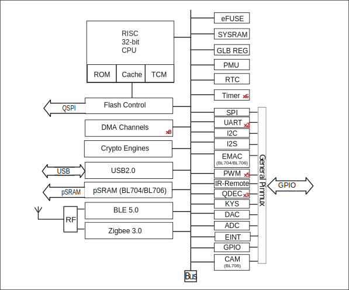

========================
Functional Description
========================
BL702/BL704/BL706 main functions described as follows：

   System Architecture

CPU
=====
BL702/BL704/BL706 32-bit RISC CPU contains FPU (floating-point unit) for 32-bit single-precision arithmetic, three-stage pipelined (IF, EXE, WB), compressed 16 and 32-bit instruction set, standard JTAG debugger port including 4 hardware-programmable breakpoints, interrupt controller including 64 interrupts and 16 interrupt levels/priorities for low latency interrupt processing. Up to 144MHz clock frequency, can be dynamically configured to change clock frequency, enter the power saving mode to achieve low power consumption.

Both zigbee/BLE stack and application run on single 32-bit RISC CPU for simple and ultra-low power applications. CPU performance ~1.46 DMIPS/MHz. ~3.1 CoreMark/MHz.

Cache
=============
BL702/BL704/BL706 cache improves CPU performance to access external memory. Cache memories can be partially or fully configured as TCM (tightly coupled memory).

Memory
=============
BL702/BL704/BL706 memories include: on-chip zero-delay SRAM memories, read-only memories, write-once memories, embedded flash memory (optional), embedded pSRAM (BL704/BL706,optional).

DMA
==========
BL702/BL704/BL706 DMA (direct memory access) controller has eight dedicated channels that manage data transfer between peripherals and memories to improve cpu/bus efficiency. 

There are four main types of transfers including memory to memory, memory to peripheral, peripheral to peripheral and peripheral to memory. DMA also supports LLI (link list item) that multiple transfers are pre-defined by a series of linked lists, then hardware automatically complete all transfers according to each LLI size and address. DMA supports peripheral USB, UART, I2C, I2S, SPI, ADC and DAC.

Bus
=========
BL702/BL704/BL706 bus fabric connection and memory-map summarized as follows：

.. table:: Bus Connection

    +----------------+------------+-----------+--------+---------------+---------+
    |  Slave/ Master |  CPU       | Ethernet  | DMA    |Crypto Engine  | Debug   |
    +================+============+===========+========+===============+=========+
    | SRAM           | V          | V         | V      |      V        | V       |
    +----------------+------------+-----------+--------+---------------+---------+
    | Peripheral     | V          | \-        | V      |      \-       | V       |
    +----------------+------------+-----------+--------+---------------+---------+
    | BLE/zigbee     | V          | \-        | V      |      \-       | V       |
    +----------------+------------+-----------+--------+---------------+---------+

.. table:: Memory Map

    +--------+------------+-------+--------------------------------------------------+
    |Module  |Base Address| Size  |    Description                                   |
    +========+============+=======+==================================================+
    | RETRAM | 0x40010000 | 4KB   | Deep sleep memory (Retention RAM)                |
    +--------+------------+-------+--------------------------------------------------+
    | HBN    | 0x4000F000 | 4KB   | Deep sleep control (Hibernate)                   |
    +--------+------------+-------+--------------------------------------------------+
    | PDS    | 0x4000E000 | 4KB   | Sleep control (Power Down Sleep)                 |
    +--------+------------+-------+--------------------------------------------------+
    | USB    | 0x4000D800 | 1KB   | USB control                                      |
    +--------+------------+-------+--------------------------------------------------+
    | EMAC   | 0x4000D000 | 2KB   | Ethernet MAC control (BL704/BL706)               |
    +--------+------------+-------+--------------------------------------------------+
    | DMA    | 0x4000C000 | 4KB   | DMA control                                      |
    +--------+------------+-------+--------------------------------------------------+
    | QSPI   | 0x4000B000 | 4KB   | Flash/pSRAM QSPI control                         |
    +--------+------------+-------+--------------------------------------------------+
    | CAM    | 0x4000AD00 | 256B  | CAM control (BL706)                              |
    +--------+------------+-------+--------------------------------------------------+
    | I2S    | 0x4000AA00 | 256B  | I2S control                                      |
    +--------+------------+-------+--------------------------------------------------+
    | KYS    | 0x4000A900 | 256B  | Key-Scan control                                 |
    +--------+------------+-------+--------------------------------------------------+
    | QDEC2  | 0x4000A880 | 64B   | Quadrature decoder control                       |
    +--------+------------+-------+--------------------------------------------------+
    | QDEC1  | 0x4000A840 | 64B   | Quadrature decoder control                       |
    +--------+------------+-------+--------------------------------------------------+
    | QDEC0  | 0x4000A800 | 64B   | Quadrature decoder control                       |
    +--------+------------+-------+--------------------------------------------------+
    | IRR    | 0x4000A600 | 256B  | IR Remote control                                |
    +--------+------------+-------+--------------------------------------------------+
    | TIMER  | 0x4000A500 | 256B  | Timer control                                    |
    +--------+------------+-------+--------------------------------------------------+
    | PWM    | 0x4000A400 | 256B  | Pulse Width Modulation \* 5 control              |
    +--------+------------+-------+--------------------------------------------------+
    | I2C    | 0x4000A300 | 256B  | I2C control                                      |
    +--------+------------+-------+--------------------------------------------------+
    | SPI    | 0x4000A200 | 256B  | SPI master/slave control                         |
    +--------+------------+-------+--------------------------------------------------+
    | UART1  | 0x4000A100 | 256B  | UART control (support ISO 17987)                 |
    +--------+------------+-------+--------------------------------------------------+
    | UART0  | 0x4000A000 | 256B  | UART control (support ISO 17987)                 |
    +--------+------------+-------+--------------------------------------------------+
    | L1C    | 0x40009000 | 4KB   | Cache control                                    |
    +--------+------------+-------+--------------------------------------------------+
    | eFuse  | 0x40007000 | 4KB   | eFuse memory control                             |
    +--------+------------+-------+--------------------------------------------------+
    | SEC    | 0x40004000 | 4KB   | Security engine                                  |
    +--------+------------+-------+--------------------------------------------------+
    | GPIP   | 0x40002000 | 4KB   | General purpose DAC/ADC/ACOMP interface control  |
    +--------+------------+-------+--------------------------------------------------+
    | MIX    | 0x40001000 | 4KB   | Mixed signal register                            |
    +--------+------------+-------+--------------------------------------------------+
    | GLB    | 0x40000000 | 4KB   | Global control register                          |
    +--------+------------+-------+--------------------------------------------------+
    | pSRAM  | 0x24000000 | 8MB   | pSRAM memory                                     |
    +--------+------------+-------+--------------------------------------------------+
    | XIP    | 0x23000000 | 8MB   | XIP Flash memory                                 |
    +--------+------------+-------+--------------------------------------------------+
    | OCRAM  | 0x22020000 | 64KB  | On-chip memory                                   |
    +--------+------------+-------+--------------------------------------------------+
    | DTCM   | 0x22014000 | 48KB  | Data cache memory                                |
    +--------+------------+-------+--------------------------------------------------+
    | ITCM   | 0x22010000 | 16KB  | Instruction cache memory                         |
    +--------+------------+-------+--------------------------------------------------+
    | ROM    | 0x21000000 | 192KB | Read-only memory                                 |
    +--------+------------+-------+--------------------------------------------------+

Interrupt
===========
BL702/BL704/BL706 supports internal RTC wake-up and external GPIO interrupts wake-up.

The CPU interrupt controller supports a total of 64 maskable interrupt trigger sources including UART interrupt, I2C interrupt, SPI interrupt, timer interrupt, DMA interrupt, etc. All I/O pins can be configured as external interrupt input mode. The external interrupt supports four trigger types: high level trigger, low level trigger, rising edge trigger and falling edge trigger.

Boot
=========
BL702/BL704/BL706 supports multiple boot options: UART, USB, and Flash.

Power
=============
PMU (power management unit) manages the power of the entire chip and is divided into running, idle, sleep, hibernation and power off modes. The software can be configured to enter sleep mode and wake-up via RTC timer or EINT to achieve low-power sleep and accurate wake-up management.

Power down sleep modes are flexible for applications to configure as the lowest power consumption.

Clock
=========
Clock control unit generates clocks to the core MCU and the peripheral SOC devices. The root clock source can be XTAL, PLL or RC oscillator. Dynamic power-saved by proper configurations such as sel, div, en, etc. PMU runs at 32KHz clock to keep system low-power in sleep mode.

.. figure:: ../../picture/clocktree.svg
   :align: center

   Clock Architecture

Peripherals
=============
Peripherals include USB2.0, Ethernet, IR-remote, SPI, UART, ISO 17987, I2C, I2S, PWM, QDEC, KeyScan, ADC, DAC, PIR, Camera.

Each peripheral can be assigned to different groups of GPIOs through flexible configurations. Each GPIO can be used as a general-purpose input and output function.

GPIO
---------
The BL702 has 15 GPIOs, the BL704 has 23 GPIOs, and the BL706 has 31 GPIOs with the following features:

- Each GPIO can be used as general purpose input and output function, pull-up/pull-down/float can be configured by software
- Each GPIO supports interrupt function, the interrupt supports rising edge trigger, falling edge trigger, high level trigger and low level trigger
- Each GPIO can be set to high impedance state for low power mode

UART
---------
The chip has two built-in UARTs (UART0 and UART1) with the following features:

- Support LIN master/slave function
- The working clock can be selected as FCLK or 96MHz, and the maximum baud rate supports 8M
- Supports CTS and RTS signal management for hardware
- TX and RX have independent FIFO, FIFO depth is 128 bytes, support DMA function

SPI
---------
The chip has a built-in SPI, which can be configured in master mode or slave mode. The clock of the SPI module is BCLK, which has the following characteristics:

- As master, clock frequency up to 36MHz
- As a slave, the maximum clock frequency of the master is allowed to be 24MHz
- The bit width of each frame can be configured as 8bit/16bit/24bit/32bit
- The transceiver of SPI has an independent FIFO, and the FIFO depth is fixed to 4 frames (that is, if the bit width of the frame is 8 bits, the depth of the FIFO is 4 bytes)
- Support DMA transfer mode

I2C
---------
The chip has a built-in I2C interface with the following features:

- Support host mode and 7bit addressing
- The working clock is BCLK
- With device address register, register address register, register address length can be configured as 1 byte/2 bytes/3 bytes/4 bytes
- I2C transceiver has independent FIFO, FIFO depth is 2 words
- Support DMA function

I2S
---------
The chip has a built-in I2S interface with the following features:

- Support Left-justified/ Right-justified/ DSP and other data formats, the data width can be configured as 8/16/24/32 bits
- In addition to mono/dual-channel mode, supports quad-channel mode at the same time
- I2S transceiver has an independent FIFO with a FIFO depth of 16 frames; when the data width is 16 bits, the FIFO depth can be set to 32 frames
- The I2S module has an independent Audio PLL that supports 48K (and its integer division) and 44.1K (and its integer division) sample rates

TIMER
------------
The chip has two built-in general-purpose timers and a watchdog timer with the following features:

- The clock source of the general timer can be selected from FCLK/32K/1K/XTAL
- The clock source of the watchdog timer can be selected from FCLK/32K/XTAL
- 8-bit divider for each counter
- Each group of general-purpose timers includes three compare registers, supports compare interrupts, and supports FreeRun mode and PreLoad mode in counting mode
- 16-bit watchdog timer, supports two watchdog overflow methods: interrupt or reset

PWM
---------
The chip has five built-in PWM signals with the following characteristics:

- Three clock sources BCLK/XCLK/32K
- Frequency divider register and period register are 16-bit wide
- Each channel PWM supports adjustable output polarity, dual threshold setting, increasing the flexibility of pulse output
- Support PWM cycle count interrupt for counting the number of output pulses

IR (IR-remote)
------------------
The chip has a built-in infrared remote control with the following features:

- Support both sending and receiving modes
- Supports receiving data with fixed protocols NEC, RC-5, and receiving data in any format with pulse width counting
- The clock source is XCLK, which has a powerful infrared waveform editing capability, which can send waveforms conforming to various protocols, and the transmit power can be adjusted in 15 steps
- Receive FIFO depth of 64 bytes

USB2.0(Full Speed)
--------------------
The chip embeds a full-speed USB compatible device controller with the following features:

- Compliant with full-speed USB device standards
- Has 8 endpoints, each with a 64-byte deep FIFO
- All endpoints except endpoint 0 support interrupt/bulk/isochronous transfers
- With standby/resume function
- USB dedicated 48MHz clock directly generated by internal main PLL

EMAC
--------------------
The EMAC module is an IEEE 802.3 compliant 10/100Mbps Ethernet controller with the following features:

- Compatible with MAC layer functions defined by IEEE 802.3
- PHY that supports RMII interface defined by IEEE 802.3, interacts with PHY through MDIO
- Supports 10Mbps and 100Mbps Ethernet
- Support half-duplex and full-duplex, data transmission and reception are realized through Buffer Descriptor data structure, EMAC control embedded AHB Master, can directly read or write data from memory
- The Buffer Descriptor data structure is stored in the internal RAM of the EMAC. The total number of Buffer Descriptors is up to 128. Users can flexibly configure the number of Buffer Descriptors to send and receive according to the scene

The EMAC timing diagram is shown below:

.. figure:: ../../picture/EMACTiming.svg
   :align: center

   EMAC Timing Diagram

.. table:: Timing conditions for using RX Clock

    +-----------------+--------------------+--------+--------+---------------------+--------+----------------------------------+
    | Set the corresponding bit of register clk_cfg3:cfg_inv_eth_rx_clk = 1,cfg_inv_eth_tx_clk = 0,cfg_sel_eth_ref_clk_o = 0   |
    +-----------------+--------------------+--------+--------+---------------------+--------+----------------------------------+
    | Timing parameters(1.8V, Load = 20PF) | Min.   | Typ    |  Max.               | Unit   | Note                             |
    +=================+====================+========+========+=====================+========+==================================+
    | T\ :sub:`cyc`\  |Clock Cycle         | \-     | 20     | \-                  | ns     | Clock From ETH PHY               |
    +-----------------+--------------------+--------+--------+---------------------+--------+----------------------------------+
    | T\ :sub:`vld`\  |Output Valid Delay  | 7.38   | \-     | 16.3                | ns     | TXD/TX_EN                        |
    +-----------------+--------------------+--------+--------+---------------------+--------+----------------------------------+
    | T\ :sub:`su`\   |Input Setup Time    | 10     | \-     | \-                  | ns     | RXD/RX_DV/RXERR                  |
    +-----------------+--------------------+--------+--------+---------------------+--------+----------------------------------+
    | T\ :sub:`h`\    |Input Hold Time     | 0      | \-     | \-                  | ns     | RXD/RX_DV/RXERR                  |
    +-----------------+--------------------+--------+--------+---------------------+--------+----------------------------------+

.. table:: Timing conditions without using RX Clock

    +-----------------+--------------------+--------+--------+---------------------+--------+----------------------------------+
    | Set the corresponding bit of register clk_cfg3:cfg_inv_eth_rx_clk = 0,cfg_inv_eth_tx_clk = 0,cfg_sel_eth_ref_clk_o = 0   |
    +-----------------+--------------------+--------+--------+---------------------+--------+----------------------------------+
    | Timing parameters(1.8V, Load = 20PF) | Min.   | Typ    |  Max.               | Unit   | Note                             |
    +=================+====================+========+========+=====================+========+==================================+
    | T\ :sub:`cyc`\  |Clock Cycle         | \-     | 20     | \-                  | ns     | Clock From ETH PHY               |
    +-----------------+--------------------+--------+--------+---------------------+--------+----------------------------------+
    | T\ :sub:`vld`\  |Output Valid Delay  | 7.38   | \-     | 16.3                | ns     | TXD/TX_EN                        |
    +-----------------+--------------------+--------+--------+---------------------+--------+----------------------------------+
    | T\ :sub:`su`\   |Input Setup Time    | 2      | \-     | \-                  | ns     | RXD/RX_DV/RXERR                  |
    +-----------------+--------------------+--------+--------+---------------------+--------+----------------------------------+
    | T\ :sub:`h`\    |Input Hold Time     | 3      | \-     | \-                  | ns     | RXD/RX_DV/RXERR                  |
    +-----------------+--------------------+--------+--------+---------------------+--------+----------------------------------+

QDEC
--------------------

The chip has built-in three sets of quadrature decoders, which are used to decode the two sets of pulses with a phase difference of 90 degrees generated by the two-way rotary encoder into the corresponding speed and rotation.
direction, with the following properties:

- The clock source can be selected from 32K (f32k_clk) or 32M (xclk)
- With 16-bit pulse count range (-32768~32767 pulse/sample)
- Has 12 configurable sample periods (32us~131ms per sample at 1MHz)
- 16-bit configurable report period (0~65535 sample/report)

ADC
--------------------

The chip has a built-in 12bits successive approximation analog-to-digital converter (ADC) with the following features:

- The maximum operating clock is 2MHz, supports 12 external analog inputs and several internal analog signal selections, supports single-channel conversion and multi-channel scanning modes
- Support 2.0V, 3.2V optional internal reference voltage, the conversion result is 12/14/16bits (through oversampling) left-justified mode
- Has a FIFO with a depth of 32, supports multiple interrupts, and supports DMA functions
- ADC can be used to measure supply voltage in addition to ordinary analog signal measurement
- Can be used for temperature detection by measuring internal/external diode voltage

DAC
--------------------

The chip has a built-in 10bits digital-to-analog converter (DAC) with the following features:

- FIFO depth is 1, supports 2-channel DAC modulation output
- Can be used for audio playback, conventional analog signal modulation
- The working clock can be selected as 32M or Audio PLL
- Supports DMA transfer of memory to DAC modulation registers
- The output pin is fixed as ChannelA is GPIO11, ChannelB is GPIO17

debug interface
--------------------

It supports standard JTAG 4-wire debugging interface, and supports debugging with debuggers such as Jlink/OpenOCD/CK Link.

