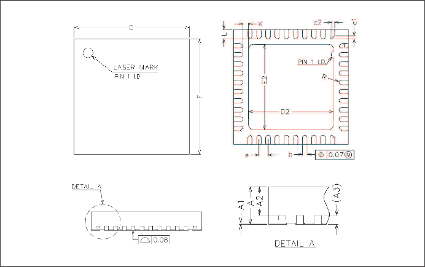

=============================
Package Information(QFN40)
=============================

   QFN40 Package drawing

.. table:: QFN40 Size Description

    +--------+------------+---------+--------+
    | SYMBOL | UNIT OF MEASURE = MILLIMETER  |
    +        +------------+---------+--------+
    |        |  MIN       | NOM     | MAX    |
    +========+============+=========+========+
    | A      | 0.80       | 0.85    | 0.90   |
    +--------+------------+---------+--------+
    | A1     | 0          | 0.02    | 0.05   |
    +--------+------------+---------+--------+
    |A2      | 0.60       | 0.65    | 0.70   |
    +--------+------------+---------+--------+
    |A3      |      0.20REF                  |
    +--------+------------+---------+--------+
    | b      | 0.15       | 0.20    | 0.25   |
    +--------+------------+---------+--------+
    | D      | 4.90       | 5.00    | 5.10   |
    +--------+------------+---------+--------+
    | E      | 4.90       | 5.00    | 5.10   |
    +--------+------------+---------+--------+
    | D2     | 3.60       | 3.70    | 3.80   |
    +--------+------------+---------+--------+
    | E2     | 3.60       | 3.70    | 3.80   |
    +--------+------------+---------+--------+
    | e      | 0.35       | 0.40    | 0.45   |
    +--------+------------+---------+--------+
    | K      | 0.20       | \-      | \-     |
    +--------+------------+---------+--------+
    | L      | 0.35       | 0.40    | 0.45   |
    +--------+------------+---------+--------+
    | R      | 0.075      | \-      | \-     |
    +--------+------------+---------+--------+
    | C1     | \-         | 0.12    | \-     |
    +--------+------------+---------+--------+
    | C2     | \-         | 0.12    | \-     |
    +--------+------------+---------+--------+