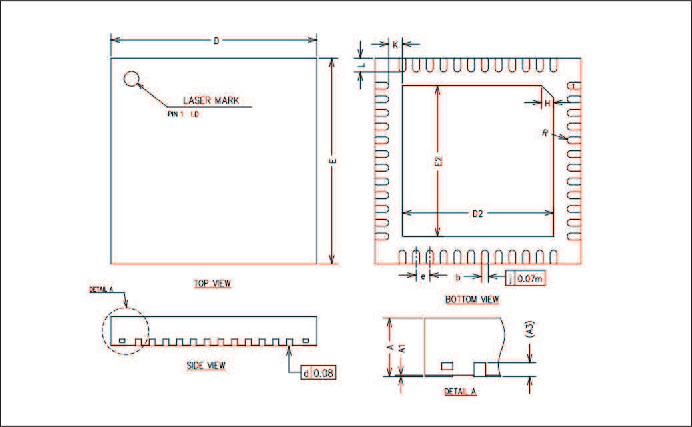

============================
Package Information(QFN48)
============================

   QFN48 Package drawing

.. table:: QFN48 Size Description

    +--------+------------+---------+--------+
    | SYMBOL | UNIT OF MEASURE = MILLIMETER  |
    +        +------------+---------+--------+
    |        |  MIN       | NOM     | MAX    |
    +========+============+=========+========+
    | A      | 0.80       | 0.85    | 0.90   |
    +--------+------------+---------+--------+
    | A1     | 0          | 0.02    | 0.05   |
    +--------+------------+---------+--------+
    |A3      |      0.20REF                  |
    +--------+------------+---------+--------+
    | b      | 0.15       | 0.20    | 0.25   |
    +--------+------------+---------+--------+
    | D      | 5.90       | 6.00    | 6.10   |
    +--------+------------+---------+--------+
    | E      | 5.90       | 6.00    | 6.10   |
    +--------+------------+---------+--------+
    | D2     | 4.30       | 4.40    | 4.50   |
    +--------+------------+---------+--------+
    | E2     | 4.30       | 4.40    | 4.50   |
    +--------+------------+---------+--------+
    | e      | 0.30       | 0.40    | 0.50   |
    +--------+------------+---------+--------+
    | H      |      0.35REF                  |
    +--------+------------+---------+--------+
    | K      | 0.30       | 0.40    | 0.50   |
    +--------+------------+---------+--------+
    | L      | 0.30       | 0.40    | 0.50   |
    +--------+------------+---------+--------+
    | R      | 0.075      | \-      | \-     |
    +--------+------------+---------+--------+

