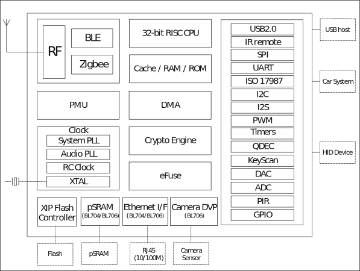

=====
概述
=====

BL702/BL704/BL706是用于物联网应用的高度集成的BLE和zigbee组合芯片组。

无线子系统包含2.4G无线电，BLE + zigbee基带和MAC设计。微控制器子系统包含32位RISC CPU，高速缓存和内存。 电源管理单元控制超低功耗模式。 此外，还支持各种安全功能。

外围接口包括USB2.0，Ethernet(BL704/BL706)，IR-remote，SPI，UART，ISO 17987，I2C，I2S，PWM，QDEC，KeyScan，ADC，DAC，PIR，Camera(BL706)和GPIO。

   功能框图

