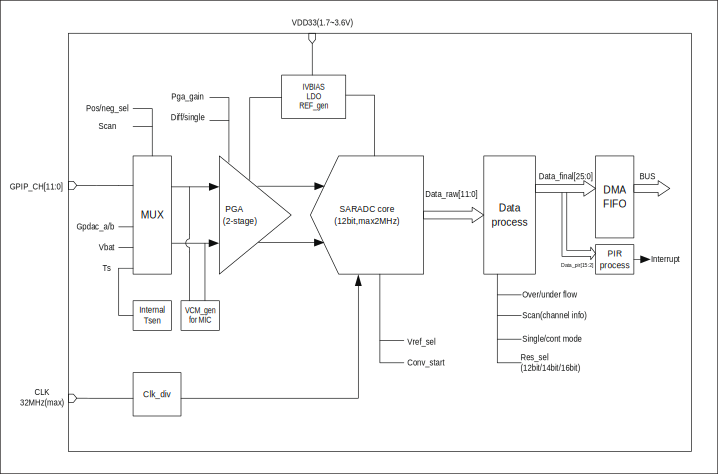

===========
ADC
===========

ADC introduction
===================
The chip contains a 12-bit successive approximation analog-to-digital 
converter (ADC), which supports 12 external analog inputs and several 
internal analog signal selections.

ADC supports the following four modes: single-shot single-channel conversion, continuous single-channel conversion, single-shot multi-channel conversion, and continuous multi-channel conversion mode. 
The conversion result is 12/14/16bits left-justified mode.
The ADC has a depth of 32 FIFOs and supports multiple interrupts 
and DMA operations. In addition to ordinary analog signal measurement, 
the ADC can also be used to measure the supply voltage. In addition, 
the ADC can also be used for temperature detection by measuring the 
internal/external diode voltage. 

ADC main features
===================

- High performance

    + 12/14/16bits conversion result output
    + ADC maximum working clock is 2MHZ 
    + 2.0V,3.2V optional reference voltage
    + DMA support
    + Supports four modes: single-shot single-channel conversion, continuous single-channel conversion, single-shot multi-channel conversion, and continuous multi-channel conversion mode
    + Two input modes: single-ended and differential
    + Support jitter compensation
    + User can set conversion result offset value

- Analog channels

    * 12 external analog channels
    * 2 DAC internal channels
    * 1 VBAT / 2 channel
    * 1 TSEN channel

ADC functional description
===========================

The basic block diagram of the ADC is shown below.

   ADC block diagram

The ADC consists of five parts: front-end input channel selector, 
program-controlled amplifier, ADC sampling module, data processing 
module, and FIFO.

The input channel selector is used to select the channel to be sampled. 
It contains both external analog signals and internal analog signals. 
The program-controlled amplifier is used to further process the input 
signal. It can be set according to the characteristics of the input 
signal, such as DC and AC. In order to get more accurate conversion 
values.

The ADC sampling module is the most important function module. 
It obtains the conversion from analog signals to digital signals 
through successive comparisons. The conversion result is 12bit. 
The data processing module is responsible for further processing 
the conversion results, including adding channel information. 
The resulting data is pushed into the FIFO.

ADC pins and internal signals
--------------------------------

.. table:: ADC internal signals

    +------------------+-------------+----------------------------------------------+
    | internal signals | Signal type |        Description                           |
    +==================+=============+==============================================+
    |   VBAT/2         |   Input     | Voltage signal divided from the power pin    |
    +------------------+-------------+----------------------------------------------+
    |   TSEN           |   Input     | Internal temperature sensor output voltage   |
    +------------------+-------------+----------------------------------------------+
    |   VREF           |   Input     | Internal analog module reference voltage     |
    +------------------+-------------+----------------------------------------------+
    | DACOUTA          |   Input     | DAC module output                            |
    +------------------+-------------+----------------------------------------------+
    | DACOUTB          |   Input     | DAC module output                            |
    +------------------+-------------+----------------------------------------------+

.. table:: ADC external pins

    +---------------+-------------+----------------------------------------------------------------+
    | external pins | Signal type |        Description                                             |
    +===============+=============+================================================================+
    |   VDDA        |    Input    | Analog power supply and positive reference voltage for the ADC |
    +---------------+-------------+----------------------------------------------------------------+
    |   VSSA        |     Input   | Ground for analog power supply                                 |
    +---------------+-------------+----------------------------------------------------------------+
    | ADC_CHX       |   Input     |  12 analog input channels                                      |
    +---------------+-------------+----------------------------------------------------------------+

ADC channel
-------------
The channels that can be selected by the ADC include the input signals of external 
analog pins and the optional signals inside the chip:

- ADC CH0
- ADC CH1
- ADC CH2
- ADC CH3
- ADC CH4
- ADC CH5
- ADC CH6
- ADC CH7
- ADC CH8
- ADC CH9
- ADC CH10
- ADC CH11
- VSSA
- DAC OUTA
- DAC OUTB
- VBAT/2
- TSEN
- VREF
- GND

It should be noted that if VBAT/2 or TSEN is selected as the input signal to be 
acquired, gpadc_vbat_en or gpadc_ts_en needs to be set.

The ADC module can support single-ended input or differential input. 
If it is single-ended input mode, the negative input channel needs to select GND.

ADC clock
-------------

The working clock source of the ADC module is shown in the following figure:

.. figure:: ../../picture/ADCClock.svg
   :align: center
   
   ADC Clock

The ADC clock source can select Audio PLL，XCLK or f32k.The clock source selection is set in the GLB module.While selecting, the clock source can be divided by the frequency divider.

In general voltage measurement applications, users can choose XCLK as the clock source. In audio applications, users can use AUPLL to generate common sampling clocks such as 8KHZ and 44.1KHZ. f32k is a low-frequency clock, which provides a wake-up clock when the MCU sleeps.

Inside the ADC module, a clock divider is provided, which can divide the input clock by 1/4/8/12/16/20/24/32. Users can adjust the ADC clock source and various frequency division coefficients according to actual sampling requirements. Note that the maximum input clock of ADC is 2MHZ.

The width of the gpadc_32m_clk_div divider register is 6bits, the maximum divider is 64, and the divider formula is fout=fsource/(gpadc_32m_clk_div+1).

The gpadc_clk_div_ratio divider register is located inside the ADC module, with a width of 3bits, and its divider value is defined as follows:

.. code-block:: c

    ADC_CLK_DIV_1,                          /*!< ADC clock:on 32M clock is 32M */
    ADC_CLK_DIV_4,                          /*!< ADC clock:on 32M clock is 8M */
    ADC_CLK_DIV_8,                          /*!< ADC clock:on 32M clock is 4M */
    ADC_CLK_DIV_12,                         /*!< ADC clock:on 32M clock is 2.666M */
    ADC_CLK_DIV_16,                         /*!< ADC clock:on 32M clock is 2M */
    ADC_CLK_DIV_20,                         /*!< ADC clock:on 32M clock is 1.6M */
    ADC_CLK_DIV_24,                         /*!< ADC clock:on 32M clock is 1.333M */
    ADC_CLK_DIV_32,                         /*!< ADC clock:on 32M clock is 1M */

If the user wants to adjust the ADC input clock, there are four ways.

1. Switch the clock source, XTAL defaults to 32MHZ, Audio PLL (can be configured to 11.288MHZ or 11.2896MHZ).

2. Use a frequency divider with a length of 6BITS in the clock module.

3. Using the frequency divider in the ADC module, the optional frequency division is 1/4/8/12/16/20/24/32.

4. By configuring the gpadc_res_sel register, change the value of OSR to achieve the frequency effect. If OSR=256, the actual equivalent ADC input clock is divided by 256.

Assuming that the clock source selection is Audio PLL=11.2896MHZ, the GLB frequency division selection configuration is 1, the ADC internal frequency divider is selected ADC_CLK_DIV_4, OSR=128,
then the final clock output is fout = 11289600 / (1 + 1) / 4/128 = 11025HZ

ADC conversion mode
----------------------
The ADC supports two conversion modes: single-channel conversion mode and scan mode.

In single-channel conversion mode, the user needs to select the positive 
input channel through gpadc_pos_sel, select the negative input channel 
through gpadc_neg_sel, and set the gpadc_cont_conv_en control bit to 0, 
which means single-channel conversion, and then set the gpadc_conv_start 
control bit to start the conversion.

In scan conversion mode, the gpadc_cont_conv_en control bit needs to be 
set to 1, and the number of conversion channels set by the ADC according 
to the gpadc_scan_length control bit. According to the channel order set 
by the gpadc_reg_scn_posX (X = 1, 2) and gpadc_reg_scn_negX (X = 1, 2) 
registers, the conversion is performed one by one, and the result of the 
conversion is automatically pushed into the ADC FIFO. The channels set by 
the gpadc_reg_scn_posX (X = 1, 2) and gpadc_reg_scn_negX (X = 1, 2) 
registers can be the same, which means that users can implement multiple 
sampling conversions on a channel.

ADC conversion results are generally placed in the FIFO. 
The ADC module does not provide conversion completion interrupts. 
Users need to set the FIFO receive data threshold interrupt based 
on the actual number of conversion channels. The FIFO threshold 
interrupt is used as the ADC conversion completion interrupt.

ADC consequence
-----------------
The gpadc_raw_data register stores the raw result of the ADC. 
In single-ended mode, the data valid bit is 12bits, unsigned bit. 
In differential mode, the highest bit is the sign bit.
The remaining 11bits represent the result of the conversion.

The gpadc_data_out register stores the ADC result. 
This result contains the ADC result, sign bit and channel information. 
The data format is as follows:

.. table:: ADC conversion result format

    +---------+----+-----+-----+-----+----+-----+-----+-----+----+----+--+--+--+--+--+--+--+--+--+--+--+--+--+--+--+--+
    | BitS    | 25 | 24  | 23  | 22  | 21 | 20  | 19  | 18  | 17 | 16 |15|14|13|12|11|10|9 | 8| 7| 6| 5| 4| 3| 2| 1| 0|
    +=========+====+=====+=====+=====+====+=====+=====+=====+====+====+==+==+==+==+==+==+==+==+==+==+==+==+==+==+==+==+
    | meaning |  Positive channel number  |  Negative channel number  |           Conversion result                   |
    +---------+----+-----+-----+-----+----+-----+-----+-----+----+----+--+--+--+--+--+--+--+--+--+--+--+--+--+--+--+--+

bit21-bit25 of the conversion result is the positive channel number, 
bit16-bit20 is the negative channel number, and bit0-bit15 is the 
converted value.

The gpadc_res_sel control bit can set the number of bits of the 
conversion result, which are 12 bits, 14 bits, and 16 bits, 
respectively. Among them, 14 bits and 16 bits are the results 
obtained by multiple sampling to improve the accuracy.

The values that can be set are as follows:

- 3'b000    12bit 2MS/s, OSR=1 
- 3'b001    14bit 125kS/s, OSR=16
- 3'b010    14bit 31.25kS/s, OSR=64 
- 3'b011    16bit 15.625KS/s, OSR=128
- 3'b100    16bit 7.8125KS/s, OSR=256

The ADC conversion result is left-justified. 
When 12 bits are selected, bit15-bit4 of the conversion result is 
valid. When 14 bits are selected, bit15-bit2 of the conversion result 
is valid. When 16 bits are selected, bit15-bit0 of the conversion 
result is valid.

Similarly, in the differential mode, the highest is the sign, that is, 
when 14 bits are selected, bit15 is the sign bit, bit14-bit2 is the 
conversion result, and bit14 is the MSB.

In single-ended mode, there is no sign bit, that is, when 12 bits 
are selected, bit15-bit4 is the conversion result and bit15 is the MSB.

In actual use, the results of the ADC are generally placed in the 
FIFO, which is particularly important in the multi-channel scan mode. 
Therefore, users generally obtain conversion results from the ADC FIFO. The data format of the ADC FIFO is the same in the gpadc_data_out register.

ADC interrupt
---------------
The ADC module can generate interrupts when the positive sampling 
is saturated and the negative sampling is saturated. The respective 
interrupts can be masked by gpadc_pos_satur_mask, gpadc_neg_satur_mask. 

When the interrupt is generated, the interrupt status can be queried 
by the gpadc_pos_satur, and gpadc_neg_satur registers, and the 
interrupt can be cleared by gpadc_pos_satur_clr and gpadc_neg_satur_clr.
This function can be used to determine whether the input voltage 
is abnormal.

ADC FIFO
-------------

The ADC module has a FIFO with a depth of 32 and a data width of 26Bits.
After the ADC completes the conversion, it will automatically push 
the result into the FIFO. The ADC's FIFO has the following status 
and interrupt management functions:

- FIFO Overrun interrupt
- FIFO Underrun interrupt
- FIFO threshold interrupt

When the FIFO is full, but the user does not read the value through DMA or direct access to the register, and data enters the FIFO again, the module will generate a FIFO Overrun interrupt at this time.

When the FIFO is empty, but the user still requests data from the FIFO, the module will generate a FIFO Underrun interrupt at this time.

The user can configure the FIFO threshold register gpadc_fifo_thl, select the threshold for FIFO to generate interrupts, and choose 1, 4, 8, and 16. If the number of ADC FIFOs reaches the set threshold, a threshold interrupt will be generated.

When an interrupt occurs, the interrupt flag can be cleared by 
the corresponding clear bit.

Using the ADC's FIFO, users can implement three modes of data 
acquisition: query mode, interrupt mode, and DMA mode.

**Query mode**

The CPU polls the length of the ADC FIFO. When the length of the FIFO is not empty, it indicates that there are valid data in the FIFO, and the CPU can read these data from the FIFO.

**Interrupt mode**

Using the threshold interrupt of the FIFO, when the interrupt is generated and the number of ADC data reaches the threshold, the CPU can read the length of the ADC FIFO in the interrupt service function and read it all.

**DMA mode**

The user sets the dmaen control bit, which can cooperate with the DMA to complete the transfer of the converted data to the memory. When using the DMA mode, set the threshold of the number of data sent by the ADC FIFO through the fifothl. When the DMA receives the request, it will automatically follow the user settings. The specified parameters transfer the specified number of results from the FIFO to the corresponding memory.

ADC configuration process
----------------------------

**Setting the ADC clock**

According to the ADC conversion speed requirements, determine the 
working clock of the ADC, set the ADC clock source and frequency 
division of the GLB module, and combine with clkdvrt 
to determine the final working module's clock frequency.

**Set GPIO according to the channel used**

According to the analog pin used, determine the channel number 
used, initialize the corresponding GPIO as an analog function. 
It should be noted that when setting the GPIO as an analog input, 
do not set the GPIO pull-up or pull-down, you need to set it to 
float.

**Set the channel to be converted**

Set the corresponding channel register according to the analog 
channel and conversion mode used. 

For single-channel conversion, set the converted channel 
information in the possel and negsel registers.

For multi-channel scanning mode, set sclen, 
scpX and scnX according to the 
number of scanning channels and scanning order.

**Set the data reading method**

According to the way of reading data introduced by ADC FIFO, 
select the mode to use and set the corresponding register. 
If you use DMA, you also need to configure a channel of DMA 
to cooperate with the ADC FIFO to complete the data transfer.

**Start conversion**

Finally set ressel to select the precision of the data 
conversion result. Finally set gben = 1 and 
cvst = 1 to start the ADC to start conversion.

When the conversion is complete and needs to be converted again, 
cvst needs to be set to 0 and then set to 1 in order 
to trigger the conversion again.

VBAT measurement
------------------
The VBAT/2 measurement is the voltage of the chip VDD33, 
not the voltage of an external battery such as a lithium battery. 
If you need to measure the voltage of a power supply head such as 
a lithium battery, you can divide the voltage and then input it 
to the ADC's GPIO analog channel. Measuring the voltage of VDD33 
can reduce the use of GPIO.

The VBAT/2 voltage measured by the ADC module is after a 
partial pressure.The actual input voltage to the ADC module is 
half of VDD33, that is, VBAT/2 = VDD33/2. Because the voltage 
is divided, in order to obtain higher accuracy, it is recommended 
that the reference voltage of the ADC is 2V, single-ended mode 
is used, the positive input voltage is VBAT/2, the negative 
input voltage is GND, and vbaten is set to 1 to start. 

After conversion, multiply the corresponding conversion result 
by 2 to get the VDD33 voltage.

TSEN measurement
------------------
The ADC can measure the internal diode or external diode voltage 
value, and the voltage difference between the diode and 
temperature is related, so by measuring the voltage of the 
diode, the ambient temperature can be calculated. We call it 
Temperature Sensor, referred to as TSEN.

The test principle of TSEN is to generate a fitted curve by 
measuring the voltage difference ΔV generated by two different 
currents on a diode with temperature.

Regardless of the measurement of the external or internal diode, the final 
output value is related to temperature, which can be expressed 
as Δ(ADC_out) = 7.753T + X. When we know the voltage value, 
we also know the temperature T. Here X is an offset value that 
can be used as a standard value. Before actual use, we need to 
determine X. The chip manufacturer will measure Δ(ADC_out) at 
a standard temperature, such as 25 degrees at room temperature, 
before the chip leaves the factory to get X.

When the user uses it, as long as the formula 
T = [Δ(ADC_out) -X]/7.753, the temperature T can be obtained.

When using TSEN, it is recommended to set the ADC to 16Bits mode, 
reduce the error by multiple sampling, and select 2V as the 
reference voltage to improve accuracy. Set tsen to 1 to 
enable the TSEN function. If the internal diode is selected, 
tsxten = 0. External diode, tsxten = 1, 
select the forward input channel according to the actual 
situation. 

If it is an internal diode, select the TSEN channel. 
If it is external, select the corresponding analog GPIO channel. 
Select the negative input terminal as GND. After the above 
settings are completed, set tsdc = 0 to start the 
measurement and get the measurement result V0, then set 
tsdc = 1 to start the measurement and get the 
measurement result V1, Δ(ADC_out) = V1-V0, according to the 
formula T = [Δ(ADC_out) -X] /7.753 to obtain the temperature T.

.. only:: html

   .. include:: adc_register.rst

.. raw:: latex

   \input{../../en/content/adc}