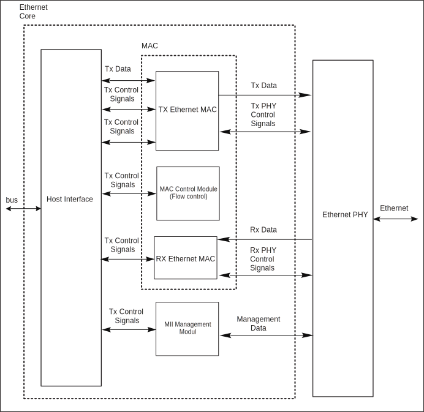

===========
Emac
===========

Emac introduction
=====================
The EMAC module is a 10/100Mbps Ethernet MAC (Ethernet Media Access Controller) compatible with IEEE 802.3.
It includes status and control register group, transceiver module, transceiver buffer descriptor group, host interface, MDIO, physical layer chip (PHY) interface.

The status and control register group contains the status bits and control bits of the EMAC, which is the interface with the user program, and is responsible for controlling data receiving and sending and reporting the status.

The transceiver module is responsible for obtaining the data frame from the designated memory location according to the control word in the transceiver descriptor, adding the preamble, CRC, and expanding the short frame before sending it out through the PHY;
Or receive data from the PHY, and put the data into the designated memory according to the transmit and receive buffer descriptor. Configure related event flags after sending and receiving. If the event interrupt is enabled, the interrupt request will be sent to the host for processing.

The MDIO and MII/RMII interfaces are responsible for communicating with the PHY, including reading and writing PHY registers and sending and receiving data packets.

Emac main features
====================
- Compatible with the MAC layer functions defined by IEEE 802.3
- Support MII and RMII interface PHY defined by IEEE 802.3
- Interaction with PHY through MDIO
- Support 10Mbps and 100Mbps Ethernet
- Support half duplex and full duplex
- In full duplex mode, support automatic flow control and control frame generation
- Support collision detection and retransmission in half-duplex mode
- Support CRC generation and verification
- Data frame preamble generation and removal
- When sending, automatically expand short data frames
- Detect too long or too short data frame (length limit)
- Can transmit long data frames (> standard Ethernet frame length)
- Automatically discard packets that exceed the number of retransmissions or the frame gap is too small
- Broadcast packet filtering
- Internal RAM for storing up to 128 BD (Buffer Descriptor)
- Various event flags sent/received
- Generate a corresponding interrupt when an event occurs

Emac function description
==============================
The composition of the EMAC module is shown in the figure below.

   EMAC architecture

The module's control register can read and write the PHY register through MDIO to realize configuration, select mode (half/full duplex), initiate negotiation and other operations.

The receiving module filters and checks the received data frame: whether there is a legal preamble, FCS, length, etc. And according to the descriptor, the data frame is stored in the designated buffer address.

The sending module obtains data from the memory according to the data buffer descriptor, adds preamble, FCS, pad, etc., and then sends the data according to the CSMA/CD protocol.

If CRS is detected, the retry will be delayed.

The send and receive buffer descriptor group is connected to the external RAM, which is used to store the Ethernet data frames sent and received. Each descriptor contains the corresponding control status word and the corresponding buffer memory address. There are 128 groups of descriptors, which can be flexibly allocated for sending or receiving.

Emac clock
============
The EMAC module needs a clock for synchronous transmission and reception (at 100Mbps, 25MHz (MII) or 50MHz (RMII); at 10Mbps, 2.5MHz).
This clock must be synchronized between EMAC and PHY.

Send and receive buffer descriptor (BD, Buffer Descriptor)
=============================================================
The transceiver buffer descriptor is used to provide the association between the EAMC and the data frame buffer address information, to control the transceiver data frame, and to provide the transceiver status prompt.

Each descriptor is composed of two consecutive words (32 bits). The low address word provides the length, control and status bits of the data frame contained in the buffer; the high address word is a memory pointer.

Specific BD description can refer to the register description chapter.

Note that: For BD, you need to write in word.

The EMAC module supports 128 BDs, which are shared by the sending/receiving logic and can be freely combined. But the sending BD always occupies the previous continuous area (the number is specified by the TXBDNUM field in the MAC_TX_BD_NUM register).

EMAC processes the sending/receiving BD in the order of BD, until it encounters the BD marked as WR, it wraps around to send/receive the respective first BD.

PHY interaction
=====================
The PHY interaction register group provides the commands and data communication methods needed for PHY interaction. EMAC controls the working mode of PHY through MDIO and ensures that the two match (rate, full/half duplex).

The data packet interacts between EMAC and PHY through the MII/RMII interface, and can be selected by RMII_EN in the EMAC mode register (EMAC_MODE). When this bit is 1, select RMII mode, otherwise it is MII mode.

Both MII and RMII modes support the 10Mbps and 100Mbps transmission rates specified in the IEEE 802.3u standard.

The transmission signal description of MII and RMII is shown in the table below.

.. table:: Transmission signal 

   +----------------------+----------------------------------+-----------------------------------+
   | Name                 | MII                              | RMII                              |
   +======================+==================================+===================================+
   | EXTCK_EREFCK         | ETXCK: send clock signal         | EREFCK: reference clock           |
   +----------------------+----------------------------------+-----------------------------------+
   | ECRS                 | ECRS: carrier detection          | \-                                |
   +----------------------+----------------------------------+-----------------------------------+
   | ECOL                 | ECOL: collision detection        | \-                                |
   +----------------------+----------------------------------+-----------------------------------+
   | ERXDV                | ERXDV: data valid                | ECRSDV: Carrier detect/data valid |
   +----------------------+----------------------------------+-----------------------------------+
   | ERX0-ERX3            | ERX0-ERX3: 4-bit receive data    | ERX0-ERX1: 2-bit receive data     |
   +----------------------+----------------------------------+-----------------------------------+
   | ERXER                | ERXER: Receive error indication  | ERXER: Receive error indication   |
   +----------------------+----------------------------------+-----------------------------------+
   | ERXCK                | ERXCK: Receive clock signal      | \-                                |
   +----------------------+----------------------------------+-----------------------------------+
   | ETXEN                | ETXEN: transmit enable           | ETXEN: transmit enable            |
   +----------------------+----------------------------------+-----------------------------------+
   | ETX0-ETX3            | ETX0-ETX3: 4-bit transmit data   | ETX0-ETX1: 2-bit transmit data    |
   +----------------------+----------------------------------+-----------------------------------+
   | ETXER                | ETXER: Send error indication     | \-                                |
   +----------------------+----------------------------------+-----------------------------------+
   | EMDC                 | MDIO Clock                       | MDIO Clock                        |
   +----------------------+----------------------------------+-----------------------------------+
   | EMDIO                | MDIO Data Input Output           | MDIO Data Input Output            |
   +----------------------+----------------------------------+-----------------------------------+

The RMII interface has fewer pins, and a 2-bit data line is used for receiving and sending. At a rate of 100Mbps, a 50MHz reference clock is required.

Programming process
========================

PHY initialization
--------------------
- According to the PHY type, set the RMII_EN bit in the EMAC_MODE register to select the appropriate connection method
- Set the MAC address of EMAC to EMAC_MAC_ADDR0 and EMAC_MAC_ADDR1
- Set the appropriate clock for the MDIO part by programming the field CLKDIV in the EMAC_MIIMODE register
- Set the corresponding PHY address to the FIAD field of the register EMAC_MIIADDRESS
- According to the PHY manual, send commands through the EMAC_MIICOMMAND and EMAC_MIITX_DATA registers
- The data read from the PHY will be stored in the EMAC_MIIRX_DATA register
- The status of interaction with PHY commands can be queried through the EMAC_MIISTATUS register

After the basic interaction is completed, the PHY should enter the auto-negotiation state. After the negotiation is completed, program the mode to the FULLD bit in the EMAC_MODE register according to the negotiation result.

Send data frame
------------------
- Configure bit fields such as data frame format and interval in the EMAC_MODE register
- By configuring the TXBDNUM field in the EMAC_TX_BD_NUM register to specify the number of BDs used for transmission, the remaining BDs are RX BDs
- Prepare the data frame to be sent in the memory
- Fill in the address of the data frame into the data pointer field (word 1) corresponding to the sent BD
- Clear the status flag in the control and status field (wrod 0) corresponding to the sent BD, and set the control field (CRC enable, PAD enable, interrupt enable, etc.)
- Write the length of the data frame and set the RD field to inform EMAC that this BD data needs to be sent; if necessary, set the IRQ bit to enable interrupts
- In particular, if it is the last BD sent, the WR bit needs to be set, and EMAC will "wrap around" to the first sent BD for processing after processing this BD
- If there are multiple BDs to be sent, repeat the steps of setting BD to fill all sending BDs
- If you need to enable the transmit interrupt, you also need to configure the TX related bits in the EMAC_INT_MASK register
- Configure the TXEN bit in the EMAC_MODE register to enable transmission
- If the interrupt is enabled, in the interrupt sent, the current BD can be obtained through the TXBDNUM field in the EMAC_TX_BD_NUM register
- Perform corresponding processing according to the current BD status word
- For the BD whose data has been sent, the RD bit in the control field will be cleared by hardware and will not be sent again; after filling in new data, set RD, and this BD can be used for sending again

Receive data frame
--------------------
- Configure bit fields such as data frame format and interval in the EMAC_MODE register
- By configuring the TXBDNUM field in the EMAC_TX_BD_NUM register to specify the number of BDs used for transmission, the remaining BDs are RX BDs
- The area in the memory that is ready to receive data
- Fill in the address of the data frame into the data pointer field (word 1) corresponding to the received BD
- Clear the status flag in the control and status field (wrod 0) corresponding to the sending BD, and set the control field (interrupt enable, etc.)
- Write the receivable data frame length and set the E bit field to inform EMAC that the BD is idle and can be used for data reception; if necessary, set the IRQ bit to enable interrupts
- In particular, if it is the last valid receiving BD, the WR bit needs to be set, and EMAC will "wrap around" to the first receiving BD for processing after processing this BD
- If there are multiple BDs available to receive data, repeat the steps of setting BD to fill all BDs
- If you need to enable the receive interrupt, you also need to configure the RX related bits in the EMAC_INT_MASK register
- Configure the RXEN bit in the EMAC_MODE register to enable reception
- If the interrupt is enabled, in the received interrupt, the current BD can be obtained through the RXBDNUM field in the EMAC_TX_BD_NUM register
- Perform corresponding processing according to the current BD status word
- For the received BD, the E bit in the control field will be cleared by hardware and will not be used for receiving again; the data needs to be taken away, and E is set, this BD can be used for receiving again

.. only:: html

   .. include:: emac_register.rst

.. raw:: latex

   \input{../../en/content/emac}