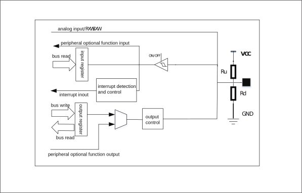

===========
GLB
===========

Introduction
==============
GLB (Global Register) is a chip general global setting module, which mainly includes functions such as clock management, reset management, bus management, memory management, and GPIO management.

Function description
=======================
Clock management
-----------------
The clock management function is mainly used to set the clock of the processor, bus, and various peripherals. Through this module, you can set the clock source and clock frequency division of the above-mentioned module. At the same time, it can also realize the gating of the above-mentioned module clock. To achieve the purpose of low power consumption of the system.

For detailed settings, please refer to the chapters on reset and clock.

Reset management
------------------
Provide individual reset function and chip reset function of each peripheral module. Chip reset includes:

- CPU reset: just reset the CPU module, the program will run again, and the peripherals will not be reset

- System reset: All peripherals and CPU will be reset, but related registers in the AON domain will not be reset

- Power-on reset: the entire system including the related registers of the AON domain will be reset

The application can choose to use the corresponding reset method as needed.

.. table:: Software reset function table 

    +--------+-------------------------------+----------------+------------------------+--------------------+-------------+
    | BL702  | RST_PIN/HBN/WDT/POWER ON      | SW.Reset       | CPU/PDS/SYS            | PDS/CPU            | PDS         |
    +========+===============================+================+========================+====================+=============+
    | CPU    | ✔                             |                |                        | ✔                  |             |
    +--------+-------------------------------+----------------+------------------------+--------------------+-------------+
    | bus    | ✔                             |                | ✔                      |                    |             |
    +--------+-------------------------------+----------------+------------------------+--------------------+-------------+
    | glb    | ✔                             | swrst_s1[0]    |                        |                    |             |
    +--------+-------------------------------+----------------+------------------------+--------------------+-------------+
    | gpip   | ✔                             | swrst_s1[2]    | ✔                      |                    |             |
    +--------+-------------------------------+----------------+------------------------+--------------------+-------------+
    | l1c    | ✔                             | swrst_s1[9]    | ✔                      | ✔                  |             |
    +--------+-------------------------------+----------------+------------------------+--------------------+-------------+
    | dma    | ✔                             | swrst_s1[12]   | ✔                      |                    |             | 
    +--------+-------------------------------+----------------+------------------------+--------------------+-------------+
    | emac   | ✔                             | swrst_s1[13]   | ✔                      |                    |             |
    +--------+-------------------------------+----------------+------------------------+--------------------+-------------+
    | usb    | ✔                             | swrst_s1a[12]  | ✔                      |                    | ✔           |
    +--------+-------------------------------+----------------+------------------------+--------------------+-------------+
    | pds    |                               | swrst_s1[14]   |                        |                    |             |
    +--------+-------------------------------+----------------+------------------------+--------------------+-------------+
    | uart0  | ✔                             | swrst_s1a[0]   | ✔                      |                    |             |
    +--------+-------------------------------+----------------+------------------------+--------------------+-------------+
    | uart1  | ✔                             | swrst_s1a[1]   | ✔                      |                    |             |
    +--------+-------------------------------+----------------+------------------------+--------------------+-------------+
    | spi    | ✔                             | swrst_s1a[2]   | ✔                      |                    |             |
    +--------+-------------------------------+----------------+------------------------+--------------------+-------------+
    | I2C    | ✔                             | swrst_s1a[3]   | ✔                      |                    |             |
    +--------+-------------------------------+----------------+------------------------+--------------------+-------------+
    | pwm    | ✔                             | swrst_s1a[4]   | ✔                      |                    |             |
    +--------+-------------------------------+----------------+------------------------+--------------------+-------------+
    | timer  | ✔                             | swrst_s1a[5]   | ✔                      |                    |             |
    +--------+-------------------------------+----------------+------------------------+--------------------+-------------+
    | irr    | ✔                             | swrst_s1a[6]   | ✔                      |                    |             |
    +--------+-------------------------------+----------------+------------------------+--------------------+-------------+
    | qdec0  | ✔                             | swrst_s1a[8]   | ✔                      |                    |             |
    +--------+-------------------------------+----------------+------------------------+--------------------+-------------+
    | qdec1  | ✔                             | swrst_s1a[8]   | ✔                      |                    |             |
    +--------+-------------------------------+----------------+------------------------+--------------------+-------------+
    | qdec2  | ✔                             | swrst_s1a[8]   | ✔                      |                    |             |
    +--------+-------------------------------+----------------+------------------------+--------------------+-------------+
    | kys    | ✔                             | swrst_s1a[9]   | ✔                      |                    |             |
    +--------+-------------------------------+----------------+------------------------+--------------------+-------------+
    | i2s    | ✔                             | swrst_s1a[10]  | ✔                      |                    |             |
    +--------+-------------------------------+----------------+------------------------+--------------------+-------------+

Bus management
----------------
Provide bus arbitration settings and bus error settings, you can set whether to generate an interrupt when a bus error occurs, and provide error bus address information to facilitate user debugging.

Memory management
------------------
Provides power management of each memory module in the chip system low power mode, including two setting modes:

- Retention mode: In this mode, the data on the memory can be saved, but it cannot be read or written before exiting the low-power mode

- Sleep mode: In this mode, the data in the memory will be lost and it is only used to reduce system power consumption

GPIO overview
---------------
The GPIO management function provides GPIO control registers to implement software configuration of GPIO properties, enabling users to conveniently operate GPIO. Each GPIO can be configured as software GPIO or other multiplexing functions. Under each function, three port states are provided: pull-up, pull-down, and floating (must be set to floating when configured as an analog function). In addition, GPIO also provides interrupt function, which can be configured as rising edge trigger, falling edge trigger, high level trigger or low level trigger. Each GPIO can have two sets of interrupt configurations, and the two sets of interrupt configurations can take effect at the same time. For example, if the INT0 of GPIO0 is configured as a rising edge trigger and INT1 is configured as a falling edge trigger, the final effect is that both edges of GPIO will trigger interrupts.

GPIO main features
------------------------

- Can be configured as software GPIO function
- It can be configured as other multiplexed functions and used with peripheral functions. When configured as analog functions, it must be set to floating
- You can set the input or output mode and set it as pull-up, pull-down or floating
- The drive capacity can be set to provide greater output current
- Schmitt trigger function can be set to provide simple hardware anti-shake function

GPIO function description
----------------------------
Each GPIO can be configured by software as:

- Multiple functions: I2S, SPI, I2C, UART, PWM, USB, SWGPIO... up to 24 functions
- InputEnable/OutputEnable: input, output, high impedance (ie=0, oe=0)
- PullUp/PullDown: pull up, pull down, float (pu=0, pd=0)
- drive strength: four gears of 0, 1, 2, and 3. The larger the value, the stronger the drive ability
- smt trigger: smt enable, smt disable, to prevent jitter near the trigger threshold

When the GPIO multiplexing function is configured as SWGPIO input, you can also configure the interrupt trigger mode for it, and each GPIO can have two interrupt modes, and both interrupt modes can be effective separately/simultaneously:

- Interrupt mode 1: rising edge trigger, falling edge trigger, high level trigger, low level trigger
- Interrupt mode 2: rising edge trigger, falling edge trigger, high level trigger, low level trigger

The basic block diagram of the GPIO module is shown in the figure.

   Basic block diagram of GPIO

GPIO function setting
-----------------------

The function of GPIO is set through the GPIO_CFGCTL register group. The main setting items include:

- func_sel: select GPIO function
- pu: Choose whether to pull up
- pd: Choose whether to drop down
- drv: set drive capability
- smt: Choose whether to enable Schmitt trigger
- ie: set input enable
- oe: set output enable

The functions that GPIO can be set include:

- Flash/QSPI: Set GPIO as QSPI function, which can be connected to Flash as a program storage/running medium
- SPI: Set GPIO as SPI function
- I2C: Set GPIO as I2C function
- UART: Set GPIO as UART function
- PWM: set GPIO as PWM function
- ANA: Set GPIO as Analog function
- SWGPIO: set GPIO as general IO function
- JTAG: Set GPIO as JTAG function
- Other multiplexing functions

In order to meet customer needs as much as possible, each GPIO can basically select the above optional functions. When an optional function is selected, GPIO and the corresponding function signal are shown in the following table:

.. table:: GPIO function table 1 TB_SIZE_TINY

    +--------+------------+-----------------+---------------------+-------------------------+------------+-----------+------------+
    | GPIO   |  CLK_OUT   |   Flash_PSRAM   |         I2S         |           SPI0          |    I2C     |  UART     |    PWM     |
    +========+============+=================+=====================+=========================+============+===========+============+
    | GPIO0  | clk_out[0] |                 | I2S0_BCLK           |  SPI_0_MOSI             |  I2C0_SCL  | UART_SIG0 |   PWM[0]   |
    +--------+------------+-----------------+---------------------+-------------------------+------------+-----------+------------+
    | GPIO1  | clk_out[1] |                 | I2S0_FS             |  SPI_0_MISO             |  I2C0_SDA  | UART_SIG1 |   PWM[1]   |
    +--------+------------+-----------------+---------------------+-------------------------+------------+-----------+------------+
    | GPIO2  | clk_out[0] |                 | I2S0_DIO/I2S0_DO    |  SPI_0_SS               |  I2C0_SCL  | UART_SIG2 |   PWM[2]   |
    +--------+------------+-----------------+---------------------+-------------------------+------------+-----------+------------+
    | GPIO3  | clk_out[1] |                 | I2S0_RCLK_O/I2S0_DI |  SPI_0_SCLK             |  I2C0_SDA  | UART_SIG3 |   PWM[3]   |
    +--------+------------+-----------------+---------------------+-------------------------+------------+-----------+------------+
    | GPIO4  | clk_out[0] |                 | I2S0_BCLK           |  SPI_0_MOSI             |  I2C0_SCL  | UART_SIG4 |   PWM[4]   |
    +--------+------------+-----------------+---------------------+-------------------------+------------+-----------+------------+
    | GPIO5  | clk_out[1] |                 | I2S0_FS             |  SPI_0_MISO             |  I2C0_SDA  | UART_SIG5 |   PWM[0]   |
    +--------+------------+-----------------+---------------------+-------------------------+------------+-----------+------------+
    | GPIO6  | clk_out[0] |                 | I2S0_DIO/I2S0_DO    |  SPI_0_SS               |  I2C0_SCL  | UART_SIG6 |   PWM[1]   |
    +--------+------------+-----------------+---------------------+-------------------------+------------+-----------+------------+
    | GPIO7  | clk_out[1] |                 | I2S0_RCLK_O/I2S0_DI |  SPI_0_SCLK             |  I2C0_SDA  | UART_SIG7 |   PWM[2]   |
    +--------+------------+-----------------+---------------------+-------------------------+------------+-----------+------------+
    | GPIO8  | clk_out[0] |                 | I2S0_BCLK           |  SPI_0_MOSI             |  I2C0_SCL  | UART_SIG0 |   PWM[3]   |
    +--------+------------+-----------------+---------------------+-------------------------+------------+-----------+------------+
    | GPIO9  | clk_out[1] |                 | I2S0_FS             |  SPI_0_MISO             |  I2C0_SDA  | UART_SIG1 |   PWM[4]   |
    +--------+------------+-----------------+---------------------+-------------------------+------------+-----------+------------+
    | GPIO10 | clk_out[0] |                 | I2S0_DIO/I2S0_DO    |  SPI_0_SS               |  I2C0_SCL  | UART_SIG2 |   PWM[0]   |
    +--------+------------+-----------------+---------------------+-------------------------+------------+-----------+------------+
    | GPIO11 | clk_out[1] |                 | I2S0_RCLK_O/I2S0_DI |  SPI_0_SCLK             |  I2C0_SDA  | UART_SIG3 |   PWM[1]   |
    +--------+------------+-----------------+---------------------+-------------------------+------------+-----------+------------+
    | GPIO12 | clk_out[0] |                 | I2S0_BCLK           |  SPI_0_MOSI             |  I2C0_SCL  | UART_SIG4 |   PWM[2]   |
    +--------+------------+-----------------+---------------------+-------------------------+------------+-----------+------------+
    | GPIO13 | clk_out[1] |                 | I2S0_FS             |  SPI_0_MISO             |  I2C0_SDA  | UART_SIG5 |   PWM[3]   |
    +--------+------------+-----------------+---------------------+-------------------------+------------+-----------+------------+
    | GPIO14 | clk_out[0] |                 | I2S0_DIO/I2S0_DO    |  SPI_0_SS               |  I2C0_SCL  | UART_SIG6 |   PWM[4]   |
    +--------+------------+-----------------+---------------------+-------------------------+------------+-----------+------------+
    | GPIO15 | clk_out[1] |                 | I2S0_RCLK_O/I2S0_DI |  SPI_0_SCLK             |  I2C0_SDA  | UART_SIG7 |   PWM[0]   |
    +--------+------------+-----------------+---------------------+-------------------------+------------+-----------+------------+
    | GPIO16 | clk_out[0] |                 | I2S0_BCLK           |  SPI_0_MOSI             |  I2C0_SCL  | UART_SIG0 |   PWM[1]   |
    +--------+------------+-----------------+---------------------+-------------------------+------------+-----------+------------+
    | GPIO17 | clk_out[1] | SF_IO_0/SF2_CS2 | I2S0_FS             |  SPI_0_MISO             |  I2C0_SDA  | UART_SIG1 |   PWM[2]   |
    +--------+------------+-----------------+---------------------+-------------------------+------------+-----------+------------+
    | GPIO18 | clk_out[0] | SF_IO_1         | I2S0_DIO/I2S0_DO    |  SPI_0_SS               |  I2C0_SCL  | UART_SIG2 |   PWM[3]   |
    +--------+------------+-----------------+---------------------+-------------------------+------------+-----------+------------+
    | GPIO19 | clk_out[1] | SF_CS           | I2S0_RCLK_O/I2S0_DI |  SPI_0_SCLK             |  I2C0_SDA  | UART_SIG3 |   PWM[4]   |
    +--------+------------+-----------------+---------------------+-------------------------+------------+-----------+------------+
    | GPIO20 | clk_out[0] | SF_IO_3         | I2S0_BCLK           |  SPI_0_MOSI             |  I2C0_SCL  | UART_SIG4 |   PWM[0]   |
    +--------+------------+-----------------+---------------------+-------------------------+------------+-----------+------------+
    | GPIO21 | clk_out[1] | SF_CLK          | I2S0_FS             |  SPI_0_MISO             |  I2C0_SDA  | UART_SIG5 |   PWM[1]   |
    +--------+------------+-----------------+---------------------+-------------------------+------------+-----------+------------+
    | GPIO22 | clk_out[0] | SF_IO_2         | I2S0_DIO/I2S0_DO    |  SPI_0_SS               |  I2C0_SCL  | UART_SIG6 |   PWM[2]   |
    +--------+------------+-----------------+---------------------+-------------------------+------------+-----------+------------+
    | GPIO23 | clk_out[1] | SF2_IO_2        | I2S0_RCLK_O/I2S0_DI |  SPI_0_SCLK             |  I2C0_SDA  | UART_SIG7 |   PWM[3]   |
    +--------+------------+-----------------+---------------------+-------------------------+------------+-----------+------------+
    | GPIO24 | clk_out[0] | SF2_IO_1        | I2S0_BCLK           |  SPI_0_MOSI             |  I2C0_SCL  | UART_SIG0 |   PWM[4]   |
    +--------+------------+-----------------+---------------------+-------------------------+------------+-----------+------------+
    | GPIO25 | clk_out[1] | SF2_CS          | I2S0_FS             |  SPI_0_MISO             |  I2C0_SDA  | UART_SIG1 |   PWM[0]   |
    +--------+------------+-----------------+---------------------+-------------------------+------------+-----------+------------+
    | GPIO26 | clk_out[0] | SF2_IO_3        | I2S0_DIO/I2S0_DO    |  SPI_0_SS               |  I2C0_SCL  | UART_SIG2 |   PWM[1]   |
    +--------+------------+-----------------+---------------------+-------------------------+------------+-----------+------------+
    | GPIO27 | clk_out[1] | SF2_CLK         | I2S0_RCLK_O/I2S0_DI |  SPI_0_SCLK             |  I2C0_SDA  | UART_SIG3 |   PWM[2]   |
    +--------+------------+-----------------+---------------------+-------------------------+------------+-----------+------------+
    | GPIO28 | clk_out[0] | SF2_IO_0        | I2S0_BCLK           |  SPI_0_MOSI             |  I2C0_SCL  | UART_SIG4 |   PWM[3]   |
    +--------+------------+-----------------+---------------------+-------------------------+------------+-----------+------------+
    | GPIO29 | clk_out[1] |                 | I2S0_FS             |  SPI_0_MISO             |  I2C0_SDA  | UART_SIG5 |   PWM[4]   |
    +--------+------------+-----------------+---------------------+-------------------------+------------+-----------+------------+
    | GPIO30 | clk_out[0] |                 | I2S0_DIO/I2S0_DO    |  SPI_0_SS               |  I2C0_SCL  | UART_SIG6 |   PWM[0]   |
    +--------+------------+-----------------+---------------------+-------------------------+------------+-----------+------------+
    | GPIO31 | clk_out[1] |                 | I2S0_RCLK_O/I2S0_DI |  SPI_0_SCLK             |  I2C0_SDA  | UART_SIG7 |   PWM[1]   |
    +--------+------------+-----------------+---------------------+-------------------------+------------+-----------+------------+

..    +--------+------------+------------------------------------+--------------+-----------------+-------------+-----------+
    | GPIO   |    CAM     |              Analog                |    SWGPIO    |      JTAG       |  Ether_Mac  |    QDEC   |
    +--------+------------+------------------------------------+--------------+-----------------+-------------+-----------+
    | GPIO0  | PIX_CLK    |                                    | REG_GPIO[0]  | E21_TMS/E21_TCK | MII_REF_CLK | qdec0_a   |
    +--------+------------+------------------------------------+--------------+-----------------+-------------+-----------+
    | GPIO1  | FRAME_VLD  |                                    | REG_GPIO[1]  | E21_TDI/E21_TDO | MII_TXD[0]  | qdec0_b   |
    +--------+------------+------------------------------------+--------------+-----------------+-------------+-----------+
    | GPIO2  | LINE_VLD   |                                    | REG_GPIO[2]  | E21_TCK/E21_TMS | MII_TXD[1]  | qdec0_led |
    +--------+------------+------------------------------------+--------------+-----------------+-------------+-----------+
    | GPIO3  | PIX_DAT0   |                                    | REG_GPIO[3]  | E21_TDO/E21_TDI |             | qdec1_a   |
    +--------+------------+------------------------------------+--------------+-----------------+-------------+-----------+
    | GPIO4  | PIX_DAT1   |                                    | REG_GPIO[4]  | E21_TMS/E21_TCK |             | qdec1_b   |
    +--------+------------+------------------------------------+--------------+-----------------+-------------+-----------+
    | GPIO5  | PIX_DAT2   |                                    | REG_GPIO[5]  | E21_TDI/E21_TDO |             | qdec1_led |
    +--------+------------+------------------------------------+--------------+-----------------+-------------+-----------+
    | GPIO6  | PIX_DAT3   |                                    | REG_GPIO[6]  | E21_TCK/E21_TMS |             | qdec2_a   |
    +--------+------------+------------------------------------+--------------+-----------------+-------------+-----------+
    | GPIO7  |            | USB_DP/gpip_ch[6]/gpdac_vref_ext   | REG_GPIO[7]  | E21_TDO/E21_TDI | MII_RXD[0]  | qdec2_b   |
    +--------+------------+------------------------------------+--------------+-----------------+-------------+-----------+
    | GPIO8  |            | USB_DM/gpip_ch[0]                  | REG_GPIO[8]  | E21_TMS/E21_TCK | MII_RXD[1]  | qdec2_led |
    +--------+------------+------------------------------------+--------------+-----------------+-------------+-----------+
    | GPIO9  |            | pmip_dc_tp/clkpll_dc_tp/gpip_ch[7] | REG_GPIO[9]  | E21_TDI/E21_TDO |             | qdec0_a   |
    +--------+------------+------------------------------------+--------------+-----------------+-------------+-----------+
    | GPIO10 |            | MICBIAS                            | REG_GPIO[10] | E21_TCK/E21_TMS |             | qdec0_b   |
    +--------+------------+------------------------------------+--------------+-----------------+-------------+-----------+
    | GPIO11 |            | gpip_ch[3]                         | REG_GPIO[11] | E21_TDO/E21_TDI |             | qdec0_led |
    +--------+------------+------------------------------------+--------------+-----------------+-------------+-----------+
    | GPIO12 | PIX_DAT4   | gpip_ch[4]                         | REG_GPIO[12] | E21_TMS/E21_TCK |             | qdec1_a   |
    +--------+------------+------------------------------------+--------------+-----------------+-------------+-----------+
    | GPIO13 |            |                                    | REG_GPIO[13] | E21_TDI/E21_TDO |             | qdec1_b   |
    +--------+------------+------------------------------------+--------------+-----------------+-------------+-----------+
    | GPIO14 |            | gpip_ch[5]/atest_out_0             | REG_GPIO[14] | E21_TCK/E21_TMS |             | qdec1_led |
    +--------+------------+------------------------------------+--------------+-----------------+-------------+-----------+
    | GPIO15 |            | gpip_ch[1]/atest_out_1             | REG_GPIO[15] | E21_TDO/E21_TDI |             | qdec2_a   |
    +--------+------------+------------------------------------+--------------+-----------------+-------------+-----------+
    | GPIO16 |            |                                    | REG_GPIO[16] | E21_TMS/E21_TCK |             | qdec2_b   |
    +--------+------------+------------------------------------+--------------+-----------------+-------------+-----------+
    | GPIO17 | PIX_DAT4   | gpip_ch[2]/psw_irrcv               | REG_GPIO[17] | E21_TDI/E21_TDO |             | qdec2_led |
    +--------+------------+------------------------------------+--------------+-----------------+-------------+-----------+
    | GPIO18 | PIX_DAT5   | gpip_ch[8]                         | REG_GPIO[18] | E21_TCK/E21_TMS | RMII_MDC    | qdec0_a   |
    +--------+------------+------------------------------------+--------------+-----------------+-------------+-----------+
    | GPIO19 | PIX_DAT6   | gpip_ch[9]                         | REG_GPIO[19] | E21_TDO/E21_TDI | RMII_MDIO   | qdec0_b   |
    +--------+------------+------------------------------------+--------------+-----------------+-------------+-----------+
    | GPIO20 | PIX_DAT7   | gpip_ch[10]                        | REG_GPIO[20] | E21_TMS/E21_TCK | RMII_RXERR  | qdec0_led |
    +--------+------------+------------------------------------+--------------+-----------------+-------------+-----------+
    | GPIO21 |            | gpip_ch[11]                        | REG_GPIO[21] | E21_TDI/E21_TDO | RMII_TX_EN  | qdec1_a   |
    +--------+------------+------------------------------------+--------------+-----------------+-------------+-----------+
    | GPIO22 |            | leddrv[0]                          | REG_GPIO[22] | E21_TCK/E21_TMS | RMII_RX_DV  | qdec1_b   |
    +--------+------------+------------------------------------+--------------+-----------------+-------------+-----------+
    | GPIO23 | PIX_DAT4   | leddrv[1]/flash_pull_out[0]        | REG_GPIO[23] | E21_TDO/E21_TDI |             | qdec1_led |
    +--------+------------+------------------------------------+--------------+-----------------+-------------+-----------+
    | GPIO24 | PIX_DAT5   | flash_pull_out[1]                  | REG_GPIO[24] | E21_TMS/E21_TCK | RMII_MDC    | qdec2_a   |
    +--------+------------+------------------------------------+--------------+-----------------+-------------+-----------+
    | GPIO25 | PIX_DAT6   | flash_pull_out[2]                  | REG_GPIO[25] | E21_TDI/E21_TDO | RMII_MDIO   | qdec2_b   |
    +--------+------------+------------------------------------+--------------+-----------------+-------------+-----------+
    | GPIO26 | PIX_DAT7   | flash_pull_out[3]                  | REG_GPIO[26] | E21_TCK/E21_TMS | RMII_RXERR  | qdec2_led |
    +--------+------------+------------------------------------+--------------+-----------------+-------------+-----------+
    | GPIO27 |            | flash_pull_out[4]                  | REG_GPIO[27] | E21_TDO/E21_TDI | RMII_TX_EN  | qdec0_a   |
    +--------+------------+------------------------------------+--------------+-----------------+-------------+-----------+
    | GPIO28 | PIX_DAT4   | flash_pull_out[5]                  | REG_GPIO[28] | E21_TMS/E21_TCK | RMII_RX_DV  | qdec0_b   |
    +--------+------------+------------------------------------+--------------+-----------------+-------------+-----------+
    | GPIO29 | PIX_DAT5   |                                    | REG_GPIO[29] | E21_TDI/E21_TDO |             | qdec0_led |
    +--------+------------+------------------------------------+--------------+-----------------+-------------+-----------+
    | GPIO30 | PIX_DAT6   |                                    | REG_GPIO[30] | E21_TCK/E21_TMS |             | qdec1_a   |
    +--------+------------+------------------------------------+--------------+-----------------+-------------+-----------+
    | GPIO31 | PIX_DAT7   |                                    | REG_GPIO[31] | E21_TDO/E21_TDI |             | qdec1_b   |
    +--------+------------+------------------------------------+--------------+-----------------+-------------+-----------+

.. table:: GPIO function table 2

    +--------+------------------------------------+--------------+-----------------+-------------+-----------+
    | GPIO   |              Analog                |    SWGPIO    |      JTAG       |  Ether_Mac  |    QDEC   |
    +========+====================================+==============+=================+=============+===========+
    | GPIO0  |                                    | REG_GPIO[0]  | E21_TMS/E21_TCK | MII_REF_CLK | qdec0_a   |
    +--------+------------------------------------+--------------+-----------------+-------------+-----------+
    | GPIO1  |                                    | REG_GPIO[1]  | E21_TDI/E21_TDO | MII_TXD[0]  | qdec0_b   |
    +--------+------------------------------------+--------------+-----------------+-------------+-----------+
    | GPIO2  |                                    | REG_GPIO[2]  | E21_TCK/E21_TMS | MII_TXD[1]  | qdec0_led |
    +--------+------------------------------------+--------------+-----------------+-------------+-----------+
    | GPIO3  |                                    | REG_GPIO[3]  | E21_TDO/E21_TDI |             | qdec1_a   |
    +--------+------------------------------------+--------------+-----------------+-------------+-----------+
    | GPIO4  |                                    | REG_GPIO[4]  | E21_TMS/E21_TCK |             | qdec1_b   |
    +--------+------------------------------------+--------------+-----------------+-------------+-----------+
    | GPIO5  |                                    | REG_GPIO[5]  | E21_TDI/E21_TDO |             | qdec1_led |
    +--------+------------------------------------+--------------+-----------------+-------------+-----------+
    | GPIO6  |                                    | REG_GPIO[6]  | E21_TCK/E21_TMS |             | qdec2_a   |
    +--------+------------------------------------+--------------+-----------------+-------------+-----------+
    | GPIO7  | USB_DP/gpip_ch[6]/gpdac_vref_ext   | REG_GPIO[7]  | E21_TDO/E21_TDI | MII_RXD[0]  | qdec2_b   |
    +--------+------------------------------------+--------------+-----------------+-------------+-----------+
    | GPIO8  | USB_DM/gpip_ch[0]                  | REG_GPIO[8]  | E21_TMS/E21_TCK | MII_RXD[1]  | qdec2_led |
    +--------+------------------------------------+--------------+-----------------+-------------+-----------+
    | GPIO9  | pmip_dc_tp/clkpll_dc_tp/gpip_ch[7] | REG_GPIO[9]  | E21_TDI/E21_TDO |             | qdec0_a   |
    +--------+------------------------------------+--------------+-----------------+-------------+-----------+
    | GPIO10 | MICBIAS                            | REG_GPIO[10] | E21_TCK/E21_TMS |             | qdec0_b   |
    +--------+------------------------------------+--------------+-----------------+-------------+-----------+
    | GPIO11 | gpip_ch[3]                         | REG_GPIO[11] | E21_TDO/E21_TDI |             | qdec0_led |
    +--------+------------------------------------+--------------+-----------------+-------------+-----------+
    | GPIO12 | gpip_ch[4]                         | REG_GPIO[12] | E21_TMS/E21_TCK |             | qdec1_a   |
    +--------+------------------------------------+--------------+-----------------+-------------+-----------+
    | GPIO13 |                                    | REG_GPIO[13] | E21_TDI/E21_TDO |             | qdec1_b   |
    +--------+------------------------------------+--------------+-----------------+-------------+-----------+
    | GPIO14 | gpip_ch[5]/atest_out_0             | REG_GPIO[14] | E21_TCK/E21_TMS |             | qdec1_led |
    +--------+------------------------------------+--------------+-----------------+-------------+-----------+
    | GPIO15 | gpip_ch[1]/atest_out_1             | REG_GPIO[15] | E21_TDO/E21_TDI |             | qdec2_a   |
    +--------+------------------------------------+--------------+-----------------+-------------+-----------+
    | GPIO16 |                                    | REG_GPIO[16] | E21_TMS/E21_TCK |             | qdec2_b   |
    +--------+------------------------------------+--------------+-----------------+-------------+-----------+
    | GPIO17 | gpip_ch[2]/psw_irrcv               | REG_GPIO[17] | E21_TDI/E21_TDO |             | qdec2_led |
    +--------+------------------------------------+--------------+-----------------+-------------+-----------+
    | GPIO18 | gpip_ch[8]                         | REG_GPIO[18] | E21_TCK/E21_TMS | RMII_MDC    | qdec0_a   |
    +--------+------------------------------------+--------------+-----------------+-------------+-----------+
    | GPIO19 | gpip_ch[9]                         | REG_GPIO[19] | E21_TDO/E21_TDI | RMII_MDIO   | qdec0_b   |
    +--------+------------------------------------+--------------+-----------------+-------------+-----------+
    | GPIO20 | gpip_ch[10]                        | REG_GPIO[20] | E21_TMS/E21_TCK | RMII_RXERR  | qdec0_led |
    +--------+------------------------------------+--------------+-----------------+-------------+-----------+
    | GPIO21 | gpip_ch[11]                        | REG_GPIO[21] | E21_TDI/E21_TDO | RMII_TX_EN  | qdec1_a   |
    +--------+------------------------------------+--------------+-----------------+-------------+-----------+
    | GPIO22 | leddrv[0]                          | REG_GPIO[22] | E21_TCK/E21_TMS | RMII_RX_DV  | qdec1_b   |
    +--------+------------------------------------+--------------+-----------------+-------------+-----------+
    | GPIO23 | leddrv[1]/flash_pull_out[0]        | REG_GPIO[23] | E21_TDO/E21_TDI |             | qdec1_led |
    +--------+------------------------------------+--------------+-----------------+-------------+-----------+
    | GPIO24 | flash_pull_out[1]                  | REG_GPIO[24] | E21_TMS/E21_TCK | RMII_MDC    | qdec2_a   |
    +--------+------------------------------------+--------------+-----------------+-------------+-----------+
    | GPIO25 | flash_pull_out[2]                  | REG_GPIO[25] | E21_TDI/E21_TDO | RMII_MDIO   | qdec2_b   |
    +--------+------------------------------------+--------------+-----------------+-------------+-----------+
    | GPIO26 | flash_pull_out[3]                  | REG_GPIO[26] | E21_TCK/E21_TMS | RMII_RXERR  | qdec2_led |
    +--------+------------------------------------+--------------+-----------------+-------------+-----------+
    | GPIO27 | flash_pull_out[4]                  | REG_GPIO[27] | E21_TDO/E21_TDI | RMII_TX_EN  | qdec0_a   |
    +--------+------------------------------------+--------------+-----------------+-------------+-----------+
    | GPIO28 | flash_pull_out[5]                  | REG_GPIO[28] | E21_TMS/E21_TCK | RMII_RX_DV  | qdec0_b   |
    +--------+------------------------------------+--------------+-----------------+-------------+-----------+
    | GPIO29 |                                    | REG_GPIO[29] | E21_TDI/E21_TDO |             | qdec0_led |
    +--------+------------------------------------+--------------+-----------------+-------------+-----------+
    | GPIO30 |                                    | REG_GPIO[30] | E21_TCK/E21_TMS |             | qdec1_a   |
    +--------+------------------------------------+--------------+-----------------+-------------+-----------+
    | GPIO31 |                                    | REG_GPIO[31] | E21_TDO/E21_TDI |             | qdec1_b   |
    +--------+------------------------------------+--------------+-----------------+-------------+-----------+

.. table:: GPIO function table 3 

    +--------+------------------------------+
    | GPIO   |           SWGPIO             |
    +========+==============================+
    | GPIO17 | pad_irrx_i,irrxgpsl=1        |
    +--------+------------------------------+
    | GPIO18 | pad_irrx_i,irrxgpsl=2        |
    +--------+------------------------------+
    | GPIO19 | pad_irrx_i,irrxgpsl=3        |
    +--------+------------------------------+
    | GPIO20 | pad_irrx_i,irrxgpsl=4        |
    +--------+------------------------------+
    | GPIO21 | pad_irrx_i,irrxgpsl=5        |
    +--------+------------------------------+
    | GPIO22 | pad_irrx_i,irrxgpsl=6        |
    +--------+------------------------------+
    | GPIO23 | pad_irrx_i,irrxgpsl=7        |
    +--------+------------------------------+
    | GPIO24 | pad_irrx_i,irrxgpsl=8        |
    +--------+------------------------------+
    | GPIO25 | pad_irrx_i,irrxgpsl=9        |
    +--------+------------------------------+
    | GPIO26 | pad_irrx_i,irrxgpsl=10       |
    +--------+------------------------------+
    | GPIO27 | pad_irrx_i,irrxgpsl=11       |
    +--------+------------------------------+
    | GPIO28 | pad_irrx_i,irrxgpsl=12       |
    +--------+------------------------------+
    | GPIO29 | pad_irrx_i,irrxgpsl=13       |
    +--------+------------------------------+
    | GPIO30 | pad_irrx_i,irrxgpsl=14       |
    +--------+------------------------------+
    | GPIO31 | pad_irrx_i,irrxgpsl=15       |
    +--------+------------------------------+

When using the IR function, you need to set GPIO as SWGPIO and set the irrxgpsl register (GPIO17-GPIO31 can be used as IR pins)

In the above table, when the UART function is selected, only a signal of the UART is selected, and the specific function of the pin (such as UART TX or UART RX) is not specified. The user needs to further select specific UART signals and corresponding functions through UART_SIGX_SEL (X=0-7).

The signals that can be selected for each UART_SIGX_SEL include:

- 0 : UART0_RTS
- 1 : UART0_CTS
- 2 : UART0_TXD
- 3 : UART0_RXD
- 4 : UART1_RTS
- 5 : UART1_CTS
- 6 : UART1_TXD
- 7 : UART1_RXD

Take GPIO0 as an example, when fun_sel selects UART, GPIO0 selects UART_SIG0. By default, the value of UART_SIG0_SEL is 0, which is UART0_RTS, that is, GPIO is UART0_RTS function. If the application wants to use GPIO as UART1_TXD, then just set UART_SIG0_SEL to 6, then the function of GPIO0 is UART1_TXD.

GPIO output settings
----------------------

By setting func_sel to SWGPIO, GPIO can be used as the input/output of ordinary GPIO. Set IE to 0 and OE to 1, then GPIO can be configured as an output function, and the output value is set through the GPIO_O register group.

When the corresponding Bit of GPIO_O is set to 0, GPIO outputs low level. When the corresponding Bit of GPIO_O is set to 1, GPIO outputs high level. The output capability can be set through the DRV control bit.

GPIO input settings
---------------------

By setting func_sel to SWGPIO, setting IE to 1, and OE to 0, users can configure GPIO as an input function. Set whether to enable the Schmitt trigger through the SMT control bit, and set the pull-up and pull-down attributes through the PD and PU control bits.

The value of external input can be obtained by reading the bit corresponding to the GPIO_I register.

GPIO optional function settings
---------------------------------

By setting func_sel as the corresponding peripheral function, the connection between the GPIO and the peripheral can be realized, and the input and output of the peripheral can be realized. It can be seen from the basic functional block diagram of GPIO that when selecting optional functions, you need to set IE to 1, and OE to 0, which means that the output control function of ordinary GPIO is disconnected.

In this way, for a peripheral with a fixed input function, the OE signal of the peripheral is always 0, thereby realizing the input function. For a fixed output peripheral, its OE signal is always 1, so that the output is controlled by the peripheral, and the input signal at this time is the output signal, but it will not be collected by the peripheral being output. When the peripheral needs both input and output, the input and output can be realized by controlling the OE signal of the peripheral.

That is: for functions other than swgpio, as the output direction function, the configuration values of IE and OE do not affect the function. But as the input direction, IE must be set and the configuration of OE does not affect the function; when used as swgpio, both IE and OE need to be configured correctly.

GPIO interrupt settings
--------------------------

To use the interrupt function of GPIO, you need to set GPIO to input mode first, and the interrupt trigger mode is set through the GPIO_INT_MODE_SET register group. The interrupt modes that can be set include:

- Falling edge trigger interrupt
- Rising edge trigger interrupt
- Low level trigger interrupt
- High level trigger interrupt

Each GPIO can be set as an interrupt function. Whether to enable a GPIO interrupt can be set through the GPIO_INT_MASK register. When an interrupt is generated, the GPIO pin number that generated the interrupt can be obtained through the GPIO_INT_STAT register in the interrupt function. Clear the corresponding interrupt signal through GPIO_INT_CLR.

.. only:: html

   .. include:: glb_register.rst

.. raw:: latex

   \input{../../en/content/glb}