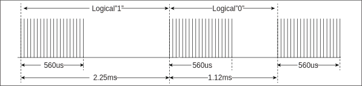
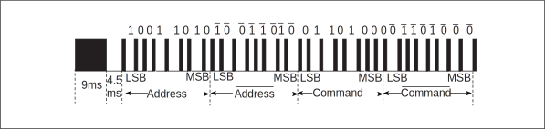
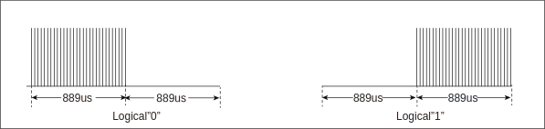
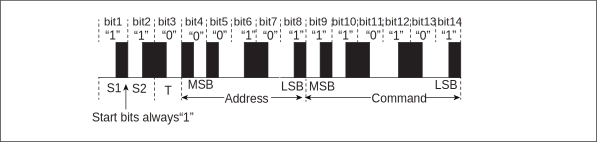

===========
IR
===========

IR introduction
================
Infrared remote (IR for short) is a wireless, non-contact control technology, 
which has the advantages of strong anti-interference ability, reliable 
information transmission, low power consumption and low cost. The infrared 
remote control transmitting circuit uses infrared light emitting diodes to 
emit modulated infrared light waves. The receiving circuit consists of 
infrared receiving diodes, triodes or silicon photocells. They convert 
the infrared light emitted by the infrared transmitter into the 
corresponding electrical signal and send it to the rear amplifier.

IR main features
======================
- Receiving data with NEC, RC-5 protocol
- Receiving arbitrary format data in pulse width counting mode
- Powerful infrared waveform editing capabilities, which can emit waveforms conforming to various protocols
- Power settings of up to 15 gears to suit different power requirements
- Supports up to 64-bit data bits
- 64-byte receive FIFO
- Programmable carrier frequency and duty cycle

IR function description
============================
Fixed receiving protocol
--------------------------
IR receiver supports two fixed protocols, NEC protocol and RC-5 protocol.

- NEC protocol

The logic 1 and logic 0 waveforms of the NEC protocol are shown in the following figure:

   nec logical

Logic 1 is 2.25ms, pulse time is 560us; logic 0 bit is 1.12ms, pulse time is 560us.

The specific format of the NEC protocol is shown in the following figure:

   nec

The first pulse is a high-level pulse of 9ms and a low-level of 4.5ms, followed by an 8-bit address code and its inverse code, and then an 8-bit command code and its inverse code. The tail pulse is 560us high and 560us low.

- RC-5 protocol

The logic 1 and logic 0 waveforms of the RC-5 protocol are shown in the following figure:

   rc5 logical

Logic 1 is 1.778ms, which is 889us low and then 889us high; logic 0 and logic 1 have opposite waveforms.

The specific format of the RC-5 protocol is shown in the following figure:

   rc5

The first two bits are the start bit, fixed to logic 1, and the third bit is 
the flip bit. When a key value is issued and then pressed, the bit will be 
inverted. The next 5 bits are the address code and the 6 bits command code.
The first two bits are the start bit, fixed to logic 1, and the third bit is the flip bit. When a key value is issued and then pressed, the bit will be inverted. The next 5 digits are the address code and the 6-digit command code.

It should be noted that in order to improve the receiving sensitivity, the common infrared integrated receiver head outputs a low level after receiving a high level, so when the IR receiving function is used, the receiving flip function must be turned on.

Pulse width reception
-----------------------
For data in any format other than the NEC and RC-5 protocols, the IR will count the duration of each high and low level in turn using its clock, and then store the data in a 64-byte depth receiving FIFO.

Normal sending mode
----------------------
Users can configure the corresponding configurations of the head pulse, tail pulse, logic 0 and logic 1 pulses according to specific protocols. When setting, it is necessary to calculate the common pulse width unit of various pulses with different widths in the protocol used, that is, the greatest common divisor, fill in the lower 12 bits of the register IRTX_PULSE_WIDTH, and each pulse fills its corresponding multiple in the register IRTX_PW.

IR supports a maximum of 64-bit data bits and is divided into two 32-bit registers IRTX_DATA_WORD0 and IRTX_DATA_WORD1.

Pulse width transmission
------------------------------
For protocols that are not suitable for normal transmission mode, IR provides 
a pulse width transmission method. First calculate the common pulse width unit 
of the pulses of different widths in the protocol used, that is, the greatest 
common divisor, and fill in the lower 12 bits of the register IRTX_PULSE_WIDTH. 
Then fill the register IRTX_SWM_PW_n(0 <= n <= 7)with multiples corresponding 
to the respective level widths from the first high level to the last level, 
each level width multiple occupies 4-bit .

Carrier modulation
---------------------
Setting the upper 16 bits of the IRTX_PULSE_WIDTH register can generate carriers with different frequencies and duty cycles. The <TXMPH1W> bit in this register sets the width of carrier phase 1, and the <TXMPH0W> bit sets the width of carrier phase 0.

IR interrupt
-------------
IR has separate transmit and receive interrupts, and a transmit interrupt is 
generated when a transmit operation ends. When a piece of data is received, 
it will wait for the continuous level to reach the set end threshold to 
generate a receive interrupt.

The user can query the send interrupt status and clear the interrupt by register 
IRTX_INT_STS, and query the receive interrupt status and clear the interrupt 
by register IRRX_INT_STS.

.. only:: html

   .. include:: ir_register.rst

.. raw:: latex

   \input{../../en/content/ir}