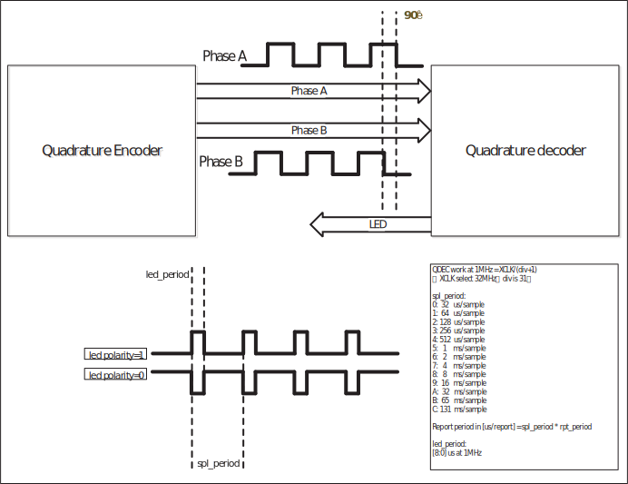

==========
QDEC
==========

QDEC introduction
==================
The quadrature decoder is used to decode the two sets of pulses with a phase difference of 90 degrees generated by the dual-path rotary encoder into the corresponding speed and direction of rotation.

QDEC main features
===================
- Three sets of QDEC are available

- The clock source of QDEC can be 32K (f32k_clk) or 32M (xclk). It is recommended to select 32M as the clock source during normal operation, and 32K is recommended when entering sleep mode and wish to be awakened by QDEC.

- Supports 5-digit frequency division value, which can be divided from 1 to 32.

- 16-bit pulse count range (-32768~32767 pulse/sample)

- 12 configurable sample periods (32us~131ms per sample at 1MHz)

- 16-bit configurable report period (0~65535 sample/report)

- Built-in a LED function that can flash with sampling (LED on/off 0~511 us/sample)

- Interrupt can be configured (sample interrupt, report interrupt, error interrupt, overflow interrupt)

- Can be configured as a wake-up source for PDS (clock source needs to be configured as 32k)

QDEC function description
=============================
The expected operating frequency of QDEC is 1MHz, and the faster the detection speed, the higher the operating frequency required.

Each sampling will decode the A/B two-phase pulse output by the encoder into high and low levels. Compare the previous sampling results to get the current encoder rotation direction and pulse count change (clockwise rotation +1, counterclockwise rotation -1 , No change, no change, error report and count). After the sampling times set by the report, the rotation direction and pulse count of the encoder during this period can be obtained, and the average value of the rotational speed direction during the report period can be solved accordingly.

The period of each sampling can be configured. When the working frequency is 1MHz, the minimum is 32us for one sampling, and the maximum is 131ms for one sampling.

The interrupt can be configured as a single sampling end trigger (sample interrupt) and multiple sampling end trigger (report interrupt) to flexibly measure the speed.

Configurable LED blinking function, blinking frequency=LED cycle/sampling cycle, each blinking on/off is determined by the LED polarity.

   QDEC functional block diagram

.. only:: html

   .. include:: qdec_register.rst

.. raw:: latex

   \input{../../en/content/qdec}