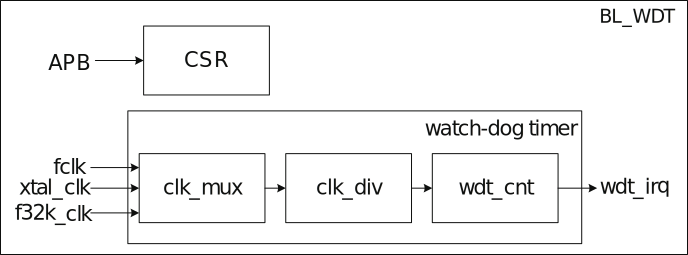
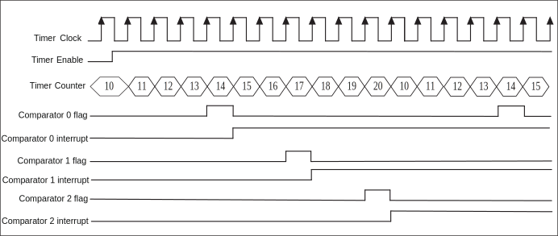
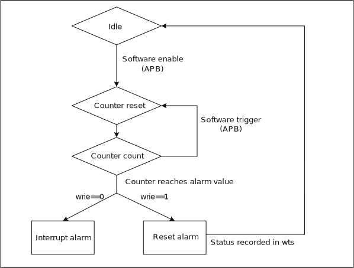

==========
TIMER
==========

TIMER introduction
===================
The chip has two 32-bit counters, each of which can independently control and configure its parameters and clock frequency.

There is a watchdog counter in the chip. Unpredictable software or hardware behavior may cause the application to malfunction. A watchdog timer can help the system recover from it. If the current time exceeds the predetermined time, but the dog is not fed or closed Timer, which can trigger interrupt or system reset according to the setting.

.. figure:: ../../picture/TimerBlock.svg
   :align: center

   Timer block diagram

   Watchdog timer block diagram

TIMER main features
====================
- Multiple clock source options
- 8-bit clock divider with a division factor of 1-256.
- Two 32-bit timers
- Each timer contains three alarm value settings, which can be set independently to alarm when each alarm value overflows
- Support FreeRun mode and PreLoad mode
- 16-bit watchdog timer
- Supports write password protection to prevent system abnormalities caused by incorrect settings
- Support two watchdog overflow methods: interrupt or reset

TIMER function description
============================

8-bit divider
---------------
There are three types of Watchdog timer clocks:

- Fclk--System master clock

- 32K--32K clock

- Xtal--External crystal

There are four timer clock sources:

- Fclk--System master clock

- 32K--32K clock

- 1K--1K clock（32K frequency division）

- Xtal--External crystal

Each counter has its own 8-bit frequency divider. The selected clock can be divided by 1-256 through APB. Specifically, when it is set to 0, it means no frequency division, and when it is set to 1, it divides it by 2. The maximum frequency division coefficient is 256, the counter will use the divided clock as the unit of the counting cycle, each time a counting cycle is increased by one.

General timer operating mode
-------------------------------
Each general-purpose timer includes three comparators, a counter and a preload register. When the clock source is set and the timer is started, the counter starts to count up. When the counter value is equal to the comparator, the comparison is performed. When the flag is set, a compare interrupt is generated.

The initial value of the counter depends on the timing mode. In FreeRun mode, the initial value of the counter is 0, and then counts up. When it reaches the maximum value, it starts counting from 0 again.

In PreLoad mode, the initial value of the counter is the value of the PreLoad register and then counts up. When the PreLoad condition is met, the value of the counter is set to the value of the PreLoad register, and then the counter starts to count up again. During the counting process, once the value of the counter matches one of the three comparators, the comparator's comparison flag will be set and a corresponding comparison interrupt can be generated.

If the value of the preload register is 10, the value of Comparator 0 is 13, the value of Comparator 1 is 16, and the value of Comparator 2 is 19, the working sequence of the timer in PreLoad mode is as follows:

   Timer Preload

In FreeRun mode, the timer working sequence is basically the same as PreLoad, the difference is that the counter will start to accumulate from 0 to the maximum value. The mechanism of the generated compare flags and compare interrupts is the same as in PreLoad mode.

Watchdog timer operating mode
------------------------------
The watchdog timer includes a counter and a comparator. The counter counts up from 0. If the counter is reset (feed the dog), it starts counting up from 0 again. When the counter value is equal to the comparator, a comparison interrupt signal or a system reset signal will be generated, and the user can choose to use one of them as required.

The watchdog counter is incremented by one in each counting cycle unit. Software can reset the watchdog counter to zero at any point in time through the APB.

If the value of the comparator is 6, the working sequence of Watchdog is shown in the figure below:

.. figure:: ../../picture/WatchDog.svg
   :align: center

   Watchdog timing

Alarm setting
----------------
Each counter has three comparison values, and can set whether each comparison value triggers an alarm interrupt. When the counter matches the comparison value and the setting will alarm, the counter will notify the processor through the interrupt.

The software can read through the APB whether an alarm has occurred and which comparison value triggered the alarm interrupt. When the alarm interrupt is cleared, the alarm status is also cleared simultaneously.

Watchdog alarm
----------------
A comparison value can be set for each counter. When the software fails to reset the watchdog counter to zero due to a system error, which causes the watchdog counter to exceed the comparison value, a watchdog alarm is triggered. There are two types of alarms. The first is to perform necessary actions through interrupt notification software. The second is to enter the system watchdog reset. When the watchdog reset is triggered, it will notify the system reset controller and prepare for system reset. When everything is ready, enter the system watchdog reset. It is worth noting that software can read the WSR register through APB to know if a watchdog system reset has occurred.

   Watchdog alarm mechanism

.. only:: html

   .. include:: tmr_register.rst

.. raw:: latex

   \input{../../en/content/tmr}