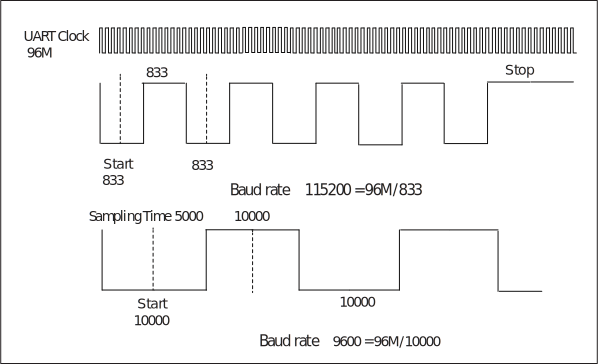

===========
UART
===========

UART introduction
==================
Universal Asynchronous Receiver / Transmitter (commonly known as UART) is an asynchronous transceiver that provides a flexible way to exchange full-duplex data with external devices.

BL70x has two sets of UART ports (UART0 and UART1). By using with DMA, you can achieve efficient data communication.

UART main features
=====================
- Full-duplex asynchronous communication
- Data bit length can be selected from 5/6/7/8 bits
- Stop bit length can be selected from 0.5/1/1.5/2 bits
- Supports odd/even/no parity bits
- Detects wrong start bit
- Support LIN protocol (receive and send REAK/SYNC)
- Multiple interrupt control
- Support hardware flow control (RTS / CTS)
- Convenient baud rate programming
- Configurable MSB / LSB priority transmission
- Normal / fixed character automatic baud rate detection
- 32-byte transmit / receive FIFO
- Support DMA transfer mode

UART function description
=============================
Data format description
-------------------------
Normal UART communication data is composed of a start bit, a data bit, a parity bit, and a stop bit. The BL702's UART supports configurable data bits, parity bits, and stop bits, all of which are set in the utx_config and urx_config registers. The waveform of one frame of data is shown below:

.. figure:: ../../picture/UARTData.svg
   :align: center

   UART data

The start bit of the data frame occupies 1 bit, and the stop bit can be 0.5/1/1.5/2-bit wide by configuring the cr_utx_bit_cnt_p bit in the register utx_config. The start bit is at a low level and the stop bit is at a high level.
The data bit width can be set to 5/6/7/8-bit by the cr_utx_bit_cnt_d bit in the register utx_config.

When the cr_utx_prt_en bit in the register utx_config and the cr_urx_prt_en bit in the register urx_config are set, the data frame adds a parity check bit after the data. The cr_utx_prt_sel bit in the register utx_config and the cr_urx_prt_sel bit in the register urx_config are used to select odd or even parity check. When the receiver detects the check bit error of the input data, it will generate the check error interrupt. However, the received data will still be stored into the FIFO.

Calculation method of odd parity check: If there is an odd number of "1" in the current data bit, the odd parity check bit is set to 0. Otherwise, it is set to 1.

Calculation method of even parity check: If there is an odd number of "1" in the current data bit, the even parity check bit is set to 1. Otherwise, it is set to 0.

Clock source
---------------
The UART has two clock sources: 96MHz PLL_CLK and FCLK. The frequency divider in the clock is used to divide the clock source and then generate a clock signal to drive the UART module. As shown below:

.. figure:: ../../picture/UARTClk.svg
   :align: center

   UART clock

Baud rate setting
---------------------
.. math:: Baudrate = \frac{UART\_clk}{uart\_prd + 1}

The user can set the baud rate of RX and TX separately. Take TX as an example: the value of uart_prd is the value of the lower 16 bits cr_utx_bit_prd of the register UART_BIT_PRD. Since the maximum value of the 16-bit bit width coefficient is 65535, the minimum baud rate supported by UART is : UART_clk/65536.

Before sampling the data, UART will filter the data to remove the burrs in the waveform. Then, the data will be sampled at the intermediate value of the 16-bit width factor, so that the sampling time can be adjusted based on baud rates, to ensure that the intermediate value is always sampled, providing much higher flexibility and accuracy. The sampling process is shown as follows:

   UART sampling waveform

Transmitter
-------------
The transmitter contains a 128-byte transmit FIFO to store the data to be transmitted. Software can write TX FIFO through APB bus, and can also move data into TX FIFO through DMA. When the transmit enable bit is set, the data stored in the FIFO will be output from the TX pin. Software can choose to transfer data to TX FIFO through DMA or APB bus.
Software can check the status of transmitter by querying the remaining free space count value of TX FIFO through tx_fifo_cnt in the register uart_fifo_config_1.

FreeRun mode of transmitter:

- If the FreeRun mode is disabled, transmission will be terminated and an interrupt will be generated when the sent bytes reach the specified length. Before next transmission, you need to re-disable and enable the TxE bit.

- If the FreeRun mode is enabled, the transmitter will send when there is data in the TX FIFO, and will not stop working because the sent bytes reach the specified length.

Receiver
-------------
The receiver contains a 128-byte receive FIFO to store the received data. Software can check the status of receiver by querying the available data count value of RX FIFO through rx_fifo_cnt in the register uart_fifo_config_1. 
The low 8 bits of the register URX_RTO_TIMER are used to set a receiving timeout threshold, which will trigger an interrupt when the receiver fails to receive data beyond the threshold. 
The cr_urx_deg_en and cr_urx_deg_cnt in the register urx_config are used to enable the deburring function and set the threshold, which control the filtering part before sampling by UART.
UART will filter out the burrs whose width is lower than the threshold in the waveform and then send it to sampling.

Automatic baud rate detection
--------------------------------
The UART module supports automatic baud rate detection, which is divided into two modes, a generic mode and a fixed character (square wave) mode.
The cr_urx_abr_en in the urx_config register enables auto baud rate detection, and when it is turned on, both detection modes are enabled.

**General mode**

For any character data received, the UART module will count the number of clocks in the bit width. This number will then be written into the lower 16 bits of the register STS_URX_ABR_PRD and used to calculate the baud rate. Therefore, when the first received data bit is 1, the correct baud rate can be obtained. Such as '0x01' under LSB-FIRST.

**Fixed character mode**

In this mode, after counting the number of clocks in the starting bit width, the UART module will continue to count the number of clocks of subsequent data bits and compare with the start bit. If it fluctuates within the allowable error range, it will pass the test, otherwise the count value will be discarded. Therefore, only when the fixed characters '0x55'/'0xD5' under LSB-FIRST or '0xAA'/'0xAB' under MSB-FIRST are received. The UART module will write the count value of the number of clocks in the starting bit width into the upper 16 bits of the register STS_URX_ABR_PRD. As shown below:

.. figure:: ../../picture/UARTAbr.svg
   :align: center

   UART fixed character mode waveform

For an unknown baud rate, the UART uses UART_CLK to count the start bit width of 1000, and the second bit width of 1001. If there is no more than 4 UART_CLK floating up and down from the previous bit width, the UART will continue to count the third bit, which is 1005. If the difference with the start bit exceeds 4, the detection fails and the data is discarded. The UART will sequentially compare the first 6 bits of the data bit with the start bit.

The formula for calculating the detected baud rate is as follows:

.. math:: Baudrate = \frac{UART\_clk}{Count + 1}

Hardware flow control
------------------------
The UART supports hardware flow control in CTS / RTS mode to prevent data in the FIFO from being lost because it is too late to process. The hardware flow control connection is shown in the following figure:

.. figure:: ../../picture/UARTCTSRTS.svg
   :align: center

   UART flow control

When using the hardware flow control function, the output signal RTS is low to indicate that the other party is requested to send data, and RTS is high to indicate that the other party is notified to suspend data transmission until RTS is restored to low level.Two ways for hardware flow control of the transmitter:

- Hardware control (the cr_urx_rts_sw_mode in the register uart_sw_mode is 0): RTS goes high when cr_urx_en in the register urx_config is not turned on or the RX FIFO is almost full (one byte left).

- Software control(the cr_urx_rts_sw_mode in the register uart_sw_mode is 1): The level of RTS can be changed by configuring cr_urx_rts_sw_val in the register uart_sw_mode.

The TX CTS can be enabled by configuring the bit <cr_utx_cts_en> of the utx_config register. When the device detects that the input signal CTS is pulled high, TX will stop sending data until it detects that CTS is pulled low before continuing to send.

LIN transmission mode
--------------------------
When the transmitter needs to use the LIN transmission mode, it can send the BREAK field and the SYNC field by configuring <cr_utx_lin_en>. The width of the interval field is determined by <cr_utx_bit_cnt_b>.

When the receiver needs to use the LIN transmission mode, you can configure <cr_urx_lin_en> to detect the interval field and the synchronization field, and trigger the corresponding interrupt <urx_lse_int> when the format of the synchronization field is wrong.

DMA transfer mode
----------------------
UART supports DMA transfer. Using DMA transfer, the TX and RX FIFO thresholds need to be set respectively by tx_fifo_th and rx_fifo_th in register uart_fifo_config_1.
When this mode is enabled, if tx_fifo_cnt in uart_fifo_config_1 is greater than tx_fifo_th, a DMA TX request will be triggered.
After the DMA is configured, when the DMA receives the request, it will move the data from the memory to the TX FIFO according to the settings.
If the rx_fifo_cnt in uart_fifo_config_1 is greater than rx_fifo_th, the DMA RX request will be triggered.
After the DMA is configured, when the DMA receives the request, it will transfer the data of the RX FIFO to the memory according to the settings.

UART interrupt
----------------
UART has a wealth of interrupt control, including the following interrupt modes:

- TX transmission end interrupt
- RX transmission end interrupt
- TX FIFO request interrupt
- RX FIFO request interrupt
- RX timeout interrupt
- RX parity error interrupt
- TX FIFO overflow interrupt
- RX FIFO overflow interrupt
- RX LIN mode synchronization field (SYNC Field) error interrupt

TX and RX can respectively set a transmission length value through the upper 16 bits of the UTX_CONFIG and URX_CONFIG registers. When the number of bytes transmitted reaches this value, the corresponding TX/RX transmission end interrupt will be triggered. 

The TX/RX FIFO request interrupt will be triggered when the available FIFO count value is greater than the threshold set in the register UART_FIFO_CONFIG_1, and the interrupt flag will be automatically cleared when the condition is not met. 

The RX timeout interrupt will be triggered when the receiver exceeds the timeout threshold without receiving data, and the RX parity error interrupt will occur when a parity error occurs. If the TX/RX FIFO overflows or underflows, the corresponding overflow interrupt will be triggered. 

When the FIFO clear bit TFICLR/RFICLR is set to 1, the corresponding FIFO will be cleared and the overflow interrupt flag will be automatically cleared. When the LIN mode is enabled, the synchronization field (SYNC Field) should be 0x55 according to the protocol. Therefore, when the received data is not 0x55, the synchronization field error interrupt is triggered.

The interrupt status can be inquired through the register uart_int_sts, and the interrupt can be cleared by writing 1 to the corresponding bit of the register uart_int_clear.

.. only:: html

   .. include:: uart_register.rst

.. raw:: latex

   \input{../../en/content/uart}