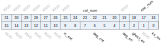
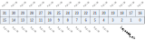

Register description
==========================

+------------------+--------------------------+
| Name             | Description              |
+------------------+--------------------------+
| `ks_ctrl`_       | Keyscan contro           |
+------------------+--------------------------+
| `ks_int_en`_     | Keyscan interrupt enable |
+------------------+--------------------------+
| `ks_int_sts`_    | Keyscan interrupt status |
+------------------+--------------------------+
| `keycode_clr`_   | Keycode clear            |
+------------------+--------------------------+
| `keycode_value`_ | Keycode value            |
+------------------+--------------------------+

ks_ctrl
---------
 
**Address：**  0x4000a900
 

.. table::
    :widths: 10, 15,10,10,55
    :width: 100%
    :align: center
     
    +----------+------------------------------+--------+-------------+------------------------------------+
    | Bit      | Name                         |Type    | Reset       | Description                        |
    +==========+==============================+========+=============+====================================+
    | 31:25    | RSVD                         |        |             |                                    |
    +----------+------------------------------+--------+-------------+------------------------------------+
    | 24:20    | col_num                      | r/w    | 5'd19       | col_num + 1                        |
    +----------+------------------------------+--------+-------------+------------------------------------+
    | 19       | RSVD                         |        |             |                                    |
    +----------+------------------------------+--------+-------------+------------------------------------+
    | 18:16    | row_num                      | r/w    | 3'd7        | row_num + 1                        |
    +----------+------------------------------+--------+-------------+------------------------------------+
    | 15:10    | RSVD                         |        |             |                                    |
    +----------+------------------------------+--------+-------------+------------------------------------+
    | 9:8      | rc_ext                       | r/w    | 2'd3        | idle duration between column scans |
    +----------+------------------------------+--------+-------------+------------------------------------+
    | 7:4      | deg_cnt                      | r/w    | 0           |                                    |
    +----------+------------------------------+--------+-------------+------------------------------------+
    | 3        | deg_en                       | r/w    | 0           | deglitch                           |
    +----------+------------------------------+--------+-------------+------------------------------------+
    | 2        | ghost_en                     | r/w    | 0           | ghost key event detection          |
    +----------+------------------------------+--------+-------------+------------------------------------+
    | 1        | RSVD                         |        |             |                                    |
    +----------+------------------------------+--------+-------------+------------------------------------+
    | 0        | ks_en                        | r/w    | 0           |                                    |
    +----------+------------------------------+--------+-------------+------------------------------------+

ks_int_en
-----------
 
**Address：**  0x4000a910
 
.. figure:: ../../picture/kys_ks_int_en.svg
   :align: center

.. table::
    :widths: 10, 15,10,10,55
    :width: 100%
    :align: center
     
    +----------+------------------------------+--------+-------------+------------+
    | Bit      | Name                         |Type    | Reset       | Description|
    +==========+==============================+========+=============+============+
    | 31:1     | RSVD                         |        |             |            |
    +----------+------------------------------+--------+-------------+------------+
    | 0        | ks_int_en                    | r/w    | 1           |            |
    +----------+------------------------------+--------+-------------+------------+

ks_int_sts
------------
 
**Address：**  0x4000a914
 
.. figure:: ../../picture/kys_ks_int_sts.svg
   :align: center

.. table::
    :widths: 10, 15,10,10,55
    :width: 100%
    :align: center
     
    +----------+------------------------------+--------+-------------+------------+
    | Bit      | Name                         |Type    | Reset       | Description|
    +==========+==============================+========+=============+============+
    | 31:4     | RSVD                         |        |             |            |
    +----------+------------------------------+--------+-------------+------------+
    | 3:0      | keycode_valid                | r      | 0           |            |
    +----------+------------------------------+--------+-------------+------------+

keycode_clr
-------------
 
**Address：**  0x4000a918
 

.. table::
    :widths: 10, 15,10,10,55
    :width: 100%
    :align: center
     
    +----------+------------------------------+--------+-------------+------------+
    | Bit      | Name                         |Type    | Reset       | Description|
    +==========+==============================+========+=============+============+
    | 31:4     | RSVD                         |        |             |            |
    +----------+------------------------------+--------+-------------+------------+
    | 3:0      | keycode_clr                  | w1c    | 0           |            |
    +----------+------------------------------+--------+-------------+------------+

keycode_value
---------------
 
**Address：**  0x4000a91c
 
.. figure:: ../../picture/kys_keycode_value.svg
   :align: center

.. table::
    :widths: 10, 15,10,10,55
    :width: 100%
    :align: center
     
    +----------+------------------------------+--------+-------------+---------------------------------------------------------+
    | Bit      | Name                         |Type    | Reset       | Description                                             |
    +==========+==============================+========+=============+=========================================================+
    | 31:24    | keycode3                     | r      | 8'hff       |                                                         |
    +----------+------------------------------+--------+-------------+---------------------------------------------------------+
    | 23:16    | keycode2                     | r      | 8'hff       |                                                         |
    +----------+------------------------------+--------+-------------+---------------------------------------------------------+
    | 15:8     | keycode1                     | r      | 8'hff       |                                                         |
    +----------+------------------------------+--------+-------------+---------------------------------------------------------+
    | 7:0      | keycode0                     | r      | 8'hff       | Col = keycode / (row_num+1)                             |
    +          +                              +        +             +                                                         +
    |          |                              |        |             | Row = keycode % (row_num+1)                             |
    +----------+------------------------------+--------+-------------+---------------------------------------------------------+

