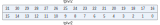
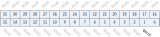
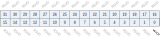
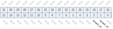

Register description
==========================

+------------+----------------------------------------------+
| Name       | Description                                  |
+------------+----------------------------------------------+
| `TCCR`_    | Timer clock source configuration register    |
+------------+----------------------------------------------+
| `TMR2_0`_  | Timer2 match register 0                      |
+------------+----------------------------------------------+
| `TMR2_1`_  | Timer2 match register 1                      |
+------------+----------------------------------------------+
| `TMR2_2`_  | Timer2 match register 2                      |
+------------+----------------------------------------------+
| `TMR2_0`_  | Timer3 match register 0                      |
+------------+----------------------------------------------+
| `TMR2_1`_  | Timer3 match register 1                      |
+------------+----------------------------------------------+
| `TMR2_2`_  | Timer3 match register 2                      |
+------------+----------------------------------------------+
| `TCR2`_    | Timer2 counter register                      |
+------------+----------------------------------------------+
| `TCR3`_    | Timer3 counter register                      |
+------------+----------------------------------------------+
| `TMSR2`_   | Timer2 match register status                 |
+------------+----------------------------------------------+
| `TMSR3`_   | Timer3 match register status                 |
+------------+----------------------------------------------+
| `TIER2`_   | Timer2 match interrupt enable register       |
+------------+----------------------------------------------+
| `TIER3`_   | Timer3 match interrupt enable register       |
+------------+----------------------------------------------+
| `TPLVR2`_  | Timer2 pre-load value register               |
+------------+----------------------------------------------+
| `TPLVR3`_  | Timer3 pre-load value register               |
+------------+----------------------------------------------+
| `TPLCR2`_  | Timer2 pre-load control register             |
+------------+----------------------------------------------+
| `TPLCR3`_  | Timer3 pre-load control register             |
+------------+----------------------------------------------+
| `WMER`_    | WDT reset/interrupt mode register            |
+------------+----------------------------------------------+
| `WMR`_     | WDT counter match value register             |
+------------+----------------------------------------------+
| `WVR`_     | WDT counter value register                   |
+------------+----------------------------------------------+
| `WSR`_     | WDT timer reset indication register          |
+------------+----------------------------------------------+
| `TICR2`_   | Timer2 Interrupt clear control register      |
+------------+----------------------------------------------+
| `TICR3`_   | Timer3 Interrupt clear control register      |
+------------+----------------------------------------------+
| `WICR`_    | WDT Interrupt clear register                 |
+------------+----------------------------------------------+
| `TCER`_    | Timer count enable register                  |
+------------+----------------------------------------------+
| `TCMR`_    | Timer count mode register                    |
+------------+----------------------------------------------+
| `TILR2`_   | Timer2 match interrupt mode register         |
+------------+----------------------------------------------+
| `TILR3`_   | Timer3 match interrupt mode register         |
+------------+----------------------------------------------+
| `WCR`_     | WDT timer count reset register               |
+------------+----------------------------------------------+
| `WFAR`_    | WDT access key1 register                     |
+------------+----------------------------------------------+
| `WSAR`_    | WDT access key2 register                     |
+------------+----------------------------------------------+
| `TCVWR2`_  | Timer2 capture value of counter register     |
+------------+----------------------------------------------+
| `TCVWR3`_  | Timer3 capture value of counter register     |
+------------+----------------------------------------------+
| `TCVSYN2`_ | Timer2 synchronous value of counter register |
+------------+----------------------------------------------+
| `TCVSYN3`_ | Timer3 synchronous value of counter register |
+------------+----------------------------------------------+
| `TCDR`_    | WDT/Timer clock division register            |
+------------+----------------------------------------------+

TCCR
------
 
**Address：**  0x4000a500
 
.. figure:: ../../picture/tmr_TCCR.svg
   :align: center

.. table::
    :widths: 10, 15,10,10,55
    :width: 100%
    :align: center
     
    +----------+------------------------------+--------+-------------+-----------------------------------------------------------------------------------------------+
    | Bit      | Name                         |Type    | Reset       | Description                                                                                   |
    +==========+==============================+========+=============+===============================================================================================+
    | 31:10    | RSVD                         |        |             |                                                                                               |
    +----------+------------------------------+--------+-------------+-----------------------------------------------------------------------------------------------+
    | 9:8      | cs_wdt                       | r/w    | 2'd0        | Clock Source for Timer #1/#2/#3/WDT                                                           |
    +          +                              +        +             +                                                                                               +
    |          |                              |        |             | 2'd0 - fclk                                                                                   |
    +          +                              +        +             +                                                                                               +
    |          |                              |        |             | 2'd1 - f32k_clk                                                                               |
    +          +                              +        +             +                                                                                               +
    |          |                              |        |             | 2'd2 - 1 kHz                                                                                  |
    +          +                              +        +             +                                                                                               +
    |          |                              |        |             | 2'd3 - PLL 32MHz                                                                              |
    +----------+------------------------------+--------+-------------+-----------------------------------------------------------------------------------------------+
    | 7        | RSVD                         |        |             |                                                                                               |
    +----------+------------------------------+--------+-------------+-----------------------------------------------------------------------------------------------+
    | 6:5      | cs_2                         | r/w    | 2'd0        |                                                                                               |
    +----------+------------------------------+--------+-------------+-----------------------------------------------------------------------------------------------+
    | 4        | RSVD                         |        |             |                                                                                               |
    +----------+------------------------------+--------+-------------+-----------------------------------------------------------------------------------------------+
    | 3:2      | cs_1                         | r/w    | 2'd0        |                                                                                               |
    +----------+------------------------------+--------+-------------+-----------------------------------------------------------------------------------------------+
    | 1:0      | RSVD                         |        |             |                                                                                               |
    +----------+------------------------------+--------+-------------+-----------------------------------------------------------------------------------------------+

TMR2_0
--------
 
**Address：**  0x4000a510
 
.. figure:: ../../picture/tmr_TMR2_0.svg
   :align: center

.. table::
    :widths: 10, 15,10,10,55
    :width: 100%
    :align: center
     
    +----------+------------------------------+--------+-------------+-------------------------+
    | Bit      | Name                         |Type    | Reset       | Description             |
    +==========+==============================+========+=============+=========================+
    | 31:0     | tmr_2_0                      | r/w    | 32'hffffffff| Timer2 match register 0 |
    +----------+------------------------------+--------+-------------+-------------------------+

TMR2_1
--------
 
**Address：**  0x4000a514
 
.. figure:: ../../picture/tmr_TMR2_1.svg
   :align: center

.. table::
    :widths: 10, 15,10,10,55
    :width: 100%
    :align: center
     
    +----------+------------------------------+--------+-------------+-------------------------+
    | Bit      | Name                         |Type    | Reset       | Description             |
    +==========+==============================+========+=============+=========================+
    | 31:0     | tmr_2_1                      | r/w    | 32'hffffffff| Timer2 match register 1 |
    +----------+------------------------------+--------+-------------+-------------------------+

TMR2_2
--------
 
**Address：**  0x4000a518
 
.. figure:: ../../picture/tmr_TMR2_2.svg
   :align: center

.. table::
    :widths: 10, 15,10,10,55
    :width: 100%
    :align: center
     
    +----------+------------------------------+--------+-------------+-------------------------+
    | Bit      | Name                         |Type    | Reset       | Description             |
    +==========+==============================+========+=============+=========================+
    | 31:0     | tmr_2_2                      | r/w    | 32'hffffffff| Timer2 match register 2 |
    +----------+------------------------------+--------+-------------+-------------------------+

TMR2_0
--------
 
**Address：**  0x4000a51c
 
.. figure:: ../../picture/tmr_TMR2_0.svg
   :align: center

.. table::
    :widths: 10, 15,10,10,55
    :width: 100%
    :align: center
     
    +----------+------------------------------+--------+-------------+-------------------------+
    | Bit      | Name                         |Type    | Reset       | Description             |
    +==========+==============================+========+=============+=========================+
    | 31:0     | tmr_3_0                      | r/w    | 32'hffffffff| Timer3 match register 0 |
    +----------+------------------------------+--------+-------------+-------------------------+

TMR2_1
--------
 
**Address：**  0x4000a520
 
.. figure:: ../../picture/tmr_TMR2_1.svg
   :align: center

.. table::
    :widths: 10, 15,10,10,55
    :width: 100%
    :align: center
     
    +----------+------------------------------+--------+-------------+-------------------------+
    | Bit      | Name                         |Type    | Reset       | Description             |
    +==========+==============================+========+=============+=========================+
    | 31:0     | tmr_3_1                      | r/w    | 32'hffffffff| Timer3 match register 1 |
    +----------+------------------------------+--------+-------------+-------------------------+

TMR2_2
--------
 
**Address：**  0x4000a524
 
.. figure:: ../../picture/tmr_TMR2_2.svg
   :align: center

.. table::
    :widths: 10, 15,10,10,55
    :width: 100%
    :align: center
     
    +----------+------------------------------+--------+-------------+-------------------------+
    | Bit      | Name                         |Type    | Reset       | Description             |
    +==========+==============================+========+=============+=========================+
    | 31:0     | tmr_3_2                      | r/w    | 32'hffffffff| Timer3 match register 2 |
    +----------+------------------------------+--------+-------------+-------------------------+

TCR2
------
 
**Address：**  0x4000a52c
 

.. table::
    :widths: 10, 15,10,10,55
    :width: 100%
    :align: center
     
    +----------+------------------------------+--------+-------------+-------------------------+
    | Bit      | Name                         |Type    | Reset       | Description             |
    +==========+==============================+========+=============+=========================+
    | 31:0     | tcr2_counter                 | r      | 32'h0       | Timer2 counter register |
    +----------+------------------------------+--------+-------------+-------------------------+

TCR3
------
 
**Address：**  0x4000a530
 
.. figure:: ../../picture/tmr_TCR3.svg
   :align: center

.. table::
    :widths: 10, 15,10,10,55
    :width: 100%
    :align: center
     
    +----------+------------------------------+--------+-------------+-------------------------+
    | Bit      | Name                         |Type    | Reset       | Description             |
    +==========+==============================+========+=============+=========================+
    | 31:0     | tcr3_counter                 | r      | 32'h0       | Timer3 counter register |
    +----------+------------------------------+--------+-------------+-------------------------+

TMSR2
-------
 
**Address：**  0x4000a538
 
.. figure:: ../../picture/tmr_TMSR2.svg
   :align: center

.. table::
    :widths: 10, 15,10,10,55
    :width: 100%
    :align: center
     
    +----------+------------------------------+--------+-------------+--------------------------------------------------------------------------+
    | Bit      | Name                         |Type    | Reset       | Description                                                              |
    +==========+==============================+========+=============+==========================================================================+
    | 31:3     | RSVD                         |        |             |                                                                          |
    +----------+------------------------------+--------+-------------+--------------------------------------------------------------------------+
    | 2        | tmsr2_2                      | r      | 1'b0        | Timer2 match register 2 status/Clear interrupt would also clear this bit |
    +----------+------------------------------+--------+-------------+--------------------------------------------------------------------------+
    | 1        | tmsr2_1                      | r      | 1'b0        | Timer2 match register 1 status/Clear interrupt would also clear this bit |
    +----------+------------------------------+--------+-------------+--------------------------------------------------------------------------+
    | 0        | tmsr2_0                      | r      | 1'b0        | Timer2 match register 0 status/Clear interrupt would also clear this bit |
    +----------+------------------------------+--------+-------------+--------------------------------------------------------------------------+

TMSR3
-------
 
**Address：**  0x4000a53c
 
.. figure:: ../../picture/tmr_TMSR3.svg
   :align: center

.. table::
    :widths: 10, 15,10,10,55
    :width: 100%
    :align: center
     
    +----------+------------------------------+--------+-------------+--------------------------------------------------------------------------+
    | Bit      | Name                         |Type    | Reset       | Description                                                              |
    +==========+==============================+========+=============+==========================================================================+
    | 31:3     | RSVD                         |        |             |                                                                          |
    +----------+------------------------------+--------+-------------+--------------------------------------------------------------------------+
    | 2        | tmsr3_2                      | r      | 1'b0        | Timer3 match register 2 status/Clear interrupt would also clear this bit |
    +----------+------------------------------+--------+-------------+--------------------------------------------------------------------------+
    | 1        | tmsr3_1                      | r      | 1'b0        | Timer3 match register 1 status/Clear interrupt would also clear this bit |
    +----------+------------------------------+--------+-------------+--------------------------------------------------------------------------+
    | 0        | tmsr3_0                      | r      | 1'b0        | Timer3 match register 0 status/Clear interrupt would also clear this bit |
    +----------+------------------------------+--------+-------------+--------------------------------------------------------------------------+

TIER2
-------
 
**Address：**  0x4000a544
 
.. figure:: ../../picture/tmr_TIER2.svg
   :align: center

.. table::
    :widths: 10, 15,10,10,55
    :width: 100%
    :align: center
     
    +----------+------------------------------+--------+-------------+---------------------------------------------------+
    | Bit      | Name                         |Type    | Reset       | Description                                       |
    +==========+==============================+========+=============+===================================================+
    | 31:3     | RSVD                         |        |             |                                                   |
    +----------+------------------------------+--------+-------------+---------------------------------------------------+
    | 2        | tier2_2                      | r/w    | 1'b0        | Timer2 match register 2 interrupt enable register |
    +----------+------------------------------+--------+-------------+---------------------------------------------------+
    | 1        | tier2_1                      | r/w    | 1'b0        | Timer2 match register 1 interrupt enable register |
    +----------+------------------------------+--------+-------------+---------------------------------------------------+
    | 0        | tier2_0                      | r/w    | 1'b0        | Timer2 match register 0 interrupt enable register |
    +----------+------------------------------+--------+-------------+---------------------------------------------------+

TIER3
-------
 
**Address：**  0x4000a548
 

.. table::
    :widths: 10, 15,10,10,55
    :width: 100%
    :align: center
     
    +----------+------------------------------+--------+-------------+---------------------------------------------------+
    | Bit      | Name                         |Type    | Reset       | Description                                       |
    +==========+==============================+========+=============+===================================================+
    | 31:3     | RSVD                         |        |             |                                                   |
    +----------+------------------------------+--------+-------------+---------------------------------------------------+
    | 2        | tier3_2                      | r/w    | 1'b0        | Timer3 match register 2 interrupt enable register |
    +----------+------------------------------+--------+-------------+---------------------------------------------------+
    | 1        | tier3_1                      | r/w    | 1'b0        | Timer3 match register 1 interrupt enable register |
    +----------+------------------------------+--------+-------------+---------------------------------------------------+
    | 0        | tier3_0                      | r/w    | 1'b0        | Timer3 match register 0 interrupt enable register |
    +----------+------------------------------+--------+-------------+---------------------------------------------------+

TPLVR2
--------
 
**Address：**  0x4000a550
 

.. table::
    :widths: 10, 15,10,10,55
    :width: 100%
    :align: center
     
    +----------+------------------------------+--------+-------------+--------------------------------+
    | Bit      | Name                         |Type    | Reset       | Description                    |
    +==========+==============================+========+=============+================================+
    | 31:0     | tplvr2                       | r/w    | 32'h0       | Timer2 pre-load value register |
    +----------+------------------------------+--------+-------------+--------------------------------+

TPLVR3
--------
 
**Address：**  0x4000a554
 
.. figure:: ../../picture/tmr_TPLVR3.svg
   :align: center

.. table::
    :widths: 10, 15,10,10,55
    :width: 100%
    :align: center
     
    +----------+------------------------------+--------+-------------+--------------------------------+
    | Bit      | Name                         |Type    | Reset       | Description                    |
    +==========+==============================+========+=============+================================+
    | 31:0     | tplvr3                       | r/w    | 32'h0       | Timer3 pre-load value register |
    +----------+------------------------------+--------+-------------+--------------------------------+

TPLCR2
--------
 
**Address：**  0x4000a55c
 
.. figure:: ../../picture/tmr_TPLCR2.svg
   :align: center

.. table::
    :widths: 10, 15,10,10,55
    :width: 100%
    :align: center
     
    +----------+------------------------------+--------+-------------+-----------------------------------------------------------------------------------------------------------------------------------------------------------------------------+
    | Bit      | Name                         |Type    | Reset       | Description                                                                                                                                                                 |
    +==========+==============================+========+=============+=============================================================================================================================================================================+
    | 31:2     | RSVD                         |        |             |                                                                                                                                                                             |
    +----------+------------------------------+--------+-------------+-----------------------------------------------------------------------------------------------------------------------------------------------------------------------------+
    | 1:0      | tplcr2                       | r/w    | 2'h0        | Timer2 pre-load control register                                                                                                                                            |
    +          +                              +        +             +                                                                                                                                                                             +
    |          |                              |        |             | 2'd0 - No pre-load                                                                                                                                                          |
    +          +                              +        +             +                                                                                                                                                                             +
    |          |                              |        |             | 2'd1 - Pre-load with match comparator 0                                                                                                                                     |
    +          +                              +        +             +                                                                                                                                                                             +
    |          |                              |        |             | 2'd2 - Pre-load with match comparator 1                                                                                                                                     |
    +          +                              +        +             +                                                                                                                                                                             +
    |          |                              |        |             | 2'd3 - Pre-load with match comparator 2                                                                                                                                     |
    +----------+------------------------------+--------+-------------+-----------------------------------------------------------------------------------------------------------------------------------------------------------------------------+

TPLCR3
--------
 
**Address：**  0x4000a560
 

.. table::
    :widths: 10, 15,10,10,55
    :width: 100%
    :align: center
     
    +----------+------------------------------+--------+-------------+-----------------------------------------------------------------------------------------------------------------------------------------------------------------------------+
    | Bit      | Name                         |Type    | Reset       | Description                                                                                                                                                                 |
    +==========+==============================+========+=============+=============================================================================================================================================================================+
    | 31:2     | RSVD                         |        |             |                                                                                                                                                                             |
    +----------+------------------------------+--------+-------------+-----------------------------------------------------------------------------------------------------------------------------------------------------------------------------+
    | 1:0      | tplcr3                       | r/w    | 2'h0        | Timer3 pre-load control register                                                                                                                                            |
    +          +                              +        +             +                                                                                                                                                                             +
    |          |                              |        |             | 2'd0 - No pre-load                                                                                                                                                          |
    +          +                              +        +             +                                                                                                                                                                             +
    |          |                              |        |             | 2'd1 - Pre-load with match comparator 0                                                                                                                                     |
    +          +                              +        +             +                                                                                                                                                                             +
    |          |                              |        |             | 2'd2 - Pre-load with match comparator 1                                                                                                                                     |
    +          +                              +        +             +                                                                                                                                                                             +
    |          |                              |        |             | 2'd3 - Pre-load with match comparator 2                                                                                                                                     |
    +----------+------------------------------+--------+-------------+-----------------------------------------------------------------------------------------------------------------------------------------------------------------------------+

WMER
------
 
**Address：**  0x4000a564
 

.. table::
    :widths: 10, 15,10,10,55
    :width: 100%
    :align: center
     
    +----------+------------------------------+--------+-------------+------------------------------------------------------------------------------------------------------------------------------+
    | Bit      | Name                         |Type    | Reset       | Description                                                                                                                  |
    +==========+==============================+========+=============+==============================================================================================================================+
    | 31:2     | RSVD                         |        |             |                                                                                                                              |
    +----------+------------------------------+--------+-------------+------------------------------------------------------------------------------------------------------------------------------+
    | 1        | wrie                         | r/w    | 1'b0        | WDT reset/interrupt mode register                                                                                            |
    +          +                              +        +             +                                                                                                                              +
    |          |                              |        |             | 1'b0 - WDT expiration to generate interrupt                                                                                  |
    +          +                              +        +             +                                                                                                                              +
    |          |                              |        |             | 1'b1 - WDT expiration to generate reset source                                                                               |
    +----------+------------------------------+--------+-------------+------------------------------------------------------------------------------------------------------------------------------+
    | 0        | we                           | r/w    | 1'b0        | WDT enable register                                                                                                          |
    +----------+------------------------------+--------+-------------+------------------------------------------------------------------------------------------------------------------------------+

WMR
-----
 
**Address：**  0x4000a568
 
.. figure:: ../../picture/tmr_WMR.svg
   :align: center

.. table::
    :widths: 10, 15,10,10,55
    :width: 100%
    :align: center
     
    +----------+------------------------------+--------+-------------+----------------------------------+
    | Bit      | Name                         |Type    | Reset       | Description                      |
    +==========+==============================+========+=============+==================================+
    | 31:16    | RSVD                         |        |             |                                  |
    +----------+------------------------------+--------+-------------+----------------------------------+
    | 15:0     | wmr                          | r/w    | 16'hffff    | WDT counter match value register |
    +----------+------------------------------+--------+-------------+----------------------------------+

WVR
-----
 
**Address：**  0x4000a56c
 
.. figure:: ../../picture/tmr_WVR.svg
   :align: center

.. table::
    :widths: 10, 15,10,10,55
    :width: 100%
    :align: center
     
    +----------+------------------------------+--------+-------------+----------------------------+
    | Bit      | Name                         |Type    | Reset       | Description                |
    +==========+==============================+========+=============+============================+
    | 31:16    | RSVD                         |        |             |                            |
    +----------+------------------------------+--------+-------------+----------------------------+
    | 15:0     | wvr                          | r      | 16'h0       | WDT counter value register |
    +----------+------------------------------+--------+-------------+----------------------------+

WSR
-----
 
**Address：**  0x4000a570
 
.. figure:: ../../picture/tmr_WSR.svg
   :align: center

.. table::
    :widths: 10, 15,10,10,55
    :width: 100%
    :align: center
     
    +----------+------------------------------+--------+-------------+---------------------------------------------------------------------------------------------------------------------------------------------------------------------------------------------------------------------------------------------------------------+
    | Bit      | Name                         |Type    | Reset       | Description                                                                                                                                                                                                                                                   |
    +==========+==============================+========+=============+===============================================================================================================================================================================================================================================================+
    | 31:1     | RSVD                         |        |             |                                                                                                                                                                                                                                                               |
    +----------+------------------------------+--------+-------------+---------------------------------------------------------------------------------------------------------------------------------------------------------------------------------------------------------------------------------------------------------------+
    | 0        | wts                          | r/w    | 1'b0        | WDT timer reset indication, Indicates that reset was caused by the WDT.                                                                                                                                                                                       |
    +          +                              +        +             +                                                                                                                                                                                                                                                               +
    |          |                              |        |             | (Write)1'b0 - clear the WDT reset status                                                                                                                                                                                                                      |
    +          +                              +        +             +                                                                                                                                                                                                                                                               +
    |          |                              |        |             | (Write)1'b1 - no affect                                                                                                                                                                                                                                       |
    +          +                              +        +             +                                                                                                                                                                                                                                                               +
    |          |                              |        |             | (Read)1'b0 - Watchdog timer did not cause reset because this bit was cleare                                                                                                                                                                                   |
    +          +                              +        +             +                                                                                                                                                                                                                                                               +
    |          |                              |        |             | (Read)1'b1 - Watchdog timer caused reset                                                                                                                                                                                                                      |
    +----------+------------------------------+--------+-------------+---------------------------------------------------------------------------------------------------------------------------------------------------------------------------------------------------------------------------------------------------------------+

TICR2
-------
 
**Address：**  0x4000a578
 
.. figure:: ../../picture/tmr_TICR2.svg
   :align: center

.. table::
    :widths: 10, 15,10,10,55
    :width: 100%
    :align: center
     
    +----------+------------------------------+--------+-------------+-----------------------------------------------+
    | Bit      | Name                         |Type    | Reset       | Description                                   |
    +==========+==============================+========+=============+===============================================+
    | 31:3     | RSVD                         |        |             |                                               |
    +----------+------------------------------+--------+-------------+-----------------------------------------------+
    | 2        | tclr2_2                      | w      | 1'b0        | Timer2 Interrupt clear for match comparator 2 |
    +----------+------------------------------+--------+-------------+-----------------------------------------------+
    | 1        | tclr2_1                      | w      | 1'b0        | Timer2 Interrupt clear for match comparator 1 |
    +----------+------------------------------+--------+-------------+-----------------------------------------------+
    | 0        | tclr2_0                      | w      | 1'b0        | Timer2 Interrupt clear for match comparator 0 |
    +----------+------------------------------+--------+-------------+-----------------------------------------------+

TICR3
-------
 
**Address：**  0x4000a57c
 
.. figure:: ../../picture/tmr_TICR3.svg
   :align: center

.. table::
    :widths: 10, 15,10,10,55
    :width: 100%
    :align: center
     
    +----------+------------------------------+--------+-------------+-----------------------------------------------+
    | Bit      | Name                         |Type    | Reset       | Description                                   |
    +==========+==============================+========+=============+===============================================+
    | 31:3     | RSVD                         |        |             |                                               |
    +----------+------------------------------+--------+-------------+-----------------------------------------------+
    | 2        | tclr3_2                      | w      | 1'b0        | Timer3 Interrupt clear for match comparator 2 |
    +----------+------------------------------+--------+-------------+-----------------------------------------------+
    | 1        | tclr3_1                      | w      | 1'b0        | Timer3 Interrupt clear for match comparator 1 |
    +----------+------------------------------+--------+-------------+-----------------------------------------------+
    | 0        | tclr3_0                      | w      | 1'b0        | Timer3 Interrupt clear for match comparator 0 |
    +----------+------------------------------+--------+-------------+-----------------------------------------------+

WICR
------
 
**Address：**  0x4000a580
 

.. table::
    :widths: 10, 15,10,10,55
    :width: 100%
    :align: center
     
    +----------+------------------------------+--------+-------------+------------------------------+
    | Bit      | Name                         |Type    | Reset       | Description                  |
    +==========+==============================+========+=============+==============================+
    | 31:1     | RSVD                         |        |             |                              |
    +----------+------------------------------+--------+-------------+------------------------------+
    | 0        | wiclr                        | w      | 1'b0        | WDT Interrupt clear register |
    +----------+------------------------------+--------+-------------+------------------------------+

TCER
------
 
**Address：**  0x4000a584
 

.. table::
    :widths: 10, 15,10,10,55
    :width: 100%
    :align: center
     
    +----------+------------------------------+--------+-------------+---------------------+
    | Bit      | Name                         |Type    | Reset       | Description         |
    +==========+==============================+========+=============+=====================+
    | 31:3     | RSVD                         |        |             |                     |
    +----------+------------------------------+--------+-------------+---------------------+
    | 2        | timer3_en                    | r/w    | 1'b0        | Timer3 count enable |
    +----------+------------------------------+--------+-------------+---------------------+
    | 1        | timer2_en                    | r/w    | 1'b0        | Timer2 count enable |
    +----------+------------------------------+--------+-------------+---------------------+
    | 0        | RSVD                         |        |             |                     |
    +----------+------------------------------+--------+-------------+---------------------+

TCMR
------
 
**Address：**  0x4000a588
 
.. figure:: ../../picture/tmr_TCMR.svg
   :align: center

.. table::
    :widths: 10, 15,10,10,55
    :width: 100%
    :align: center
     
    +----------+------------------------------+--------+-------------+--------------------------------------------------------------------------+
    | Bit      | Name                         |Type    | Reset       | Description                                                              |
    +==========+==============================+========+=============+==========================================================================+
    | 31:3     | RSVD                         |        |             |                                                                          |
    +----------+------------------------------+--------+-------------+--------------------------------------------------------------------------+
    | 2        | timer3_mode                  | r/w    | 1'b0        | Timer1/2/3 count mode register                                           |
    +          +                              +        +             +                                                                          +
    |          |                              |        |             | 1'b0 - pre-load mode                                                     |
    +          +                              +        +             +                                                                          +
    |          |                              |        |             | 1'b1 - free run mode                                                     |
    +----------+------------------------------+--------+-------------+--------------------------------------------------------------------------+
    | 1        | timer2_mode                  | r/w    | 1'b0        |                                                                          |
    +----------+------------------------------+--------+-------------+--------------------------------------------------------------------------+
    | 0        | RSVD                         |        |             |                                                                          |
    +----------+------------------------------+--------+-------------+--------------------------------------------------------------------------+

TILR2
-------
 
**Address：**  0x4000a590
 
.. figure:: ../../picture/tmr_TILR2.svg
   :align: center

.. table::
    :widths: 10, 15,10,10,55
    :width: 100%
    :align: center
     
    +----------+------------------------------+--------+-------------+------------------------------------------------------------------------------------------+
    | Bit      | Name                         |Type    | Reset       | Description                                                                              |
    +==========+==============================+========+=============+==========================================================================================+
    | 31:3     | RSVD                         |        |             |                                                                                          |
    +----------+------------------------------+--------+-------------+------------------------------------------------------------------------------------------+
    | 2        | tilr2_2                      | r/w    | 1'b0        | Timer2 match 0/1/2 interrupt mode register                                               |
    +          +                              +        +             +                                                                                          +
    |          |                              |        |             | 1'b0 - level interrupt                                                                   |
    +          +                              +        +             +                                                                                          +
    |          |                              |        |             | 1'b1 - pulse interrupt                                                                   |
    +----------+------------------------------+--------+-------------+------------------------------------------------------------------------------------------+
    | 1        | tilr2_1                      | r/w    | 1'b0        |                                                                                          |
    +----------+------------------------------+--------+-------------+------------------------------------------------------------------------------------------+
    | 0        | tilr2_0                      | r/w    | 1'b0        |                                                                                          |
    +----------+------------------------------+--------+-------------+------------------------------------------------------------------------------------------+

TILR3
-------
 
**Address：**  0x4000a594
 
.. figure:: ../../picture/tmr_TILR3.svg
   :align: center

.. table::
    :widths: 10, 15,10,10,55
    :width: 100%
    :align: center
     
    +----------+------------------------------+--------+-------------+------------------------------------------------------------------------------------------+
    | Bit      | Name                         |Type    | Reset       | Description                                                                              |
    +==========+==============================+========+=============+==========================================================================================+
    | 31:3     | RSVD                         |        |             |                                                                                          |
    +----------+------------------------------+--------+-------------+------------------------------------------------------------------------------------------+
    | 2        | tilr3_2                      | r/w    | 1'b0        | Timer3 match 0/1/2 interrupt mode register                                               |
    +          +                              +        +             +                                                                                          +
    |          |                              |        |             | 1'b0 - level interrupt                                                                   |
    +          +                              +        +             +                                                                                          +
    |          |                              |        |             | 1'b1 - pulse interrupt                                                                   |
    +----------+------------------------------+--------+-------------+------------------------------------------------------------------------------------------+
    | 1        | tilr3_1                      | r/w    | 1'b0        |                                                                                          |
    +----------+------------------------------+--------+-------------+------------------------------------------------------------------------------------------+
    | 0        | tilr3_0                      | r/w    | 1'b0        |                                                                                          |
    +----------+------------------------------+--------+-------------+------------------------------------------------------------------------------------------+

WCR
-----
 
**Address：**  0x4000a598
 

.. table::
    :widths: 10, 15,10,10,55
    :width: 100%
    :align: center
     
    +----------+------------------------------+--------+-------------+--------------------------------+
    | Bit      | Name                         |Type    | Reset       | Description                    |
    +==========+==============================+========+=============+================================+
    | 31:1     | RSVD                         |        |             |                                |
    +----------+------------------------------+--------+-------------+--------------------------------+
    | 0        | wcr                          | w      | 1'b0        | WDT timer count reset register |
    +----------+------------------------------+--------+-------------+--------------------------------+

WFAR
------
 
**Address：**  0x4000a59c
 
.. figure:: ../../picture/tmr_WFAR.svg
   :align: center

.. table::
    :widths: 10, 15,10,10,55
    :width: 100%
    :align: center
     
    +----------+------------------------------+--------+-------------+----------------------------+
    | Bit      | Name                         |Type    | Reset       | Description                |
    +==========+==============================+========+=============+============================+
    | 31:16    | RSVD                         |        |             |                            |
    +----------+------------------------------+--------+-------------+----------------------------+
    | 15:0     | wfar                         | w      | 16'b0       | WDT access key1 - 16'hBABA |
    +----------+------------------------------+--------+-------------+----------------------------+

WSAR
------
 
**Address：**  0x4000a5a0
 
.. figure:: ../../picture/tmr_WSAR.svg
   :align: center

.. table::
    :widths: 10, 15,10,10,55
    :width: 100%
    :align: center
     
    +----------+------------------------------+--------+-------------+----------------------------+
    | Bit      | Name                         |Type    | Reset       | Description                |
    +==========+==============================+========+=============+============================+
    | 31:16    | RSVD                         |        |             |                            |
    +----------+------------------------------+--------+-------------+----------------------------+
    | 15:0     | wsar                         | w      | 16'b0       | WDT access key2 - 16'hEB10 |
    +----------+------------------------------+--------+-------------+----------------------------+

TCVWR2
--------
 
**Address：**  0x4000a5a8
 

.. table::
    :widths: 10, 15,10,10,55
    :width: 100%
    :align: center
     
    +----------+------------------------------+--------+-------------+---------------------------------+
    | Bit      | Name                         |Type    | Reset       | Description                     |
    +==========+==============================+========+=============+=================================+
    | 31:0     | tcvwr2                       | r      | 32'h0       | Timer2 capture value of counter |
    +----------+------------------------------+--------+-------------+---------------------------------+

TCVWR3
--------
 
**Address：**  0x4000a5ac
 
.. figure:: ../../picture/tmr_TCVWR3.svg
   :align: center

.. table::
    :widths: 10, 15,10,10,55
    :width: 100%
    :align: center
     
    +----------+------------------------------+--------+-------------+---------------------------------+
    | Bit      | Name                         |Type    | Reset       | Description                     |
    +==========+==============================+========+=============+=================================+
    | 31:0     | tcvwr3                       | r      | 32'h0       | Timer3 capture value of counter |
    +----------+------------------------------+--------+-------------+---------------------------------+

TCVSYN2
---------
 
**Address：**  0x4000a5b4
 
.. figure:: ../../picture/tmr_TCVSYN2.svg
   :align: center

.. table::
    :widths: 10, 15,10,10,55
    :width: 100%
    :align: center
     
    +----------+------------------------------+--------+-------------+-------------------------------------+
    | Bit      | Name                         |Type    | Reset       | Description                         |
    +==========+==============================+========+=============+=====================================+
    | 31:0     | tcvsyn2                      | r      | 32'h0       | Timer2 synchronous value of counter |
    +----------+------------------------------+--------+-------------+-------------------------------------+

TCVSYN3
---------
 
**Address：**  0x4000a5b8
 
.. figure:: ../../picture/tmr_TCVSYN3.svg
   :align: center

.. table::
    :widths: 10, 15,10,10,55
    :width: 100%
    :align: center
     
    +----------+------------------------------+--------+-------------+-------------------------------------+
    | Bit      | Name                         |Type    | Reset       | Description                         |
    +==========+==============================+========+=============+=====================================+
    | 31:0     | tcvsyn3                      | r      | 32'h0       | Timer3 synchronous value of counter |
    +----------+------------------------------+--------+-------------+-------------------------------------+

TCDR
------
 
**Address：**  0x4000a5bc
 
.. figure:: ../../picture/tmr_TCDR.svg
   :align: center

.. table::
    :widths: 10, 15,10,10,55
    :width: 100%
    :align: center
     
    +----------+------------------------------+--------+-------------+--------------------------------------+
    | Bit      | Name                         |Type    | Reset       | Description                          |
    +==========+==============================+========+=============+======================================+
    | 31:24    | wcdr                         | r/w    | 8'h0        | WDT clock division value register    |
    +----------+------------------------------+--------+-------------+--------------------------------------+
    | 23:16    | tcdr3                        | r/w    | 8'h0        | Timer3 clock division value register |
    +----------+------------------------------+--------+-------------+--------------------------------------+
    | 15:8     | tcdr2                        | r/w    | 8'h0        | Timer2 clock division value register |
    +----------+------------------------------+--------+-------------+--------------------------------------+
    | 7:0      | RSVD                         |        |             |                                      |
    +----------+------------------------------+--------+-------------+--------------------------------------+

