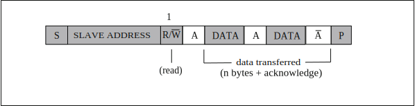
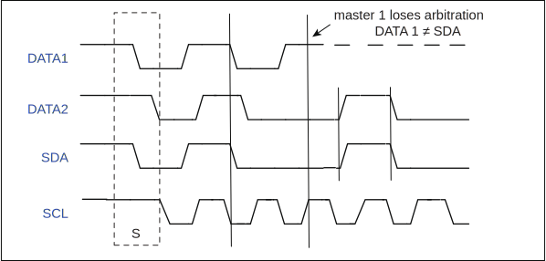

==========
I2C
==========

简介
=====
I2C (Inter-Intergrated Circuit)是一种串行通讯总线，使用多主从架构，用来连接低速外围装置。
每个器件都有一个唯一的识别地址，并且都可以作为一个发送器或接收器。
如果有两个或多个主机同时初始化，数据传输可以通过冲突检测和仲裁防止数据被破坏。
BL702包含一个I2C控制器主机，可灵活配置slaveAddr、subAddr以及传输数据，方便与从设备通信，提供2个word深度的fifo，提供中断功能，可搭配DMA使用提高效率，可灵活调整时钟频率。

主要特征
=========
- 支持主机模式
- 支持多主机模式和仲裁功能
- 时钟频率可灵活调整

功能描述
==========
引脚列表：

.. table:: I2C引脚

    +----------+-----------+---------------------------+
    |   名称   |   类型    |           描述            |
    +==========+===========+===========================+
    | I2Cx_SCL | 输入/输出 | I2C串行时钟信号           |
    +----------+-----------+---------------------------+
    | I2Cx_SDA | 输入/输出 | I2C串行数据信号           |
    +----------+-----------+---------------------------+

起始和停止条件
-----------------
所有传输都由起始条件(START condition)开始，以停止条件(STOP condition)结束。
起始条件和停止条件一般都由主机产生，总线在起始条件后被认为处于总线忙的状态，在停止条件后的某段时间内被认为处于空闲状态。

起始条件:SCL为高电平时SDA产生一高至低的电平转换；

停止条件:SCL为高电平时SDA产生一低至高的电平转换。

波形示意图如下：

.. figure:: ../../picture/I2CStopStart.svg
   :align: center

   I2C起始和停止条件

数据传输格式
----------------
传输的第一个8位为寻址字节，包括7位从机地址和1位方向位。数据由主机发送或接收是由主机所送出的第1个字节的第8位控制，
若为0表示数据由主机发送；为1则表示数据由主机接收，紧接着从机发出应答位(ACK)，在数据传输完成后，主机发出停止信号，波形图如下：

.. figure:: ../../picture/I2CMasterTxRx.svg
   :align: center

   I2C数据传输格式

**主发送和从接收的时序**

.. figure:: ../../picture/I2CMasterTxSlaveRx.svg
   :align: center

   主发送和从接收的时序

**主接收和从发送的时序**

   主接收和从发送的时序

仲裁
------
当I2C总线存在多个主机时，可能会发生多个主机同时启动传输的情况，此时必须要依靠仲裁机制来决定哪个主机有权利完成接下来的数据传输，其余主机则须放弃对总线的控制，等到总线再次空出来后才能重新启动传输。

在传输过程中，所有主机都需要在SCL为高电平时检查SDA是否与自己所想送出的资料相符，当SDA电平与预期不同时，表示有别的主机也在同时进行传输，而发现SDA电平不同的主机则失去此次仲裁，由其他主机完成数据传输。

两主机同时传输数据并启动仲裁机制的波形示意图如下：

   同时传输数据波形示意图

I2C时钟设定
============

I2C的时钟是由bclk(bus clock)而来，可以在bclk时钟的基础上做分频处理。
寄存器 i2c_prd_data 可以对数据段的时钟做分频处理。i2c模块将数据发送分为4个阶段，每个阶段在寄存器中用单独一个字节来控制，每个阶段的采样个数是可以设置的，4个采样数共同决定了i2c clock的分频系数。
比如现在bclk是32M，寄存器 i2c_prd_data 在不做配置默认情况下的值是0x0f0f0f0f，那么I2C的时钟频率为 32M/((15 + 1) * 4) = 500K。
同理，寄存器 i2c_prd_start 和 i2c_prd_stop 也会分别对起始位和停止位的时钟做分频处理。

I2C配置流程
============

配置项
-------

 - 读写标志位
 - 从设备地址
 - 从设备寄存器地址
 - 从设备寄存器地址长度
 - 数据(发送时，配置发送的数据；接收时，存储接收到的数据)
 - 数据长度
 - 使能信号

读写标志位
-----------

I2C支持发送和接收两种工作状态，寄存器 cr_i2c_pkt_dir 表示发送或者接收状态，设置为0时，表示发送状态，设置为1时，表示接收状态。

从设备地址
-----------

每个对接I2C的从设备，都会有唯一设备地址，通常该地址是7位长度，将从设备地址写入寄存器 cr_i2c_slv_addr,I2C在将从设备地址发送出去之前，会自动左移1位，并在最低位补上发送接收方向位。

从设备寄存器地址
-----------------

从设备寄存器地址表示I2C需要对从设备某个寄存器做读写操作的寄存器地址。将从设备寄存器地址写入寄存器 i2c_sub_addr，同时需要将寄存器 cr_i2c_sub_addr_en 置1。
如果将寄存器 cr_i2c_sub_addr_en 置0，那么I2C主机发送时会跳过从设备寄存器地址段。

从设备寄存器地址长度
----------------------

将从设备寄存器地址长度减1再写入寄存器 cr_i2c_sub_addr_bc。

数据
--------

数据部分表示需要发送到从设备的数据，或者需要从从设备接收的数据。
当I2C发送数据时，需要将数据依次以word为单位写入I2C FIFO，发送数据写FIFO的寄存器地址 i2c_fifo_wdata。
当I2C接收数据时，需要依次以word为单位从I2C FIFO中将数据读出来，接收数据读FIFO的寄存器地址 i2c_fifo_rdata。

数据长度
---------

将数据长度减1再写入寄存器 cr_i2c_pkt_len。

使能信号
---------

将以上几项配置完成后，再将使能信号寄存器 cr_i2c_m_en 写1，就自动启动I2C发送流程了。

当读写标志位配置为0时，I2C发送数据，主机发送流程：

1. 起始位

2. (从设备地址左移1位 + 0) + ACK

3. 从设备寄存器地址 + ACK

4. 1字节数据 + ACK

5. 1字节数据 + ACK

6. 停止位

当读写标志位配置为1时，I2C接收数据，主机发送流程：

1. 起始位

2. (从设备地址左移1位 + 0) + ACK

3. 从设备寄存器地址 + ACK

4. 起始位

5. (从设备地址左移1位 + 1) + ACK

6. 1字节数据 + ACK

7. 1字节数据 + ACK

8. 停止位

FIFO管理
============

I2C FIFO深度为2个word，I2C发送和接收可分为RX FIFO和TX FIFO。
寄存器 i2c_fifo_config_1 中的 rx_fifo_cnt 表示 RX FIFO 中有多少数据(单位 word)需要读取。
寄存器 i2c_fifo_config_1 中的 tx_fifo_cnt 表示 TX FIFO 中剩余多少空间(单位 Word)可供写入。

I2C FIFO状态：

 - RX FIFO underflow: 当 RX FIFO 中的数据被读取完毕或者为空，继续从 RX FIFO 中读取数据，则寄存器i2c_fifo_config_0中的rx_fifo_underflow会被置1；
 - RX FIFO overflow: 当 I2C 接收数据直到 RX FIFO 的 2 个 word 被填满后，在没有读取 RX FIFO 的情况下，I2C 再次接收到数据，寄存器i2c_fifo_config_0中的rx_fifo_overflow会被置1；
 - TX FIFO underflow: 当向 TX FIFO 中填入的数据大小不满足配置的 I2C 数据长度（i2c_config中的cr_i2c_pkt_len），并且已经没有新数据继续填入 TX FIFO 中时，寄存器i2c_fifo_config_0中的tx_fifo_underflow会被置1；
 - TX FIFO overflow: 当 TX FIFO 的 2 个 word 被填满后，在 TX FIFO 中的数据没有发出去之前，再次向 TX FIFO 中填入数据，寄存器 i2c_fifo_config_0 中的 tx_fifo_overflow 会被置 1。

搭配使用DMA
============

I2C 可以使用 DMA 进行数据的发送和接收。将寄存器 i2c_fifo_config_0 中的 i2c_dma_tx_en 置 1，则开启 DMA 发送模式，为 I2C 分配好 DMA 通道后，DMA 会将数据从存储区搬运到 i2c_fifo_wdata 寄存器中。
将寄存器 i2c_fifo_config_0 中的 i2c_dma_rx_en 置 1，则开启 DMA 接收模式，为 I2C 分配好 DMA 通道后，DMA 会将 i2c_fifo_rdata 寄存器中的数据搬运到存储区中。
I2C 模块使用 DMA 功能时，数据部分将由 DMA 自动完成搬运，不需要 CPU 再将数据写入 I2C TX FIFO 或者从 I2C RX FIFO 中读出。

DMA发送流程
-------------

1. 配置读写标志位i2c_config[cr_i2c_pkt_dir]为0

2. 配置从设备地址i2c_config[cr_i2c_slv_addr]

3. 如有有从设备寄存器地址，则配置从设备寄存器地址i2c_sub_addr、从设备寄存器地址长度i2c_config[cr_i2c_sub_addr_bc]，配置从设备寄存器地址使能位i2c_config[cr_i2c_sub_addr_en]为1

4. 设置发送数据的长度i2c_config[cr_i2c_pkt_len]

5. 使能DMA模式发送，设置i2c_fifo_config_0[i2c_dma_tx_en]为1

6. 配置DMA传输的数据长度DMA_CxControl[TransferSize]（x=0~7）

7. 配置DMA 源地址DMA_CxSrcAddr、数据宽度DMA_CxControl[SWidth]、burst大小DMA_CxControl[SBSize]，将DMA_CxControl[SI]置1开启地址自动累加模式

8. 配置DMA 目的地址DMA_CxDstAddr为i2c_fifo_wdata、数据宽度DMA_CxControl[DWidth]为32和burst大小DMA_CxControl[DBSize]，将DMA_CxControl[DI]清零禁用地址自动累加模式

9. 使能DMA

10. 配置i2c_config[cr_i2c_m_en]为1使能I2C

DMA接收流程
----------------

1. 配置读写标志位i2c_config[cr_i2c_pkt_dir]为1

2. 配置从设备地址i2c_config[cr_i2c_slv_addr]

3. 如有有从设备寄存器地址，则配置从设备寄存器地址i2c_sub_addr、从设备寄存器地址长度i2c_config[cr_i2c_sub_addr_bc]，配置从设备寄存器地址使能位i2c_config[cr_i2c_sub_addr_en]为1

4. 设置接收数据的长度i2c_config[cr_i2c_pkt_len]

5. 使能DMA模式接收，设置i2c_fifo_config_0[i2c_dma_rx_en]为1

7. 配置DMA传输的数据长度DMA_CxControl[TS]（x=0~7）

8. 配置DMA 源地址DMA_CxSrcAddr为i2c_fifo_rdata、数据宽度DMA_CxControl[SWidth]为32和burst大小DMA_CxControl[SBSize]，将DMA_CxControl[SI]清零禁用地址自动累加模式

7. 配置DMA 目的地址DMA_CxDstAddr、数据宽度DMA_CxControl[DWidth]、burst大小DMA_CxControl[DBSize]，将DMA_CxControl[DI]置1开启地址自动累加模式

9. 使能DMA

10. 配置i2c_config[cr_i2c_m_en]为1使能I2C

中断
============

I2C包括如下几种中断：

 - I2C_TRANS_END_INT: I2C传输结束中断
 - I2C_TX_FIFO_READY_INT: 当I2C TX FIFO有空闲空间可用于填充时，触发中断
 - I2C_RX_FIFO_READY_INT: 当I2C RX FIFO接收到数据时，触发中断
 - I2C_NACK_RECV_INT: 当I2C模块检测到NACK状态，触发中断
 - I2C_ARB_LOST_INT: I2C仲裁丢失中断
 - I2C_FIFO_ERR_INT: I2C FIFO ERROR中断

.. only:: html

   .. include:: i2c_register.rst

.. raw:: latex

   \input{../../zh_CN/content/i2c}