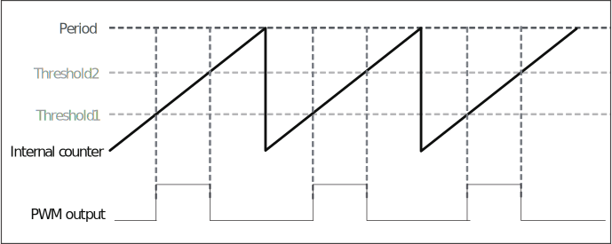

===========
PWM
===========

简介
=====
脉冲宽度调制（Pulse width modulation，简称PWM）是一种模拟控制方式，根据相应载荷的变化来调制晶体管基极或MOS管栅极的偏置，来实现晶体管或MOS管导通时间的改变，从而稳定开关电源的输出。这种方式能使电源的输出电压在工作条件变化时保持恒定，是利用微处理器的数字信号对模拟电路进行控制的一种非常有效的技术，广泛应用在从测量、通信、开关电源、电机控制等许多领域中。

主要特征
=========

- 支持5通道PWM信号生成

- 三种时钟源可选择（总线时钟<bclk>、晶振时钟<xtal>、慢速时钟<f32k>），搭配16-bit时钟分频器

- 双门限值设定，增加脉冲弹性

功能描述
===========
时钟与分频器
-------------
每个PWM计数器时钟来源都有三种选择，来源如下:

A. bclk - 芯片的总线时钟

B. XTAL - 外部晶振时钟

C. f32k - 系统RTC时钟

每个计数器都有各自的16-bit分频器，PWM计数器将以分频后的时钟作为计数周期单位，每经过一个计数周期进行计数器加一的动作。

脉冲产生原理
-------------
PWM内部有计数器，当计数器介于可设定的两个门限值域中间时，PWM的输出为1，反之当计数器在设定的两个门限值之外时，PWM输出为0，如下图所示：

   PWM 波形图

PWM的周期由两部分决定，一个是时钟分频系数，一个是时钟持续周期。

时钟分频系数由寄存器PWMn_CLK_DIV[15:0](n为0~4)进行设置，用于对PWM的源时钟进行分频。

时钟持续周期由寄存器PWMn_PERIOD[15:0](n为0~4)进行设置，用于设置PWM的一个周期由多少个分频后的时钟周期组成。即PWM的周期=PWM源时钟/PWMn_CLK_DIV[15:0]/PWMn_PERIOD[15:0]。

PWM的占空比由时钟持续周期和两个阈值决定。第一个阈值由寄存器PWMn_THRE1[15:0](n为0~4)进行设置，第二个阈值由寄存器PWMn_THRE2[15:0](n为0~4)进行设置，PWM的波形会在第一个阈值处拉高，在第二个阈值处拉低。即PWM的占空比=(PWMn_THRE2[15:0]-PWMn_THRE1[15:0])/PWMn_PERIOD[15:0]。

例：
若PWM时钟源选择为bclk即72MHz，要产生1kHz、占空比20%的PWM波，则设置如下：
PWMn_CLK_DIV[15:0]=2

PWMn_PERIOD[15:0]=72000000/2/1000=36000

PWMn_THRE1[15:0]=0

PWMn_THRE2[15:0]=0+36000*20%=7200

PWM中断
-------------
对于每一个PWM通道，可以设置周期计数值，当PWM输出的周期数达到这个计数值时，将产生PWM中断。

.. table:: 占空比参数 

    +----------+---------+--------+--------+--------+--------+--------+--------+--------+--------+--------+--------+--------+
    | 频率/MHz |                                          支持的占空比(n为整数,且 2 <= n <= 65535^2)                        |
    +==========+=========+========+========+========+========+========+========+========+========+========+========+========+
    | 36       |     0%  |    50% |   100% |        |        |        |        |        |        |        |        |        |
    +----------+---------+--------+--------+--------+--------+--------+--------+--------+--------+--------+--------+--------+
    | 24       |     0%  | 33.33% | 66.67% |   100% |        |        |        |        |        |        |        |        |
    +----------+---------+--------+--------+--------+--------+--------+--------+--------+--------+--------+--------+--------+
    | 18       |     0%  |    25% |    50% |   75%  |  100%  |        |        |        |        |        |        |        |
    +----------+---------+--------+--------+--------+--------+--------+--------+--------+--------+--------+--------+--------+
    | 14.4     |     0%  |    20% |    40% |   60%  |  80%   |  100%  |        |        |        |        |        |        |
    +----------+---------+--------+--------+--------+--------+--------+--------+--------+--------+--------+--------+--------+
    | 12       |     0%  | 16.67% | 33.33% |    50% | 66.67% | 83.33% | 100%   |        |        |        |        |        |
    +----------+---------+--------+--------+--------+--------+--------+--------+--------+--------+--------+--------+--------+
    | 10.29    |     0%  | 14.29% | 28.57% | 42.86% | 57.14% | 71.43% | 85.71% |  100%  |        |        |        |        |
    +----------+---------+--------+--------+--------+--------+--------+--------+--------+--------+--------+--------+--------+
    | 9        |     0%  | 12.50% |    25% | 37.50% |   50%  | 62.50% | 75%    | 87.50% |  100%  |        |        |        |
    +----------+---------+--------+--------+--------+--------+--------+--------+--------+--------+--------+--------+--------+
    | 8        |     0%  | 11.11% | 22.22% | 33.33% | 44.44% | 55.56% | 66.67% | 77.78% | 88.89% |  100%  |        |        |
    +----------+---------+--------+--------+--------+--------+--------+--------+--------+--------+--------+--------+--------+
    | 7.2      |     0%  |    10% |    20% |   30%  |  40%   |    50% |  60%   |  70%   |    80% |    90% |  100%  |        |
    +----------+---------+--------+--------+--------+--------+--------+--------+--------+--------+--------+--------+--------+
    | ·        |         |        |        |        |        |        |        |        |        |        |        |        |
    +----------+---------+--------+--------+--------+--------+--------+--------+--------+--------+--------+--------+--------+
    | ·        |         |        |        |        |        |        |        |        |        |        |        |        |
    +----------+---------+--------+--------+--------+--------+--------+--------+--------+--------+--------+--------+--------+
    | ·        |         |        |        |        |        |        |        |        |        |        |        |        |
    +----------+---------+--------+--------+--------+--------+--------+--------+--------+--------+--------+--------+--------+
    | 72/n     |     0/n |    1/n |   2/n  |  3/n   |   4/n  |  5/n   |   6/n  |  7/n   |  8/n   |   9/n  |  ···   |  n/n   |
    +----------+---------+--------+--------+--------+--------+--------+--------+--------+--------+--------+--------+--------+

.. only:: html

   .. include:: pwm_register.rst

.. raw:: latex

   \input{../../zh_CN/content/pwm}