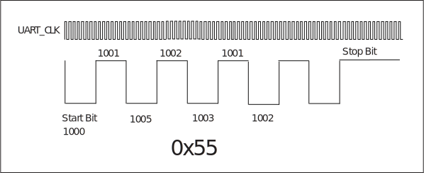

===========
UART
===========

简介
=====
通用异步收发传输器（Universal Asynchronous Receiver/Transmitter，通常称为UART）是一种异步收发传输器，提供了与外部设备进行全双工数据交换的灵活方式。
BL70x共有2组UART口（UART0和UART1），通过配合DMA使用，可以实现高效的数据通信。

主要特征
=========
 - 全双工异步通信
 - 数据位长度可选择5/6/7/8比特
 - 停止位长度可选择0.5/1/1.5/2比特
 - 支持奇/偶/无校验比特
 - 可侦测错误的起始比特
 - 支持LIN协议（收发BREAK/SYNC）
 - 丰富的中断控制
 - 支持硬件流控（RTS/CTS）
 - 便捷的波特率编程
 - 可配置MSB/LSB优先传输
 - 普通/固定字符的自动波特率检测
 - 128字节发送/接收FIFO
 - 支持DMA传输模式

功能描述
===========
数据格式描述
-------------
正常的UART通信数据是由起始位、数据位、奇偶校验位、停止位组成的。BL70x的UART支持可配置的数据位、奇偶校验位和停止位，这些都在寄存器utx_config和urx_config中设置。一帧数据的波形如下图所示：

.. figure:: ../../picture/UARTData.svg
   :align: center

   UART数据格式

数据帧的起始位占用1-bit，停止位可以通过配置寄存器utx_config中的cr_utx_bit_cnt_p实现0.5/1/1.5/2位宽。起始位为低电平，停止位为高电平。
数据位宽可以通过寄存器utx_config中的cr_utx_bit_cnt_d配置为5/6/7/8位宽。
当置位寄存器utx_config中的cr_utx_prt_en和寄存器urx_config中的cr_urx_prt_en时，数据帧会在数据之后添加一位奇偶校验位。寄存器utx_config中的cr_utx_prt_sel和寄存器urx_config中的cr_urx_prt_sel用于选择奇校验还是偶校验。当接收器检测到输入数据的校验位错误时会产生校验错误中断。但是接收的数据仍然会进入FIFO。
奇校验的计算方法：如果当前数据位1的个数是奇数个，奇校验位为0；反之为1。
偶校验的计算方法：如果当前数据位1的个数是奇数个，偶校验位为1；反之为0。

基本架构图
-------------

时钟源
-------------
UART有两个时钟源：96MHz PLL_CLK以及FCLK。时钟中的分频器用于对时钟源进行分频，然后产生时钟信号来驱动UART模块。如下图所示：

   UART时钟

波特率设定
-------------
.. math:: Baudrate = \frac{UART\_clk}{uart\_prd + 1}

用户可单独设置 RX 与 TX 的波特率，以 TX 为例：uart_prd 的数值为寄存器 UART_BIT_PRD 的低 16 位 cr_utx_bit_prd 数值，由于 16 位位宽系数最大值为 65535，所以 UART 支持的最小波特率为：UART_clk/65536。

在UART对数据进行采样之前，会先对数据进行滤波，将波形当中的毛刺滤掉。然后会在上述16位系数的中间值时刻进行采样，这样根据不同的波特率调整不同的采样时刻，以保持其采到的始终是中间值，大大提高了灵活性与精度。采样过程如下图所示：

.. figure:: ../../picture/UARTSample.svg
   :align: center

   UART采样波形图

发送器
-------------
发送器包含一个128字节的发送FIFO，用来存放待发送的数据。软件可以通过APB总线写TX FIFO，也可以通过DMA将数据搬入TX FIFO。当发送使能位被设置时，FIFO中存放的数据会从TX引脚输出。软件可以选择通过DMA或APB总线这两种方式将数据传入TX FIFO。
软件可以通过寄存器uart_fifo_config_1中的 tx_fifo_cnt 查询 TX FIFO 剩余可用空间计数值来检查发送器的状态。

发送器的自由运行（FreeRun）模式如下：

 - 如果没有开启自由运行（FreeRun）模式，则当发送字节达到指定长度时发送行为终止并产生中断，如果要继续发送则需重新关闭再使能发送使能位。
 - 如果开启自由运行（FreeRun）模式，则当TX FIFO里存在数据时，发送器就会进行发送，不会因为发送字节达到指定长度而终止。

接收器
-------------
接收器包含一个128字节的接收FIFO，用来存放接收到的数据。软件可以通过寄存器UART_FIFO_CONFIG_1的位<RFICNT>查询RX FIFO可用数据计数值来检查接收器的状态。寄存器URX_RTO_TIMER的低8位用于设定一个接收超时门限，当接收器超过该时间值未收到数据时，会触发中断。寄存器URX_CONFIG的位<DEGEN>和<DEGCNT>用于使能去毛刺功能和设置门限值，其控制的是UART采样之前的滤波部分，UART会将波形当中宽度低于门限值的毛刺滤掉，然后再将其送去采样。

自动波特率检测
-----------------
UART模块支持自动波特率检测，该检测分为两种，一种是通用模式，一种是固定字符(方波)模式。
由寄存器 urx_config 中的 cr_urx_abr_en 控制，每次开启时，这两种检测模式都会启用。

**通用模式**

对于所接收到的任意字符数据，UART模块会计数起始位宽当中的时钟数，此数字会接着被写入寄存器STS_URX_ABR_PRD的低16位并用以计算波特率，因此当最先接收到的数据位为1时即可得到正确的波特率，如LSB-FIRST下的'0x01'。

**固定字符模式**

该模式下，UART模块在计数起使位宽当中的时钟数后，会继续计数后续数据位的时钟数，并与起始位相比较，如果上下浮动在允许误差范围内，则通过检测，否则计数值会被丢弃。因此，只有在LSB-FIRST下接收到固定字符'0x55'/'0xD5'或MSB-FIRST下的'0xAA'/'0xAB'时，UART模块才会将起使位宽当中的时钟数计数值写入寄存器STS_URX_ABR_PRD的高16位。如下图所示：

   UART固定字符模式波形图

如上图所示，假设设置的最大允许误差为4，则对于接收到的某一波特率未知的数据，UART用UART_CLK去计数起始位的位宽为1000，第二位的位宽为1001，与前一位宽上下浮动不超过4个UART_CLK，则UART会继续计数第三位，第三位为1005，与起始位相差超过4，则检测不通过，数据丢弃。UART会依次将数据位的前6位位宽与起始位进行比较。

计算检测到的波特率的公式如下：

.. math:: Baudrate = \frac{UART\_clk}{Count + 1}

硬件流控
-------------
UART支持CTS/RTS方式的硬件流控，以防止FIFO里的数据由于来不及处理而丢失。硬件流控连接如下图所示：

.. figure:: ../../picture/UARTCTSRTS.svg
   :align: center

   UART硬件流控图

当使用硬件流控功能时，输出信号RTS为低电平表示请求对方发送数据，RTS为高电平表示通知对方中止数据发送直到RTS恢复为低电平。发送器的硬件流控有两种方式。

- 硬件控制方式（寄存器 uart_sw_mode 中的 cr_urx_rts_sw_mode 等于 0） ：接收未使能（寄存器 urx_config 中的 cr_urx_en 为 0）或 RX FIFO 剩余可用空间为一个字节时 RTS 拉高。

- 软件控制方式（寄存器 uart_sw_mode 中的 cr_urx_rts_sw_mode 等于 1） ：软件可以通过配置寄存器 urx_sw_mode 中的 cr_urx_rts_sw_val 改变 RTS 的电平。

通过配置寄存器utx_config的位<cr_utx_cts_en>，可以使能TX CTS。当设备检测到输入信号CTS拉高时，TX会停止发送数据，直到检测到CTS拉低时再继续发送。

LIN传输模式
-------------
当发送器需使用LIN传输模式时，可以通过配置<cr_utx_lin_en>来送出间隔（BREAK）栏位以及同步（SYNC）栏位，间隔栏位的宽度由<cr_utx_bit_cnt_b>决定。
而当接收器需使用LIN传输模式时，则可以通过配置<cr_urx_lin_en>来检测间隔栏位以及同步栏位，并在同步栏位格式错误时触发对应的中断<urx_lse_int>。

DMA传输模式
-------------
UART支持DMA传输。使用 DMA 传输，需要通过寄存器 uart_fifo_config_1 中的 tx_fifo_th 和 rx_fifo_th 分别设置 TX 和 RX FIFO 的阈值。当该模式使能后，
如果 uart_fifo_config_1 中的 tx_fifo_cnt 大于 tx_fifo_th，则会触发DMA TX请求，配置好DMA后，DMA在收到该请求时，会按照设定从内存中将数据搬运到TX FIFO；
如果 uart_fifo_config_1 中的 rx_fifo_cnt 大于 rx_fifo_th，则会触发DMA RX请求，配置好DMA后，DMA在收到该请求时，会按照设定将RX FIFO的数据搬运到内存。

UART中断
-------------
UART有着丰富的中断控制，包括以下几种中断模式：

 - TX传输结束中断
 - RX传输结束中断
 - TX FIFO请求中断
 - RX FIFO请求中断
 - RX超时中断
 - RX奇偶校验错误中断
 - TX FIFO溢出中断
 - RX FIFO溢出中断
 - RX LIN模式同步栏位（SYNC Field）错误中断

TX和RX可以通过寄存器utx_config和urx_config的高16位分别设置一个传输长度值，当传输的字节数达到这个数值时，就会触发对应的TX/RX传输结束中断。TX/RX FIFO请求中断会在其FIFO可用计数值大于寄存器uart_fifo_config_1中所设定的阈值时触发，当条件不满足时该中断标志会自动清除。RX超时中断会在接收器超过超时门限值未收到数据时触发，而RX奇偶校验错误中断会发生在奇偶校验出错时。如果TX/RX FIFO发生了上溢或者下溢，会触发对应的溢出中断，当FIFO清除位TFICLR/RFICLR被置1时，对应的FIFO会被清空，同时溢出中断标志会自动清除。当启用LIN模式时，同步栏位(SYNC Field)依协议应为0x55，因此当接收到的数据非0x55时，即触发同步栏位错误中断。
可以通过寄存器uart_int_sts查询各中断状态，通过向寄存器uart_int_clear相应的位写1清除中断。

.. only:: html

   .. include:: uart_register.rst

.. raw:: latex

   \input{../../zh_CN/content/uart}