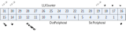

寄存器描述
====================

+--------------------------+---------------------------------------------------------+
| 名称                     | 描述                                                    |
+--------------------------+---------------------------------------------------------+
| `DMA_IntStatus`_         | Interrupt status                                        |
+--------------------------+---------------------------------------------------------+
| `DMA_IntTCStatus`_       | Interrupt terminal count request status                 |
+--------------------------+---------------------------------------------------------+
| `DMA_IntTCClear`_        | Terminal count request clear                            |
+--------------------------+---------------------------------------------------------+
| `DMA_IntErrorStatus`_    | Interrupt error status                                  |
+--------------------------+---------------------------------------------------------+
| `DMA_IntErrClr`_         | Interrupt error clear                                   |
+--------------------------+---------------------------------------------------------+
| `DMA_RawIntTCStatus`_    | Status of the terminal count interrupt prior to masking |
+--------------------------+---------------------------------------------------------+
| `DMA_RawIntErrorStatus`_ | Status of the error interrupt prior to masking          |
+--------------------------+---------------------------------------------------------+
| `DMA_EnbldChns`_         | Channel enable status                                   |
+--------------------------+---------------------------------------------------------+
| `DMA_SoftBReq`_          | Software burst request                                  |
+--------------------------+---------------------------------------------------------+
| `DMA_SoftSReq`_          | Software single request                                 |
+--------------------------+---------------------------------------------------------+
| `DMA_SoftLBReq`_         | Software last burst request                             |
+--------------------------+---------------------------------------------------------+
| `DMA_SoftLSReq`_         | Software last single request                            |
+--------------------------+---------------------------------------------------------+
| `DMA_Config`_            | DMA general configuration                               |
+--------------------------+---------------------------------------------------------+
| `DMA_Sync`_              | DMA request asynchronous setting                        |
+--------------------------+---------------------------------------------------------+
| `DMA_C0SrcAddr`_         | Channel DMA source address                              |
+--------------------------+---------------------------------------------------------+
| `DMA_C0DstAddr`_         | Channel DMA Destination address                         |
+--------------------------+---------------------------------------------------------+
| `DMA_C0LLI`_             | Channel DMA link list                                   |
+--------------------------+---------------------------------------------------------+
| `DMA_C0Control`_         | Channel DMA bus control                                 |
+--------------------------+---------------------------------------------------------+
| `DMA_C0Config`_          | Channel DMA configuration                               |
+--------------------------+---------------------------------------------------------+
| `DMA_C1SrcAddr`_         | Channel DMA source address                              |
+--------------------------+---------------------------------------------------------+
| `DMA_C1DstAddr`_         | Channel DMA Destination address                         |
+--------------------------+---------------------------------------------------------+
| `DMA_C1LLI`_             | Channel DMA link list                                   |
+--------------------------+---------------------------------------------------------+
| `DMA_C1Control`_         | Channel DMA bus control                                 |
+--------------------------+---------------------------------------------------------+
| `DMA_C1Config`_          | Channel DMA configuration                               |
+--------------------------+---------------------------------------------------------+
| `DMA_C2SrcAddr`_         | Channel DMA source address                              |
+--------------------------+---------------------------------------------------------+
| `DMA_C2DstAddr`_         | Channel DMA Destination address                         |
+--------------------------+---------------------------------------------------------+
| `DMA_C2LLI`_             | Channel DMA link list                                   |
+--------------------------+---------------------------------------------------------+
| `DMA_C2Control`_         | Channel DMA bus contro                                  |
+--------------------------+---------------------------------------------------------+
| `DMA_C2Config`_          | Channel DMA configuration                               |
+--------------------------+---------------------------------------------------------+
| `DMA_C3SrcAddr`_         | Channel DMA source address                              |
+--------------------------+---------------------------------------------------------+
| `DMA_C3DstAddr`_         | Channel DMA Destination address                         |
+--------------------------+---------------------------------------------------------+
| `DMA_C3LLI`_             | Channel DMA link list                                   |
+--------------------------+---------------------------------------------------------+
| `DMA_C3Control`_         | Channel DMA bus control                                 |
+--------------------------+---------------------------------------------------------+
| `DMA_C3Config`_          | Channel DMA configuration                               |
+--------------------------+---------------------------------------------------------+
| `DMA_C4SrcAddr`_         | Channel DMA source address                              |
+--------------------------+---------------------------------------------------------+
| `DMA_C4DstAddr`_         | Channel DMA Destination address                         |
+--------------------------+---------------------------------------------------------+
| `DMA_C4LLI`_             | Channel DMA link list                                   |
+--------------------------+---------------------------------------------------------+
| `DMA_C4Control`_         | Channel DMA bus control                                 |
+--------------------------+---------------------------------------------------------+
| `DMA_C4Config`_          | Channel DMA configuration                               |
+--------------------------+---------------------------------------------------------+
| `DMA_C5SrcAddr`_         | Channel DMA source address                              |
+--------------------------+---------------------------------------------------------+
| `DMA_C5DstAddr`_         | Channel DMA Destination address                         |
+--------------------------+---------------------------------------------------------+
| `DMA_C5LLI`_             | Channel DMA link list                                   |
+--------------------------+---------------------------------------------------------+
| `DMA_C5Control`_         | Channel DMA bus control                                 |
+--------------------------+---------------------------------------------------------+
| `DMA_C5Config`_          | Channel DMA configuration                               |
+--------------------------+---------------------------------------------------------+
| `DMA_C6SrcAddr`_         | Channel DMA source address                              |
+--------------------------+---------------------------------------------------------+
| `DMA_C6DstAddr`_         | Channel DMA Destination address                         |
+--------------------------+---------------------------------------------------------+
| `DMA_C6LLI`_             | Channel DMA link list                                   |
+--------------------------+---------------------------------------------------------+
| `DMA_C6Control`_         | Channel DMA bus control                                 |
+--------------------------+---------------------------------------------------------+
| `DMA_C6Config`_          | Channel DMA configuration                               |
+--------------------------+---------------------------------------------------------+
| `DMA_C7SrcAddr`_         | Channel DMA source address                              |
+--------------------------+---------------------------------------------------------+
| `DMA_C7DstAddr`_         | Channel DMA Destination address                         |
+--------------------------+---------------------------------------------------------+
| `DMA_C7LLI`_             | Channel DMA link list                                   |
+--------------------------+---------------------------------------------------------+
| `DMA_C7Control`_         | Channel DMA bus control                                 |
+--------------------------+---------------------------------------------------------+
| `DMA_C7Config`_          | Channel DMA configuration                               |
+--------------------------+---------------------------------------------------------+

DMA_IntStatus
---------------
 
**地址：**  0x4000c000
 
.. figure:: ../../picture/dma_DMA_IntStatus.svg
   :align: center

.. table::
    :widths: 10, 15,10,10,55
    :width: 100%
    :align: center
     
    +----------+------------------------------+--------+-------------+--------------------------------------------+
    | 位       | 名称                         |权限    | 复位值      | 描述                                       |
    +==========+==============================+========+=============+============================================+
    | 31:8     | RSVD                         |        |             |                                            |
    +----------+------------------------------+--------+-------------+--------------------------------------------+
    | 7:0      | IntStatus                    | r      | 0           | Status of the DMA interrupts after masking |
    +----------+------------------------------+--------+-------------+--------------------------------------------+

DMA_IntTCStatus
-----------------
 
**地址：**  0x4000c004
 

.. table::
    :widths: 10, 15,10,10,55
    :width: 100%
    :align: center
     
    +----------+------------------------------+--------+-------------+-----------------------------------------+
    | 位       | 名称                         |权限    | 复位值      | 描述                                    |
    +==========+==============================+========+=============+=========================================+
    | 31:8     | RSVD                         |        |             |                                         |
    +----------+------------------------------+--------+-------------+-----------------------------------------+
    | 7:0      | IntTCStatus                  | r      | 0           | Interrupt terminal count request status |
    +----------+------------------------------+--------+-------------+-----------------------------------------+

DMA_IntTCClear
----------------
 
**地址：**  0x4000c008
 

.. table::
    :widths: 10, 15,10,10,55
    :width: 100%
    :align: center
     
    +----------+------------------------------+--------+-------------+------------------------------+
    | 位       | 名称                         |权限    | 复位值      | 描述                         |
    +==========+==============================+========+=============+==============================+
    | 31:8     | RSVD                         |        |             |                              |
    +----------+------------------------------+--------+-------------+------------------------------+
    | 7:0      | IntTCClear                   | w      | 0           | Terminal count request clear |
    +----------+------------------------------+--------+-------------+------------------------------+

DMA_IntErrorStatus
--------------------
 
**地址：**  0x4000c00c
 

.. table::
    :widths: 10, 15,10,10,55
    :width: 100%
    :align: center
     
    +----------+------------------------------+--------+-------------+------------------------+
    | 位       | 名称                         |权限    | 复位值      | 描述                   |
    +==========+==============================+========+=============+========================+
    | 31:8     | RSVD                         |        |             |                        |
    +----------+------------------------------+--------+-------------+------------------------+
    | 7:0      | IntErrorStatus               | r      | 0           | Interrupt error status |
    +----------+------------------------------+--------+-------------+------------------------+

DMA_IntErrClr
---------------
 
**地址：**  0x4000c010
 
.. figure:: ../../picture/dma_DMA_IntErrClr.svg
   :align: center

.. table::
    :widths: 10, 15,10,10,55
    :width: 100%
    :align: center
     
    +----------+------------------------------+--------+-------------+-----------------------+
    | 位       | 名称                         |权限    | 复位值      | 描述                  |
    +==========+==============================+========+=============+=======================+
    | 31:8     | RSVD                         |        |             |                       |
    +----------+------------------------------+--------+-------------+-----------------------+
    | 7:0      | IntErrClr                    | w      | 0           | Interrupt error clear |
    +----------+------------------------------+--------+-------------+-----------------------+

DMA_RawIntTCStatus
--------------------
 
**地址：**  0x4000c014
 
.. figure:: ../../picture/dma_DMA_RawIntTCStatus.svg
   :align: center

.. table::
    :widths: 10, 15,10,10,55
    :width: 100%
    :align: center
     
    +----------+------------------------------+--------+-------------+---------------------------------------------------------+
    | 位       | 名称                         |权限    | 复位值      | 描述                                                    |
    +==========+==============================+========+=============+=========================================================+
    | 31:8     | RSVD                         |        |             |                                                         |
    +----------+------------------------------+--------+-------------+---------------------------------------------------------+
    | 7:0      | RawIntTCStatus               | r      | 0           | Status of the terminal count interrupt prior to masking |
    +----------+------------------------------+--------+-------------+---------------------------------------------------------+

DMA_RawIntErrorStatus
-----------------------
 
**地址：**  0x4000c018
 

.. table::
    :widths: 10, 15,10,10,55
    :width: 100%
    :align: center
     
    +----------+------------------------------+--------+-------------+------------------------------------------------+
    | 位       | 名称                         |权限    | 复位值      | 描述                                           |
    +==========+==============================+========+=============+================================================+
    | 31:8     | RSVD                         |        |             |                                                |
    +----------+------------------------------+--------+-------------+------------------------------------------------+
    | 7:0      | RawIntErrorStatus            | r      | 0           | Status of the error interrupt prior to masking |
    +----------+------------------------------+--------+-------------+------------------------------------------------+

DMA_EnbldChns
---------------
 
**地址：**  0x4000c01c
 

.. table::
    :widths: 10, 15,10,10,55
    :width: 100%
    :align: center
     
    +----------+------------------------------+--------+-------------+-----------------------+
    | 位       | 名称                         |权限    | 复位值      | 描述                  |
    +==========+==============================+========+=============+=======================+
    | 31:8     | RSVD                         |        |             |                       |
    +----------+------------------------------+--------+-------------+-----------------------+
    | 7:0      | EnabledChannels              | r      | 0           | Channel enable status |
    +----------+------------------------------+--------+-------------+-----------------------+

DMA_SoftBReq
--------------
 
**地址：**  0x4000c020
 
.. figure:: ../../picture/dma_DMA_SoftBReq.svg
   :align: center

.. table::
    :widths: 10, 15,10,10,55
    :width: 100%
    :align: center
     
    +----------+------------------------------+--------+-------------+------------------------+
    | 位       | 名称                         |权限    | 复位值      | 描述                   |
    +==========+==============================+========+=============+========================+
    | 31:0     | SoftBReq                     | r/w    | 0           | Software burst request |
    +----------+------------------------------+--------+-------------+------------------------+

DMA_SoftSReq
--------------
 
**地址：**  0x4000c024
 
.. figure:: ../../picture/dma_DMA_SoftSReq.svg
   :align: center

.. table::
    :widths: 10, 15,10,10,55
    :width: 100%
    :align: center
     
    +----------+------------------------------+--------+-------------+-------------------------+
    | 位       | 名称                         |权限    | 复位值      | 描述                    |
    +==========+==============================+========+=============+=========================+
    | 31:0     | SoftSReq                     | r/w    | 0           | Software single request |
    +----------+------------------------------+--------+-------------+-------------------------+

DMA_SoftLBReq
---------------
 
**地址：**  0x4000c028
 
.. figure:: ../../picture/dma_DMA_SoftLBReq.svg
   :align: center

.. table::
    :widths: 10, 15,10,10,55
    :width: 100%
    :align: center
     
    +----------+------------------------------+--------+-------------+-----------------------------+
    | 位       | 名称                         |权限    | 复位值      | 描述                        |
    +==========+==============================+========+=============+=============================+
    | 31:0     | SoftLBReq                    | r/w    | 0           | Software last burst request |
    +----------+------------------------------+--------+-------------+-----------------------------+

DMA_SoftLSReq
---------------
 
**地址：**  0x4000c02c
 
.. figure:: ../../picture/dma_DMA_SoftLSReq.svg
   :align: center

.. table::
    :widths: 10, 15,10,10,55
    :width: 100%
    :align: center
     
    +----------+------------------------------+--------+-------------+------------------------------+
    | 位       | 名称                         |权限    | 复位值      | 描述                         |
    +==========+==============================+========+=============+==============================+
    | 31:0     | SoftLSReq                    | r/w    | 0           | Software last single request |
    +----------+------------------------------+--------+-------------+------------------------------+

DMA_Config
------------
 
**地址：**  0x4000c030
 
.. figure:: ../../picture/dma_DMA_Config.svg
   :align: center

.. table::
    :widths: 10, 15,10,10,55
    :width: 100%
    :align: center
     
    +----------+------------------------------+--------+-------------+------------------------------------------------------------------------+
    | 位       | 名称                         |权限    | 复位值      | 描述                                                                   |
    +==========+==============================+========+=============+========================================================================+
    | 31:2     | RSVD                         |        |             |                                                                        |
    +----------+------------------------------+--------+-------------+------------------------------------------------------------------------+
    | 1        | M                            | r/w    | 0           | AHB Master endianness configuration: 0 = little-endian, 1 = big-endian |
    +----------+------------------------------+--------+-------------+------------------------------------------------------------------------+
    | 0        | E                            | r/w    | 0           | SMDMA Enable.                                                          |
    +----------+------------------------------+--------+-------------+------------------------------------------------------------------------+

DMA_Sync
----------
 
**地址：**  0x4000c034
 
.. figure:: ../../picture/dma_DMA_Sync.svg
   :align: center

.. table::
    :widths: 10, 15,10,10,55
    :width: 100%
    :align: center
     
    +----------+------------------------------+--------+-------------+----------------------------------------------------------------------------+
    | 位       | 名称                         |权限    | 复位值      | 描述                                                                       |
    +==========+==============================+========+=============+============================================================================+
    | 31:0     | DMA_Sync                     | r/w    | 0           | DMA synchronization logic for DMA request signals: 0 = enable, 1 = disable |
    +----------+------------------------------+--------+-------------+----------------------------------------------------------------------------+

DMA_C0SrcAddr
---------------
 
**地址：**  0x4000c100
 
.. figure:: ../../picture/dma_DMA_C0SrcAddr.svg
   :align: center

.. table::
    :widths: 10, 15,10,10,55
    :width: 100%
    :align: center
     
    +----------+------------------------------+--------+-------------+--------------------+
    | 位       | 名称                         |权限    | 复位值      | 描述               |
    +==========+==============================+========+=============+====================+
    | 31:0     | SrcAddr                      | r/w    | 0           | DMA source address |
    +----------+------------------------------+--------+-------------+--------------------+

DMA_C0DstAddr
---------------
 
**地址：**  0x4000c104
 
.. figure:: ../../picture/dma_DMA_C0DstAddr.svg
   :align: center

.. table::
    :widths: 10, 15,10,10,55
    :width: 100%
    :align: center
     
    +----------+------------------------------+--------+-------------+-------------------------+
    | 位       | 名称                         |权限    | 复位值      | 描述                    |
    +==========+==============================+========+=============+=========================+
    | 31:0     | DstAddr                      | r/w    | 0           | DMA Destination address |
    +----------+------------------------------+--------+-------------+-------------------------+

DMA_C0LLI
-----------
 
**地址：**  0x4000c108
 
.. figure:: ../../picture/dma_DMA_C0LLI.svg
   :align: center

.. table::
    :widths: 10, 15,10,10,55
    :width: 100%
    :align: center
     
    +----------+------------------------------+--------+-------------+-----------------------------------------------+
    | 位       | 名称                         |权限    | 复位值      | 描述                                          |
    +==========+==============================+========+=============+===============================================+
    | 31:0     | LLI                          | r/w    | 0           | First linked list item. Bits [1:0] must be 0. |
    +----------+------------------------------+--------+-------------+-----------------------------------------------+

DMA_C0Control
---------------
 
**地址：**  0x4000c10c
 

.. table::
    :widths: 10, 15,10,10,55
    :width: 100%
    :align: center
     
    +----------+------------------------------+--------+-------------+-------------------------------------------------------------------------------------------------------------------------------+
    | 位       | 名称                         |权限    | 复位值      | 描述                                                                                                                          |
    +==========+==============================+========+=============+===============================================================================================================================+
    | 31       | I                            | r/w    | 0           | Terminal count interrupt enable bit. It controls whether the current LLI is expected to trigger the terminal count interrupt. |
    +----------+------------------------------+--------+-------------+-------------------------------------------------------------------------------------------------------------------------------+
    | 30:28    | Prot                         | r/w    | 0           | Protection.                                                                                                                   |
    +----------+------------------------------+--------+-------------+-------------------------------------------------------------------------------------------------------------------------------+
    | 27       | DI                           | r/w    | 1           | Destination increment. When set, the Destination address is incremented after each transfer.                                  |
    +----------+------------------------------+--------+-------------+-------------------------------------------------------------------------------------------------------------------------------+
    | 26       | SI                           | r/w    | 1           | Source increment. When set, the source address is incremented after each transfer.                                            |
    +----------+------------------------------+--------+-------------+-------------------------------------------------------------------------------------------------------------------------------+
    | 25       | SLargerD                     | r/w    | 0           | In Memory-to-memory mode, Set this bit high when Src data size is larger than Dst.                                            |
    +----------+------------------------------+--------+-------------+-------------------------------------------------------------------------------------------------------------------------------+
    | 24:23    | fix_cnt                      | r/w    | 2'd0        | Only effect when dst_min_mode = 1                                                                                             |
    +          +                              +        +             +                                                                                                                               +
    |          |                              |        |             | Destination transfer cnt = (total src byte cnt - (fix_cnt<<DWidth))<<DWidth                                                   |
    +----------+------------------------------+--------+-------------+-------------------------------------------------------------------------------------------------------------------------------+
    | 22:21    | DWidth                       | r/w    | 2'b10       | Destination transfer width: 8/16/32                                                                                           |
    +----------+------------------------------+--------+-------------+-------------------------------------------------------------------------------------------------------------------------------+
    | 20       | RSVD                         |        |             |                                                                                                                               |
    +----------+------------------------------+--------+-------------+-------------------------------------------------------------------------------------------------------------------------------+
    | 19:18    | SWidth                       | r/w    | 2'b10       | Source transfer width: 8/16/32                                                                                                |
    +----------+------------------------------+--------+-------------+-------------------------------------------------------------------------------------------------------------------------------+
    | 17       | dst_add_mode                 | r/w    | 1'b0        | Add mode : issue remain destination traffic                                                                                   |
    +----------+------------------------------+--------+-------------+-------------------------------------------------------------------------------------------------------------------------------+
    | 16:15    | DBSize                       | r/w    | 2'b01       | Destination burst size: 1/4/8/16                                                                                              |
    +----------+------------------------------+--------+-------------+-------------------------------------------------------------------------------------------------------------------------------+
    | 14       | dst_min_mode                 | r/w    | 1'b0        | Minus mode : Not issue all destination traffic                                                                                |
    +----------+------------------------------+--------+-------------+-------------------------------------------------------------------------------------------------------------------------------+
    | 13:12    | SBSize                       | r/w    | 2'b01       | Source burst size: 1/4/8/16. Note CH FIFO Size is 16Bytes and SBSize*Swidth should <= 16B                                     |
    +----------+------------------------------+--------+-------------+-------------------------------------------------------------------------------------------------------------------------------+
    | 11:0     | TransferSize                 | r/w    | 0           | Transfer size: 0~4095. Number of data transfers left to complete when the SMDMA is the flow controller.                       |
    +----------+------------------------------+--------+-------------+-------------------------------------------------------------------------------------------------------------------------------+

DMA_C0Config
--------------
 
**地址：**  0x4000c110
 

.. table::
    :widths: 10, 15,10,10,55
    :width: 100%
    :align: center
     
    +----------+------------------------------+--------+-------------+-------------------------------------------------------------------------------+
    | 位       | 名称                         |权限    | 复位值      | 描述                                                                          |
    +==========+==============================+========+=============+===============================================================================+
    | 31:30    | RSVD                         |        |             |                                                                               |
    +----------+------------------------------+--------+-------------+-------------------------------------------------------------------------------+
    | 29:20    | LLICounter                   | r      | 0           | LLI counter. Increased 1 each LLI run. Cleared 0 when config Control.         |
    +----------+------------------------------+--------+-------------+-------------------------------------------------------------------------------+
    | 19       | RSVD                         |        |             |                                                                               |
    +----------+------------------------------+--------+-------------+-------------------------------------------------------------------------------+
    | 18       | H                            | r/w    | 0           | Halt: 0 = enable DMA requests, 1 = ignore subsequent source DMA requests.     |
    +----------+------------------------------+--------+-------------+-------------------------------------------------------------------------------+
    | 17       | A                            | r      | 0           | Active: 0 = no data in FIFO of the channel, 1 = FIFO of the channel has data. |
    +----------+------------------------------+--------+-------------+-------------------------------------------------------------------------------+
    | 16       | L                            | r/w    | 0           | Lock.                                                                         |
    +----------+------------------------------+--------+-------------+-------------------------------------------------------------------------------+
    | 15       | ITC                          | r/w    | 0           | Terminal count interrupt mask.                                                |
    +----------+------------------------------+--------+-------------+-------------------------------------------------------------------------------+
    | 14       | IE                           | r/w    | 0           | Interrupt error mask.                                                         |
    +----------+------------------------------+--------+-------------+-------------------------------------------------------------------------------+
    | 13:11    | FlowCntrl                    | r/w    | 0           | 000: Memory-to-memory (DMA)                                                   |
    +          +                              +        +             +                                                                               +
    |          |                              |        |             | 001: Memory-to-peripheral (DMA)                                               |
    +          +                              +        +             +                                                                               +
    |          |                              |        |             | 010: Peripheral-to-memory (DMA)                                               |
    +          +                              +        +             +                                                                               +
    |          |                              |        |             | 011: Source peripheral-to-Destination peripheral (DMA)                        |
    +          +                              +        +             +                                                                               +
    |          |                              |        |             | 100: Source peripheral-to-Destination peripheral (Destination peripheral)     |
    +          +                              +        +             +                                                                               +
    |          |                              |        |             | 101: Memory-to-peripheral (peripheral)                                        |
    +          +                              +        +             +                                                                               +
    |          |                              |        |             | 110: Peripheral-to-memory (peripheral)                                        |
    +          +                              +        +             +                                                                               +
    |          |                              |        |             | 111: Source peripheral-to-Destination peripheral (Source peripheral)          |
    +----------+------------------------------+--------+-------------+-------------------------------------------------------------------------------+
    | 10:6     | DstPeripheral                | r/w    | 0           | Destination peripheral.                                                       |
    +          +                              +        +             +                                                                               +
    |          |                              |        |             | [23:22] GPADC                                                                 |
    +          +                              +        +             +                                                                               +
    |          |                              |        |             | [21:18] I2S                                                                   |
    +          +                              +        +             +                                                                               +
    |          |                              |        |             | [17:14] PDM                                                                   |
    +          +                              +        +             +                                                                               +
    |          |                              |        |             | [13:10] SSP                                                                   |
    +          +                              +        +             +                                                                               +
    |          |                              |        |             | [ 9: 6] I2C                                                                   |
    +          +                              +        +             +                                                                               +
    |          |                              |        |             | [ 5: 0] UART                                                                  |
    +----------+------------------------------+--------+-------------+-------------------------------------------------------------------------------+
    | 5:1      | SrcPeripheral                | r/w    | 0           | Source peripheral.                                                            |
    +----------+------------------------------+--------+-------------+-------------------------------------------------------------------------------+
    | 0        | E                            | r/w    | 0           | Channel enable.                                                               |
    +----------+------------------------------+--------+-------------+-------------------------------------------------------------------------------+

DMA_C1SrcAddr
---------------
 
**地址：**  0x4000c200
 

.. table::
    :widths: 10, 15,10,10,55
    :width: 100%
    :align: center
     
    +----------+------------------------------+--------+-------------+-----+
    | 位       | 名称                         |权限    | 复位值      | 描述|
    +==========+==============================+========+=============+=====+
    | 31:0     | SrcAddr                      | r/w    | 0           |     |
    +----------+------------------------------+--------+-------------+-----+

DMA_C1DstAddr
---------------
 
**地址：**  0x4000c204
 
.. figure:: ../../picture/dma_DMA_C1DstAddr.svg
   :align: center

.. table::
    :widths: 10, 15,10,10,55
    :width: 100%
    :align: center
     
    +----------+------------------------------+--------+-------------+-----+
    | 位       | 名称                         |权限    | 复位值      | 描述|
    +==========+==============================+========+=============+=====+
    | 31:0     | DstAddr                      | r/w    | 0           |     |
    +----------+------------------------------+--------+-------------+-----+

DMA_C1LLI
-----------
 
**地址：**  0x4000c208
 

.. table::
    :widths: 10, 15,10,10,55
    :width: 100%
    :align: center
     
    +----------+------------------------------+--------+-------------+-----+
    | 位       | 名称                         |权限    | 复位值      | 描述|
    +==========+==============================+========+=============+=====+
    | 31:2     | LLI                          | r/w    | 0           |     |
    +----------+------------------------------+--------+-------------+-----+
    | 1:0      | RSVD                         |        |             |     |
    +----------+------------------------------+--------+-------------+-----+

DMA_C1Control
---------------
 
**地址：**  0x4000c20c
 
.. figure:: ../../picture/dma_DMA_C1Control.svg
   :align: center

.. table::
    :widths: 10, 15,10,10,55
    :width: 100%
    :align: center
     
    +----------+------------------------------+--------+-------------+-----+
    | 位       | 名称                         |权限    | 复位值      | 描述|
    +==========+==============================+========+=============+=====+
    | 31       | I                            | r/w    | 0           |     |
    +----------+------------------------------+--------+-------------+-----+
    | 30:28    | Prot                         | r/w    | 0           |     |
    +----------+------------------------------+--------+-------------+-----+
    | 27       | DI                           | r/w    | 1           |     |
    +----------+------------------------------+--------+-------------+-----+
    | 26       | SI                           | r/w    | 1           |     |
    +----------+------------------------------+--------+-------------+-----+
    | 25       | RSVD                         |        |             |     |
    +----------+------------------------------+--------+-------------+-----+
    | 24:23    | fix_cnt                      | r/w    | 2'd0        |     |
    +----------+------------------------------+--------+-------------+-----+
    | 22:24    | RSVD                         |        |             |     |
    +----------+------------------------------+--------+-------------+-----+
    | 23:21    | DWidth                       | r/w    | 3'b010      |     |
    +----------+------------------------------+--------+-------------+-----+
    | 20:18    | SWidth                       | r/w    | 3'b010      |     |
    +----------+------------------------------+--------+-------------+-----+
    | 17       | dst_add_mode                 | r/w    | 1'b0        |     |
    +----------+------------------------------+--------+-------------+-----+
    | 16:15    | DBSize                       | r/w    | 3'b001      |     |
    +----------+------------------------------+--------+-------------+-----+
    | 14       | dst_min_mode                 | r/w    | 1'b0        |     |
    +----------+------------------------------+--------+-------------+-----+
    | 13:12    | SBSize                       | r/w    | 3'b001      |     |
    +----------+------------------------------+--------+-------------+-----+
    | 11:0     | TransferSize                 | r/w    | 0           |     |
    +----------+------------------------------+--------+-------------+-----+

DMA_C1Config
--------------
 
**地址：**  0x4000c210
 
.. figure:: ../../picture/dma_DMA_C1Config.svg
   :align: center

.. table::
    :widths: 10, 15,10,10,55
    :width: 100%
    :align: center
     
    +----------+------------------------------+--------+-------------+-----+
    | 位       | 名称                         |权限    | 复位值      | 描述|
    +==========+==============================+========+=============+=====+
    | 31:19    | RSVD                         |        |             |     |
    +----------+------------------------------+--------+-------------+-----+
    | 18       | H                            | r/w    | 0           |     |
    +----------+------------------------------+--------+-------------+-----+
    | 17       | A                            | r      | 0           |     |
    +----------+------------------------------+--------+-------------+-----+
    | 16       | L                            | r/w    | 0           |     |
    +----------+------------------------------+--------+-------------+-----+
    | 15       | ITC                          | r/w    | 0           |     |
    +----------+------------------------------+--------+-------------+-----+
    | 14       | IE                           | r/w    | 0           |     |
    +----------+------------------------------+--------+-------------+-----+
    | 13:11    | FlowCntrl                    | r/w    | 0           |     |
    +----------+------------------------------+--------+-------------+-----+
    | 10:6     | DstPeripheral                | r/w    | 0           |     |
    +----------+------------------------------+--------+-------------+-----+
    | 5:1      | SrcPeripheral                | r/w    | 0           |     |
    +----------+------------------------------+--------+-------------+-----+
    | 0        | E                            | r/w    | 0           |     |
    +----------+------------------------------+--------+-------------+-----+

DMA_C2SrcAddr
---------------
 
**地址：**  0x4000c300
 
.. figure:: ../../picture/dma_DMA_C2SrcAddr.svg
   :align: center

.. table::
    :widths: 10, 15,10,10,55
    :width: 100%
    :align: center
     
    +----------+------------------------------+--------+-------------+-----+
    | 位       | 名称                         |权限    | 复位值      | 描述|
    +==========+==============================+========+=============+=====+
    | 31:0     | SrcAddr                      | r/w    | 0           |     |
    +----------+------------------------------+--------+-------------+-----+

DMA_C2DstAddr
---------------
 
**地址：**  0x4000c304
 
.. figure:: ../../picture/dma_DMA_C2DstAddr.svg
   :align: center

.. table::
    :widths: 10, 15,10,10,55
    :width: 100%
    :align: center
     
    +----------+------------------------------+--------+-------------+-----+
    | 位       | 名称                         |权限    | 复位值      | 描述|
    +==========+==============================+========+=============+=====+
    | 31:0     | DstAddr                      | r/w    | 0           |     |
    +----------+------------------------------+--------+-------------+-----+

DMA_C2LLI
-----------
 
**地址：**  0x4000c308
 
.. figure:: ../../picture/dma_DMA_C2LLI.svg
   :align: center

.. table::
    :widths: 10, 15,10,10,55
    :width: 100%
    :align: center
     
    +----------+------------------------------+--------+-------------+-----+
    | 位       | 名称                         |权限    | 复位值      | 描述|
    +==========+==============================+========+=============+=====+
    | 31:2     | LLI                          | r/w    | 0           |     |
    +----------+------------------------------+--------+-------------+-----+
    | 1:0      | RSVD                         |        |             |     |
    +----------+------------------------------+--------+-------------+-----+

DMA_C2Control
---------------
 
**地址：**  0x4000c30c
 
.. figure:: ../../picture/dma_DMA_C2Control.svg
   :align: center

.. table::
    :widths: 10, 15,10,10,55
    :width: 100%
    :align: center
     
    +----------+------------------------------+--------+-------------+-----+
    | 位       | 名称                         |权限    | 复位值      | 描述|
    +==========+==============================+========+=============+=====+
    | 31       | I                            | r/w    | 0           |     |
    +----------+------------------------------+--------+-------------+-----+
    | 30:28    | Prot                         | r/w    | 0           |     |
    +----------+------------------------------+--------+-------------+-----+
    | 27       | DI                           | r/w    | 1           |     |
    +----------+------------------------------+--------+-------------+-----+
    | 26       | SI                           | r/w    | 1           |     |
    +----------+------------------------------+--------+-------------+-----+
    | 25       | RSVD                         |        |             |     |
    +----------+------------------------------+--------+-------------+-----+
    | 24:23    | fix_cnt                      | r/w    | 2'd0        |     |
    +----------+------------------------------+--------+-------------+-----+
    | 22:24    | RSVD                         |        |             |     |
    +----------+------------------------------+--------+-------------+-----+
    | 23:21    | DWidth                       | r/w    | 3'b010      |     |
    +----------+------------------------------+--------+-------------+-----+
    | 20:18    | SWidth                       | r/w    | 3'b010      |     |
    +----------+------------------------------+--------+-------------+-----+
    | 17       | dst_add_mode                 | r/w    | 1'b0        |     |
    +----------+------------------------------+--------+-------------+-----+
    | 16:15    | DBSize                       | r/w    | 3'b001      |     |
    +----------+------------------------------+--------+-------------+-----+
    | 14       | dst_min_mode                 | r/w    | 1'b0        |     |
    +----------+------------------------------+--------+-------------+-----+
    | 13:12    | SBSize                       | r/w    | 3'b001      |     |
    +----------+------------------------------+--------+-------------+-----+
    | 11:0     | TransferSize                 | r/w    | 0           |     |
    +----------+------------------------------+--------+-------------+-----+

DMA_C2Config
--------------
 
**地址：**  0x4000c310
 
.. figure:: ../../picture/dma_DMA_C2Config.svg
   :align: center

.. table::
    :widths: 10, 15,10,10,55
    :width: 100%
    :align: center
     
    +----------+------------------------------+--------+-------------+-----+
    | 位       | 名称                         |权限    | 复位值      | 描述|
    +==========+==============================+========+=============+=====+
    | 31:19    | RSVD                         |        |             |     |
    +----------+------------------------------+--------+-------------+-----+
    | 18       | H                            | r/w    | 0           |     |
    +----------+------------------------------+--------+-------------+-----+
    | 17       | A                            | r      | 0           |     |
    +----------+------------------------------+--------+-------------+-----+
    | 16       | L                            | r/w    | 0           |     |
    +----------+------------------------------+--------+-------------+-----+
    | 15       | ITC                          | r/w    | 0           |     |
    +----------+------------------------------+--------+-------------+-----+
    | 14       | IE                           | r/w    | 0           |     |
    +----------+------------------------------+--------+-------------+-----+
    | 13:11    | FlowCntrl                    | r/w    | 0           |     |
    +----------+------------------------------+--------+-------------+-----+
    | 10:6     | DstPeripheral                | r/w    | 0           |     |
    +----------+------------------------------+--------+-------------+-----+
    | 5:1      | SrcPeripheral                | r/w    | 0           |     |
    +----------+------------------------------+--------+-------------+-----+
    | 0        | E                            | r/w    | 0           |     |
    +----------+------------------------------+--------+-------------+-----+

DMA_C3SrcAddr
---------------
 
**地址：**  0x4000c400
 
.. figure:: ../../picture/dma_DMA_C3SrcAddr.svg
   :align: center

.. table::
    :widths: 10, 15,10,10,55
    :width: 100%
    :align: center
     
    +----------+------------------------------+--------+-------------+-----+
    | 位       | 名称                         |权限    | 复位值      | 描述|
    +==========+==============================+========+=============+=====+
    | 31:0     | SrcAddr                      | r/w    | 0           |     |
    +----------+------------------------------+--------+-------------+-----+

DMA_C3DstAddr
---------------
 
**地址：**  0x4000c404
 
.. figure:: ../../picture/dma_DMA_C3DstAddr.svg
   :align: center

.. table::
    :widths: 10, 15,10,10,55
    :width: 100%
    :align: center
     
    +----------+------------------------------+--------+-------------+-----+
    | 位       | 名称                         |权限    | 复位值      | 描述|
    +==========+==============================+========+=============+=====+
    | 31:0     | DstAddr                      | r/w    | 0           |     |
    +----------+------------------------------+--------+-------------+-----+

DMA_C3LLI
-----------
 
**地址：**  0x4000c408
 

.. table::
    :widths: 10, 15,10,10,55
    :width: 100%
    :align: center
     
    +----------+------------------------------+--------+-------------+-----+
    | 位       | 名称                         |权限    | 复位值      | 描述|
    +==========+==============================+========+=============+=====+
    | 31:2     | LLI                          | r/w    | 0           |     |
    +----------+------------------------------+--------+-------------+-----+
    | 1:0      | RSVD                         |        |             |     |
    +----------+------------------------------+--------+-------------+-----+

DMA_C3Control
---------------
 
**地址：**  0x4000c40c
 
.. figure:: ../../picture/dma_DMA_C3Control.svg
   :align: center

.. table::
    :widths: 10, 15,10,10,55
    :width: 100%
    :align: center
     
    +----------+------------------------------+--------+-------------+-----+
    | 位       | 名称                         |权限    | 复位值      | 描述|
    +==========+==============================+========+=============+=====+
    | 31       | I                            | r/w    | 0           |     |
    +----------+------------------------------+--------+-------------+-----+
    | 30:28    | Prot                         | r/w    | 0           |     |
    +----------+------------------------------+--------+-------------+-----+
    | 27       | DI                           | r/w    | 1           |     |
    +----------+------------------------------+--------+-------------+-----+
    | 26       | SI                           | r/w    | 1           |     |
    +----------+------------------------------+--------+-------------+-----+
    | 25       | RSVD                         |        |             |     |
    +----------+------------------------------+--------+-------------+-----+
    | 24:23    | fix_cnt                      | r/w    | 2'd0        |     |
    +----------+------------------------------+--------+-------------+-----+
    | 22:24    | RSVD                         |        |             |     |
    +----------+------------------------------+--------+-------------+-----+
    | 23:21    | DWidth                       | r/w    | 3'b010      |     |
    +----------+------------------------------+--------+-------------+-----+
    | 20:18    | SWidth                       | r/w    | 3'b010      |     |
    +----------+------------------------------+--------+-------------+-----+
    | 17       | dst_add_mode                 | r/w    | 1'b0        |     |
    +----------+------------------------------+--------+-------------+-----+
    | 16:15    | DBSize                       | r/w    | 3'b001      |     |
    +----------+------------------------------+--------+-------------+-----+
    | 14       | dst_min_mode                 | r/w    | 1'b0        |     |
    +----------+------------------------------+--------+-------------+-----+
    | 13:12    | SBSize                       | r/w    | 3'b001      |     |
    +----------+------------------------------+--------+-------------+-----+
    | 11:0     | TransferSize                 | r/w    | 0           |     |
    +----------+------------------------------+--------+-------------+-----+

DMA_C3Config
--------------
 
**地址：**  0x4000c410
 
.. figure:: ../../picture/dma_DMA_C3Config.svg
   :align: center

.. table::
    :widths: 10, 15,10,10,55
    :width: 100%
    :align: center
     
    +----------+------------------------------+--------+-------------+-----+
    | 位       | 名称                         |权限    | 复位值      | 描述|
    +==========+==============================+========+=============+=====+
    | 31:19    | RSVD                         |        |             |     |
    +----------+------------------------------+--------+-------------+-----+
    | 18       | H                            | r/w    | 0           |     |
    +----------+------------------------------+--------+-------------+-----+
    | 17       | A                            | r      | 0           |     |
    +----------+------------------------------+--------+-------------+-----+
    | 16       | L                            | r/w    | 0           |     |
    +----------+------------------------------+--------+-------------+-----+
    | 15       | ITC                          | r/w    | 0           |     |
    +----------+------------------------------+--------+-------------+-----+
    | 14       | IE                           | r/w    | 0           |     |
    +----------+------------------------------+--------+-------------+-----+
    | 13:11    | FlowCntrl                    | r/w    | 0           |     |
    +----------+------------------------------+--------+-------------+-----+
    | 10:6     | DstPeripheral                | r/w    | 0           |     |
    +----------+------------------------------+--------+-------------+-----+
    | 5:1      | SrcPeripheral                | r/w    | 0           |     |
    +----------+------------------------------+--------+-------------+-----+
    | 0        | E                            | r/w    | 0           |     |
    +----------+------------------------------+--------+-------------+-----+

DMA_C4SrcAddr
---------------
 
**地址：**  0x4000c500
 

.. table::
    :widths: 10, 15,10,10,55
    :width: 100%
    :align: center
     
    +----------+------------------------------+--------+-------------+-----+
    | 位       | 名称                         |权限    | 复位值      | 描述|
    +==========+==============================+========+=============+=====+
    | 31:0     | SrcAddr                      | r/w    | 0           |     |
    +----------+------------------------------+--------+-------------+-----+

DMA_C4DstAddr
---------------
 
**地址：**  0x4000c504
 

.. table::
    :widths: 10, 15,10,10,55
    :width: 100%
    :align: center
     
    +----------+------------------------------+--------+-------------+-----+
    | 位       | 名称                         |权限    | 复位值      | 描述|
    +==========+==============================+========+=============+=====+
    | 31:0     | DstAddr                      | r/w    | 0           |     |
    +----------+------------------------------+--------+-------------+-----+

DMA_C4LLI
-----------
 
**地址：**  0x4000c508
 

.. table::
    :widths: 10, 15,10,10,55
    :width: 100%
    :align: center
     
    +----------+------------------------------+--------+-------------+-----+
    | 位       | 名称                         |权限    | 复位值      | 描述|
    +==========+==============================+========+=============+=====+
    | 31:2     | LLI                          | r/w    | 0           |     |
    +----------+------------------------------+--------+-------------+-----+
    | 1:0      | RSVD                         |        |             |     |
    +----------+------------------------------+--------+-------------+-----+

DMA_C4Control
---------------
 
**地址：**  0x4000c50c
 
.. figure:: ../../picture/dma_DMA_C4Control.svg
   :align: center

.. table::
    :widths: 10, 15,10,10,55
    :width: 100%
    :align: center
     
    +----------+------------------------------+--------+-------------+-----+
    | 位       | 名称                         |权限    | 复位值      | 描述|
    +==========+==============================+========+=============+=====+
    | 31       | I                            | r/w    | 0           |     |
    +----------+------------------------------+--------+-------------+-----+
    | 30:28    | Prot                         | r/w    | 0           |     |
    +----------+------------------------------+--------+-------------+-----+
    | 27       | DI                           | r/w    | 1           |     |
    +----------+------------------------------+--------+-------------+-----+
    | 26       | SI                           | r/w    | 1           |     |
    +----------+------------------------------+--------+-------------+-----+
    | 25       | RSVD                         |        |             |     |
    +----------+------------------------------+--------+-------------+-----+
    | 24:23    | fix_cnt                      | r/w    | 2'd0        |     |
    +----------+------------------------------+--------+-------------+-----+
    | 22:24    | RSVD                         |        |             |     |
    +----------+------------------------------+--------+-------------+-----+
    | 23:21    | DWidth                       | r/w    | 3'b010      |     |
    +----------+------------------------------+--------+-------------+-----+
    | 20:18    | SWidth                       | r/w    | 3'b010      |     |
    +----------+------------------------------+--------+-------------+-----+
    | 17       | dst_add_mode                 | r/w    | 1'b0        |     |
    +----------+------------------------------+--------+-------------+-----+
    | 16:15    | DBSize                       | r/w    | 3'b001      |     |
    +----------+------------------------------+--------+-------------+-----+
    | 14       | dst_min_mode                 | r/w    | 1'b0        |     |
    +----------+------------------------------+--------+-------------+-----+
    | 13:12    | SBSize                       | r/w    | 3'b001      |     |
    +----------+------------------------------+--------+-------------+-----+
    | 11:0     | TransferSize                 | r/w    | 0           |     |
    +----------+------------------------------+--------+-------------+-----+

DMA_C4Config
--------------
 
**地址：**  0x4000c510
 
.. figure:: ../../picture/dma_DMA_C4Config.svg
   :align: center

.. table::
    :widths: 10, 15,10,10,55
    :width: 100%
    :align: center
     
    +----------+------------------------------+--------+-------------+-----+
    | 位       | 名称                         |权限    | 复位值      | 描述|
    +==========+==============================+========+=============+=====+
    | 31:19    | RSVD                         |        |             |     |
    +----------+------------------------------+--------+-------------+-----+
    | 18       | H                            | r/w    | 0           |     |
    +----------+------------------------------+--------+-------------+-----+
    | 17       | A                            | r      | 0           |     |
    +----------+------------------------------+--------+-------------+-----+
    | 16       | L                            | r/w    | 0           |     |
    +----------+------------------------------+--------+-------------+-----+
    | 15       | ITC                          | r/w    | 0           |     |
    +----------+------------------------------+--------+-------------+-----+
    | 14       | IE                           | r/w    | 0           |     |
    +----------+------------------------------+--------+-------------+-----+
    | 13:11    | FlowCntrl                    | r/w    | 0           |     |
    +----------+------------------------------+--------+-------------+-----+
    | 10:6     | DstPeripheral                | r/w    | 0           |     |
    +----------+------------------------------+--------+-------------+-----+
    | 5:1      | SrcPeripheral                | r/w    | 0           |     |
    +----------+------------------------------+--------+-------------+-----+
    | 0        | E                            | r/w    | 0           |     |
    +----------+------------------------------+--------+-------------+-----+

DMA_C5SrcAddr
---------------
 
**地址：**  0x4000c600
 
.. figure:: ../../picture/dma_DMA_C5SrcAddr.svg
   :align: center

.. table::
    :widths: 10, 15,10,10,55
    :width: 100%
    :align: center
     
    +----------+------------------------------+--------+-------------+-----+
    | 位       | 名称                         |权限    | 复位值      | 描述|
    +==========+==============================+========+=============+=====+
    | 31:0     | SrcAddr                      | r/w    | 0           |     |
    +----------+------------------------------+--------+-------------+-----+

DMA_C5DstAddr
---------------
 
**地址：**  0x4000c604
 
.. figure:: ../../picture/dma_DMA_C5DstAddr.svg
   :align: center

.. table::
    :widths: 10, 15,10,10,55
    :width: 100%
    :align: center
     
    +----------+------------------------------+--------+-------------+-----+
    | 位       | 名称                         |权限    | 复位值      | 描述|
    +==========+==============================+========+=============+=====+
    | 31:0     | DstAddr                      | r/w    | 0           |     |
    +----------+------------------------------+--------+-------------+-----+

DMA_C5LLI
-----------
 
**地址：**  0x4000c608
 
.. figure:: ../../picture/dma_DMA_C5LLI.svg
   :align: center

.. table::
    :widths: 10, 15,10,10,55
    :width: 100%
    :align: center
     
    +----------+------------------------------+--------+-------------+-----+
    | 位       | 名称                         |权限    | 复位值      | 描述|
    +==========+==============================+========+=============+=====+
    | 31:2     | LLI                          | r/w    | 0           |     |
    +----------+------------------------------+--------+-------------+-----+
    | 1:0      | RSVD                         |        |             |     |
    +----------+------------------------------+--------+-------------+-----+

DMA_C5Control
---------------
 
**地址：**  0x4000c60c
 

.. table::
    :widths: 10, 15,10,10,55
    :width: 100%
    :align: center
     
    +----------+------------------------------+--------+-------------+-----+
    | 位       | 名称                         |权限    | 复位值      | 描述|
    +==========+==============================+========+=============+=====+
    | 31       | I                            | r/w    | 0           |     |
    +----------+------------------------------+--------+-------------+-----+
    | 30:28    | Prot                         | r/w    | 0           |     |
    +----------+------------------------------+--------+-------------+-----+
    | 27       | DI                           | r/w    | 1           |     |
    +----------+------------------------------+--------+-------------+-----+
    | 26       | SI                           | r/w    | 1           |     |
    +----------+------------------------------+--------+-------------+-----+
    | 25       | RSVD                         |        |             |     |
    +----------+------------------------------+--------+-------------+-----+
    | 24:23    | fix_cnt                      | r/w    | 2'd0        |     |
    +----------+------------------------------+--------+-------------+-----+
    | 22:24    | RSVD                         |        |             |     |
    +----------+------------------------------+--------+-------------+-----+
    | 23:21    | DWidth                       | r/w    | 3'b010      |     |
    +----------+------------------------------+--------+-------------+-----+
    | 20:18    | SWidth                       | r/w    | 3'b010      |     |
    +----------+------------------------------+--------+-------------+-----+
    | 17       | dst_add_mode                 | r/w    | 1'b0        |     |
    +----------+------------------------------+--------+-------------+-----+
    | 16:15    | DBSize                       | r/w    | 3'b001      |     |
    +----------+------------------------------+--------+-------------+-----+
    | 14       | dst_min_mode                 | r/w    | 1'b0        |     |
    +----------+------------------------------+--------+-------------+-----+
    | 13:12    | SBSize                       | r/w    | 3'b001      |     |
    +----------+------------------------------+--------+-------------+-----+
    | 11:0     | TransferSize                 | r/w    | 0           |     |
    +----------+------------------------------+--------+-------------+-----+

DMA_C5Config
--------------
 
**地址：**  0x4000c610
 
.. figure:: ../../picture/dma_DMA_C5Config.svg
   :align: center

.. table::
    :widths: 10, 15,10,10,55
    :width: 100%
    :align: center
     
    +----------+------------------------------+--------+-------------+-----+
    | 位       | 名称                         |权限    | 复位值      | 描述|
    +==========+==============================+========+=============+=====+
    | 31:19    | RSVD                         |        |             |     |
    +----------+------------------------------+--------+-------------+-----+
    | 18       | H                            | r/w    | 0           |     |
    +----------+------------------------------+--------+-------------+-----+
    | 17       | A                            | r      | 0           |     |
    +----------+------------------------------+--------+-------------+-----+
    | 16       | L                            | r/w    | 0           |     |
    +----------+------------------------------+--------+-------------+-----+
    | 15       | ITC                          | r/w    | 0           |     |
    +----------+------------------------------+--------+-------------+-----+
    | 14       | IE                           | r/w    | 0           |     |
    +----------+------------------------------+--------+-------------+-----+
    | 13:11    | FlowCntrl                    | r/w    | 0           |     |
    +----------+------------------------------+--------+-------------+-----+
    | 10:6     | DstPeripheral                | r/w    | 0           |     |
    +----------+------------------------------+--------+-------------+-----+
    | 5:1      | SrcPeripheral                | r/w    | 0           |     |
    +----------+------------------------------+--------+-------------+-----+
    | 0        | E                            | r/w    | 0           |     |
    +----------+------------------------------+--------+-------------+-----+

DMA_C6SrcAddr
---------------
 
**地址：**  0x4000c700
 

.. table::
    :widths: 10, 15,10,10,55
    :width: 100%
    :align: center
     
    +----------+------------------------------+--------+-------------+-----+
    | 位       | 名称                         |权限    | 复位值      | 描述|
    +==========+==============================+========+=============+=====+
    | 31:0     | SrcAddr                      | r/w    | 0           |     |
    +----------+------------------------------+--------+-------------+-----+

DMA_C6DstAddr
---------------
 
**地址：**  0x4000c704
 
.. figure:: ../../picture/dma_DMA_C6DstAddr.svg
   :align: center

.. table::
    :widths: 10, 15,10,10,55
    :width: 100%
    :align: center
     
    +----------+------------------------------+--------+-------------+-----+
    | 位       | 名称                         |权限    | 复位值      | 描述|
    +==========+==============================+========+=============+=====+
    | 31:0     | DstAddr                      | r/w    | 0           |     |
    +----------+------------------------------+--------+-------------+-----+

DMA_C6LLI
-----------
 
**地址：**  0x4000c708
 

.. table::
    :widths: 10, 15,10,10,55
    :width: 100%
    :align: center
     
    +----------+------------------------------+--------+-------------+-----+
    | 位       | 名称                         |权限    | 复位值      | 描述|
    +==========+==============================+========+=============+=====+
    | 31:2     | LLI                          | r/w    | 0           |     |
    +----------+------------------------------+--------+-------------+-----+
    | 1:0      | RSVD                         |        |             |     |
    +----------+------------------------------+--------+-------------+-----+

DMA_C6Control
---------------
 
**地址：**  0x4000c70c
 
.. figure:: ../../picture/dma_DMA_C6Control.svg
   :align: center

.. table::
    :widths: 10, 15,10,10,55
    :width: 100%
    :align: center
     
    +----------+------------------------------+--------+-------------+-----+
    | 位       | 名称                         |权限    | 复位值      | 描述|
    +==========+==============================+========+=============+=====+
    | 31       | I                            | r/w    | 0           |     |
    +----------+------------------------------+--------+-------------+-----+
    | 30:28    | Prot                         | r/w    | 0           |     |
    +----------+------------------------------+--------+-------------+-----+
    | 27       | DI                           | r/w    | 1           |     |
    +----------+------------------------------+--------+-------------+-----+
    | 26       | SI                           | r/w    | 1           |     |
    +----------+------------------------------+--------+-------------+-----+
    | 25       | RSVD                         |        |             |     |
    +----------+------------------------------+--------+-------------+-----+
    | 24:23    | fix_cnt                      | r/w    | 2'd0        |     |
    +----------+------------------------------+--------+-------------+-----+
    | 22:24    | RSVD                         |        |             |     |
    +----------+------------------------------+--------+-------------+-----+
    | 23:21    | DWidth                       | r/w    | 3'b010      |     |
    +----------+------------------------------+--------+-------------+-----+
    | 20:18    | SWidth                       | r/w    | 3'b010      |     |
    +----------+------------------------------+--------+-------------+-----+
    | 17       | dst_add_mode                 | r/w    | 1'b0        |     |
    +----------+------------------------------+--------+-------------+-----+
    | 16:15    | DBSize                       | r/w    | 3'b001      |     |
    +----------+------------------------------+--------+-------------+-----+
    | 14       | dst_min_mode                 | r/w    | 1'b0        |     |
    +----------+------------------------------+--------+-------------+-----+
    | 13:12    | SBSize                       | r/w    | 3'b001      |     |
    +----------+------------------------------+--------+-------------+-----+
    | 11:0     | TransferSize                 | r/w    | 0           |     |
    +----------+------------------------------+--------+-------------+-----+

DMA_C6Config
--------------
 
**地址：**  0x4000c710
 

.. table::
    :widths: 10, 15,10,10,55
    :width: 100%
    :align: center
     
    +----------+------------------------------+--------+-------------+-----+
    | 位       | 名称                         |权限    | 复位值      | 描述|
    +==========+==============================+========+=============+=====+
    | 31:19    | RSVD                         |        |             |     |
    +----------+------------------------------+--------+-------------+-----+
    | 18       | H                            | r/w    | 0           |     |
    +----------+------------------------------+--------+-------------+-----+
    | 17       | A                            | r      | 0           |     |
    +----------+------------------------------+--------+-------------+-----+
    | 16       | L                            | r/w    | 0           |     |
    +----------+------------------------------+--------+-------------+-----+
    | 15       | ITC                          | r/w    | 0           |     |
    +----------+------------------------------+--------+-------------+-----+
    | 14       | IE                           | r/w    | 0           |     |
    +----------+------------------------------+--------+-------------+-----+
    | 13:11    | FlowCntrl                    | r/w    | 0           |     |
    +----------+------------------------------+--------+-------------+-----+
    | 10:6     | DstPeripheral                | r/w    | 0           |     |
    +----------+------------------------------+--------+-------------+-----+
    | 5:1      | SrcPeripheral                | r/w    | 0           |     |
    +----------+------------------------------+--------+-------------+-----+
    | 0        | E                            | r/w    | 0           |     |
    +----------+------------------------------+--------+-------------+-----+

DMA_C7SrcAddr
---------------
 
**地址：**  0x4000c800
 

.. table::
    :widths: 10, 15,10,10,55
    :width: 100%
    :align: center
     
    +----------+------------------------------+--------+-------------+-----+
    | 位       | 名称                         |权限    | 复位值      | 描述|
    +==========+==============================+========+=============+=====+
    | 31:0     | SrcAddr                      | r/w    | 0           |     |
    +----------+------------------------------+--------+-------------+-----+

DMA_C7DstAddr
---------------
 
**地址：**  0x4000c804
 
.. figure:: ../../picture/dma_DMA_C7DstAddr.svg
   :align: center

.. table::
    :widths: 10, 15,10,10,55
    :width: 100%
    :align: center
     
    +----------+------------------------------+--------+-------------+-----+
    | 位       | 名称                         |权限    | 复位值      | 描述|
    +==========+==============================+========+=============+=====+
    | 31:0     | DstAddr                      | r/w    | 0           |     |
    +----------+------------------------------+--------+-------------+-----+

DMA_C7LLI
-----------
 
**地址：**  0x4000c808
 
.. figure:: ../../picture/dma_DMA_C7LLI.svg
   :align: center

.. table::
    :widths: 10, 15,10,10,55
    :width: 100%
    :align: center
     
    +----------+------------------------------+--------+-------------+-----+
    | 位       | 名称                         |权限    | 复位值      | 描述|
    +==========+==============================+========+=============+=====+
    | 31:2     | LLI                          | r/w    | 0           |     |
    +----------+------------------------------+--------+-------------+-----+
    | 1:0      | RSVD                         |        |             |     |
    +----------+------------------------------+--------+-------------+-----+

DMA_C7Control
---------------
 
**地址：**  0x4000c80c
 
.. figure:: ../../picture/dma_DMA_C7Control.svg
   :align: center

.. table::
    :widths: 10, 15,10,10,55
    :width: 100%
    :align: center
     
    +----------+------------------------------+--------+-------------+-----+
    | 位       | 名称                         |权限    | 复位值      | 描述|
    +==========+==============================+========+=============+=====+
    | 31       | I                            | r/w    | 0           |     |
    +----------+------------------------------+--------+-------------+-----+
    | 30:28    | Prot                         | r/w    | 0           |     |
    +----------+------------------------------+--------+-------------+-----+
    | 27       | DI                           | r/w    | 1           |     |
    +----------+------------------------------+--------+-------------+-----+
    | 26       | SI                           | r/w    | 1           |     |
    +----------+------------------------------+--------+-------------+-----+
    | 25       | RSVD                         |        |             |     |
    +----------+------------------------------+--------+-------------+-----+
    | 24:23    | fix_cnt                      | r/w    | 2'd0        |     |
    +----------+------------------------------+--------+-------------+-----+
    | 22:24    | RSVD                         |        |             |     |
    +----------+------------------------------+--------+-------------+-----+
    | 23:21    | DWidth                       | r/w    | 3'b010      |     |
    +----------+------------------------------+--------+-------------+-----+
    | 20:18    | SWidth                       | r/w    | 3'b010      |     |
    +----------+------------------------------+--------+-------------+-----+
    | 17       | dst_add_mode                 | r/w    | 1'b0        |     |
    +----------+------------------------------+--------+-------------+-----+
    | 16:15    | DBSize                       | r/w    | 3'b001      |     |
    +----------+------------------------------+--------+-------------+-----+
    | 14       | dst_min_mode                 | r/w    | 1'b0        |     |
    +----------+------------------------------+--------+-------------+-----+
    | 13:12    | SBSize                       | r/w    | 3'b001      |     |
    +----------+------------------------------+--------+-------------+-----+
    | 11:0     | TransferSize                 | r/w    | 0           |     |
    +----------+------------------------------+--------+-------------+-----+

DMA_C7Config
--------------
 
**地址：**  0x4000c810
 

.. table::
    :widths: 10, 15,10,10,55
    :width: 100%
    :align: center
     
    +----------+------------------------------+--------+-------------+-----+
    | 位       | 名称                         |权限    | 复位值      | 描述|
    +==========+==============================+========+=============+=====+
    | 31:19    | RSVD                         |        |             |     |
    +----------+------------------------------+--------+-------------+-----+
    | 18       | H                            | r/w    | 0           |     |
    +----------+------------------------------+--------+-------------+-----+
    | 17       | A                            | r      | 0           |     |
    +----------+------------------------------+--------+-------------+-----+
    | 16       | L                            | r/w    | 0           |     |
    +----------+------------------------------+--------+-------------+-----+
    | 15       | ITC                          | r/w    | 0           |     |
    +----------+------------------------------+--------+-------------+-----+
    | 14       | IE                           | r/w    | 0           |     |
    +----------+------------------------------+--------+-------------+-----+
    | 13:11    | FlowCntrl                    | r/w    | 0           |     |
    +----------+------------------------------+--------+-------------+-----+
    | 10:6     | DstPeripheral                | r/w    | 0           |     |
    +----------+------------------------------+--------+-------------+-----+
    | 5:1      | SrcPeripheral                | r/w    | 0           |     |
    +----------+------------------------------+--------+-------------+-----+
    | 0        | E                            | r/w    | 0           |     |
    +----------+------------------------------+--------+-------------+-----+

